[*back to contents*](https://github.com/gyuho/learn#contents)
<br>

# Binary search tree

- [Reference](#reference)
- [Binary Search Tree (`bst`)](#binary-search-tree-bst)
- [`bst`: insert](#bst-insert)
- [`bst`: search](#bst-search)
- [`bst`: traverse](#bst-traverse)
- [`bst`: delete](#bst-delete)

[↑ top](#binary-search-tree)
<br><br><br><br>
<hr>


#### Reference

- [Binary Trees, Stanford CS 110](http://cslibrary.stanford.edu/110/BinaryTrees.html)

[↑ top](#binary-search-tree)
<br><br><br><br>
<hr>


#### Binary Search Tree (`bst`)

[Binary search tree](https://en.wikipedia.org/wiki/Binary_search_tree) is a
tree data structure that each node has at most **two** child nodes (*binary*),
with the following properties:

- Each node stores a key.
- Each node must be **greater** than all keys in its **left sub-tree**.
- Each node must be **smaller** than all keys in its **right sub-tree**.

(It depends on the implementation how to handle duplicate keys.)

[↑ top](#binary-search-tree)
<br><br><br><br>
<hr>


#### `bst`: insert
When given the following:

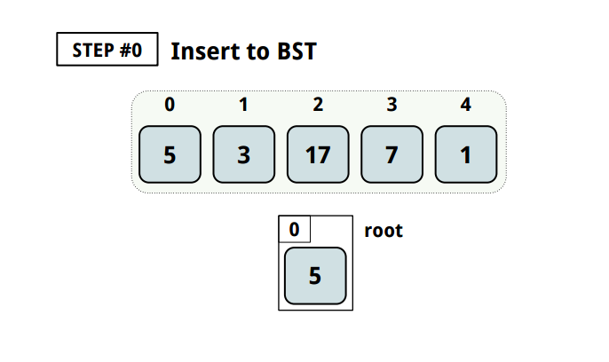

Binary search tree would **insert** like this:

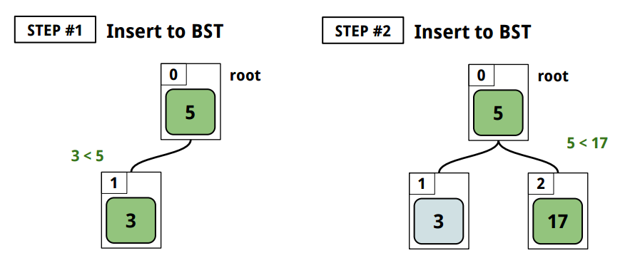


<br>

To implement a binary tree, you **define a root node to point to the topmost
node.** And **each node should recursively point to its left and right child
nodes,** like [here](http://play.golang.org/p/VAItm93ZHO) (originally from
[*goraph*](https://godoc.org/github.com/gyuho/goraph/bst)):

```go
package main

import "fmt"

// Tree contains a Root node of a binary search tree.
type Tree struct {
	Root *Node
}

// New returns a new Tree with its root Node.
func New(root *Node) *Tree {
	tr := &Tree{}
	tr.Root = root
	return tr
}

// Interface represents a single object in the tree.
type Interface interface {
	// Less returns true when the receiver item(key)
	// is less than the given(than) argument.
	Less(than Interface) bool
}

// Node is a Node and a Tree itself.
type Node struct {
	// Left is a left child Node.
	Left *Node

	Key Interface

	// Right is a right child Node.
	Right *Node
}

// NewNode returns a new Node.
func NewNode(key Interface) *Node {
	nd := &Node{}
	nd.Key = key
	return nd
}

func (tr *Tree) String() string {
	return tr.Root.String()
}

func (nd *Node) String() string {
	if nd == nil {
		return "[]"
	}
	s := ""
	if nd.Left != nil {
		s += nd.Left.String() + " "
	}
	s += fmt.Sprintf("%v", nd.Key)
	if nd.Right != nil {
		s += " " + nd.Right.String()
	}
	return "[" + s + "]"
}

// Insert inserts a Node to a Data without replacement.
func (tr *Tree) Insert(nd *Node) {
	if tr.Root == nd {
		return
	}
	tr.Root = tr.Root.insert(nd)
}

func (nd *Node) insert(node *Node) *Node {
	if nd == nil {
		return node
	}
	if nd.Key.Less(node.Key) {
		nd.Right = nd.Right.insert(node)
	} else {
		nd.Left = nd.Left.insert(node)
	}
	return nd
}

type nodeStruct struct {
	ID    string
	Value int
}

func (n nodeStruct) Less(b Interface) bool {
	return n.Value < b.(nodeStruct).Value
}

func main() {
	root := NewNode(nodeStruct{"A", 5})
	tr := New(root)
	tr.Insert(NewNode(nodeStruct{"B", 3}))
	tr.Insert(NewNode(nodeStruct{"C", 17}))
	fmt.Printf("%s\n", tr)
	// [[{B 3}] {A 5} [{C 17}]]
}
```

<br>
In C++, you would:

```cpp
// http://cslibrary.stanford.edu/110/BinaryTrees.html
#include <iostream>
using namespace std;

struct node { 
	int data; 
	struct node* left; 
	struct node* right; 
};

/* 
 Helper function that allocates a new node 
 with the given data and NULL left and right 
 pointers. 
*/ 
struct node* newNode(int data) { 
	// new is like 'malloc' that allocates memory
	struct node* node = new(struct node);
	node->data = data; 
	node->left = NULL; 
	node->right = NULL;
	return node; 
} 
 
/* 
 Give a binary search tree and a number, inserts a new node 
 with the given number in the correct place in the tree. 
 Returns the new root pointer which the caller should 
 then use (the standard trick to avoid using reference 
 parameters). 
*/ 
struct node* insert(struct node* node, int data) { 
	// 1. If the tree is empty, return a new, single node 
	if (node == NULL) { 
		return newNode(data) ; 
	}
	else
	{ 
		// 2. Otherwise, recur down the tree
		if (data <= node->data)
			node->left = insert(node->left, data); 
		else
			node->right = insert(node->right, data);

		// return the (unchanged) node pointer 
		return node;
	} 
} 

/* 
 Given a binary search tree, print out 
 its data elements in increasing 
 sorted order. 
*/ 
void printTree(struct node* node) { 
	if (node == NULL)
		return;
	printTree(node->left);
	printf("%d ", node->data);
	printTree(node->right);
} 

int main()
{
	node* root = newNode(2);
	insert(root, 3);
	insert(root, 1);
	insert(root, 4);
	printTree(root);
	// 1 2 3 4
	cout << endl;
}

```

[↑ top](#binary-search-tree)
<br><br><br><br>
<hr>


#### `bst`: search

Suppose a database of n items and one needs to search for a certain value. Then
time complexity of search is **_`O(n)`_**. But what if the *n* is very large?


In **Binary Search Tree**, we can **search** in **_logarithmic time O(log
n)_**, which is much faster than linear time search. A binary search tree keeps
**keys** in a **sorted order** maintaining its properties. **Search** only
requires a series of **binary** (*left* or *right*) decisions.

And here's how you get the time complexity *`O(log n)`*, which is the height of
a binary tree of *n* elements:

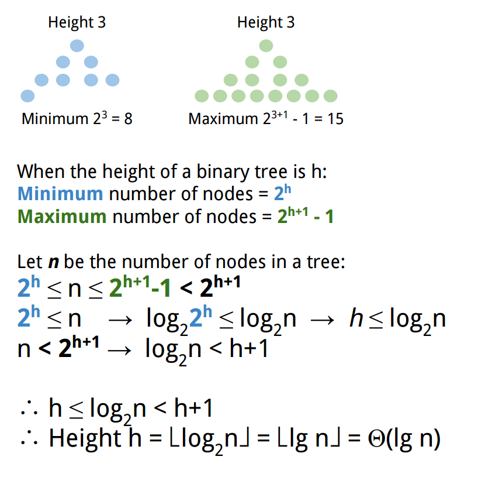

<br>

**Search** in *Binary Search Tree* takes in **_average case_**, **_`O(log
n)`_** = **height**:

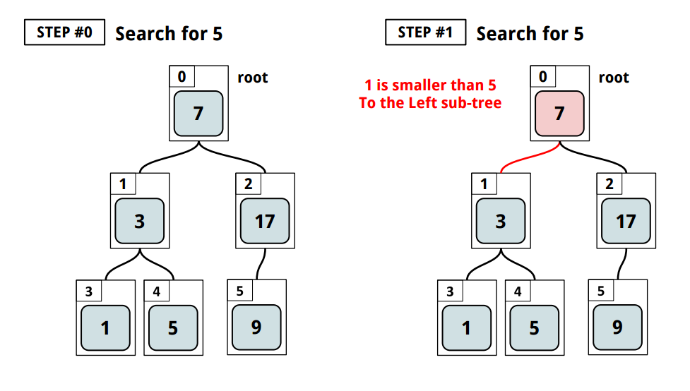
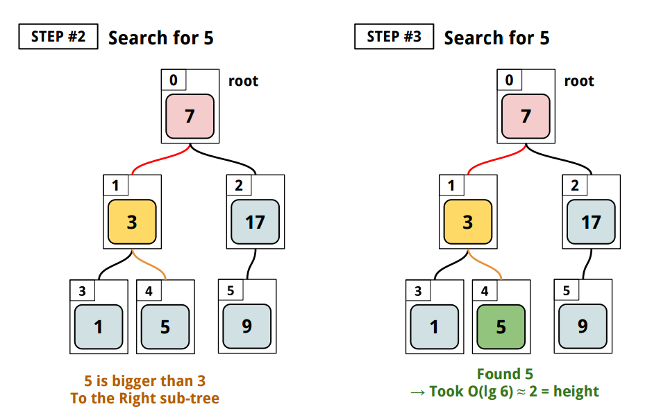


<br>

**HOWEVER,** note that *binary search tree* is **_not always balanced_**,
as here:


This is still a valid *binary search tree* but not a [*balanced binary
tree*](https://en.wikipedia.org/wiki/Self-balancing_binary_search_tree). Thus
the **worst case time complexity** of **search** is **_`O(n)`_**, not *`O(log
n)`*. Likewise **average time complexity** of *binary search tree*
**_insertion_** and **_deletion_** is **_`O(log n)`_**, *but* the **worst**
case is **_`O(n)`_**. [Here](http://play.golang.org/p/eSDmjnJOTO)'s an example:


```go
package main

import "fmt"

// Tree contains a Root node of a binary search tree.
type Tree struct {
	Root *Node
}

// New returns a new Tree with its root Node.
func New(root *Node) *Tree {
	tr := &Tree{}
	tr.Root = root
	return tr
}

// Interface represents a single object in the tree.
type Interface interface {
	// Less returns true when the receiver item(key)
	// is less than the given(than) argument.
	Less(than Interface) bool
}

// Node is a Node and a Tree itself.
type Node struct {
	// Left is a left child Node.
	Left *Node

	Key Interface

	// Right is a right child Node.
	Right *Node
}

// NewNode returns a new Node.
func NewNode(key Interface) *Node {
	nd := &Node{}
	nd.Key = key
	return nd
}

func (tr *Tree) String() string {
	return tr.Root.String()
}

func (nd *Node) String() string {
	if nd == nil {
		return "[]"
	}
	s := ""
	if nd.Left != nil {
		s += nd.Left.String() + " "
	}
	s += fmt.Sprintf("%v", nd.Key)
	if nd.Right != nil {
		s += " " + nd.Right.String()
	}
	return "[" + s + "]"
}

// Insert inserts a Node to a Tree without replacement.
func (tr *Tree) Insert(nd *Node) {
	if tr.Root == nd {
		return
	}
	tr.Root = tr.Root.insert(nd)
}

func (nd *Node) insert(node *Node) *Node {
	if nd == nil {
		return node
	}
	if nd.Key.Less(node.Key) {
		nd.Right = nd.Right.insert(node)
	} else {
		nd.Left = nd.Left.insert(node)
	}
	return nd
}

// Min returns the minimum key Node in the tree.
func (tr Tree) Min() *Node {
	nd := tr.Root
	if nd == nil {
		return nil
	}
	for nd.Left != nil {
		nd = nd.Left
	}
	return nd
}

// Max returns the maximum key Node in the tree.
func (tr Tree) Max() *Node {
	nd := tr.Root
	if nd == nil {
		return nil
	}
	for nd.Right != nil {
		nd = nd.Right
	}
	return nd
}

// Search does binary-search on a given key and returns the first Node with the key.
func (tr Tree) Search(key Interface) *Node {
	nd := tr.Root
	// just updating the pointer value (address)
	for nd != nil {
		if nd.Key == nil {
			break
		}
		switch {
		case nd.Key.Less(key):
			nd = nd.Right
		case key.Less(nd.Key):
			nd = nd.Left
		default:
			return nd
		}
	}
	return nil
}

// SearchChan does binary-search on a given key and return the first Node with the key.
func (tr Tree) SearchChan(key Interface, ch chan *Node) {
	searchChan(tr.Root, key, ch)
	close(ch)
}

func searchChan(nd *Node, key Interface, ch chan *Node) {
	// leaf node
	if nd == nil {
		return
	}
	// when equal
	if !nd.Key.Less(key) && !key.Less(nd.Key) {
		ch <- nd
		return
	}
	searchChan(nd.Left, key, ch)  // left
	searchChan(nd.Right, key, ch) // right
}

// SearchParent does binary-search on a given key and returns the parent Node.
func (tr Tree) SearchParent(key Interface) *Node {
	nd := tr.Root
	parent := new(Node)
	parent = nil
	// just updating the pointer value (address)
	for nd != nil {
		if nd.Key == nil {
			break
		}
		switch {
		case nd.Key.Less(key):
			parent = nd // copy the pointer(address)
			nd = nd.Right
		case key.Less(nd.Key):
			parent = nd // copy the pointer(address)
			nd = nd.Left
		default:
			return parent
		}
	}
	return nil
}

type nodeStruct struct {
	ID    string
	Value int
}

func (n nodeStruct) Less(b Interface) bool {
	return n.Value < b.(nodeStruct).Value
}

func main() {
	root := NewNode(nodeStruct{"A", 5})
	tr := New(root)
	tr.Insert(NewNode(nodeStruct{"B", 3}))
	tr.Insert(NewNode(nodeStruct{"C", 17}))
	fmt.Printf("%s\n", tr)
	// [[{B 3}] {A 5} [{C 17}]]

	fmt.Println(tr.Search(nodeStruct{"A", 5}))   // [[{B 3}] {A 5} [{C 17}]]
	fmt.Println(tr.Search(nodeStruct{Value: 3})) // [{B 3}]
	fmt.Println(tr.Search(nodeStruct{"C", 17}))  // [{C 17}]

	ch := make(chan *Node)
	go tr.SearchChan(nodeStruct{"A", 5}, ch)
	fmt.Println(<-ch) // [[{B 3}] {A 5} [{C 17}]]

	fmt.Println(tr.Max()) // [{C 17}]
	fmt.Println(tr.Min()) // [{B 3}]
}
```

<br>
In C++, you would:

```cpp
// http://cslibrary.stanford.edu/110/BinaryTrees.html
#include <iostream>
using namespace std;

struct node { 
	int data; 
	struct node* left; 
	struct node* right; 
};

/* 
 Helper function that allocates a new node 
 with the given data and NULL left and right 
 pointers. 
*/ 
struct node* newNode(int data) { 
	// new is like 'malloc' that allocates memory
	struct node* node = new(struct node);
	node->data = data; 
	node->left = NULL; 
	node->right = NULL;
	return node; 
} 
 
/* 
 Give a binary search tree and a number, inserts a new node 
 with the given number in the correct place in the tree. 
 Returns the new root pointer which the caller should 
 then use (the standard trick to avoid using reference 
 parameters). 
*/ 
struct node* insert(struct node* node, int data) { 
	// 1. If the tree is empty, return a new, single node 
	if (node == NULL) { 
		return newNode(data) ; 
	}
	else
	{ 
		// 2. Otherwise, recur down the tree
		if (data <= node->data)
			node->left = insert(node->left, data); 
		else
			node->right = insert(node->right, data);

		// return the (unchanged) node pointer 
		return node;
	} 
} 

/* 
 Given a binary search tree, print out 
 its data elements in increasing 
 sorted order. 
*/ 
void printTree(struct node* node) { 
	if (node == NULL)
		return;
	printTree(node->left);
	printf("%d ", node->data);
	printTree(node->right);
} 


/* 
 Given a binary tree, return true if a node 
 with the target data is found in the tree. Recurs 
 down the tree, chooses the left or right 
 branch by comparing the target to each node. 
*/ 
static int search(struct node* node, int target) { 
	// 1. Base case == empty tree 
	// in that case, the target is not found so return false 
	if (node == NULL) 
	{
		return false; 
	}
  	else
  	{
		// 2. see if found here 
		if (target == node->data)
			return true;
		else
			// 3. otherwise recur down the correct subtree 
			if (target < node->data)
				return search(node->left, target);
			else
				return search(node->right, target);  
  	}
} 

int main()
{
	node* root = newNode(2);
	insert(root, 3);
	insert(root, 1);
	insert(root, 4);
	printTree(root);
	// 1 2 3 4
	cout << endl;

	cout << "search: " << search(root, 4) << endl;
	// 1
}

```

[↑ top](#binary-search-tree)
<br><br><br><br>
<hr>


#### `bst`: traverse

[Here](http://play.golang.org/p/coQnnCrBV6)'s how you **traverse** the binary
search tree:

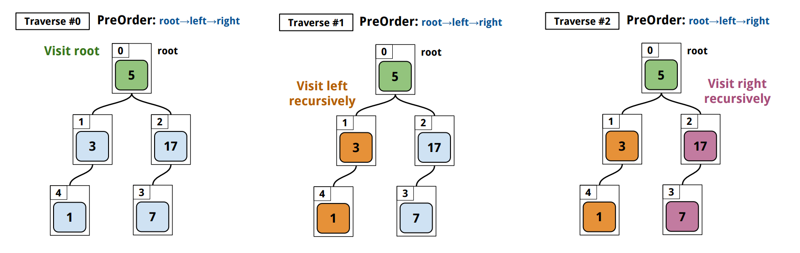
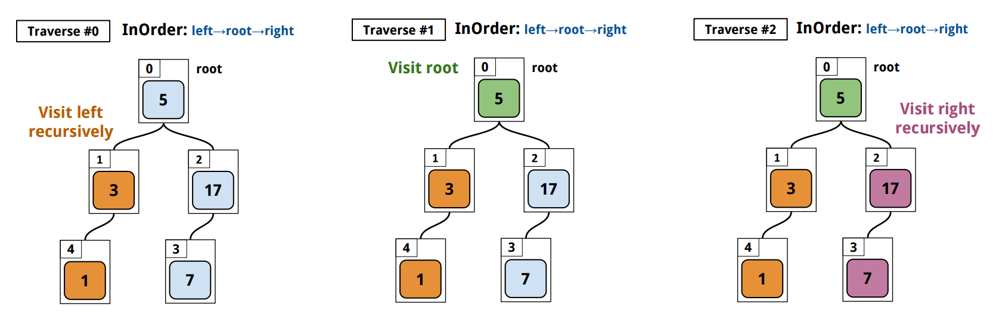
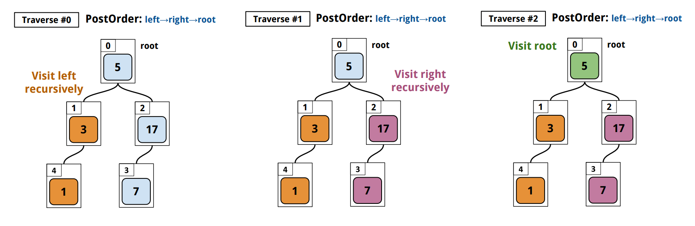
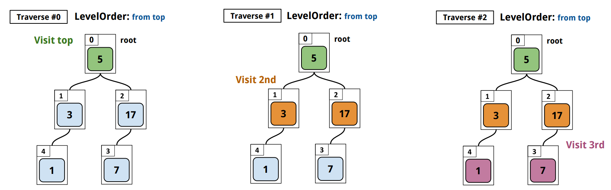

```go
package main

import (
	"bytes"
	"fmt"
)

// Tree contains a Root node of a binary search tree.
type Tree struct {
	Root *Node
}

// New returns a new Tree with its root Node.
func New(root *Node) *Tree {
	tr := &Tree{}
	tr.Root = root
	return tr
}

// Interface represents a single object in the tree.
type Interface interface {
	// Less returns true when the receiver item(key)
	// is less than the given(than) argument.
	Less(than Interface) bool
}

// Node is a Node and a Tree itself.
type Node struct {
	// Left is a left child Node.
	Left *Node

	Key Interface

	// Right is a right child Node.
	Right *Node
}

// NewNode returns a new Node.
func NewNode(key Interface) *Node {
	nd := &Node{}
	nd.Key = key
	return nd
}

func (tr *Tree) String() string {
	return tr.Root.String()
}

func (nd *Node) String() string {
	if nd == nil {
		return "[]"
	}
	s := ""
	if nd.Left != nil {
		s += nd.Left.String() + " "
	}
	s += fmt.Sprintf("%v", nd.Key)
	if nd.Right != nil {
		s += " " + nd.Right.String()
	}
	return "[" + s + "]"
}

// Insert inserts a Node to a Tree without replacement.
func (tr *Tree) Insert(nd *Node) {
	if tr.Root == nd {
		return
	}
	tr.Root = tr.Root.insert(nd)
}

func (nd *Node) insert(node *Node) *Node {
	if nd == nil {
		return node
	}
	if nd.Key.Less(node.Key) {
		nd.Right = nd.Right.insert(node)
	} else {
		nd.Left = nd.Left.insert(node)
	}
	return nd
}

// Min returns the minimum key Node in the tree.
func (tr Tree) Min() *Node {
	nd := tr.Root
	if nd == nil {
		return nil
	}
	for nd.Left != nil {
		nd = nd.Left
	}
	return nd
}

// Max returns the maximum key Node in the tree.
func (tr Tree) Max() *Node {
	nd := tr.Root
	if nd == nil {
		return nil
	}
	for nd.Right != nil {
		nd = nd.Right
	}
	return nd
}

// Search does binary-search on a given key and returns the first Node with the key.
func (tr Tree) Search(key Interface) *Node {
	nd := tr.Root
	// just updating the pointer value (address)
	for nd != nil {
		if nd.Key == nil {
			break
		}
		switch {
		case nd.Key.Less(key):
			nd = nd.Right
		case key.Less(nd.Key):
			nd = nd.Left
		default:
			return nd
		}
	}
	return nil
}

// SearchChan does binary-search on a given key and return the first Node with the key.
func (tr Tree) SearchChan(key Interface, ch chan *Node) {
	searchChan(tr.Root, key, ch)
	close(ch)
}

func searchChan(nd *Node, key Interface, ch chan *Node) {
	// leaf node
	if nd == nil {
		return
	}
	// when equal
	if !nd.Key.Less(key) && !key.Less(nd.Key) {
		ch <- nd
		return
	}
	searchChan(nd.Left, key, ch)  // left
	searchChan(nd.Right, key, ch) // right
}

// SearchParent does binary-search on a given key and returns the parent Node.
func (tr Tree) SearchParent(key Interface) *Node {
	nd := tr.Root
	parent := new(Node)
	parent = nil
	// just updating the pointer value (address)
	for nd != nil {
		if nd.Key == nil {
			break
		}
		switch {
		case nd.Key.Less(key):
			parent = nd // copy the pointer(address)
			nd = nd.Right
		case key.Less(nd.Key):
			parent = nd // copy the pointer(address)
			nd = nd.Left
		default:
			return parent
		}
	}
	return nil
}

type Int int

// Less returns true if int(a) < int(b).
func (a Int) Less(b Interface) bool {
	return a < b.(Int)
}

func main() {
	tr := New(NewNode(Int(5)))
	tr.Insert(NewNode(Int(3)))
	tr.Insert(NewNode(Int(17)))
	tr.Insert(NewNode(Int(7)))
	tr.Insert(NewNode(Int(1)))
	/*
	       5
	      / \
	     3   17
	    /    /
	   1    7
	*/

	fmt.Println("Min:", tr.Min().Key)             // Min: 1
	fmt.Println("Max:", tr.Max().Key)             // Max: 17
	fmt.Println("Search:", tr.Search(Int(7)).Key) // Search: 7

	buf1 := new(bytes.Buffer)
	ch1 := make(chan string)
	go tr.PreOrder(ch1) // root, left, right
	for {
		v, ok := <-ch1
		if !ok {
			break
		}
		buf1.WriteString(v)
		buf1.WriteString(" ")
	}
	fmt.Println("PreOrder:", buf1.String()) // PreOrder: 5 3 1 17 7

	buf2 := new(bytes.Buffer)
	ch2 := make(chan string)
	go tr.InOrder(ch2) // left, root, right
	for {
		v, ok := <-ch2
		if !ok {
			break
		}
		buf2.WriteString(v)
		buf2.WriteString(" ")
	}
	fmt.Println("InOrder:", buf2.String()) // 1 3 7 17 5

	buf3 := new(bytes.Buffer)
	ch3 := make(chan string)
	go tr.PostOrder(ch3) // left, right, root
	for {
		v, ok := <-ch3
		if !ok {
			break
		}
		buf3.WriteString(v)
		buf3.WriteString(" ")
	}
	fmt.Println("PostOrder:", buf3.String()) // 1 3 7 17 5

	buf4 := new(bytes.Buffer)
	nodes4 := tr.LevelOrder() // from top-level
	for _, v := range nodes4 {
		buf4.WriteString(fmt.Sprintf("%v ", v.Key))
	}
	fmt.Println("LevelOrder:", buf4.String()) // 5 3 17 1 7

	tr2 := New(NewNode(Int(5)))
	tr2.Insert(NewNode(Int(3)))
	tr2.Insert(NewNode(Int(17)))
	tr2.Insert(NewNode(Int(7)))
	tr2.Insert(NewNode(Int(1)))

	fmt.Println("ComparePreOrder:", ComparePreOrder(tr, tr2))   // true
	fmt.Println("CompareInOrder:", CompareInOrder(tr, tr2))     // true
	fmt.Println("ComparePostOrder:", ComparePostOrder(tr, tr2)) // true
}

// PreOrder traverses from Root, Left-SubTree, and Right-SubTree. (DFS)
func (tr *Tree) PreOrder(ch chan string) {
	preOrder(tr.Root, ch)
	close(ch)
}

func preOrder(nd *Node, ch chan string) {
	// leaf node
	if nd == nil {
		return
	}
	ch <- fmt.Sprintf("%v", nd.Key) // root
	preOrder(nd.Left, ch)           // left
	preOrder(nd.Right, ch)          // right
}

// ComparePreOrder returns true if two Trees are same with PreOrder.
func ComparePreOrder(t1, t2 *Tree) bool {
	ch1, ch2 := make(chan string), make(chan string)
	go t1.PreOrder(ch1)
	go t2.PreOrder(ch2)
	for {
		v1, ok1 := <-ch1
		v2, ok2 := <-ch2
		if v1 != v2 || ok1 != ok2 {
			return false
		}
		if !ok1 {
			break
		}
	}
	return true
}

// InOrder traverses from Left-SubTree, Root, and Right-SubTree. (DFS)
func (tr *Tree) InOrder(ch chan string) {
	inOrder(tr.Root, ch)
	close(ch)
}

func inOrder(nd *Node, ch chan string) {
	// leaf node
	if nd == nil {
		return
	}
	inOrder(nd.Left, ch)            // left
	ch <- fmt.Sprintf("%v", nd.Key) // root
	inOrder(nd.Right, ch)           // right
}

// CompareInOrder returns true if two Trees are same with InOrder.
func CompareInOrder(t1, t2 *Tree) bool {
	ch1, ch2 := make(chan string), make(chan string)
	go t1.InOrder(ch1)
	go t2.InOrder(ch2)
	for {
		v1, ok1 := <-ch1
		v2, ok2 := <-ch2
		if v1 != v2 || ok1 != ok2 {
			return false
		}
		if !ok1 {
			break
		}
	}
	return true
}

// PostOrder traverses from Left-SubTree, Right-SubTree, and Root.
func (tr *Tree) PostOrder(ch chan string) {
	postOrder(tr.Root, ch)
	close(ch)
}

func postOrder(nd *Node, ch chan string) {
	// leaf node
	if nd == nil {
		return
	}
	postOrder(nd.Left, ch)          // left
	postOrder(nd.Right, ch)         // right
	ch <- fmt.Sprintf("%v", nd.Key) // root
}

// ComparePostOrder returns true if two Trees are same with PostOrder.
func ComparePostOrder(t1, t2 *Tree) bool {
	ch1, ch2 := make(chan string), make(chan string)
	go t1.PostOrder(ch1)
	go t2.PostOrder(ch2)
	for {
		v1, ok1 := <-ch1
		v2, ok2 := <-ch2
		if v1 != v2 || ok1 != ok2 {
			return false
		}
		if !ok1 {
			break
		}
	}
	return true
}

// LevelOrder traverses the Tree with Breadth First Search.
// (http://en.wikipedia.org/wiki/Tree_traversal#Breadth-first_2)
//
//	levelorder(root)
//	  q = empty queue
//	  q.enqueue(root)
//	  while not q.empty do
//	    node := q.dequeue()
//	    visit(node)
//	    if node.left ≠ null then
//	      q.enqueue(node.left)
//	    if node.right ≠ null then
//	      q.enqueue(node.right)
//
func (tr *Tree) LevelOrder() []*Node {
	visited := []*Node{}
	queue := []*Node{tr.Root}
	for len(queue) != 0 {
		nd := queue[0]
		queue = queue[1:len(queue):len(queue)]
		visited = append(visited, nd)
		if nd.Left != nil {
			queue = append(queue, nd.Left)
		}
		if nd.Right != nil {
			queue = append(queue, nd.Right)
		}
	}
	return visited
}
```

[↑ top](#binary-search-tree)
<br><br><br><br>
<hr>


#### `bst`: delete

<br>

- `case #1`: **_node has only one child_**
	- *Update its parent node.*
	- *Set the node to `nil`.*
- `case #2`: **_node has two children_**
	- *Get Max/Min of Left/Right sub-tree to get `ReplacingNode`.*
	- *Update `ReplacingNode`'s child node.*
	- *Update `ReplacingNode`'s parent node.*
	- *Handle the inherited, recursive pointers.*
	- *Set the node to `nil`.*
- `case #3`: **_node has no children_**
	- *Set the node to `nil`.*
- `case #4`: **_node is the root node of the tree_**
	- *Run the same algorithm as above.*
	- *Update tree's root node.*
	- *Set the node to `nil`.*

<br>


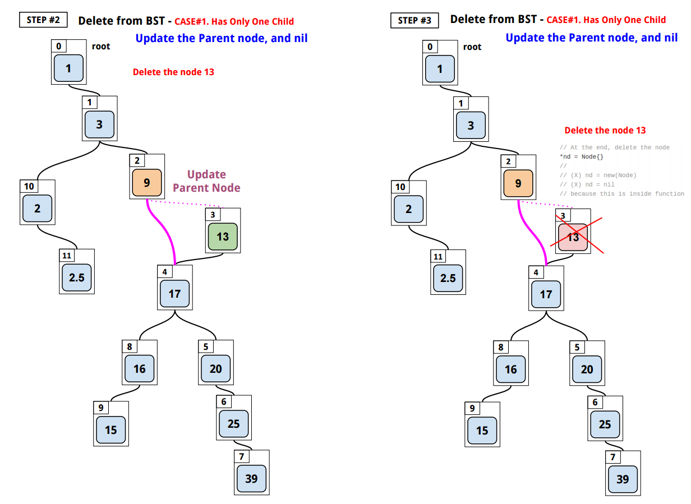
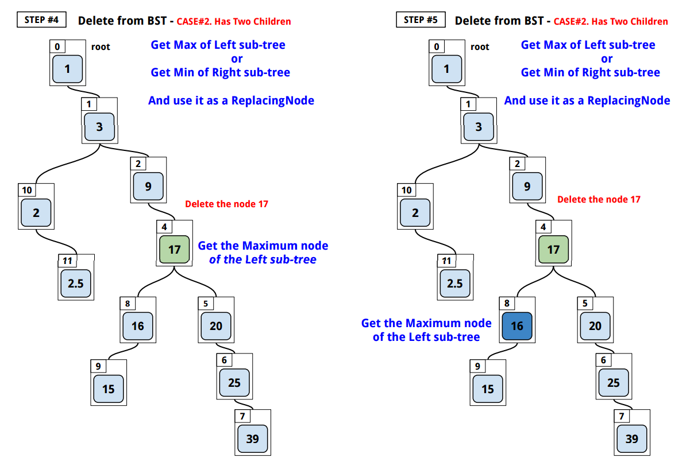
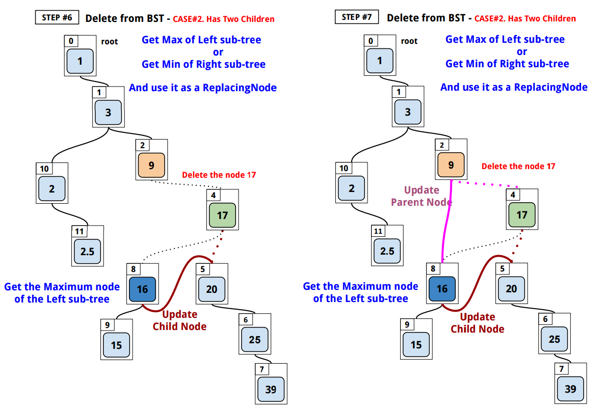
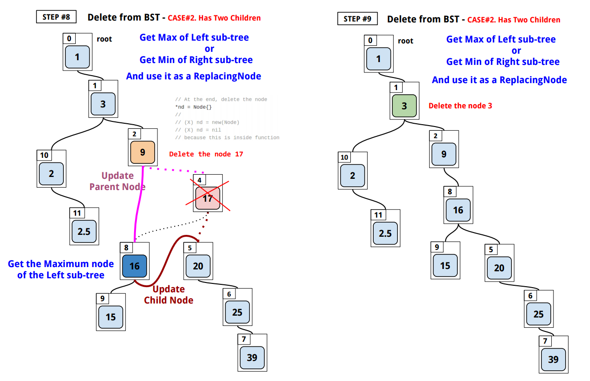
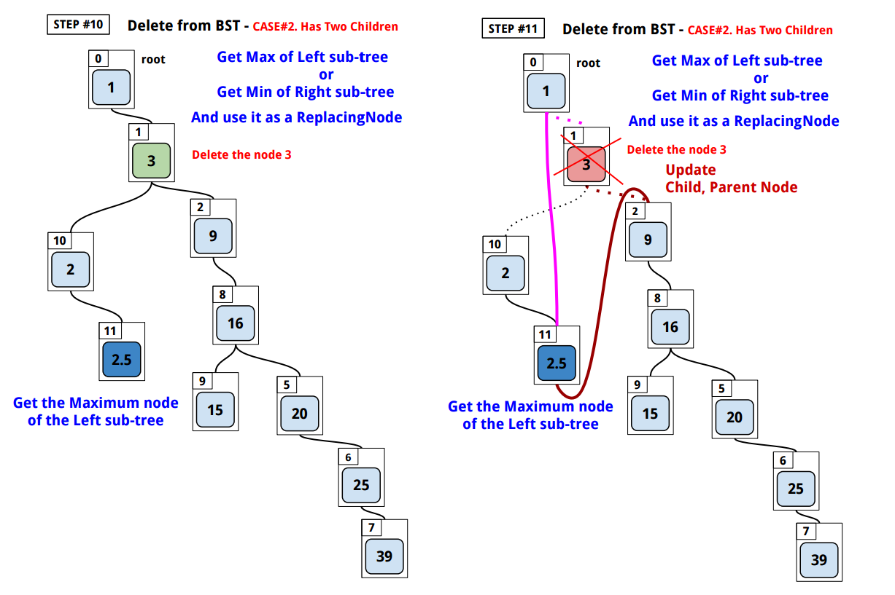
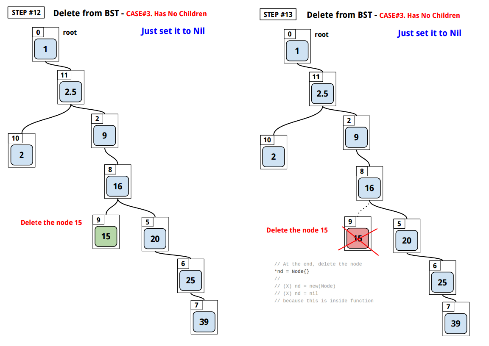
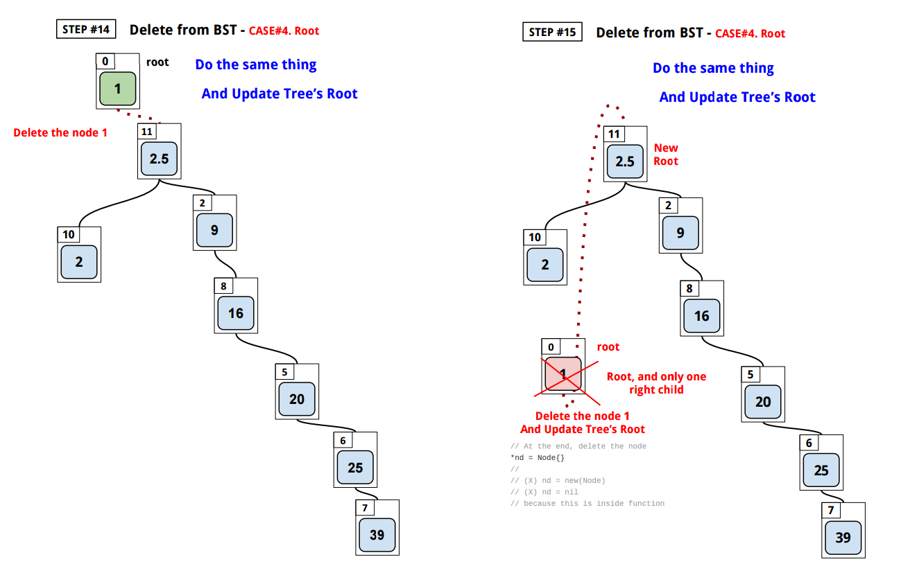
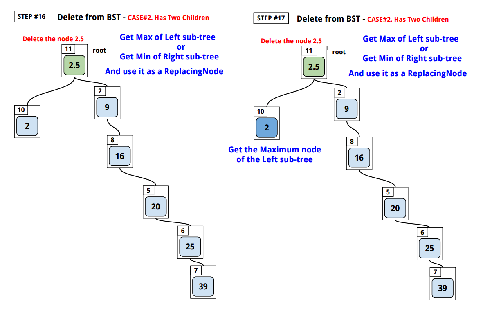
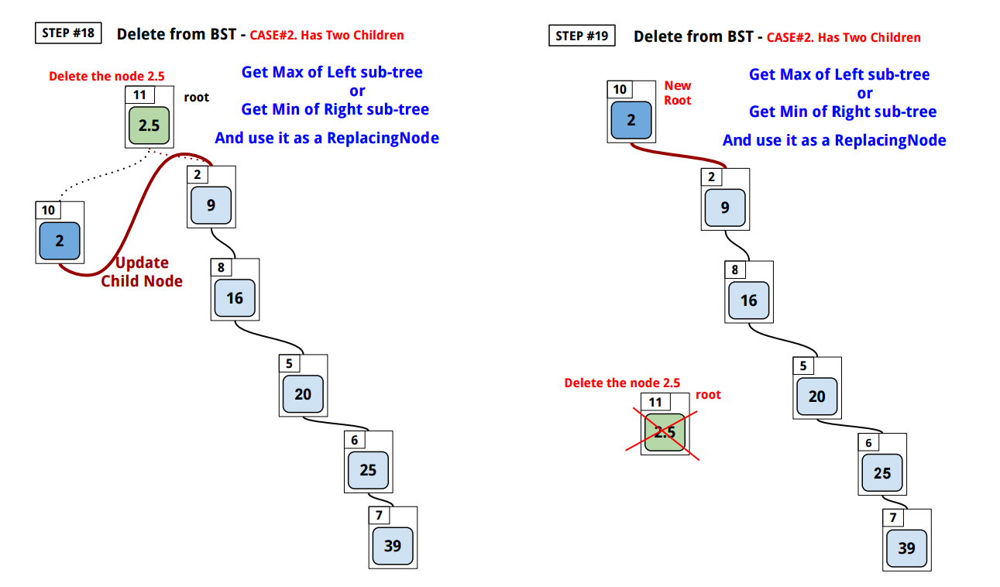


<br>

[Here](http://play.golang.org/p/ARE3v_ImGZ)'s how `bst`
deletes a `Node` from a tree:


```go
package main

import "fmt"

// Tree contains a Root node of a binary search tree.
type Tree struct {
	Root *Node
}

// New returns a new Tree with its root Node.
func New(root *Node) *Tree {
	tr := &Tree{}
	tr.Root = root
	return tr
}

// Interface represents a single object in the tree.
type Interface interface {
	// Less returns true when the receiver item(key)
	// is less than the given(than) argument.
	Less(than Interface) bool
}

// Node is a Node and a Tree itself.
type Node struct {
	// Left is a left child Node.
	Left *Node

	Key Interface

	// Right is a right child Node.
	Right *Node
}

// NewNode returns a new Node.
func NewNode(key Interface) *Node {
	nd := &Node{}
	nd.Key = key
	return nd
}

func (tr *Tree) String() string {
	return tr.Root.String()
}

func (nd *Node) String() string {
	if nd == nil {
		return "[]"
	}
	s := ""
	if nd.Left != nil {
		s += nd.Left.String() + " "
	}
	s += fmt.Sprintf("%v", nd.Key)
	if nd.Right != nil {
		s += " " + nd.Right.String()
	}
	return "[" + s + "]"
}

// Insert inserts a Node to a Tree without replacement.
func (tr *Tree) Insert(nd *Node) {
	if tr.Root == nd {
		return
	}
	tr.Root = tr.Root.insert(nd)
}

func (nd *Node) insert(node *Node) *Node {
	if nd == nil {
		return node
	}
	if nd.Key.Less(node.Key) {
		nd.Right = nd.Right.insert(node)
	} else {
		nd.Left = nd.Left.insert(node)
	}
	return nd
}

// Min returns the minimum key Node in the tree.
func (tr Tree) Min() *Node {
	nd := tr.Root
	if nd == nil {
		return nil
	}
	for nd.Left != nil {
		nd = nd.Left
	}
	return nd
}

// Max returns the maximum key Node in the tree.
func (tr Tree) Max() *Node {
	nd := tr.Root
	if nd == nil {
		return nil
	}
	for nd.Right != nil {
		nd = nd.Right
	}
	return nd
}

// Search does binary-search on a given key and returns the first Node with the key.
func (tr Tree) Search(key Interface) *Node {
	nd := tr.Root
	// just updating the pointer value (address)
	for nd != nil {
		if nd.Key == nil {
			break
		}
		switch {
		case nd.Key.Less(key):
			nd = nd.Right
		case key.Less(nd.Key):
			nd = nd.Left
		default:
			return nd
		}
	}
	return nil
}

// SearchChan does binary-search on a given key and return the first Node with the key.
func (tr Tree) SearchChan(key Interface, ch chan *Node) {
	searchChan(tr.Root, key, ch)
	close(ch)
}

func searchChan(nd *Node, key Interface, ch chan *Node) {
	// leaf node
	if nd == nil {
		return
	}
	// when equal
	if !nd.Key.Less(key) && !key.Less(nd.Key) {
		ch <- nd
		return
	}
	searchChan(nd.Left, key, ch)  // left
	searchChan(nd.Right, key, ch) // right
}

// SearchParent does binary-search on a given key and returns the parent Node.
func (tr Tree) SearchParent(key Interface) *Node {
	nd := tr.Root
	parent := new(Node)
	parent = nil
	// just updating the pointer value (address)
	for nd != nil {
		if nd.Key == nil {
			break
		}
		switch {
		case nd.Key.Less(key):
			parent = nd // copy the pointer(address)
			nd = nd.Right
		case key.Less(nd.Key):
			parent = nd // copy the pointer(address)
			nd = nd.Left
		default:
			return parent
		}
	}
	return nil
}

type Float float64

func (a Float) Less(b Interface) bool {
	return a < b.(Float)
}

func main() {
	root := NewNode(Float(1))
	tr := New(root)

	slice := []float64{3, 9, 13, 17, 20, 25, 39, 16, 15, 2, 2.5}
	for _, num := range slice {
		tr.Insert(NewNode(Float(num)))
	}
	fmt.Printf("%s\n", tr)
	// [1 [[2 [2.5]] 3 [9 [13 [[[15] 16] 17 [20 [25 [39]]]]]]]]

	fmt.Println(tr.Search(Float(20)))
	// [20 [25 [39]]]

	fmt.Println(tr.Max().Key)
	// 39

	fmt.Println(tr.Min().Key)
	// 1

	fmt.Println(tr.SearchParent(Float(16)).Key)
	// 17

	fmt.Println(tr.SearchParent(Float(16)).Key)
	// 17

	fmt.Println()
	deletes := []float64{13, 17, 3, 15, 1, 2.5}
	for _, num := range deletes {
		fmt.Println("Deleting", num)
		tr.Delete(Float(num))
		fmt.Println("Deleted", num, ":", tr)
		fmt.Println()
	}
	/*
	   Deleting 13
	   Deleted 13 : [1 [[2 [2.5]] 3 [9 [[[15] 16] 17 [20 [25 [39]]]]]]]

	   Deleting 17
	   Deleted 17 : [1 [[2 [2.5]] 3 [9 [[15] 16 [20 [25 [39]]]]]]]

	   Deleting 3
	   Deleted 3 : [1 [[2] 2.5 [9 [[15] 16 [20 [25 [39]]]]]]]

	   Deleting 15
	   Deleted 15 : [1 [[2] 2.5 [9 [16 [20 [25 [39]]]]]]]

	   Deleting 1
	   Deleted 1 : [[2] 2.5 [9 [16 [20 [25 [39]]]]]]

	   Deleting 2.5
	   Deleted 2.5 : [2 [9 [16 [20 [25 [39]]]]]]
	*/
}

// Delete deletes a Node from a tree.
// It returns nil if it does not exist in the tree.
func (tr *Tree) Delete(key Interface) Interface {
	if key == nil {
		return nil
	}
	nd := tr.Search(key)
	if nd == nil {
		return nil
	}
	parent := tr.SearchParent(key)

	// you need to dereference the pointer
	// and update with a value
	// in order to change the original struct

	if nd.Left != nil && nd.Right != nil {
		// if two children

		// #1. Find the node to substitute
		// the to-be-deleted node
		//
		// either get the biggest of left sub-tree
		tmp := new(Tree)
		tmp.Root = nd.Left
		tmpNode := tmp.Max()
		//
		// OR
		//
		// get the smallest of right sub-tree
		// tmp := new(Data)
		// tmp.Root = nd.Right
		// tmpNode := nd.Right.Min()
		//
		replacingNode := tr.Search(tmpNode.Key)
		parentOfReplacingNode := tr.SearchParent(replacingNode.Key)

		// order matters!
		if replacingNode.Key.Less(nd.Key) {
			// replacing with the left child
			replacingNode.Right = nd.Right

			// inherit the sub-tree
			if nd.Left.Key.Less(replacingNode.Key) ||
				replacingNode.Key.Less(nd.Left.Key) {
				// if different
				replacingNode.Left = nd.Left

				// destroy the old pointer in sub-tree
				if parentOfReplacingNode.Key.Less(replacingNode.Key) {
					// deleting right child of parentOfReplacingNode
					parentOfReplacingNode.Right = nil
				} else {
					// deleting left child of parentOfReplacingNode
					parentOfReplacingNode.Left = nil
				}
			}

		} else {
			// replacing with the right child
			replacingNode.Left = nd.Left

			// inherit the sub-tree
			if nd.Right.Key.Less(replacingNode.Key) ||
				replacingNode.Key.Less(nd.Right.Key) {

				// destroy the old pointer in sub-tree
				if parentOfReplacingNode.Key.Less(replacingNode.Key) {
					// deleting right child of parentOfReplacingNode
					parentOfReplacingNode.Right = nil
				} else {
					// deleting left child of parentOfReplacingNode
					parentOfReplacingNode.Left = nil
				}
			}
		}

		// #2. Update the parent, child node
		if parent == nil {
			// in case of deleting the root Node
			tr.Root = replacingNode
		} else {
			if parent.Key.Less(nd.Key) {
				// deleting right child of parent
				parent.Right = replacingNode
			} else {
				// deleting left child of parent
				parent.Left = replacingNode
			}
		}

	} else if nd.Left != nil && nd.Right == nil {
		// only left child
		// #1. Update the parent node
		if parent == nil {
			// in case of deleting the root Node
			tr.Root = nd.Left
		} else {
			if parent.Key.Less(nd.Key) {
				// right child of parent
				parent.Right = nd.Left
			} else {
				// left child of parent
				parent.Left = nd.Left
			}
		}

	} else if nd.Left == nil && nd.Right != nil {
		// only right child
		// #1. Update the parent node
		if parent == nil {
			// in case of deleting the root Node
			tr.Root = nd.Right
		} else {
			if parent.Key.Less(nd.Key) {
				// right child of parent
				parent.Right = nd.Right
			} else {
				// left child of parent
				parent.Left = nd.Right
			}
		}
	} else {
		// no child
		if parent == nil {
			// in case of deleting the root Node
			tr.Root = nil
		} else {
			if parent.Key.Less(nd.Key) {
				// right child of parent
				parent.Right = nil
			} else {
				// left child of parent
				parent.Left = nil
			}
		}
	}

	k := nd.Key

	// At the end, delete the node
	// this is not necessary because it will be
	// garbage collected
	*nd = Node{}

	// because this is inside function
	// this won't change the actual node
	//
	// nd = new(Node)
	// nd = nil

	return k
}
```

[↑ top](#binary-search-tree)
<br><br><br><br>
<hr>
