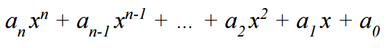
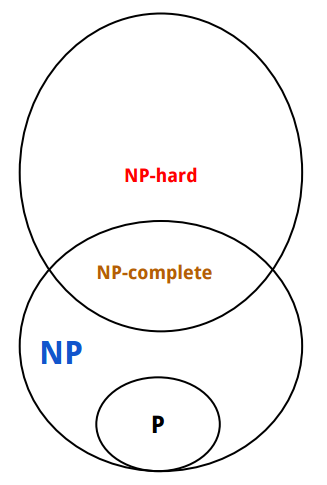

[*back to contents*](https://github.com/gyuho/learn#contents)
<br>

# Computational complexity, NP

- [Reference](#reference)
- [Computational complexity](#computational-complexity)
- [NP](#np)

[↑ top](#computational-complexity-np)
<br><br><br><br>
<hr>


#### Reference

- [Computational complexity theory](https://en.wikipedia.org/wiki/Computational_complexity_theory)
- [Big O notation](https://en.wikipedia.org/wiki/Big_O_notation)
- [NP (complexity)](https://en.wikipedia.org/wiki/NP_(complexity))
- [Stanford cs161 lecture note](http://web.stanford.edu/class/archive/cs/cs161/cs161.1138/lectures/19/Small19.pdf)

[↑ top](#computational-complexity-np)
<br><br><br><br>
<hr>


#### Computational complexity

| Notation  |  Greek  |     Bound     |
|:---------:|:-------:|:-------------:|
|    `Ω`    | 'Omega' |  lower bound  |
|    `Θ`    | 'Theta' |  tight bound  |
|    `O`    | 'Oh'    |  upper bound  |
|  `O(1)`   |    .    | constant time |

<br>
For example:

```
# find x from the list of n elements
def find(x):
	for k in [1,2,3,...,n]:
		if k == x:
			return True
```

The worst-case complexity of the `find` algorithm would be `O(n)`
directly proportional to the number of elements in the list.
When we say an algorithm's upper bound is `O(n)` (linear), 
it is also quadratic, cubic, polynomial, exponential, and so on.
`find` can take only `O(1)` if the list is sorted. It can also
take `O(n^2)` if it does not iterate in order. For the sufficiently
large inputs, `find` function with simple iteration computes *no faster
than* the **upper bound `O(n)`** when `n` is the size of the inputs.

[↑ top](#computational-complexity-np)
<br><br><br><br>
<hr>


#### NP

An algorithm is **efficient** if and only if it runs in **polynomial time**.
And a polynomial can be:



- *Intractable problem* takes exponential time or more, so the solution
  is considered **inefficient**.
- A problem is tractable if and only if there is an **efficient** algorithm
  soluiton: if the algorithm solves in polynomial time,
  the problem is tractable.

`NP` refers to **nondeterministic polynomial time**.
The class `NP` refers to all decision problems (yes/no answer)
where *yes* can be **verrified** efficiently.
So if a problem is `NP`, the problem can be solved in polynomial time (`O(n^k)`)
with a [**non-deterministic Turing machine**](https://en.wikipedia.org/wiki/Non-deterministic_Turing_machine).
All tractable decision problems belong to `NP` class.

<br>
`P` refers to a polynomial time solution of a problem.

<br>
`NP-complete` problems are the hardest of `NP` problems:
- Either *every* `NP-complete` problem is tractable
- or no `NP-complete` problem is tractable.

<br>
`NP-hard` problems are at least as hard as every problem in `NP`.
No polynomial-time algorithm is found for any `NP-hard` problems.




[↑ top](#computational-complexity-np)
<br><br><br><br>
<hr>
