[*back to contents*](https://github.com/gyuho/learn#contents)<br>

# Distributed systems, Paxos, Raft, etcd

**DISCLAIMER**: This is a personal learning log. It's very repetitive
and unorganized.

- [Reference](#reference)
- [Distributed systems, consensus algorithm](#distributed-systems-consensus-algorithm)
- [Raft: introduction](#raft-introduction)
- [Raft: terminology](#raft-terminology)
- [Raft: properties](#raft-properties)
- [Raft: leader election](#raft-leader-election)
- [Raft: restrictions on `leader election`](#raft-restrictions-on-leader-election)
- [Raft: restrictions on `log commit`](#raft-restrictions-on-log-commit)
- [Raft: log replication](#raft-log-replication)
- [Raft: log consistency](#raft-log-consistency)
- [Raft: old leader](#raft-old-leader)
- [Raft: safety](#raft-safety)
- [Raft: follower and candidate crashes](#raft-follower-and-candidate-crashes)
- [Raft: client interaction](#raft-client-interaction)
- [Raft: log compaction](#raft-log-compaction)
- [Raft: configuration(membership) changes](#raft-configurationmembership-changes)
- [`etcd`: storage](#etcd-storage)
- [`etcd`: server](#etcd-server)

[↑ top](#distributed-systems-paxos-raft-etcd)
<br><br><br><br><hr>


#### Reference

- [*Raft by Diego Ongaro and John Ousterhout*](https://ramcloud.stanford.edu/~ongaro/userstudy/)
- [`ongardie/dissertation`](https://github.com/ongardie/dissertation)
- [`etcd`](https://github.com/coreos/etcd)
- [Linearizability versus Serializability](http://www.bailis.org/blog/linearizability-versus-serializability/)
- [Consensus (computer science)](https://en.wikipedia.org/wiki/Consensus_(computer_science))
- [Deconstructing the CAP theorem for CM and DevOps](http://markburgess.org/blog_cap.html)
- [Raft Protocol Overview by Consul](https://www.consul.io/docs/internals/consensus.html)
- [aphyr.com/posts](https://aphyr.com/posts)
- [CAP FAQ](https://github.com/henryr/cap-faq)

[↑ top](#distributed-systems-paxos-raft-etcd)
<br><br><br><br><hr>


#### Distributed systems, consensus algorithm

> In distributed computing, a problem is divided into many tasks, each of which
> is solved by one or more computers, which communicate with each other by
> message passing.
>
> A distributed system may have a common goal, such as solving a large
> computational problem. Alternatively, each computer may have its own user
> with individual needs, and the **purpose of the distributed system** is to
> **coordinate the use of shared resources** or **provide communication
> services** to the users.
> 
> [*Distributed computing*](https://en.wikipedia.org/wiki/Distributed_computing)
> *by Wikipedia*

- **In parallel computing**, multiple processors may have access to a globally
  **shared memory to exchange data between processors**.
- **In distributed computing**, each processor has its **own private memory**
  exchanging data by **passing messages between processors**.

<br>
> A fundamental problem in **distributed computing** is to achieve overall **system
> reliability** in the presence of a number of *faulty processes*. This often
> requires processes to agree on some data value that is needed during
> computation. Examples of applications of **consensus** include **whether to commit
> a transaction to a database, agreeing on the identity of a leader, state
> machine replication, and atomic broadcasts.**
>
> [*Consensus*](https://en.wikipedia.org/wiki/Consensus_(computer_science))
> *by Wikipedia*

A process can fail either from a *crash* or a *loss of the process presenting
different symptoms to different observers*
([*Byzantine fault*](https://en.wikipedia.org/wiki/Byzantine_failure)).
The consensus algorithm handles these kinds of *faulty processes* in
distributed computing systems, and keeps data consistent even when it loses one
of its communications. Distributed systems with consensus algorithms (Raft
paper §2):

- ensure *safety*, which means it will never return incorrect results, under
  all non-Byzantine conditions, such as network delays, partitions, packet
  loss, etc. 
- *fully available (functional)* as long as any majority of servers are
  operational and communicate with each other and clients. Stopped servers are
  considered failing, but they could recover from the states stored in stable
  storage and rejoin the cluster.
- a command can complete as soon as the quorum has responded to a single round
  of remote procedure calls, so that the minority does not affect the overall
  performance.

<br>
An ultimate **consensus algorithm** should achieve:

- **_Consistency_**.
- **_Availability_**.
- **_Partition tolerance_**.

[CAP theorem](https://en.wikipedia.org/wiki/CAP_theorem) states that
it is impossible that a distributed computer system simultaneously satisfies
them all. For example, [**_etcd_**](https://github.com/coreos/etcd) guarantees
*Consistency* and *Partition tolerance*, with **(High) Availability**.

<br><br>
One of the most important properties of distributed computing is
*linearizability*:

> In concurrent programming, an operation (or set of operations) is atomic,
> **linearizable**, indivisible or uninterruptible if it appears to the rest
> of the system to occur instantaneously. **Atomicity is a guarantee of
> isolation from concurrent processes**. Additionally, **atomic operations**
> commonly have a **succeed-or-fail** definition—they either successfully
> change the state of the system, or have no apparent effect.
>
> [*Linearizability*](https://en.wikipedia.org/wiki/Linearizability)
> *by Wikipedia*

<br>
> **Linearizability** provides **the illusion that each operation applied by
> concurrent processes takes effect instantaneously at some point between
> its invocation and its response**, implying that the meaning of a concurrent
> object's operations can be given by pre- and post-conditions.
>
> [*Linearizability: A Correct Condition for Concurrent
> Objects*](https://cs.brown.edu/~mph/HerlihyW90/p463-herlihy.pdf)

<br>
In other words, once an operation finishes, every other machine in the cluster
must see it. While operations are concurrent in distributed system, every
machine sees each operation in the same linear order. Think of
*linearizability* as *atomic consistency* with an atomic operation where a set
of operations occur atomically with respect to other parts of the system.

*Linearizability* is *local*. Since an operation on each object is linearized,
all operations in the system are linearizable. *Linearizability* is
**non-blocking**, since a pending invocation does not need to wait for other
pending invocation to complete, or an object with a pending operation does
not block the total operation, which makes it suitable for concurrent and
real-time systems.

<br>
*Serializability* is *global* because it's a property of an entire history of
operations:

> Serializability is a guarantee about transactions, or groups of one or more
> operations over one or more objects. It guarantees that the execution of a
> **set of transactions (usually containing read and write operations) over
> multiple items is equivalent to some serial execution (total ordering) of
> the transactions**.
> 
> [*Serializability*](http://www.bailis.org/blog/linearizability-versus-serializability/)
> *by Peter Bailis*
>
> 
> a transaction schedule is **serializable if its outcome (e.g., the resulting
> database state) is equal to the outcome of its transactions executed
> serially, i.e., sequentially without overlapping in time**. *Transactions are
> normally executed concurrently (they overlap)*, since this is the most
> efficient way. **Serializability is the major correctness criterion for
> concurrent transactions' executions**. It is considered the highest level of
> isolation between transactions, and plays an essential role in concurrency
> control. As such it is supported in all general purpose database systems.
>
> [*Serializability*](https://en.wikipedia.org/wiki/Serializability) *by
> Wikipedia*

<br><br>
**Each linearizable operation applied by concurrent processes
takes effect instantaneously at some point between its invocation and its
response**. It's an **atomic**, **_or linearizable_**, operation.

<br>
But what if a system cannot satisfy this requirement?

**Sequential consistency** is another consistency model, *weaker than
linearizability*. Each operation can take effect **before its invocation**
or **after its response** (*not necessarily between its invocation and its
response as in linearizability*). And it is still considered *consistent*:

> Many caches also behave like sequentially consistent systems. If I write a
> tweet on Twitter, or post to Facebook, it **takes time to percolate through
> layers of caching systems**. **Different users will see my message at
> different times--but each user will see my operations in order**. Once seen,
> a post shouldn't disappear. **If I write multiple comments, they'll become
> visible sequentially, not out of order**.
>
> [*Sequential consistency*](https://aphyr.com/posts/313-strong-consistency-models)
> *by aphyr*

<br>
[**_etcd_**](https://github.com/coreos/etcd) is a **distributed consistent
key-value** store,
[*`/etc`*](http://www.tldp.org/LDP/Linux-Filesystem-Hierarchy/html/etc.html)
distributed. The directory `/etc` in Linux contains system configuration files
for program controls. `etcd` is a distributed store for these system
configurations. There are many
[key/value databases](http://nosql-database.org/). For example,
[**_Redis_**](http://redis.io/) is an **key-value** cache and store, a data
structure server for **_RE_**mote **_DI_**ctionary **_S_**erver.

**_Redis_** and **_`etcd`_** have the same premise: **_key-value store_**.
But they are different in that `etcd` is designed for distributed system and
for storing system configurations.

<br>
The goal of `etcd` as a **distributed consistent key-value store**
is **Sequential Consistency**:

> `etcd` tries to ensure **sequential consistency**, which means each replica
> have the same command execution ordering.
>
> [*Xiang Li*](https://github.com/coreos/etcd/issues/741)

<br>
Now you have this distributed key-value storage `etcd`. Then what can we do
with it? [*Kubernetes*](http://kubernetes.io) uses `etcd` to manage a cluster
of application containers in a distributed system.

[↑ top](#distributed-systems-paxos-raft-etcd)
<br><br><br><br><hr>


#### Raft: introduction

To make your program reliable, you would:
- execute program in a collection of machines (distributed system).
- ensure that they all run exactly the same way (consistency).

This is the definition of **replicated state machine**. And a *state machine*
can be any program or application with inputs and outputs. *Each replicated
state machine* contains the identical copies of commands, which means when
some servers are down, other state machines can keep running. A distributed
system usually implements *replicated state machines* by **replicating logs
identically across cluster**. And the goal of *Raft algorithm* is to **keep
those replicated logs consistent**:

> **Raft is a consensus algorithm for managing a replicated
> log.** It produces a result equivalent to (multi-)Paxos, and
> it is as efficient as Paxos, but its structure is different
> from Paxos; this makes Raft more understandable than
> Paxos and also provides a better foundation for building
> practical systems.
>
> [*In Search of an Understandable Consensus Algorithm*](http://ramcloud.stanford.edu/raft.pdf)
> *by Diego Ongaro and John Ousterhout*

<br>
Raft nodes(servers) must be one of three states: `follower`, `candidate`, or
`leader`. A `leader` sends periodic heartbeat messages to its `followers`
to maintain its authority. In normal operation, there is **exactly only one
`leader`** for each term. All nodes start as a `follower`, and `follower`
becomes `candidate` when there is no current `leader`. Then `candidate` starts
an election to elect a new `leader`. If a `candidate` receives a majority of
votes, it becomes `leader`, then accepting new log entries from clients. Then
`leader` starts replicating those log entries to its `followers`.

*Raft* inter-node communication is done by remote procedure calls
(RPCs). Thus, the performance greatly depends on network latencies.
[*Consul*](https://www.consul.io/docs/internals/consensus.html) provides
multiple data centers to partition data into a disjoint peer set. And
[*etcd*](https://github.com/coreos/etcd/blob/master/raft/multinode.go)
implements `multi-node`.

<br>
Basic Raft algorithm requires only two types of RPCs
(later `InstallSnapshot` RPC added):

- `RequestVote` RPCs, issued by `candidates` during elections.
- `AppendEntries` RPCs, issued by `leaders`:
  - **to replicate log entries**.
  - **to send out heartbeat messages**.

**Servers retry RPCs** *when they do not receive a response in time*,
and **send RPCs in parallel** *for best performance*.

A `log entry` is considered *safely replicated* when the leader has replicated
it on the **quorum of its followers**. Once `log entry` has been *safely
replicated* on a majority of the servers, it is considered **safe to be
applied** to its state machine. And such `log entry` is **committed**.
Then **`leader` applies committed entry to its state machine**. `Applying
committed entry to state machine` means *executing the command in the log
entry*. Again, `leader` attempts to **replicate a log entry on the quorum
of its followers**. Once they are replicated on a majority of its followers,
it is **safely replicated**. Therefore it is **safe to be applied**. Then the
`leader` **commits that log entry** and *applies the command*. *Raft* guarantees
that such committed logs are stored in a durable storage, and that they will
eventually be applied *(executed)* by other available state machines. When a
`log entry` is committed, it is safe to be applied. And for a `log entry` to
be committed, it only needs to be stored on the quorum of cluster. This means
each `command` can complete as soon as a majority of the followers has
responded to a single round of `AppendEntries` RPCs. In other words, `leader`
does not need to wait for responses from every node.

Most critical case for performance is when a leader replicates log entries.
*Raft* algorithm minimizes the number of messages by requiring a single
round-trip request only to half of the cluster. *Raft* also has mechanism
to discard obsolete information accumulated in the log. Since system
cannot handle infinitely growing logs, *Raft* uses `snapshot` to save the
state of the entire system on a stable storage, so that logs stored
up to the `snapshot` point can be discarded.

[↑ top](#distributed-systems-paxos-raft-etcd)
<br><br><br><br><hr>


#### Raft: terminology

- **`state machine`**: Any program or application that *takes input* and
  *returns output*.
- **`replicated state machines`**: State machines that are distributed on a
  collection of servers and compute identical copies of the same state.
  Even when some of the servers are down, other state machines can keep
  running. Typically **replicated state machines are implemented by
  replicating log entries identically on the collection of servers**.
- **`log`**: A `log` is a list of commands, so that *state machines*
  can apply those commands *when it is safe to do so*. A log entry is the
  primary work unit of *Raft algorithm*. A `command` can complete when only a
  majority of cluster has responded to a single round of remote procedure
  calls, so that the minority of slow servers do not affect the overall
  performance.
- **`log commit`**: A leader `commits` a log entry only after the leader has
  replicated the entry on a majority of the servers in a cluster. In other
  words, a leader sends `AppendEntries` RPCs to its followers, and once the
  leader receives confirmation from a majority of its followers, those entries
  is committed into stable storage. And then such entry is safe to be applied
  to state machines. `commit` also includes preceding entries, such as the
  ones from previous leaders. This is done by the leader keeping track of
  the highest index to commit. If a `leader` has decided that a log entry is
  **committed**, that entry must be **present in all future leaders**.
- **`quorum`** or **`majority of nodes(servers, members)`**: A `quorum` is a 
  majority of the servers in *Raft* cluster. When the size of cluster is `n`,
  then the `quorum` is `(n/2) + 1`. When the cluster has 5 machines, the
  `quorum` is 3.
- **`leader`**: *Raft algorithm* first elects a `leader` that handles
  client requests. A `leader` accepts new log entries from clients and
  replicates those log entries to its followers. Once logs are replicated,
  `leader` tells its followers when to apply those log entries to their
  state machines. When a leader fails, *Raft* elects a new leader. In normal
  operation, there is **exactly only one leader** for each term. A leader must
  send periodic heartbeat messages to its followers to maintain its authority.
- **`client`**: A `client` requests a `leader` to append its new log entry.
  Then `leader` writes and replicates them to its followers. A client does
  **not need to know which machine is the leader**: it can send write requests
  to any node in the cluster. If a client sends a request to a follower, it
  redirects to the current leader (Raft paper §5.1). A leader sends out
  `AppendEntries` RPCs with its `leaderId` to other servers, so that a
  follower knows where to redirect client requests.
- **`follower`**: A `follower` is completely passive, issuing no RPCs and only
  responding to incoming RPCs from candidates or leaders. All servers start as
  followers. If a follower receives no communication or no heartbeat from a
  valid `leader`, it becomes `candidate` and then starts an election.
- **`candidate`**: A server becomes `candidate` from a `follower` when there
  is no current `leader`, so electing a new `leader`: it's a state between
  `follower` and `leader`. If a candidate receives votes from a majority
  of the cluster, it promotes itself as a new `leader`.
- **`term`**: *Raft* divides time into `terms` of arbitrary duration, indexed
  with consecutive integers. Each term begins with an *election*. And if the
  election ends with no leader *(split vote)*, it creates a new `term`. *Raft*
  ensures that each `term` has at most one leader for the given `term`. `term
  index` is used to detect obsolete data, only allowing the sync with servers
  with biggest `term number` (`index`). Any server with stale `term` must stay
  as or *revert back to* `follower` state. And requests from such servers are
  rejected.

[↑ top](#distributed-systems-paxos-raft-etcd)
<br><br><br><br><hr>


#### Raft: properties

- Election Safety (§5.2)
	- At most one leader can be elected for the given term.
- Leader Append-Only (§5.3)
	- A leader only appends entries in its log (no overwrite, no delete).
- Log Matching (§5.3)
	- If **two entries in different logs have the same `index` and `term`**,
      then they **store the same `command`**.
		- This is because a leader creates at most one entry per given `index`
		  and `term`.
	- If **two entries in different logs have the same `index` and `term`**,
  	  then all **preceding entries are also identical**.
		- `AppendEntries` RPC contains leader's immediately preceding log's
		  `index` and `term`, and if the follower(receiver) does not contain
		  the matching entry to that leader's immediately preceding entry, it
		  refuses the new entries from the RPC.
- Leader Completeness (§5.4)
	- If a log entries is committed for the given term, the entry must be
	  present in all future leaders with higher terms.
- State Machine Safety (§5.4.3)
	- If a server has applied(executed) a log entry for the given index, no
	  other server will ever apply different log entries for the same index.

[↑ top](#distributed-systems-paxos-raft-etcd)
<br><br><br><br><hr>


#### Raft: leader election

*Raft* inter-node communication is done by remote procedure calls
(RPCs). The basic Raft algorithm requires only two types of RPCs
(later `InstallSnapshot` RPC added):

- `RequestVote` RPCs, issued by `candidates` during elections.
- `AppendEntries` RPCs, issued by `leaders`:
  - **to replicate log entries**.
  - **to send out heartbeat messages**.

**Servers retry RPCs** *when they do not receive responses in time*,
and **send RPCs in parallel** *for best performance*.

<br>
Summary of
[§5.2 Leader election](http://ramcloud.stanford.edu/raft.pdf):

1. A server begins as a `follower` with a new `term`.
2. A `leader` sends periodic heartbeat messages to its followers in order to
   maintain its authority.
3. Each `follower` waits for heartbeats from a valid leader. The heartbeat
   message from `leader` is **valid** only when the `leader`'s `term number`
   is equal to or greater than `follower`'s `term number`.
4. Each `follower` has its own **randomized** `election timeout`, in order to
   avoid *split vote*. So in most cases, only a single `follower` server
   times out. If the follower has not received such heartbeats within timeout,
   it assumes that there is no current `leader` in cluster.
5. Then the `follower` starts a new `election` and becomes `candidate`.
6. When a `follower` becomes `candidate`, it:
	- increments its `term number`.
	- resets its `election timeout`.
7. `candidate` first votes for itself.
8. `candidate` then **sends `RequestVote` RPCs** to other servers.
9. `RequestVote` RPC includes the information of `candidate`'s log
   (`index`, `term number`, etc).
10. **`follower` denies voting if its log is more complete log than
    `candidate`**.
11. Then **`candiate`** either:
	- **_becomes the leader_** by *winning the election* when it gets a
	  **majority of the votes**. Then it must send out heartbeats to others
	  to establish itself as a leader.
	- **_reverts back to a follower_** when it receives a RPC from a **valid
	  leader**. **A valid `leader` must have `term number` that is
	  equal to or greater than `candidate`'s**. RPCs with lower `term`
	  numbers are rejected. A leader **only appends to log**. Therefore,
	  future-leader will have **most complete** log: a leader's log is the
	  truth and `leader` will eventually make followers' logs identical to
	  the leader's.
	- **_starts a new election and increments its current `term` number_**
	  **when votes are split with no winner** That is, its **`election
	  times out` receiving no heartbeat message from a valid leader, so
	  it retries**. *Raft* randomizes `election timeout` duration to avoid
	  split votes. It remains as a `candidate`.

<br>
And server states in *Raft*:


<br>
Here's how election works:


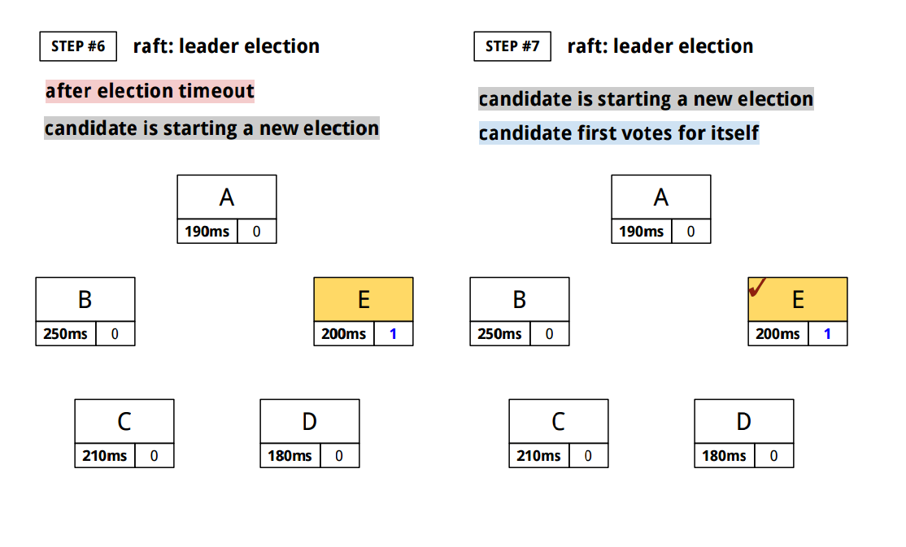


Actual algorithm is more sophisticated. We want to elect the **best leader**.

<br>
First, there is safety requirement for consensus:

> Once a log entry has been applied to a state machine, no other state machine
> must apply a different value for that log entry.
>
> [*Raft user study*](https://ramcloud.stanford.edu/~ongaro/userstudy/)

- Leader never overwrites logs.
- Only leader log entries can be committed.
- Logs must be committed before applying to state machines.

To guarantee these safety requirements, **Raft has this safety property**:

> If a leader has decided that a **log entry is committed**, **that entry**
> will be **present in the logs of all future leaders**.
>
> [*Raft user study*](https://ramcloud.stanford.edu/~ongaro/userstudy/)

In order to guarantee this property, we need more restrictions on `leader
election` and `log commit`.

[↑ top](#distributed-systems-paxos-raft-etcd)
<br><br><br><br><hr>


#### Raft: restrictions on `leader election`

So we want to elect the **best leader**. Best leader is the one that **holds
all of the committed log entries**.

<br>
Let's take a look at this situation:


That is, by only looking at the logs, we cannot tell which log entries are
actually committed, because for an entry to be committed, it needs to be
replicated in a majority of cluster, but if one node is not reachable,
we cannot check the replication status in cluster.

<br>
So during election, *Raft* needs to choose `candidate` that is most likely
to contain all committed entries. And this is how it's done during election
with `RequestVote` RPCs:

- Each candidate(`C`) includes its log information in its `RequestVote` RPCs:
  - `index` and `term` of the last log entry (this uniquely identifies an
  	entire log)
- Voter(`V`) denies its vote if its log is **more complete** than `candidate`:
  - `lastTerm of V > lastTerm of C`
  - **OR**
  - `(lastTerm of V == lastTerm of C) && (lastIndex of V > lastIndex C)`

Whoever wins the election, it is now guaranteed that `leader` will have most
complete log among electing majority.

For example,

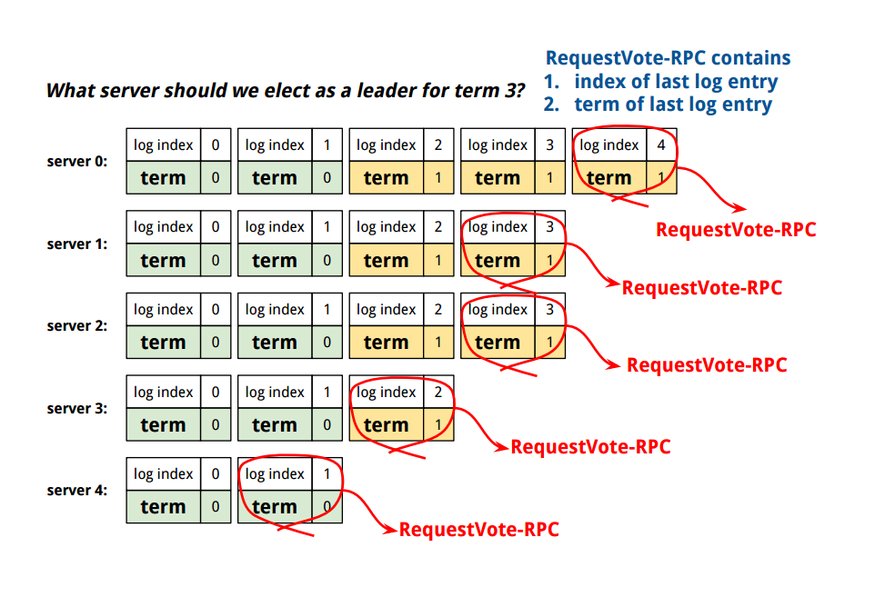

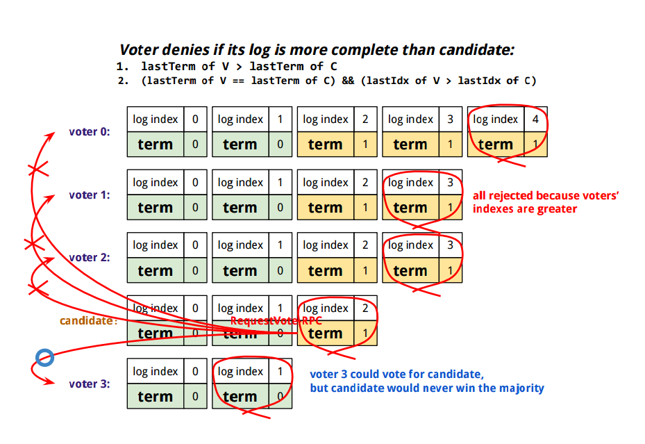


[↑ top](#distributed-systems-paxos-raft-etcd)
<br><br><br><br><hr>


#### Raft: estrictions on `log commit`

Below `leader` tries to decide if an entry is committed in its *current* or
*earlier* term:

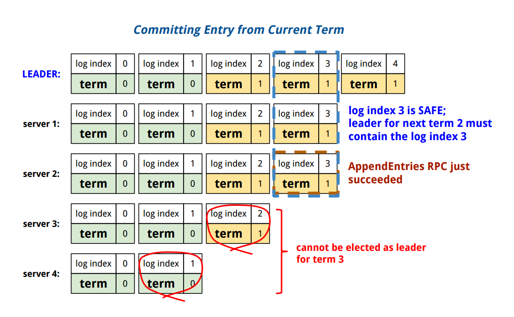
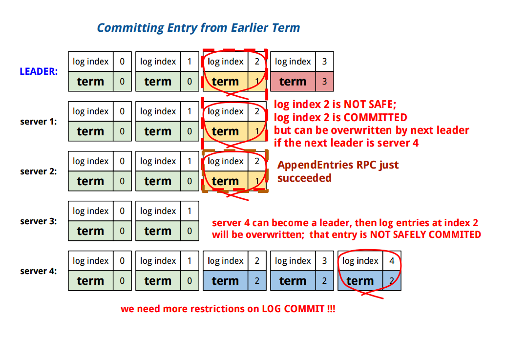

<br>
So we need more restrictions on `log commit`:

A `leader` decides a log entry is committed only if:
- that log entry is replicated on a majority of servers.
- at least one new log entry from leader's current term is also stored
  on a majority of servers.


[↑ top](#distributed-systems-paxos-raft-etcd)
<br><br><br><br><hr>


#### Raft: log replication

*Raft* inter-server communication is done by remote procedure calls
(RPCs). The basic Raft algorithm requires only two types of RPCs
(later `InstallSnapshot` RPC added):

- `RequestVote` RPCs, issued by `candidates` during elections.
- `AppendEntries` RPCs, issued by `leaders`:
  - **to replicate log entries**.
  - **to send out heartbeat messages**.

**Servers retry RPCs** *when they do not receive a response in time*,
and **send RPCs in parallel** *for best performance*.

<br>
Summary of
[§5.3 Log replication](http://ramcloud.stanford.edu/raft.pdf):

1. Once cluster has elected a leader, it starts receiving `client` requests.
2. Each `client` request contains a `command` to be run by replicated state
   machines.
3. The leader **only appends** `command` to its log, never overwriting nor
   deleting its log entries.
4. The leader **replicates** the *log entry* to its `followers` with
   `AppendEntries` RPCs. The leader keeps sending those RPCs until
   all followers eventually store all log entries. Each `AppendEntries` RPC
   contains `leaderId`, current leader's `term`, `prevLogIndex`, `prevLogTerm`,
   array of entries to store, `leaderCommitIndex`.
5. A `log entry` is considered *safely replicated* when the leader has
   replicated it on the **quorum of its followers**.
6. Once `log entry` has been *safely replicated* on a majority of the servers,
   it is considered **safe to be applied** to its state machine. And such `log
   entry` is *called* **committed**. Then **`leader`** **applies committed
   entry to its state machine**. `Applying committed entry to state machine`
   means *executing the command in the log entry*. Again, `leader` attempts to
   **replicate a log entry on the quorum of its followers**. Once they are
   replicated on a majority of its followers, it is **safely replicated**.
   Therefore it is **safe to be applied**. Then the `leader` **commits that
   log entry**. *Raft* guarantees that such entries are committed in a durable
   storage, and that they will eventually be applied *(executed)* by other
   available state machines.
7. We have one more restriction on `log commit`: at least one new log entry
   from leader's current term must be replicated on a majority of servers.
8. **When a `log entry` is committed, it is safe to be applied. And for a
   `log entry` to be committed, it only needs to be stored on the quorum of
   cluster**. This means each `command` can complete as soon as a majority
   of its followers has responded to a single round of `AppendEntries` RPCs.
   In other words, `leader` does not need to wait for responses from every
   node in a cluster.
9. Then the `leader` returns the execution result to the client.
10. Future `AppendEntries` RPCs from the `leader` has the highest index of
   `committed` log entry, so that `followers` could learn that a log entry is
   `committed`, and they can apply the entry to their local state machines as
   well. *Raft* ensures all committed entries are durable and eventually
   executed by all of available state machines.

<br>
Here's how log replication works:


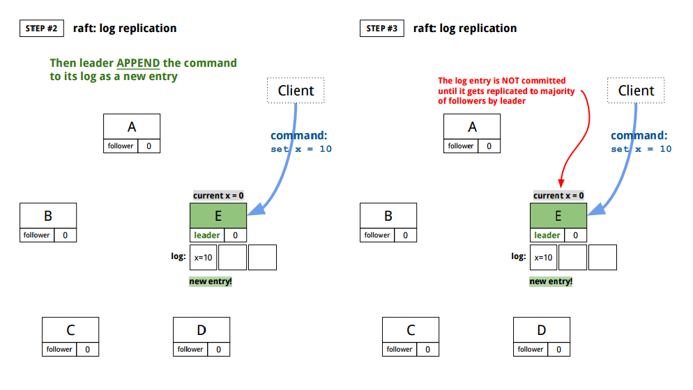

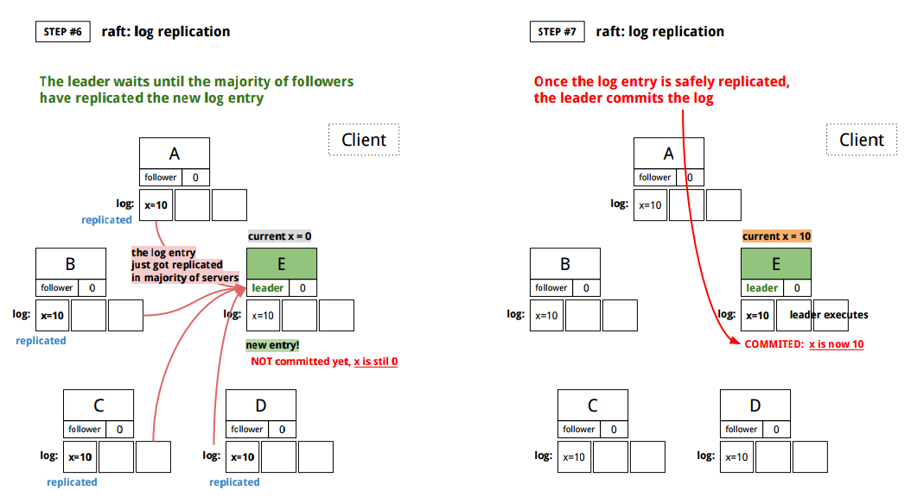

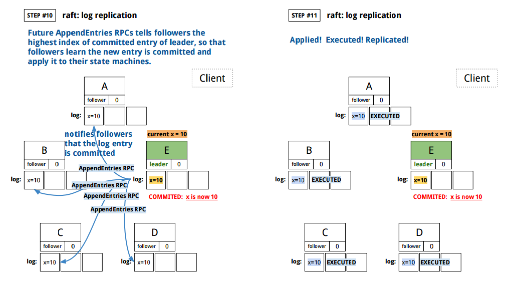

<br>
Again, `AppendEntries` RPC contains:

1. `leaderTerm`
2. `leaderId`
3. `prevLogIndex`, index of log entry immediately preceding new ones
4. `prevLogTerm`, term of log entry immediately preceding new ones 
5. `leaderCommit`, index of highest committed log entry in leader

Then:

1. A receiver(`follower`) of `AppendEntries` RPC returns **false** if its
   `currentTerm` is greater than `leader`'s term.
2. A receiver(`follower`) of `AppendEntries` RPC returns **false** if it does
   not contain the log entry that matches `prevLogIndex` and `prevLogTerm`.
3. If `leader`'s term is greater and the receiver has a conflicting entry (same
   index), delete the existing entry in receiver and also all the following
   ones.
4. Append any new entries that are not in receiver's log.
5. If `leaderCommit` is greater than receiver's `commitIndex`, *the highest
   index of committed entries*, set `commitIndex` = `min (leaderCommit, index
   of last new entry)`.

[↑ top](#distributed-systems-paxos-raft-etcd)
<br><br><br><br><hr>


#### Raft: log consistency


<br>

<br>


<br>
**Log Matching Property**:
- If two entries in different logs have the same `index` and `term`, then they
  store the same `command`. This is because `leader` creates maximum one entry
  per `index` for the given `term`, and log entries never change their position
  in the log.
- If two entries in different logs have the same `index` and `term`, then the
  `logs` are identical in all preceding entries. This is guaranteed by
  `AppendEntries` RPC that does consistency check: the RPC contains `index`
  and `term` that immediately precede new entries, and if `follower` does not
  find an entry in its log with the same `index` and `term`, then it refuses
  the new entries. As a result, whenever `AppendEntries` returns successfully,
  `leader` learns that the `follower`'s log is identical to `leader`'s.

<br>
Then what if `AppendEntries` RPC fails? It fails when **`follower` does not
have the entry at `leader`'s immediate-preceding `index` and `term`**. And the
`leader` keeps sending `AppendEntries` RPCs until all `followers` eventually
contain all log entries in order to maintain the log consistency.

<br>
Then how does `leader` achieve this by keep sending `AppendEntries` RPCs?
How does `leader` make all of its `followers` log match `leader`'s log?
What if `follower`'s current term is greater than `leader`'s and keeps
rejecting `AppendEntries` RPCs from `leader`?

**`Leader` keeps `nextIndex` for each `follower`, which is the index of next
log entry to send to that `follower`**. `nextIndex` is initialized to
`leader`'s `lastLogIndex` + 1. Then if `AppendEntries` fails, like when
`follower` does not have the entry at `leader`'s immediately-preceding `index`
and `term`, it will decrement `nextIndex` and try again with the new
`nextIndex`, and continue until it finds the matching entry.

> To bring a follower's log into consistency with its own, the leader must find
> the latest log entry where the two logs agree, delete any entries in the
> follower's log after that point, and send the follower all of the leader's 
> entries after that point. All of these actions happen in response to the
> consistency check performed by `AppendEntries` RPCs. The leader maintains a
> `nextIndex` for each follower, which is the index of the next log entry the
> leader will send to that follower.
>
> [3.5 Log
> replication](https://github.com/ongardie/dissertation/blob/master/stanford.pdf?raw=true) *by Diego Ongaro*

<br>
A `follower` may be missing some entries. In this case, `leader` keeps sending
`AppendEntries` RPCs until it finds the matching entry.

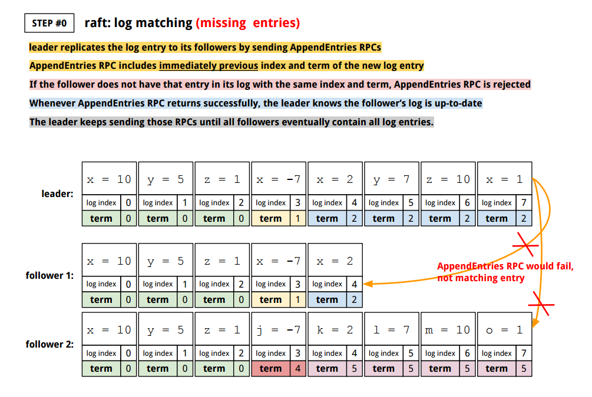
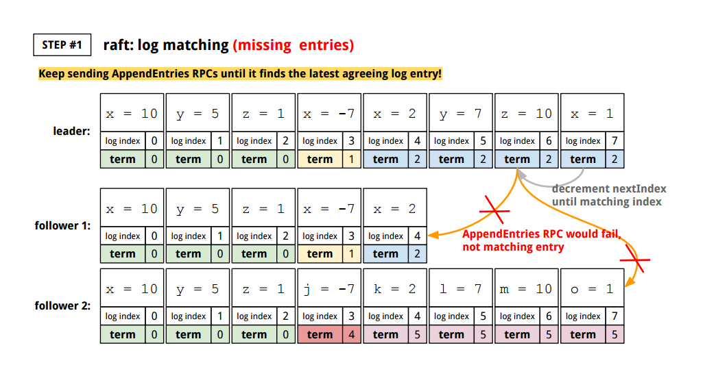

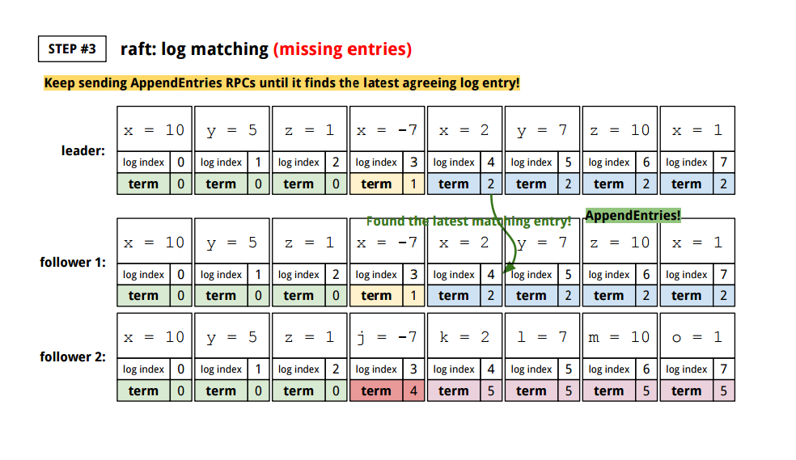

<br>
A `follower` may have **extraneous** entries. The `leader` checks the log with
its latest log entry that two logs agree. And it **deletes logs after that
point**. That is, **whenever `follower` overwrites inconsistent log entries
from `leader`, it deletes all the subsequent entries**.


[↑ top](#distributed-systems-paxos-raft-etcd)
<br><br><br><br><hr>


#### Raft: old leader

Old leader might not be dead when there is temporary network partition and they
elect their own leader. When the old leader recovers, it will retry to
commit log entries of its own. `term` is used to detect these stale leaders:

- Every RPC contains the `term` of its sender.
- **The receiver denies the RPC if the sender's `term` is older**. And if the
  RPC is rejected for such reason, the sender reverts to `follower`, and
  updates its `term`.
- If the receiver receives a RPC from a sender with newer `term`, then the
  receiver reverts to `follower`, and updates its `term`, and then processes
  RPC normally.

Election sends out `RequestVote` RPCs and during election, majority of servers
updates their `term` through RPCs. Therefore, deposed server cannot commit new
log entries.

[↑ top](#distributed-systems-paxos-raft-etcd)
<br><br><br><br><hr>


#### Raft: safety

Summary of
[§5.4 Safety](http://ramcloud.stanford.edu/raft.pdf):

<br>
*Raft* algorithm's **_safety_** is ensured when:

1. each state machine executes exactly the same command in the same order.
2. a leader for any given term contains all of log entries committed
   in previous terms.

<br>
And to guarantee the safety requirement:

- A leader never overwrites nor deletes log entries.
- Only leader log entries can be committed.
- Entries must be committed before applying to a state machine.
- Elect the candidate with most complete log.

When committing entries from previous terms, `leader` overwrites
`followers` with logs to handle the conflict entries. `leader`
first *finds the latest `follower` log entry* that matches with
leader's entry. And *deletes any extraneous entries after that
index*, in `follower`'s log. This is done by `AppendEntries` RPC.

[↑ top](#distributed-systems-paxos-raft-etcd)
<br><br><br><br><hr>


#### Raft: follower and candidate crashes

Summary of
[§5.5 Follower and candidate crashes](http://ramcloud.stanford.edu/raft.pdf):

> If a *follower or candidate crashes*, then future `RequestVote` and
> `AppendEntries` RPCs sent to it will fail. Raft handles these failures
> by **retrying indefinitely**; if the *crashed server restarts*, then
> the *RPC will complete successfully*. If a server crashes after
> completing an RPC but before responding, then it will receive the same RPC
> again after it restarts. **Raft RPCs are idempotent**, so this causes no
> harm. For example, if a follower receives an `AppendEntries` request
> that includes log entries already present in its log, it ignores those
> entries in the new request.
>
> [*§5.5 Follower and candidate crashes*](http://ramcloud.stanford.edu/raft.pdf)

[↑ top](#distributed-systems-paxos-raft-etcd)
<br><br><br><br><hr>


#### Raft: client interaction

Summary of
[§8 Client interaction](http://ramcloud.stanford.edu/raft.pdf):

> If a client sends a request to a follower, it
> redirects to the current leader
>
> [*Raft paper §5.1*](http://ramcloud.stanford.edu/raft.pdf)

<br>
> In concurrent programming, an operation (or set of operations) is atomic,
> **linearizable**, indivisible or uninterruptible if it appears to the rest
> of the system to occur instantaneously. Atomicity is a guarantee of isolation
> from concurrent processes. Additionally, atomic operations commonly have a
> succeed-or-fail definition — they either successfully change the state of
> the system, or have no apparent effect.
>
> [*Linearizability*](https://en.wikipedia.org/wiki/Linearizability)
> *by Wikipedia*

<br>
Again, *clients send all requests to the Raft leader*. A client first connects
to a randomly chosen server. And if the server is not the leader, the server
will reject the requests from the client, and tell the client which server is
the most recent leader. `AppendEntries` RPCs to `followers` include `leader`'s
network address.

<br>
In *Raft*, each operation should appear to execute instantaneously, only once,
at some point between the call and response: **_linearizable semantics_**.
And changes in the cluster should appear in the same order to all of the
machines in the cluster. However, **if a leader crashes**, *client requests*
will **time out** and try again with randomly-chosen servers. If it were
after the leader had committed the log entry but before responding to
the client, the client tries the same command with the new leader:
*the command would get executed a second time*.

To prevent this, clients assign unique serial number to each command. Then the
state machine in a server stores the most recent serial number processes for
each client with the associated response. If the state machine finds a command
whose serial number has already been executed, it immediately returns the
response without re-executing the request the second time.

<br>
But still, *Raft* client does not need to know which machine is the `leader`.
Then how do we redirect clients to `leader`, which send requests to
`followers`? 

> Yes, a client can submit a write request to any machine in the cluster. What
> happens is the etcd machine you contact **creates a raft RPC** and **tags it
> with a unique id**. When the machine sees that unique id, tag come back as a
> raft log commit, then it returns a 200 OK to the client.
>
> [*Brandon
> Phillips*](https://groups.google.com/d/msg/coreos-user/et7-Lm0gQxo/jkeZPKo0uaEJ)

<br>
```go
// https://github.com/coreos/etcd/blob/master/raft/raft.go
// send persists state to stable storage and then sends to its mailbox.
func (r *raft) send(m pb.Message) {
	m.From = r.id
	// do not attach term to MsgProp
	// proposals are a way to forward to the leader and
	// should be treated as local message.
	if m.Type != pb.MsgProp {
		m.Term = r.Term
	}
	r.msgs = append(r.msgs, m)
}

// https://github.com/coreos/etcd/blob/master/raft/raft.go#L650-L658
func stepFollower(r *raft, m pb.Message) {
	switch m.Type {
	case pb.MsgProp:
		if r.lead == None {
			r.logger.Infof("%x no leader at term %d; dropping proposal", r.id, r.Term)
			return
		}
		m.To = r.lead
		r.send(m)
		...

```

[↑ top](#distributed-systems-paxos-raft-etcd)
<br><br><br><br><hr>


#### Raft: log compaction

Summary of
[§7 Log compaction](http://ramcloud.stanford.edu/raft.pdf):

Most critical case for performance is when a leader replicates log entries.
*Raft* algorithm minimizes the number of messages by requiring a single
round-trip request only to half of the cluster. *Raft* also has mechanism
to discard obsolete information accumulated in the log.

<br>
Since the system cannot handle infinitely growing logs, *Raft* uses `snapshot`
to save the state of the entire system on a stable storage, so that logs stored
up to the `snapshot` point can be discarded. Here's how `snapshot` works in
*Raft* log:


[↑ top](#distributed-systems-paxos-raft-etcd)
<br><br><br><br><hr>


#### Raft: configuration(membership) changes

Configuration changes need to happen when:

- there is a failed machine in cluster that needs to be replaced.
- one needs to change the degree of replication (scale up and down).

But we must ensure safety during configuration changes: there must be no period
when it is possible that two leaders can be elected for the same term, *one for
old configuration, and the other for the new*. If one single configuration
change is adding or removing multiple servers in cluster, it can be unsafe,
because the cluster could split into two independent majorities (disjoint
majorities), as below:

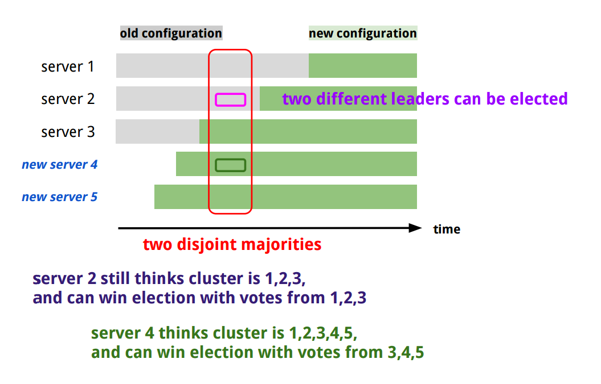

Raft solves this either by allowing only one server change at a time
(single-server approach), or with *joint consensus*. **Single-server change
approach ensures when adding or removing a single-server, an overlap between
any majority of old cluster and any majority of new cluster is preserved**,
**which prevents the disjoint majorities**.

> Cluster configurations are stored and communicated using special entries in
> the replicated log. This leverages the existing mechanisms in Raft to
> replicate and persist configuration information. It also allows the cluster
> to continue to service client requests while configuration changes are in
> progress, by imposing ordering between configuration changes and client
> requests (while allowing both to be replicated concurrently in a pipeline
> and/or in batches).
>
> When the leader receives a request to **add or remove a server** from its
> current configuration (C_old), it appends the new configuration (C_new) as an
> entry in its log and replicates that entry using the normal Raft mechanism.
> The new configuration takes effect on each server as soon as it is added to
> that server's log: the C_new entry is replicated to the C_new servers, and a
> majority of the new configuration is used to determine the C_new entry's
> commitment. This means that **servers do not wait for configuration entries
> to be committed, each server always uses the latest configuration found in
> its log**.
>
> The configuration change is complete once the C_new entry is committed. At
> this point, the leader knows that a majority of the C_new servers have
> adopted C_new. It also knows that any servers that have not moved to C_new
> can no longer form a majority of the cluster, and servers without C_new
> cannot be elected leader.
>
> [§4.1
> Safety](https://github.com/ongardie/dissertation/blob/master/stanford.pdf?raw=true)
> *by Diego Ongaro*


<br>
Note that
[`etcd`](https://github.com/coreos/etcd/blob/master/raft/doc.go#L127-L150)
takes a slightly different approach in that the membership change takes effect
only after the new configuration gets committed (applied), but it does not
affect the safety because old and new configurations are still guaranteed to
overlap.

<br>
Raft paper recommends single-server approach when adding or removing servers.
But what if one wants to replace five-server cluster at once? Raft uses
2-phased distributed decisions for this case (arbitrary configuration change):

- Raft first switches to transitional phase called **joint consensus**, where
  you need majority of both old and new configurations for leader election and
  log commit. That is, leader election and log commit require separate
  agreement from both configurations.
- **Configuration change is replicated as a special log entry**, and it is
  immediately applied upon receipt whether it is committed or not.
- Once join consensus is committed, it begins replicating the log entry for
  final configuration.

[↑ top](#distributed-systems-paxos-raft-etcd)
<br><br><br><br><hr>


#### `etcd`: storage

`etcd` is **key-value store**. Then how does it store actual data? It needs to
write both on memory and disks, using [`boltdb`](https://github.com/boltdb/bolt).
Then does it just process logs in memory and dump to disk using `boltdb`? Actual
implementation is more complicated than that.

<br>
[**`revision`**](https://github.com/coreos/etcd/blob/master/storage/revision.go):
modification of key-value space, which happens atomically in key-value space.
`revision.main` is the main `revision` of changes, and `revision.sub` shares
the same `revision.main` and also increases atomically. `revision` is defined
as `struct` and stored in `[]byte` format because `...? (TODO)`:

```go
type revision struct {
  main int64
  sub  int64
}

func newRevBytes() []byte {
  return make([]byte, revBytesLen, markedRevBytesLen)
}

func revToBytes(rev revision, bytes []byte) {
  binary.BigEndian.PutUint64(bytes, uint64(rev.main))
  bytes[8] = '_'
  binary.BigEndian.PutUint64(bytes[9:], uint64(rev.sub))
}

func bytesToRev(bytes []byte) revision {
  return revision{
    main: int64(binary.BigEndian.Uint64(bytes[0:8])),
    sub:  int64(binary.BigEndian.Uint64(bytes[9:])),
  }
}
```

<br>
**`created revision`**: `revision` at first `Put` of the key.

<br>
**`modified revision`**: `revision` at last `Put` of the key.

<br>
[**`generation`**](https://github.com/coreos/etcd/blob/master/storage/key_index.go):
contains **multiple** `revision`s of **one key**:

```go
type generation struct {
  ver     int64
  created revision
  revs    []revision
}
```

<br>
[**`keyIndex`**](https://github.com/coreos/etcd/blob/master/storage/key_index.go):
stores **multiple** `generation`s of **one key**, each of which has **multiple
`revision`s**. Each `keyIndex` has at least one key `generation`:

```go
type keyIndex struct {
  key         []byte
  modified    revision
  generations []generation
}
```

<br>
`etcd` updates the `keyIndex` of `key []byte` by passing `revision`.
`(keyIndex).put(revision)` updates its `modified` and the last element of `generations`:

```go
// put puts a revision to the keyIndex.
func (ki *keyIndex) put(main int64, sub int64) {
  rev := revision{main: main, sub: sub}

  if !rev.GreaterThan(ki.modified) {
    log.Panicf("store.keyindex: put with unexpected smaller revision [%v / %v]", rev, ki.modified)
  }
  if len(ki.generations) == 0 {
    ki.generations = append(ki.generations, generation{})
  }
  g := &ki.generations[len(ki.generations)-1]
  if len(g.revs) == 0 { // create a new key
    keysGauge.Inc()
    g.created = rev
  }
  g.revs = append(g.revs, rev)
  g.ver++
  ki.modified = rev
}
```

<br>
`(keyIndex).tombstone(tombstoneRevision)` calls `(keyIndex).put(tombstoneRevision)`
and append an empty `generation` to the current `keyIndex.generations`. `tombstone`
is an empty `generation` and used as a marker/boundary:

```go
func (ki *keyIndex) tombstone(main int64, sub int64) error {
  if ki.isEmpty() {
    log.Panicf("store.keyindex: unexpected tombstone on empty keyIndex %s", string(ki.key))
  }
  if ki.generations[len(ki.generations)-1].isEmpty() {
    return ErrRevisionNotFound
  }
  ki.put(main, sub)
  ki.generations = append(ki.generations, generation{})
  keysGauge.Dec()
  return nil
}
```

<br>
`(keyIndex).restore(created, modified revision, ver int64)` restores revisions from
disk storage by re-appending `revision`s and `ver`to `keyIndex.generations`:

```go
func (ki *keyIndex) restore(created, modified revision, ver int64) {
  if len(ki.generations) != 0 {
    log.Panicf("store.keyindex: cannot restore non-empty keyIndex")
  }

  ki.modified = modified
  g := generation{created: created, ver: ver, revs: []revision{modified}}
  ki.generations = append(ki.generations, g)
  keysGauge.Inc()
}
```

<br><br>
[**`treeIndex`**](https://github.com/coreos/etcd/blob/master/storage/index.go):
stores *key* and *`revision`* in `BTree`, where each node is `keyIndex` object:

```go
func (ti *treeIndex) Put(key []byte, rev revision) {
  keyi := &keyIndex{key: key}

  ti.Lock()
  defer ti.Unlock()
  item := ti.tree.Get(keyi)
  if item == nil {
    keyi.put(rev.main, rev.sub)
    ti.tree.ReplaceOrInsert(keyi)
    return
  }
  okeyi := item.(*keyIndex)
  okeyi.put(rev.main, rev.sub)
}
```

<br>
[**`backend`**](https://github.com/coreos/etcd/tree/master/storage/backend): embeds `boltdb` as
backend storage. It writes data to a transaction and periodically commits the batches of data
to disk:

```go
func newBackend(path string, d time.Duration, limit int) *backend {
  db, err := bolt.Open(path, 0600, boltOpenOptions)
  if err != nil {
    log.Panicf("backend: cannot open database at %s (%v)", path, err)
  }

  b := &backend{
    db: db,

    batchInterval: d,
    batchLimit:    limit,

    stopc: make(chan struct{}),
    donec: make(chan struct{}),
  }
  b.batchTx = newBatchTx(b)
  go b.run()
  return b
}

type Backend interface {
  BatchTx() BatchTx
  Snapshot() Snapshot
  Hash() (uint32, error)
  Size() int64
  Defrag() error
  ForceCommit()
  Close() error
}

type backend struct {
  mu sync.RWMutex
  db *bolt.DB

  batchInterval time.Duration
  batchLimit    int
  batchTx       *batchTx
  size          int64

  commits int64

  stopc chan struct{}
  donec chan struct{}
}

type BatchTx interface {
  Lock()
  Unlock()
  UnsafeCreateBucket(name []byte)
  UnsafePut(bucketName []byte, key []byte, value []byte)
  UnsafeRange(bucketName []byte, key, endKey []byte, limit int64) (keys [][]byte, vals [][]byte)
  UnsafeDelete(bucketName []byte, key []byte)
  Commit()
  CommitAndStop()
}

type batchTx struct {
  sync.Mutex
  tx      *bolt.Tx
  backend *backend
  pending int
}

type Snapshot interface {
  Size() int64
  WriteTo(w io.Writer) (n int64, err error)
  Close() error
}

type snapshot struct {
  *bolt.Tx
}
```

<br>
[**`store`**](https://github.com/coreos/etcd/blob/master/storage/kvstore.go):
embeds `backend`, `index`(`treeIndex` satisfies this interface), and schedules the periodic
compaction. Note that `(*store).put(key, value []byte)` writes `(key, revision)` into
in-memory BTree `index treeIndex`, and `(revision, storagepb.KeyValue)` to `(*store).batchTx`.
And the `storagepb.KeyValue` gets added to `(*store).changes` to notify watchers:

```go
type store struct {
  mu sync.Mutex // guards the following

  b       backend.Backend
  kvindex index

  le lease.Lessor

  currentRev revision
  // the main revision of the last compaction
  compactMainRev int64

  tx    backend.BatchTx
  txnID int64 // tracks the current txnID to verify txn operations

  changes   []storagepb.KeyValue
  fifoSched schedule.Scheduler

  stopc chan struct{}
}

func (s *store) put(key, value []byte, leaseID lease.LeaseID) {
  rev := s.currentRev.main + 1
  c := rev
  oldLease := lease.NoLease

  // if the key exists before, use its previous created and
  // get its previous leaseID
  grev, created, ver, err := s.kvindex.Get(key, rev)
  if err == nil {
    c = created.main
    ibytes := newRevBytes()
    revToBytes(grev, ibytes)
    _, vs := s.tx.UnsafeRange(keyBucketName, ibytes, nil, 0)
    var kv storagepb.KeyValue
    if err = kv.Unmarshal(vs[0]); err != nil {
      log.Fatalf("storage: cannot unmarshal value: %v", err)
    }
    oldLease = lease.LeaseID(kv.Lease)
  }

  ibytes := newRevBytes()
  revToBytes(revision{main: rev, sub: s.currentRev.sub}, ibytes)

  ver = ver + 1
  kv := storagepb.KeyValue{
    Key:            key,
    Value:          value,
    CreateRevision: c,
    ModRevision:    rev,
    Version:        ver,
    Lease:          int64(leaseID),
  }

  d, err := kv.Marshal()
  if err != nil {
    log.Fatalf("storage: cannot marshal event: %v", err)
  }

  s.tx.UnsafePut(keyBucketName, ibytes, d)
  s.kvindex.Put(key, revision{main: rev, sub: s.currentRev.sub})
  s.changes = append(s.changes, kv)
  s.currentRev.sub += 1

  if oldLease != lease.NoLease {
    if s.le == nil {
      panic("no lessor to detach lease")
    }

    err = s.le.Detach(oldLease, []lease.LeaseItem{{Key: string(key)}})
    if err != nil {
      panic("unexpected error from lease detach")
    }
  }

  if leaseID != lease.NoLease {
    if s.le == nil {
      panic("no lessor to attach lease")
    }

    err = s.le.Attach(leaseID, []lease.LeaseItem{{Key: string(key)}})
    if err != nil {
      panic("unexpected error from lease Attach")
    }
  }
}
```

<br>
[**`watchableStore`**](https://github.com/coreos/etcd/blob/master/storage/watchable_store.go):
embeds `store` in addition to `watcher` implementation:

```go
type watchable interface {
  watch(key, end []byte, startRev int64, id WatchID, ch chan<- WatchResponse) (*watcher, cancelFunc)
  progress(w *watcher)
  rev() int64
}

type watchableStore struct {
  mu sync.Mutex

  *store

  // contains all unsynced watchers that needs to sync with events that have happened
  unsynced watcherGroup

  // contains all synced watchers that are in sync with the progress of the store.
  // The key of the map is the key that the watcher watches on.
  synced watcherGroup

  stopc chan struct{}
  wg    sync.WaitGroup
}
```

<br>
[**`consistentWatchableStore`**](https://github.com/coreos/etcd/blob/master/storage/consistent_watchable_store.go):
Embeds `watchableStore` to get the consistent index of current executing entry:

```go
// ConsistentIndexGetter is an interface that wraps the Get method.
// Consistent index is the offset of an entry in a consistent replicated log.
type ConsistentIndexGetter interface {
  // ConsistentIndex returns the consistent index of current executing entry.
  ConsistentIndex() uint64
}

type consistentWatchableStore struct {
  *watchableStore
  // The field is used to get the consistent index of current
  // executing entry.
  // When the store finishes executing current entry, it will
  // put the index got from ConsistentIndexGetter into the
  // underlying backend. This helps to recover consistent index
  // when restoring.
  ig ConsistentIndexGetter

  skip bool // indicate whether or not to skip an operation
}

func New(b backend.Backend, le lease.Lessor, ig ConsistentIndexGetter) ConsistentWatchableKV {
  return newConsistentWatchableStore(b, le, ig)
}
```

[↑ top](#distributed-systems-paxos-raft-etcd)
<br><br><br><br><hr>


#### `etcd`: server

- `etcdserverpb` defines protocol buffers for data exchange between machines,
and its `Marshall` and `Unmarshall` functions.
- `api/v3rpc` defines, registers `gRPC` servers to `etcdserver.EtcdServer`.

```go
func Server(s *etcdserver.EtcdServer, tls *transport.TLSInfo) (*grpc.Server, error) {
  var opts []grpc.ServerOption
  if tls != nil {
    creds, err := credentials.NewServerTLSFromFile(tls.CertFile, tls.KeyFile)
    if err != nil {
      return nil, err
    }
    opts = append(opts, grpc.Creds(creds))
  }

  grpcServer := grpc.NewServer(opts...)
  pb.RegisterKVServer(grpcServer, NewKVServer(s))
  pb.RegisterWatchServer(grpcServer, NewWatchServer(s))
  pb.RegisterLeaseServer(grpcServer, NewLeaseServer(s))
  pb.RegisterClusterServer(grpcServer, NewClusterServer(s))
  pb.RegisterAuthServer(grpcServer, NewAuthServer(s))
  return grpcServer, nil
}
```

- `etcdmain` calls this `grpcServer, err := v3rpc.Server(s, tls)`
- And those `gRPC` servers process client requests.
   - These requests go to `api/v3rpc` first, and `api/v3rpc` directly calls
   methods in `etcdserver`, such as `etcdserver.RaftKV`, `storage.Watchable`, etc.

```go
type kvServer struct {
  clusterID int64
  memberID  int64
  raftTimer etcdserver.RaftTimer

  kv etcdserver.RaftKV
}

func (s *kvServer) Put(ctx context.Context, r *pb.PutRequest) (*pb.PutResponse, error) {
  if err := checkPutRequest(r); err != nil {
    return nil, err
  }

  resp, err := s.kv.Put(ctx, r)
  if err != nil {
    return nil, togRPCError(err)
  }

  if resp.Header == nil {
    plog.Panic("unexpected nil resp.Header")
  }
  s.fillInHeader(resp.Header)
  return resp, err
}

func (s *EtcdServer) Put(ctx context.Context, r *pb.PutRequest) (*pb.PutResponse, error) {
  result, err := s.processInternalRaftRequest(ctx, pb.InternalRaftRequest{Put: r})
  if err != nil {
    return nil, err
  }
  return result.resp.(*pb.PutResponse), result.err
}
```

[↑ top](#distributed-systems-paxos-raft-etcd)
<br><br><br><br><hr>
