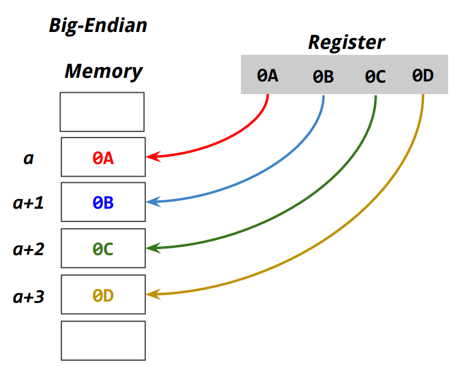
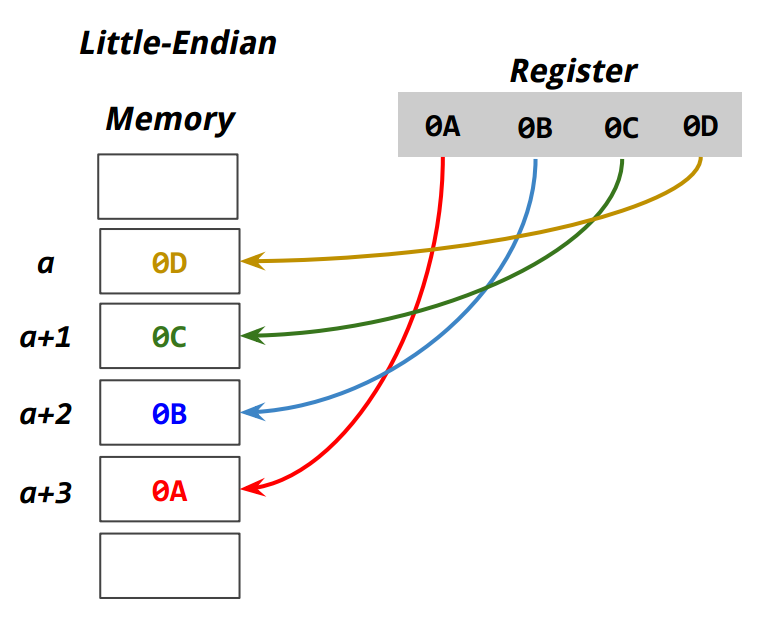

[*back to contents*](https://github.com/gyuho/learn#contents)<br>

# Endianness

- [Reference](#reference)
- [bit, byte](#bit-byte)
- [`endianness`](#endianness)

[↑ top](#endianness)
<br><br><br><br><hr>


#### Reference

- [Endianness](https://en.wikipedia.org/wiki/Endianness)

[↑ top](#endianness)
<br><br><br><br><hr>


#### bit, byte

Bit is **B**inary Dig**it**. Bit is the basic unit of information in computing.
Most common representation of bits is 0 and 1.
Code consists of a sequence of **bits**—*a value of 0 or 1*. 
*One* **_8-bit_** *chunk* builds *one* **_byte_** that represents **_one character_**.
**_byte_** is the smallest addressable unit of memory in computing.
Go `string` is a sequence of `bytes`. Try this [code](http://play.golang.org/p/EqXQKOGTJ9):

```go
package main

import "fmt"

func main() {
	bts := []byte("Hello")
	bts[0] = byte(100)
	for _, c := range bts {
		fmt.Println(string(c), c)
	}
	/*
	   d 100
	   e 101
	   l 108
	   l 108
	   o 111
	*/

	rs := []rune("Hello")
	rs[0] = rune(100)
	for _, c := range rs {
		fmt.Println(string(c), c)
	}
	/*
	   d 100
	   e 101
	   l 108
	   l 108
	   o 111
	*/

	str := "Hello"
	// str[0] = byte(100)
	// cannot assign to str[0]
	for _, c := range str {
		fmt.Println(string(c), c)
	}
	/*
	   H 72
	   e 101
	   l 108
	   l 108
	   o 111
	*/
}
```


<br>
C++ has no built-in `byte` type; it instead has `char` array
to represent bytes of data:

```cpp
#include <iostream>
using namespace std;

int main()
{
	// string literals are regular arrays
	//
	// \0 is a null character
	char bt0[] = {'H', 'e', 'l', 'l', 'o', '\0'};
	char bt1[] = "Hello";
	cout << (bt0 == bt1) << endl; // 0

	cout << bt0 << endl << bt1 << endl;
	// Hello
	// Hello
	
	int i = 0;
	while (bt0[i] != '\0'){
		cout << bt0[i];
		i++;
	}
	cout << endl; // Hello
	i = 0;
	while (bt1[i] != '\0'){
		cout << bt1[i];
		i++;
	}
	cout << endl; // Hello

	// Is character array mutable? Yes.
	bt0[0] = 'A';
	cout << bt0 << endl;
	// Aello

	typedef unsigned char BYTE;
	BYTE text[] = "text";
	cout << text << endl; // text
}

```

[↑ top](#endianness)
<br><br><br><br><hr>


#### `endianness`

My machine setting as of today is `Linux 64-bit`:

```bash
$ cat /proc/cpuinfo | grep "model name" | head -1;
model name	: Intel(R) Core(TM) i7-4750HQ CPU @ 2.00GHz

$ lsb_release -a
Distributor ID:	Ubuntu
Description:	Ubuntu 14.04.3 LTS
Release:	14.04
Codename:	trusty

$ uname -sm
Linux x86_64
```

<br>
> x86-64 (also known as x64, x86_64 and **_`AMD64`_**) is the 64-bit
> version of the x86 instruction set.
>
> [x86-64](https://en.wikipedia.org/wiki/X86-64) *by Wikipedia*

<br>
Processor `register` is a small amount of storage available as part of a CPU.
Computers load data from a large memory into registers
and do the arithmetic, manipulating computation
and store the data back to main memory.
`Register` is normally at the top of the memory hierarchy
, and provides the fastest way to access data.

<br>
`Word`, in computing, is the natural unit of data.
A `word` is a fixed-sized group of digits that are handled
as a unit by the processor.
Modern processors usually have a word size of `32` or `64` bits.

- Word size 32-bit: need 4 bytes (32-bit) to store a single word in 
	consecutive memory address.
- Word size 64-bit: need 8 bytes (64-bit) to store a single word in 
	**consecutive memory address**.


<br>
Memory stores binary data by organizing them in 8-bit units (bytes).
And we need to use multiple bytes to store data.
Then the order of storing bytes, or data, becomes important.
`Endianness` is how the bytes are ordered within memory.

- **Big-Endian** system: *Most siginificant* byte of the word is stored
	in the *smallest address* given. *Least siginificant* byte of the word
	is stored in the *largest address* given.
- **Little-Endian** system: *Most siginificant* byte of the word is stored
	in the *largest address* given. *Least siginificant* byte of the word
	is stored in the *smallest address* given.

When given `123`:
- **Big-Endian** would read as One-hundred Twenty Three.
- **Little-Endian** would read as Three-hundred Twenty One.




```go
package main

import (
	"fmt"
	"unsafe"
)

func main() {
	var x uint32 = 0x0A0B0C0D
	switch *(*byte)(unsafe.Pointer(&x)) {
	case 0x0A:
		fmt.Println("Big-Endian")
	case 0x0D:
		fmt.Println("Little-Endian")
	}
}

```

<br>
In C++, you can use `union`:

```cpp
#include <iostream>
#include <stdio.h>
using namespace std;

int main() {
	// In union, all members share the same memory location.
	//
	// Unions can save us memory with different objects
	// sharing the memory location at different times.
	//
	union Data {
		uint32_t i;
		char c[4];
		// so the data can be either
		// uint32_t or char
	};
	Data data;
	data.i = 0x0A0B0C0D;
	// data.c[4] = 0x0A0B0C0D; (X)
	printf("%X\n", data.c[0]);
	printf("%X\n", data.c[1]);
	printf("%X\n", data.c[2]);
	printf("%X\n", data.c[3]);
	if (data.c[0] == 10)
		cout <<  "Big-Endian" << endl;
	else
		cout << "Little-Endian" << endl;
}

/*
D
C
B
A
Little-Endian
*/

```

[↑ top](#endianness)
<br><br><br><br><hr>

