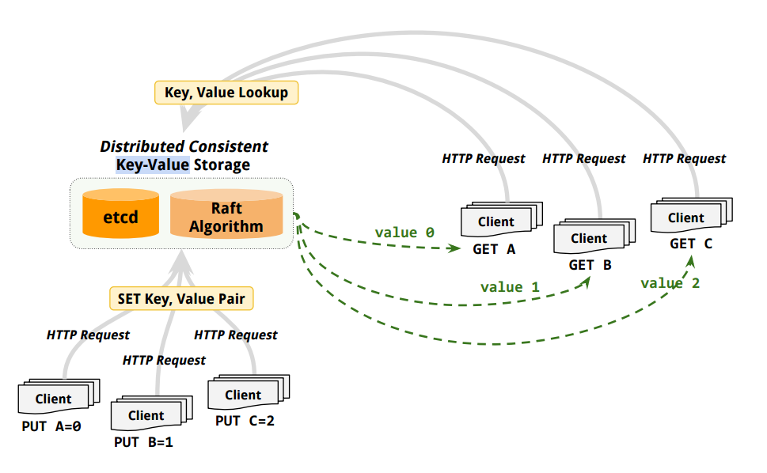
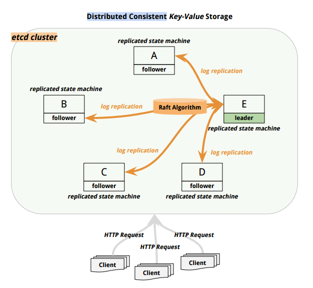
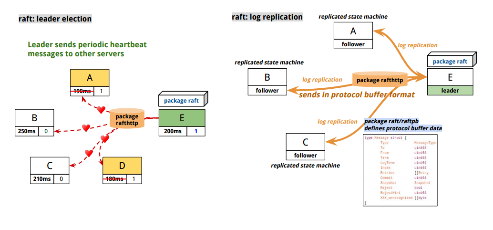
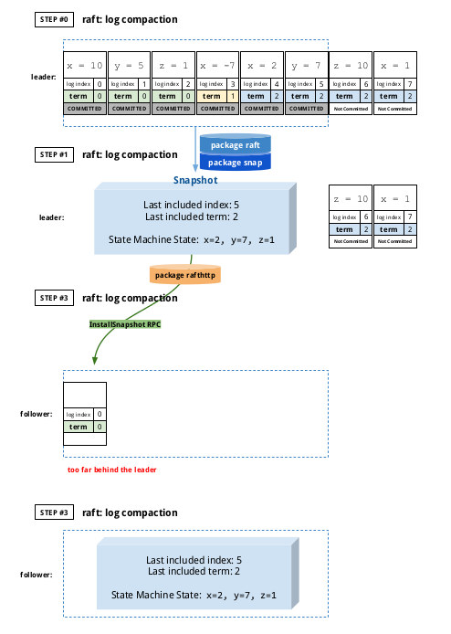

[*back to contents*](https://github.com/gyuho/learn#contents)
 

# etcd architecture

- [Reference](#reference)
- [etcd overview](#etcd-overview)
- [etcd implementation: raft](#etcd-implementation-raft)
- [etcd implementation: distributed key/value store](#etcd-implementation-distributed-keyvalue-store)
- [etcd implementation: client](#etcd-implementation-client)

[↑ top](#etcd-architecture)
    

#### Reference

- [The Raft Consensus Algorithm](https://raft.github.io/)
- [Raft lecture (Raft user study)](https://www.youtube.com/watch?v=YbZ3zDzDnrw)
- [`coreos/etcd`](https://github.com/coreos/etcd)

[↑ top](#etcd-architecture)
    

#### etcd overview

`etcd` is a **distributed consistent key-value** store,
[*`/etc`*](http://www.tldp.org/LDP/Linux-Filesystem-Hierarchy/html/etc.html)
distributed. The directory `/etc` in Linux contains system configuration files
for program controls. `etcd` is a distributed key-value store for these
system configurations. There are many
[key/value databases](http://nosql-database.org/). For example,
[**_Redis_**](http://redis.io/) is an **key-value** cache and store, a data
structure server for **_RE_**mote **_DI_**ctionary **_S_**erver.

**_Redis_** and **_`etcd`_** have the same premise: **_key-value store_**.
But they are different in that `etcd` is designed for distributed system and
for storing system configurations.

 
**FIRST,** `etcd` is a distributed consistent **_key-value_** store:

 
**SECOND,** `etcd` is a **_distributed consistent_** key-value store:

[↑ top](#etcd-architecture)
    

#### etcd implementation: raft

Then how does `etcd` implement **Raft algorithm**?

*Raft* inter-server communication is done by remote procedure calls
(RPCs). There are three types of RPCs:

- `RequestVote` RPCs, issued by `candidates` during elections.
- `AppendEntries` RPCs, issued by `leaders`:
  - **to replicate log entries**.
  - **to send out heartbeat messages**.
- `InstallSnapshot` RPCs, issued by `leaders`:
  - **to send chunks of a snapshot to its followers**.

And `etcd` uses [`Protocol
Buffers`](https://developers.google.com/protocol-buffers/docs/overview?hl=en)
for these types of communication:

- [`package raft`](http://godoc.org/github.com/coreos/etcd/raft):
  Implements the raft consensus algorithm.
- [`package raft/raftpb`](http://godoc.org/github.com/coreos/etcd/raft/raftpb):
  [Auto-generated](https://github.com/coreos/etcd/blob/master/raft/raftpb/raft.pb.go#L1-L3)
  by protocol buffer compiler. It defines `MessageType`, `Entry`,
  `Message`, `State`, and other structured data required for *Raft* algorithm.
- [`package rafthttp`](http://godoc.org/github.com/coreos/etcd/rafthttp):
  Implements HTTP operations in *Raft*.
- [`package snap`](http://godoc.org/github.com/coreos/etcd/snap):
  Creates snapshots for *Raft* cluster states.
- [`package snap/snappb`](http://godoc.org/github.com/coreos/etcd/snap/snappb):
  Defines structured data for `package snap`.

[↑ top](#etcd-architecture)
    

#### etcd implementation: distributed key/value store

Then how does `etcd` implement **distributed consistent key-value store**?

 
**FIRST,** `etcd` implements **distributed** computing system on top of its
*Raft* consensus algorithm implementation, such as `package raft`:

- [**`package etcdserver`**](http://godoc.org/github.com/coreos/etcd/etcdserver):
  Connects distributed servers in the cluster. It also defines `Cluster`
  interface with methods: `ID` to return the cluster ID, `ClientURLs` to
  return the list of all clients URLs, `Members` to return the slice of
  members, etc. It also defines `Server` interface: `Start` to start a `etcd`
  server(*cluster*), `Stop` to stop the server, `ID` to return the ID of the
  server, `Leader` to return the server ID of leader, `Do` to handle the
  server requests, `Process` to take the raft message and apply it to the
  server's state machine (execute the command in log entry), `AddMember` to add
  a member into the cluster, `RemoveMember` to remove a member from the
  cluster, `UpdateMember` to update an existing member in the cluster.
- [`package etcdserver/etcdhttp`](http://godoc.org/github.com/coreos/etcd/etcdserver/etcdhttp):
  Implements `etcdserver` endpoints with muxed handlers.
- [`package etcdserver/etcdserverpb`](http://godoc.org/github.com/coreos/etcd/etcdserver/etcdserverpb):
  Auto-generated by protocol buffer compiler. It defines `Request` types used
  in `etcdserver` package.

 
**SECOND,** `etcd` **stores** (*committed*) log entries in a **consistent**
way (using [BoltDB](https://github.com/boltdb/bolt)):

- [`package storage`](http://godoc.org/github.com/coreos/etcd/storage):
  Defines interfaces for `KV` (key-value) storage.
- [`package storage/backend`](http://godoc.org/github.com/coreos/etcd/storage/backend):
  Implements `etcd`'s backend durable data storage with *BoltDB*.
- [`package storage/storagepb`](http://godoc.org/github.com/coreos/etcd/storage/storagepb):
  Auto-generated by protocol buffer compiler. It defines data types for
  key-value pairs.

[↑ top](#etcd-architecture)
    

#### etcd implementation: client

Working in progress.

[↑ top](#etcd-architecture)
    

