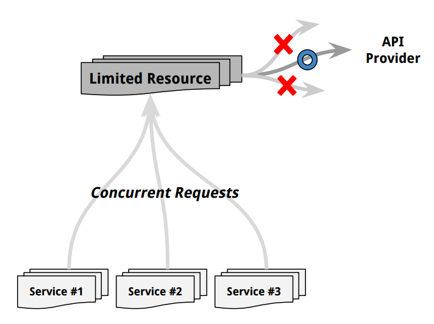
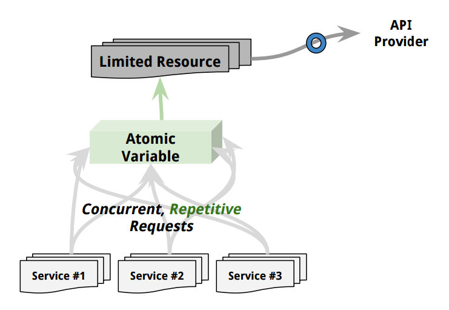
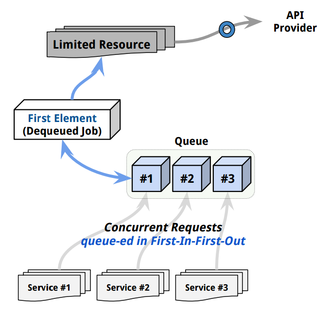
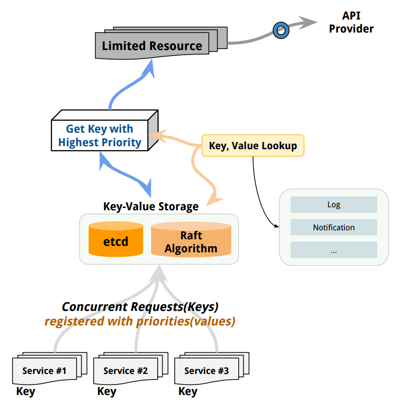
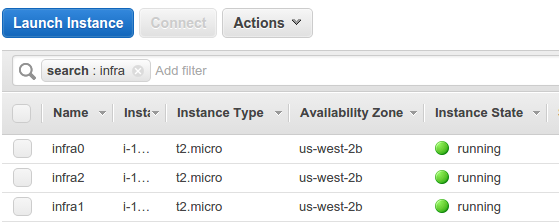
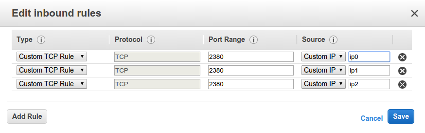
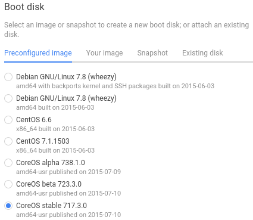
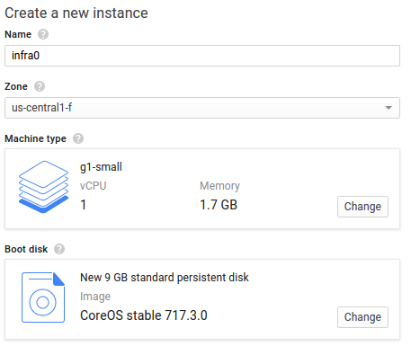
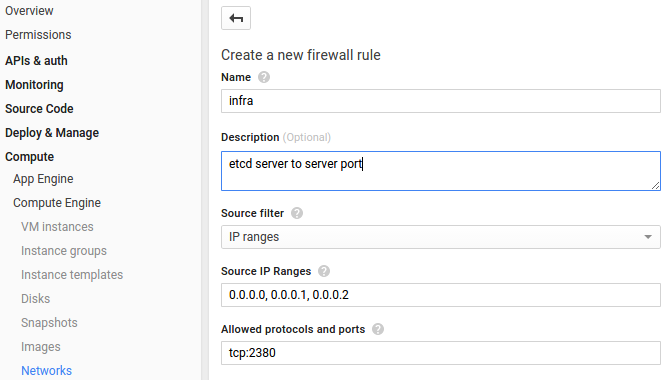

[*back to contents*](https://github.com/gyuho/learn#contents)
<br>

# etcd, priority queue, aws, gcp

- [Reference](#reference)
- [Scheduling API Call Problem](#scheduling-api-call-problem)
	- [Solution #1: Schedule with Atomic Variable](#solution-1-schedule-with-atomic-variable)
	- [Solution #2: Message Queueing System](#solution-2-message-queueing-system)
	- [Solution #3: Centralized Key/Value Storage](#solution-3-centralized-keyvalue-storage)
- [Deploy `etcd` server](#deploy-etcd-server)

[↑ top](#etcd-priority-queue-aws-gcp)
<br><br><br><br>
<hr>


#### Reference

- [`coreos/etcd`](https://github.com/coreos/etcd)
- [**_Source code for `etcd` priority queue_**](./etcd_priority_queue)

[↑ top](#etcd-priority-queue-aws-gcp)
<br><br><br><br>
<hr>


#### Scheduling API Call Problem

Suppose an external service that a company depends on:

- The external service provides an API.
- The call to API has a **rate limit**.
- **Concurrent calls** are **NOT** allowed.
- Concurrent calls from **different IPs** are **NOT** allowed.
- Exceeding rate limit would fail all requests from a company.



Now we have multiple machines sending *requests* to this **ONE limited resource**.
Exceeding API limits would fail all requests. Then you would need something
that can/is:

- Handle **concurrent** requests and **limit** them to *one* resource.
- **Schedule** several **jobs** with **priorities**.
- Fast, reliable, free, easy to use.

There are many ways to achieve this:

[↑ top](#etcd-priority-queue-aws-gcp)
<br><br><br><br>
<hr>


#### Solution #1: Schedule with Atomic Variable



If your language provides
[atomic](http://en.wikipedia.org/wiki/Linearizability) variables, this is the
easiest, simplest way. Go has [atomic](https://golang.org/pkg/sync/atomic/)
package: *package atomic provides low-level atomic memory primitives useful for
implementing synchronization algorithms.* **A variable is atomic when
guaranteed an isolation from concurrent processes.** Basically it’s a shared
variable with atomic operations. It’s not a global variable. Global variables
do not have synchronization mechanisms for concurrent access. Each request to
an application spawns its own process, thread, or [**_goroutines in
Go_**](http://golang.org/pkg/net/http/#Server.Serve), and several requests can
update shared values at the same time, causing unexpected data loss and race
conditions, like below.

```go
package main

import (
	"fmt"
	"log"
	"net/http"
	"strings"
	"time"
)

var (
	global int

	timeChan = time.NewTimer(5 * time.Second).C
	tickChan = time.NewTicker(time.Second).C
)

func readGlobal() {
	for {
		select {
		case <-timeChan:
			fmt.Println("5 seconds passed: done")
			return
		case <-tickChan:
			fmt.Println("global:", global)
		}
	}
}

func httpen(dom string) string {
	dom = strings.TrimSpace(dom)
	if !strings.HasPrefix(dom, "http://") {
		dom = "http://" + dom
	}
	return dom
}

func ping(i int) {
	time.Sleep(2 * time.Second)
	global += i
	req, err := http.NewRequest("HEAD", "http://localhost:5500", nil)
	if err != nil {
		log.Fatal(err)
	}
	client := http.DefaultClient
	resp, err := client.Do(req)
	if err != nil {
		log.Fatal(err)
	}
	defer resp.Body.Close()

	stCode := resp.StatusCode
	stText := http.StatusText(resp.StatusCode)
	log.Printf("[ %d | %s ]", stCode, stText)
}

func main() {
	go readGlobal()
	for i := 0; i < 5; i++ {
		go ping(i)
	}
	http.HandleFunc("/", root)
	http.ListenAndServe(":5500", nil)
}

func root(w http.ResponseWriter, r *http.Request) {
	global++
	w.Write([]byte("OK"))
}

/*
sudo kill $(sudo netstat -tlpn | perl -ne 'my @a = split /[ \/]+/; print "$a[6]\n" if m/:5500 /gio')
global: 0
global: 0
2015/07/05 17:28:23 [ 200 | OK ]
2015/07/05 17:28:23 [ 200 | OK ]
2015/07/05 17:28:23 [ 200 | OK ]
2015/07/05 17:28:23 [ 200 | OK ]
2015/07/05 17:28:23 [ 200 | OK ]
global: 15
global: 15
global: 15
5 seconds passed: done
*/
```

Use an **atomic variable** as
[semaphore](http://en.wikipedia.org/wiki/Semaphore_%28programming%29) to limit
access to resources. You can define an atomic variable at top level of your
application with integer type, and pass it to all processes that need access to
your limited resources. When a process uses the resource, you block other
requests by changing the atomic variable to 1 (or whatever value makes sense to
you), and make them wait till it becomes 0: you set the variable to 0 when a
job is done. The code below shows that however you send **concurrent
requests**, **_increment occurs atomically_**.

```go
package main

import (
	"fmt"
	"net/http"
	"sync/atomic"
	"time"
)

var (
	atomicVar *int32
	countVar  *int32

	timeChan = time.NewTimer(time.Minute).C
	tickChan = time.NewTicker(time.Second).C
)

func readAtomic() {
	for {
		select {
		case <-timeChan:
			fmt.Println("done")
			return
		case <-tickChan:
			fmt.Println("atomicVar:", atomic.LoadInt32(atomicVar))
			fmt.Println("countVar:", atomic.LoadInt32(countVar))
		}
	}
}

func addAtomic() {
	fmt.Println("addAtomic")
	for {
		if atomic.LoadInt32(atomicVar) == 0 {
			atomic.StoreInt32(atomicVar, 1)
			atomic.AddInt32(countVar, 1)
			atomic.StoreInt32(atomicVar, 0)
			break
		}
		time.Sleep(time.Second)
	}
}

func main() {
	var num1 int32
	atomicVar = &num1
	atomic.StoreInt32(atomicVar, 0)

	var num2 int32
	countVar = &num2
	atomic.StoreInt32(countVar, 0)

	go readAtomic()

	http.HandleFunc("/", root)
	http.HandleFunc("/add", add)

	http.ListenAndServe(":3333", nil)
}

func root(w http.ResponseWriter, r *http.Request) {
	w.Write([]byte("OK"))
}

func add(w http.ResponseWriter, r *http.Request) {
	go addAtomic()
	w.Write([]byte("ADD"))
}

/*
localhost:3333
localhost:3333/add
sudo kill $(sudo netstat -tlpn | perl -ne 'my @a = split /[ \/]+/; print "$a[6]\n" if m/:3333 /gio')
atomicVar: 0
countVar: 3
atomicVar: 0
countVar: 3
atomicVar: 0
countVar: 3
addAtomic
atomicVar: 0
countVar: 4
atomicVar: 0
countVar: 4
addAtomic
atomicVar: 0
countVar: 5
atomicVar: 0
countVar: 5
*/
```

This works because an atomic operation guarantees the isolation from concurrent
processes (requests from users in web application). Executing only when the
atomic variable is 0, you can limit multiple requests to one resource. It’s
fast with everything done in memory, but not the best way: other jobs have to
keep hitting the atomic variable to check the availability. It’s hard to
prioritize jobs with `atomic` variable because
[`atomic`](http://en.wikipedia.org/wiki/Linearizability) is usually only
defined as an integer type.

[↑ top](#etcd-priority-queue-aws-gcp)
<br><br><br><br>
<hr>


#### Solution #2: Message Queueing System



You serialize concurrent requests into a queue and execute them in
*First-In-First-Out (FIFO)* order. There are [many open source
projects](http://queues.io/) for queue. Running only the first element
at a time can order multiple, concurrent requests into one single
line, and limit it to one single resource. But most messaging
queue systems do not support
[priority queue](http://en.wikipedia.org/wiki/Priority_queue).
You would have to implement
[your own priority queue](https://groups.google.com/d/msg/nsq-users/QvgCsQ861Lw/z6H6uColDZcJ),
which is fine. You *dequeue* the first few elements in the *queue* and
build **heap** in memory and execute them in order.
If it had millions of requests, messaging queue should be better.
But this particular problem is more about coordinating, prioritizing
a small number of jobs (*small enough to fit in memory*). Additionally
we needed to keep the record of job execution results, which can be done
by updating the value of the job key. In queue, once you *dequeue*, it
has to be consumed with nowhere to save the results.

So I decided to try key/value storage.

[↑ top](#etcd-priority-queue-aws-gcp)
<br><br><br><br>
<hr>


#### Solution #3: Centralized Key/Value Storage



There are many [key/value databases](http://nosql-database.org/) but I chose
[*etcd*](https://coreos.com/etcd/). Why not [*Redis*](http://redis.io/)?

[**_Redis_**](http://redis.io/) is an **key-value** cache and store, a data
structure server for **_RE_**mote **_DI_**ctionary **_S_**erver.
[**_etcd_**](https://github.com/coreos/etcd) is a **distributed key-value**
store,
[*`/etc`*](http://www.tldp.org/LDP/Linux-Filesystem-Hierarchy/html/etc.html)
distributed. The directory `/etc` in Linux contains system configuration files for
program controls. Then `etcd` is a distributed key-value store for system
configurations.

**_Redis_** and **_`etcd`_** have the same premise: **_key-value store_**.
But they are different in that `etcd` is designed for distributed system and
for storing system configurations.

<br>
`etcd` is:

- Written in Go.
- You can `cURL` without any special client libraries.
- Designed for distributed systems.


<br>
So here's how I used `etcd`:

- **Requests go to** `etcd` server and [**atomically create in-order
  keys**](https://coreos.com/etcd/docs/2.0.8/api.html).
- Each request is **sent** with **priority value**.
- Periodically `**_retreive_** all *keys* from *etcd*.
- In memory, **_build a [heap](http://en.wikipedia.org/wiki/Priority_queue)_**,
  with job's priorities and indexes.
- **_Execute_** in the **order** of the **priorities**.
- **Update each index/key** with execution results.

<br>
And here's the [code](./etcd_priority_queue).

[↑ top](#etcd-priority-queue-aws-gcp)
<br><br><br><br>
<hr>


#### Deploy `etcd` server

First install [**`etcd`**](https://github.com/coreos/etcd) from
[*releases*](https://github.com/coreos/etcd/releases). And note that *etcd*
uses:

- port `2379` for client communication.
- port `2380` for server-to-server communication.
- `initial-advertise-peer-urls` should match the values in `initial-cluster`.

<br>

In [**_AWS_**](http://aws.amazon.com/), you can first launch three [EC2](https://aws.amazon.com/ec2)
instances within the same `VPC` like below:



And set up a security group in order to **open port `2380` to each
server(instance)**:



And `ssh` into each machine to install `etcd` with the following commands:

```sh
# port 2379 is for client communication.
# port 2380 is for server-to-server communication.

export INFRA_PRIVATE_IP_0=172.0.0.0;
export INFRA_PRIVATE_IP_1=172.0.0.1;
export INFRA_PRIVATE_IP_2=172.0.0.2;

# if you need to expose to public
export INFRA_PUBLIC_IP_0=52.0.0.0;
export INFRA_PUBLIC_IP_1=52.0.0.1;
export INFRA_PUBLIC_IP_2=52.0.0.2;


# deploy in each machine with
curl -L  https://github.com/coreos/etcd/releases/download/v2.1.0-rc.0/etcd-v2.1.0-rc.0-linux-amd64.tar.gz -o etcd-v2.1.0-rc.0-linux-amd64.tar.gz
tar xzvf etcd-v2.1.0-rc.0-linux-amd64.tar.gz;
cd etcd-v2.1.0-rc.0-linux-amd64;
./etcd \
-name infra0 \
-initial-cluster-token my-infra \
-initial-cluster infra0=http://$INFRA_PRIVATE_IP_0:2380,infra1=http://$INFRA_PRIVATE_IP_1:2380,infra2=http://$INFRA_PRIVATE_IP_2:2380 \
-initial-cluster-state new \
-initial-advertise-peer-urls http://$INFRA_PRIVATE_IP_0:2380 \
-listen-peer-urls http://$INFRA_PRIVATE_IP_0:2380 \
-listen-client-urls http://$INFRA_PRIVATE_IP_0:2379,http://127.0.0.1:2379 \
-advertise-client-urls http://$INFRA_PRIVATE_IP_0:2379 \
;

curl -L  https://github.com/coreos/etcd/releases/download/v2.1.0-rc.0/etcd-v2.1.0-rc.0-linux-amd64.tar.gz -o etcd-v2.1.0-rc.0-linux-amd64.tar.gz
tar xzvf etcd-v2.1.0-rc.0-linux-amd64.tar.gz;
cd etcd-v2.1.0-rc.0-linux-amd64;
./etcd \
-name infra1 \
-initial-cluster-token my-infra \
-initial-cluster infra0=http://$INFRA_PRIVATE_IP_0:2380,infra1=http://$INFRA_PRIVATE_IP_1:2380,infra2=http://$INFRA_PRIVATE_IP_2:2380 \
-initial-cluster-state new \
-initial-advertise-peer-urls http://$INFRA_PRIVATE_IP_1:2380 \
-listen-peer-urls http://$INFRA_PRIVATE_IP_1:2380 \
-listen-client-urls http://$INFRA_PRIVATE_IP_1:2379,http://127.0.0.1:2379 \
-advertise-client-urls http://$INFRA_PRIVATE_IP_1:2379 \
;

curl -L  https://github.com/coreos/etcd/releases/download/v2.1.0-rc.0/etcd-v2.1.0-rc.0-linux-amd64.tar.gz -o etcd-v2.1.0-rc.0-linux-amd64.tar.gz
tar xzvf etcd-v2.1.0-rc.0-linux-amd64.tar.gz;
cd etcd-v2.1.0-rc.0-linux-amd64;
./etcd \
-name infra2 \
-initial-cluster-token my-infra \
-initial-cluster infra0=http://$INFRA_PRIVATE_IP_0:2380,infra1=http://$INFRA_PRIVATE_IP_1:2380,infra2=http://$INFRA_PRIVATE_IP_2:2380 \
-initial-cluster-state new \
-initial-advertise-peer-urls http://$INFRA_PRIVATE_IP_2:2380 \
-listen-peer-urls http://$INFRA_PRIVATE_IP_2:2380 \
-listen-client-urls http://$INFRA_PRIVATE_IP_2:2379,http://127.0.0.1:2379 \
-advertise-client-urls http://$INFRA_PRIVATE_IP_2:2379 \
;


# outside of VPC, you would do
curl -L http://$INFRA_PUBLIC_IP_0:2379/version;
curl -L http://$INFRA_PUBLIC_IP_0:2379/v2/keys/status;
curl -L http://$INFRA_PUBLIC_IP_0:2379/v2/keys/test;
curl -L http://$INFRA_PUBLIC_IP_0:2379/v2/keys/queue;
curl -L -XPUT http://$INFRA_PUBLIC_IP_0:2379/v2/keys/test/55 -d value="Hello";
curl -L -XDELETE http://$INFRA_PUBLIC_IP_0:2379/v2/keys/queue/350;
```

Additionally, if you need access to `etcd` servers outside of `VPC`, make
sure to open **client port `2379`** to your external client IP.

<br>
In [**_GCP_**](https://cloud.google.com/), you can just launch from default
[*CoreOS*](https://coreos.com/) images.




[*CoreOS disk*](https://coreos.com/docs/running-coreos/cloud-providers/google-compute-engine/)
ships with built-in `etcd`, so you do not need to install `etcd` unless you
want to install the latest versions manually. 


And make sure each machine in cluster is able to talk to each other by
opening the **_port 2380_** like below:



And you can use the same script as above.

[↑ top](#etcd-priority-queue-aws-gcp)
<br><br><br><br>
<hr>
