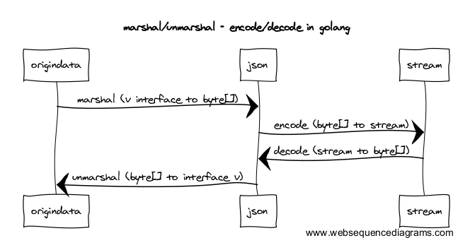

[*back to contents*](https://github.com/gyuho/learn#contents)<br>

# Go: archive, compress, encoding

In Go, `Marshal` means convert structured data to `[]byte`, so that it
can send them over network. `Encode` puts those `[]byte` data into stream.
`Encode` is sometimes called *serialize*.



- [Reference](#reference)
- [`archive`](#archive)
- [`compress`](#compress)
- [untar, unzip](#untar, unzip)
- [encoding, decoding `json`](#encoding-decoding-json)
- [encoding, decoding `xml`](#encoding-decoding-xml)
- [encoding, decoding `yaml`](#encoding-decoding-yaml)

[↑ top](#go-archive-compress-encoding)
<br><br><br><br><hr>


#### Reference

- [Crossing Streams: a Love Letter to io.Reader by Jason Moiron](http://jmoiron.net/blog/crossing-streams-a-love-letter-to-ioreader/)
- [Journey into cryptography](https://www.khanacademy.org/computing/computer-science/cryptography)

[↑ top](#go-archive-compress-encoding)
<br><br><br><br><hr>


#### `archive`

```go
package main

import (
	"archive/tar"
	"archive/zip"
	"fmt"
	"io"
	"os"
)

// openToOverwrite creates or opens a file for overwriting.
// Make sure to close the file.
func openToOverwrite(fpath string) (*os.File, error) {
	f, err := os.OpenFile(fpath, os.O_RDWR|os.O_TRUNC, 0777)
	if err != nil {
		f, err = os.Create(fpath)
		if err != nil {
			return f, err
		}
	}
	return f, nil
}

// openToRead reads a file.
// Make sure to close the file.
func openToRead(fpath string) (*os.File, error) {
	f, err := os.OpenFile(fpath, os.O_RDONLY, 0444)
	if err != nil {
		return f, err
	}
	return f, nil
}

// http://golang.org/pkg/archive/tar/
func main() {
	func() {
		fpath := "my.tar"
		defer os.Remove(fpath)

		func() {
			// Open to write a tar file.
			f, err := openToOverwrite(fpath)
			defer f.Close()
			if err != nil {
				panic(err)
			}

			// buf := new(bytes.Buffer) // Create a buffer to write our archive to.
			// tw := tar.NewWriter(buf) // Create a new tar archive.
			tw := tar.NewWriter(f)

			// Add some files to the archive.
			var files = []struct {
				Name, Body string
			}{
				{"readme.txt", "This archive contains some text files."},
				{"gopher.txt", "Gopher names:\nGeorge\nGeoffrey\nGonzo"},
				{"todo.txt", "Get animal handling licence."},
			}
			for _, file := range files {
				hdr := &tar.Header{
					Name: file.Name,
					Mode: 0600,
					Size: int64(len(file.Body)),
				}
				if err := tw.WriteHeader(hdr); err != nil {
					panic(err)
				}
				if _, err := tw.Write([]byte(file.Body)); err != nil {
					panic(err)
				}
			}
			// Make sure to check the error on Close.
			if err := tw.Close(); err != nil {
				panic(err)
			}
		}()

		fmt.Println()

		func() {
			// Open the tar archive for reading.
			//
			// r := bytes.NewReader(buf.Bytes())
			// tr := tar.NewReader(r)
			f, err := openToRead(fpath)
			defer f.Close()
			if err != nil {
				panic(err)
			}
			tr := tar.NewReader(f)
			for {
				hdr, err := tr.Next()
				if err == io.EOF {
					// end of tar archive
					break
				}
				if err != nil {
					panic(err)
				}
				fmt.Println()
				fmt.Printf("Contents of %s:\n", hdr.Name)
				if _, err := io.Copy(os.Stdout, tr); err != nil {
					panic(err)
				}
				fmt.Println()
			}
		}()
	}()

	func() {
		fpath := "my.zip"
		defer os.Remove(fpath)

		func() {
			f, err := openToOverwrite(fpath)
			defer f.Close()
			if err != nil {
				panic(err)
			}
			zw := zip.NewWriter(f)
			var files = []struct {
				Name, Body string
			}{
				{"readme.txt", "This archive contains some text files."},
				{"gopher.txt", "Gopher names:\nGeorge\nGeoffrey\nGonzo"},
				{"todo.txt", "Get animal handling licence."},
			}
			for _, file := range files {
				fz, err := zw.Create(file.Name)
				if err != nil {
					panic(err)
				}
				if _, err := fz.Write([]byte(file.Body)); err != nil {
					panic(err)
				}
			}
			// Make sure to check the error on Close.
			if err := zw.Close(); err != nil {
				panic(err)
			}
		}()

		fmt.Println()

		func() {
			fz, err := zip.OpenReader(fpath)
			defer fz.Close()
			if err != nil {
				panic(err)
			}
			for _, oneFile := range fz.File {
				rc, err := oneFile.Open()
				if err != nil {
					panic(err)
				}
				fmt.Println()
				fmt.Printf("Contents of %s:\n", oneFile.Name)
				if _, err := io.Copy(os.Stdout, rc); err != nil {
					panic(err)
				}
				fmt.Println()
				rc.Close()
			}
		}()
	}()
}

```

[↑ top](#go-archive-compress-encoding)
<br><br><br><br><hr>


#### untar, unzip

```go
package main

import (
	"archive/tar"
	"archive/zip"
	"compress/gzip"
	"fmt"
	"io"
	"io/ioutil"
	"os"
	"path/filepath"
)

// http://golang.org/pkg/archive/tar/
func main() {
	func() {
		fpath := "my.tar.gz"
		defer os.Remove(fpath)
		writeToFiles()
		writeToTar(filePathSlice, fpath)
		deleteFiles()
		untar(fpath)
		deleteFiles()
	}()

	func() {
		fpath := "my.zip"
		defer os.Remove(fpath)
		writeToFiles()
		writeToZip(filePathSlice, fpath)
		deleteFiles()
		unzip(fpath)
		deleteFiles()
	}()
}

func writeToTar(filePathSlice []string, tarPath string) {
	f, err := openToOverwrite(tarPath)
	defer f.Close()
	if err != nil {
		panic(err)
	}
	gw := gzip.NewWriter(f)
	defer gw.Close()
	if err != nil {
		panic(err)
	}
	tw := tar.NewWriter(gw)
	for _, fpath := range filePathSlice {
		sf, err := openToRead(fpath)
		defer sf.Close()
		if err != nil {
			panic(err)
		}
		body, err := ioutil.ReadAll(sf)
		if err != nil {
			panic(err)
		}
		hdr := &tar.Header{
			Name: fpath,
			Mode: 0600,
			Size: int64(len(body)),

			// Need to set typeflag
			//
			// http://www.gnu.org/software/tar/manual/html_node/Standard.html
			// #define REGTYPE  '0'            /* regular file */
			Typeflag: byte('0'),

			// or use
			// http://golang.org/pkg/archive/tar/#FileInfoHeader
		}
		if err := tw.WriteHeader(hdr); err != nil {
			panic(err)
		}
		if _, err := tw.Write(body); err != nil {
			panic(err)
		}
	}
	if err := tw.Close(); err != nil {
		panic(err)
	}
}

func untar(fpath string) {
	f, err := openToRead(fpath)
	defer f.Close()
	if err != nil {
		panic(err)
	}
	gr, err := gzip.NewReader(f)
	defer gr.Close()
	if err != nil {
		panic(err)
	}
	tr := tar.NewReader(gr)
	for {
		hdr, err := tr.Next()
		if err == io.EOF {
			break
		}
		if err != nil {
			panic(err)
		}
		path := hdr.Name
		switch hdr.Typeflag {
		case tar.TypeDir:
			if err := os.MkdirAll(path, os.FileMode(hdr.Mode)); err != nil {
				panic(err)
			}
		case tar.TypeReg:
			ow, err := openToOverwrite(path)
			defer ow.Close()
			if err != nil {
				panic(err)
			}
			if _, err := io.Copy(ow, tr); err != nil {
				panic(err)
			}
		default:
			fmt.Printf("Unable to untar: %c, %s\n", hdr.Typeflag, path)
		}
	}
}

func writeToZip(filePathSlice []string, zipPath string) {
	f, err := openToOverwrite(zipPath)
	defer f.Close()
	if err != nil {
		panic(err)
	}
	zw := zip.NewWriter(f)
	for _, fpath := range filePathSlice {
		fz, err := zw.Create(fpath)
		if err != nil {
			panic(err)
		}
		sf, err := openToRead(fpath)
		defer sf.Close()
		if err != nil {
			panic(err)
		}
		body, err := ioutil.ReadAll(sf)
		if err != nil {
			panic(err)
		}
		if _, err := fz.Write(body); err != nil {
			panic(err)
		}
	}
	if err := zw.Close(); err != nil {
		panic(err)
	}
}

func unzip(fpath string) {
	fz, err := zip.OpenReader(fpath)
	defer fz.Close()
	if err != nil {
		panic(err)
	}
	for _, oneFile := range fz.File {
		rc, err := oneFile.Open()
		if err != nil {
			panic(err)
		}
		path := filepath.Join("./", oneFile.Name)
		if oneFile.FileInfo().IsDir() {
			if err := os.MkdirAll(path, oneFile.Mode()); err != nil {
				panic(err)
			}
		} else {
			ow, err := openToOverwrite(path)
			defer ow.Close()
			if err != nil {
				panic(err)
			}
			if _, err := io.Copy(ow, rc); err != nil {
				panic(err)
			}
		}
		rc.Close()
	}
}

// openToOverwrite creates or opens a file for overwriting.
// Make sure to close the file.
func openToOverwrite(fpath string) (*os.File, error) {
	f, err := os.OpenFile(fpath, os.O_RDWR|os.O_TRUNC, 0777)
	if err != nil {
		f, err = os.Create(fpath)
		if err != nil {
			return f, err
		}
	}
	return f, nil
}

// openToRead reads a file.
// Make sure to close the file.
func openToRead(fpath string) (*os.File, error) {
	f, err := os.OpenFile(fpath, os.O_RDONLY, 0444)
	if err != nil {
		return f, err
	}
	return f, nil
}

var files = []struct {
	Name, Body string
}{
	{"readme.txt", "This archive contains some text files."},
	{"gopher.txt", "Gopher names:\nGeorge\nGeoffrey\nGonzo"},
	{"todo.txt", "Get animal handling licence."},
}

var filePathSlice = []string{
	"readme.txt",
	"gopher.txt",
	"todo.txt",
}

func writeToFiles() {
	for _, file := range files {
		f, err := openToOverwrite(file.Name)
		if err != nil {
			panic(err)
		}
		if _, err := f.WriteString(file.Body); err != nil {
			panic(err)
		}
		f.Close()
	}
}

func deleteFiles() {
	for _, file := range files {
		os.Remove(file.Name)
	}
}

```

[↑ top](#go-archive-compress-encoding)
<br><br><br><br><hr>


#### `compress`

```go
package main

import (
	"compress/gzip"
	"compress/zlib"
	"fmt"
	"io/ioutil"
	"os"
)

func main() {
	func() {
		fpath := "test.tar.gz"
		if err := toGzip("Hello World!", fpath); err != nil {
			panic(err)
		}
		if tb, err := gZipToBytes(fpath); err != nil {
			panic(err)
		} else {
			fmt.Println(fpath, ":", string(tb))
			// test.tar.gz : Hello World!
		}
		os.Remove(fpath)
	}()

	func() {
		fpath := "test.tar.zlib"
		if err := toZlib("Hello World!", fpath); err != nil {
			panic(err)
		}
		if tb, err := zLibToBytes(fpath); err != nil {
			panic(err)
		} else {
			fmt.Println(fpath, ":", string(tb))
			// test.tar.zlib : Hello World!
		}
		os.Remove(fpath)
	}()
}

// exec.Command("gzip", "-f", fpath).Run()
func toGzip(txt, fpath string) error {
	f, err := os.OpenFile(fpath, os.O_RDWR|os.O_TRUNC, 0777)
	if err != nil {
		f, err = os.Create(fpath)
		if err != nil {
			return err
		}
	}
	defer f.Close()
	gw := gzip.NewWriter(f)
	if _, err := gw.Write([]byte(txt)); err != nil {
		return err
	}
	gw.Close()
	gw.Flush()
	return nil
}

func toZlib(txt, fpath string) error {
	f, err := os.OpenFile(fpath, os.O_RDWR|os.O_TRUNC, 0777)
	if err != nil {
		f, err = os.Create(fpath)
		if err != nil {
			return err
		}
	}
	defer f.Close()
	zw := zlib.NewWriter(f)
	if _, err := zw.Write([]byte(txt)); err != nil {
		return err
	}
	zw.Close()
	zw.Flush()
	return nil
}

func gZipToBytes(fpath string) ([]byte, error) {
	f, err := os.OpenFile(fpath, os.O_RDONLY, 0444)
	if err != nil {
		return nil, err
	}
	defer f.Close()

	fz, err := gzip.NewReader(f)
	if err != nil {
		return nil, err
	}
	defer fz.Close()

	// or JSON
	// http://jmoiron.net/blog/crossing-streams-a-love-letter-to-ioreader/
	s, err := ioutil.ReadAll(fz)
	if err != nil {
		return nil, err
	}
	return s, nil
}

func zLibToBytes(fpath string) ([]byte, error) {
	f, err := os.OpenFile(fpath, os.O_RDONLY, 0444)
	if err != nil {
		return nil, err
	}
	defer f.Close()

	z, err := zlib.NewReader(f)
	if err != nil {
		return nil, err
	}
	defer z.Close()
	s, err := ioutil.ReadAll(z)
	if err != nil {
		return nil, err
	}
	return s, nil
}

```

[↑ top](#go-archive-compress-encoding)
<br><br><br><br><hr>


#### encoding, decoding `json`

Try [this](https://play.golang.org/p/-vnad3oev1):

```go
package main

import (
	"bytes"
	"encoding/json"
	"fmt"
	"io"
	"log"
	"strings"
)

type pair struct {
	ProxyID  string `json:"proxyID"`
	Endpoint string `json:"endpoint"`
}

func makePair(proxyID, endpoint string) pair {
	return pair{ProxyID: proxyID, Endpoint: endpoint}
}

func encodePair(proxyID, endpoint string) (string, error) {
	p := pair{ProxyID: proxyID, Endpoint: endpoint}
	buf := new(bytes.Buffer)
	if err := json.NewEncoder(buf).Encode(p); err != nil {
		return "", err
	}
	return buf.String(), nil
}

func decodePair(rd io.Reader) (pair, error) {
	p := pair{}
	dec := json.NewDecoder(rd)
	for {
		if err := dec.Decode(&p); err == io.EOF {
			break
		} else if err != nil {
			return pair{}, err
		}
	}
	return p, nil
}

func equalPair(s0, s1 string) bool {
	p0, err0 := decodePair(strings.NewReader(s0))
	if err0 != nil {
		return false
	}
	p1, err1 := decodePair(strings.NewReader(s1))
	if err1 != nil {
		return false
	}
	return p0.ProxyID == p1.ProxyID && p0.Endpoint == p1.Endpoint
}

func main() {
	type Data struct {
		Name   string
		Number int
	}
	dt := Data{}
	dec := json.NewDecoder(strings.NewReader(`{"Name": "a", "Number": 1}`))
	for {
		if err := dec.Decode(&dt); err == io.EOF {
			break
		} else if err != nil {
			log.Fatal(err)
		}
	}
	fmt.Printf("%+v\n", dt) // {Name:a Number:1}

	p0 := makePair("test_id", "http://localhost:8080")
	fmt.Printf("makePair: %+v\n", p0)
	// makePair: {ProxyID:test_id Endpoint:http://localhost:8080}

	s0, err := encodePair("test_id", "http://localhost:8080")
	if err != nil {
		panic(err)
	}
	fmt.Printf("encodePair: %s\n", s0)
	// encodePair: {"proxyID":"test_id","endpoint":"http://localhost:8080"}

	p1, err := decodePair(strings.NewReader(`{
	"proxyID": "test_id",
	"endpoint": "http://localhost:8080"
}
`))
	if err != nil {
		panic(err)
	}
	fmt.Printf("decodePair: %+v\n", p1)
	// decodePair: {ProxyID:test_id Endpoint:http://localhost:8080}

	fmt.Println(equalPair(`{
	"proxyID": "test_id",
	"endpoint": "http://localhost:8080"
}
`, `{
	"endpoint": "http://localhost:8080",
	"proxyID": "test_id"
}
`)) // true
}

```

<br>
And try [this](http://play.golang.org/p/StdJGW-T4_):

```go
package main

import (
	"bytes"
	"encoding/json"
	"fmt"
	"io"
	"net/http"
	"strings"
)

var (
	sourceURL  = "http://httpbin.org/headers"
	sourceData = `
{
  "headers": {
    "Accept": "text/html,application/xhtml+xml,application/xml;q=0.9,image/webp,*/*;q=0.8", 
    "Accept-Encoding": "gzip, deflate, sdch", 
    "Accept-Language": "en-US,en;q=0.8,ko;q=0.6", 
    "Cookie": "_ga=GA1.2.630704613.1440642077", 
    "Dnt": "1", 
    "Host": "httpbin.org", 
    "Referer": "http://httpbin.org/", 
    "Upgrade-Insecure-Requests": "1", 
    "User-Agent": "Mozilla/5.0 (X11; Linux x86_64) AppleWebKit/537.36 (KHTML, like Gecko) Chrome/44.0.2403.157 Safari/537.36"
  }
}
`
)

type data struct {
	Headers struct {
		Accept    string `json:"Accept"`
		Host      string `json:"Host"`
		UserAgent string `json:"User-Agent"`
	} `json:"headers"`
}

func main() {
	func() {
		rs := make(map[string]interface{})
		rs["Go"] = "Google"
		buf := new(bytes.Buffer)
		if err := json.NewEncoder(buf).Encode(rs); err != nil {
			panic(err)
		}
		fmt.Println()
		fmt.Printf("json.NewEncoder with map: %+v\n", buf.String())
		// json.NewEncoder with map: {"Go":"Google"}
	}()

	func() {
		// func Get(url string) (resp *Response, err error)
		// type Response struct {
		// 		Body io.ReadCloser
		resp, err := http.Get(sourceURL)
		if resp == nil {
			return
		}
		defer resp.Body.Close()
		if err != nil {
			panic(err)
		}
		rs := make(map[string]interface{})

		// resp implements Write
		// resp.Body implements Read

		// http://jmoiron.net/blog/crossing-streams-a-love-letter-to-ioreader/
		// func ReadAll(r io.Reader) ([]byte, error)
		// body, err := ioutil.ReadAll(resp.Body)

		// func NewDecoder(r io.Reader) *Decoder
		dec := json.NewDecoder(resp.Body)
		for {
			// func (d *Decoder) Decode(v interface{}) error
			if err := dec.Decode(&rs); err == io.EOF {
				break
			} else if err != nil {
				panic(err)
			}
		}
		fmt.Println()
		fmt.Printf("json.NewDecoder with map: %+v\n", rs)
		// json.NewDecoder with map: map[headers:map[Accept-Encoding:gzip Host:httpbin.org User-Agent:Go-http-client/1.1]]
	}()

	func() {
		rs := data{}
		rs.Headers = struct {
			Accept    string `json:"Accept"`
			Host      string `json:"Host"`
			UserAgent string `json:"User-Agent"`
		}{
			"",
			"",
			"",
		}
		rs.Headers.Host = "google.com"
		buf := new(bytes.Buffer)
		if err := json.NewEncoder(buf).Encode(rs); err != nil {
			panic(err)
		}
		fmt.Println()
		fmt.Printf("json.NewEncoder with struct: %+v\n", buf.String())
		// json.NewEncoder with struct: {"headers":{"Accept":"","Host":"google.com","User-Agent":""}}
	}()

	func() {
		rs := data{}

		// func NewDecoder(r io.Reader) *Decoder
		// func NewReader(s string) *Reader
		dec := json.NewDecoder(strings.NewReader(sourceData))
		for {
			// func (d *Decoder) Decode(v interface{}) error
			if err := dec.Decode(&rs); err == io.EOF {
				break
			} else if err != nil {
				panic(err)
			}
		}
		fmt.Println()
		fmt.Printf("json.NewDecoder with struct: %+v\n", rs)
		// json.NewDecoder with struct: {Headers:{Accept:text/html,application/
		// ...
	}()
}

```

[↑ top](#go-archive-compress-encoding)
<br><br><br><br><hr>


#### encoding, decoding `xml`

Try [this](http://play.golang.org/p/284bY9VDlZ):

```go
package main

import (
	"bytes"
	"encoding/xml"
	"fmt"
	"io"
	"strings"
)

var (
	sourceData = `
<?xml version="1.0" encoding="UTF-8"?>
<list id="3218" typeid="3218">
  <title>All Topics And Genres</title>
  <subcategory name="News">
    <item id="1149" num="1" type="topic">
      <title>Afghanistan</title>
      <additionalInfo>Afghanistan</additionalInfo>
    </item>
    <item id="10001" num="92" type="genre">
      <title>Rock</title>
      <additionalInfo>Rock, pop, and folk music performances and features from NPR news, NPR cultural programs, and NPR Music stations.</additionalInfo>
    </item>
    <item id="1103" num="93" type="topic">
      <title>Studio Sessions</title>
      <additionalInfo>Musicians perform and discuss their work in the studios of NPR and NPR Music station partners. Live music sessions, interviews, and the best new songs in rock, pop, folk, classical, jazz, blues, urban, and world music. Watch video sessions.</additionalInfo>
    </item>
    <item id="10004" num="94" type="genre">
      <title>World</title>
      <additionalInfo>World music and features from NPR news, NPR cultural programs, and NPR Music stations.</additionalInfo>
    </item>
  </subcategory>
</list>
`
)

type data struct {
	Title         string `xml:"title"`
	SubCategories []struct {
		Name  string `xml:"name,attr"`
		Items []struct {
			Title string `xml:"title"`
			Info  string `xml:"additionalInfo"`
		} `xml:"item"`
	} `xml:"subcategory"`
}

func main() {
	func() {
		rs := data{}
		rs.SubCategories = []struct {
			Name  string `xml:"name,attr"`
			Items []struct {
				Title string `xml:"title"`
				Info  string `xml:"additionalInfo"`
			} `xml:"item"`
		}{}
		rs.Title = "google.com"
		buf := new(bytes.Buffer)
		if err := xml.NewEncoder(buf).Encode(rs); err != nil {
			panic(err)
		}
		fmt.Println()
		fmt.Printf("xml.NewEncoder with struct: %+v\n", buf.String())
		// xml.NewEncoder with struct: <data><title>google.com</title></data>
	}()

	func() {
		rs := data{}

		// func NewDecoder(r io.Reader) *Decoder
		// func NewReader(s string) *Reader
		dec := xml.NewDecoder(strings.NewReader(sourceData))
		for {
			// func (d *Decoder) Decode(v interface{}) error
			if err := dec.Decode(&rs); err == io.EOF {
				break
			} else if err != nil {
				panic(err)
			}
		}
		fmt.Println()
		fmt.Printf("xml.NewDecoder with struct: %+v\n", rs)
		// xml.NewDecoder with struct: {Title:All Topics And Genres SubCategories:[{Na
		// ...
	}()
}

```

[↑ top](#go-archive-compress-encoding)
<br><br><br><br><hr>


#### encoding, decoding `yaml`

```go
package main

import (
	"bytes"
	"encoding/json"
	"fmt"
	"io"

	"github.com/go-yaml/yaml"
)

var sourceData = `
_enabled: 1
_tag: AAAA
product_type:
- part_id: 6496293
- part_id: 6493671
configurations:
  my_name:
  - product_type:
    - part_id: 6496293
    - part_id: 6493671
    - part_id: 6495763
    - part_id: 6495685
    - part_id: 6495582
    - part_id: 6495660
    experiment_id: SurvJun1Cat1A0
    price_opt:
      number: 0
    price: 3
  - product_type:
    - part_id: 6496302
    experiment_id: SurvJun4Cat3A4
    price_opt:
      number: 4
      price_id: 1
    price: 30
model: model32
location: USA
platform:
  desktop: {}
  mobile: {}
`

type subData struct {
	PartID string `part_id`
}

type data struct {
	ProductType []subData `product_type`
}

func main() {
	func() {
		rs := make(map[string]interface{})
		rs["Go"] = "Google"
		// Marshal is to serialize Go objects into YAML.
		d, err := yaml.Marshal(rs)
		if err != nil {
			panic(err)
		}
		fmt.Println()
		fmt.Printf("yaml.Marshal with map: %+v\n", string(d))
		// yaml.Marshal with map: Go: Google
	}()

	func() {
		rs := make(map[interface{}]interface{})
		// Unmarshal is to deserialize YAML into Go objects.
		if err := yaml.Unmarshal([]byte(sourceData), &rs); err != nil {
			panic(err)
		}
		fmt.Println()
		fmt.Printf("yaml.Unmarshal with map: %+v\n", rs)
		// yaml.Unmarshal with map: map[platform:map[desktop:map[] mobile:map[]
		// ...

		for k := range rs {
			switch t := k.(type) {
			case string:
				fmt.Println(t)
			}
		}
	}()

	func() {
		rs := struct {
			Name     string
			Number   int `num`
			Category struct {
				Location string
			} `Category`
		}{}
		rs.Name = "Google"
		rs.Category = struct {
			Location string
		}{
			Location: "USA",
		}
		d, err := yaml.Marshal(rs)
		if err != nil {
			panic(err)
		}
		fmt.Println()
		fmt.Printf("yaml.Marshal with struct:\n%+v\n", string(d))
		// yaml.Marshal with struct:
		/*
		   name: Google
		   num: 0
		   Category:
		     location: USA
		*/
	}()

	func() {
		rs := data{}
		if err := yaml.Unmarshal([]byte(sourceData), &rs); err != nil {
			panic(err)
		}
		fmt.Println()
		fmt.Printf("yaml.Unmarshal with struct: %+v\n", rs)
		// yaml.Unmarshal with struct: {ProductType:[{PartID:6496293} {PartID:6493671}]}
	}()

	fmt.Println()
	fmt.Println("isJSON:", isJSON([]byte(sourceData)))
	// false
}

func isJSON(data []byte) bool {
	cmap := make(map[interface{}]interface{})
	dec := json.NewDecoder(bytes.NewReader(data))
	for {
		if err := dec.Decode(&cmap); err == io.EOF {
			break
		} else if err != nil {
			return false
		}
	}
	return true
}

```

[↑ top](#go-archive-compress-encoding)
<br><br><br><br><hr>
