[*back to contents*](https://github.com/gyuho/learn#contents)<br>

# Go: b-tree 

- [Reference](#reference)
- [Tree](#tree)
- [B-tree](#b-tree)
- [`btree`: insert](#btree-insert)

[↑ top](#go-b-tree)
<br><br><br><br><hr>


#### Reference

- [*B-tree*](https://en.wikipedia.org/wiki/B-tree)
- [*B-tree implementation*](https://github.com/google/btree) by *Graeme Connel*

[↑ top](#go-b-tree)
<br><br><br><br><hr>


#### Tree

[*Binary Search Tree*](https://en.wikipedia.org/wiki/Binary_search_tree) is
**_not_** always **_balanced_**, as below:

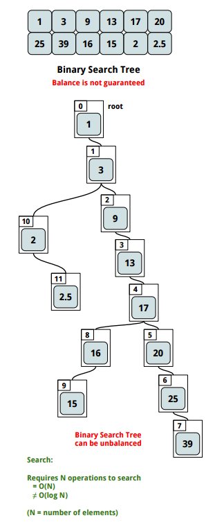

This is still a valid *binary search tree* but not a [*balanced binary
tree*](https://en.wikipedia.org/wiki/Self-balancing_binary_search_tree). The
**worst case time complexity** of **search** is **_`O(n)`_**, not *`O(log n)`*.
Likewise **average time complexity** of **_insertion_** and **_deletion_**
is **_`O(log n)`_**, *but* the **worst** case is **_`O(n)`_**.


<br><br>

Then what if we **maintain the balance of a binary search tree**? Tree would be
always be **balanced** so **guarantee** **_searching in `O(log n)`_**. This is
where [**red black
tree**](https://en.wikipedia.org/wiki/Red%E2%80%93black_tree)—a
[*self-balancing binary search
tree*](https://en.wikipedia.org/wiki/Self-balancing_binary_search_tree)—comes
in. Like a binary search tree, it is a *good data structure for searching
algorithms*.


<br><br>

And what if we have **more than two(binary) children** per node? It would be
[**N-ary tree**](https://en.wikipedia.org/wiki/K-ary_tree). And allowing
**_multiple branches_** per node **decreases tree height**, which means **less
operations are required for searching**—*faster lookup*. This is where
[**b-tree**](https://en.wikipedia.org/wiki/B-tree)—*generalization of a binary
search tree*—comes in. **Database can minimize the number of disk accesses for
data retrieval**.

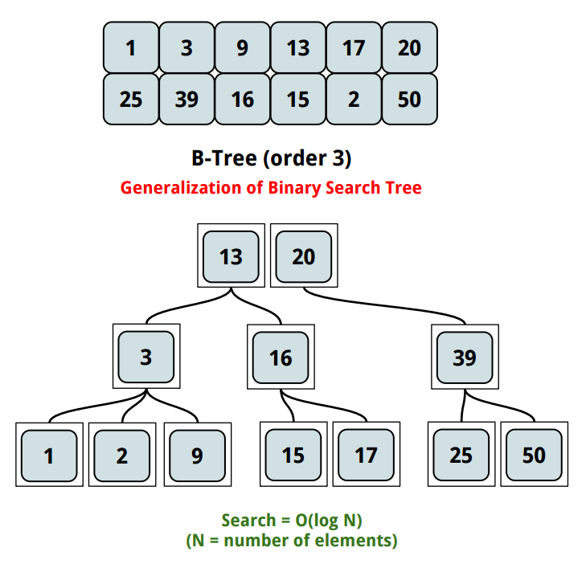

[↑ top](#go-b-tree)
<br><br><br><br><hr>


#### B-tree

> **_B-tree_** is a tree data structure that keeps data sorted and allows searches,
> sequential access, insertions, and deletions in logarithmic time. The B-tree
> is a *generalization of a binary search tree* in that a **node can have more than
> two children**. Unlike self-balancing binary search trees,
> the B-tree is **optimized for systems that read and write large blocks of data**.
> B-trees are a good example of a data structure for external memory. It is
> commonly used in *databases* and *filesystems*.
>
> The B-tree uses all of the ideas described above. In particular, a B-tree:
>	- keeps keys in sorted order for sequential traversing
>	- uses a hierarchical index to minimize the number of disk reads
>	- uses partially full blocks to speed insertions and deletions
>	- keeps the index balanced with an elegant recursive algorithm
>	- In addition, a B-tree minimizes waste by making sure the interior nodes are at least half full.
>	- A B-tree can handle an arbitrary number of insertions and deletions.

<br>

> According to Knuth's definition, a B-tree of order `m` is a tree which
> satisfies the following properties:
>
>	- Every node has at most `m` children.
>	- Every **non-leaf node** (*except root*) has at least ⌈`m⁄2`⌉ children.
>	- The root has at least two children if it is not a leaf node.
>	- A **non-leaf node** with `k` children contains `k−1` keys.
>	- All leaves appear in the same level.
>
> [*Wikipedia*](https://en.wikipedia.org/wiki/B-tree)

**B-tree** is useful for large chunks of data, while minimizing the disk
access. It has bigger index than binary trees, since it can have more
than two child nodes in one sector. This decreases the *height* or
*depth* of the tree, thus decreasing the average number of disk accesses.
For example, B-tree with branching factor of 1000 and height of 2 can
store *1000 x 1000 x 1000* keys. And since the root node can be
kept in main memory, you only need 2 disk accesses to tree search.

[↑ top](#go-b-tree)
<br><br><br><br><hr>


#### `btree`: insert

[*B-tree insertion by Wikepedia*](https://en.wikipedia.org/wiki/B-tree#Insertion)
explains:

> All insertions start at a leaf node. To insert a new element, search the tree
> to find the leaf node where the new element should be added. Insert the new
> element into that node with the following steps:
>
> If the node contains **fewer than the maximum legal number** of elements:
>	- Insert the *new element in the node*,
>	- **keeping the node's elements ordered.**
>
> Otherwise the node is full, evenly split it into two nodes so:
>	- A single median is chosen from among the leaf's elements and the new element.
>	- **Values less than the median** are put in the **new left node**
>		- and values **greater** than the median are put in the new **right** node, 
>		- with the **median acting as a separation value**.
>	- The **separation value** is inserted in the node's **parent**,
>		- which may cause it to be **split**, and so on.
>	- If the node has **no parent** (i.e., the node was the root),
>		- **create a new root** above this node (increasing the height of the tree).


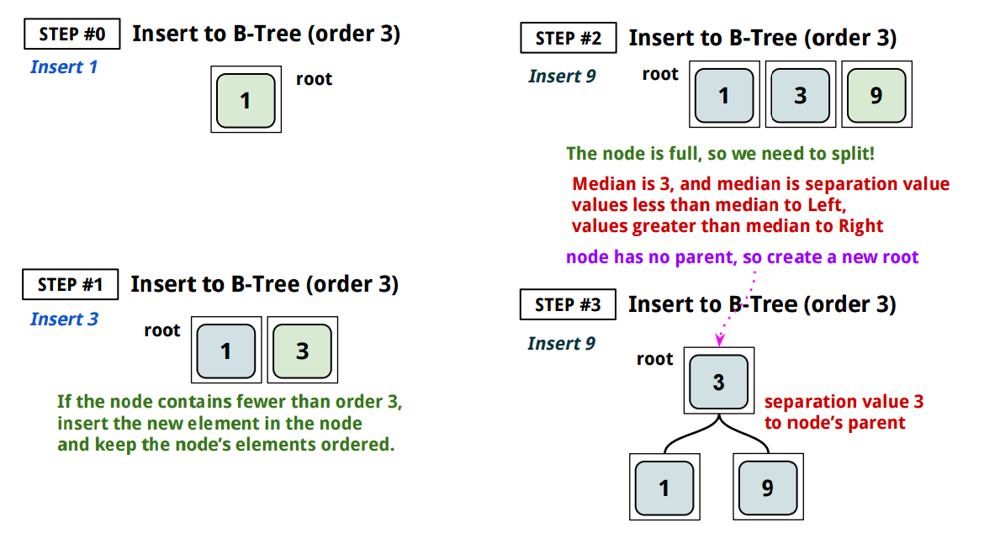
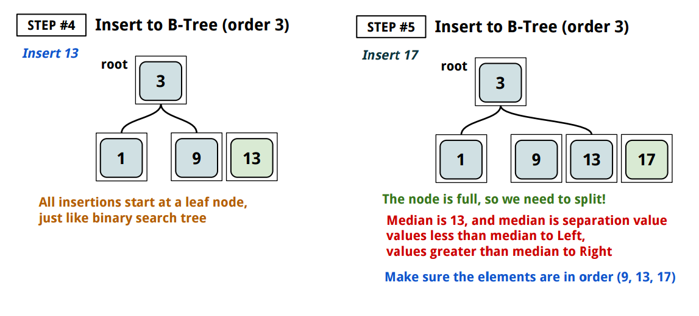
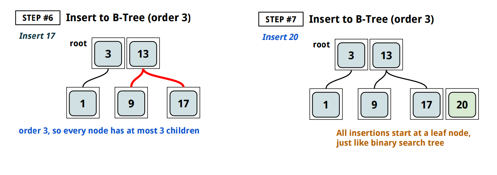
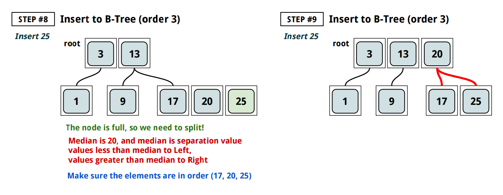
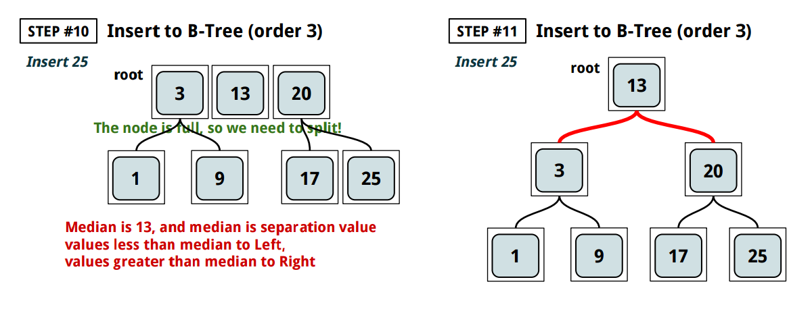
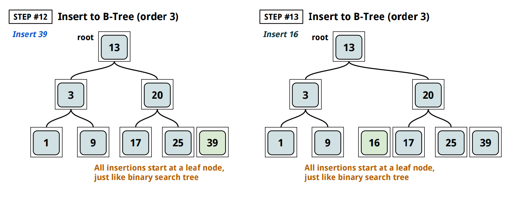
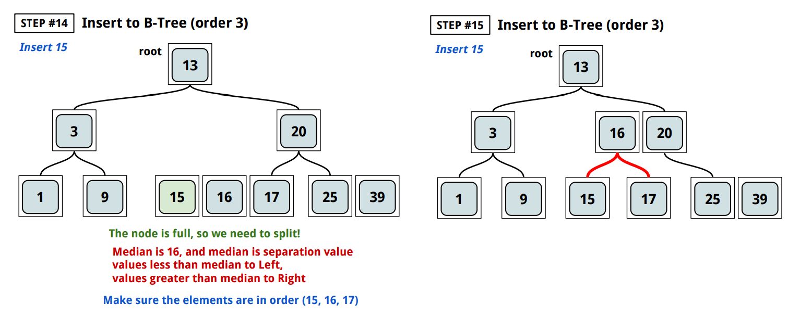
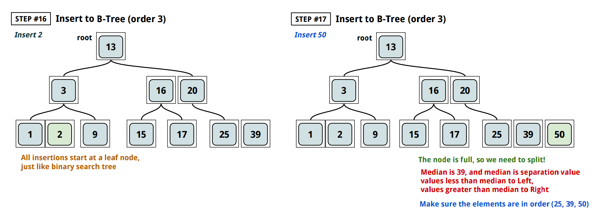
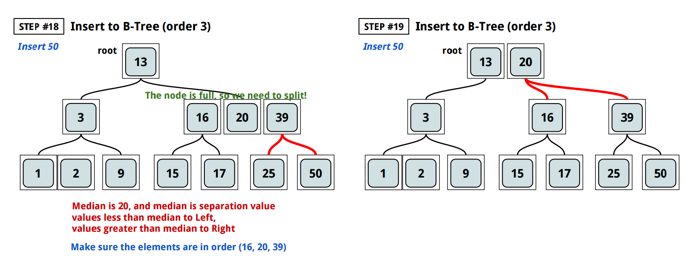

<br>

And [*google/btree*](https://github.com/google/btree) implements `node` as follows:

```go
// items stores items in a node.
type items []Item

// children stores child nodes in a node.
type children []*node

// node is an internal node in a tree.
//
// It must at all times maintain the invariant that either
//   * len(children) == 0, len(items) unconstrained
//   * len(children) == len(items) + 1
type node struct {
	items    items
	children children
	t        *BTree
}
```

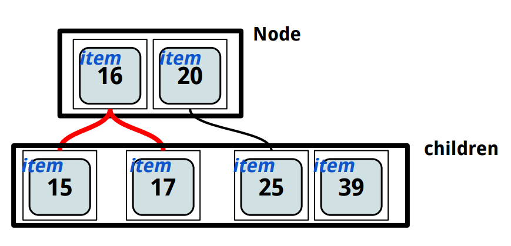

<br>

And try this [code](http://play.golang.org/p/kB0NFq7Wo2):

```go
// https://github.com/google/btree/blob/master/btree.go
package main

import (
	"fmt"
	"sort"
)

func main() {
	tr := New(3)
	for i := Int(0); i < 10; i++ {
		tr.ReplaceOrInsert(i)
	}
	fmt.Println("len:       ", tr.Len())
	fmt.Println("get3:      ", tr.Get(Int(3)))
	fmt.Println("get100:    ", tr.Get(Int(100)))
	fmt.Println("replace5:  ", tr.ReplaceOrInsert(Int(5)))
	fmt.Println("replace100:", tr.ReplaceOrInsert(Int(100)))
	/*
	   len:        10
	   get3:       3
	   get100:     <nil>
	   replace5:   5
	   replace100: <nil>
	*/
}

// Item represents a single object in the tree.
type Item interface {
	// Less tests whether the current item is less than the given argument.
	//
	// This must provide a strict weak ordering.
	// If !a.Less(b) && !b.Less(a), we treat this to mean a == b (i.e. we can only
	// hold one of either a or b in the tree).
	Less(than Item) bool
}

// Int implements the Item interface for integers.
type Int int

// Less returns true if int(a) < int(b).
func (a Int) Less(b Item) bool {
	return a < b.(Int)
}

//------------------------------------
// node
//------------------------------------

// node is an internal node in a tree.
//
// It must at all times maintain the invariant that either
//   * len(children) == 0, len(items) unconstrained
//   * len(children) == len(items) + 1
type node struct {
	items    items
	children children
	t        *BTree
}

// split splits the given node at the given index.  The current node shrinks,
// and this function returns the item that existed at that index and a new node
// containing all items/children after it.
func (n *node) split(i int) (Item, *node) {
	item := n.items[i]
	next := n.t.newNode()
	next.items = append(next.items, n.items[i+1:]...)
	n.items = n.items[:i]
	if len(n.children) > 0 {
		next.children = append(next.children, n.children[i+1:]...)
		n.children = n.children[:i+1]
	}
	return item, next
}

// maybeSplitChild checks if a child should be split, and if so splits it.
// Returns whether or not a split occurred.
func (n *node) maybeSplitChild(i, maxItems int) bool {
	if len(n.children[i].items) < maxItems {
		return false
	}
	first := n.children[i]
	item, second := first.split(maxItems / 2)
	n.items.insertAt(i, item)
	n.children.insertAt(i+1, second)
	return true
}

// insert inserts an item into the subtree rooted at this node, making sure
// no nodes in the subtree exceed maxItems items.  Should an equivalent item be
// be found/replaced by insert, it will be returned.
func (n *node) insert(item Item, maxItems int) Item {
	i, found := n.items.find(item)
	if found {
		out := n.items[i]
		n.items[i] = item
		return out
	}
	if len(n.children) == 0 {
		n.items.insertAt(i, item)
		return nil
	}
	if n.maybeSplitChild(i, maxItems) {
		inTree := n.items[i]
		switch {
		case item.Less(inTree):
			// no change, we want first split node
		case inTree.Less(item):
			i++ // we want second split node
		default:
			out := n.items[i]
			n.items[i] = item
			return out
		}
	}
	return n.children[i].insert(item, maxItems)
}

// get finds the given key in the subtree and returns it.
func (n *node) get(key Item) Item {
	i, found := n.items.find(key)
	if found {
		return n.items[i]
	} else if len(n.children) > 0 {
		return n.children[i].get(key)
	}
	return nil
}

////////////////////////////////////////////////////////////////////

//------------------------------------
// items
//------------------------------------

// items stores items in a node.
type items []Item

// insertAt inserts a value into the given index, pushing all subsequent values
// forward.
func (s *items) insertAt(index int, item Item) {
	*s = append(*s, nil)
	if index < len(*s) {
		copy((*s)[index+1:], (*s)[index:])
	}
	(*s)[index] = item
}

// removeAt removes a value at a given index, pulling all subsequent values
// back.
func (s *items) removeAt(index int) Item {
	item := (*s)[index]
	copy((*s)[index:], (*s)[index+1:])
	*s = (*s)[:len(*s)-1]
	return item
}

// pop removes and returns the last element in the list.
func (s *items) pop() (out Item) {
	index := len(*s) - 1
	out, *s = (*s)[index], (*s)[:index]
	return
}

// find returns the index where the given item should be inserted into this
// list.  'found' is true if the item already exists in the list at the given
// index.
func (s items) find(item Item) (index int, found bool) {
	i := sort.Search(len(s), func(i int) bool {
		return item.Less(s[i])
	})
	if i > 0 && !s[i-1].Less(item) {
		return i - 1, true
	}
	return i, false
}

////////////////////////////////////////////////////////////////////

//------------------------------------
// children
//------------------------------------

// children stores child nodes in a node.
type children []*node

// insertAt inserts a value into the given index, pushing all subsequent values
// forward.
func (s *children) insertAt(index int, n *node) {
	*s = append(*s, nil)
	if index < len(*s) {
		copy((*s)[index+1:], (*s)[index:])
	}
	(*s)[index] = n
}

// removeAt removes a value at a given index, pulling all subsequent values
// back.
func (s *children) removeAt(index int) *node {
	n := (*s)[index]
	copy((*s)[index:], (*s)[index+1:])
	*s = (*s)[:len(*s)-1]
	return n
}

// pop removes and returns the last element in the list.
func (s *children) pop() (out *node) {
	index := len(*s) - 1
	out, *s = (*s)[index], (*s)[:index]
	return
}

////////////////////////////////////////////////////////////////////

//------------------------------------
// BTree
//------------------------------------

// New creates a new B-Tree with the given degree.
//
// New(2), for example, will create a 2-3-4 tree (each node contains 1-3 items
// and 2-4 children).
func New(degree int) *BTree {
	if degree <= 1 {
		panic("bad degree")
	}
	return &BTree{
		degree:   degree,
		freelist: make([]*node, 0, 32),
	}
}

// BTree is an implementation of a B-Tree.
//
// BTree stores Item instances in an ordered structure, allowing easy insertion,
// removal, and iteration.
//
// Write operations are not safe for concurrent mutation by multiple
// goroutines, but Read operations are.
type BTree struct {
	degree   int
	length   int
	root     *node
	freelist []*node
}

// maxItems returns the max number of items to allow per node.
func (t *BTree) maxItems() int {
	return t.degree*2 - 1
}

// minItems returns the min number of items to allow per node (ignored for the
// root node).
func (t *BTree) minItems() int {
	return t.degree - 1
}

func (t *BTree) newNode() (n *node) {
	index := len(t.freelist) - 1
	if index < 0 {
		return &node{t: t}
	}
	t.freelist, n = t.freelist[:index], t.freelist[index]
	return
}

func (t *BTree) freeNode(n *node) {
	if len(t.freelist) < cap(t.freelist) {
		for i := range n.items {
			n.items[i] = nil // clear to allow GC
		}
		n.items = n.items[:0]
		for i := range n.children {
			n.children[i] = nil // clear to allow GC
		}
		n.children = n.children[:0]
		t.freelist = append(t.freelist, n)
	}
}

// ReplaceOrInsert adds the given item to the tree.  If an item in the tree
// already equals the given one, it is removed from the tree and returned.
// Otherwise, nil is returned.
//
// nil cannot be added to the tree (will panic).
func (t *BTree) ReplaceOrInsert(item Item) Item {
	if item == nil {
		panic("nil item being added to BTree")
	}
	if t.root == nil {
		t.root = t.newNode()
		t.root.items = append(t.root.items, item)
		t.length++
		return nil
	} else if len(t.root.items) >= t.maxItems() {
		item2, second := t.root.split(t.maxItems() / 2)
		oldroot := t.root
		t.root = t.newNode()
		t.root.items = append(t.root.items, item2)
		t.root.children = append(t.root.children, oldroot, second)
	}
	out := t.root.insert(item, t.maxItems())
	if out == nil {
		t.length++
	}
	return out
}

// Len returns the number of items currently in the tree.
func (t *BTree) Len() int {
	return t.length
}

// Get looks for the key item in the tree, returning it.  It returns nil if
// unable to find that item.
func (t *BTree) Get(key Item) Item {
	if t.root == nil {
		return nil
	}
	return t.root.get(key)
}

////////////////////////////////////////////////////////////////////

```

[↑ top](#go-b-tree)
<br><br><br><br><hr>
