[*back to contents*](https://github.com/gyuho/learn#contents)
<br>

# Go: bandit algorithms, adversarial bandits 

- [Reference](#reference)
- [Multi-armed bandit problem](#multi-armed-bandit-problem)
- [Terms](#terms)
- [Why Bandit algorithms?](#why-bandit-algorithms)
- [Exp3: notations](#exp3-notations)
- [Exp3](#exp3)
- [Regret](#regret)

[↑ top](#go-bandit-algorithms-adversarial-bandits)
<br><br><br><br>
<hr>


#### Reference
- [*The non-stochastic multi-armed bandit
  problem*](http://cseweb.ucsd.edu/~yfreund/papers/bandits.pdf) *by Peter Auer,
  Nicolò Cesa-Bianchi, Yoav Freund, Robert E. Schapire*
- [*Gambling in a rigged casino: The adversarial multi-armed bandit
  problem*](http://citeseerx.ist.psu.edu/viewdoc/download?doi=10.1.1.49.8691&rep=rep1&type=pdf)
  *by Peter Auer, Nicolò Cesa-Bianchi, Yoav Freund, Robert E. Schapire*
- [*Adversarial Bandits and the Exp3
  Algorithm*](http://jeremykun.com/2013/11/08/adversarial-bandits-and-the-exp3-algorithm/)
  *by [Jeremy Kun](http://jeremykun.com/about/)*

[↑ top](#go-bandit-algorithms-adversarial-bandits)
<br><br><br><br>
<hr>


#### Multi-armed bandit problem

You have multiple **slot machines**. And you want to **maximize the sum of
rewards** through **pulling** a **sequence of lever pull.** So you want to
know: **which machines to play** when each **_rewards_** with *different
reward distribution*, **how many times**, or **in which order**.
There are [many algorithms](https://en.wikipedia.org/wiki/Multi-armed_bandit)
around this classical problem. This is about **Exp3** from this
[*paper*](http://cseweb.ucsd.edu/~yfreund/papers/bandits.pdf)

[↑ top](#go-bandit-algorithms-adversarial-bandits)
<br><br><br><br>
<hr>


#### Terms
- **_Arms_**: Each slot **machine** gives you an option: *to play* or *to not
  play*. You also have an **option** to choose the **order**: *machine B then
  A* or *machine A first, then B*. **Options** are **_possible actions_**, and
  **_Arms_**.
- **_Bandit_**: A bandit is a **_collection of arms_**. A **_multi-armed
  bandit_** is about **making decisions** with imperfect information. You have
  **multiple options**(**_arms_**) but don't know the possible outcomes. A
  bandit algorithm helps decide which arms to pull, in which order to play,
  etc.
- **_Reward_**: Slot machines **reward** *real money*. Advertisements
  **reward** *clicks* or *purchase of products*. Each slot machine **has a
  random reward distribution**. We don’t know how much money it’s going to
  make. We don’t know how many clicks an advertisement’s going to give us.
- **_Weight_**: You set the **weight** for each action. And you make **weighted
  choice** at each trial. *Action* or *option* with *higher weight* is more
  likely to occur.
- **_Exploit_** and **_Explore_**: If you play the **option that rewarded the
  most**, then you **_exploit the best option_**. If you play other options that
  **did not reward the most**, then you **_explore the possible-best
  options_**. The bandit algorithm is about resolving conflicts between
  *exploitation* and *exploration*. You **exploit** to maximize the reward. At the
  same time, you still want to **explore** to discover, or not miss, the
  possibly better options.
- **_Regret_**: You **exploit** when you pull down **best** levers. And you
  **_regret_** when you pull down **bad levers**. *Regret* is how much time you
  spend pulling down those bad ones. *You want to* **_minimize the regret_**.

[↑ top](#go-bandit-algorithms-adversarial-bandits)
<br><br><br><br>
<hr>


#### Why Bandit algorithms?
Traditional [A/B testing](https://en.wikipedia.org/wiki/A/B_testing) has two
variants of models: you run *two models in parallel* and later **choose** the
better one. They give you data, controls, evidence, etc. Then **_why bandit
algorithms?_**

Neither one is better than the other. There are always *trade-offs* and
**_contexts_**. It's *statistics*. Nothing is guaranteed. With that said:

*A/B test* is:

- **_Not longitudinal_**: A standard A/B test runs within a **_limited time
  period_**. At the end, you select the successful one and eliminate the other.
  *But what if the best from today would be worst for tomorrow? What if the
  eliminated from yesterday had performed better today?* A/B test does not
  explore those possibilities enough, because data is not continuous with other
  time periods outside of experiments.
- **_Inferior exploration_**: During pure exploratory periods, it might waste
  resources on inferior options, because test configurations are static, fixed.

*Bandit algorithm* is:

- **_Continuous_**: It looks at the data in a longitudinal way. If *option A*
  is not good, then the algorithm **_slowly shifts away from the option A_**,
  without sudden transition. When you look at things **over time**, you are
  **less likely to miss out** the *possibly-best* ones.
- **_Better exploration_**: It maximizes rewards by **exploiting best
  options**, while **minimizing regrets** on *inferior ones*. The key is to
  **_compromise_** between *exploration* and *exploitation*.

Here's a sample simulation:

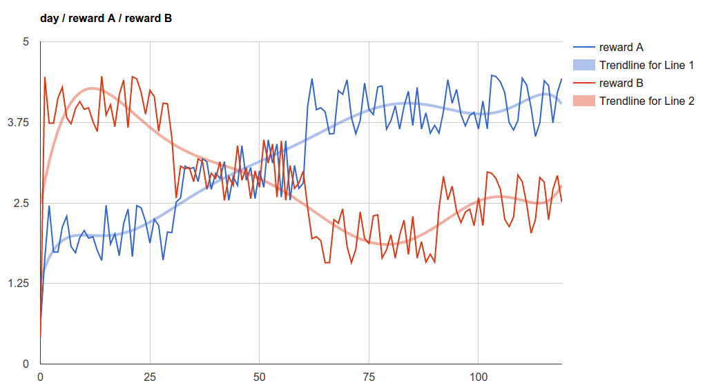 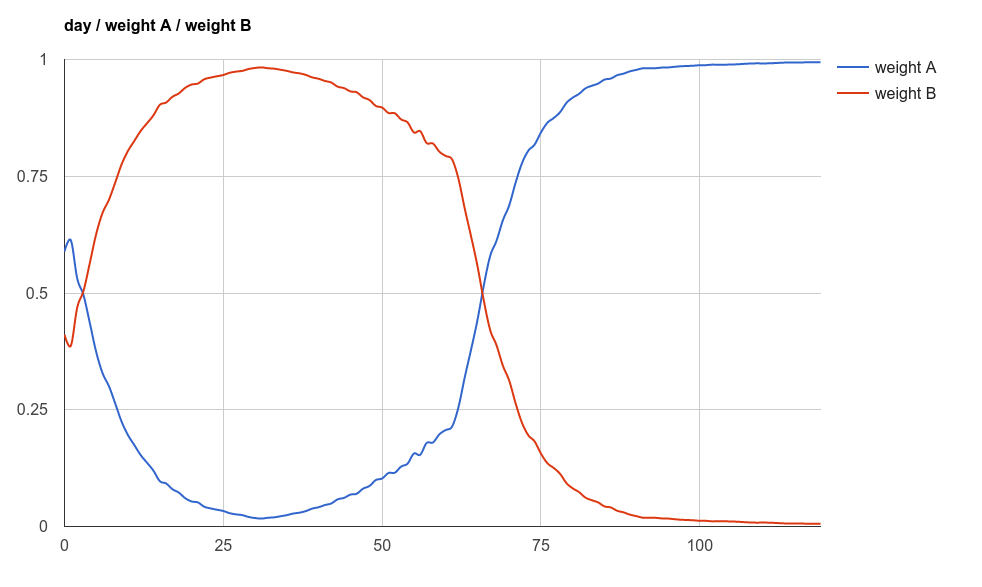

As you see, weights change dynamically to rewards overtime.

[↑ top](#go-bandit-algorithms-adversarial-bandits)
<br><br><br><br>
<hr>


#### Exp3: notations

- **_Actions_** are: *i = 1, 2, ..., K*.
- **_Sequence of trials_** are: *t = 1, 2, ..., T*.

- **_Reward_** with **action** *i* and **trial** *t* is:


- **_Reward vector_** is:

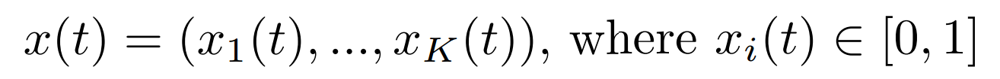

- List of **chosen actions** over *t* **rounds** is:

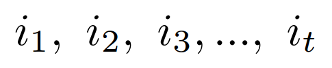

- **_Rewards_** with **_chosen action_** *i* and **_trial_** *t* are:

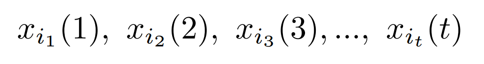

- We assume a player **knows the rewards from previous trials**.

- **_Hedge algorithm_** *of full information game* observes **_entire
  actions_**:

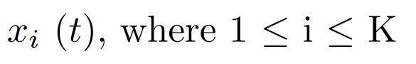

- **_Exp3 algorithm_** *of partial information game* observers **_only the
  chosen_**:

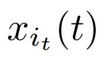


<br>

**Total reward from** **_Algorithm A_** is:

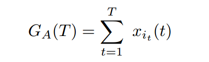

**Total reward from** **_Best_** **algorithm** is:

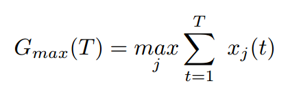

**_Regret from choosing algorithm A_** is:

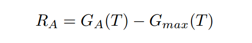

[↑ top](#go-bandit-algorithms-adversarial-bandits)
<br><br><br><br>
<hr>


#### Exp3

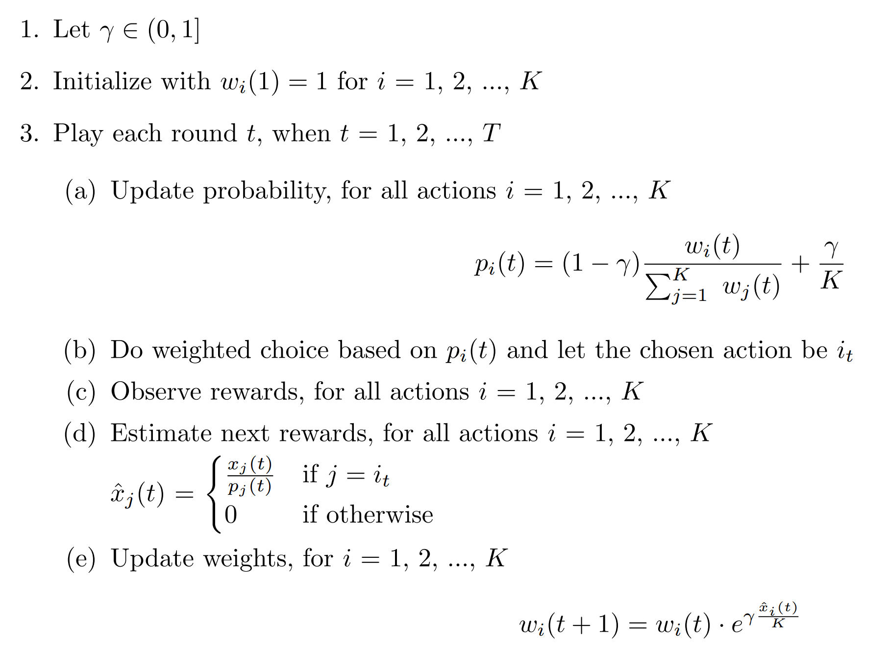

- Weights are used for weighted choice on actions.
- You need to maintain the list of weights for each action.
- If an action rewards well, it should get high weights.


[Here](http://play.golang.org/p/zvcEUWvwVF)'s Go version:

```go
package main

import (
	"fmt"
	"math"
	"math/rand"
	"sort"
	"time"
)

// Exp3 algorithm parameters:
//
// Actions(Options) : i = 1,2,...,K
// Trials           : t = 1,2,...,T
// Gamma = γ
//
// Use rewards as weights

const γ float64 = 0.7

func initWeights(options []string, optionToWeight *map[string]float64) {
	*optionToWeight = make(map[string]float64)
	for _, option := range options {
		(*optionToWeight)[option] = 1.0
	}
}

func loadWeights(options []string) map[string]float64 {
	optionToWeight := make(map[string]float64)
	// do your weight(reward) loading
	for _, option := range options {
		optionToWeight[option] = rand.Float64()
		// optionToWeight[option] = 1.0
	}
	return optionToWeight
}

func getProbability(γ float64, optionToWeight map[string]float64) map[string]float64 {
	K := float64(len(optionToWeight))
	totalWeight := 0.0
	for _, weight := range optionToWeight {
		totalWeight += weight
	}

	optionToProbability := make(map[string]float64)
	for option, lastTrialWeight := range optionToWeight {
		val1 := 1.0 - γ
		val4 := 1.0 / K

		if γ == 1.0 {
			// egalitarian weight distribution
			optionToProbability[option] = val4
			continue
		}

		optionToProbability[option] = val1*(lastTrialWeight/totalWeight) + val4
	}
	return optionToProbability
}

type keyValue struct {
	key   string
	value float64
}

type keyValueSlice []keyValue

func (p keyValueSlice) Swap(i, j int) { p[i], p[j] = p[j], p[i] }
func (p keyValueSlice) Len() int      { return len(p) }
func (p keyValueSlice) Less(i, j int) bool {
	return p[i].value > p[j].value
}

func sortMapByValue(m map[string]float64) keyValueSlice {
	p := make(keyValueSlice, len(m))
	i := 0
	for k, v := range m {
		p[i] = keyValue{k, v}
		i++
	}
	sort.Sort(p)
	return p
}

// chooseMax returns the option with the maximum reward or weight.
func chooseMax(optionToWeight map[string]float64) string {
	rs := sortMapByValue(optionToWeight)
	return rs[0].key
}

func normalizeRewardsVector(rewardsVector map[string]float64) map[string]float64 {
	total := 0.0
	for _, reward := range rewardsVector {
		total += reward
	}
	normalized := make(map[string]float64)
	for option, reward := range rewardsVector {
		normalized[option] = float64(reward) / float64(total)
	}
	return normalized
}

func getNextWeights(γ float64, optionToWeight, rewardsVector map[string]float64) map[string]float64 {

	K := float64(len(optionToWeight))
	bestOption := chooseMax(optionToWeight)
	fmt.Printf("bestOption: %s\n", bestOption)
	for option, weight := range optionToWeight {
		fmt.Printf("optionToWeight %s: %f\n", option, weight)
	}

	optionToProbability := getProbability(γ, optionToWeight)
	for option, weight := range optionToProbability {
		fmt.Printf("optionToProbability %s: %f\n", option, weight)
	}
	normalizedRewards := normalizeRewardsVector(rewardsVector)
	for option, reward := range normalizedRewards {
		fmt.Printf("normalizedRewards %s: %f\n", option, reward)
	}

	optionToNextRewards := make(map[string]float64)
	for option, prob := range optionToProbability {
		if option == bestOption {
			optionToNextRewards[option] = normalizedRewards[option] / prob
			continue
		}
		optionToNextRewards[option] = 0.0
	}

	optionToNextWeights := make(map[string]float64)
	for option, nextReward := range optionToNextRewards {
		currentWeight := optionToWeight[option]
		val := math.Exp(γ * (nextReward / K))
		optionToNextWeights[option] = currentWeight * val
	}

	return optionToNextWeights
}

func init() {
	rand.Seed(time.Now().UnixNano())
}

func main() {
	options := []string{"optionA", "optionB"}
	optionToWeight := loadWeights(options)
	// initWeights(options, &optionToWeight)

	for i := 0; i < 15; i++ {
		src := rand.NewSource(time.Now().UnixNano())
		random := rand.New(src)

		fmt.Println("-----------")
		fmt.Println("Try:", i)

		// update rewards with your realdata!
		rewardsVector := make(map[string]float64)
		for _, option := range options {
			randomDelta := random.Float64()
			// fmt.Println("randomDelta:", randomDelta, "for", option)
			rewardsVector[option] = optionToWeight[option] + randomDelta
		}

		optionToNextWeights := getNextWeights(γ, optionToWeight, rewardsVector)
		fmt.Printf("optionToNextWeights optionA: %f\n", optionToNextWeights["optionA"])
		fmt.Printf("optionToNextWeights optionB: %f\n", optionToNextWeights["optionB"])

		for k, v := range optionToNextWeights {
			optionToWeight[k] = v
		}
		fmt.Println("Done")
	}
}

/*
-----------
Try: 0
bestOption: optionB
optionToWeight optionA: 0.498934
optionToWeight optionB: 0.503845
optionToProbability optionA: 0.649265
optionToProbability optionB: 0.650735
normalizedRewards optionB: 0.502449
normalizedRewards optionA: 0.497551
optionToNextWeights optionA: 0.498934
optionToNextWeights optionB: 0.660180
Done
-----------
Try: 1
bestOption: optionB
optionToWeight optionA: 0.498934
optionToWeight optionB: 0.660180
optionToProbability optionA: 0.629133
optionToProbability optionB: 0.670867
normalizedRewards optionA: 0.461571
normalizedRewards optionB: 0.538429
optionToNextWeights optionA: 0.498934
optionToNextWeights optionB: 0.874296
Done
-----------
Try: 2
bestOption: optionB
optionToWeight optionB: 0.874296
optionToWeight optionA: 0.498934
optionToProbability optionB: 0.691001
optionToProbability optionA: 0.608999
normalizedRewards optionA: 0.419976
normalizedRewards optionB: 0.580024
optionToNextWeights optionA: 0.498934
optionToNextWeights optionB: 1.172868
Done
-----------
Try: 3
bestOption: optionB
optionToWeight optionA: 0.498934
optionToWeight optionB: 1.172868
optionToProbability optionB: 0.710468
optionToProbability optionA: 0.589532
normalizedRewards optionA: 0.373093
normalizedRewards optionB: 0.626907
optionToNextWeights optionA: 0.498934
optionToNextWeights optionB: 1.597256
Done
-----------
Try: 4
bestOption: optionB
optionToWeight optionA: 0.498934
optionToWeight optionB: 1.597256
optionToProbability optionA: 0.571406
optionToProbability optionB: 0.728594
normalizedRewards optionA: 0.322000
normalizedRewards optionB: 0.678000
optionToNextWeights optionA: 0.498934
optionToNextWeights optionB: 2.212190
Done
-----------
Try: 5
bestOption: optionB
optionToWeight optionA: 0.498934
optionToWeight optionB: 2.212190
optionToProbability optionA: 0.555210
optionToProbability optionB: 0.744790
normalizedRewards optionB: 0.731316
normalizedRewards optionA: 0.268684
optionToNextWeights optionA: 0.498934
optionToNextWeights optionB: 3.119431
Done
-----------
Try: 6
bestOption: optionB
optionToWeight optionB: 3.119431
optionToWeight optionA: 0.498934
optionToProbability optionB: 0.758633
optionToProbability optionA: 0.541367
normalizedRewards optionA: 0.215935
normalizedRewards optionB: 0.784065
optionToNextWeights optionA: 0.498934
optionToNextWeights optionB: 4.478928
Done
-----------
Try: 7
bestOption: optionB
optionToWeight optionA: 0.498934
optionToWeight optionB: 4.478928
optionToProbability optionA: 0.530069
optionToProbability optionB: 0.769931
normalizedRewards optionA: 0.166850
normalizedRewards optionB: 0.833150
optionToNextWeights optionA: 0.498934
optionToNextWeights optionB: 6.541212
Done
-----------
Try: 8
bestOption: optionB
optionToWeight optionA: 0.498934
optionToWeight optionB: 6.541212
optionToProbability optionB: 0.778739
optionToProbability optionA: 0.521261
normalizedRewards optionA: 0.124068
normalizedRewards optionB: 0.875932
optionToNextWeights optionA: 0.498934
optionToNextWeights optionB: 9.696892
Done
-----------
Try: 9
bestOption: optionB
optionToWeight optionA: 0.498934
optionToWeight optionB: 9.696892
optionToProbability optionA: 0.514681
optionToProbability optionB: 0.785319
normalizedRewards optionA: 0.089106
normalizedRewards optionB: 0.910894
optionToNextWeights optionA: 0.498934
optionToNextWeights optionB: 14.552620
Done
-----------
Try: 10
bestOption: optionB
optionToWeight optionA: 0.498934
optionToWeight optionB: 14.552620
optionToProbability optionB: 0.790056
optionToProbability optionA: 0.509944
normalizedRewards optionA: 0.062156
normalizedRewards optionB: 0.937844
optionToNextWeights optionA: 0.498934
optionToNextWeights optionB: 22.048455
Done
-----------
Try: 11
bestOption: optionB
optionToWeight optionA: 0.498934
optionToWeight optionB: 22.048455
optionToProbability optionA: 0.506638
optionToProbability optionB: 0.793362
normalizedRewards optionB: 0.957628
normalizedRewards optionA: 0.042372
optionToNextWeights optionA: 0.498934
optionToNextWeights optionB: 33.639820
Done
-----------
Try: 12
bestOption: optionB
optionToWeight optionA: 0.498934
optionToWeight optionB: 33.639820
optionToProbability optionA: 0.504384
optionToProbability optionB: 0.795616
normalizedRewards optionA: 0.028396
normalizedRewards optionB: 0.971604
optionToNextWeights optionA: 0.498934
optionToNextWeights optionB: 51.579787
Done
-----------
Try: 13
bestOption: optionB
optionToWeight optionA: 0.498934
optionToWeight optionB: 51.579787
optionToProbability optionA: 0.502874
optionToProbability optionB: 0.797126
normalizedRewards optionA: 0.018799
normalizedRewards optionB: 0.981201
optionToNextWeights optionA: 0.498934
optionToNextWeights optionB: 79.356725
Done
-----------
Try: 14
bestOption: optionB
optionToWeight optionA: 0.498934
optionToWeight optionB: 79.356725
optionToProbability optionA: 0.501874
optionToProbability optionB: 0.798126
normalizedRewards optionA: 0.012341
normalizedRewards optionB: 0.987659
optionToNextWeights optionA: 0.498934
optionToNextWeights optionB: 122.372397
Done
*/
```

[↑ top](#go-bandit-algorithms-adversarial-bandits)
<br><br><br><br>
<hr>


#### Regret

> In our model, the **regret** associated with each arm is **determined** at
> each time step **by an adversary** with unbounded computational power rather
> than by some benign stochastic process. We only assume that the rewards are
> chosen from a bounded range. The **performance** of any player is
> **measured** in terms of **regret**, i.e. the **difference** between the
> **total reward scored by the player** and the **total reward scored by the
> best arm.**
>
> [*paper*](http://citeseerx.ist.psu.edu/viewdoc/download?doi=10.1.1.84.6092&rep=rep1&type=pdf)
> (1998)

> We give a solution to the bandit problem in which an **adversary**, rather than a
> well-behaved stochastic process, has **complete control over the payoffs.**
>
> [paper](http://cseweb.ucsd.edu/~yfreund/papers/bandits.pdf) (2001)

It's called **_adversarial_** because **inferior ones** have complete **control
over how you play** the games. For more detail, please check out this
[article](http://jeremykun.com/2013/11/08/adversarial-bandits-and-the-exp3-algorithm/).


[↑ top](#go-bandit-algorithms-adversarial-bandits)
<br><br><br><br>
<hr>
