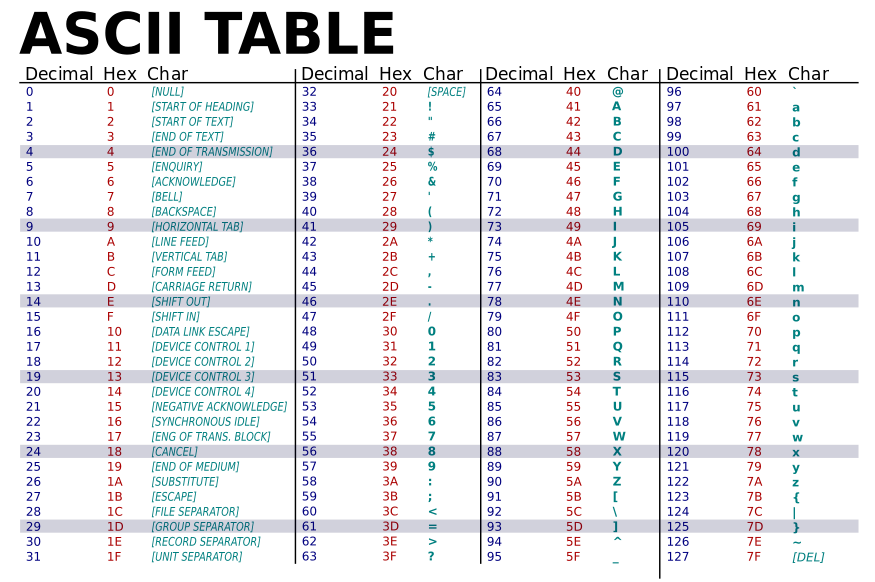

[*back to contents*](https://github.com/gyuho/learn#contents)<br>

# Go: character, string

- [bit, byte, character](#bit-byte-character)
- [mutable `bytes` and `rune`, immutable `string`](#mutable-bytes-and-rune-immutable-string)
- [`range` over `string`](#range-over-string)
- [`string` literals](#string-literals)
- [`string` literals in Python](#string-literals-in-python)
- [`string` literals in Go](#string-literals-in-go)
- [Unicode and UTF-8](#unicode-and-utf-8)
- [reverse `string`](#reverse-string)

[↑ top](#go-character-string)
<br><br><br><br><hr>


#### bit, byte, character

What is bit? What is byte? What is string?

```go
package main

func main() {
    println("Hello World!")
}
```

Here's *Hello World* Go program. The source code here consists of a sequence of
**bits**—*a value of 0 or 1*. *One* **_8-bit_** *chunk* builds *one* **_byte_**
that represents **_one character_** in source code. Computers can only
understand numbers, so we need numerical representation of texts.

[*ASCII table*](https://simple.wikipedia.org/wiki/ASCII) is one way to do it:



ASCII table reads `package` as below:

```
p     a    c     k     a    g     e
112   97   99    107   97   103   101
```


<br>

But **in Go, all source code is in UTF-8**.

> In short, Go source code is UTF-8, so the source code for the string literal
> is UTF-8 text.
>
> [*Strings, bytes, runes and characters in
> Go*](http://blog.golang.org/strings) *by Rob Pike*

[↑ top](#go-character-string)
<br><br><br><br><hr>


#### mutable `bytes` and `rune`, immutable `string`

Code consists of a sequence of **bits**—*a value of 0 or 1*. 
*One* **_8-bit_** *chunk* builds *one* **_byte_** that represents **_one character_**.
Go `string` is a sequence of `bytes`. Try this [code](http://play.golang.org/p/EqXQKOGTJ9):

```go
package main

import "fmt"

func main() {
	bts := []byte("Hello")
	bts[0] = byte(100)
	for _, c := range bts {
		fmt.Println(string(c), c)
	}
	/*
	   d 100
	   e 101
	   l 108
	   l 108
	   o 111
	*/

	rs := []rune("Hello")
	rs[0] = rune(100)
	for _, c := range rs {
		fmt.Println(string(c), c)
	}
	/*
	   d 100
	   e 101
	   l 108
	   l 108
	   o 111
	*/

	str := "Hello"
	// str[0] = byte(100)
	// cannot assign to str[0]
	for _, c := range str {
		fmt.Println(string(c), c)
	}
	/*
	   H 72
	   e 101
	   l 108
	   l 108
	   o 111
	*/
}
```

[↑ top](#go-character-string)
<br><br><br><br><hr>


#### `range` over `string`

When you `range` over `string`, you are actually iterating the slice of 
`byte`s. And since Go string literals are all `UTF-8`, you are also
ranging over Unicode code points, as [here](http://play.golang.org/p/bCb4vW9J_e):

```go
package main

import "fmt"

func main() {

	// %U prints Unicode format of a character
	// It prints out the Unicode code points

	str := "Hello"
	for _, c := range str {
		fmt.Printf("%U, %q %v\n", c, c, c)
	}

	fmt.Println()

	bts := []byte("Hello")
	for _, c := range bts {
		fmt.Printf("%U, %q %v\n", c, c, c)
	}
}

/*
U+0048, 'H' 72
U+0065, 'e' 101
U+006C, 'l' 108
U+006C, 'l' 108
U+006F, 'o' 111

U+0048, 'H' 72
U+0065, 'e' 101
U+006C, 'l' 108
U+006C, 'l' 108
U+006F, 'o' 111
*/
```

[↑ top](#go-character-string)
<br><br><br><br><hr>


#### `string` literals

[String literals](https://en.wikipedia.org/wiki/String_literal) represent
string-typed values in source code.

```go
myString := "Hello"
```

`"Hello"` is a **string literal** with the **string-typed value** `Hello`. And
the *string literal* with an *empty string value* is:

```go
myString := ""
```

Then what if you want to print out the quoting characters? You can do:

```go
fmt.Println("\"") // "
fmt.Println(`"`)  // "
```

Go uses backslash to escape characters, avoid [delimiter
collisions](https://en.wikipedia.org/wiki/String_literal#Delimiter_collision),
like [here](http://play.golang.org/p/IrTe3mGXno):

```go
package main
 
import "fmt"
 
func main() {
	fmt.Println("\\") // \
	fmt.Println(`\\`) // \\
	fmt.Println("%%") // %%
	fmt.Println(`%%`) // %%
	fmt.Println("\"") // "
}
```

In Python, you would:

```python
print "\\"  # \
print "%%"  # %
print "\""  # "
```

<br><br>
*Then how is Go different than Python when handling text data?*
<br><br>

[↑ top](#go-character-string)
<br><br><br><br><hr>


#### `string` literals in Python

As you see the code below, Python has different string literals for `ASCII` and
`Unicode` characters.

```python
val1 = "aaé"
print val1        # aaé
print type(val1)  # <type 'str'>
 
print val1.encode('utf-8')
"""
Traceback (most recent call last):
  File "<stdin>", line 1, in <module>
UnicodeDecodeError: 'ascii' codec can't decode byte 0xc3 in position 0: ordinal not in range(128)
"""
 
print val1.encode('ascii')
"""
Traceback (most recent call last):
  File "<stdin>", line 1, in <module>
UnicodeDecodeError: 'ascii' codec can't decode byte 0xc3 in position 0: ordinal not in range(128)
"""
 
val2 = u"aaé"
print val2                  # aaé
print type(val2)            # <type 'unicode'>
print val2.encode('utf-8')  # aaé
 
print val2.encode('ascii')
"""
Traceback (most recent call last):
  File "<stdin>", line 1, in <module>
UnicodeEncodeError: 'ascii' codec can't encode character u'\xe9' in position 0: ordinal not in range(128)
"""
 
 
print val2.encode('ascii', 'ignore') # aa
# é is missing
 
 
import unicodedata
unicodedata.normalize('NFKD', val2).encode('ascii','ignore')
# aae
# é got converted to e
```

This can be tricky when an external service returns **different types** of
string to your Python program, as described
[here](https://pythonhosted.org/kitchen/unicode-frustrations.html):

> Frustration #1: Inconsistent Errors
>
> Although converting when possible seems like the right thing to do, it’s
> actually the first source of frustration. A programmer can test out their
> program with a string like: *The quick brown fox jumped over the lazy dog* and
> not encounter any issues. But when they release their software into the wild,
> someone enters the string: *I sat down for coffee at the café* and suddenly an
> exception is thrown. The reason? The mechanism that converts between the two
> types is only able to deal with
> [ASCII](https://pythonhosted.org/kitchen/glossary.html#term-ascii) characters. 
> Once you throw non-ASCII characters into your strings, you have to start
> dealing with the conversion manually.
>
> So, if I manually convert everything to either byte str or unicode strings,
> will I be okay? The answer is…. sometimes.
>
> [Overcoming frustration: Correctly using unicode in
> python2](https://pythonhosted.org/kitchen/unicode-frustrations.html)


Here’s a quick solution:

```python
def convert_to_str(st):
    """ use this function to convert all strings to str"""
    if isinstance(st, unicode):
        return st.encode('utf-8')
    return str(st)
 
 
val1 = "ébc"
val2 = u"ébc"
 
print val1, type(val1), convert_to_str(val1), type(convert_to_str(val1))
# ébc <type 'str'> ébc <type 'str'>
 
print val2, type(val2), convert_to_str(val2), type(convert_to_str(val2))
# ébc <type 'unicode'> ébc <type 'str'>
```

But there are many other corner cases you need to consider, as explained
[here](https://pythonhosted.org/kitchen/unicode-frustrations.html).

[↑ top](#go-character-string)
<br><br><br><br><hr>


#### `string` literals in Go

> **Go source code is UTF-8**, so the source code for the string literal is UTF-8
> text. If that string literal contains no escape sequences, which a raw string
> cannot, the constructed string will hold exactly the source text between the
> quotes. Thus by definition and by construction the raw string will always
> contain a valid UTF-8 representation of its contents. Similarly, unless it
> contains UTF-8-breaking escapes like those from the previous section, a
> regular string literal will also always contain valid UTF-8.
>
> Some people think Go strings are always UTF-8, but they are not: **only string
> literals are UTF-8**. As we showed in the previous section, **string values can
> contain arbitrary bytes**; as we showed in this one, **string literals always
> contain UTF-8 text as long as they have no byte-level escapes**.
>
> To summarize, **strings can contain arbitrary bytes, but when constructed from
> string literals, those bytes are (almost always) UTF-8**.
> 
> [*Rob Pike*](http://blog.golang.org/strings)

<br>

**Go string literals are UTF-8, while string values can contain arbitrary
bytes.** Go string is just a **read-only slice of bytes**, as
[here](http://play.golang.org/p/7yhWFXqzDq) and
[here](http://play.golang.org/p/HU4eHH-huc):

```go
package main
 
import "fmt"
 
func main() {
	str := "Hello, playground"
	for _, elem := range str {
		print(elem, "/")
	}
	// 72/101/108/108/111/44/32/112/108/97/121/103/114/111/117/110/100/
 
	fmt.Println()
	fmt.Println(str[0])         // 72
	fmt.Println(string(str[0])) // H
	// str[0] = byte(101)
	// cannot assign to str[0]
 
	bstr := []byte("Hello, playground")
	for _, elem := range bstr {
		print(elem, "/")
	}
	// 72/101/108/108/111/44/32/112/108/97/121/103/114/111/117/110/100/
 
	fmt.Println()
	fmt.Println(bstr[0])         // 72
	fmt.Println(string(bstr[0])) // H
	bstr[0] = byte(101)
	fmt.Println(string(bstr)) // eello, playground
 
	// rune represents Unicode code points
	// Go language defines the word rune as an alias for the type int32
	rstr := []rune("Hello, playground")
	for _, elem := range rstr {
		print(elem, "/")
	}
	// 72/101/108/108/111/44/32/112/108/97/121/103/114/111/117/110/100/
 
	fmt.Println()
	fmt.Println(rstr[0])         // 72
	fmt.Println(string(rstr[0])) // H
	rstr[0] = rune(101)
	fmt.Println(string(rstr)) // eello, playground
}
```

```go
package main
 
import "fmt"
 
func main() {
	txt1 := "\xE2\x88\x83y \xE2\x88\x80x \xC2\xAC(x \xE2\x89\xBA y)"
	txt2 := "∃y ∀x ¬(x ≺ y)"
	fmt.Println(txt1)         // ∃y ∀x ¬(x ≺ y)
	fmt.Println(txt2)         // ∃y ∀x ¬(x ≺ y)
	fmt.Printf("%x\n", txt2)  // e288837920e288807820c2ac287820e289ba207929
	fmt.Println(txt1 == txt2) // true
}
```

[↑ top](#go-character-string)
<br><br><br><br><hr>


#### Unicode and UTF-8

Then what is **_Unicode_**? What makes it different than **_ASCII_**? Think of
*Unicode* as a super-set of *ASCII*. The characters mapped from the numbers
0–126 have the same meaning in *ASCII* and *Unicode*. In Unicode, a character
maps to something called a *code point*. English alphabet *A* is 65(or 41 in
*hexadecimal*) in *ASCII*. In *Unicode*, *A* maps to `U+0041`. `U+` means
*Unicode* and `0041` means it's a hexadecimal number. **And there’s no limit on
the characters that Unicode can define, while ASCII only supports English
alphabets plus a few special characters.** For example, if a website only
supports *ASCII*, it won't understand my Korean name **이규호**.

Then how do we *store* this **_code points_** and display them in documents?
That's what [**_UTF-8_**](https://en.wikipedia.org/wiki/UTF-8) does.
**_UTF-8_** is a character encoding to encode all possible code points in
Unicode. All *ASCII* characters from 0 to 127 are *stored in a single byte in
Unicode space*. Other code points are stored using 2 to 6 *bytes*.

For more, please check out [*Joel's
article*](http://www.joelonsoftware.com/articles/Unicode.html).


[↑ top](#go-character-string)
<br><br><br><br><hr>


#### reverse `string`

[Code](http://play.golang.org/p/wNmNtPs7c3):

```go
package main

import (
	"bytes"
	"fmt"
	"reflect"
	"strings"
	"unicode"
)

/*
Recursively Reverse a String

Reverse("Hello")
(Reverse("ello")) + "H"
((Reverse("llo")) + "e") + "H"
(((Reverse("lo")) + "l") + "e") + "H"
((((Reverse("o")) + "l") + "l") + "e") + "H"
(((("o") + "l") + "l") + "e") + "H"
"olleH"
*/
func reverseStringResursion(str string) string {
	// Without this, the program generates slice bound error
	if len(str) <= 1 {
		return str
	}
	return reverseStringResursion(string(str[1:])) + string(str[0])
}

func main() {
	// we can't do this because string is immutable
	// prog.go:15: cannot assign to str[i]
	// for i, j := 0, len(str)-1; i < j; i, j = i+1, j-1 {
	// 	str[i], str[j] = str[j], str[i]
	// }
	reverseString := func(s string) string {
		runes := []rune(s)
		for i, j := 0, len(runes)-1; i < j; i, j = i+1, j-1 {
			runes[i], runes[j] = runes[j], runes[i]
		}
		return string(runes)
	}
	fmt.Println(reverseString("Hello"))          // olleH
	fmt.Println(reverseStringResursion("Hello")) // olleH

	bs := []byte("abc")
	fmt.Println(bs[1])
	for _, elem := range []byte("abc") {
		fmt.Println(elem, string(elem))
	}
	for _, elem := range []rune("abc") {
		fmt.Println(elem, string(elem))
	}
	// 97 a
	// 98 b
	// 99 c
	// 97 a
	// 98 b
	// 99 c
	fmt.Println()

	// byte, rune
	var by byte
	by = 10
	// by= -10
	// -10 overflows byte
	fmt.Println(reflect.TypeOf(by))
	// uint8
	// byte is alias for uint8
	// uint8 is the set of all unsigned 8-bit integers.
	// Range: 0 through 255.

	var br rune
	br = 10
	fmt.Println(reflect.TypeOf(br))
	// int32
	// rune is alias for int32
	// int32 is the set of all signed 32-bit integers.
	// Range: -2147483648 through 2147483647.

	fmt.Println(swapCase("Hello Hi"))
	// hELLO hI

	fmt.Println(swapCaseII("Hello Hi"))
	// hELLO hI

	// reverseIntSlice changes the order of slice
	// , without sorting.
	reverseIntSlice := func(s []int) []int {
		for i, j := 0, len(s)-1; i < j; i, j = i+1, j-1 {
			s[i], s[j] = s[j], s[i]
		}
		return s
	}
	fmt.Println(reverseIntSlice([]int{9, -13, 4, -2, 3, 1, -10, 21, 12}))
	// [12 21 -10 1 3 -2 4 -13 9]

	// reverseIntMore changes the order of multiple int arguments
	// , without sorting.
	reverseIntMore := func(more ...int) []int {
		for i, j := 0, len(more)-1; i < j; i, j = i+1, j-1 {
			more[i], more[j] = more[j], more[i]
		}
		return more
	}
	fmt.Println(reverseIntMore(9, -13, 4, -2, 3, 1, -10, 21, 12))
	// [12 21 -10 1 3 -2 4 -13 9]

}

func swapCase(str string) string {
	b := new(bytes.Buffer)

	// traverse character values, without index
	for _, elem := range str {
		if unicode.IsUpper(elem) {
			b.WriteRune(unicode.ToLower(elem))
		} else {
			b.WriteRune(unicode.ToUpper(elem))
		}
	}

	return b.String()
}

// rune is variable-length and can be made up of one or more bytes.
// rune literals are mapped to their unicode codepoint.
// For example, a rune literal 'a' is a number 97.
// 32 is the offset of the uppercase and lowercase characters.
// So if you add 32 to 'A', you get 'a' and vice versa.
func swapRune(r rune) rune {
	switch {
	case 'a' <= r && r <= 'z':
		return r - 'a' + 'A'
	case 'A' <= r && r <= 'Z':
		return r - 'A' + 'a'
	default:
		return r
	}
}

func swapCaseII(str string) string {
	return strings.Map(swapRune, str)
}

```

[↑ top](#go-character-string)
<br><br><br><br><hr>
