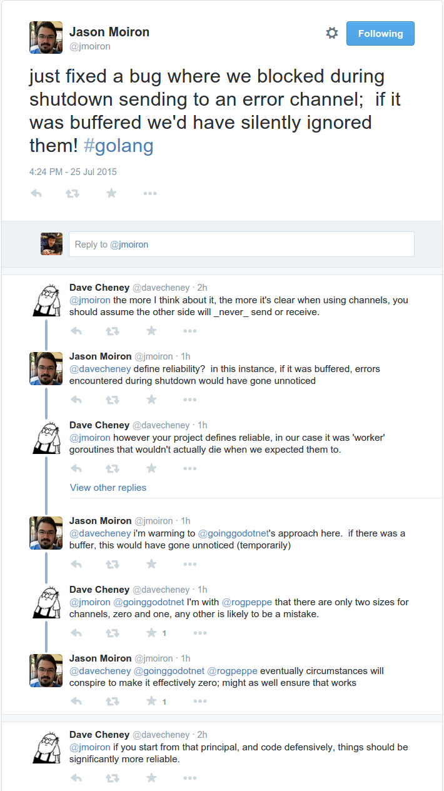
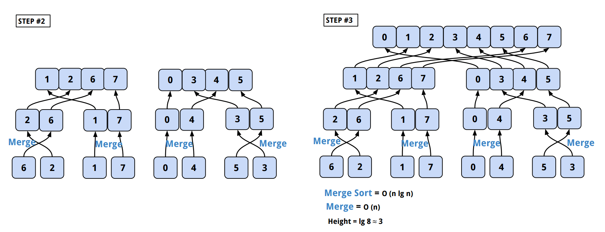

[*back to contents*](https://github.com/gyuho/learn#contents)<br>

# Go: concurrency

> If you look at the programming languages of today, you probably get this idea
> that the world is objected-oriented. But it’s not. It’s actually parallel.
> Multi-core machines, users, networking, etc. All these things are happening
> simultaneously and yet computing tools that we have are not good at
> expressing this kind of world-views. […] **Go is a concurrent language.**
>
> [**_Concurrency is not parallelism_**](https://www.youtube.com/watch?v=cN_DpYBzKso) *by Rob Pike* <br>

- [Reference](#reference)
- [**Concurrency is not parallelism**](#concurrency-is-not-parallelism)
- [goroutine ≠ thread](#goroutine--thread)
- [`defer`, `recover`](#defer-recover)
- [**Be careful with `defer` and deadlock**](#be-careful-with-defer-and-deadlock)
- [channel to communicate](#channel-to-communicate)
- [questions](#questions)
	- [#1-1. synchronous, asynchronous channel](#1-1-synchronous-asynchronous-channel)
	- [#1-2. **buffered channel faster** because it’s *non-blocking*?](#1-2-buffered-channel-faster-because-its-non-blocking)
	- [#1-3. **be careful with buffered channel!**](#1-3-be-careful-with-buffered-channel)
	- [#1-4. **non-deterministic receive from buffered channel**](#1-4-non-deterministic-receive-from-buffered-channel)
	- [#2. why is this receiving only one value?](#2-why-is-this-receiving-only-one-value)
	- [#3. **wait for all goroutines to finish**](#3-wait-for-all-goroutines-to-finish)
- [**select for channel**: `select` ≠ `switch`](#select-for-channel-select--switch)
- [**receive `nil` from channel**](#receive-nil-from-channel)
- [`sync.Mutex`, race condition](#syncmutex-race-condition)
- [**Share memory by communicating**](#share-memory-by-communicating)
- [memory leak](#memory-leak)
- [`sync/atomic`](#syncatomic)
- [web server](#example-web-server)
- [`sync.Mutex` is just a value](#syncmutex-is-just-a-value)
- [`sync.Once`](#synconce)
- [**`goroutine`, closure**](#goroutine-closure)
- [rate limit](#rate-limit)
- [`select`, `continue`, `break`](#select-continue-break)
- [Counting problem](#counting-problem)
- [Count: simulate web requests](#count-simulate-web-requests)
- [Count: `NaiveCounter`](#count-naivecounter)
- [Count: `MutexCounter`](#count-mutexcounter) - [Count: `RWMutexCounter`](#count-rwmutexcounter) - [Count: `AtomicIntCounter`](#count-atomicintcounter) - [Count: `AtomicCounter`](#count-atomiccounter)
- [Count: `ChannelCounter` (No Buffer)](#count-channelcounter-no-buffer)
- [Count: `ChannelCounter` (Buffer)](#count-channelcounter-buffer)
- [Count: benchmark results](#benchmark-results)
- [Dequeue problem](#dequeue-problem)
	- [Solution #1: In-Memory](#solution-1-in-memory)
	- [Solution #2: Disk Key/Value Storage + Concurrency](#solution-2-disk-keyvalue-storage--concurrency)
	- [Dequeue result](#dequeue-result)
	- [But, don't do this!](#but-dont-do-this)
	- [Dequeue Summary](#dequeue-summary)
- [Find duplicates with concurrency](#find-duplicates-with-concurrency)
- [Concurrency: Merge Sort](#concurrency-merge-sort)
- [Concurrency: Prime Sieve](#concurrency-prime-sieve)
- [**close channel**](#close-channel)
- [**blocking defer**](#blocking-defer)
- [**buffered channel copy**](#buffered-channel-copy)
- [**`select` closed channel**](#select-closed-channel)
- [**`select` default**](#select-default)
- [**`sync.Cond`**](#select-default)
- [blocking `sync.Mutex`](#blocking-syncmutex)
- [empty buffered channel](#empty-buffered-channel)
- [close two channels](#close-two-channels)
- [atomic, defer](#atomic-defer)
- [channel capacity](#channel-capacity)
- [select continue](#select-continue)
- [select nil chan](#select-nil-chan)

[↑ top](#go-concurrency)
<br><br><br><br><hr>


#### Reference

- [*Thread*](https://en.wikipedia.org/wiki/Thread_(computing))
- [*Process*](https://en.wikipedia.org/wiki/Process_(computing))
- [*Asynchronous I/O*](https://en.wikipedia.org/wiki/Asynchronous_I/O)
- [*Context switch*](https://en.wikipedia.org/wiki/Context_switch)
- [*Green threads*](https://en.wikipedia.org/wiki/Green_threads)
- [**Concurrency is Not Parallelism**](https://www.youtube.com/watch?v=cN_DpYBzKso) *by Rob Pike* ([Slide](http://talks.golang.org/2012/waza.slide#1))
- [**Go Concurrency Patterns**](https://www.youtube.com/watch?v=f6kdp27TYZs) *by Rob Pike* ([Slide](https://talks.golang.org/2012/concurrency.slide#1))
- [**Effective Go — Concurrency**](https://golang.org/doc/effective_go.html#concurrency)
- [**Advanced Go Concurrency Patterns**](https://www.youtube.com/watch?v=QDDwwePbDtw) *by Sameer Ajmani* ([Slide](https://talks.golang.org/2013/advconc.slide#1))
- [**Go Concurrency Patterns : Pipelines and cancellation**](https://blog.golang.org/pipelines) *by Sameer Ajmani*
- [**Go Memory Model**](https://golang.org/ref/mem)
- [**Five things that make Go fast**](http://dave.cheney.net/2014/06/07/five-things-that-make-go-fast) *by Dave Cheney*
- [**Why is a goroutine’s stack infinite**](http://dave.cheney.net/2013/06/02/why-is-a-goroutines-stack-infinite) *by Dave Cheney*
- [**High performance servers without the event loop**](http://go-talks.appspot.com/github.com/davecheney/presentations/performance-without-the-event-loop.slide#1) *by Dave Cheney*
- [**Goroutines vs OS Threads**](https://groups.google.com/d/msg/golang-nuts/j51G7ieoKh4/wxNaKkFEfvcJ)
- [Bjorn Rabenstein - Prometheus: Designing and Implementing a Modern Monitoring Solution in Go](https://www.youtube.com/watch?v=1V7eJ0jN8-E)
- [beorn7/concurrentcount](https://github.com/beorn7/concurrentcount)

[↑ top](#go-concurrency)
<br><br><br><br><hr>


#### Concurrency is not parallelism

My YouTube video on Go concurrency:

<a href="https://www.youtube.com/watch?v=jsxshnyyTUY" target="_blank"></a>

You write any concurrent code, but you **run with a single processor, then your
program is** **_not parallel_** because it is not executing anything in
parallel. But Go code can still be concurrent with a single processor: when
there are multiple processors available, the code runs in parallel
automatically.

<br>

> Go is a concurrent language. Concurrency and parallelism are not the same
> thing. **Concurrency** is the **composition** of **independently** executing
> processes(computations). **Parallelism** is the **simultaneous** execution of
> (possibly related) computations. **Concurrency** *is about dealing with a lot
> of things at once.* **Parallelism** *is about doing a lot of things at once.*
> **Concurrency** is about programming structure. **Parallelism** is about
> **execution**. **Concurrency** provides a way to **structure** a solution to
> solve a problem that may (but *not necessariliy*) be parallelizable.
>
> [**_Rob Pike_**](https://www.youtube.com/watch?v=cN_DpYBzKso)


<br>
**_Independently Executing Procedure + Coordination = Concurrency_**
<br>

**Go’s concurrency is coordination, communication of independently executing
procedures.** Go concurrency model is like communication of UNIX pipelines: `ls
-l | grep key | less`. Go concurrency is more a [type-safe
generalization](https://golang.org/doc/effective_go.html#concurrency) of Unix
pipes. **_goroutine_** is like *ampersand* `&` in a shell command, which **runs
things in the background but does not wait for it to end**, as
[here](http://play.golang.org/p/5t84yLWCG9) and
[here](http://play.golang.org/p/rPP4s5ULSo):

```go
package main
 
import "fmt"
 
func main() {
	// launch goroutine in background
	go func() {
		fmt.Println("Hello, playground")
	}()
	//
	// Does not print anything
	//
	// when main returns
	// the program exits
	// and the goroutine will not be run
	// and gets garbage-collected
}
```

```go
package main
 
import (
	"fmt"
	"time"
)
 
func b() {
	fmt.Println("b is still running")
	fmt.Println("because although a exited but main hasn't exited yet!")
}
 
func a() {
	fmt.Println("a exits")
	go b()
}
 
func main() {
	a()
	time.Sleep(time.Second)
	// a exits
	// b is still running
	// because although a exited but main hasn't exited yet!
 
	go func() {
		fmt.Println("Hello, playground")
	}()
	time.Sleep(time.Second)
	// Hello, playground
}
```

[↑ top](#go-concurrency)
<br><br><br><br><hr>


#### goroutine ≠ thread

**_Thread_** is a lightweight process since it executes within the context of one
process. Both threads and processes are independent units of execution.
**Threads** under the **same process** **_run in one shared memory_** space,
while **process** **_run in separate memory_** spaces.

> Each *process* provides the resources needed to execute a program. A process
> has a virtual address space, executable code, open handles to system objects,
> a security context, a unique process identifier, environment variables, a
> priority class, minimum and maximum working set sizes, and at least one
> thread of execution. Each process is started with a single thread, often
> called the primary thread, but can create additional threads from any of its
> threads.
>
> A *thread* is the entity within a process that can be scheduled for
> execution. All threads of a process share its virtual address space and
> system resources. In addition, each thread maintains exception handlers, a
> scheduling priority, thread local storage, a unique thread identifier, and a
> set of structures the system will use to save the thread context until it is
> scheduled. The thread context includes the thread’s set of machine registers,
> the kernel stack, a thread environment block, and a user stack in the address
> space of the thread’s process. Threads can also have their own security
> context, which can be used for impersonating clients.
>
> [**_About Processes and Threads by
> Microsoft_**](https://msdn.microsoft.com/en-us/library/windows/desktop/ms681917%28v=vs.85%29.aspx)

<br>
When you say *8-core machine*, the `core` represents the actual physical
processors. *8-core machine* has 8 independent processing units (*cores* or
*CPU*s). Not to be confused with processor, a `process` is a computer program
instance that is being executed. A `process` can be made up of multiple
`threads` executing instructions concurrently. Again, `core` is an actual
physical `processor`, and `process` and `thread` are independent units of
program execution: `threads` under the same `process` run in a shared memory
space, whereas `processes` run in separate memory spaces. `threads` are more
dependent on an operating system, than a hardware or CPU. Normally one CPU can
handle one `thread` at a time, but one CPU with
[hyper threading](https://en.wikipedia.org/wiki/Hyper-threading)
can handle two `threads` simultaneously.

<br>
> [Threads] are conceptually the same as processes, but share the same memory space.
>
> As threads share address space, they are lighter than processes so are faster
> to create and faster to switch between.
>
> Threads still have an expensive context switch cost, a lot of state must be
> retained.
>
> Goroutines take the idea of threads a step further.
>
> Many goroutines are multiplexed onto a single operating system thread.
>	- Super cheap to create.
>	- Super cheap to switch between as it all happens in user space.
>	- Tens of thousands of goroutines in a single process are the norm,
>	    hundreds of thousands not unexpected.
>
> This results in relatively few operating system threads per Go process, with
> the Go runtime taking care of assigning a runnable Goroutine to a free
> operating system thread.
>
> [**High performance servers without the event
>  loop**](http://go-talks.appspot.com/github.com/davecheney/presentations/performance-without-the-event-loop.slide#1)
> *by Dave Cheney*

<br><br>

**goroutine** is an independently executing function, launched with go
statement. **goroutine** is **NOT a thread**. Think of goroutine as a **very
cheap, lightweight thread**. A program may have **thousands of goroutines**
*but with only one thread*.

> In telecommunications and computer networks, **multiplexing** (sometimes
> contracted to **muxing**) is a method by which multiple analog message
> signals or digital data streams are combined into one signal over a shared
> medium.
>
> [*Multiplexing*](https://en.wikipedia.org/wiki/Multiplexing) *by Wikipedia*

**Go runtime multiplexes goroutines into multiple OS threads**: when one
goroutine blocks such as waiting for I/O, the **thread blocks** too but
**no other goroutine blocks**. When a goroutine blocks on a thread,
Go runtime moves other goroutines to a different, available thread,
so they won't be blocked.

As of [Go 1.4](http://golang.org/doc/go1.4#runtime), the garbage collector has
become precise enough that **goroutine stack now takes only 2048 bytes of
memory**. goroutine has its own call stack that grows and shrinks as required.
It starts small and allocates, frees heap storage automatically. Go allows you
to write high-performance program without much expert knowledge or dealing
with OS threads.

<br>

> Each goroutine starts with a small stack, allocated from the heap. The size
> has fluctuated over time, but in Go 1.5 each goroutine starts with a 2k
> allocation.
>
> Instead of using guard pages, the Go compiler inserts a check as part of every
> function call to test if there is sufficient stack for the function to run.
>
> If there is insufficient space, the runtime will allocate a large stack segment
> on the heap, copy the contents of the current stack to the new segment, free
> the old segment, and the function call restarted.
>
> [*Goroutine stack
> growth*](http://go-talks.appspot.com/github.com/davecheney/presentations/performance-without-the-event-loop.slide#27)
> *by Dave Cheney*


<br>
Note that when the **_main_** function returns, the **program exists**.
goroutines that were running in background get **garbage-collected**, like
[here](http://play.golang.org/p/bODiFAAfTP):

```go
package main
 
import (
	"fmt"
	"time"
)
 
func a() {
	fmt.Println("a() called")
	go func() {
		time.Sleep(10 * time.Second)
		fmt.Println("go func() called")
		// this is not called
		//
		// you can get this printed with channel
	}()
	go b()
}
 
func b() {
	time.Sleep(1 * time.Second)
	fmt.Println("b() called")
}
 
func main() {
	a()
	time.Sleep(5 * time.Second)
	// when main returns all others return as well
}
 
/*
a() called
b() called
*/
```


[↑ top](#go-concurrency)
<br><br><br><br><hr>


#### `defer`, `recover`

**`defer`** **_delays the function execution_** **until just before the enclosing
function exit(return)**. The order of execution is:

- **`defer`**: Stack(*Last-In-First-Out*)
- **`goroutine`**: Queue(*First-In-First-Out*)

**LAST** *defer* statement runs **FIRST**, like
[here](http://play.golang.org/p/aDacv_4wn6):

```go
package main
 
import "fmt"
 
func main() {
	defer println("Defer 1")
	defer println("Defer 2")
	defer println("Defer 3")
 
	defer func() {
		fmt.Println("Recover:", recover())
	}()
	panic("Panic!!!")
 
	/*
		Recover: Panic!!!
		Defer 3
		Defer 2
		Defer 1
	*/
 
	// recover stops the panic
	// recover returns the value from panic
	// panic function is to cause a run time error
	// for "cannot happen" situations
	// And stops the program to begin panicking
	// So even if it's recovered
	// the next lines after panic won't be run.
	for {
		fmt.Println("This does not print! Anything below not being run!")
	}
}
```


**FIRST** *goroutine* runs **FIRST**, like
[here](http://play.golang.org/p/JrQzbVKvuR):

```go
package main
 
import "time"
 
func main() {
	// goroutine #01 : Queue
	go println(1)
 
	// goroutine #02
	// Anonymous Function Closure
	// Not function literal
	// So we need parenthesis at the end
	go func() {
		println(2)
	}()
 
	// goroutine #03
	// Anonymous Function Closure with input
	go func(n int) {
		println(n)
	}(3)
 
	// 1
	// 2
	// 3
 
	time.Sleep(time.Nanosecond)
	// main goroutine does not wait(block) for goroutine's return
	// Without this, we just reach the end of main and goroutine does not run
}
```

<br>

Note that **_defer_** still gets **executed_** even when a function `panic`s,
like [here](http://play.golang.org/p/JTnbSooYdK):

```go
package main
 
import (
	"fmt"
	"time"
)
 
func main() {
	go func() {
		defer fmt.Println("Hello, playground")
		panic(1)
	}()
 
	time.Sleep(time.Second)
}
 
/*
Hello, playground
panic: 1
*/
```


<br>

> `panic` is a built-in function that stops the ordinary flow of control and
> begins panicking. **_When the function F calls panic, execution of F stops,
> any deferred functions in F are executed normally, and then F returns to its
> caller._** To the caller, F then behaves like a call to panic. The process
> continues up the stack until all functions in the current goroutine have
> returned, at which point the program crashes. Panics can be initiated by
> invoking panic directly. They can also be caused by runtime errors, such as
> out-of-bounds array accesses.
>
> `recover` is a built-in function that regains control of a panicking
> goroutine. **_recover_** **is only useful inside defer**-red functions.
> During normal execution, a call to recover will return nil and have no other
> effect. If the current goroutine is panicking, a call to recover will capture
> the value given to panic and resume normal execution.
>
> [**_Andrew Gerrand_**](http://blog.golang.org/defer-panic-and-recover)

<br>

Note that when a function `panic`s, the **function execution stops** and it
runs *any* **defer statements inside the function**, and *it* **_returns_**.
So you won't see *"Hello World"*, from this
[code](http://play.golang.org/p/7abMxKTZDH):

```go
package main
 
import "fmt"
 
func main() {
	defer func() {
		if err := recover(); err != nil {
			fmt.Println(err)
		}
	}()
 
	panic("Panic!")
 
	fmt.Println("Hello, World!")
	// NOT printed
}
 
/*
Panic!
*/
```

When it `panic`s, the **_main_** goroutine (`main` function) exits. That's why
we didn't see *"Hello World!"* in the code above.

<br><br>

Try this [code](http://play.golang.org/p/pGghekREGe) and
[code](http://play.golang.org/p/I76aHCgHON):

```go
package main
 
import (
	"fmt"
	"time"
)
 
func panicAndrecover() {
	defer func() {
		if err := recover(); err != nil {
			fmt.Println(err)
		}
	}()
	panic("Panic!")
}
 
func main() {
	panicAndrecover()
	fmt.Println("Hello, World!")
	/*
	   Panic!
	   Hello, World!
	*/
 
	recursiveRecover()
	/*
	   Restarting after error: [ 0 ] Panic
	   Restarting after error: [ 1 ] Panic
	   Restarting after error: [ 2 ] Panic
	   Restarting after error: [ 3 ] Panic
	   Restarting after error: [ 4 ] Panic
	   Too much panic: 5
	*/
}
 
var count int
 
func recursiveRecover() {
	defer func() {
		if err := recover(); err != nil {
			fmt.Println("Restarting after error:", err)
			time.Sleep(time.Second)
			count++
			if count == 5 {
				fmt.Printf("Too much panic: %d", count)
				return
			}
			recursiveRecover()
		}
	}()
	panic(fmt.Sprintf("[ %d ] Panic", count))
}
```

```go
package main

import "fmt"

func main() {
	m := make(map[string]int)
	m["A"] = 1
	m["B"] = 2
	for k, v := range m {
		func() {
			defer func() {
				if err := recover(); err != nil {
					fmt.Println(err, "at", k, v)
				}
			}()
			panic("panic")
		}()
	}
}

/*
panic at A 1
panic at B 2
*/

```

The code prints out *"Hello World!"* because `panic` only exits the function
`panicAndRecover`, not the `main` goroutine(`main` function). And the function
`recursiveRecover` shows an interesting usage to self-recover your program.
Here's another [example](http://play.golang.org/p/Vyrrg1NDQU):

```go
package main
 
import (
	"fmt"
	"log"
	"time"
)
 
func main() {
	keepRunning(5)
}
 
/*
Restarting after error: 2009-11-10 23:00:00 +0000 UTC
Restarting after error: 2009-11-10 23:00:00.001 +0000 UTC
Restarting after error: 2009-11-10 23:00:00.002 +0000 UTC
Restarting after error: 2009-11-10 23:00:00.003 +0000 UTC
Restarting after error: 2009-11-10 23:00:00.004 +0000 UTC
Too much panic: 5
2009/11/10 23:00:00 2009-11-10 23:00:00.004 +0000 UTC
*/
 
var count int
 
func keepRunning(limit int) {
	defer func() {
		if err := recover(); err != nil {
			fmt.Println("Restarting after error:", err)
 
			time.Sleep(time.Millisecond)
 
			count++
			if count == limit {
				fmt.Printf("Too much panic: %d\n", count)
				log.Fatal(err)
			}
			keepRunning(limit)
		}
	}()
	run()
}
 
func run() {
	panic(time.Now().String())
}

```

[↑ top](#go-concurrency)
<br><br><br><br><hr>


#### **Be careful with `defer` and deadlock**

Again, **`defer`** **_delays the function execution_** **until just
before the enclosing function exit(return)**. That means if the function
does not exit `defer` statement never gets executed:

```go
package main

import (
	"fmt"
	"net/http"
	"sync"
)

type storage struct {
	sync.Mutex
	data string
}

var globalStorage storage

func handler(w http.ResponseWriter, r *http.Request) {
	globalStorage.Lock()
	defer globalStorage.Unlock()

	fmt.Fprintf(w, "Hi %s, I love %s!", globalStorage.data, r.URL.Path[1:])
}

func main() {
	globalStorage.Lock()
	// (X) deadlock!
	// defer globalStorage.Unlock()
	globalStorage.data = "start"
	globalStorage.Unlock()

	http.HandleFunc("/", handler)
	if err := http.ListenAndServe(":8080", nil); err != nil {
		panic(err)
	}
}

```

[↑ top](#go-concurrency)
<br><br><br><br><hr>


#### channel to communicate

**Go concurrency is about composition of independently executing functions.**
Suppose *multiple goroutines* are running independently at the same time. 
Then how would we **_compose_** and **_coordinate_** them? Go has **channel**:

```go
ch1 := make(chan int)
// same as
ch2 := make(chan int, 0) // unbuffered

ch3 := make(chan int, 1) // make channel with buffer 1
ch3 <- 1 // doesn't block
ch3 <- 2 // blocks until another goroutine receives from the channel
// fatal error: all goroutines are asleep - deadlock!
```

<br>

And try [this](http://play.golang.org/p/hEM5A7JuZY):

```go
package main

import "fmt"

func main() {
	func() {
		ch := make(chan int, 0) // make channel with buffer 0
		go func() {
			ch <- 1
		}()
		v, ok := <-ch
		fmt.Println(v, ok) // 1 true
		close(ch)
		v2, ok2 := <-ch
		fmt.Println(v2, ok2) // 0 false
	}()

	func() {
		ch := make(chan int, 1)
		ch <- 1
		close(ch)
		v, ok := <-ch
		fmt.Println(v, ok) // 1 true
		v2, ok2 := <-ch
		fmt.Println(v2, ok2) // 0 false
	}()

	func() {
		ch := make(chan int, 1)
		close(ch)
		v, ok := <-ch
		fmt.Println(v, ok) // 0 false
		v2, ok2 := <-ch
		fmt.Println(v2, ok2) // 0 false
	}()
}

```

<br>
**_Channel_** can **_communicate_** and **_signal_** **between goroutines**, as
[here](http://play.golang.org/p/92pWGP9tnU):

```go
package main
 
import "fmt"
 
func main() {
	ch := make(chan struct{})
	go func() {
		fmt.Println("Hello, playground")
		ch <- struct{}{}
	}()
 
	// wait until we receive from channel ch
	<-ch
 
	// Hello, playground
}
```

You can either **_send to_** or **_receive from_** a channel. **A receiver
always blocks until it receives data from a channel. A sender only blocks until
an unbuffered channel receiver has received the value, or buffered channel
receiver has copied the value to the buffer** (when the buffer is full, it
waits until some receiver has retrieved the value). **_Unbuffered channel_**
has a **pending receiver** that would **receive the value as soon as the sender
sends a value**:

<a href="https://www.youtube.com/watch?t=749&v=f6kdp27TYZs" target="_blank"></a>


Again, a **_receiver always blocks until it receives data_** from a
**_channel_**. A **_sender only blocks until an unbuffered channel receiver has
received a value,_** or buffered channel receiver has copied the value to the
buffer. **Unbuffered channel has a pending receiver that would receive the
value as soon as the sender sends a value.**

> **_A sender and receiver must both be ready to play their part_** in the
> communication. Otherwise we wait until they are. **It’s a blocking
> operation.** Thus **_channels both communicate and synchronize_** (*in a
> single operation*). **Synchronize** by **sending** on sender's side and
> **receiving** on receiver's side. You **_don’t really need locking_** if you use
> **channel**. You can just use the channel to pass the data back and forth
> between goroutines.
>
> [**_Go Concurrency Patterns by Rob
> Pike_**](https://www.youtube.com/watch?v=f6kdp27TYZs)

<br><br>

Go also has [sync](http://golang.org/pkg/sync) package for low-level
*synchronization*. `sync.WaitGroup` is useful for a collection of goroutines,
as [here](http://play.golang.org/p/rGOt32Ahot):

```go
package main
 
import "sync"
 
func main() {
	ch := make(chan struct{})
	var wg sync.WaitGroup
 
	go func() {
		println(1)
		ch <- struct{}{}
	}()
 
	wg.Add(1)
	go func() {
		println(2)
		wg.Done()
	}()
 
	<-ch
	wg.Wait()
 
	// 1
	// 2
}
```


<br>

We can also use **channel**s to spawn many goroutines and exit the program
after the first receive, as [follows](http://play.golang.org/p/ej0ipwx_r-):

```go
package main
 
import (
	"math/rand"
)
 
func main() {
	ch := make(chan int)
 
	for {
		go func() {
			ch <- rand.Intn(10)
		}()
	}
 
	<-ch
	
	// process took too long
}
```

But this code **would consume all your machine memories**, because `for` loop
runs forever in this code, **_never reaching the channel receivers_**. You have
to set *your own limit*, like [here](http://play.golang.org/p/zdRThCCNtm):

```go
package main
 
import "fmt"
 
func main() {
	ch := make(chan int)
 
	for i := 0; i < 5; i++ {
		go func() {
			ch <- i
		}()
	}
 
	fmt.Println(<-ch) // 5
	fmt.Println(<-ch) // 5
	fmt.Println(<-ch) // 5
	fmt.Println(<-ch) // 5
	fmt.Println(<-ch) // 5
}
```

[↑ top](#go-concurrency)
<br><br><br><br><hr>


### questions:

- Senders only block until an unbuffered channel receiver has received the
  value, or buffered channel receiver has copied the value to the buffer (when
  the buffer is full, it waits until some receiver has retrieved the value).
  **_Then is channel synchronous or asynchronous?_**
- Why in the example above, is it **_receiving only ONE value 5_**, not 0, 1,
  2, 3, 4?
- Is there any **_easier way to receive all values from channel?_**


[↑ top](#go-concurrency)
<br><br><br><br><hr>


#### #1-1. synchronous, asynchronous channel

**By default, channel is UN-buffered**. And **_unbuffered channel is
synchronous_**. The sender blocks until the receiver has received the value.
The receiver also blocks until there’s a value to receive from the sender.
**Without buffer, every single send will block until another goroutine receives
from the channel.**

<br>

> This allows **goroutines** to **synchronize without explicit locks or
> condition variables.**
>
> [**_Go Tour_**](https://tour.golang.org/concurrency/2)

<br>

**_Buffered channel is asynchronous_**, sending or receiving **does not need to
wait(block)**: it won’t wait for other goroutines to finish. **It only blocks
when all the buffers are full.** *goroutine* waits until some receiver has
retrieved a value and created available buffers. Buffered channels can be
useful when we do not need to synchronize all goroutines completely. The
**capacity(buffer)** of the channel limits the **number of the simultaneous
calls**. Try this [code](http://play.golang.org/p/qHXVeei2th):

```go
package main
 
import "fmt"
 
func main() {
	ch := make(chan int, 2)
	ch <- 1
	ch <- 2
	fmt.Println(ch, len(ch), cap(ch))
	// 0x1052d080 2 2
 
	<-ch // 1 is retrieved and discarded
	fmt.Println(ch, len(ch), cap(ch))
	// 0x1052d080 1 2
 
	fmt.Println(<-ch) // 2
	fmt.Println(ch, len(ch), cap(ch))
	// 0x1052d080 0 2
 
	// fmt.Println(<-ch)
	// fatal error: all goroutines are asleep - deadlock!
 
	ch <- 5
	ch <- 10
	fmt.Println(ch, len(ch), cap(ch))
	// 0x1052d080 2 2
}
```

<br>

Buffered channel operates in a non-blocking way. When running 100 million
goroutines with *Intel(R) Core(TM) i7–4910MQ CPU @ 2.90GHz,*
**non-blocking(buffered channel) performs 7 times faster than non-buffered
channel**, as [here](http://play.golang.org/p/_pynER2H1R):

```go
package main
 
import (
	"fmt"
	"log"
	"runtime"
	"time"
)
 
func main() {
	num := 100000000
 
	sendOneTo := func(c chan int) {
		for i := 0; i < num; i++ {
			c <- 1
		}
	}
 
	connect := func(cin, cout chan int) {
		for {
			x := <-cin
			cout <- x
		}
	}
 
	round := func(ch1, ch2, ch3, ch4 chan int) {
		go connect(ch1, ch2)
		go connect(ch2, ch3)
		go connect(ch3, ch4)
		go sendOneTo(ch1)
 
		for i := 0; i < num; i++ {
			_ = <-ch4
		}
	}
 
	startBfCh := time.Now()
	bfCh1 := make(chan int, num)
	bfCh2 := make(chan int, num)
	bfCh3 := make(chan int, num)
	bfCh4 := make(chan int, num)
	round(bfCh1, bfCh2, bfCh3, bfCh4)
	fmt.Println("[Asynchronous, Non-Blocking] Buffered   took", time.Since(startBfCh))
 
	startUnCh := time.Now()
	unCh1 := make(chan int)
	unCh2 := make(chan int)
	unCh3 := make(chan int)
	unCh4 := make(chan int)
	round(unCh1, unCh2, unCh3, unCh4)
	fmt.Println("[Synchronous,  Blocking]      UnBuffered took", time.Since(startUnCh))
}
 
/*
[Asynchronous, Non-Blocking] Buffered   took 32.96282781s     (30 seconds)
[Synchronous,  Blocking]     UnBuffered took 3m17.140920286s  (3 minutes)
*/
 
func init() {
	maxCPU := runtime.NumCPU()
	runtime.GOMAXPROCS(runtime.NumCPU())
	log.Println("Concurrent execution with", maxCPU, "CPUs.")
}
```

[↑ top](#go-concurrency)
<br><br><br><br><hr>


#### #1-2. **buffered channel faster** because it’s *non-blocking*?

Not always. Lack of buffers is, *in most cases*, inconsequential to the
performance, because **unbuffered channel has a pending receiver that would
receive the value as soon as the sender sends a value.** And you also need to
consider the memory overhead.

<br>

> Today, `c = make(chan int, 1 << 31)` is prohibitively expensive.
>
> [*Russ
> Cox*](https://groups.google.com/d/msg/golang-dev/TrOv1E6sIfA/JOEfQTkPLsIJ)

Synchronous channel operation is more deterministic and rigorous because we
know which communication is actually being proceeded, which gives more control
over readers and writers on channels. You need **synchronous(unbuffered)
channel when all communications need to remain in lock-step synchronization.**
**_Asynchronous(buffered) channel is useful where you need more throughput and
responsiveness._**

<br>

> A **buffered channel** can be used like a semaphore, for instance to **limit
> throughput**. In this example, incoming requests are passed to handle, which
> sends a value into the channel, processes the request, and then receives a
> value from the channel to ready the “semaphore” for the next consumer.
> **The capacity of the channel buffer limits the number of simultaneous calls
> to process.**
>
> [*Effective Go*](http://golang.org/doc/effective_go.html#channels)

<br>

```go
// http://golang.org/doc/effective_go.html#channels
var sem = make(chan int, MaxOutstanding)

func handle(r *Request) {
    sem <- 1    // Wait for active queue to drain.
    process(r)  // May take a long time.
    <-sem       // Done; enable next request to run.
}

func Serve(queue chan *Request) {
    for {
        req := <-queue
        go handle(req)  // Don't wait for handle to finish.
    }
}
```

[↑ top](#go-concurrency)
<br><br><br><br><hr>


#### #1-3. **be careful with buffered channel!**

> just fixed a bug where we blocked during shutdown sending
> to an error channel;  if **it was buffered we'd have silently**
> **ignored them!** #golang
>
> @davecheney but eventually we'd hit the limit of that buffer on 
> shutdown and it'd freeze;  all the while we would not actually report errs
>
> [*Jason Moiron*](https://twitter.com/jmoiron/status/625084303873998849)
>
>
> @jmoiron the bug sounds like the author didn't consider "what happens
> if the reader of this channel never comes along to pick up this value"
>
> [*Dave Cheney*](https://twitter.com/davecheney/status/625092150376566785)

<br>




[↑ top](#go-concurrency)
<br><br><br><br><hr>


#### #1-4. **non-deterministic receive from buffered channel**

By default, channel is UNbuffered. And unbuffered channel is synchronous:
- `sender` blocks until the receiver has received the value. 
- `receiver` also blocks until there’s a value to receive from the sender.

Without buffer(unbuffered), every single `send` will block until another goroutine receives from the channel.
Unbuffered channel has a pending receiver that would receive the value as soon as the sender sends a value.

<br>
Buffered channel is asynchronous, sending or receiving does not need to wait(block): it won’t wait for other goroutines to finish.
- `sender` and `receiver` do not block, as long as the buffers are not full.
- You can **send** values to buffered `receiver` channel as long as buffers are not full yet.
- You can **receive** values from buffered `sender` channel as long as buffers are not full yet.

<br>
Therefore, **receiving from a buffered channel** can be non-deterministic
because it does not block whether the values are ready to be received or not.
Try this [code](http://play.golang.org/p/hrVdVWxnCD):

```go
package main

import (
	"fmt"
	"log"
)

func main() {
	bufferedSenderChan := make(chan<- int, 3)
	bufferedReceiverChan := make(<-chan int, 3)

	bufferedSenderChan <- 0
	bufferedSenderChan <- 1
	bufferedSenderChan <- 2

	// defer func() {
	// 	if err := recover(); err != nil {
	// 		fmt.Println(err)
	// 	}
	// }()
	// panic(1)

	// You cannot recover from deadlock!
	// <-bufferedReceiverChan
	// fatal error: all goroutines are asleep - deadlock!

	// 	close(bufferedReceiverChan) // (cannot close receive-only channel)
	// 	fmt.Println(<-bufferedReceiverChan)
	_ = bufferedReceiverChan

	bufferedChan := make(chan int, 3)
	bufferedChan <- 0
	bufferedChan <- 1
	bufferedChan <- 2
	fmt.Println(<-bufferedChan)
	fmt.Println(<-bufferedChan)
	fmt.Println(<-bufferedChan)
	/*
	   0
	   1
	   2
	*/

	fmt.Println()
	for i := 0; i < 10; i++ {
		go func(i int) {
			bufferedChan <- i
		}(i)
	}
	for i := 0; i < 10; i++ {
		fmt.Printf("%v ", <-bufferedChan)
	}
	fmt.Println()
	/*
	   9 0 1 6 7 5 2 3 8 4
	*/

	fmt.Println()
	slice := []float64{23.0, 23, 23, -123.2, 23, 123.2, -2.2, 23.1, -101.2, 17.2}
	sum := 0.0
	for _, elem := range slice {
		sum += elem
	}

	counter1 := NewChannelCounter(0)
	defer counter1.Done()
	defer counter1.Close()

	for _, elem := range slice {
		counter1.Add(elem)
	}
	val1 := counter1.Get()
	if val1 != sum {
		log.Fatalf("NewChannelCounter with No Buffer got wrong. Expected %v but got %v\n", sum, val1)
	}

	counter2 := NewChannelCounter(10)
	defer counter2.Done()
	defer counter2.Close()

	for _, elem := range slice {
		counter2.Add(elem)
	}
	val2 := counter2.Get()
	if val2 != sum {
		log.Fatalf("NewChannelCounter with Buffer got wrong. Expected %v but got %v\n", sum, val2)
	}

	// 2015/08/08 14:03:24 NewChannelCounter with Buffer got wrong. Expected 28.167699999999993 but got 23
}

// Counter is an interface for counting.
// It contains counting data as long as a type
// implements all the methods in the interface.
type Counter interface {
	// Get returns the current count.
	Get() float64

	// Add adds the delta value to the counter.
	Add(delta float64)
}

// ChannelCounter counts through channels.
type ChannelCounter struct {
	valueChan chan float64
	deltaChan chan float64
	done      chan struct{}
}

func NewChannelCounter(buf int) *ChannelCounter {
	c := &ChannelCounter{
		make(chan float64, buf),
		make(chan float64, buf),
		make(chan struct{}),
	}
	go c.Run()
	return c
}

func (c *ChannelCounter) Run() {

	var value float64

	for {
		// "select" statement chooses which of a set of
		// possible send or receive operations will proceed.
		select {

		case delta := <-c.deltaChan:
			value += delta

		case <-c.done:
			return

		case c.valueChan <- value:
			// Do nothing.

			// If there is no default case, the "select" statement
			// blocks until at least one of the communications can proceed.
		}
	}
}

func (c *ChannelCounter) Get() float64 {
	return <-c.valueChan
}

func (c *ChannelCounter) Add(delta float64) {
	c.deltaChan <- delta
}

func (c *ChannelCounter) Done() {
	c.done <- struct{}{}
}

func (c *ChannelCounter) Close() {
	close(c.deltaChan)
}
```

[↑ top](#go-concurrency)
<br><br><br><br><hr>


#### #2. why is this receiving only one value?

```go
package main
 
import "fmt"
 
func main() {
	ch := make(chan int)
 
	for i := 0; i < 5; i++ {
		go func() {
			ch <- i
		}()
	}
 
	fmt.Println(<-ch) // 5
	fmt.Println(<-ch) // 5
	fmt.Println(<-ch) // 5
	fmt.Println(<-ch) // 5
	fmt.Println(<-ch) // 5
}
```


<br>

[Go FAQ](http://golang.org/doc/faq#closures_and_goroutines) explains about
**closures** running as **goroutines**:

```go
package main

import (
	"fmt"
	"time"
)

// defer function runs in Last In First Out order
// after the surrounding function returns.
// NOT AFTER FOR-LOOP
//
// variables that are defined ON or INSIDE for-loop
// should be passed as arguments to the closure

func main() {
	func() {
		for _, i1 := range []int{0, 1, 2, 3} {
			defer func() {
				fmt.Println("defer i1:", i1)
			}()
		}
		fmt.Println()

		for _, i2 := range []int{0, 1, 2, 3} {
			defer func(i2 int) {
				fmt.Println("defer i2:", i2)
			}(i2)
		}
		fmt.Println()

		i := 0
		for _, i3 := range []int{0, 1, 2, 3} {
			i++
			defer func(i3 int) {
				fmt.Println("defer i, i3:", i, i3)
			}(i3)
		}
		fmt.Println()

		j := 0
		for _, i4 := range []int{0, 1, 2, 3} {
			j++
			defer func(j, i4 int) {
				fmt.Println("defer j, i4:", j, i4)
			}(j, i4)
		}
		fmt.Println()
	}()
	/*
		defer j, i4: 4 3
		defer j, i4: 3 2
		defer j, i4: 2 1
		defer j, i4: 1 0
		defer i, i3: 4 3
		defer i, i3: 4 2
		defer i, i3: 4 1
		defer i, i3: 4 0
		defer i2: 3
		defer i2: 2
		defer i2: 1
		defer i2: 0
		defer i1: 3
		defer i1: 3
		defer i1: 3
		defer i1: 3
	*/

	func() {
		for _, i1 := range []int{0, 1, 2, 3} {
			go func() {
				fmt.Println("go i1:", i1)
			}()
		}
		fmt.Println()
		time.Sleep(time.Second)

		for _, i2 := range []int{0, 1, 2, 3} {
			go func(i2 int) {
				fmt.Println("go i2:", i2)
			}(i2)
		}
		fmt.Println()
		time.Sleep(time.Second)

		i := 0
		for _, i3 := range []int{0, 1, 2, 3} {
			i++
			go func(i3 int) {
				fmt.Println("go i, i3:", i, i3)
			}(i3)
		}
		fmt.Println()
		time.Sleep(time.Second)

		j := 0
		for _, i4 := range []int{0, 1, 2, 3} {
			j++
			go func(j, i4 int) {
				fmt.Println("go j, i4:", j, i4)
			}(j, i4)
		}
		fmt.Println()
		time.Sleep(time.Second)
	}()
	/*
		go i1: 3
		go i1: 3
		go i1: 3
		go i1: 3

		go i2: 0
		go i2: 1
		go i2: 3
		go i2: 2
		go i, i3: 4 3
		go i, i3: 4 0
		go i, i3: 4 1
		go i, i3: 4 2


		go j, i4: 1 0
		go j, i4: 2 1
		go j, i4: 4 3
		go j, i4: 3 2
	*/
}

```

**Variables that are defined ON or INSIDE for-loop must be passed as arguments
to the closure.** Again. **_Variables that are defined ON for-loop must be
passed as arguments to the closure._**.

[↑ top](#go-concurrency)
<br><br><br><br><hr>


#### #3. wait for all goroutines to finish

`range` can also be used for iterating and receiving from a channel:

```go
package main

import "fmt"

func main() {
	ch := make(chan int)

	for i := 0; i < 5; i++ {
		go func() {
			ch <- i
		}()
	}

	for v := range ch {
		fmt.Println(v)
	}
}

/*
5
5
5
5
5
fatal error: all goroutines are asleep - deadlock!

goroutine 1 [chan receive]:
main.main()
	/tmp/sandbox982202598/main.go:14 +0x1e0
*/
```

This panics with [deadlock](http://en.wikipedia.org/wiki/Deadlock) message
because when we *iterate a channel*, `range` **_ends only after the
channel is closed_**. We MUST **make sure to** **_close the channel_**
**after the last sent value is received by the channel**:

```go
package main

import "fmt"

func main() {
	{

		ch := make(chan int)
		limit := 5

		for i := 0; i < limit; i++ {
			go func(i int) {
				ch <- i
			}(i)
		}

		cn := 0
		for v := range ch {
			fmt.Println(v)
			cn++
			if cn == limit {
				close(ch)
			}
		}
		// 0
		// 1
		// 2
		// 3
		// 4

		v, ok := <-ch
		fmt.Println(v, ok) // 0 false
		// any value received from closed channel succeeds without blocking
		// , returning the zero value of channel type and false.

	}

	{

		done, errChan := make(chan struct{}), make(chan error)

		limit := 5
		for i := 0; i < limit; i++ {
			go func(i int) {
				fmt.Println("Done at", i)
				done <- struct{}{}
			}(i)
		}

		cn := 0
		for cn != limit {
			select {
			case err := <-errChan:
				panic(err)
			case <-done:
				cn++
			}
		}

		close(done)
		close(errChan)

		/*
			Done at 4
			Done at 0
			Done at 1
			Done at 2
			Done at 3
		*/

	}
}

```

<br>
Note that **received values from a channel are in order**:

> For channels, the iteration values produced are the **successive** values sent on
> the channel until the channel is closed. If the channel is `nil`, the range
> expression blocks forever.
>
> [Go Spec](https://golang.org/ref/spec#For_statements)

[↑ top](#go-concurrency)
<br><br><br><br><hr>


#### **select for channel**: `select` ≠ `switch`

[`select`](https://golang.org/ref/spec#Select_statements) is *like*
[`switch`](https://golang.org/doc/effective_go.html#switch) *for*
**_channels_**:

```go
package main

import "fmt"

func typeName1(v interface{}) string {
	switch typedValue := v.(type) {
	case int:
		fmt.Println("Value:", typedValue)
		return "int"
	case string:
		fmt.Println("Value:", typedValue)
		return "string"
	default:
		fmt.Println("Value:", typedValue)
		return "unknown"
	}
	panic("unreachable")
}

func typeName2(v interface{}) string {
	switch v.(type) {
	case int:
		return "int"
	case string:
		return "string"
	default:
		return "unknown"
	}
	panic("unreachable")
}

type Stringer interface {
	String() string
}

type fakeString struct {
	content string
}

// function used to implement the Stringer interface
func (s *fakeString) String() string {
	return s.content
}

func printString(value interface{}) {
	switch str := value.(type) {
	case string:
		fmt.Println(str)
	case Stringer:
		fmt.Println(str.String())
	}
}

func main() {
	fmt.Println(typeName1(1))
	fmt.Println(typeName1("Hello"))
	fmt.Println(typeName1(-.1))
	/*
	   Value: 1
	   int
	   Value: Hello
	   string
	   Value: -0.1
	   unknown
	*/

	fmt.Println(typeName2(1))       // int
	fmt.Println(typeName2("Hello")) // string
	fmt.Println(typeName2(-.1))     // unknown

	s := &fakeString{"Ceci n'est pas un string"}
	printString(s)                // Ceci n'est pas un string
	printString("Hello, Gophers") // Hello, Gophers
}

```

<br>
[**`select`**](https://golang.org/ref/spec#Select_statements) chooses the one that is **firstly ready** to
[*send*](https://golang.org/ref/spec#Send_statements) or
[*receive*](https://golang.org/ref/spec#Receive_operator):


> If one or more of the communications can proceed, a single one that can
> proceed is chosen via a uniform pseudo-random selection.
>
> Otherwise, if there is a default case, that case is chosen.
> If there is **no default case**, the "select" statement **blocks until** at
> least one of the communications can proceed.
>
> [Go Spec](https://golang.org/ref/spec#Select_statements)


<br>

Try [this](http://play.golang.org/p/9OwTUHX7iy):

```go
package main

import (
	"fmt"
	"time"
)

func send(msg string) <-chan string {
	ch := make(chan string)
	go func() {
		for i := 0; ; i++ {
			ch <- fmt.Sprintf("%s %d", msg, i)
			if i == 5 {
				fmt.Println("Sleeping 2 seconds...")
				time.Sleep(2 * time.Second)
			}
		}
	}()
	return ch
}

func main() {
	ch := send("Hello")
	for {
		select {
		case v := <-ch:
			fmt.Println("Received:", v)
		case <-time.After(time.Second):
			fmt.Println("Done!")
			return
		}
	}
}

/*
Received: Hello 0
Received: Hello 1
Received: Hello 2
Received: Hello 3
Received: Hello 4
Received: Hello 5
Sleeping 2 seconds...
Done!
*/

```

<br>

Also try this [code](http://play.golang.org/p/1lNjyefPM2%27) from this
[thread](https://groups.google.com/d/msg/golang-nuts/1tjcV80ccq8/W61Z5WjiJKsJ):

```go
package main

import (
	"log"
	"time"
)

func main() {
	chs := make([]chan struct{}, 100)

	// init
	for i := range chs {
		chs[i] = make(chan struct{}, 1)
	}

	// close
	for _, ch := range chs {
		close(ch)
	}

	// receive
	for _, ch := range chs {
		select {
		case <-ch:
			// https://golang.org/ref/spec#Close
			// After calling close, and after any previously sent values
			// have been received, receive operations will return the zero
			// value for the channel's type without blocking.
			log.Println("Succeed")

			// http://golang.org/ref/spec#Select_statements
			// time.After _is_ evaluated each time.
			// https://groups.google.com/d/msg/golang-nuts/1tjcV80ccq8/hcoP9uMNiUcJ
		case <-time.After(time.Millisecond):
			log.Fatalf("Receive Delayed!")
		}
	}
}

/*
...
2015/06/27 14:34:48 Succeed
2015/06/27 14:34:48 Succeed
2015/06/27 14:34:48 Succeed
2015/06/27 14:34:48 Succeed
*/

```

<br>
Another example:

```go
package main

import (
	"fmt"
	"net/http"
	"time"
)

var sitesToPing = []string{
	"http://www.google.com",
	"http://www.amazon.com",
	"http://nowebsite.net",
}

func main() {
	respChan, errChan := make(chan string), make(chan error)
	for _, target := range sitesToPing {
		go head(target, respChan, errChan)
	}
	for i := 0; i < len(sitesToPing); i++ {
		select {
		case res := <-respChan:
			fmt.Println(res)
		case err := <-errChan:
			fmt.Println(err)
		case <-time.After(time.Second):
			fmt.Println("Timeout!")
		}
	}
	close(respChan)
	close(errChan)
}

/*
200 / http://www.google.com:OK
405 / http://www.amazon.com:Method Not Allowed
Timeout!
*/

func head(
	target string,
	respChan chan string,
	errChan chan error,
) {
	req, err := http.NewRequest("HEAD", target, nil)
	if err != nil {
		errChan <- fmt.Errorf("0 / %s:None with %v", target, err)
		return
	}
	resp, err := http.DefaultClient.Do(req)
	if err != nil {
		errChan <- fmt.Errorf("0 / %s:None with %v", target, err)
		return
	}
	defer resp.Body.Close()
	stCode := resp.StatusCode
	stText := http.StatusText(resp.StatusCode)
	respChan <- fmt.Sprintf("%d / %s:%s", stCode, target, stText)
	return
}
```

[↑ top](#go-concurrency)
<br><br><br><br><hr>


#### **receive `nil` from channel**

Try this [code](https://play.golang.org/p/FrOvBjwQ4I). Note that
even if it send `nil` to a channel, it receives:

```go
package main

import (
	"fmt"
	"time"
)

func main() {
	{
		errChan := make(chan error)
		go func() {
			errChan <- nil
		}()
		select {
		case v := <-errChan:
			fmt.Println("even if nil, it still receives", v)
		case <-time.After(time.Second):
			fmt.Println("time-out!")
		}
		// even if nil, it still receives <nil>
	}

	{
		errChan := make(chan error)
		errChan = nil
		go func() {
			errChan <- nil
		}()
		select {
		case v := <-errChan:
			fmt.Println("even if nil, it still receives", v)
		case <-time.After(time.Second):
			fmt.Println("time-out!")
		}
		// time-out!
	}
}

```

[↑ top](#go-concurrency)
<br><br><br><br><hr>


#### `sync.Mutex`, race condition

Let’s say we need synchronization between concurrent tasks. Go recommends
channels for higher-level synchronization, which will be covered shortly. We
can also use `mutex`es. Go package [sync](http://golang.org/pkg/sync/) has
mutexes and they are useful for low-level libraries.
[mutex](http://en.wikipedia.org/wiki/Mutual_exclusion) is **mutual exclusion**,
in order to ensure that no two processes or threads be in the critical section
at the same time. It is important to prevent this kind of [race
conditions](http://en.wikipedia.org/wiki/Race_condition):

> There is no benign race condition.
>
> [**_Dmitry
> Vyukov_**](https://software.intel.com/en-us/blogs/2013/01/06/benign-data-races-what-could-possibly-go-wrong)

**Lock** is a synchronization mechanism to enforce the limits on resource
access when there are many executing threads, therefore preventing the race
condition. Go mutex is a binary
[semaphore](http://en.wikipedia.org/wiki/Semaphore_%28programming%29) (record
of a particular resource’s availability) of either **_locked_** or
**_unlocked_**. This can be used to prevent race conditions.

```go
func (m *Mutex) Lock()
func (m *Mutex) Unlock()
```

Use **Lock** to acquire the mutex, and **Unlock** to release the *Lock*.
Calling **Lock on the same mutex twice** causes
[*deadlock*](http://en.wikipedia.org/wiki/Deadlock), where two or more
competing actions are each waiting for the other to finish and thus neither
ever ends. Code is thread-safe if it manipulates shared data structures in the
way that guarantees safe execution of multiple threads at the same time. Take a
look at the following code, where it has to ensure the mutual exclusion for Go
**map** data structure, which is [**_not
thread-safe_**](https://groups.google.com/d/msg/golang-nuts/3FVAs9dPR8k/Jk9T3s7oIPEJ):

```go
/*
go run -race 31_no_race_surbl_with_mutex.go
*/
package main

import (
	"log"
	"net"
	"net/url"
	"strings"
	"sync"
)

// Data is a set of data in map data structure.
// Every element is unique, and it is unordered.
// It maps its value to frequency.
type Data struct {
	// m maps an element to its frequency
	m map[interface{}]int

	// RWMutex is more expensive
	// https://blogs.oracle.com/roch/entry/beware_of_the_performance_of
	// sync.RWMutex
	//
	// to synchronize access to shared state across multiple goroutines.
	//
	sync.Mutex
}

// NewData returns a new Data.
// Map supports the built-in function "make"
// so we do not have to use "new" and
// "make" does not return pointer.
func NewData() *Data {
	nmap := make(map[interface{}]int)
	return &Data{
		m: nmap,
	}
	// return make(Data)
}

// Init initializes the Data.
func (d *Data) Init() {
	// (X) d = NewData()
	// This only updates its pointer
	// , not the Data itself
	//
	*d = *NewData()
}

// GetSize returns the size of set.
func (d Data) GetSize() int {
	return len(d.m)
}

// IsEmpty returns true if the set is empty.
func (d Data) IsEmpty() bool {
	return d.GetSize() == 0
}

// Insert insert values to the set.
func (d *Data) Insert(items ...interface{}) {
	for _, value := range items {
		d.Lock()
		v, ok := d.m[value]
		d.Unlock()
		if ok {
			d.Lock()
			d.m[value] = v + 1
			d.Unlock()
			continue
		}
		d.Lock()
		d.m[value] = 1
		d.Unlock()
	}
}

func main() {
	d := NewData()
	d.Insert(1, 2, -.9, "A", 0, 2, 2, 2)
	if d.IsEmpty() {
		log.Fatalf("IsEmpty() should return false: %#v", d)
	}
	if d.GetSize() != 5 {
		log.Fatalf("GetSize() should return 5: %#v", d)
	}

	rmap2 := Check(goodSlice...)
	for k, v := range rmap2 {
		if v.IsSpam {
			log.Fatalf("Check | Unexpected %+v %+v but it's ok", k, v)
		}
	}
}

var goodSlice = []string{
	"google.com",
}

// DomainInfo contains domain information from Surbl.org.
type DomainInfo struct {
	IsSpam bool
	Types  []string
}

var nonSpam = DomainInfo{
	IsSpam: false,
	Types:  []string{"none"},
}

var addressMap = map[string]string{
	"2":  "SC: SpamCop web sites",
	"4":  "WS: sa-blacklist web sited",
	"8":  "AB: AbuseButler web sites",
	"16": "PH: Phishing sites",
	"32": "MW: Malware sites",
	"64": "JP: jwSpamSpy + Prolocation sites",
	"68": "WS JP: sa-blacklist web sited jwSpamSpy + Prolocation sites",
}

// Check concurrently checks SURBL spam list.
// http://www.surbl.org/guidelines
// http://www.surbl.org/surbl-analysis
func Check(domains ...string) map[string]DomainInfo {
	final := make(map[string]DomainInfo)
	var wg sync.WaitGroup
	var mutex sync.Mutex
	for _, domain := range domains {
		dom := hosten(domain)
		dmToLook := dom + ".multi.surbl.org"
		wg.Add(1)
		go func() {
			defer wg.Done()
			ads, err := net.LookupHost(dmToLook)
			if err != nil {
				switch err.(type) {
				case net.Error:
					if err.(*net.DNSError).Err == "no such host" {
						mutex.Lock()
						final[dom] = nonSpam
						mutex.Unlock()
					}
				default:
					log.Fatal(err)
				}
			} else {
				stypes := []string{}
				for _, add := range ads {
					tempSlice := strings.Split(add, ".")
					flag := tempSlice[len(tempSlice)-1]
					if val, ok := addressMap[flag]; !ok {
						stypes = append(stypes, "unknown_source")
					} else {
						stypes = append(stypes, val)
					}
				}
				info := DomainInfo{
					IsSpam: true,
					Types:  stypes,
				}
				mutex.Lock()
				final[dom] = info
				mutex.Unlock()
			}
		}()
	}
	wg.Wait()
	return final
}

// hosten returns the host of url.
func hosten(dom string) string {
	dom = strings.TrimSpace(dom)
	var domain string
	if strings.HasPrefix(dom, "http:") ||
		strings.HasPrefix(dom, "https:") {
		dmt, err := url.Parse(dom)
		if err != nil {
			log.Fatal(err)
		}
		domain = dmt.Host
	} else {
		domain = dom
	}
	return domain
}

```

[↑ top](#go-concurrency)
<br><br><br><br><hr>


#### Share memory by communicating

<br>

> Do not communicate by sharing memory; instead, **_share memory by
> communicating._**
>
> [**_Go Slogan_**](http://golang.org/doc/effective_go.html#concurrency)

<br>

Go has [race detection tool](http://blog.golang.org/race-detector). And
**following carefully channel-based patterns, we can prevent race conditions
even without locking.**

```
A receiver blocks until it receives data from a channel.
```

**Channel is** **_synchronization_** and **_communication_**. You **don't
really need locking** if you use **channel**. High-level **synchronization** is
**better done via communication of channels**. Then what do we mean by *share
memory by communicating*?

Let's first create some race conditions, with
`go run -race 32_race.go` as [below](http://play.golang.org/p/ROz2Y31Vnb):

```go
/*
go run -race 32_race.go
*/
package main

import "sync"

func updateSliceData(sliceData *[]int, num int, wg *sync.WaitGroup) {
	defer wg.Done()
	*sliceData = append(*sliceData, num)
}

func updateMapData(mapData *map[int]bool, num int, wg *sync.WaitGroup) {
	defer wg.Done()
	(*mapData)[num] = true
}

func main() {
	var wg sync.WaitGroup
	var sliceData = []int{}
	wg.Add(100)
	for i := 0; i < 100; i++ {
		go updateSliceData(&sliceData, i, &wg)
	}
	wg.Wait()

	var mapData = map[int]bool{}
	wg.Add(100)
	for i := 0; i < 100; i++ {
		go updateMapData(&mapData, i, &wg)
	}
	wg.Wait()
}

/*
==================
WARNING: DATA RACE
Read by goroutine 5:
  main.updateSliceData()
      /home/ubuntu/race.go:7 +0x5f

Previous write by goroutine 4:
  main.updateSliceData()
      /home/ubuntu/race.go:7 +0x147

Goroutine 5 (running) created at:
  main.main()
      /home/ubuntu/race.go:21 +0xfd

Goroutine 4 (finished) created at:
  main.main()
      /home/ubuntu/race.go:21 +0xfd
==================
==================
WARNING: DATA RACE
Read by goroutine 5:
  runtime.growslice()
      /usr/local/go/src/runtime/slice.go:37 +0x0
  main.updateSliceData()
      /home/ubuntu/race.go:7 +0xcd

Previous write by goroutine 4:
  main.updateSliceData()
      /home/ubuntu/race.go:7 +0x104

Goroutine 5 (running) created at:
  main.main()
      /home/ubuntu/race.go:21 +0xfd

Goroutine 4 (finished) created at:
  main.main()
      /home/ubuntu/race.go:21 +0xfd
==================
==================
WARNING: DATA RACE
Write by goroutine 5:
  runtime.mapassign1()
      /usr/local/go/src/runtime/hashmap.go:383 +0x0
  main.updateMapData()
      /home/ubuntu/race.go:12 +0x94

Previous write by goroutine 4:
  runtime.mapassign1()
      /usr/local/go/src/runtime/hashmap.go:383 +0x0
  main.updateMapData()
      /home/ubuntu/race.go:12 +0x94

Goroutine 5 (running) created at:
  main.main()
      /home/ubuntu/race.go:28 +0x1cf

Goroutine 4 (finished) created at:
  main.main()
      /home/ubuntu/race.go:28 +0x1cf
==================
Found 3 data race(s)
exit status 66

*/

```

This code is creating race conditions. **Go slice and map are [NOT
thread-safe](https://groups.google.com/d/msg/golang-nuts/3FVAs9dPR8k/Jk9T3s7oIPEJ)
data structure**.  They do not prevent you from race-conditions. In the code
above, **_race conditions occur_** when *several goroutines* try to
**_communicate_**—sharing and writing to non thread-safe data structure—**_by sharing
memory_**—running concurrently.

Then what can we do to prevent this? Go has
[*Lock*](http://golang.org/pkg/sync/#Locker):

```go
/*
go run -race 33_no_race_with_mutex.go
*/
package main

import (
	"fmt"
	"sync"
)

func updateSliceDataWithLock(sliceData *[]int, num int, wg *sync.WaitGroup, mutex *sync.Mutex) {
	defer wg.Done()
	mutex.Lock()
	*sliceData = append(*sliceData, num)
	mutex.Unlock()
}

func updateMapDataWithLock(mapData *map[int]bool, num int, wg *sync.WaitGroup, mutex *sync.Mutex) {
	defer wg.Done()
	mutex.Lock()
	(*mapData)[num] = true
	mutex.Unlock()
}

// Mutexes can be created as part of other structures
type sliceData struct {
	sync.Mutex
	s []int
}

func updateSliceDataWithLockStruct(data *sliceData, num int, wg *sync.WaitGroup) {
	defer wg.Done()
	data.Lock()
	data.s = append(data.s, num)
	data.Unlock()
}

// Mutexes can be created as part of other structures
type mapData struct {
	sync.Mutex
	m map[int]bool
}

func updateMapDataWithLockStruct(data *mapData, num int, wg *sync.WaitGroup) {
	defer wg.Done()
	data.Lock()
	data.m[num] = true
	data.Unlock()
}

func main() {
	var (
		wg    sync.WaitGroup
		mutex sync.Mutex
	)

	var ds1 = []int{}
	wg.Add(100)
	for i := 0; i < 100; i++ {
		go updateSliceDataWithLock(&ds1, i, &wg, &mutex)
	}
	wg.Wait()
	fmt.Println(ds1)

	var dm1 = map[int]bool{}
	wg.Add(100)
	for i := 0; i < 100; i++ {
		go updateMapDataWithLock(&dm1, i, &wg, &mutex)
	}
	wg.Wait()
	fmt.Println(dm1)

	ds2 := sliceData{}
	ds2.s = []int{}
	wg.Add(100)
	for i := 0; i < 100; i++ {
		go updateSliceDataWithLockStruct(&ds2, i, &wg)
	}
	wg.Wait()
	fmt.Println(ds2)

	dm2 := mapData{}
	dm2.m = make(map[int]bool)
	wg.Add(100)
	for i := 0; i < 100; i++ {
		go updateMapDataWithLockStruct(&dm2, i, &wg)
	}
	wg.Wait()
	fmt.Println(dm2)
}

```

<br>

But idiomatic Go should use **channels**:

> Concurrent programming in many environments is made difficult by the
> subtleties required to implement correct access to shared variables. 
> **Go encourages a different approach in which shared values are passed around
> on channels** and, in fact, never actively shared by separate threads of
> execution. **Only one goroutine has access to the value at any given time.
> Data races cannot occur, by design.** To encourage this way of thinking we
> have reduced it to a slogan:
>
> Do not communicate by sharing memory; instead, **_share memory by
> communicating._**
>
> [**_Effective Go_**](http://golang.org/doc/effective_go.html#sharing)

<br>

Try this [code](http://play.golang.org/p/jjHd0YyKO7) with
`go run -race 34_no_race_with_channel.go`.
Note that we do **not need to pass pointer of channel**,
because channels, like `map` and `slice`, are **syntactically pointer**,
as explained [here](https://golang.org/doc/faq#references):

```go
/*
go run -race 34_no_race_with_channel.go
*/
package main

// channels were syntactically pointers.
// No need to pass reference.
func sendWithChannel(ch chan int, num int) {
	ch <- num
}

func main() {
	ch1 := make(chan int)
	for i := 0; i < 100; i++ {
		go sendWithChannel(ch1, i)
	}
	cn := 0
	var sliceData = []int{}
	for v := range ch1 {
		sliceData = append(sliceData, v)
		cn++
		if cn == 100 {
			close(ch1)
		}
	}

	ch2 := make(chan int)
	var mapData = map[int]bool{}
	for i := 0; i < 100; i++ {
		go sendWithChannel(ch2, i)
	}
	cn = 0
	for v := range ch2 {
		mapData[v] = true
		cn++
		if cn == 100 {
			close(ch2)
		}
	}
}

```

There is **no race condition** in this code. There is **NO `sync.Mutex`** either.
This is what Go means by:

> Do not communicate by sharing memory; instead, **_share memory by
> communicating._**

<br>
With **channel**, you do not need low-level `sync.Mutex` for synchronization.

<br>
**_Thread_** is a lightweight process since it executes within the context of one
process. Both threads and processes are independent units of execution.
**Threads** under the **same process** **_run in one shared memory_** space,
while **process** **_run in separate memory_** spaces.
Again **multiple threads share the same address space (memory)**, reading
and writing on shared data. That is why, *in multi-threaded programming*,
you need to **synchronize access to memory between threads** (not across processes)
with `Mutex`.

<br>
[*Why goroutines, instead of threads?*](https://golang.org/doc/faq#goroutines) explains:

> Goroutines are part of making concurrency easy to use. The idea,
> is to multiplex independently executing functions(**coroutines**)
> onto a set of threads. When a coroutine blocks, such as by calling
> a blocking system call, the *run-time* automatically **moves other
> coroutines** on the same operating system thread
> **to a different, runnable thread** so they won't be blocked.
> The programmer sees none of this, which is the point. The result, which
> we call goroutines, can be very cheap: they have little overhead beyond
> the memory for the stack, which is just a few kilobytes.
>
> To make the stacks small, Go's run-time uses resizable, bounded stacks.
> A newly minted goroutine is given a few kilobytes, which is almost always
> enough. When it isn't, the run-time grows (and shrinks) the memory for
> storing the stack automatically, allowing many goroutines to live in a
> modest amount of memory. The CPU overhead averages about three cheap
> instructions per function call. It is practical to create hundreds of
> thousands of goroutines in the same address space.
>
> **If goroutines were just threads, system resources would run out at a
> much smaller number**.

<br>
**goroutines** are multiplexed onto multiple OS threads.
When a goroutine blocks on a thread, Go run-time moves other goroutines to a
different, available thread, so they won't be blocked. **goroutine** is cheaper
than **threads**, because **goroutines** are multiplexed onto a small number of
OS threads. A program may run **thousands of goroutines**
*in one thread*. We do not need to allocate one-thread-per-one-goroutine.
We don't need to worry about threads in Go. Go handles synchronization.
One goroutine may be blocked by waiting for I/O, and the thread would
block as well, but **other goroutines would never block** because Go
automatically moves other goroutines to another available thread.
Therefore, Go uses relatively fewer OS threads per Go process.

<br>
<br>
To summarize:
- **goroutines**: non-blocking, light-weight thread.
- **channel**: let the **channel** handle the synchronization for you.

Again, the idea of `Do not communicate by sharing memory; instead,
share memory by communicating.` is to:

- avoid using locking(`sync.Mutex`) if possible, because it's a blocking
  operation and easy to cause deadlocks.
- use **channel** instead, then do not worry about locking.

If you `communicate by sharing memory`, you need to manually
*synchronize access to memory between threads* with locking,
because it shares the same address space. If you `share memory
by communicating`, which means you use **channel** and let the **channel**
handle synchronization, you do not worry about locking and race
conditions.


<br>
Now you can refactor this code above, using **channel** instead of
`sync.Mutex` (full code can be found here
https://github.com/gyuho/learn/tree/master/doc/go_concurrency/code/surbl):

```go
/*
go run -race 31_no_race_surbl_with_mutex.go
*/
package main

import (
	"log"
	"net"
	"net/url"
	"strings"
	"sync"
)

// Data is a set of data in map data structure.
// Every element is unique, and it is unordered.
// It maps its value to frequency.
type Data struct {
	// m maps an element to its frequency
	m map[interface{}]int

	// RWMutex is more expensive
	// https://blogs.oracle.com/roch/entry/beware_of_the_performance_of
	// sync.RWMutex
	//
	// to synchronize access to shared state across multiple goroutines.
	//
	sync.Mutex
}

// NewData returns a new Data.
// Map supports the built-in function "make"
// so we do not have to use "new" and
// "make" does not return pointer.
func NewData() *Data {
	nmap := make(map[interface{}]int)
	return &Data{
		m: nmap,
	}
	// return make(Data)
}

// Init initializes the Data.
func (d *Data) Init() {
	// (X) d = NewData()
	// This only updates its pointer
	// , not the Data itself
	//
	*d = *NewData()
}

// GetSize returns the size of set.
func (d Data) GetSize() int {
	return len(d.m)
}

// IsEmpty returns true if the set is empty.
func (d Data) IsEmpty() bool {
	return d.GetSize() == 0
}

// Insert insert values to the set.
func (d *Data) Insert(items ...interface{}) {
	for _, value := range items {
		d.Lock()
		v, ok := d.m[value]
		d.Unlock()
		if ok {
			d.Lock()
			d.m[value] = v + 1
			d.Unlock()
			continue
		}
		d.Lock()
		d.m[value] = 1
		d.Unlock()
	}
}

func main() {
	d := NewData()
	d.Insert(1, 2, -.9, "A", 0, 2, 2, 2)
	if d.IsEmpty() {
		log.Fatalf("IsEmpty() should return false: %#v", d)
	}
	if d.GetSize() != 5 {
		log.Fatalf("GetSize() should return 5: %#v", d)
	}

	rmap2 := Check(goodSlice...)
	for k, v := range rmap2 {
		if v.IsSpam {
			log.Fatalf("Check | Unexpected %+v %+v but it's ok", k, v)
		}
	}
}

var goodSlice = []string{
	"google.com",
}

// DomainInfo contains domain information from Surbl.org.
type DomainInfo struct {
	IsSpam bool
	Types  []string
}

var nonSpam = DomainInfo{
	IsSpam: false,
	Types:  []string{"none"},
}

var addressMap = map[string]string{
	"2":  "SC: SpamCop web sites",
	"4":  "WS: sa-blacklist web sited",
	"8":  "AB: AbuseButler web sites",
	"16": "PH: Phishing sites",
	"32": "MW: Malware sites",
	"64": "JP: jwSpamSpy + Prolocation sites",
	"68": "WS JP: sa-blacklist web sited jwSpamSpy + Prolocation sites",
}

// Check concurrently checks SURBL spam list.
// http://www.surbl.org/guidelines
// http://www.surbl.org/surbl-analysis
func Check(domains ...string) map[string]DomainInfo {
	final := make(map[string]DomainInfo)
	var wg sync.WaitGroup
	var mutex sync.Mutex
	for _, domain := range domains {
		dom := hosten(domain)
		dmToLook := dom + ".multi.surbl.org"
		wg.Add(1)
		go func() {
			defer wg.Done()
			ads, err := net.LookupHost(dmToLook)
			if err != nil {
				switch err.(type) {
				case net.Error:
					if err.(*net.DNSError).Err == "no such host" {
						mutex.Lock()
						final[dom] = nonSpam
						mutex.Unlock()
					}
				default:
					log.Fatal(err)
				}
			} else {
				stypes := []string{}
				for _, add := range ads {
					tempSlice := strings.Split(add, ".")
					flag := tempSlice[len(tempSlice)-1]
					if val, ok := addressMap[flag]; !ok {
						stypes = append(stypes, "unknown_source")
					} else {
						stypes = append(stypes, val)
					}
				}
				info := DomainInfo{
					IsSpam: true,
					Types:  stypes,
				}
				mutex.Lock()
				final[dom] = info
				mutex.Unlock()
			}
		}()
	}
	wg.Wait()
	return final
}

// hosten returns the host of url.
func hosten(dom string) string {
	dom = strings.TrimSpace(dom)
	var domain string
	if strings.HasPrefix(dom, "http:") ||
		strings.HasPrefix(dom, "https:") {
		dmt, err := url.Parse(dom)
		if err != nil {
			log.Fatal(err)
		}
		domain = dmt.Host
	} else {
		domain = dom
	}
	return domain
}

```

<br>
With **channel**:

```go
/*
go run -race 35_no_race_surbl_with_channel.go
*/
package main

import (
	"fmt"
	"log"
	"net"
	"net/url"
	"strings"
)

// DomainInfo contains domain information from Surbl.org.
type DomainInfo struct {
	Domain string
	IsSpam bool
	Types  []string
}

var addressMap = map[string]string{
	"2":  "SC: SpamCop web sites",
	"4":  "WS: sa-blacklist web sited",
	"8":  "AB: AbuseButler web sites",
	"16": "PH: Phishing sites",
	"32": "MW: Malware sites",
	"64": "JP: jwSpamSpy + Prolocation sites",
	"68": "WS JP: sa-blacklist web sited jwSpamSpy + Prolocation sites",
}

// Check concurrently checks SURBL spam list.
// http://www.surbl.org/guidelines
// http://www.surbl.org/surbl-analysis
func Check(domains ...string) map[string]DomainInfo {
	ch := make(chan DomainInfo)
	for _, domain := range domains {
		go func(domain string) {
			dom := hosten(domain)
			dmToLook := dom + ".multi.surbl.org"
			ads, err := net.LookupHost(dmToLook)
			if err != nil {
				switch err.(type) {
				case net.Error:
					if err.(*net.DNSError).Err == "no such host" {
						nonSpam := DomainInfo{
							Domain: domain,
							IsSpam: false,
							Types:  []string{"none"},
						}
						ch <- nonSpam
					}
				default:
					log.Fatal(err)
				}
			} else {
				stypes := []string{}
				for _, add := range ads {
					tempSlice := strings.Split(add, ".")
					flag := tempSlice[len(tempSlice)-1]
					if val, ok := addressMap[flag]; !ok {
						stypes = append(stypes, "unknown_source")
					} else {
						stypes = append(stypes, val)
					}
				}
				info := DomainInfo{
					Domain: domain,
					IsSpam: true,
					Types:  stypes,
				}
				ch <- info
			}
		}(domain)
	}
	final := make(map[string]DomainInfo)
	checkSize := len(domains)
	cn := 0
	for info := range ch {
		final[info.Domain] = info
		cn++
		if cn == checkSize {
			close(ch)
		}
	}
	return final
}

// hosten returns the host of url.
func hosten(dom string) string {
	dom = strings.TrimSpace(dom)
	var domain string
	if strings.HasPrefix(dom, "http:") ||
		strings.HasPrefix(dom, "https:") {
		dmt, err := url.Parse(dom)
		if err != nil {
			log.Fatal(err)
		}
		domain = dmt.Host
	} else {
		domain = dom
	}
	return domain
}

var goodSlice = []string{
	"google.com", "amazon.com", "yahoo.com", "gmail.com", "walmart.com",
	"stanford.edu", "intel.com", "github.com", "surbl.org", "wikipedia.org",
}

func main() {
	fmt.Println(Check(goodSlice...))
}

```

If you benchmark two versions, you can see that the code with **channel**
is faster than the one with `sync.Mutex`, as
[here](https://github.com/gyuho/surbl/blob/master/benchmark_test.go):

```bash
BenchmarkCheckWithLock        	     100	  73032395 ns/op	  149328 B/op	    1961 allocs/op
BenchmarkCheckWithLock-2      	     100	  73151925 ns/op	  149371 B/op	    1962 allocs/op
BenchmarkCheckWithLock-4      	      50	 124766761 ns/op	  149474 B/op	    1963 allocs/op
BenchmarkCheckWithLock-8      	      50	  22952625 ns/op	  149879 B/op	    1964 allocs/op
BenchmarkCheckWithLock-16     	      50	 126122965 ns/op	  150508 B/op	    1967 allocs/op

BenchmarkCheck                	     100	 184853661 ns/op	  149780 B/op	    1974 allocs/op
BenchmarkCheck-2              	     100	 124283447 ns/op	  149742 B/op	    1974 allocs/op
BenchmarkCheck-4              	     100	 128578550 ns/op	  149758 B/op	    1974 allocs/op
BenchmarkCheck-8              	     100	  74226839 ns/op	  149833 B/op	    1975 allocs/op
BenchmarkCheck-16             	      50	  24317567 ns/op	  149880 B/op	    1975 allocs/op
```

(*But not all the time. It depends on the code. Sometimes channel takes
too much memory and slows down the program.*)

[↑ top](#go-concurrency)
<br><br><br><br><hr>


#### memory leak

When there is a `defer` statement that never gets run
because the function that contains `defer` is long-running
and never returns or etc:


```go
package main

import (
	"fmt"
	"io/ioutil"
	"os"
	"time"
)

func main() {

	fpath := "file.txt"

	f, err := os.OpenFile(fpath, os.O_RDWR|os.O_TRUNC, 0777)
	if err != nil {
		f, err = os.Create(fpath)
		if err != nil {
			panic(err)
		}
	}
	defer f.Close()

	i := 0
	for {
		i++

		// if this is inside a long-running function
		// this never gets run and causes memory leak
		defer func() {
			if _, err := f.WriteString(fmt.Sprintf("LINE %d\n", i)); err != nil {
				panic(err)
			}
		}()
		if i == 100 {
			break
		}
	}

	time.Sleep(time.Second)

	fc, err := toString(fpath)
	fmt.Println(fpath, "contents:", fc)
	// file.txt contents:

	defer func() {
		if err := os.Remove(fpath); err != nil {
			panic(err)
		}
	}()
}

func toString(fpath string) (string, error) {
	file, err := os.Open(fpath)
	if err != nil {
		// NOT retur nil, err
		// []byte can be null but not string
		return "", err
	}
	defer file.Close()

	// func ReadAll(r io.Reader) ([]byte, error)
	tbytes, err := ioutil.ReadAll(file)
	if err != nil {
		return "", err
	}

	return string(tbytes), nil
}
```

[↑ top](#go-concurrency)
<br><br><br><br><hr>


#### `sync/atomic`

In concurrent programming, an operation (or set of operations) is **atomic,
linearizable**, indivisible or un-interruptible if it occurs instantaneously to
the rest of the system. Atomicity is a guarantee of isolation from concurrent
processes. For example, let’s say that we have a web application that has a
shared variable declared globally. Every request spawns its own goroutine, and
if each goroutine tries to manipulate the shared variable, there is a high
probability of race condition. If you just need a [reference
counter](http://en.wikipedia.org/wiki/Reference_counting) in a global scope, Go
[sync/atomic](http://golang.org/pkg/sync/atomic/) would be the simplest way to
ensure the atomicity of a global variable between several goroutines, like
[here](http://play.golang.org/p/97-hvnvssi):

```go
package main
 
import (
	"fmt"
	"log"
	"sync/atomic"
	"time"
)
 
func main() {
	var refCounter int32 = 0
	fmt.Println(atomic.LoadInt32(&refCounter))
	fmt.Println(atomic.AddInt32(&refCounter, 1))
	fmt.Println(atomic.LoadInt32(&refCounter))
	fmt.Println(refCounter)
 
	go func() {
		time.Sleep(10 * time.Second)
		atomic.AddInt32(&refCounter, -1)
	}()
 
	for atomic.LoadInt32(&refCounter) != 0 {
		log.Println("Sleeping 20 seconds")
		time.Sleep(20 * time.Second)
		fmt.Println(refCounter)
	}
	atomic.AddInt32(&refCounter, 1)
	atomic.AddInt32(&refCounter, -1)
}
```

[↑ top](#go-concurrency)
<br><br><br><br><hr>


#### web server

Go’s HTTP server spawns a goroutine per request—neither a process nor a
thread:

```go
func (srv *Server) Serve(l net.Listener) error
```

> Serve accepts incoming connections on the Listener `l`, **_creating a new
> service goroutine for each._** The service goroutines read requests and then
> call `srv.Handler` to reply to them.
>
> [http://golang.org/pkg/net/http/#Server.Serve](http://golang.org/pkg/net/http/#Server.Serve)

```go
// Serve accepts incoming connections on the Listener l, creating a
// new service goroutine for each.  The service goroutines read requests and
// then call srv.Handler to reply to them.
func (srv *Server) Serve(l net.Listener) error {
	defer l.Close()
	var tempDelay time.Duration // how long to sleep on accept failure
	for {
		rw, e := l.Accept()
		if e != nil {
			if ne, ok := e.(net.Error); ok && ne.Temporary() {
				if tempDelay == 0 {
					tempDelay = 5 * time.Millisecond
				} else {
					tempDelay *= 2
				}
				if max := 1 * time.Second; tempDelay > max {
					tempDelay = max
				}
				srv.logf("http: Accept error: %v; retrying in %v", e, tempDelay)
				time.Sleep(tempDelay)
				continue
			}
			return e
		}
		tempDelay = 0
		c, err := srv.newConn(rw)
		if err != nil {
			continue
		}
		c.setState(c.rwc, StateNew) // before Serve can return
		go c.serve()
	}
}
```

And try this:

```go
package main
 
import (
	"net/http"
)
 
func main() {
	http.HandleFunc("/", foo)
	http.ListenAndServe(":3000", nil)
}
 
func foo(w http.ResponseWriter, r *http.Request) {
	w.Header().Set("Server", "A Go Web Server")
	w.WriteHeader(200)
}
 
/*
curl -i localhost:3000

HTTP/1.1 200 OK
Server: A Go Web Server
Date: Fri, 17 Oct 2014 20:01:38 GMT
Content-Length: 0
Content-Type: text/plain; charset=utf-8
*/
```

[↑ top](#go-concurrency)
<br><br><br><br><hr>


#### `sync.Mutex` is just a value

Try [this](http://play.golang.org/p/bmh9CsBnuw):

```go
package main

import (
	"fmt"
	"sync"
	"time"
)

/*

Ian Lance Taylor (https://groups.google.com/d/msg/golang-nuts/7Xi2APcqpM0/UzHJnabiDQAJ):

You are looking at this incorrectly in some way that I don't
understand.  A sync.Mutex is a value with two methods: Lock and
Unlock.  Lock acquires a lock on the mutex.  Unlock releases it.  Only
one goroutine can acquire the lock on the mutex at a time.

That's all there is.  A mutex doesn't have a scope.  It can be a field
of a struct but it doesn't have to be.  A mutex doesn't protect
anything in particular by itself.  You have to write your code to call
Lock, do the protected operations, and then call Unlock.

Your example code looks fine.
*/

func main() {
	var hits struct {
		sync.Mutex
		n int
	}
	hits.Lock()
	hits.n++
	hits.Unlock()
	fmt.Println(hits)
	// {{0 0} 1}

	m := map[string]time.Time{}

	// without this:
	// Found 1 data race(s)
	var mutex sync.Mutex

	done := make(chan struct{})
	for range []int{0, 1} {
		go func() {
			mutex.Lock()
			m[time.Now().String()] = time.Now()
			mutex.Unlock()
			done <- struct{}{}
		}()
	}
	cn := 0
	for range done {
		cn++
		if cn == 2 {
			close(done)
		}
	}
	fmt.Println(m)
	/*
	   map[2015-11-05 20:42:36.516629792 -0800 PST:2015-11-05 20:42:36.516678634 -0800 PST 2015-11-05 20:42:36.516685141 -0800 PST:2015-11-05 20:42:36.516686379 -0800 PST]
	*/
}

```

[↑ top](#go-concurrency)
<br><br><br><br><hr>


#### `sync.Once`

```go
package main

import (
	"fmt"
	"sync"
)

type Mine struct {
	createOnce *sync.Once
}

func main() {
	m := Mine{}
	m.createOnce = &sync.Once{}
	onceBody := func() {
		fmt.Println("Only once")
	}
	done := make(chan bool)
	for i := 0; i < 10; i++ {
		go func() {

			// m.createOnce = &sync.Once{}

			m.createOnce.Do(onceBody)

			done <- true
		}()
	}
	for i := 0; i < 10; i++ {
		<-done
	}

	fmt.Println()

	for i := 0; i < 10; i++ {
		go func() {

			m.createOnce = &sync.Once{}

			m.createOnce.Do(onceBody)

			done <- true
		}()
	}
	for i := 0; i < 10; i++ {
		<-done
	}
}

/*
Only once

Only once
Only once
Only once
Only once
Only once
Only once
Only once
Only once
Only once
Only once
*/

```

[↑ top](#go-concurrency)
<br><br><br><br><hr>


#### `goroutine`, closure

Try [this](http://play.golang.org/p/8iiDFmcov1):

```go
package main

import (
	"fmt"
	"time"
)

func main() {
	for _, d := range []int{1, 2} {
		x := d
		func() {
			fmt.Printf("%d(x: %d)\n", d, x)
		}()
	}
	time.Sleep(time.Second)
	fmt.Println()
	/*
		1(x: 1)
		2(x: 2)
	*/

	// (X) DON'T DO THIS
	for _, d := range []int{10, 20} {
		x := d
		go func() {
			fmt.Printf("%d(x: %d)\n", d, x)
		}()
	}
	time.Sleep(time.Second)
	fmt.Println()
	/*
	   20(x: 10)
	   20(x: 20)
	*/

	for _, d := range []int{100, 200} {
		go func(d int) {
			fmt.Printf("%d\n", d)
		}(d)
	}
	time.Sleep(time.Second)
	fmt.Println()
	/*
	   200
	   100
	*/

	// https://github.com/coreos/etcd/pull/3880#issuecomment-157442671
	// 'forever' is first evaluated without creating a new goroutine.
	// And then 'wrap(forever())' is evaluated with a new goroutine.
	go func() { wrap(forever()) }()
	// calling forever...
	// this is running in the background(goroutine)

	// 'forever' is first evaluated without creating a new goroutine.
	// There is no goroutine created to run this in the background.
	// So this is blocking forever!!!
	go wrap(forever())
	// calling forever...
}

func forever() error {
	fmt.Println("calling forever...")
	time.Sleep(time.Hour)
	return nil
}

func wrap(err error) {
	_ = err
}

```

[↑ top](#go-concurrency)
<br><br><br><br><hr>


#### rate limit

```go
package main

import (
	"fmt"
	"log"
	"sync"
	"time"
)

func main() {
	func() {
		q := NewQueue(10, time.Second/3)
		for range []int{0, 1, 2, 3, 4, 5, 6, 7, 8} {
			if q.Push(time.Now()) {
				log.Fatalf("should not have exceeded the rate limit: %+v", q)
			}
		}
		for range []int{0, 1, 2, 3, 4, 5, 6, 7, 8} {
			if !q.Push(time.Now()) {
				log.Fatalf("should have exceeded the rate limit: %+v", q)
			}
		}
		if q.slice.length() != 10 {
			log.Fatalf("Queue should only have 10 timestamps: %+v", q)
		}
	}()

	func() {
		q := NewQueue(10, time.Second/10)
		tick := time.NewTicker(time.Second / 8)
		done := make(chan struct{})
		go func() {
			now := time.Now()
			for tk := range tick.C {
				log.Println("took:", time.Since(now))
				now = time.Now()
				isExceeded := q.Push(tk)
				if isExceeded {
					log.Println(tk, "has exceeded the rate limit", q.rate)
					tick.Stop()
					done <- struct{}{}
					break
				}
			}
		}()
		select {
		case <-time.After(3 * time.Second):
			log.Fatalln("time out!")
		case <-done:
			log.Println("success")
		}
	}()
}

// timeSlice stores a slice of time.Time
// in a thread-safe way.
type timeSlice struct {
	// RWMutex is more expensive
	// https://blogs.oracle.com/roch/entry/beware_of_the_performance_of
	// sync.RWMutex
	//
	// to synchronize access to shared state across multiple goroutines.
	//
	mu sync.Mutex

	times []time.Time
}

func newTimeSlice() *timeSlice {
	tslice := timeSlice{}
	sl := make([]time.Time, 0)
	tslice.times = sl
	return &tslice
}

func (t *timeSlice) push(ts time.Time) {
	t.mu.Lock()
	t.times = append(t.times, ts)
	t.mu.Unlock()
}

func (t *timeSlice) length() int {
	t.mu.Lock()
	d := len(t.times)
	t.mu.Unlock()
	return d
}

func (t *timeSlice) pop() {
	if t.length() != 0 {
		t.mu.Lock()
		t.times = t.times[1:len(t.times):len(t.times)]
		t.mu.Unlock()
	}
}

func (t *timeSlice) first() (time.Time, bool) {
	if t.length() == 0 {
		return time.Time{}, false
	}
	t.mu.Lock()
	v := t.times[0]
	t.mu.Unlock()
	return v, true
}

// Queue contains the slice of timestamps
// and other rate limiter configurations.
type Queue struct {
	slice *timeSlice

	// burstSize is like a buffer.
	// If burstSize is 5, it allows rate exceeding
	// for the fist 5 elements.
	burstSize int
	rate      time.Duration
}

// NewQueue returns a new Queue.
func NewQueue(burstSize int, rate time.Duration) *Queue {
	tslice := newTimeSlice()
	q := Queue{}
	q.slice = tslice
	q.burstSize = burstSize
	q.rate = rate
	return &q
}

// Push appends the timestamp to the Queue.
// It return true if rate has exceeded.
// We need a pointer of Queue, where it defines
// timeSlice with pointer as well. To append to slice
// and update struct members, we need pointer types.
func (q *Queue) Push(ts time.Time) bool {
	if q.slice.length() == q.burstSize {
		q.slice.pop()
	}
	q.slice.push(ts)
	if q.slice.length() < q.burstSize {
		return false
	}
	ft, ok := q.slice.first()
	if !ok {
		return false
	}
	diff := ft.Sub(ts)
	return q.rate > diff
}

func (q *Queue) String() string {
	return fmt.Sprintf("times: %+v / burstSize: %d / rate: %v", q.slice.times, q.burstSize, q.rate)
}

```

```go
package main

import (
	"context"
	"fmt"
	"sync"
	"time"

	"golang.org/x/time/rate"
)

func main() {
	var (
		num int
		mu  sync.Mutex

		qps = 10
		wg  sync.WaitGroup
		N   = 10000
	)

	wg.Add(N)

	limiter := rate.NewLimiter(rate.Every(time.Second), qps)

	for i := 0; i < N; i++ {
		go func(i int) {
			defer wg.Done()
			for limiter.Wait(context.TODO()) == nil {
				mu.Lock()
				num++
				mu.Unlock()
			}
		}(i)
	}

	time.Sleep(time.Second)
	mu.Lock()
	fmt.Println("num:", num)
	mu.Unlock()

	fmt.Println("burst:", limiter.Burst())

	fmt.Println("blocking...")
	donec := make(chan struct{})
	go func() {
		wg.Wait()
		close(donec)
	}()
	select {
	case <-donec:
		fmt.Println("Done!")
	case <-time.After(time.Second):
		fmt.Println("Timed out!")
	}
}

/*
num: 11
burst: 10
blocking...
Timed out!
*/

```

```go
package main

import (
	"context"
	"fmt"
	"sync"
	"time"

	"golang.org/x/time/rate"
)

func main() {
	var (
		num int
		mu  sync.Mutex

		qps = 10
		wg  sync.WaitGroup
		N   = 10000
	)

	wg.Add(N)

	limiter := rate.NewLimiter(rate.Every(time.Second), qps)
	donec := make(chan struct{})

	for i := 0; i < N; i++ {
		go func(i int) {
			defer wg.Done()

			go func() {
				for limiter.Wait(context.TODO()) == nil {
					mu.Lock()
					num++
					mu.Unlock()
				}
			}()
			<-donec
		}(i)
	}

	time.Sleep(time.Second)
	mu.Lock()
	fmt.Println("num:", num)
	mu.Unlock()

	fmt.Println("burst:", limiter.Burst())

	fmt.Println("closing...")
	close(donec)
	wg.Wait()
	fmt.Println("Done!")
}

/*
num: 11
burst: 10
closing...
Done!
*/

```

```go
package main

import (
	"context"
	"fmt"
	"sync"
	"time"

	"golang.org/x/time/rate"
)

func main() {
	var (
		num int
		mu  sync.Mutex

		qps = 10
		wg  sync.WaitGroup
		N   = 10000
	)

	wg.Add(N)

	ctx, cancel := context.WithCancel(context.Background())

	limiter := rate.NewLimiter(rate.Every(time.Second), qps)

	for i := 0; i < N; i++ {
		go func() {
			defer wg.Done()

			for {
				if err := limiter.Wait(ctx); err == context.Canceled {
					return
				}

				mu.Lock()
				num++
				mu.Unlock()
			}
		}()
	}

	time.Sleep(time.Second)
	mu.Lock()
	fmt.Println("num:", num)
	mu.Unlock()

	fmt.Println("burst:", limiter.Burst())

	fmt.Println("canceling...")
	cancel()
	wg.Wait()
	fmt.Println("Done!")
}

/*
num: 11
burst: 10
canceling...
Done!
*/

```

```go
package main

import (
	"context"
	"fmt"
	"sync"
	"time"

	"golang.org/x/time/rate"
)

func main() {
	st := &stresser{
		qps: 100000,
		N:   100,
	}

	go st.Start()
	time.Sleep(time.Second)
	st.StopAndWait()
	fmt.Println("st.success", st.success)

	println()
	go st.Start()
	time.Sleep(time.Second)
	st.StopAndWait()
	fmt.Println("st.success", st.success)

	println()
	go st.Start()
	time.Sleep(time.Second)
	st.StopAndWait()
	fmt.Println("st.success", st.success)
}

/*
s.cancel() 1
s.cancel() 2
Start finished with context canceled
wg.Wait() 1
wg.Wait() 2
st.success 100001

s.cancel() 1
s.cancel() 2
wg.Wait() 1
Start finished with context canceled
wg.Wait() 2
st.success 200002

s.cancel() 1
s.cancel() 2
wg.Wait() 1
Start finished with context canceled
wg.Wait() 2
st.success 300003
*/

type stresser struct {
	qps int
	N   int

	mu          sync.Mutex
	wg          *sync.WaitGroup
	rateLimiter *rate.Limiter
	cancel      func()

	canceled bool
	success  int
}

func (s *stresser) Start() {
	ctx, cancel := context.WithCancel(context.Background())

	wg := &sync.WaitGroup{}
	wg.Add(s.N)

	s.mu.Lock()
	s.wg = wg
	s.rateLimiter = rate.NewLimiter(rate.Every(time.Second), s.qps)
	s.cancel = cancel
	s.canceled = false
	s.mu.Unlock()

	for i := 0; i < s.N; i++ {
		go s.run(ctx)
	}

	<-ctx.Done()
	fmt.Println("Start finished with", ctx.Err())
}

func (s *stresser) run(ctx context.Context) {
	defer s.wg.Done()

	for {
		if err := s.rateLimiter.Wait(ctx); err == context.Canceled || ctx.Err() == context.Canceled {
			return
		}

		s.mu.Lock()
		canceled := s.canceled
		s.mu.Unlock()
		if canceled {
			panic("canceled but got context...")
		}

		s.mu.Lock()
		s.success++
		s.mu.Unlock()
	}
}

func (s *stresser) StopAndWait() {
	s.mu.Lock()
	fmt.Println("s.cancel() 1")
	s.cancel()
	fmt.Println("s.cancel() 2")
	s.canceled = true
	wg := s.wg
	s.mu.Unlock()

	fmt.Println("wg.Wait() 1")
	wg.Wait()
	fmt.Println("wg.Wait() 2")
}

```

```go
package main

import (
	"context"
	"fmt"
	"sync"
	"time"

	"golang.org/x/time/rate"
)

func main() {
	st := &stresser{
		qps: 100,
		N:   10,
	}

	go st.start()

	time.Sleep(2 * time.Second)
	st.StopAndWait()
	fmt.Println("success", st.success) // success 299
}

type stresser struct {
	qps int
	N   int

	mu          sync.Mutex
	wg          *sync.WaitGroup
	rateLimiter *rate.Limiter
	cancel      func()

	success int
}

func (s *stresser) start() {
	ctx, cancel := context.WithCancel(context.Background())

	wg := &sync.WaitGroup{}
	wg.Add(s.N)

	s.mu.Lock()
	s.wg = wg
	s.rateLimiter = rate.NewLimiter(rate.Limit(s.qps), s.qps)
	s.cancel = cancel
	s.mu.Unlock()

	for i := 0; i < s.N; i++ {
		go s.run(ctx)
	}

	<-ctx.Done()
}

func (s *stresser) run(ctx context.Context) {
	defer s.wg.Done()

	for {
		if err := s.rateLimiter.Wait(ctx); err == context.Canceled || ctx.Err() == context.Canceled {
			return
		}

		s.mu.Lock()
		s.success++
		s.mu.Unlock()
	}
}

func (s *stresser) StopAndWait() {
	s.mu.Lock()
	s.cancel()
	wg := s.wg
	s.mu.Unlock()

	wg.Wait()
}

```

[↑ top](#go-concurrency)
<br><br><br><br><hr>


#### `select`, `continue`, `break`

```go
package main

import (
	"fmt"
	"time"
)

func main() {
	d1, d2 := time.Millisecond, time.Second
	for {
		select {
		case <-time.After(d1):
			d1 = time.Hour
			fmt.Println("d1 = time.Hour")
			continue // continue to the for-loop
		case <-time.After(d2):
			break // break and go to the lines below select
		}
		d2 = time.Nanosecond
		fmt.Println("d2 = time.Nanosecond")
		break // otherwise infinite for-loop
	}

	ch := make(chan string, 5000)

	ch <- "a"
	ch <- "a"
	ch <- "a"
	ch <- "a"
	ch <- "a"

	done := make(chan struct{})
	go func() {
	here:
		for {
			select {
			case s, ok := <-ch:
				if !ok {
					fmt.Println("break 1")
					break // closed
				}
				fmt.Println(s, ok)
			case <-time.After(time.Second):
				fmt.Println("break 2")
				break here
			}
		}
		fmt.Println("break 3")
		done <- struct{}{}
	}()

	<-done
	fmt.Println("done")
}

/*
a true
a true
a true
a true
a true
break 2
break 3
done

*/

```

[↑ top](#go-concurrency)
<br><br><br><br><hr>


#### Counting problem

Suppose millions of **concurrent** web requests coming to your web application. 
And you want to *count* visits, or any other metrics per request. Counting should
not hurt the performance of your application. **Counting** is an **inherently 
sequential** problem. There's one resource to be updated while **concurrent**, 
multiple requests can cause contentions. Then what would be the best way to **count**
with concurrency?

[↑ top](#go-concurrency)
<br><br><br><br><hr>


#### Count: simulate web requests

Here's how I would simulate the web requests:

```go
func RunCountHandler(b *testing.B, isDebug bool, counter Counter, delta float64) {
	countHandler := func(w http.ResponseWriter, r *http.Request) {
		switch r.Method {
		case "GET":
			original := counter.Get()
			counter.Add(delta)
			fmt.Fprintf(w, "Original: %v / Added: %v / Current: %v", original, delta, counter.Get())
		default:
			http.Error(w, "Method Not Allowed", 405)
		}
	}

	mainRouter := http.NewServeMux()
	mainRouter.HandleFunc("/", httpLog(isDebug, countHandler))

	numberOfRequests := 100
	// don't do this at Travis

	for i := 0; i < b.N; i++ {

		b.StopTimer()
		ts := httptest.NewServer(mainRouter)

		var wg sync.WaitGroup
		wg.Add(numberOfRequests)

		for i := 0; i < numberOfRequests; i++ {
			go func() {
				defer wg.Done()
				if resp, err := http.Get(ts.URL); err != nil {
					panic(err)
				} else {
					// bstr, err := ioutil.ReadAll(resp.Body)
					resp.Body.Close()
					// if err != nil {
					// 	panic(err)
					// }
					// fmt.Println(string(bstr))

					// without Close
					// 2015/08/02 16:49:00 http: Accept error: accept tcp6 [::1]:38096: accept4: too many open files; retrying in 1s
					// 2015/08/02 16:49:01 http: Accept error: accept tcp6 [::1]:38096: accept4: too many open files; retrying in 1s
				}

			}()
		}

		b.StartTimer()
		wg.Wait()
		ts.Close()
	}
}
```

<br>
Counting operation takes only about nanoseconds while `http` request
takes much milliseconds. Benchmarking by mocking web server won't be able to isolate
the performance of `counting` as below, except that `channel` method is slower because
it allocates more memory:

```
BenchmarkServer_NaiveCounter              	     100	  13641425 ns/op	 1724319 B/op	   10551 allocs/op
BenchmarkServer_NaiveCounter-2            	     200	   5577538 ns/op	 1761024 B/op	   10465 allocs/op
BenchmarkServer_NaiveCounter-4            	     300	   3970441 ns/op	 1736143 B/op	   10392 allocs/op
BenchmarkServer_NaiveCounter-8            	     500	   3054495 ns/op	 1636052 B/op	    9846 allocs/op
BenchmarkServer_NaiveCounter-16           	     500	   2754022 ns/op	 1446608 B/op	    8784 allocs/op

BenchmarkServer_MutexCounter              	     100	  10334728 ns/op	 1739715 B/op	   10570 allocs/op
BenchmarkServer_MutexCounter-2            	     200	   6533533 ns/op	 1737853 B/op	   10466 allocs/op
BenchmarkServer_MutexCounter-4            	     300	   4217715 ns/op	 1703817 B/op	   10349 allocs/op
BenchmarkServer_MutexCounter-8            	     500	   3072379 ns/op	 1599124 B/op	    9745 allocs/op
BenchmarkServer_MutexCounter-16           	     500	   2721123 ns/op	 1417956 B/op	    8579 allocs/op

BenchmarkServer_RWMutexCounter            	     100	  11248896 ns/op	 1736902 B/op	   10579 allocs/op
BenchmarkServer_RWMutexCounter-2          	     200	   7160659 ns/op	 1759653 B/op	   10481 allocs/op
BenchmarkServer_RWMutexCounter-4          	     300	   4439413 ns/op	 1718228 B/op	   10390 allocs/op
BenchmarkServer_RWMutexCounter-8          	     500	   3340555 ns/op	 1679569 B/op	   10077 allocs/op
BenchmarkServer_RWMutexCounter-16         	     500	   3053389 ns/op	 1438662 B/op	    8698 allocs/op

BenchmarkServer_AtomicIntCounter          	     100	  12053604 ns/op	 1743955 B/op	   10590 allocs/op
BenchmarkServer_AtomicIntCounter-2        	     200	   8204060 ns/op	 1750468 B/op	   10477 allocs/op
BenchmarkServer_AtomicIntCounter-4        	     300	   4443112 ns/op	 1710413 B/op	   10370 allocs/op
BenchmarkServer_AtomicIntCounter-8        	     500	   3961467 ns/op	 1630977 B/op	    9897 allocs/op
BenchmarkServer_AtomicIntCounter-16       	     500	   2926347 ns/op	 1441098 B/op	    8780 allocs/op

BenchmarkServer_AtomicCounter             	     100	  11159504 ns/op	 1736091 B/op	   10570 allocs/op
BenchmarkServer_AtomicCounter-2           	     200	   7661146 ns/op	 1741652 B/op	   10482 allocs/op
BenchmarkServer_AtomicCounter-4           	     300	   4450239 ns/op	 1725751 B/op	   10406 allocs/op
BenchmarkServer_AtomicCounter-8           	     500	   3121161 ns/op	 1627260 B/op	    9925 allocs/op
BenchmarkServer_AtomicCounter-16          	     500	   2963900 ns/op	 1465410 B/op	    8873 allocs/op

BenchmarkServer_ChannelCounter_NoBuffer   	     100	 113879946 ns/op	 1801659 B/op	   10602 allocs/op
BenchmarkServer_ChannelCounter_NoBuffer-2 	      20	 111064393 ns/op	 1742514 B/op	   10512 allocs/op
BenchmarkServer_ChannelCounter_NoBuffer-4 	      20	 110180521 ns/op	 1801574 B/op	   10566 allocs/op
BenchmarkServer_ChannelCounter_NoBuffer-8 	     100	  30717707 ns/op	 1990469 B/op	   10692 allocs/op
BenchmarkServer_ChannelCounter_NoBuffer-16	     100	  24029631 ns/op	 1689640 B/op	    9902 allocs/op

BenchmarkServer_ChannelCounter_Buffer     	       2	1126995870 ns/op	 1576520 B/op	   10680 allocs/op
BenchmarkServer_ChannelCounter_Buffer-2   	       3	 684545001 ns/op	 1710218 B/op	   10609 allocs/op
BenchmarkServer_ChannelCounter_Buffer-4   	       3	 417227794 ns/op	 1782202 B/op	   10636 allocs/op
BenchmarkServer_ChannelCounter_Buffer-8   	      10	 188985058 ns/op	 1850097 B/op	   10654 allocs/op
BenchmarkServer_ChannelCounter_Buffer-16  	      10	 119519447 ns/op	 1591680 B/op	    9212 allocs/op
```

[↑ top](#go-concurrency)
<br><br><br><br><hr>


#### Count: `NaiveCounter`

[**_`NaiveCounter` is the fastest way to count but subject to race
conditions, as [here](http://play.golang.org/p/wBW-vMCSLl). 
This is not thread-safe:

```go
package main

import (
	"fmt"
	"sync"
)

// Counter is an interface for counting.
// It contains counting data as long as a type
// implements all the methods in the interface.
type Counter interface {
	// Get returns the current count.
	Get() float64

	// Add adds the delta value to the counter.
	Add(delta float64)
}

// NaiveCounter counts in a naive way.
// Do not use this with concurrency.
// It will cause race conditions.
type NaiveCounter float64

func (c *NaiveCounter) Get() float64 {

	// return (*c).(float64)
	// (X) (*c).(float64) (non-interface type NaiveCounter on left)

	return float64(*c)
}

func (c *NaiveCounter) Add(delta float64) {
	*c += NaiveCounter(delta)
}

func main() {
	counter := new(NaiveCounter)
	var wg sync.WaitGroup
	wg.Add(10)
	for i := 0; i < 10; i++ {
		go func() {
			defer wg.Done()
			counter.Add(1.347)
			counter.Get()
			counter.Add(-5.5)
			counter.Get()
			counter.Add(0.340)
			counter.Get()
		}()
	}
	wg.Wait()

	fmt.Println(counter.Get())
	// -38.12999999999999
}

/*
go run -race 00_naive.go

==================
WARNING: DATA RACE
Read by goroutine 7:
  main.main.func1()
      /home/ubuntu/go/src/github.com/gyuho/learn/doc/go_concurrent_count/code/00_naive.go:43 +0x70

Previous write by goroutine 6:
  main.main.func1()
      /home/ubuntu/go/src/github.com/gyuho/learn/doc/go_concurrent_count/code/00_naive.go:43 +0x88

Goroutine 7 (running) created at:
  main.main()
      /home/ubuntu/go/src/github.com/gyuho/learn/doc/go_concurrent_count/code/00_naive.go:49 +0xc5

Goroutine 6 (finished) created at:
  main.main()
      /home/ubuntu/go/src/github.com/gyuho/learn/doc/go_concurrent_count/code/00_naive.go:49 +0xc5
==================
-38.12999999999999
Found 1 data race(s)
exit status 66

*/

```

[↑ top](#go-concurrency)
<br><br><br><br><hr>


#### Count: `MutexCounter`

Try [this](http://play.golang.org/p/gxD7rxQ1b7):

```go
package main

import (
	"fmt"
	"sync"
)

// Counter is an interface for counting.
// It contains counting data as long as a type
// implements all the methods in the interface.
type Counter interface {
	// Get returns the current count.
	Get() float64

	// Add adds the delta value to the counter.
	Add(delta float64)
}

// MutexCounter implements Counter with sync.Mutex.
type MutexCounter struct {
	mu    sync.Mutex // guards the following
	value float64
}

func (c *MutexCounter) Get() float64 {
	c.mu.Lock()
	defer c.mu.Unlock()
	return c.value
}

func (c *MutexCounter) Add(delta float64) {
	c.mu.Lock()
	defer c.mu.Unlock()
	c.value += delta
}

func main() {
	counter := new(MutexCounter)
	var wg sync.WaitGroup
	wg.Add(10)
	for i := 0; i < 10; i++ {
		go func() {
			defer wg.Done()
			counter.Add(1.347)
			counter.Get()
			counter.Add(-5.5)
			counter.Get()
			counter.Add(0.340)
			counter.Get()
		}()
	}
	wg.Wait()

	fmt.Println(counter.Get())
	// 962.0000000000002
}

```

[↑ top](#go-concurrency)
<br><br><br><br><hr>


#### Count: `RWMutexCounter`

Try [this](http://play.golang.org/p/1cWPcFVvPA):

```go
package main

import (
	"fmt"
	"sync"
)

// Counter is an interface for counting.
// It contains counting data as long as a type
// implements all the methods in the interface.
type Counter interface {
	// Get returns the current count.
	Get() float64

	// Add adds the delta value to the counter.
	Add(delta float64)
}

// RWMutexCounter implements Counter with sync.RWMutex.
type RWMutexCounter struct {
	mu    sync.RWMutex // guards the following sync.
	value float64
}

func (c *RWMutexCounter) Get() float64 {
	c.mu.RLock()
	defer c.mu.RUnlock()
	return c.value
}

func (c *RWMutexCounter) Add(delta float64) {
	c.mu.Lock()
	defer c.mu.Unlock()
	c.value += delta
}

func main() {
	counter := new(RWMutexCounter)
	var wg sync.WaitGroup
	wg.Add(10)
	for i := 0; i < 10; i++ {
		go func() {
			defer wg.Done()
			counter.Add(1.347)
			counter.Get()
			counter.Add(-5.5)
			counter.Get()
			counter.Add(0.340)
			counter.Get()
		}()
	}
	wg.Wait()

	fmt.Println(counter.Get())
	// -38.12999999999999
}

```

[↑ top](#go-concurrency)
<br><br><br><br><hr>


#### Count: `AtomicIntCounter`

Try [this](http://play.golang.org/p/HlGY7UnZDg):

```go
package main

import (
	"fmt"
	"sync"
	"sync/atomic"
)

// Counter is an interface for counting.
// It contains counting data as long as a type
// implements all the methods in the interface.
type Counter interface {
	// Get returns the current count.
	Get() float64

	// Add adds the delta value to the counter.
	Add(delta float64)
}

// AtomicIntCounter implements Counter with atomic package.
// Go has only int64 atomic variable.
// This truncates float value into integer.
type AtomicIntCounter int64

func (c *AtomicIntCounter) Get() float64 {
	return float64(atomic.LoadInt64((*int64)(c)))
}

// Add ignores the non-integer part of delta.
func (c *AtomicIntCounter) Add(delta float64) {
	atomic.AddInt64((*int64)(c), int64(delta))
}

func main() {
	counter := new(AtomicIntCounter)
	var wg sync.WaitGroup
	wg.Add(10)
	for i := 0; i < 10; i++ {
		go func() {
			defer wg.Done()
			counter.Add(1.347)
			counter.Get()
			counter.Add(-5.5)
			counter.Get()
			counter.Add(0.340)
			counter.Get()
		}()
	}
	wg.Wait()

	fmt.Println(counter.Get())
	// -40
}

```

[↑ top](#go-concurrency)
<br><br><br><br><hr>


#### Count: `AtomicCounter`

Try [this](http://play.golang.org/p/cbMs7C-zSH):

```go
package main

import (
	"fmt"
	"math"
	"sync"
	"sync/atomic"
)

// Counter is an interface for counting.
// It contains counting data as long as a type
// implements all the methods in the interface.
type Counter interface {
	// Get returns the current count.
	Get() float64

	// Add adds the delta value to the counter.
	Add(delta float64)
}

// AtomicCounter implements Counter with atomic package.
// Go has only int64 atomic variable.
// This uses math.Float64frombits package for the floating
// point number corresponding the IEEE 754 binary representation
type AtomicCounter uint64

func (c *AtomicCounter) Get() float64 {
	return math.Float64frombits(atomic.LoadUint64((*uint64)(c)))
}

// Add ignores the non-integer part of delta.
func (c *AtomicCounter) Add(delta float64) {
	for {
		oldBits := atomic.LoadUint64((*uint64)(c))
		newBits := math.Float64bits(math.Float64frombits(oldBits) + delta)
		if atomic.CompareAndSwapUint64((*uint64)(c), oldBits, newBits) {
			return
		}
	}
}

func main() {
	counter := new(AtomicCounter)
	var wg sync.WaitGroup
	wg.Add(10)
	for i := 0; i < 10; i++ {
		go func() {
			defer wg.Done()
			counter.Add(1.347)
			counter.Get()
			counter.Add(-5.5)
			counter.Get()
			counter.Add(0.340)
			counter.Get()
		}()
	}
	wg.Wait()

	fmt.Println(counter.Get())
	// -38.12999999999999
}

```

[↑ top](#go-concurrency)
<br><br><br><br><hr>


#### Count: `ChannelCounter` (No Buffer)

Try this:

```go
package main

import (
	"fmt"
	"sync"
)

// Counter is an interface for counting.
// It contains counting data as long as a type
// implements all the methods in the interface.
type Counter interface {
	// Get returns the current count.
	Get() float64

	// Add adds the delta value to the counter.
	Add(delta float64)
}

// ChannelCounter counts through channels.
type ChannelCounter struct {
	valueChan chan float64
	deltaChan chan float64
	done      chan struct{}
}

func NewChannelCounter(buf int) *ChannelCounter {
	c := &ChannelCounter{
		make(chan float64),
		make(chan float64, buf), // only buffer the deltaChan
		make(chan struct{}),
	}
	go c.Run()
	return c
}

func (c *ChannelCounter) Run() {

	var value float64

	for {
		// "select" statement chooses which of a set of
		// possible send or receive operations will proceed.
		select {

		case delta := <-c.deltaChan:
			value += delta

		case <-c.done:
			return

		case c.valueChan <- value:
			// Do nothing.

			// If there is no default case, the "select" statement
			// blocks until at least one of the communications can proceed.
		}
	}
}

func (c *ChannelCounter) Get() float64 {
	return <-c.valueChan
}

func (c *ChannelCounter) Add(delta float64) {
	c.deltaChan <- delta
}

func (c *ChannelCounter) Done() {
	c.done <- struct{}{}
}

func (c *ChannelCounter) Close() {
	close(c.deltaChan)
}

func main() {
	counter := NewChannelCounter(0)
	defer counter.Done()
	defer counter.Close()
	var wg sync.WaitGroup
	wg.Add(10)
	for i := 0; i < 10; i++ {
		go func() {
			defer wg.Done()
			counter.Add(1.347)
			counter.Get()
			counter.Add(-5.5)
			counter.Get()
			counter.Add(0.340)
			counter.Get()
		}()
	}
	wg.Wait()

	fmt.Println(counter.Get())
	// -38.12999999999997
}

```

[↑ top](#go-concurrency)
<br><br><br><br><hr>


#### Count: `ChannelCounter` (Buffer)

Try this:

```go
package main

import (
	"fmt"
	"sync"
)

// Counter is an interface for counting.
// It contains counting data as long as a type
// implements all the methods in the interface.
type Counter interface {
	// Get returns the current count.
	Get() float64

	// Add adds the delta value to the counter.
	Add(delta float64)
}

// ChannelCounter counts through channels.
type ChannelCounter struct {
	valueChan chan float64
	deltaChan chan float64
	done      chan struct{}
}

func NewChannelCounter(buf int) *ChannelCounter {
	c := &ChannelCounter{
		make(chan float64),
		make(chan float64, buf), // only buffer the deltaChan
		make(chan struct{}),
	}
	go c.Run()
	return c
}

func (c *ChannelCounter) Run() {

	var value float64

	for {
		// "select" statement chooses which of a set of
		// possible send or receive operations will proceed.
		select {

		case delta := <-c.deltaChan:
			value += delta

		case <-c.done:
			return

		case c.valueChan <- value:
			// Do nothing.

			// If there is no default case, the "select" statement
			// blocks until at least one of the communications can proceed.
		}
	}
}

func (c *ChannelCounter) Get() float64 {
	return <-c.valueChan
}

func (c *ChannelCounter) Add(delta float64) {
	c.deltaChan <- delta
}

func (c *ChannelCounter) Done() {
	c.done <- struct{}{}
}

func (c *ChannelCounter) Close() {
	close(c.deltaChan)
}

func main() {
	counter := NewChannelCounter(10)
	defer counter.Done()
	defer counter.Close()
	var wg sync.WaitGroup
	wg.Add(10)
	for i := 0; i < 10; i++ {
		go func() {
			defer wg.Done()
			counter.Add(1.347)
			counter.Get()
			counter.Add(-5.5)
			counter.Get()
			counter.Add(0.340)
			counter.Get()
		}()
	}
	wg.Wait()

	fmt.Println(counter.Get())
	// -38.12999999999997
}

```

[↑ top](#go-concurrency)
<br><br><br><br><hr>


#### Count: benchmark results

`Add`, in the descending order of time per operation:

1. `NaiveCounter` but should be ignored. Not thread-safe
2. `AtomicIntCounter` but only supports `int64` type
3. `AtomicCounter`
4. `MutexCounter`
5. `RWMutexCounter`
6. `ChannelCounter_Buffer` is faster than non-buffered channel
7. `ChannelCounter_NoBuffer`

<br>
`Get`, in the descending order of time per operation:

1. `NaiveCounter` but should be ignored. Not thread-safe
2. `AtomicIntCounter` but only supports `int64` type
3. `AtomicCounter`
4. `MutexCounter`
5. `RWMutexCounter`
6. `ChannelCounter_Buffer` is faster than non-buffered channel
7. `ChannelCounter_NoBuffer`

<br>
And `channel` is slower than `sync.Mutex` because it allocates more memory.

[↑ top](#go-concurrency)
<br><br><br><br><hr>


#### Dequeue problem

> [In 2002] I got asked to fix the log analysis problem we had there. We were
> getting things like **web query logs coming at a literally exponential rate
> at the time**. And the analysis was written in Python and was **getting close
> to one day per day**, and at some point it was clear that that wasn’t going
> to last and we had to be able to generate the bills. … We’re talking massive,
> massive injection rates. You can’t do queries while you’re that much data.
> Even if you build a database to hold that much data, the incremental changes
> would kill you. … We designed a system called Sawmil … **Time to process a
> day’s log dropped from 24 hours to 2 minutes. Program runs on thousands of
> machines in parallel.**
>
> [**_From Parallel to Concurrent by Rob
> Pike_**](https://channel9.msdn.com/Events/Lang-NEXT/Lang-NEXT-2014/From-Parallel-to-Concurrent)

<br><br>

Here's similar situation. Suppose a **queue** where you have to:
- Consume the queue.
- Decode raw messages into meaningful data.
- Only insert the unique data into a database.
- Messaging queue can be anything. In this case, use [*SQS*](http://aws.amazon.com/sqs/) from *AWS*.
- And *PostgreSQL* to store the data.

[↑ top](#go-concurrency)
<br><br><br><br><hr>


#### Solution #1: In-Memory

Given *no memory constraint*, I would **hash every message into a Python
dictionary**, and use it as a **lookup table** and **only insert the ones that
are not in the database yet**.

It would take only a few minutes to write a Python script for this:

```python
def do():
    # connect to AWS SQS
    conn = boto.sqs.connect_to_region(...)
    queue = conn.get_queue('message')
	
	# messages need to be unique
    existing_message = {}
    cur = database.execute("select msg from table")
    for r in cur:
        existing_message[r['msg']] = True

	while True:
        msgs = queue.get_messages(...)
        
        for msg in msgs:
            raw = msg.get_body()

			# transform(decode) the raw message
            parsed = json.loads(raw)

			# skip duplicate message
            if parsed['msg'] in existing_message:
                continue

			# insert into database
            database.execute("insert...")

		print "Done"
```

This would *work* only with a *small amount of data*. With data growing at an
exponential rate, messages would keep piling up and processing would take
longer than it should.

And even worse when we add more challenges as below:

- Messages are **NOT sorted** and contain some **duplicate entries**.
- One message in database must be **unique** against all entries in the
  database.
- There are over **millions of messages** coming every day.
	- They are too big to fit in memory.

[↑ top](#go-concurrency)
<br><br><br><br><hr>


#### Solution #2: Disk Key/Value Storage + Concurrency

But if you have millions of messages everyday, in-memory method cannot work. *MySQL* and *PostgreSQL* have
[**INSERT**](http://www.postgresql.org/docs/8.2/static/sql-insert.html) syntax
to handle entries with primary key conflicts. However:

- **`INSERTING`**ing each row manually is too slow.
- Using a **temporary table** to join data into the database is also **slow**.

We need
[**`COPY`**](http://www.postgresql.org/docs/current/interactive/populate.html)
command and import local *csv* files, which is much faster. But this does not
ensure the message uniqueness or prevent primary key conflicts. One primary key
conflict in a *csv* file can fail the whole *csv* import command. 

So I first tried with a separate database:
1. Rewrite Python code in [**Go**](http://golang.org/) in order to *dequeue*
   and *decode* raw messages with concurrency
2. Set up a separate database [**LevelDB**](https://github.com/google/leveldb) to maintain the data uniqueness.
3. Import the filtered data in *csv* format, with `COPY` command.

[↑ top](#go-concurrency)
<br><br><br><br><hr>


#### Dequeue result

- **Python version** took **_3 minutes_** to process *5,000 messages*.
- **Go version** takes only **_15 seconds_**: *12x faster*.

```go
package main

import (
	"encoding/base64"
	"fmt"
	"log"
	"os"
	"runtime"

	"github.com/aws/aws-sdk-go/aws"
	"github.com/aws/aws-sdk-go/aws/credentials"
	"github.com/aws/aws-sdk-go/service/sqs"
)

const (
	awsAccessKey = "YOUR_ACCESS_KEY"
	awsSecretKey = "YOUR_SECRET_KEY"
	queueURL     = "YOUR_SQS_ENDPOINT"
)

func init() {
	println()
	maxCPU := runtime.NumCPU()
	runtime.GOMAXPROCS(maxCPU)
	log.Println("Running with", maxCPU, "cpus")
	println()
}

func main() {
	msgs, receipts := getMessages(1)
	for _, msg := range msgs {
		fmt.Println(msg)
	}
	deleteMessageBatch(receipts)
}

type data struct {
	// Use your own data type
	// with your parsing function
	rawMessage string

	// receipt can be used later
	// to delete messages
	// after you process them
	receipt *string
}

// in the actual code, I have my own JSON parsing
// function, which will be parallelized with these goroutines
func parse(bt []byte) string {
	return string(bt)
}

func getMessages(maxSet int) ([]string, []*string) {
	if err := os.Setenv("AWS_ACCESS_KEY", awsAccessKey); err != nil {
		log.Fatal(err)
	}
	if err := os.Setenv("AWS_SECRET_KEY", awsSecretKey); err != nil {
		log.Fatal(err)
	}
	creds := credentials.NewEnvCredentials()
	config := aws.Config{}
	config.Credentials = creds
	config.Region = "us-west-2"
	sqsClient := sqs.New(&config)

	rcvInput := &sqs.ReceiveMessageInput{}
	rcvInput.QueueURL = aws.String(queueURL)
	var (
		maxNum      int64 = 10
		vizTimeout  int64 = 120
		waitTimeout int64 = 10
	)
	rcvInput.MaxNumberOfMessages = &maxNum
	rcvInput.VisibilityTimeout = &vizTimeout
	rcvInput.WaitTimeSeconds = &waitTimeout

	decodedEvents := []string{}
	receiptHandlesToDelete := []*string{}

	iterCount := 0

	for {
		fmt.Println("Dequeuing ", iterCount*10)

		rcvOutput, err := sqsClient.ReceiveMessage(rcvInput)
		if err != nil {
			log.Fatal(err)
		}

		if rcvOutput == nil {
			log.Println("No messages")
			break
		}
		if rcvOutput.Messages == nil {
			log.Println("No messages")
			break
		}
		msgSize := len(rcvOutput.Messages)
		if msgSize == 0 {
			log.Println("No messages")
			break
		}

		dataCh := make(chan data, 10)

		for _, msg := range rcvOutput.Messages {
			go func(msg *sqs.Message) {
				if msg.Body == nil {
					return
				}
				byteData, err := base64.StdEncoding.DecodeString(*msg.Body)
				if err != nil {
					log.Fatalf("sqs.Message: %+v %+v", msg, err)
				}
				oneData := data{}
				oneData.rawMessage = parse(byteData)
				oneData.receipt = msg.ReceiptHandle
				dataCh <- oneData
			}(msg)
		}

		i := 0
		for data := range dataCh {
			decodedEvents = append(decodedEvents, data.rawMessage)
			receiptHandlesToDelete = append(receiptHandlesToDelete, data.receipt)
			i++
			if i == msgSize {
				close(dataCh)
			}
		}

		iterCount++
		if iterCount == maxSet {
			break
		}
	}

	return decodedEvents, receiptHandlesToDelete
}

func deleteMessageBatch(receiptHandlesToDelete []*string) {
	if err := os.Setenv("AWS_ACCESS_KEY", awsAccessKey); err != nil {
		log.Fatal(err)
	}
	if err := os.Setenv("AWS_SECRET_KEY", awsSecretKey); err != nil {
		log.Fatal(err)
	}
	creds := credentials.NewEnvCredentials()
	config := aws.Config{}
	config.Credentials = creds
	config.Region = "us-west-2"
	sqsClient := sqs.New(&config)
	slices := []*sqs.DeleteMessageBatchInput{}
	tempEntries := []*sqs.DeleteMessageBatchRequestEntry{}
	for i, id := range receiptHandlesToDelete {
		one := &sqs.DeleteMessageBatchRequestEntry{}
		one.ID = aws.String(fmt.Sprintf("%d", i))
		one.ReceiptHandle = id
		tempEntries = append(tempEntries, one)
		if len(tempEntries) == 10 {
			dmbInput := &sqs.DeleteMessageBatchInput{}
			dmbInput.QueueURL = aws.String(queueURL)
			entries := []*sqs.DeleteMessageBatchRequestEntry{}
			for _, elem := range tempEntries {
				entries = append(entries, elem)
			}
			dmbInput.Entries = entries
			tempEntries = []*sqs.DeleteMessageBatchRequestEntry{}
			slices = append(slices, dmbInput)
		}
	}
	for i, dinput := range slices {
		if i%100 == 0 {
			log.Println("Deleting", i*10, "/", len(receiptHandlesToDelete))
		}
		if _, err := sqsClient.DeleteMessageBatch(dinput); err != nil {
			log.Fatal(err)
		}
	}
}
```

If you want even more concurrency:

```go
package main

import (
	"encoding/base64"
	"fmt"
	"log"
	"os"
	"runtime"

	"github.com/aws/aws-sdk-go/aws"
	"github.com/aws/aws-sdk-go/aws/credentials"
	"github.com/aws/aws-sdk-go/service/sqs"
)

const (
	awsAccessKey = "YOUR_ACCESS_KEY"
	awsSecretKey = "YOUR_SECRET_KEY"
	queueURL     = "YOUR_SQS_ENDPOINT"
)

func init() {
	println()
	maxCPU := runtime.NumCPU()
	runtime.GOMAXPROCS(maxCPU)
	log.Println("Running with", maxCPU, "cpus")
	println()
}

func main() {
	msgs, receipts := getMessages(1)
	for _, msg := range msgs {
		fmt.Println(msg)
	}
	deleteMessageBatch(receipts)
}

type data struct {
	// Use your own data type
	// with your parsing function
	rawMessage string

	// receipt can be used later
	// to delete messages
	// after you process them
	receipt *string
}

// in the actual code, I have my own JSON parsing
// function, which will be parallelized with these goroutines
func parse(bt []byte) string {
	return string(bt)
}

func getMessages(maxSet int) ([]string, []*string) {
	if err := os.Setenv("AWS_ACCESS_KEY", awsAccessKey); err != nil {
		log.Fatal(err)
	}
	if err := os.Setenv("AWS_SECRET_KEY", awsSecretKey); err != nil {
		log.Fatal(err)
	}
	creds := credentials.NewEnvCredentials()
	config := aws.Config{}
	config.Credentials = creds
	config.Region = "us-west-2"
	sqsClient := sqs.New(&config)

	rcvInput := &sqs.ReceiveMessageInput{}
	rcvInput.QueueURL = aws.String(queueURL)
	var (
		maxNum      int64 = 10
		vizTimeout  int64 = 120
		waitTimeout int64 = 10
	)
	rcvInput.MaxNumberOfMessages = &maxNum
	rcvInput.VisibilityTimeout = &vizTimeout
	rcvInput.WaitTimeSeconds = &waitTimeout

	decodedEvents := []string{}
	receiptHandlesToDelete := []*string{}

	iterCount := 0

	dataCh := make(chan data, 10*maxSet)
	msgSize := 0
	for {
		fmt.Println("Dequeuing ", iterCount*10)

		rcvOutput, err := sqsClient.ReceiveMessage(rcvInput)
		if err != nil {
			log.Fatal(err)
		}

		if rcvOutput == nil {
			log.Println("No messages")
			break
		}
		if rcvOutput.Messages == nil {
			log.Println("No messages")
			break
		}
		size := len(rcvOutput.Messages)
		msgSize += size
		if size == 0 {
			log.Println("No messages")
			break
		}

		for _, msg := range rcvOutput.Messages {
			go func(msg *sqs.Message) {
				if msg.Body == nil {
					return
				}
				byteData, err := base64.StdEncoding.DecodeString(*msg.Body)
				if err != nil {
					log.Fatalf("sqs.Message: %+v %+v", msg, err)
				}
				oneData := data{}
				oneData.rawMessage = parse(byteData)
				oneData.receipt = msg.ReceiptHandle
				dataCh <- oneData
			}(msg)
		}

		iterCount++
		if iterCount == maxSet {
			break
		}
	}

	i := 0
	for data := range dataCh {
		decodedEvents = append(decodedEvents, data.rawMessage)
		receiptHandlesToDelete = append(receiptHandlesToDelete, data.receipt)
		i++
		if i == msgSize {
			close(dataCh)
		}
	}

	return decodedEvents, receiptHandlesToDelete
}

func deleteMessageBatch(receiptHandlesToDelete []*string) {
	if err := os.Setenv("AWS_ACCESS_KEY", awsAccessKey); err != nil {
		log.Fatal(err)
	}
	if err := os.Setenv("AWS_SECRET_KEY", awsSecretKey); err != nil {
		log.Fatal(err)
	}
	creds := credentials.NewEnvCredentials()
	config := aws.Config{}
	config.Credentials = creds
	config.Region = "us-west-2"
	sqsClient := sqs.New(&config)
	slices := []*sqs.DeleteMessageBatchInput{}
	tempEntries := []*sqs.DeleteMessageBatchRequestEntry{}
	for i, id := range receiptHandlesToDelete {
		one := &sqs.DeleteMessageBatchRequestEntry{}
		one.ID = aws.String(fmt.Sprintf("%d", i))
		one.ReceiptHandle = id
		tempEntries = append(tempEntries, one)
		if len(tempEntries) == 10 {
			dmbInput := &sqs.DeleteMessageBatchInput{}
			dmbInput.QueueURL = aws.String(queueURL)
			entries := []*sqs.DeleteMessageBatchRequestEntry{}
			for _, elem := range tempEntries {
				entries = append(entries, elem)
			}
			dmbInput.Entries = entries
			tempEntries = []*sqs.DeleteMessageBatchRequestEntry{}
			slices = append(slices, dmbInput)
		}
	}
	for i, dinput := range slices {
		if i%100 == 0 {
			log.Println("Deleting", i*10, "/", len(receiptHandlesToDelete))
		}
		if _, err := sqsClient.DeleteMessageBatch(dinput); err != nil {
			log.Fatal(err)
		}
	}
}
```

And here's how you would use **LevelDB** for this case:

```go
package main

import (
	"log"
	"runtime"
	"strings"
	"time"

	"github.com/syndtr/goleveldb/leveldb"
)

func init() {
	maxCPU := runtime.NumCPU()
	runtime.GOMAXPROCS(runtime.NumCPU())
	log.Println("Concurrent execution with", maxCPU, "CPUs.")
}

func main() {
	start := time.Now()

	levelDBpath := "./db"
	ldb, err := leveldb.OpenFile(levelDBpath, nil)
	if err != nil {
		log.Fatal(err)
	}
	defer ldb.Close()

	maxSet := 450 // import maxSet * 10 messages
	decodedEvents, receiptHandlersToDelete := getMessages(maxSet)

	foundEvent := make(map[string]bool)
	idsToPut := []string{}
	for _, msg := range decodedEvents {

		// check id collision within a batch
		if _, ok := foundEvent[msg.EventHash]; ok {
			continue
		} else {
			foundEvent[msg.EventHash] = true

			data, err := ldb.Get([]byte(msg.EventHash), nil)
			if err != nil {
				if !strings.Contains(err.Error(), "not found") {
					log.Fatal(err)
				}
			}
			if data != nil {
				log.Printf("Found Duplicate Event: %s", string(data))
				continue
			}

			idsToPut = append(idsToPut, msg.EventHash)
		}
	}

	// do your data import job here

	log.Println("maintain the lookup table")
	for _, id := range idsToPut {
		// maintain the lookup table
		if err := ldb.Put([]byte(id), []byte("true"), nil); err != nil {
			log.Fatal(err)
		}
	}
}
```

Or you can even write directly to local disk storage:

```go
package main

import (
	"crypto/sha512"
	"encoding/hex"
	"fmt"
	"io/ioutil"
	"log"
	"os"
	"strings"
)

func exist(fpath string) bool {
	// Does a directory exist
	st, err := os.Stat(fpath)
	if err != nil {
		return false
	}
	if st.IsDir() {
		return true
	}
	if _, err := os.Stat(fpath); err != nil {
		if strings.Contains(err.Error(), "no such file") {
			return false
		}
	}
	return true
}

func getHash(bt []byte) string {
	if bt == nil {
		return ""
	}
	h := sha512.New()
	h.Write(bt)
	sha512Hash := hex.EncodeToString(h.Sum(nil))
	return sha512Hash
}

func main() {
	var events = []string{
		"Hello World!",
		"Hello World!",
		"different",
	}
	for _, event := range events {
		eventHash := getHash([]byte(event))
		if !exist(eventHash) {
			if err := ioutil.WriteFile(eventHash, nil, 0644); err != nil {
				log.Fatal(err)
			}
			fmt.Println("Saved", event, "with", eventHash)
		} else {
			fmt.Println("Found duplicate events:", event)
		}
	}
}

/*
Saved Hello World! with 861844d6704e8573fec34d967e20bcfef3d424cf48be04e6dc08f2bd58c729743371015ead891cc3cf1c9d34b49264b510751b1ff9e537937bc46b5d6ff4ecc8
Found duplicate events: Hello World!
Saved different with 49d5b8799558e22d3890d03b56a6c7a46faa1a7d216c2df22507396242ab3540e2317b870882b2384d707254333a8439fd3ca191e93293f745786ff78ef069f8
*/
```

[↑ top](#go-concurrency)
<br><br><br><br><hr>


#### But, don't do this!

My coworker pointed out the unnecessary use of external database. For this
particular problem, we didn’t need a separate database. Just **_creating
indexes in PostgreSQL was enough_**.

```sql
CREATE UNIQUE INDEX event_id
ON events_table (event_id)
;
SELECT event_id AS duplicate_id
FROM events_table
WHERE event_id IN ('EVENT_IDs from 5,000 Messages, ...')
;
```

This query finds the duplicates that could have failed the `COPY` command. It
is slightly slower than *LevelDB* but is a good compromise considering the cost
of maintaining the separate database. And if I still need a separate
key-value database, I would switch to a [**_Redis_**](http://redis.io/) server
to avoid the data loss in local disk storage.


<br><br>

Lesson learned. **_Don’t introduce complexity unless it’s needed. The simplest
are the best._**, and:

> The **competent programmer is fully aware of the strictly limited size of his
> own skull;** therefore he approaches the programming task in full humility,
> and among other things he **avoids clever tricks like the plague.**
>
> We shall do a much better programming job, provided that we approach the task
> with a full appreciation of its tremendous difficulty, provided that we stick
> to modest and elegant programming languages, **provided that we respect the
> intrinsic limitations of the human mind and approach the task as Very Humble
> Programmers.**
>
> [**_The Humble
> Programmer_**](https://www.cs.utexas.edu/~EWD/transcriptions/EWD03xx/EWD340.html)
> *by* [*Edsger W. Dijkstra*](https://en.wikipedia.org/wiki/Edsger_W._Dijkstra)

[↑ top](#go-concurrency)
<br><br><br><br><hr>


#### Dequeue Summary

And back to our original question: *You have billions of events that do not fit
in memory. How would you detect the duplicates?*

- Most preferable is using **traditional databases**, such as *MySQL* or
  *PostgreSQL*. And create an index (*primary key) for its unique identifiers.
  You can get this by hashing the raw message.
- You can also have a **separate key-value database**, such as *LevelDB* or
  *Redis*. And maintain the **unique event identifier table** to filter out the
  duplicate events. This would be fastest but you need to maintain the separate
  database.

[↑ top](#go-concurrency)
<br><br><br><br><hr>


#### Find duplicates with concurrency

What if you don’t have *PostgreSQL* or *LevelDB*? How would you find duplicates
out of big data that is too big to fit in memory? It's an interesting problem
and I thought **concurrency** would be a good fit for this.

Simplest way is to **sort the whole data** and **traverse them in order until
duplicates are found**. With concurrency, you can break the big chunk of data
into smaller parts in order to sort each chunk independently, and later to
merge.

[↑ top](#go-concurrency)
<br><br><br><br><hr>


#### Concurrency: Merge Sort

[**Merge sort**](https://en.wikipedia.org/wiki/Merge_sort) seems perfect for
this because it uses [*divide and conquer
algorithm*](https://en.wikipedia.org/wiki/Divide_and_conquer_algorithms). That
is, it **_divides(breaks)_** the problem into several *sub-problems*. And then
it **_conquers(solves)_** the *sub-problems* recursively, and **_combine those
solutions_** to the original problem. **Merge sort** divides a list of elements
into a single element, and then **merge** those single elements into one
**sorted list**. 




And [code](http://play.golang.org/p/q80UYMgqyx):

```go
package main

import "fmt"

func main() {
	fmt.Println(mergeSort([]int{-5, 1, 43, 6, 3, 6, 7}))
	// [-5 1 3 6 6 7 43]
}

// O(n * log n)
// Recursively splits the array into subarrays, until only one element.
// From each subarray, merge them into a sorted array.
func mergeSort(slice []int) []int {
	if len(slice) < 2 {
		return slice
	}
	idx := len(slice) / 2
	left := mergeSort(slice[:idx])
	right := mergeSort(slice[idx:])
	return merge(left, right)
}

// O(n)
func merge(s1, s2 []int) []int {
	final := make([]int, len(s1)+len(s2))
	i, j := 0, 0
	for i < len(s1) && j < len(s2) {
		if s1[i] <= s2[j] {
			final[i+j] = s1[i]
			i++
			continue
		}
		final[i+j] = s2[j]
		j++
	}
	for i < len(s1) {
		final[i+j] = s1[i]
		i++
	}
	for j < len(s2) {
		final[i+j] = s2[j]
		j++
	}
	return final
}
```

**_They seem to be doing the same thing in two parts(left and right)_**. Then
what if we parallelize those two operations, like
[here](http://play.golang.org/p/KZf4gGI_Rl)?

```go
package main

import (
	"fmt"
	"log"
	"runtime"
)

func init() {
	maxCPU := runtime.NumCPU()
	runtime.GOMAXPROCS(runtime.NumCPU())
	log.Println("Concurrent execution with", maxCPU, "CPUs.")
}

func main() {
	result := make(chan []int)
	go concurrentMergeSort([]int{-5, 1, 43, 6, 3, 6, 7}, result)
	fmt.Println(<-result)
	// [-5 1 3 6 6 7 43]
}

func concurrentMergeSort(slice []int, result chan []int) {
	if len(slice) < 2 {
		result <- slice
		return
	}
	idx := len(slice) / 2
	ch1, ch2 := make(chan []int), make(chan []int)

	go concurrentMergeSort(slice[:idx], ch1)
	go concurrentMergeSort(slice[idx:], ch2)

	left := <-ch1
	right := <-ch2

	result <- merge(left, right)
}

func merge(s1, s2 []int) []int {
	final := make([]int, len(s1)+len(s2))
	i, j := 0, 0
	for i < len(s1) && j < len(s2) {
		if s1[i] <= s2[j] {
			final[i+j] = s1[i]
			i++
			continue
		}
		final[i+j] = s2[j]
		j++
	}
	for i < len(s1) {
		final[i+j] = s1[i]
		i++
	}
	for j < len(s2) {
		final[i+j] = s2[j]
		j++
	}
	return final
}
```

<br>
Theoretically, this concurrent code *should sort faster* since it's
**parallel**. However, benchmark results show the opposite:

```go
package merge_sort

import (
	"math/rand"
	"sort"
	"testing"
)

func merge(s1, s2 []int) []int {
	final := make([]int, len(s1)+len(s2))
	i, j := 0, 0
	for i < len(s1) && j < len(s2) {
		if s1[i] <= s2[j] {
			final[i+j] = s1[i]
			i++
			continue
		}
		final[i+j] = s2[j]
		j++
	}
	for i < len(s1) {
		final[i+j] = s1[i]
		i++
	}
	for j < len(s2) {
		final[i+j] = s2[j]
		j++
	}
	return final
}

func mergeSort(slice []int) []int {
	if len(slice) < 2 {
		return slice
	}
	idx := len(slice) / 2
	left := mergeSort(slice[:idx])
	right := mergeSort(slice[idx:])
	return merge(left, right)
}

func concurrentMergeSort(slice []int, result chan []int) {
	if len(slice) < 2 {
		result <- slice
		return
	}
	idx := len(slice) / 2
	ch1, ch2 := make(chan []int), make(chan []int)

	go concurrentMergeSort(slice[:idx], ch1)
	go concurrentMergeSort(slice[idx:], ch2)

	left := <-ch1
	right := <-ch2

	result <- merge(left, right)
}

func BenchmarkStandardPackage(b *testing.B) {
	var sampleIntSlice = []int{}
	sampleIntSlice = rand.New(rand.NewSource(123123)).Perm(999999)
	for i := 0; i < b.N; i++ {
		sort.Ints(sampleIntSlice)
	}
}

func BenchmarkMergeSort(b *testing.B) {
	var sampleIntSlice = []int{}
	sampleIntSlice = rand.New(rand.NewSource(123123)).Perm(999999)
	for i := 0; i < b.N; i++ {
		mergeSort(sampleIntSlice)
	}
}

func BenchmarkConcurrentMergeSort(b *testing.B) {
	var sampleIntSlice = []int{}
	sampleIntSlice = rand.New(rand.NewSource(123123)).Perm(999999)
	for i := 0; i < b.N; i++ {
		result := make(chan []int)
		go concurrentMergeSort(sampleIntSlice, result)
		<-result
	}
}

/*
go get github.com/cespare/prettybench
go test -bench . -benchmem -cpu 1,2,4 | prettybench
benchmark                        iter       time/iter      bytes alloc              allocs
---------                        ----       ---------      -----------              ------
BenchmarkStandardPackage           10    131.37 ms/op      800929 B/op         1 allocs/op
BenchmarkStandardPackage-2         10    132.84 ms/op      800929 B/op         1 allocs/op
BenchmarkStandardPackage-4         10    131.81 ms/op      800929 B/op         1 allocs/op
BenchmarkMergeSort                  5    204.42 ms/op   166369507 B/op    999998 allocs/op
BenchmarkMergeSort-2                5    202.03 ms/op   166369507 B/op    999998 allocs/op
BenchmarkMergeSort-4                5    229.62 ms/op   166369507 B/op    999998 allocs/op
BenchmarkConcurrentMergeSort        1   3994.73 ms/op   488144848 B/op   3537113 allocs/op
BenchmarkConcurrentMergeSort-2      1   2134.87 ms/op   377522704 B/op   3199159 allocs/op
BenchmarkConcurrentMergeSort-4      1   1242.12 ms/op   377254480 B/op   3194968 allocs/op
ok  	github.com/gyuho/kway/benchmarks/merge_sort	18.784s
*/
```

As you see, **_the concurrent merge-sort code is much slower_** because of the
**_heavy memory usage in concurrency_**.

<br>

> *Why does using GOMAXPROCS > 1 sometimes make my program slower?*?
>
> It depends on the nature of your program. **Problems that are intrinsically
> sequential cannot be sped up by adding more goroutines.** Concurrency only
> becomes parallelism when the problem is intrinsically parallel.
>
> [**_Go FAQ_**](https://golang.org/doc/faq#Why_GOMAXPROCS)

Merge sort works by merging the list of sub-lists that constantly requires
additional memories. And **_merge_** has to happen in **_sequential order_** in
order to combine every single sub-list. That is, it is not a **_intrinsically
parallel problem_**. You only loose when you use concurrency for inherently
sequential problems.

Or maybe I am just doing it wrong... I will get back to this later.

[↑ top](#go-concurrency)
<br><br><br><br><hr>


#### Concurrency: Prime Sieve

One legendary example is [concurrent prime sieve](http://play.golang.org/p/wkOiMwlrl5):

- [Sieve of Eratosthenes](https://en.wikipedia.org/wiki/Sieve_of_Eratosthenes)
- [Sieve of Eratosthenes in Haskell](https://wiki.haskell.org/Prime_numbers)


```go
// A concurrent prime sieve
// https://golang.org/doc/play/sieve.go

package main

import "fmt"

// Send the sequence 2, 3, 4, ... to channel 'ch'.
func Generate(ch chan<- int) {
	for i := 2; ; i++ {
		ch <- i // Send 'i' to channel 'ch'.
	}
}

// Copy the values from channel 'in' to channel 'out',
// removing those divisible by 'prime'.
func Filter(in <-chan int, out chan<- int, prime int) {
	for {
		i := <-in // Receive value from 'in'.
		if i%prime != 0 {
			out <- i // Send 'i' to 'out'.
		}
	}
}

// The prime sieve: Daisy-chain Filter processes.
func main() {
	ch := make(chan int) // Create a new channel.
	go Generate(ch)      // Launch Generate goroutine.
	for i := 0; i < 10; i++ {
		prime := <-ch
		fmt.Println(prime)
		ch1 := make(chan int)
		go Filter(ch, ch1, prime)
		ch = ch1
	}
}

```

[↑ top](#go-concurrency)
<br><br><br><br><hr>


#### close channel

```go
package main

import "fmt"

func channelClose() <-chan int {
	ch := make(chan int)
	close(ch)
	return ch
}

func channelCloseArg(ch chan int) {
	close(ch)
}

func main() {
	cc := make(chan int, 1)
	cc <- 1
	v, open := <-cc
	fmt.Println(v, open) // 1 true

	close(cc)
	v, open = <-cc
	fmt.Println(v, open) // 0 false
	v, open = <-cc
	fmt.Println(v, open) // 0 false

	fmt.Println()

	rc := channelClose()
	v, open = <-rc
	fmt.Println(v, open) // 0 false
	v, open = <-rc
	fmt.Println(v, open) // 0 false
	v, open = <-rc

	fmt.Println()

	ch := make(chan int)
	channelCloseArg(ch)
	v, open = <-ch
	fmt.Println(v, open) // 0 false
	v, open = <-ch
	fmt.Println(v, open) // 0 false
	v, open = <-ch
}

```

[↑ top](#go-concurrency)
<br><br><br><br><hr>


#### blocking defer

```go
package main

import (
	"fmt"
	"time"
)

func runGoroutine() {
	go func() {
		time.Sleep(time.Hour)
	}()
}

func runDefer() {
	defer func() {
		time.Sleep(time.Hour)
	}()
}

func main() {
	fmt.Println("before runGoroutine #0")
	runGoroutine()
	fmt.Println("after runGoroutine #0") // return regardless of goroutine

	fmt.Println("before runDefer #1")
	runDefer()
	fmt.Println("after runDefer #1") // does not return until defer is done
}

/*
before runGoroutine #0
after runGoroutine #0
before runDefer #1
...
*/

```

[↑ top](#go-concurrency)
<br><br><br><br><hr>


#### buffered channel copy

```go
package main

import "fmt"

func main() {
	ch1 := make(chan string, 5000)
	fmt.Println("ch1:", len(ch1), cap(ch1)) // ch1: 0 5000
	ch1 <- "aaa"
	fmt.Println("ch1:", len(ch1), cap(ch1)) // ch1: 1 5000
	fmt.Println(<-ch1)                      // aaa
	fmt.Println("ch1:", len(ch1), cap(ch1)) // ch1: 0 5000

	ch2 := getCh2()
	fmt.Println("ch2:", len(ch2), cap(ch2)) // ch2: 0 5000
	ch2 <- "aaa"
	fmt.Println("ch2:", len(ch2), cap(ch2)) // ch2: 1 5000

	ds := createDatas()
	for _, d := range ds {
		fmt.Println("ds ch:", len(d.ch), cap(d.ch))
	}

	var di DataInterface
	di = &ds[0]
	chd := di.Chan()
	fmt.Println("chd:", len(chd), cap(chd)) // chd: 1 5000
}

func getCh2() chan string {
	return make(chan string, 5000)
}

type Data struct {
	ch chan string
}

func createDatas() []Data {
	ds := make([]Data, 5)
	bufCh := make(chan string, 5000)
	for i := range ds {
		ds[i].ch = bufCh
	}
	return ds
}

type DataInterface interface {
	Chan() chan string
}

func (d *Data) Chan() chan string {
	return d.ch
}

```

[↑ top](#go-concurrency)
<br><br><br><br><hr>


#### `select` closed channel

```go
package main

import (
	"fmt"
	"time"
)

func main() {
	stream1 := make(chan string, 5000)
	stream2 := make(chan string, 5000)

	go func() {
		for i := 0; i < 3; i++ {
			stream1 <- fmt.Sprintf("%d", i)
			time.Sleep(time.Second)
		}
		close(stream1)
	}()
	go func() {
		for i := 0; i < 5; i++ {
			stream2 <- fmt.Sprintf("%d", i)
			time.Sleep(time.Microsecond)
		}
		close(stream2)
	}()

escape:
	for {
		select {
		case s, ok := <-stream1:
			if !ok {
				fmt.Println("stream1 closed")
				break escape // when the channel is closed
				// without escape, infinite loop
			}
			fmt.Println("stream1:", s)

		case s, ok := <-stream2:
			if !ok {
				fmt.Println("stream2 closed")
				break escape // when the channel is closed
			}
			fmt.Println("stream2:", s)

		case <-time.After(time.Second):
			// drain channel until it takes longer than 1 second
			fmt.Println("escaping")
			break escape
		}
	}
	/*
		stream1 couldn't finish!

		stream1: 0
		stream2: 0
		stream2: 1
		stream2: 2
		stream2: 3
		stream2: 4
		stream2 closed
	*/
}

```

```go
package main

import (
	"fmt"
	"time"
)

func main() {
	stream1 := make(chan string, 5000)
	stream2 := make(chan string, 5000)

	go func() {
		for i := 0; i < 5; i++ {
			stream1 <- fmt.Sprintf("%d", i)
			time.Sleep(time.Second)
		}
		// close(stream1)
	}()
	go func() {
		for i := 0; i < 5; i++ {
			stream2 <- fmt.Sprintf("%d", i)
			time.Sleep(time.Microsecond)
		}
		// close(stream2)
	}()

escape1:
	for {
		select {
		case s := <-stream1:
			fmt.Println("stream1:", s)

		case s := <-stream2:
			fmt.Println("stream2:", s)

		case <-time.After(500 * time.Millisecond):
			fmt.Println("escape1")
			break escape1
		}
	}

	fmt.Println()
	fmt.Println("first done")

escape2:
	for {
		select {
		case s := <-stream1:
			fmt.Println("stream1:", s)

		case s := <-stream2:
			fmt.Println("stream2:", s)

		case <-time.After(5 * time.Second):
			fmt.Println("escape2")
			break escape2
		}
	}
	/*
		stream1: 0
		stream2: 0
		stream2: 1
		stream2: 2
		stream2: 3
		stream2: 4
		escape1

		first done
		stream1: 1
		stream1: 2
		stream1: 3
		stream1: 4
		escape2
	*/
}

```

[↑ top](#go-concurrency)
<br><br><br><br><hr>


#### `select` default

```go
package main

import (
	"fmt"
	"time"
)

func main() {
	select {
	case <-time.After(time.Nanosecond):
		fmt.Println("received from time.Nanosecond")
	default:
		fmt.Println("default")
	}
	// default

	done := make(chan struct{})
	close(done)
	select {
	case <-time.After(time.Nanosecond):
		fmt.Println("received from time.Nanosecond")
	case <-done:
		fmt.Println("received from done")
	default:
		fmt.Println("default")
	}
	// received from done
}

```

[↑ top](#go-concurrency)
<br><br><br><br><hr>


#### `sync.Cond`

```go
package main

import (
	"fmt"
	"sync"
)

type data struct {
	cond  *sync.Cond
	lines []string
}

var nums = []int{0, 1, 2}

func main() {
	d := data{
		cond:  &sync.Cond{L: &sync.Mutex{}},
		lines: make([]string, 0),
	}

	for i := range nums {
		go func(i int) {
			d.cond.L.Lock()
			d.lines = append(d.lines, fmt.Sprintf("%d: Hello World!", i))
			d.cond.L.Unlock()

			d.cond.Signal()
		}(i)
	}

	for {
		d.cond.L.Lock()
		if len(d.lines) != len(nums) {
			d.cond.Wait()
		} else {
			d.cond.L.Unlock()
			break
		}
		d.cond.L.Unlock()
	}

	fmt.Println(d.lines)
	// [2: Hello World! 0: Hello World! 1: Hello World!]
}

```

```go
package main

import (
	"fmt"
	"sync"
	"time"
)

func main() {
	cond := &sync.Cond{L: &sync.Mutex{}}
	sig := make(chan struct{})

	for i := 0; i < 3; i++ {
		go func(i int) {
			cond.L.Lock()
			sig <- struct{}{}
			fmt.Println("Wait begin:", i)
			cond.Wait()
			fmt.Println("Wait end:", i)
			cond.L.Unlock()
		}(i)
	}
	for range []int{0, 1, 2} {
		<-sig
	}

	// for i := 0; i < 3; i++ {
	// 	cond.L.Lock()
	// 	fmt.Println("Signal")
	// 	cond.Signal()
	// 	cond.L.Unlock()
	// }

	cond.L.Lock()
	fmt.Println("Broadcast")
	cond.Broadcast()
	cond.L.Unlock()

	fmt.Println("Sleep")
	time.Sleep(time.Second)
}

/*
Wait begin: 2
Wait begin: 1
Wait begin: 0
Broadcast
Sleep
Wait end: 2
Wait end: 1
Wait end: 0
*/

```

[↑ top](#go-concurrency)
<br><br><br><br><hr>


#### blocking `sync.Mutex`

```go
package main

import (
	"fmt"
	"sync"
	"time"
)

func main() {
	var mu sync.Mutex

	fmt.Println("Holding Lock!")
	mu.Lock()
	time.Sleep(time.Second)
	mu.Unlock()
	fmt.Println("Released Lock!")

	donec := make(chan struct{})
	go func() {
		fmt.Println("goroutine is trying to holding the same Lock!")
		mu.Lock()
		fmt.Println("goroutine got the Lock!")
		mu.Unlock()
		fmt.Println("goroutine just released the Lock!")
		close(donec)
	}()

	<-donec
	fmt.Println("DONE")
}

/*
Holding Lock!
Released Lock!
goroutine is trying to holding the same Lock!
goroutine got the Lock!
goroutine just released the Lock!
DONE
*/

```

[↑ top](#go-concurrency)
<br><br><br><br><hr>


#### empty buffered channel

```go
package main

import (
	"fmt"
	"time"
)

func main() {
	ch := make(chan string, 1)
	donec := make(chan struct{})
	go func() {
		time.Sleep(time.Second)
		ch <- "hello"
		close(donec)
	}()

	fmt.Println(<-ch) // hello
	<-donec
}

```

[↑ top](#go-concurrency)
<br><br><br><br><hr>


#### close two channels

```go
package main

import (
	"fmt"
	"time"
)

func main() {
	closed, donec := make(chan struct{}), make(chan struct{})
	go func() {
		select {
		case <-time.After(3 * time.Second):
			fmt.Println("close(closed) took too long")
		case <-closed:
		}
		close(donec)
	}()

	close(closed)

	select {
	case <-time.After(3 * time.Second):
		fmt.Println("close(donec) took too long")
	case <-donec:
	}

	fmt.Println("DONE!")
	// DONE!
}

```

[↑ top](#go-concurrency)
<br><br><br><br><hr>


#### atomic, defer

```go
package main

import (
	"fmt"
	"sync/atomic"
	"time"
)

var proposeCounter int32

func main() {
	atomic.AddInt32(&proposeCounter, 1)
	defer atomic.AddInt32(&proposeCounter, -1)

	fmt.Println(atomic.LoadInt32(&proposeCounter)) // 1
	time.Sleep(time.Second)
}

```

[↑ top](#go-concurrency)
<br><br><br><br><hr>


#### channel capacity

```go
package main

import "fmt"

func main() {
	ch := make(chan int, 1)
	fmt.Println(len(ch), cap(ch)) // 0 1
	ch <- 1
	fmt.Println(len(ch), cap(ch)) // 1 1
	if len(ch) == cap(ch) {
		fmt.Println("channel is full")
	} // channel is full
	fmt.Println(<-ch)
	fmt.Println(len(ch), cap(ch)) // 0 1
}

```

[↑ top](#go-concurrency)
<br><br><br><br><hr>


#### select continue

```go
package main

import "fmt"

func main() {
	donec := make(chan struct{})
	for i := range []int{1, 2, 3} {
		fmt.Println(i)
		if i == 1 {
			close(donec)
		}
		select {
		case <-donec:
			continue
		default:
		}
		fmt.Println("hey")
	}
}

/*
0
hey
1
2
*/

```

[↑ top](#go-concurrency)
<br><br><br><br><hr>


#### select nil chan

```go
package main

import "fmt"

func main() {
	var c chan struct{}
	select {
	case <-c:
		panic(1)
	default:
		fmt.Println(c == nil) // true
	}
}

```

[↑ top](#go-concurrency)
<br><br><br><br><hr>
