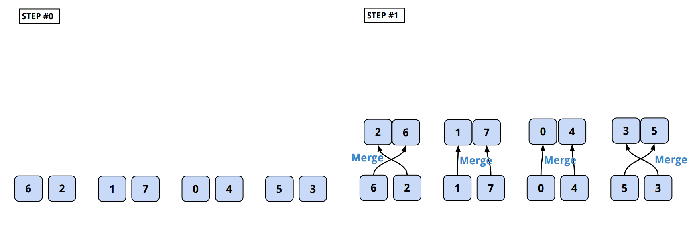

[*back to contents*](https://github.com/gyuho/learn#contents)
<br>

# Go: concurrency, queue

- [De-queue problem](#de-queue-problem)
	- [Solution #1: In-Memory](#solution-1-in-memory)
	- [Solution #2: Disk Key/Value Storage + Concurrency](#solution-2-disk-keyvalue-storage--concurrency)
	- [Result](#result)
	- [But, don't do this!](#but-dont-do-this)
	- [Summary](#summary)
- [Find duplicates with concurrency](#find-duplicates-with-concurrency)
- [Concurrency: Merge Sort](#concurrency-merge-sort)
- [Concurrency: Prime Sieve](#concurrency-prime-sieve)

[↑ top](#go-concurrency-queue)
<br><br><br><br>
<hr>


#### De-queue problem

> [In 2002] I got asked to fix the log analysis problem we had there. We were
> getting things like **web query logs coming at a literally exponential rate
> at the time**. And the analysis was written in Python and was **getting close
> to one day per day**, and at some point it was clear that that wasn’t going
> to last and we had to be able to generate the bills. … We’re talking massive,
> massive injection rates. You can’t do queries while you’re that much data.
> Even if you build a database to hold that much data, the incremental changes
> would kill you. … We designed a system called Sawmil … **Time to process a
> day’s log dropped from 24 hours to 2 minutes. Program runs on thousands of
> machines in parallel.**
>
> [**_From Parallel to Concurrent by Rob
> Pike_**](https://channel9.msdn.com/Events/Lang-NEXT/Lang-NEXT-2014/From-Parallel-to-Concurrent)

<br><br>

Here's similar situation. Suppose a **queue** where you have to:
- Consume the queue.
- Decode raw messages into meaningful data.
- Only insert the unique data into a database.
- Messaging queue can be anything. In this case, use [*SQS*](http://aws.amazon.com/sqs/) from *AWS*.
- And *PostgreSQL* to store the data.

[↑ top](#go-concurrency-queue)
<br><br><br><br>
<hr>


#### Solution #1: In-Memory

Given *no memory constraint*, I would **hash every message into a Python
dictionary**, and use it as a **lookup table** and **only insert the ones that
are not in the database yet**.

It would take only a few minutes to write a Python script for this:

```python
def do():
    # connect to AWS SQS
    conn = boto.sqs.connect_to_region(...)
    queue = conn.get_queue('message')
	
	# messages need to be unique
    existing_message = {}
    cur = database.execute("select msg from table")
    for r in cur:
        existing_message[r['msg']] = True

	while True:
        msgs = queue.get_messages(...)
        
        for msg in msgs:
            raw = msg.get_body()

			# transform(decode) the raw message
            parsed = json.loads(raw)

			# skip duplicate message
            if parsed['msg'] in existing_message:
                continue

			# insert into database
            database.execute("insert...")

		print "Done"
```

This would *work* only with a *small amount of data*. With data growing at an
exponential rate, messages would keep piling up and processing would take
longer than it should.

And even worse when we add more challenges as below:

- Messages are **NOT sorted** and contain some **duplicate entries**.
- One message in database must be **unique** against all entries in the
  database.
- There are over **millions of messages** coming every day.
	- They are too big to fit in memory.

[↑ top](#go-concurrency-queue)
<br><br><br><br>
<hr>


#### Solution #2: Disk Key/Value Storage + Concurrency

But if you have millions of messages everyday, in-memory method cannot work. *MySQL* and *PostgreSQL* have
[**INSERT**](http://www.postgresql.org/docs/8.2/static/sql-insert.html) syntax
to handle entries with primary key conflicts. However:

- **`INSERTING`**ing each row manually is too slow.
- Using a **temporary table** to join data into the database is also **slow**.

We need
[**`COPY`**](http://www.postgresql.org/docs/current/interactive/populate.html)
command and import local *csv* files, which is much faster. But this does not
ensure the message uniqueness or prevent primary key conflicts. One primary key
conflict in a *csv* file can fail the whole *csv* import command. 

So I first tried with a separate database:
1. Rewrite Python code in [**Go**](http://golang.org/) in order to *dequeue*
   and *decode* raw messages with concurrency
2. Set up a separate database [**LevelDB**](https://github.com/google/leveldb) to maintain the data uniqueness.
3. Import the filtered data in *csv* format, with `COPY` command.

[↑ top](#go-concurrency-queue)
<br><br><br><br>
<hr>


#### Result
- **Python version** took **_3 minutes_** to process *5,000 messages*.
- **Go version** takes only **_15 seconds_**: *12x faster*.

```go
package main

import (
	"encoding/base64"
	"fmt"
	"log"
	"os"
	"runtime"

	"github.com/aws/aws-sdk-go/aws"
	"github.com/aws/aws-sdk-go/aws/credentials"
	"github.com/aws/aws-sdk-go/service/sqs"
)

const (
	awsAccessKey = "YOUR_ACCESS_KEY"
	awsSecretKey = "YOUR_SECRET_KEY"
	queueURL     = "YOUR_SQS_ENDPOINT"
)

func init() {
	println()
	maxCPU := runtime.NumCPU()
	runtime.GOMAXPROCS(maxCPU)
	log.Println("Running with", maxCPU, "cpus")
	println()
}

func main() {
	msgs, receipts := getMessages(1)
	for _, msg := range msgs {
		fmt.Println(msg)
	}
	deleteMessageBatch(receipts)
}

type data struct {
	// Use your own data type
	// with your parsing function
	rawMessage string

	// receipt can be used later
	// to delete messages
	// after you process them
	receipt *string
}

// in the actual code, I have my own JSON parsing
// function, which will be parallelized with these goroutines
func parse(bt []byte) string {
	return string(bt)
}

func getMessages(maxSet int) ([]string, []*string) {
	if err := os.Setenv("AWS_ACCESS_KEY", awsAccessKey); err != nil {
		log.Fatal(err)
	}
	if err := os.Setenv("AWS_SECRET_KEY", awsSecretKey); err != nil {
		log.Fatal(err)
	}
	creds := credentials.NewEnvCredentials()
	config := aws.Config{}
	config.Credentials = creds
	config.Region = "us-west-2"
	sqsClient := sqs.New(&config)

	rcvInput := &sqs.ReceiveMessageInput{}
	rcvInput.QueueURL = aws.String(queueURL)
	var (
		maxNum      int64 = 10
		vizTimeout  int64 = 120
		waitTimeout int64 = 10
	)
	rcvInput.MaxNumberOfMessages = &maxNum
	rcvInput.VisibilityTimeout = &vizTimeout
	rcvInput.WaitTimeSeconds = &waitTimeout

	decodedEvents := []string{}
	receiptHandlesToDelete := []*string{}

	iterCount := 0

	for {
		fmt.Println("Dequeuing ", iterCount*10)

		rcvOutput, err := sqsClient.ReceiveMessage(rcvInput)
		if err != nil {
			log.Fatal(err)
		}

		if rcvOutput == nil {
			log.Println("No messages")
			break
		}
		if rcvOutput.Messages == nil {
			log.Println("No messages")
			break
		}
		msgSize := len(rcvOutput.Messages)
		if msgSize == 0 {
			log.Println("No messages")
			break
		}

		dataCh := make(chan data, 10)

		for _, msg := range rcvOutput.Messages {
			go func(msg *sqs.Message) {
				if msg.Body == nil {
					return
				}
				byteData, err := base64.StdEncoding.DecodeString(*msg.Body)
				if err != nil {
					log.Fatalf("sqs.Message: %+v %+v", msg, err)
				}
				oneData := data{}
				oneData.rawMessage = parse(byteData)
				oneData.receipt = msg.ReceiptHandle
				dataCh <- oneData
			}(msg)
		}

		i := 0
		for data := range dataCh {
			decodedEvents = append(decodedEvents, data.rawMessage)
			receiptHandlesToDelete = append(receiptHandlesToDelete, data.receipt)
			i++
			if i == msgSize {
				close(dataCh)
			}
		}

		iterCount++
		if iterCount == maxSet {
			break
		}
	}

	return decodedEvents, receiptHandlesToDelete
}

func deleteMessageBatch(receiptHandlesToDelete []*string) {
	if err := os.Setenv("AWS_ACCESS_KEY", awsAccessKey); err != nil {
		log.Fatal(err)
	}
	if err := os.Setenv("AWS_SECRET_KEY", awsSecretKey); err != nil {
		log.Fatal(err)
	}
	creds := credentials.NewEnvCredentials()
	config := aws.Config{}
	config.Credentials = creds
	config.Region = "us-west-2"
	sqsClient := sqs.New(&config)
	slices := []*sqs.DeleteMessageBatchInput{}
	tempEntries := []*sqs.DeleteMessageBatchRequestEntry{}
	for i, id := range receiptHandlesToDelete {
		one := &sqs.DeleteMessageBatchRequestEntry{}
		one.ID = aws.String(fmt.Sprintf("%d", i))
		one.ReceiptHandle = id
		tempEntries = append(tempEntries, one)
		if len(tempEntries) == 10 {
			dmbInput := &sqs.DeleteMessageBatchInput{}
			dmbInput.QueueURL = aws.String(queueURL)
			entries := []*sqs.DeleteMessageBatchRequestEntry{}
			for _, elem := range tempEntries {
				entries = append(entries, elem)
			}
			dmbInput.Entries = entries
			tempEntries = []*sqs.DeleteMessageBatchRequestEntry{}
			slices = append(slices, dmbInput)
		}
	}
	for i, dinput := range slices {
		if i%100 == 0 {
			log.Println("Deleting", i*10, "/", len(receiptHandlesToDelete))
		}
		if _, err := sqsClient.DeleteMessageBatch(dinput); err != nil {
			log.Fatal(err)
		}
	}
}
```

If you want even more concurrency:

```go
package main

import (
	"encoding/base64"
	"fmt"
	"log"
	"os"
	"runtime"

	"github.com/aws/aws-sdk-go/aws"
	"github.com/aws/aws-sdk-go/aws/credentials"
	"github.com/aws/aws-sdk-go/service/sqs"
)

const (
	awsAccessKey = "YOUR_ACCESS_KEY"
	awsSecretKey = "YOUR_SECRET_KEY"
	queueURL     = "YOUR_SQS_ENDPOINT"
)

func init() {
	println()
	maxCPU := runtime.NumCPU()
	runtime.GOMAXPROCS(maxCPU)
	log.Println("Running with", maxCPU, "cpus")
	println()
}

func main() {
	msgs, receipts := getMessages(1)
	for _, msg := range msgs {
		fmt.Println(msg)
	}
	deleteMessageBatch(receipts)
}

type data struct {
	// Use your own data type
	// with your parsing function
	rawMessage string

	// receipt can be used later
	// to delete messages
	// after you process them
	receipt *string
}

// in the actual code, I have my own JSON parsing
// function, which will be parallelized with these goroutines
func parse(bt []byte) string {
	return string(bt)
}

func getMessages(maxSet int) ([]string, []*string) {
	if err := os.Setenv("AWS_ACCESS_KEY", awsAccessKey); err != nil {
		log.Fatal(err)
	}
	if err := os.Setenv("AWS_SECRET_KEY", awsSecretKey); err != nil {
		log.Fatal(err)
	}
	creds := credentials.NewEnvCredentials()
	config := aws.Config{}
	config.Credentials = creds
	config.Region = "us-west-2"
	sqsClient := sqs.New(&config)

	rcvInput := &sqs.ReceiveMessageInput{}
	rcvInput.QueueURL = aws.String(queueURL)
	var (
		maxNum      int64 = 10
		vizTimeout  int64 = 120
		waitTimeout int64 = 10
	)
	rcvInput.MaxNumberOfMessages = &maxNum
	rcvInput.VisibilityTimeout = &vizTimeout
	rcvInput.WaitTimeSeconds = &waitTimeout

	decodedEvents := []string{}
	receiptHandlesToDelete := []*string{}

	iterCount := 0

	dataCh := make(chan data, 10*maxSet)
	msgSize := 0
	for {
		fmt.Println("Dequeuing ", iterCount*10)

		rcvOutput, err := sqsClient.ReceiveMessage(rcvInput)
		if err != nil {
			log.Fatal(err)
		}

		if rcvOutput == nil {
			log.Println("No messages")
			break
		}
		if rcvOutput.Messages == nil {
			log.Println("No messages")
			break
		}
		size := len(rcvOutput.Messages)
		msgSize += size
		if size == 0 {
			log.Println("No messages")
			break
		}

		for _, msg := range rcvOutput.Messages {
			go func(msg *sqs.Message) {
				if msg.Body == nil {
					return
				}
				byteData, err := base64.StdEncoding.DecodeString(*msg.Body)
				if err != nil {
					log.Fatalf("sqs.Message: %+v %+v", msg, err)
				}
				oneData := data{}
				oneData.rawMessage = parse(byteData)
				oneData.receipt = msg.ReceiptHandle
				dataCh <- oneData
			}(msg)
		}

		iterCount++
		if iterCount == maxSet {
			break
		}
	}

	i := 0
	for data := range dataCh {
		decodedEvents = append(decodedEvents, data.rawMessage)
		receiptHandlesToDelete = append(receiptHandlesToDelete, data.receipt)
		i++
		if i == msgSize {
			close(dataCh)
		}
	}

	return decodedEvents, receiptHandlesToDelete
}

func deleteMessageBatch(receiptHandlesToDelete []*string) {
	if err := os.Setenv("AWS_ACCESS_KEY", awsAccessKey); err != nil {
		log.Fatal(err)
	}
	if err := os.Setenv("AWS_SECRET_KEY", awsSecretKey); err != nil {
		log.Fatal(err)
	}
	creds := credentials.NewEnvCredentials()
	config := aws.Config{}
	config.Credentials = creds
	config.Region = "us-west-2"
	sqsClient := sqs.New(&config)
	slices := []*sqs.DeleteMessageBatchInput{}
	tempEntries := []*sqs.DeleteMessageBatchRequestEntry{}
	for i, id := range receiptHandlesToDelete {
		one := &sqs.DeleteMessageBatchRequestEntry{}
		one.ID = aws.String(fmt.Sprintf("%d", i))
		one.ReceiptHandle = id
		tempEntries = append(tempEntries, one)
		if len(tempEntries) == 10 {
			dmbInput := &sqs.DeleteMessageBatchInput{}
			dmbInput.QueueURL = aws.String(queueURL)
			entries := []*sqs.DeleteMessageBatchRequestEntry{}
			for _, elem := range tempEntries {
				entries = append(entries, elem)
			}
			dmbInput.Entries = entries
			tempEntries = []*sqs.DeleteMessageBatchRequestEntry{}
			slices = append(slices, dmbInput)
		}
	}
	for i, dinput := range slices {
		if i%100 == 0 {
			log.Println("Deleting", i*10, "/", len(receiptHandlesToDelete))
		}
		if _, err := sqsClient.DeleteMessageBatch(dinput); err != nil {
			log.Fatal(err)
		}
	}
}
```

And here's how you would use **LevelDB** for this case:

```go
package main

import (
	"log"
	"runtime"
	"strings"
	"time"

	"github.com/syndtr/goleveldb/leveldb"
)

func init() {
	maxCPU := runtime.NumCPU()
	runtime.GOMAXPROCS(runtime.NumCPU())
	log.Println("Concurrent execution with", maxCPU, "CPUs.")
}

func main() {
	start := time.Now()

	levelDBpath := "./db"
	ldb, err := leveldb.OpenFile(levelDBpath, nil)
	if err != nil {
		log.Fatal(err)
	}
	defer ldb.Close()

	maxSet := 450 // import maxSet * 10 messages
	decodedEvents, receiptHandlersToDelete := getMessages(maxSet)

	foundEvent := make(map[string]bool)
	idsToPut := []string{}
	for _, msg := range decodedEvents {

		// check id collision within a batch
		if _, ok := foundEvent[msg.EventHash]; ok {
			continue
		} else {
			foundEvent[msg.EventHash] = true

			data, err := ldb.Get([]byte(msg.EventHash), nil)
			if err != nil {
				if !strings.Contains(err.Error(), "not found") {
					log.Fatal(err)
				}
			}
			if data != nil {
				log.Printf("Found Duplicate Event: %s", string(data))
				continue
			}

			idsToPut = append(idsToPut, msg.EventHash)
		}
	}

	// do your data import job here

	log.Println("maintain the lookup table")
	for _, id := range idsToPut {
		// maintain the lookup table
		if err := ldb.Put([]byte(id), []byte("true"), nil); err != nil {
			log.Fatal(err)
		}
	}
}
```

Or you can even write directly to local disk storage:

```go
package main

import (
	"crypto/sha512"
	"encoding/hex"
	"fmt"
	"io/ioutil"
	"log"
	"os"
	"strings"
)

func exist(fpath string) bool {
	// Does a directory exist
	st, err := os.Stat(fpath)
	if err != nil {
		return false
	}
	if st.IsDir() {
		return true
	}
	if _, err := os.Stat(fpath); err != nil {
		if strings.Contains(err.Error(), "no such file") {
			return false
		}
	}
	return true
}

func getHash(bt []byte) string {
	if bt == nil {
		return ""
	}
	h := sha512.New()
	h.Write(bt)
	sha512Hash := hex.EncodeToString(h.Sum(nil))
	return sha512Hash
}

func main() {
	var events = []string{
		"Hello World!",
		"Hello World!",
		"different",
	}
	for _, event := range events {
		eventHash := getHash([]byte(event))
		if !exist(eventHash) {
			if err := ioutil.WriteFile(eventHash, nil, 0644); err != nil {
				log.Fatal(err)
			}
			fmt.Println("Saved", event, "with", eventHash)
		} else {
			fmt.Println("Found duplicate events:", event)
		}
	}
}

/*
Saved Hello World! with 861844d6704e8573fec34d967e20bcfef3d424cf48be04e6dc08f2bd58c729743371015ead891cc3cf1c9d34b49264b510751b1ff9e537937bc46b5d6ff4ecc8
Found duplicate events: Hello World!
Saved different with 49d5b8799558e22d3890d03b56a6c7a46faa1a7d216c2df22507396242ab3540e2317b870882b2384d707254333a8439fd3ca191e93293f745786ff78ef069f8
*/
```

[↑ top](#go-concurrency-queue)
<br><br><br><br>
<hr>


#### But, don't do this!

My coworker pointed out the unnecessary use of external database. For this
particular problem, we didn’t need a separate database. Just **_creating
indexes in PostgreSQL was enough_**.

```sql
CREATE UNIQUE INDEX event_id
ON events_table (event_id)
;
SELECT event_id AS duplicate_id
FROM events_table
WHERE event_id IN ('EVENT_IDs from 5,000 Messages, ...')
;
```

This query finds the duplicates that could have failed the `COPY` command. It
is slightly slower than *LevelDB* but is a good compromise considering the cost
of maintaining the separate database. And if I still need a separate
key-value database, I would switch to a [**_Redis_**](http://redis.io/) server
to avoid the data loss in local disk storage.


<br><br>

Lesson learned. **_Don’t introduce complexity unless it’s needed. The simplest
are the best._**, and:

> The **competent programmer is fully aware of the strictly limited size of his
> own skull;** therefore he approaches the programming task in full humility,
> and among other things he **avoids clever tricks like the plague.**
>
> We shall do a much better programming job, provided that we approach the task
> with a full appreciation of its tremendous difficulty, provided that we stick
> to modest and elegant programming languages, **provided that we respect the
> intrinsic limitations of the human mind and approach the task as Very Humble
> Programmers.**
>
> [**_The Humble
> Programmer_**](https://www.cs.utexas.edu/~EWD/transcriptions/EWD03xx/EWD340.html)
> *by* [*Edsger W. Dijkstra*](https://en.wikipedia.org/wiki/Edsger_W._Dijkstra)


[↑ top](#go-concurrency-queue)
<br><br><br><br>
<hr>


#### Summary

And back to our original question: *You have billions of events that do not fit
in memory. How would you detect the duplicates?*

- Most preferable is using **traditional databases**, such as *MySQL* or
  *PostgreSQL*. And create an index (*primary key) for its unique identifiers.
  You can get this by hashing the raw message.
- You can also have a **separate key-value database**, such as *LevelDB* or
  *Redis*. And maintain the **unique event identifier table** to filter out the
  duplicate events. This would be fastest but you need to maintain the separate
  database.

[↑ top](#go-concurrency-queue)
<br><br><br><br>
<hr>


#### Find duplicates with concurrency

What if you don’t have *PostgreSQL* or *LevelDB*? How would you find duplicates
out of big data that is too big to fit in memory? It's an interesting problem
and I thought **concurrency** would be a good fit for this.

Simplest way is to **sort the whole data** and **traverse them in order until
duplicates are found**. With concurrency, you can break the big chunk of data
into smaller parts in order to sort each chunk independently, and later to
merge.


[↑ top](#go-concurrency-queue)
<br><br><br><br>
<hr>


#### Concurrency: Merge Sort

[**Merge sort**](https://en.wikipedia.org/wiki/Merge_sort) seems perfect for
this because it uses [*divide and conquer
algorithm*](https://en.wikipedia.org/wiki/Divide_and_conquer_algorithms). That
is, it **_divides(breaks)_** the problem into several *sub-problems*. And then
it **_conquers(solves)_** the *sub-problems* recursively, and **_combine those
solutions_** to the original problem. **Merge sort** divides a list of elements
into a single element, and then **merge** those single elements into one
**sorted list**. 





And [code](http://play.golang.org/p/q80UYMgqyx):

```go
package main

import "fmt"

func main() {
	fmt.Println(mergeSort([]int{-5, 1, 43, 6, 3, 6, 7}))
	// [-5 1 3 6 6 7 43]
}

// O(n * log n)
// Recursively splits the array into subarrays, until only one element.
// From each subarray, merge them into a sorted array.
func mergeSort(slice []int) []int {
	if len(slice) < 2 {
		return slice
	}
	idx := len(slice) / 2
	left := mergeSort(slice[:idx])
	right := mergeSort(slice[idx:])
	return merge(left, right)
}

// O(n)
func merge(s1, s2 []int) []int {
	final := make([]int, len(s1)+len(s2))
	i, j := 0, 0
	for i < len(s1) && j < len(s2) {
		if s1[i] <= s2[j] {
			final[i+j] = s1[i]
			i++
			continue
		}
		final[i+j] = s2[j]
		j++
	}
	for i < len(s1) {
		final[i+j] = s1[i]
		i++
	}
	for j < len(s2) {
		final[i+j] = s2[j]
		j++
	}
	return final
}
```

**_They seem to be doing the same thing in two parts(left and right)_**. Then
what if we parallelize those two operations, like
[here](http://play.golang.org/p/KZf4gGI_Rl)?

```go
package main

import (
	"fmt"
	"log"
	"runtime"
)

func init() {
	maxCPU := runtime.NumCPU()
	runtime.GOMAXPROCS(runtime.NumCPU())
	log.Println("Concurrent execution with", maxCPU, "CPUs.")
}

func main() {
	result := make(chan []int)
	go concurrentMergeSort([]int{-5, 1, 43, 6, 3, 6, 7}, result)
	fmt.Println(<-result)
	// [-5 1 3 6 6 7 43]
}

func concurrentMergeSort(slice []int, result chan []int) {
	if len(slice) < 2 {
		result <- slice
		return
	}
	idx := len(slice) / 2
	ch1, ch2 := make(chan []int), make(chan []int)

	go concurrentMergeSort(slice[:idx], ch1)
	go concurrentMergeSort(slice[idx:], ch2)

	left := <-ch1
	right := <-ch2

	result <- merge(left, right)
}

func merge(s1, s2 []int) []int {
	final := make([]int, len(s1)+len(s2))
	i, j := 0, 0
	for i < len(s1) && j < len(s2) {
		if s1[i] <= s2[j] {
			final[i+j] = s1[i]
			i++
			continue
		}
		final[i+j] = s2[j]
		j++
	}
	for i < len(s1) {
		final[i+j] = s1[i]
		i++
	}
	for j < len(s2) {
		final[i+j] = s2[j]
		j++
	}
	return final
}
```

<br>

Theoretically, this concurrent code *should sort faster* since it's
**parallel**. However, benchmark results show the opposite:

```go
package merge_sort

import (
	"math/rand"
	"sort"
	"testing"
)

func merge(s1, s2 []int) []int {
	final := make([]int, len(s1)+len(s2))
	i, j := 0, 0
	for i < len(s1) && j < len(s2) {
		if s1[i] <= s2[j] {
			final[i+j] = s1[i]
			i++
			continue
		}
		final[i+j] = s2[j]
		j++
	}
	for i < len(s1) {
		final[i+j] = s1[i]
		i++
	}
	for j < len(s2) {
		final[i+j] = s2[j]
		j++
	}
	return final
}

func mergeSort(slice []int) []int {
	if len(slice) < 2 {
		return slice
	}
	idx := len(slice) / 2
	left := mergeSort(slice[:idx])
	right := mergeSort(slice[idx:])
	return merge(left, right)
}

func concurrentMergeSort(slice []int, result chan []int) {
	if len(slice) < 2 {
		result <- slice
		return
	}
	idx := len(slice) / 2
	ch1, ch2 := make(chan []int), make(chan []int)

	go concurrentMergeSort(slice[:idx], ch1)
	go concurrentMergeSort(slice[idx:], ch2)

	left := <-ch1
	right := <-ch2

	result <- merge(left, right)
}

func BenchmarkStandardPackage(b *testing.B) {
	var sampleIntSlice = []int{}
	sampleIntSlice = rand.New(rand.NewSource(123123)).Perm(999999)
	for i := 0; i < b.N; i++ {
		sort.Ints(sampleIntSlice)
	}
}

func BenchmarkMergeSort(b *testing.B) {
	var sampleIntSlice = []int{}
	sampleIntSlice = rand.New(rand.NewSource(123123)).Perm(999999)
	for i := 0; i < b.N; i++ {
		mergeSort(sampleIntSlice)
	}
}

func BenchmarkConcurrentMergeSort(b *testing.B) {
	var sampleIntSlice = []int{}
	sampleIntSlice = rand.New(rand.NewSource(123123)).Perm(999999)
	for i := 0; i < b.N; i++ {
		result := make(chan []int)
		go concurrentMergeSort(sampleIntSlice, result)
		<-result
	}
}

/*
go get github.com/cespare/prettybench
go test -bench . -benchmem -cpu 1,2,4 | prettybench
benchmark                        iter       time/iter      bytes alloc              allocs
---------                        ----       ---------      -----------              ------
BenchmarkStandardPackage           10    131.37 ms/op      800929 B/op         1 allocs/op
BenchmarkStandardPackage-2         10    132.84 ms/op      800929 B/op         1 allocs/op
BenchmarkStandardPackage-4         10    131.81 ms/op      800929 B/op         1 allocs/op
BenchmarkMergeSort                  5    204.42 ms/op   166369507 B/op    999998 allocs/op
BenchmarkMergeSort-2                5    202.03 ms/op   166369507 B/op    999998 allocs/op
BenchmarkMergeSort-4                5    229.62 ms/op   166369507 B/op    999998 allocs/op
BenchmarkConcurrentMergeSort        1   3994.73 ms/op   488144848 B/op   3537113 allocs/op
BenchmarkConcurrentMergeSort-2      1   2134.87 ms/op   377522704 B/op   3199159 allocs/op
BenchmarkConcurrentMergeSort-4      1   1242.12 ms/op   377254480 B/op   3194968 allocs/op
ok  	github.com/gyuho/kway/benchmarks/merge_sort	18.784s
*/
```

As you see, **_the concurrent merge-sort code is much slower_** because of the
**_heavy memory usage in concurrency_**.

<br>

> *Why does using GOMAXPROCS > 1 sometimes make my program slower?*?
>
> It depends on the nature of your program. **Problems that are intrinsically
> sequential cannot be sped up by adding more goroutines.** Concurrency only
> becomes parallelism when the problem is intrinsically parallel.
>
> [**_Go FAQ_**](https://golang.org/doc/faq#Why_GOMAXPROCS)

Merge sort works by merging the list of sub-lists that constantly requires
additional memories. And **_merge_** has to happen in **_sequential order_** in
order to combine every single sub-list. That is, it is not a **_intrinsically
parallel problem_**. You only loose when you use concurrency for inherently
sequential problems.


Or maybe I am just doing it wrong... I will get back to this later.

[↑ top](#go-concurrency-queue)
<br><br><br><br>
<hr>


#### Concurrency: Prime Sieve

One legendary example is [concurrent prime sieve](http://play.golang.org/p/wkOiMwlrl5):

- [Sieve of Eratosthenes](https://en.wikipedia.org/wiki/Sieve_of_Eratosthenes)
- [Sieve of Eratosthenes in Haskell](https://wiki.haskell.org/Prime_numbers)


```go
// A concurrent prime sieve
// https://golang.org/doc/play/sieve.go

package main

import "fmt"

// Send the sequence 2, 3, 4, ... to channel 'ch'.
func Generate(ch chan<- int) {
	for i := 2; ; i++ {
		ch <- i // Send 'i' to channel 'ch'.
	}
}

// Copy the values from channel 'in' to channel 'out',
// removing those divisible by 'prime'.
func Filter(in <-chan int, out chan<- int, prime int) {
	for {
		i := <-in // Receive value from 'in'.
		if i%prime != 0 {
			out <- i // Send 'i' to 'out'.
		}
	}
}

// The prime sieve: Daisy-chain Filter processes.
func main() {
	ch := make(chan int) // Create a new channel.
	go Generate(ch)      // Launch Generate goroutine.
	for i := 0; i < 10; i++ {
		prime := <-ch
		fmt.Println(prime)
		ch1 := make(chan int)
		go Filter(ch, ch1, prime)
		ch = ch1
	}
}
```

[↑ top](#go-concurrency-queue)
<br><br><br><br>
<hr>
