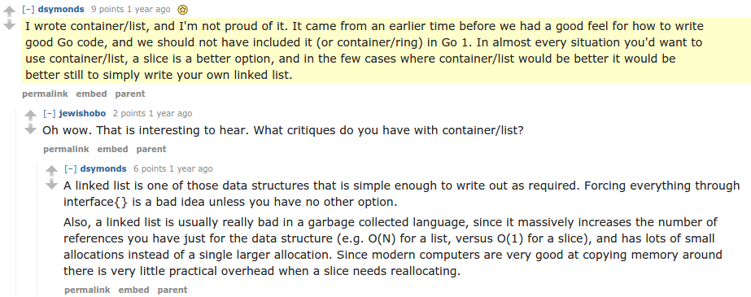

[*back to contents*](https://github.com/gyuho/learn#contents)<br>

# Go: function, method, pointer, nil, map, slice

- [What are function and method?](#what-are-function-and-method)
- [What is pointer?](#what-is-pointer)
- [Why pointer?](#why-pointer)
- [Where pointer?](#where-pointer)
- [Why `list` as a pointer?](#why-list-as-a-pointer)
- [pointer: copy `struct`](#pointer-copy-struct)
- [pointer: `map` and `slice`](#pointer-map-and-slice)
- [pointer: `channel`](#pointer-channel)
- [Recap](#recap)
- [swap: `array` and `slice`](#swap-array-and-slice)
- [`nil`](#nil)
- [initialize and empty `map`](#initialize-and-empty-map)
- [*non-deterministic* `range` `map`](#non-deterministic-range-map)
- [`map` internals](#map-internals)
- [slice tricks](#slice-tricks)
- [slice vs. map](#slice-vs-map)
- [permute `string`](#permute-string)
- [destroy `struct`](#destroy-struct)
- [tree](#tree)
- [slice struct pointer](#slice-struct-pointer)
- [slice struct range](#slice-struct-range)
- [function struct pointer](#function-struct-pointer)

[↑ top](#go-function-method-pointer-nil-map-slice)
<br><br><br><br><hr>


#### What are function and method?

Think of a **function** as **an operation(on arguments if any)**. And **method as a
behavior of a type**. A **method** is *a function that takes a receiver*, and always
*used in conjunction with types*. Try this
[code](http://play.golang.org/p/tm52WsTj60):

```go
package main
 
import "fmt"
 
func myFunc(num int) {
	fmt.Println(num + 1)
}
 
type Int int
 
func (num Int) myMethod() {
	fmt.Println(num + 2)
}
 
func main() {
	myFunc(1)         // 2
	Int(1).myMethod() // 3
}
```

<br>

Go supports **_function types_**, **_function values_**, and **_function
closures_**. Let's take a look at this
[code](http://play.golang.org/p/vS15bbZZ8e):

```go
package main
 
import (
	"fmt"
	"reflect"
	"runtime"
)
 
func main() {
	// function values
	fmt.Println(
		// function closure (function literal)
		func() {
			fmt.Println("Hello")
		},
	) // 0x20280
 
	// without _ =
	// we get func literal evaluated but not used
	//
	_ = func() {
		fmt.Println("Hello 1")
	}
	// No output
 
	func(str string) {
		fmt.Println(str)
	}("Hello 2")
	// Hello 2
 
	fn := func() {
		fmt.Println("Hello")
	}
	fmt.Println(fn)                                                      // 0x203a0
	fmt.Println(reflect.TypeOf(fn))                                      // func()
	fmt.Println(runtime.FuncForPC(reflect.ValueOf(fn).Pointer()).Name()) // main.func·004
 
	fn() // Hello
 
	fc := func(num int) int {
		num += 1
		return num
	}
	fmt.Println(fc)                 // 0x20720
	fmt.Println(reflect.TypeOf(fc)) // func(int) int
	fmt.Println(fc(1))              // 2
 
	po := plusOne(1)
	fmt.Println(po)                 // 0x209e0
	fmt.Println(reflect.TypeOf(po)) // main.funcType
	fmt.Println(po(3))              // 4
}
 
// function type
// FunctionType   = "func" Signature .
type funcType func(int) int
 
func plusOne(num int) funcType {
	return func(num int) int {
		return num + 1
	}
}

```

A **function name** in the function signature must be **unique**: [**there is
no function overloading**](https://golang.org/ref/spec#Signature) in Go. And a
function name can be omitted in a function literal or an anonymous
function — this is useful in concurrency and enables a functional programming
style in a strongly typed language.


With **functions having values and types**, you can do something like
[here](http://play.golang.org/p/psW7cO37yn):

```go
package main
 
import (
	"fmt"
	"reflect"
)
 
func plusOne(num int) int {
	return num + 1
}
 
func plusTwo(num int) int {
	return num + 2
}
 
func plusThree(num int) int {
	return num + 3
}
 
var funcMap = map[string]func(num int) int{
	"one":   plusOne,
	"two":   plusTwo,
	"three": plusThree,
}
 
func add(num int, functions ...func(num int) int) int {
	for _, oneFunc := range functions {
		num = oneFunc(num)
	}
	return num
}
 
func main() {
	chosen := funcMap["two"]
	fmt.Println(reflect.TypeOf(chosen)) // func(int) int
	fmt.Println(chosen(0))              // 2
 
	fmt.Println(
		add(
			0,
			funcMap["one"],
			funcMap["two"],
			funcMap["three"],
		),
	)
	// 6
}

```

[↑ top](#go-function-method-pointer-nil-map-slice)
<br><br><br><br><hr>


#### What is pointer?

Take a look at
[`container/list`](http://golang.org/pkg/container/list/)
package with *pointer*:

```go
type Element struct {
	next, prev *Element
	list       *List
	Value      interface{}
}
```

*`next`* and *`prev`* Element are defined as pointer _`*Element`_.
- Can we instead use Element *value*?
- What is *pointer*?
- How does Go handle *pointer*s?

<br>
[**Pointer**](https://en.wikipedia.org/wiki/Pointer_%28computer_programming%29)
is a value that refers to another value in memory (it’s an address value). When
you **reference** a variable, you get the **location** of the value in memory.
When you **dereference** a pointer, you get the **value stored** in that
address. In Go, you would:

```go
oneVar := 1
reference := &oneVar
dereference = *reference
fmt.Printf("%p\n", reference) // 0x1043617c
fmt.Printf("%v", dereference) // 1
```

[Go FAQ](http://golang.org/doc/faq#Pointers) explains that **_every function
parameter in Go is passed by value_**: a function receives the copied data from
arguments, not the original object. Suppose you pass a variable of an integer
value, a function gets the copied value of the integer variable. Updating the
passed variable inside the function wouldn’t have any effect on the original
data in function arguments. **_When you pass a pointer variable, a function
gets the copy of the pointer._** And pointer is not the data itself but
**pointer points to original data it refers to. Therefore, changing
dereferenced data by its pointer inside the function can update the original data.**

[↑ top](#go-function-method-pointer-nil-map-slice)
<br><br><br><br><hr>


#### Why pointer?

That's because **_every function parameter in Go is passed by value._** If you
**want to manipulate objects** with **methods** or **functions**, passing a
copied value won't take any effect on the original object: you **_must pass a
pointer to the original data_**, which can be used for direct access. **The
pointer itself will be copied as well, but the pointer is the address that
still points to the original data.** [Go
FAQ](http://golang.org/doc/faq#Pointers) explains if the **receiver is large**,
a *big struct* for instance, it's **cheaper to use a pointer receiver**, than
copying the whole data. Look at this
[code](http://play.golang.org/p/66_KBKuOYH):

```go
package main
 
import "fmt"
 
type myType struct{ val int }
 
func noChange(t myType) {
	t.val = 100
	// this only changes the copied
}
 
func (t myType) noChange() {
	t.val = 200
	// this only changes the copied
}
 
func change(t *myType) {
	t.val = 300
	// this updates the original
	// that the pointer t points to
}
 
func (t *myType) change() {
	t.val = 400
	// this updates the original
	// that the pointer t points to
}
 
func main() {
	one := myType{val: 1}
	noChange(one)
	fmt.Printf("%+v\n", one) // {val:1}
	one.noChange()
	fmt.Printf("%+v\n", one) // {val:1}
 
	change(&one)
	fmt.Printf("%+v\n", one) // {val:300}
	(&one).change()
	fmt.Printf("%+v\n", one) // {val:400}
}

```

```go
package main

import "fmt"

type Flags struct {
	Key string
}

type Data struct {
	Flags Flags
}

type DataPointer struct {
	Flags *Flags
}

// X
func functionData1(d Data) {
	d.Flags.Key = "updated by functionData1"
}

// O
func functionData2(d *Data) {
	d.Flags.Key = "updated by functionData2"
}

// X
func (d Data) methodData1() {
	d.Flags.Key = "updated by methodData1"
}

// O
func (d *Data) methodData2() {
	d.Flags.Key = "updated by methodData2"
}

// O
func functionDataPointer1(d DataPointer) {
	d.Flags.Key = "updated by functionDataPointer1"
}

// O
func functionDataPointer2(d *DataPointer) {
	d.Flags.Key = "updated by functionDataPointer2"
}

// O
func (d DataPointer) methodDataPointer1() {
	d.Flags.Key = "updated by methodDataPointer1"
}

// O
func (d *DataPointer) methodDataPointer2() {
	d.Flags.Key = "updated by methodDataPointer2"
}

func main() {
	f := Flags{Key: ""}

	data := Data{}
	data.Flags = f

	dataPointer := DataPointer{}
	dataPointer.Flags = &f

	// X
	functionData1(data)
	fmt.Println("after functionData1:", data)

	// O
	functionData2(&data)
	fmt.Println("after functionData2:", data)

	// X
	data.methodData1()
	fmt.Println("after methodData1:", data)

	// O
	(&data).methodData2()
	fmt.Println("after methodData2:", data)

	// O
	functionDataPointer1(dataPointer)
	fmt.Println("after functionDataPointer1:", dataPointer.Flags)

	// O
	functionDataPointer2(&dataPointer)
	fmt.Println("after functionDataPointer2:", dataPointer.Flags)

	// O
	dataPointer.methodDataPointer1()
	fmt.Println("after methodDataPointer1:", dataPointer.Flags)

	// O
	(&dataPointer).methodDataPointer2()
	fmt.Println("after methodDataPointer2:", dataPointer.Flags)
}

/*
after functionData1: {{}}
after functionData2: {{updated by functionData2}}
after methodData1: {{updated by functionData2}}
after methodData2: {{updated by methodData2}}
after functionDataPointer1: &{updated by functionDataPointer1}
after functionDataPointer2: &{updated by functionDataPointer2}
after methodDataPointer1: &{updated by methodDataPointer1}
after methodDataPointer2: &{updated by methodDataPointer2}
*/

```

A *function* or *method* updates the original data **only when we pass the
pointer to the original data.** Otherwise, only the copied value gets passed.
Again, updates on a copied value do not affect the original data, but updates
through a pointer change the original. **_Pointer is about shared access._**
**If you want to share the value between functions and methods, then use a
pointer. If you don’t need to share, then use a value then** **_copy_**. This
only **matters** when the **function parameters or method receivers get
copied.**. You don't need to worry about it when you have a [direct
access](http://play.golang.org/p/wIp9clV4TO) to the data:

```go
package main
 
import "fmt"
 
type myType struct{ val int }
 
func main() {
	one := myType{val: 1}
 
	// direct access
	one.val = 100
	fmt.Printf("%+v\n", one) // {val:100}
 
	// copy the value
	value := one
	value.val = 200
	fmt.Printf("%+v\n", one) // {val:100}
 
	// access to the original data through pointer
	pointer := &one
	pointer.val = 300
	fmt.Printf("%+v\n", one) // {val:300}
}

```

[↑ top](#go-function-method-pointer-nil-map-slice)
<br><br><br><br><hr>


#### Where pointer?
Go, as a [garbage collected
language](https://en.wikipedia.org/wiki/Garbage_collection_%28computer_science%29),
handles memory allocation for you. Where is pointer? We [do not need to
worry](http://golang.org/doc/faq#stack_or_heap) about it. To be precise:

> there is no way to know this[stack or heap], since the **compiler is free to
> move things from stack to heap and vice versa**
>
> [**_Rob
> Pike_**](https://groups.google.com/forum/#!msg/golang-nuts/PH_pMZqvLN8/xd12p5x5qqUJ)

It depends on the compiler’s [escape
analysis](http://en.wikipedia.org/wiki/Escape_analysis): **_compilers store
variables in stack when they are local to the function (local variables)._**
**If the analysis cannot prove them to be local, Go stores them in
garbage-collected heap.** Look at this
[code](http://play.golang.org/p/7aiPdY60ez):

```go
package main
 
import "fmt"
 
type myType struct{ val int }
 
func a() *myType {
	one := myType{val: 1}
	return &one
}
 
func main() {
	one := a()
	fmt.Printf("%+v\n", one) // &{val:1}
}
```

In C, you get warnings when returning the address of a local variable. The
local variable gets assigned an address(pointer) but once the function exits,
the memory gets deallocated, thus the pointer to this memory becomes invalid
(**dangling pointer**). **But in Go, this is [totally
OK](http://golang.org/doc/effective_go.html#composite_literals) and the data is
still** **_refer-able_** **after function return.**.

[↑ top](#go-function-method-pointer-nil-map-slice)
<br><br><br><br><hr>


#### Why `list` as a pointer?

And back to the original question:
```go
type Element struct {
	next, prev *Element
	list       *List
	Value      interface{}
}
```
Why is it defined as a pointer? That's because [linked
list](http://en.wikipedia.org/wiki/Linked_list) implementation needs to
manipulate the original moving nodes around. If it were defined with
values(*non-pointers*), we can't *insert* or *remove* elements in the linked
list, as seen in this [example](http://play.golang.org/p/P4mEFTs0ZU):

```go
package main
 
import "fmt"
 
type List struct{ root Element }
type Element struct{ val int }
 
func change(l List) { l.root.val = 100 }
 
func main() {
	l := List{}
	l.root = Element{val: 1}
	l.root.val = 2
	fmt.Printf("%+v\n", l) // {root:{val:2}}
	// this updates because we are not passing the copy
	// it's not in the function or method
 
	change(l)
	fmt.Printf("%+v", l) // {root:{val:2}}
	// passing the non-pointer
	// and only the copied data is passed
	// so it can't update the original value
}
```

As you see, without pointer, we cannot change the original data in function or
with methods. Define with# pointer to globally pass things around and to update
it anywhere.

[↑ top](#go-function-method-pointer-nil-map-slice)
<br><br><br><br><hr>


#### pointer: copy `struct`

Try [this](http://play.golang.org/p/yKL4dEnlaH):

```go
package main

import "fmt"

type Data struct {
	value string
}

func main() {
	d1 := Data{}
	d1.value = "A"
	// just copy the value
	d2 := d1
	d2.value = "B"

	fmt.Println(d1) // {A}
	fmt.Println(d2) // {B}

	d3 := &Data{}
	d3.value = "A"
	// copy the pointer of the original
	d4 := d3
	d4.value = "B"

	fmt.Println(d3) // &{B}
	fmt.Println(d4) // &{B}
}
```

[↑ top](#go-function-method-pointer-nil-map-slice)
<br><br><br><br><hr>


#### pointer: `map` and `slice`

Go [FAQ](https://golang.org/doc/faq#pass_by_value) explains: **maps and slices
are** [**_references_** *in Go*](https://golang.org/doc/faq#references) (slice
as reference, array as value). **Map** and **slice values** behave like
**pointers**. Let's take a look at **map** first with this
[code](http://play.golang.org/p/94-uaG6BqT):

```go
package main

import "fmt"

var mmap = map[int]string{1: "A"}

func changeMap1(m map[int]string) { m[100] = "B" }

func changeMap1pt(m *map[int]string) { (*m)[100] = "C" }

type mapType map[int]string

func (m mapType) changeMap2() { m[100] = "D" }

func (m *mapType) changeMap2pt() { (*m)[100] = "E" }

func main() {
	// (O) change
	changeMap1(mmap)
	fmt.Println(mmap) // map[1:A 100:B]

	// (O) change
	changeMap1pt(&mmap)
	fmt.Println(mmap) // map[1:A 100:C]

	// (O) change
	mapType(mmap).changeMap2()
	fmt.Println(mmap) // map[1:A 100:D]

	// (O) change
	(*mapType)(&mmap).changeMap2pt()
	fmt.Println(mmap) // map[100:E 1:A]

	mmap := make(map[string]map[string]struct{})
	mmap["A"] = make(map[string]struct{})
	mmap["A"]["B"] = struct{}{}
	mmap["A"]["C"] = struct{}{}
	tm := mmap["A"]
	tm["D"] = struct{}{}
	delete(tm, "B")
	fmt.Println(mmap) // map[A:map[C:{} D:{}]]
}

```

**The original map still gets changed** from the function and method, **_even
when_** we **DO NOT** *pass* **pointers** *of maps*. This is because
internally
[makemap](https://github.com/golang/go/blob/master/src/runtime/hashmap.go#L187)
function in [runtime](http://golang.org/pkg/runtime/) **initializes a map** and
returns **_hmap_** **pointer**:

```go
func makemap(
	t *maptype,
	hint int64,
	h *hmap,
	bucket unsafe.Pointer,
) *hmap {
	...
```

<br>

**Array** and **slice** are more subtle than map. Likewise, slice contains
pointer but in a different way. **A slice contains a reference to its backing
array**, as
[here](https://github.com/golang/go/blob/master/src%2Fruntime%2Fslice.go):

```go
package runtime
 
import (
	"unsafe"
)
 
type sliceStruct struct {
	array unsafe.Pointer
	len   int
	cap   int
}
 
// TODO: take uintptrs instead of int64s?
func makeslice(t *slicetype, len64 int64, cap64 int64) sliceStruct {
	// NOTE: The len > MaxMem/elemsize check here is not strictly necessary,
	// but it produces a 'len out of range' error instead of a 'cap out of range' error
	// when someone does make([]T, bignumber). 'cap out of range' is true too,
	// but since the cap is only being supplied implicitly, saying len is clearer.
	// See issue 4085.
	len := int(len64)
	if len64 < 0 || int64(len) != len64 || t.elem.size > 0 && uintptr(len) > _MaxMem/uintptr(t.elem.size) {
		panic(errorString("makeslice: len out of range"))
	}
	cap := int(cap64)
	if cap < len || int64(cap) != cap64 || t.elem.size > 0 && uintptr(cap) > _MaxMem/uintptr(t.elem.size) {
		panic(errorString("makeslice: cap out of range"))
	}
	p := newarray(t.elem, uintptr(cap))
	return sliceStruct{p, len, cap}
}

```

<br>
And take a look at this [code](http://play.golang.org/p/g8y8_BGVKo) and
[code](http://play.golang.org/p/T9nqUmp624):

```go
package main
 
import "fmt"
 
var array = [3]string{"A", "B", "C"}
 
func changeArray1(m [3]string) { m[0] = "X" }
 
func changeArray1pt(m *[3]string) { (*m)[0] = "Y" }
 
type arrayType [3]string
 
func (m arrayType) changeArray2() { m[1] = "XX" }
 
func (m *arrayType) changeArray2p()  { m[1] = "YY" }
func (m *arrayType) changeArray2pt() { (*m)[1] = "ZZ" }
 
func main() {
	// (X) no change
	changeArray1(array)
	fmt.Println("changeArray1:", array) // [A B C]
 
	// (O) change
	changeArray1pt(&array)
	fmt.Println("changeArray1pt:", array) // [Y B C]
 
	// (X) no change
	arrayType(array).changeArray2()
	fmt.Println(".changeArray2():", array) // [Y B C]
 
	// (O) change
	(*arrayType)(&array).changeArray2p()
	fmt.Println(".changeArray2pt():", array) // [Y YY C]
	
	// (O) change
	(*arrayType)(&array).changeArray2pt()
	fmt.Println(".changeArray2pt():", array) // [Y ZZ C]
}

```

```go
package main
 
import "fmt"
 
var slice = []string{"A", "B", "C"}
 
func changeSlice1(m []string) { m[0] = "X" }
 
func changeSlice1pt(m *[]string) { (*m)[0] = "Y" }
 
type sliceType []string
 
// var slice = sliceType{"A", "B", "C"}
 
func (m sliceType) changeSlice2() { m[1] = "XX" }
 
// func (m *sliceType) changeSlice2p() { m[1] = "YY" }
 
func (m *sliceType) changeSlice2pt() { (*m)[1] = "YY" }
 
func changeSlice3(m []string) { m = append(m, "XXX") }
 
func changeSlice3pt(m *[]string) { *m = append(*m, "YYY") }
 
func (m sliceType) changeSlice4() { m = append(m, "XXXX") }
 
func (m *sliceType) changeSlice4pt() { *m = append(*m, "YYYY") }
 
func main() {
	// (O) change
	changeSlice1(slice)
	fmt.Println("changeSlice1:", slice) // [X B C]
 
	// (O) change
	changeSlice1pt(&slice)
	fmt.Println("changeSlice1pt:", slice) // [Y B C]
 
	// (O) change
	sliceType(slice).changeSlice2()
	fmt.Println(".changeSlice2():", slice) // [Y XX C]
 
	// (O) change
	(*sliceType)(&slice).changeSlice2pt()
	fmt.Println(".changeSlice2pt():", slice) // [Y YY C]
 
	// (X) no change
	changeSlice3(slice)
	fmt.Println("changeSlice3:", slice) // [Y YY C]
 
	// (O) change
	changeSlice3pt(&slice)
	fmt.Println("changeSlice3pt:", slice) // [Y YY C YYY]
 
	// (X) no change
	sliceType(slice).changeSlice4()
	fmt.Println(".changeSlice4():", slice) // [Y YY C YYY]
 
	// (O) change
	(*sliceType)(&slice).changeSlice4pt()
	fmt.Println(".changeSlice4pt():", slice) // [Y YY C YYY YYYY]
}

```

According to [Go FAQ](https://golang.org/doc/faq#references), **_slice is a
reference_**. Then **_why do we still have to pass the pointer in order to
update a slice?_** [*Arrays, slices (and string) by Rob
Pike*](https://blog.golang.org/slices) and [*Go Data Structures by Russ
Cox*](http://research.swtch.com/godata)
explain in more detail. In short, **a slice in Go is not an array. A slice just
represents a piece in an array.**

> A [slice](http://golang.org/doc/effective_go.html#slices) is a reference to a
> section of an array.
>
> [**_Russ Cox_**](http://research.swtch.com/godata)

Think of a **slice** as a struct typed data of an **element in an array** (Go
slice implementation is
[here](https://go.googlesource.com/go/+/master/src/runtime/slice.go)):


This is why array elements are values and slice elements are references.

[↑ top](#go-function-method-pointer-nil-map-slice)
<br><br><br><br><hr>


#### pointer: `channel`

Try this [code](http://play.golang.org/p/jjHd0YyKO7) with
`go run -race 11_channel.go`.
Note that we do not need to pass pointer of channel,
because channels, like `map` and `slice`, are syntactically pointer,
as explained [here](https://golang.org/doc/faq#references):

```go
/*
go run -race 11_channel.go
*/
package main

// channels were syntactically pointers.
// No need to pass reference.
func sendWithChannel(ch chan int, num int) {
	ch <- num
}

func main() {
	ch1 := make(chan int)
	for i := 0; i < 100; i++ {
		go sendWithChannel(ch1, i)
	}
	cn := 0
	var sliceData = []int{}
	for v := range ch1 {
		sliceData = append(sliceData, v)
		cn++
		if cn == 100 {
			close(ch1)
		}
	}

	ch2 := make(chan int)
	var mapData = map[int]bool{}
	for i := 0; i < 100; i++ {
		go sendWithChannel(ch2, i)
	}
	cn = 0
	for v := range ch2 {
		mapData[v] = true
		cn++
		if cn == 100 {
			close(ch2)
		}
	}
}

```

[↑ top](#go-function-method-pointer-nil-map-slice)
<br><br><br><br><hr>


#### Recap

```go
func changeArray1(m [3]string) { m[0] = “X” }  // (X) no change
func changeSlice1(m []string)  { m[0] = “X” }  // (O) change
```
**changeArray1** DOES NOT update its original array(value) but **changeSlice1**
updates its original slice.

<br>

```go
func changeArray1pt(m *[3]string) { (*m)[0] = “Y” }  // (O) change
func changeSlice1pt(m *[]string)  { (*m)[0] = “Y” }  // (O) change
```
Both **changeArray1pt** and **changeSlice1pt** update their original array and
slice.

<br>

```go
func (m arrayType) changeArray2() { m[1] = “XX” }  // (X) no change
func (m sliceType) changeSlice2() { m[1] = "XX" }  // (O) change
```

**changeArray2** DOES NOT update its original array(value) but **changeSlice2**
updates its original slice.

<br>

```go
func (m *arrayType) changeArray2p()  { m[1] = “YY” }
// (O) change

func (m *arrayType) changeArray2pt() { (*m)[1] = “YY” }
// (O) change

func (m *sliceType) changeSlice2pt() { (*m)[1] = "YY" }
// (O) change
```

**changeArray2p**, **changeArray2pt** and **changeSlice2pt** update their
original array and slice.

<br>

```go
func changeSlice3(m []string)     { m = append(m, “XXX”) }
func (m sliceType) changeSlice4() { m = append(m, “XXXX”)}
// (X) no change

func changeSlice3pt(m *[]string)     { *m = append(*m, “YYY”) }
func (m *sliceType) changeSlice4pt() { *m = append(*m, "YYYY")}
// (O) change
```

**changeSlice3** and **changeSlice4** DO NOT update their original slices but
**changeSlice3pt** and **changeSlice4pt** update the original slices.

To conclude:
- In functions and methods, an array or its element is passed as a value.
- Therefore, each element in the array is also a value.
- You must pass the pointer to an array to update the original array.
- Array elements are values and slice elements are references.
- In functions and methods, a **slice** is passed as a **value**.
- You must pass the **_pointer_** to update the original slice (**_append_**).
- In functions and methods, slice elements are references.
- No need to pass a pointer to access(index) the original slice elements.

That is, slice data structure contains a pointer to an original array, but
slice itself is not a pointer: it is a **struct data** that contains a pointer.
Therefore, **slice is passed by value**. Since slice includes a pointer to
elements of an array, **slice values** act like a pointer. They are
[descriptors pointing](https://golang.org/doc/faq#Pointers) to the underlying
slice data.

[↑ top](#go-function-method-pointer-nil-map-slice)
<br><br><br><br><hr>


#### swap: `array` and `slice`

Try [this](http://play.golang.org/p/3yzDHS15ey):

```go
package main

import "fmt"

func main() {
	// direct access doesn't need any pointer
	array := [5]int{0, 1, 2, 3, 4}
	for i := 0; i < len(array); i++ {
		array[i]++ // DOES CHANGE
	}
	fmt.Println(array) // [1 2 3 4 5]

	// array needs pointer to update its element
	swapArray1(2, 3, array) // NO CHANGE
	fmt.Println(array)      // [1 2 3 4 5]

	swapArray2(2, 3, &array) // DOES CHANGE
	fmt.Println(array)       // [1 2 3 4 5]

	// direct access doesn't need any pointer
	slice := []int{0, 1, 2, 3, 4}
	for i := 0; i < len(slice); i++ {
		slice[i]++ // DOES CHANGE
	}
	fmt.Println(slice) // [1 2 3 4 5]

	// slice elements are pointers
	swapSlice1(2, 3, slice) // DOES CHANGE
	fmt.Println(slice)      // [1 2 4 3 5]

	swapSlice2(2, 3, &slice) // DOES CHANGE
	fmt.Println(slice)       // [1 2 3 4 5]
}

func swapArray1(i, j int, array [5]int) {
	array[i], array[j] = array[j], array[i]
}

func swapArray2(i, j int, array *[5]int) {
	(*array)[i], (*array)[j] = (*array)[j], (*array)[i]
}

func swapSlice1(i, j int, slice []int) {
	slice[i], slice[j] = slice[j], slice[i]
}

func swapSlice2(i, j int, slice *[]int) {
	(*slice)[i], (*slice)[j] = (*slice)[j], (*slice)[i]
}

```

[↑ top](#go-function-method-pointer-nil-map-slice)
<br><br><br><br><hr>


#### `nil`

Since **maps are slices are references** in Go, we can assign
[**nil**](https://golang.org/doc/faq#nil_error) **to them**. Below are a list
of Go objects that can be `nil`, **because** internally they are pointers
or `error`:

- `interface`
- [`error`](http://golang.org/pkg/builtin/#error) interface
- `pointer` of a type
- `map`
- `slice`
- `byte` slice (bytes, but not for `string`)
- `channel`


Try this [code](http://play.golang.org/p/1CRip2lgsS) below:

```go
package main

import (
	"fmt"
	"io"
)

// - interface
// - error interface
// - pointer of a type
// - map
// - slice (not array)
// - byte slice
// - channel

func main() {
	func() {
		var v io.Reader
		v = nil
		fmt.Println("interface became nil:", v)
	}()

	func() {
		v := fmt.Errorf("error")
		v = nil
		fmt.Println("error interface became nil:", v)
	}()

	func() {
		type t struct {
			a string
		}
		v := &t{}
		v = nil
		fmt.Println("pointer of a type became nil:", v)
	}()

	func() {
		v := make(map[string]bool)
		v = nil
		fmt.Println("map became nil:", v)
	}()

	func() {
		v := []int{}
		v = nil
		fmt.Println("slice became nil:", v)

		// v := [3]int{}
		// v = nil
		// cannot use nil as type [3]int in assignment
	}()

	func() {
		v := []byte("Hello")
		v = nil
		fmt.Println("byte slice became nil:", v)
	}()

	func() {
		v := make(chan int)
		v = nil
		fmt.Println("channel became nil:", v)
	}()
}

/*
interface became nil: <nil>
error interface became nil: <nil>
pointer of a type became nil: <nil>
map became nil: map[]
slice became nil: []
byte slice became nil: []
channel became nil: <nil>
*/

```

[↑ top](#go-function-method-pointer-nil-map-slice)
<br><br><br><br><hr>


#### `map`

[*Go maps in action by Andrew
Gerrand*](http://blog.golang.org/go-maps-in-action) covers all you need know to
use Go map. This is me trying to understand the internals of Go map. First
here's [how](http://play.golang.org/p/MNOl4o_s3X) I use map:

```go
package main
 
import (
	"fmt"
	"sort"
)
 
// key/value pair of map[string]float64
type MapSF struct {
	key   string
	value float64
}
 
// Sort map pairs implementing sort.Interface
// to sort by value
type MapSFList []MapSF
 
// sort.Interface
// Define our custom sort: Swap, Len, Less
func (p MapSFList) Swap(i, j int) { p[i], p[j] = p[j], p[i] }
func (p MapSFList) Len() int      { return len(p) }
func (p MapSFList) Less(i, j int) bool {
	return p[i].value < p[j].value
}
 
// Sort the struct from a map and return a MapSFList
func sortMapByValue(m map[string]float64) MapSFList {
	p := make(MapSFList, len(m))
	i := 0
	for k, v := range m {
		p[i] = MapSF{k, v}
		i++
	}
	sort.Sort(p)
	return p
}
 
func main() {
	// with sort.Interface and struct
	// we can automatically handle the duplicates
	sfmap := map[string]float64{
		"California":    9.9,
		"Japan":         7.23,
		"Korea":         -.3,
		"Hello":         1.5,
		"USA":           8.4,
		"San Francisco": 8.4,
		"Ohio":          -1.10,
		"New York":      1.23,
		"Los Angeles":   23.1,
		"Mountain View": 9.9,
	}
	fmt.Println(sortMapByValue(sfmap), len(sortMapByValue(sfmap)))
	// [{Ohio -1.1} {Korea -0.3} {New York 1.23} {Hello 1.5}
	// {Japan 7.23} {USA 8.4} {San Francisco 8.4} {California 9.9}
	// {Mountain View 9.9} {Los Angeles 23.1}] 10
 
	if v, ok := sfmap["California"]; !ok {
		fmt.Println("California does not exist")
	} else {
		fmt.Println(v, "exists")
	}
	// 9.9 exists
 
	fmt.Println(sfmap["California"]) // 9.9
 
	if v, ok := sfmap["California2"]; !ok {
		fmt.Println("California2 does not exist")
	} else {
		fmt.Println(v, "exists")
	}
	// California2 does not exist
 
	delete(sfmap, "Ohio")
	if v, ok := sfmap["Ohio"]; !ok {
		fmt.Println("Ohio does not exist")
	} else {
		fmt.Println(v, "exists")
	}
	// Ohio does not exist
}
```

<br>
Basically Go map is a [**hash
table**](https://en.wikipedia.org/wiki/Hash_table), like
[this code](http://play.golang.org/p/3V2zvcZZ9J):

```go
// A cyclic redundancy check (CRC) is an error-detecting code commonly used in digital
// networks and storage devices to detect accidental changes to raw data.
//
// https://github.com/golang/go/blob/master/src/hash/crc32/crc32.go
// https://github.com/golang/go/blob/master/src/runtime/hashmap.go
 
// A map is just a hash table.  The data is arranged
// into an array of buckets.  Each bucket contains up to
// 8 key/value pairs.  The low-order bits of the hash are
// used to select a bucket.  Each bucket contains a few
// high-order bits of each hash to distinguish the entries
// within a single bucket.
//
// If more than 8 keys hash to a bucket, we chain on
// extra buckets.
//
// When the hashtable grows, we allocate a new array
// of buckets twice as big.  Buckets are incrementally
// copied from the old bucket array to the new bucket array.
 
package main
 
import (
	"bytes"
	"fmt"
	"hash/crc32"
	"strings"
)
 
func main() {
	// hash table using array
	ht := newHashTable()
	for _, elem := range strings.Split("aaaaaaaaaaabbbbcdeftghiklmnopr", "") {
		ht.insert([]byte(elem))
	}
	for _, bucket := range ht.bucketSlice {
		fmt.Println(bucket)
	}
	/*
	   &{true [[102] [98] [101] [97] [100] [116] [103] [99]]}
	   &{true [[109] [105] [110] [112] [111] [107] [108] [104]]}
	   &{false [[] [] [] [] [] [114] [] []]}
	*/
 
	fmt.Println(ht.search([]byte("f"))) // true
	fmt.Println(ht.search([]byte("x"))) // false
}
 
func hashFuncCrc32(val []byte) uint32 {
	// crc64.Checksum(val, crc64.MakeTable(crc64.ISO))
	return crc32.Checksum(val, crc32.MakeTable(crc32.IEEE))
}
 
func hashFunc(val []byte) uint32 {
	return checksum(val, makePolyTable(crc32.IEEE))
}
 
// polyTable is a 256-word table representing the polynomial for efficient processing.
type polyTable [256]uint32
 
func makePolyTable(poly uint32) *polyTable {
	t := new(polyTable)
	for i := 0; i < 256; i++ {
		crc := uint32(i)
		for j := 0; j < 8; j++ {
			if crc&1 == 1 {
				crc = (crc >> 1) ^ poly
			} else {
				crc >>= 1
			}
		}
		t[i] = crc
	}
	return t
}
 
// checksum returns the CRC-32 checksum of data
// using the polynomial represented by the polyTable.
func checksum(data []byte, tab *polyTable) uint32 {
	crc := ^uint32(0)
	for _, v := range data {
		crc = tab[byte(crc)^v] ^ (crc >> 8)
	}
	return ^crc
}
 
const (
	bucketCntBits = 3
	bucketCnt     = 1 << bucketCntBits // 8, Maximum number of key/value pairs a bucket can hold
)
 
type hashTable struct {
	bucketSlice []*bucket
}
 
func newHashTable() *hashTable {
	table := new(hashTable)
	// table.bucketSlice = make([]*bucket, hashTableSize)
	table.bucketSlice = []*bucket{}
	return table
}
 
type bucket struct {
	wrapped bool // already wrapped around from end of bucket array to beginning
	data    [bucketCnt][]byte
	// type byteData []byte
	// []byte == []uint8
}
 
func newBucket() *bucket {
	newBucket := &bucket{}
	newBucket.wrapped = false
	newBucket.data = [bucketCnt][]byte{}
	return newBucket
}
 
func (h *hashTable) search(val []byte) bool {
	if len(h.bucketSlice) == 0 {
		return false
	}
	probeIdx := hashFunc(val) % uint32(bucketCnt)
	for _, bucket := range h.bucketSlice {
		// check the probeIdx
		if bucket.data[probeIdx] != nil {
			if bytes.Equal(bucket.data[probeIdx], val) {
				return true
			}
		}
		// linear probe
		for idx, elem := range bucket.data {
			if uint32(idx) == probeIdx {
				continue
			}
			if bytes.Equal(elem, val) {
				return true
			}
		}
	}
	return false
}
 
// hashFunc -> probeIdx -> linear probe to fill up bucket
func (h *hashTable) insert(val []byte) {
	if h.search(val) {
		return
	}
	if len(h.bucketSlice) == 0 {
		h.bucketSlice = append(h.bucketSlice, newBucket())
	}
	probeIdx := hashFunc(val) % uint32(bucketCnt)
	isInserted := false
Loop:
	for _, bucket := range h.bucketSlice {
		// if the bucket is already full, skip it
		if bucket.wrapped {
			continue
		}
		// if the index is not taken yet, map it
		if bucket.data[probeIdx] == nil {
			bucket.data[probeIdx] = val
			isInserted = true
			break
		}
		// linear probe
		for idx, elem := range bucket.data {
			if uint32(idx) == probeIdx {
				continue
			}
			if elem == nil {
				bucket.data[idx] = val
				isInserted = true
				break Loop
			}
		}
		bucket.wrapped = true
	}
	if !isInserted {
		nb := newBucket()
		nb.data[probeIdx] = val
		h.bucketSlice = append(h.bucketSlice, nb)
	}
}

```

[↑ top](#go-function-method-pointer-nil-map-slice)
<br><br><br><br><hr>


#### initialize and empty `map`

Be careful. Following two lines are **different**:

```go
mmap1 = make(map[string]int)
// reassign the map and initializes it to empty map

// (O)
mmap1["A"] = 1


mmap2 = nil
// reassign the nil to map pointer
// and initializes to nil map

// (X)
mmap2["A"] = 1
```

You assign `nil` only when you **_nullify_** the whole map pointer.
If you need to empty(*initialize*) an existing map, you must use `make`
to reassign an empty map, as [here](http://play.golang.org/p/g4zAhsUACO):

```go
package main

import "fmt"

func main() {
	func() {
		m := map[string]bool{"A": true}
		m = make(map[string]bool)
		m["A"] = true
		fmt.Println(m)
		// map[A:true]
	}()

	func() {
		defer func() {
			if err := recover(); err != nil {
				fmt.Println(err)
			}
		}()
		func() {
			m := map[string]bool{"A": true}
			m = nil
			m["A"] = true
			fmt.Println(m)
		}()
		// panic: assignment to entry in nil map
	}()

	func() {
		defer func() {
			if err := recover(); err != nil {
				fmt.Println(err)
			}
		}()
		func() {
			m := new(map[string]bool)
			(*m)["A"] = true
			fmt.Println(*m)
		}()
		// panic: assignment to entry in nil map
	}()

	func() {
		m := new(map[string]bool)
		*m = make(map[string]bool)
		(*m)["A"] = true
		fmt.Println(*m)
		// map[A:true]
	}()
}

```


And in order to **update a map**, you can either pass a **pointer or the original
map**. Buf if you want to **initialize (with assignment), you must pass
pointer**, as seen [below](http://play.golang.org/p/LOAS1lmlzy):

```go
package main

import (
	"fmt"
	"math/rand"
)

// You can either pass the pointer of map or just map to update.
// But if you want to initialize with assignment, you have to pass pointer.

func updateMap1(m map[int]bool) {
	for {
		num := rand.Intn(150)
		if _, ok := m[num]; !ok {
			m[num] = true
		}
		if len(m) == 5 {
			return
		}
	}
}

func initializeMap1(m map[int]bool) {
	m = nil
	m = make(map[int]bool)
}

type mapType map[int]bool

func (m mapType) updateMap1() {
	m[0] = false
	m[1] = false
}

func (m mapType) initializeMap1() {
	m = nil
	m = make(map[int]bool)
}

func updateMap2(m *map[int]bool) {
	for {
		num := rand.Intn(150)
		if _, ok := (*m)[num]; !ok {
			(*m)[num] = true
		}
		if len(*m) == 5 {
			return
		}
	}
}

func initializeMap2(m *map[int]bool) {
	// *m = nil
	*m = make(map[int]bool)
}

func (m *mapType) updateMap2() {
	(*m)[0] = false
	(*m)[1] = false
}

func (m *mapType) initializeMap2() {
	// *m = nil
	*m = make(map[int]bool)
}

func main() {
	m0 := make(map[int]bool)
	m0[1] = true
	m0[2] = true
	fmt.Println("Done:", m0) // Done: map[1:true 2:true]

	m0 = make(map[int]bool)
	fmt.Println("After:", m0) // After: map[]

	m1 := make(map[int]bool)
	updateMap1(m1)
	fmt.Println("updateMap1:", m1)
	// (o) change
	// updateMap1: map[131:true 87:true 47:true 59:true 31:true]

	initializeMap1(m1)
	fmt.Println("initializeMap1:", m1)
	// (X) no change
	// initializeMap1: map[59:true 31:true 131:true 87:true 47:true]

	mapType(m1).updateMap1()
	fmt.Println("mapType(m1).updateMap1():", m1)
	// (o) change
	// mapType(m1).updateMap1(): map[87:true 47:true 59:true 31:true 0:false 1:false 131:true]

	mapType(m1).initializeMap1()
	fmt.Println("mapType(m1).initializeMap1():", m1)
	// (X) no change
	// mapType(m1).initializeMap1(): map[59:true 31:true 0:false 1:false 131:true 87:true 47:true]

	m2 := make(map[int]bool)
	updateMap2(&m2)
	fmt.Println("updateMap2:", m2)
	// (o) change
	// updateMap2: map[140:true 106:true 0:true 18:true 25:true]

	initializeMap2(&m2)
	fmt.Println("initializeMap2:", m2)
	// (o) change
	// initializeMap2: map[]

	(*mapType)(&m2).updateMap2()
	fmt.Println("(*mapType)(&m2).updateMap2:", m2)
	// (o) change
	// (*mapType)(&m2).updateMap2: map[0:false 1:false]

	(*mapType)(&m2).initializeMap2()
	fmt.Println("(*mapType)(&m2).initializeMap2:", m2)
	// (o) change
	// (*mapType)(&m2).initializeMap2: map[]
}

```

**_All function calls in Go are pass-by-value: values are copied, so the
assignment to the copy only changes the value of the copy, not the origin._**
Go map and slice are values that refer to other values like pointers.

Then why you need pointer for initialization?

```go
func update(m map[int]bool) {
    m[1] = true
}

func initialize(m *map[int]bool) {
    *m = nil
}
```

*initialize* works the same as:

```go
func updateNum(num *int) {
    *num = 10
}
```

**updateNum** function updates the variable pointed by *num* with the value 10.
*num* still points to the same variable but with a new value 10. We cannot
change the address,# where the pointer variable *num* is pointing to, since the
function passes the copy of the pointer. Changing the copy of the address does
not do anything on the original address. This is true of the map as well.

> Like slices, **maps hold references to an underlying data structure**. If you
> pass a **map** to a **function that changes the contents of the map**, the
> changes will be **visible** in the caller.
>
> [**_Effective Go_**](https://golang.org/doc/effective_go.html)

<br>

Since a map itself refers to the underlying data structure, it works like a
pointer. It just does not explicitly have the pointer notation `*`:

```go
func updateMap(m **OriginalMapData) {
    newMap := OriginalMapData
    *m = &newMap
}
```

<br>

More detailed discussion can be found
[here](https://groups.google.com/forum/#!msg/golang-nuts/xzdPCjKORNA/hLO-Sl7mtJkJ):

> The key difference is that when you **append to a slice, you are
> potentially modifying the slice itself**, not just what it holds. **Slices
> are a contiguous view onto an array**, so appending to them might
> require reallocating and copying, which does not affect any other copy
> of that slice that might be looking at the original array. **A map is
> inherently non-contiguous, and you never need to reallocate the map
> itself, only stuff that’s buried inside it, and that means that a
> change to a map is reflected in every copy of that map**.
>
> That is **why you must pass a slice as a pointer if you want the
> function to modify your copy of it, but you don't have to do that for
> a map.**
>
> [*David
> Symonds*](https://groups.google.com/d/msg/golang-nuts/xzdPCjKORNA/7qd0BEklVqAJ)

<br>
<br>
And when you have `map` of `map`, make sure to assign to **non-nil** map. If
you try to set a *key* from a nil map, it will panic as
[follows](http://play.golang.org/p/vIb5wBj30e):

```go
package main

import "fmt"

func main() {
	// make sure to assign step by step!!!
	m1 := make(map[string]map[string]struct{})
	m1["A"] = make(map[string]struct{})
	m1["A"]["B"] = struct{}{}
	fmt.Println(m1) // map[A:map[B:{}]]}]

	m1["X"]["C"] = struct{}{}
	// panic: assignment to entry in nil map
}

```

[↑ top](#go-function-method-pointer-nil-map-slice)
<br><br><br><br><hr>


#### *non-deterministic* `range` `map`

Try [this](http://play.golang.org/p/yCC6mx_nQN):

```go
package main

import (
	"fmt"
	"strings"
)

func deterministic_map_update_0() {
	for i := 0; i < 500; i++ {
		m := make(map[int]bool)
		for i := 0; i < 500; i++ {
			m[i] = true
		}
		if len(m) != 500 {
			fmt.Println("deterministic_map_update_0 got non-determinstic:", len(m), "at", i)
			return
		}
	}
}

func deterministic_map_update_1() {
	for i := 0; i < 500; i++ {
		m := make(map[int]bool)
		for i := 0; i < 500; i++ {
			m[i] = true
		}
		for k := range m {
			m[k] = false
		}
		for _, v := range m {
			if v {
				fmt.Println("deterministic_map_update_1 got non-determinstic:", len(m), "at", i)
				return
			}
		}
		for k := range m {
			m[(k+1)*-1] = true
		}
		if len(m) != 2*500 {
			fmt.Println("deterministic_map_update_1 got non-determinstic:", len(m), "at", i)
			return
		}
	}
}

func deterministic_map_update_2() {
	for i := 0; i < 500; i++ {
		m := make(map[int]bool)
		for i := 0; i < 500; i++ {
			m[i] = true
		}
		for k, v := range m {
			_ = v
			m[k] = false
		}
		for _, v := range m {
			if v {
				fmt.Println("deterministic_map_update_2 got non-determinstic:", len(m), "at", i)
				return
			}
		}
		for k, v := range m {
			_ = v
			m[(k+1)*-1] = true
		}
		if len(m) != 2*500 {
			fmt.Println("deterministic_map_update_2 got non-determinstic:", len(m), "at", i)
			return
		}
	}
}

func deterministic_map_delete_0() {
	for i := 0; i < 500; i++ {
		m := make(map[int]bool)
		for i := 0; i < 500; i++ {
			m[i] = true
		}
		for k := range m {
			delete(m, k)
		}
		if len(m) != 0 {
			fmt.Println("deterministic_map_delete_0 got non-determinstic:", len(m), "at", i)
			return
		}
	}
}

func deterministic_map_delete_1() {
	for i := 0; i < 500; i++ {
		m := make(map[int]bool)
		for i := 0; i < 500; i++ {
			m[i] = true
		}
		for k, v := range m {
			_ = v
			delete(m, k)
		}
		if len(m) != 0 {
			fmt.Println("deterministic_map_delete_1 got non-determinstic:", len(m), "at", i)
			return
		}
	}
}

func non_deterministic_map_0() {
	for i := 0; i < 500; i++ {
		m := map[string]int{
			"a": 1,
			"b": 2,
			"c": 3,
			"d": 4,
			"e": 5,
		}
		len1 := len(m)
		for k := range m {
			m[strings.ToUpper(k)] = 100
			delete(m, k)
		}
		len2 := len(m)
		if len1 != len2 {
			fmt.Println("non_deterministic_map_0 is non-determinstic:", len1, len2, "at", i, "/", m)
			return
		}
	}
}

func non_deterministic_map_1() {
	for i := 0; i < 500; i++ {
		m := map[string]int{
			"a": 1,
			"b": 2,
			"c": 3,
			"d": 4,
			"e": 5,
		}
		len1 := len(m)
		for k, v := range m {
			m[strings.ToUpper(k)] = v * v
			delete(m, k)
		}
		len2 := len(m)
		if len1 != len2 {
			fmt.Println("non_deterministic_map_1 is non-determinstic:", len1, len2, "at", i, "/", m)
			return
		}
	}
}

func main() {
	deterministic_map_update_0()
	deterministic_map_update_1()
	deterministic_map_update_2()

	deterministic_map_delete_0()
	deterministic_map_delete_1()

	// non-deterministic when updating, deleting at the same time
	non_deterministic_map_0()
	non_deterministic_map_1()
	/*
	   non_deterministic_map_0 is non-determinstic: 5 4 at 0 / map[B:100 C:100 D:100 E:100]
	   non_deterministic_map_1 is non-determinstic: 5 4 at 0 / map[A:1 B:4 D:16 E:25]
	*/
}

```

<br>
`map` is **non-deterministic** when you update and delete with `for range`
at the same time. More details are explained here:

> Why are map operations not defined to be atomic?
>
> After long discussion it was decided that the typical use of maps did not
> require safe access from multiple goroutines, and in those cases where it did,
> the map was probably part of some larger data structure or computation that was
> already synchronized. Therefore requiring that all map operations grab a mutex
> would slow down most programs and add safety to few. This was not an easy
> decision, however, since it means uncontrolled map access can crash the
> program.
>
> The language does not preclude atomic map updates. When required, such as when
> hosting an untrusted program, the implementation could interlock map access.
>
> [*Go FAQ*](http://golang.org/doc/faq#atomic_maps)

<br>
And about `for` loop:

> The iteration order over maps is not specified and is not guaranteed to be
> the same from one iteration to the next. If map entries that have not yet
> been reached are removed during iteration, the corresponding iteration values
> will not be produced. If map entries are **created during iteration**, that entry
> may be produced during the iteration or **may be skipped**. The choice may vary
> for each entry created and from one iteration to the next. If the map is nil,
> the number of iterations is 0.
>
> [Go Spec](https://golang.org/ref/spec#For_statements)

[↑ top](#go-function-method-pointer-nil-map-slice)
<br><br><br><br><hr>


#### `map` internals

The actual implementation is much more complicated.
Source can be found at
[**_`/master/src/runtime/hashmap.go`_**](https://github.com/golang/go/blob/master/src/runtime/hashmap.go):

> **A map is just a hash table. The data is arranged
> into an array of buckets. Each bucket contains up to
> 8 key/value pairs. The low-order bits of the hash are
> used to select a bucket. Each bucket contains a few
> high-order bits of each hash to distinguish the entries
> within a single bucket.**
>
> If more than 8 keys hash to a bucket, we chain on
> extra buckets.
>
> When the hashtable grows, we allocate a new array
> of buckets twice as big. Buckets are incrementally
> copied from the old bucket array to the new bucket array.
> 
> Map iterators walk through the array of buckets and
> return the keys in walk order (bucket #, then overflow
> chain order, then bucket index). To maintain iteration
> semantics, we never move keys within their bucket (if
> we did, keys might be returned 0 or 2 times). When
> growing the table, iterators remain iterating through the
> old table and must check the new table if the bucket
> they are iterating through has been moved (“evacuated”)
> to the new table.

First take a look at [**_runtime type
represenation_**](https://github.com/golang/go/blob/master/src/runtime/hashmap.go):

```go
// Copyright 2009 The Go Authors. All rights reserved.
// Use of this source code is governed by a BSD-style
// license that can be found in the LICENSE file.
 
// Runtime type representation.
 
package runtime
 
type _type struct {
	size       uintptr
	ptrdata    uintptr // size of memory prefix holding all pointers
	hash       uint32
	_unused    uint8
	align      uint8
	fieldalign uint8
	kind       uint8
	alg        *typeAlg
	// gcdata stores the GC type data for the garbage collector.
	// If the KindGCProg bit is set in kind, gcdata is a GC program.
	// Otherwise it is a ptrmask bitmap. See mbitmap.go for details.
	gcdata  *byte
	_string *string
	x       *uncommontype
	ptrto   *_type
	zero    *byte // ptr to the zero value for this type
}
 
type maptype struct {
	typ           _type
	key           *_type
	elem          *_type
	bucket        *_type // internal type representing a hash bucket
	hmap          *_type // internal type representing a hmap
	keysize       uint8  // size of key slot
	indirectkey   bool   // store ptr to key instead of key itself
	valuesize     uint8  // size of value slot
	indirectvalue bool   // store ptr to value instead of value itself
	bucketsize    uint16 // size of bucket
	reflexivekey  bool   // true if k==k for all keys
}
```

And also [type
algorithms](https://github.com/golang/go/blob/master/src/runtime/alg.go) for
compiler—[alg.go](https://github.com/golang/go/blob/master/src/runtime/alg.go)
contains the hash functions that are used in Go map implementation:

```go
package runtime
 
// typeAlg is also copied/used in reflect/type.go.
// keep them in sync.
type typeAlg struct {
	// function for hashing objects of this type
	// (ptr to object, seed) -> hash
	hash func(unsafe.Pointer, uintptr) uintptr
	// function for comparing objects of this type
	// (ptr to object A, ptr to object B) -> ==?
	equal func(unsafe.Pointer, unsafe.Pointer) bool
}
```

If you look at
[**_/master/src/runtime/hashmap.go_**](https://github.com/golang/go/blob/master/src/runtime/hashmap.go),
Go map has two parts:
[**_hmap_**](https://github.com/golang/go/blob/master/src/runtime/hashmap.go#L102)
as a header for a Go map, and
[**_bmap_**](https://github.com/golang/go/blob/master/src/runtime/hashmap.go#L127)
as a bucket in a Go map. And
[**_makemap_**](https://github.com/golang/go/blob/master/src/runtime/hashmap.go#L187)
function **initializes a map** and returns **_hmap_** **pointer**:

```go
func makemap(
	t *maptype,
	hint int64,
	h *hmap,
	bucket unsafe.Pointer,
) *hmap {
	...
```

```go
package runtime
 
 
const (
	bucketCntBits = 3
	bucketCnt = 1 << bucketCntBits // 8
)
 
// A header for a Go map.
type hmap struct {
	// Note: the format of the Hmap is encoded in ../../cmd/internal/gc/reflect.go and
	// ../reflect/type.go.  Don't change this structure without also changing that code!
	count int // # live cells == size of map.  Must be first (used by len() builtin)
	flags uint8
	B     uint8  // log_2 of # of buckets (can hold up to loadFactor * 2^B items)
	hash0 uint32 // hash seed
 
	buckets    unsafe.Pointer // array of 2^B Buckets. may be nil if count==0.
	oldbuckets unsafe.Pointer // previous bucket array of half the size, non-nil only when growing
	nevacuate  uintptr        // progress counter for evacuation (buckets less than this have been evacuated)
 
	// If both key and value do not contain pointers and are inline, then we mark bucket
	// type as containing no pointers. This avoids scanning such maps.
	// However, bmap.overflow is a pointer. In order to keep overflow buckets
	// alive, we store pointers to all overflow buckets in hmap.overflow.
	// Overflow is used only if key and value do not contain pointers.
	// overflow[0] contains overflow buckets for hmap.buckets.
	// overflow[1] contains overflow buckets for hmap.oldbuckets.
	// The first indirection allows us to reduce static size of hmap.
	// The second indirection allows to store a pointer to the slice in hiter.
	overflow *[2]*[]*bmap
}
 
// A bucket for a Go map.
type bmap struct {
	tophash [bucketCnt]uint8
	// Followed by bucketCnt keys and then bucketCnt values.
	// NOTE: packing all the keys together and then all the values together makes the
	// code a bit more complicated than alternating key/value/key/value/... but it allows
	// us to eliminate padding which would be needed for, e.g., map[int64]int8.
	// Followed by an overflow pointer.
}
```

Note that **bucket stores 8 key/value pairs.**

> *Followed by bucketCnt(8) keys and then bucketCnt values.*

Bucket consists of *key1/key2/key3/value1/value2/value3/…* and internally it
calculates the hash values and fills up the bucket as
[here](https://github.com/golang/go/blob/master/src/runtime/hashmap.go#L411):

```go
hash := alg.hash(key, uintptr(h.hash0))
top := uint(hash >> (ptrSize*8 - 8))
```

To understand this snippet, you need to look at
[stubs.go](https://github.com/golang/go/blob/master/src/runtime/stubs.go):

```go
// https://github.com/golang/go/blob/master/src/runtime/stubs.go
package runtime
 
import "unsafe"
 
// Declarations for runtime services implemented in C or assembly.
 
const ptrSize = 4 << (^uintptr(0) >> 63) // unsafe.Sizeof(uintptr(0)) but an ideal const
const regSize = 4 << (^uintreg(0) >> 63) // unsafe.Sizeof(uintreg(0)) but an ideal const
 
// Should be a built-in for unsafe.Pointer?
//go:nosplit
func add(p unsafe.Pointer, x uintptr) unsafe.Pointer {
	return unsafe.Pointer(uintptr(p) + x)
}
```

And here's
[code](https://github.com/golang/go/blob/master/src/runtime/hashmap.go) to
access the map value by key:

```go
// https://github.com/golang/go/blob/master/src/runtime/hashmap.go
package runtime
 
// mapaccess1 returns a pointer to h[key].  Never returns nil, instead
// it will return a reference to the zero object for the value type if
// the key is not in the map.
// NOTE: The returned pointer may keep the whole map live, so don't
// hold onto it for very long.
func mapaccess1(t *maptype, h *hmap, key unsafe.Pointer) unsafe.Pointer {
	if raceenabled && h != nil {
		callerpc := getcallerpc(unsafe.Pointer(&t))
		pc := funcPC(mapaccess1)
		racereadpc(unsafe.Pointer(h), callerpc, pc)
		raceReadObjectPC(t.key, key, callerpc, pc)
	}
	if h == nil || h.count == 0 {
		return unsafe.Pointer(t.elem.zero)
	}
	alg := t.key.alg
	hash := alg.hash(key, uintptr(h.hash0))
	m := uintptr(1)<<h.B - 1
	b := (*bmap)(add(h.buckets, (hash&m)*uintptr(t.bucketsize)))
	if c := h.oldbuckets; c != nil {
		oldb := (*bmap)(add(c, (hash&(m>>1))*uintptr(t.bucketsize)))
		if !evacuated(oldb) {
			b = oldb
		}
	}
	top := uint8(hash >> (ptrSize*8 - 8))
	if top < minTopHash {
		top += minTopHash
	}
	for {
		for i := uintptr(0); i < bucketCnt; i++ {
			if b.tophash[i] != top {
				continue
			}
			k := add(unsafe.Pointer(b), dataOffset+i*uintptr(t.keysize))
			if t.indirectkey {
				k = *((*unsafe.Pointer)(k))
			}
			if alg.equal(key, k) {
				v := add(unsafe.Pointer(b), dataOffset+bucketCnt*uintptr(t.keysize)+i*uintptr(t.valuesize))
				if t.indirectvalue {
					v = *((*unsafe.Pointer)(v))
				}
				return v
			}
		}
		b = b.overflow(t)
		if b == nil {
			return unsafe.Pointer(t.elem.zero)
		}
	}
}

```

What this does:

1. `alg := t.key.alg` loads the *type algorithm(or hash function)* from the
   `maptype`.
2. `alg.hash(key, uintptr(h.hash0)` calculates the hash value by its key.
3. `h.hash0` is just a random integer generated by a assembly code.
4. **_for-loop_** is process of **iterating buckets inside map** *until it
   finds the key from the function arguments.*
5. If the key is not found, `unsafe.Pointer(t.elem.zero)` returns a reference
   to the zero object for the value type—it never returns `nil`.

[↑ top](#go-function-method-pointer-nil-map-slice)
<br><br><br><br><hr>


#### slice tricks

We should use slice instead `container/list`! Here's
[why](http://www.reddit.com/r/golang/comments/25oxg0/three_reasons_you_should_not_use_martini/chkvkym)
from [*David Symonds*](https://github.com/dsymonds):



Here's a list of [slice tricks](http://play.golang.org/p/LZ88bVbqcF):

```go
package main

import (
	"fmt"
	"strconv"
)

func main() {
	// Copy Slice
	slice01 := []int{1, 2, 3, 4, 5}
	copy01 := make([]int, len(slice01))
	copy(copy01, slice01)
	fmt.Println(copy01) // [1 2 3 4 5]

	// PushFront
	slice02 := []int{1, 2, 3, 4, 5}
	copy02 := make([]int, len(slice02)+1)
	copy02[0] = 10
	copy(copy02[1:], slice02)
	fmt.Println(copy02) // [10 1 2 3 4 5]

	// PushFront
	pushFront := func(s *[]int, elem int) {
		temp := make([]int, len(*s)+1)
		temp[0] = elem
		copy(temp[1:], *s)
		*s = temp
	}
	pushFront(&copy02, 100)
	fmt.Println(copy02) // [100 10 1 2 3 4 5]

	// PushBack
	slice03 := []int{1, 2, 3, 4, 5}
	slice03 = append(slice03, 10)
	fmt.Println(slice03) // [1 2 3 4 5 10]

	// PopFront
	slice04 := []int{1, 2, 3, 4, 5}
	slice04 = slice04[1:len(slice04):len(slice04)]
	fmt.Println(slice04, len(slice04), cap(slice04)) // [2 3 4 5] 4 4

	// PopBack
	slice05 := []int{1, 2, 3, 4, 5}
	slice05 = slice05[:len(slice05)-1 : len(slice05)-1]
	fmt.Println(slice05, len(slice05), cap(slice05)) // [1 2 3 4] 4 4

	// Delete
	slice06 := []int{1, 2, 3, 4, 5}
	copy(slice06[3:], slice06[4:])
	slice06 = slice06[:len(slice06)-1 : len(slice06)-1]
	fmt.Println(slice06, len(slice06), cap(slice06)) // [1 2 3 5] 4 4

	make2DSlice := func(row, column int) [][]string {
		mat := make([][]string, row)
		// for i := 0; i < row; i++ {
		for i := range mat {
			mat[i] = make([]string, column)
		}
		return mat
	}
	mat := make2DSlice(3, 5)
	for key, value := range mat {
		fmt.Println(key, value)
	}
	/*
	   0 [    ]
	   1 [    ]
	   2 [    ]
	*/
	fmt.Println(mat[1], len(mat[1]), cap(mat[1])) // [    ] 5 5

	// iterate over rows
	for r := range mat {
		// iterate over columns
		for c := range mat[r] {
			mat[r][c] = strconv.Itoa(r) + "x" + strconv.Itoa(c)
		}
	}
	for key, value := range mat {
		fmt.Println(key, value)
	}
	/*
	   0 [0x0 0x1 0x2 0x3 0x4]
	   1 [1x0 1x1 1x2 1x3 1x4]
	   2 [2x0 2x1 2x2 2x3 2x4]
	*/
	fmt.Println(mat[1], len(mat[1]), cap(mat[1])) // [1x0 1x1 1x2 1x3 1x4] 5 5
}

```

[↑ top](#go-function-method-pointer-nil-map-slice)
<br><br><br><br><hr>


#### slice vs. map

- [**slice_vs_map**](./slice_vs_map)
- [**map_to_slice_vs_map**](./map_to_slice_vs_map)

[↑ top](#go-function-method-pointer-nil-map-slice)
<br><br><br><br><hr>


#### permute `string`

Now what if you want to permute a slice? [Actual
algorithm](http://en.wikipedia.org/wiki/Permutation#Generation_in_lexicographic_order)
is a bit more complicated. Simple algorithm would write as
[follows](http://play.golang.org/p/v2qL6xR4k7):

```go
package main
 
import (
	"fmt"
	"sort"
)
 
func main() {
	slice := []int{3, 2, 1}
	slices := [][]int{}
	sort.Ints(slice)
	slices = append(slices, slice)
	fmt.Println(slices) // [[1 2 3]]
 
	slice[0], slice[1] = slice[1], slice[0]
	slices = append(slices, slice)
	fmt.Println(slices) // [[2 1 3] [2 1 3]]
 
	slice[1], slice[2] = slice[2], slice[1]
	slices = append(slices, slice)
	fmt.Println(slices) // [[2 3 1] [2 3 1] [2 3 1]]
}
```

You should have expected something like: `[[1 2 3] [2 1 3] [2 3 1]]` but all
elements came out to be same, NOT the permuted list of original slice. Instead
[this](http://play.golang.org/p/w9iJccsWIV) works as expected:

```go
package main
 
import (
	"fmt"
	"sort"
)
 
func main() {
	slice := []int{3, 2, 1}
	slices := [][]int{}
	sort.Ints(slice)
	copied0 := make([]int, len(slice))
	copy(copied0, slice)
	slices = append(slices, copied0)
	fmt.Println(slices) // [[1 2 3]]
 
	slice[0], slice[1] = slice[1], slice[0]
	copied1 := make([]int, len(slice))
	copy(copied1, slice)
	slices = append(slices, copied1)
	fmt.Println(slices) // [[1 2 3] [2 1 3]]
 
	slice[1], slice[2] = slice[2], slice[1]
	copied2 := make([]int, len(slice))
	copy(copied2, slice)
	slices = append(slices, copied2)
	fmt.Println(slices) // [[1 2 3] [2 1 3] [2 3 1]]
}
```

**A slice is just a pointer to the underlying backing array. Without copying
the values of the original slice, you are just duplicating the slice headers
that point to the same backing array.** Here's the full
[code](http://play.golang.org/p/8nr3k1r_rC) to permute strings:

```go
package main

import (
	"bytes"
	"fmt"
	"sort"
	"strings"
)

func main() {
	func() {
		slice := []string{"D", "C", "A", "E", "X"}
		rs := permuteStrings(slice)
		// var buf bytes.Buffer
		buf := new(bytes.Buffer)
		for _, elem1 := range rs {
			for _, elem2 := range elem1 {
				buf.WriteString(elem2)
			}
		}
		if len(buf.String()) != 600 {
			fmt.Errorf("Length should be 600 but %d", len(buf.String()))
		}
	}()

	func() {
		slice := []string{"E", "A", "A"}
		rs := permuteStrings(slice)
		// var buf bytes.Buffer
		buf := new(bytes.Buffer)
		for _, elem1 := range rs {
			for _, elem2 := range elem1 {
				buf.WriteString(elem2)
			}
		}
		if len(buf.String()) != 9 || len(rs) != 3 {
			fmt.Errorf("Length should be 9 but %d", len(buf.String()))
		}
	}()

	func() {
		slice := []string{"1", "2", "3"}
		rs := permuteStrings(slice)
		// var buf bytes.Buffer
		buf := new(bytes.Buffer)
		for _, elem1 := range rs {
			for _, elem2 := range elem1 {
				buf.WriteString(elem2)
			}
			buf.WriteString("---")
		}
		rStr := buf.String()
		if len(rStr) != 36 {
			fmt.Errorf("Length should be 600 but %s", rStr)
		}
		if !strings.Contains(rStr, "123") ||
			!strings.Contains(rStr, "132") ||
			!strings.Contains(rStr, "213") ||
			!strings.Contains(rStr, "231") ||
			!strings.Contains(rStr, "312") ||
			!strings.Contains(rStr, "321") {
			fmt.Errorf("Missing a permutation %s", rStr)
		}
	}()
}

func first(data sort.Interface) {
	sort.Sort(data)
}

// next returns false when it cannot permute any more
// http://en.wikipedia.org/wiki/Permutation#Generation_in_lexicographic_order
func next(data sort.Interface) bool {
	var k, l int
	for k = data.Len() - 2; ; k-- {
		if k < 0 {
			return false
		}
		if data.Less(k, k+1) {
			break
		}
	}
	for l = data.Len() - 1; !data.Less(k, l); l-- {
	}
	data.Swap(k, l)
	for i, j := k+1, data.Len()-1; i < j; i++ {
		data.Swap(i, j)
		j--
	}
	return true
}

// permuteStrings returns all possible permutations of string slice.
func permuteStrings(slice []string) [][]string {
	first(sort.StringSlice(slice))

	copied1 := make([]string, len(slice)) // we need to make a copy!
	copy(copied1, slice)
	result := [][]string{copied1}

	for {
		isDone := next(sort.StringSlice(slice))
		if !isDone {
			break
		}

		// https://groups.google.com/d/msg/golang-nuts/ApXxTALc4vk/z1-2g1AH9jQJ
		// Lesson from Dave Cheney:
		// A slice is just a pointer to the underlying back array, your storing multiple
		// copies of the slice header, but they all point to the same backing array.

		// NOT
		// result = append(result, slice)

		copied2 := make([]string, len(slice))
		copy(copied2, slice)
		result = append(result, copied2)
	}

	combNum := 1
	for i := 0; i < len(slice); i++ {
		combNum *= i + 1
	}
	if len(result) != combNum {
		fmt.Printf("Expected %d combinations but %+v because of duplicate elements", combNum, result)
	}

	return result
}

```

[↑ top](#go-function-method-pointer-nil-map-slice)
<br><br><br><br><hr>


#### destroy `struct`

This is how you would `nil`ify or change an object in Go,
[here](http://play.golang.org/p/tvCXqufyMa):

```go
package main

import "fmt"

type Node struct {
	Key string
}

func noDestroy1(nd Node) {
	nd = Node{"destroyed"}
}

func noDestroy2(nd *Node) {
	nd = nil
}

func noDestroy3(nd *Node) {
	nd = &Node{"destroyed"}
}

func destroy1(nd *Node) {
	nd.Key = "destroyed"
}

func destroy2(nd *Node) {
	*nd = Node{}
}

func main() {
	nd := new(Node)
	nd.Key = "not destroyed"

	noDestroy1(*nd)
	fmt.Println("after noDestroy1:", nd)
	// after noDestroy1: &{not destroyed}

	noDestroy2(nd)
	fmt.Println("after noDestroy2:", nd)
	// after noDestroy2: &{not destroyed}

	// nd = nil    would destroy
	// but in the function, it only
	// updates the address

	noDestroy3(nd)
	fmt.Println("after noDestroy3:", nd)
	// after noDestroy3: &{not destroyed}

	destroy1(nd)
	fmt.Println("after destroy1:", nd)
	// after destroy1: &{destroyed}

	destroy2(nd)
	fmt.Println("after destroy2:", nd)
	// after destroy2: &{}
}

```

[↑ top](#go-function-method-pointer-nil-map-slice)
<br><br><br><br><hr>


#### tree

Note that *even if you pass a pointer of a struct data to a function*,
**_the function takes only the copied value of the pointer(address)_**. And
**you need to dereference to update the original data** or **access directly
before you call any function**, as 
[here](http://play.golang.org/p/w0Erst9vuo):


```go
package main

import "fmt"

type Data struct {
	Root *Node
}

type Node struct {
	Left  *Node
	Key   int
	Right *Node
}

func (tr *Tree) String() string {
	return d.Root.String()
}

func (nd *Node) String() string {
	if nd == nil {
		return "[]"
	}
	s := ""
	if nd.Left != nil {
		s += nd.Left.String() + " "
	}
	s += fmt.Sprintf("%v", nd.Key)
	if nd.Right != nil {
		s += " " + nd.Right.String()
	}
	return "[" + s + "]"
}

func main() {
	tree := new(Tree)
	root := new(Node)
	root.Key = 3
	tree.Root = root

	left := new(Node)
	left.Key = 1
	root.Left = left

	right := new(Node)
	right.Key = 5
	root.Right = right

	seven := new(Node)
	seven.Key = 7
	root.Right.Right = seven
	/*
	     3
	    / \
	   1   5
	        \
	         7
	*/

	fmt.Println("tree:", tree) // [[1] 3 [5 [7]]]

	delete1(root)
	fmt.Println("delete1(root) root:", root) // delete1(root) root: [[1] 3 [5 [7]]]
	fmt.Println("delete1(root) tree:", tree) // delete1(root) tree: [[1] 3 [5 [7]]]

	// but if we access directly
	// you can update
	root.Right = new(Node)
	fmt.Println("root.Right = new(Node) tree:", tree)
	// root.Right = new(Node) tree: [[1] 3 [0]]

	delete2(root)
	fmt.Println("delete2(root) root:", root) // delete2(root) root: [0]
	fmt.Println("delete2(root) tree:", tree) // delete2(root) tree: [0]
}

func delete1(nd *Node) {
	// even if nd is a pointer
	// it ONLY copies the value
	// of the tree address
	nd = nil
	// or
	// nd = new(Node)

	// setting nil to the address
	// does not affect the original object
}

func delete2(nd *Node) {
	*nd = Node{}
}

```

[↑ top](#go-function-method-pointer-nil-map-slice)
<br><br><br><br><hr>


#### slice struct pointer

```go
package main

import "fmt"

type keyIndex struct {
	generations []generation
}

type generation struct {
	slice []int
}

func main() {
	gn := generation{slice: []int{0, 1}}
	ki := keyIndex{generations: []generation{gn}}

	g := ki.generations[0]
	g.slice = append(g.slice, 5)
	fmt.Println(ki) // {[{[0 1]}]}

	gp := &ki.generations[0]
	gp.slice = append(gp.slice, 5)
	fmt.Println(ki) // {[{[0 1 5]}]}
}

```

[↑ top](#go-function-method-pointer-nil-map-slice)
<br><br><br><br><hr>


#### slice struct range

```go
package main

import "fmt"

type event struct {
	val int
}

func main() {
	evs := []event{
		event{1},
		event{2},
		event{3},
	}
	for _, ev := range evs {
		ev.val = 10
	}
	fmt.Println(evs) // [{1} {2} {3}]

	for i := range evs {
		evs[i].val = 100
	}
	fmt.Println(evs) // [{100} {100} {100}]
}

```

[↑ top](#go-function-method-pointer-nil-map-slice)
<br><br><br><br><hr>


#### function struct pointer

```go
package main

import "fmt"

type aaa struct {
	Val int
}

func update(a *aaa) {
	a.Val = 100
}

func main() {
	a := &aaa{}
	update(a)
	fmt.Println(a) // &{100}
}

```

[↑ top](#go-function-method-pointer-nil-map-slice)
<br><br><br><br><hr>
