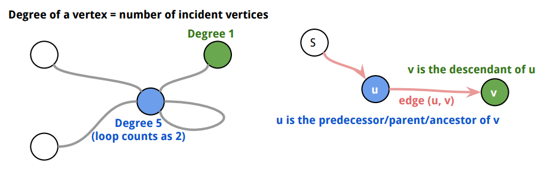
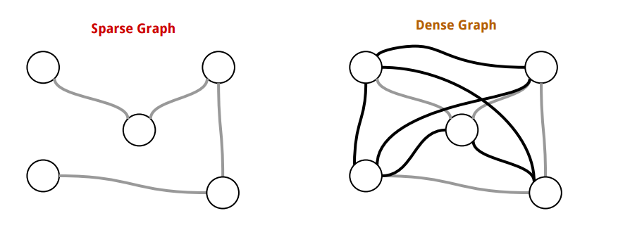
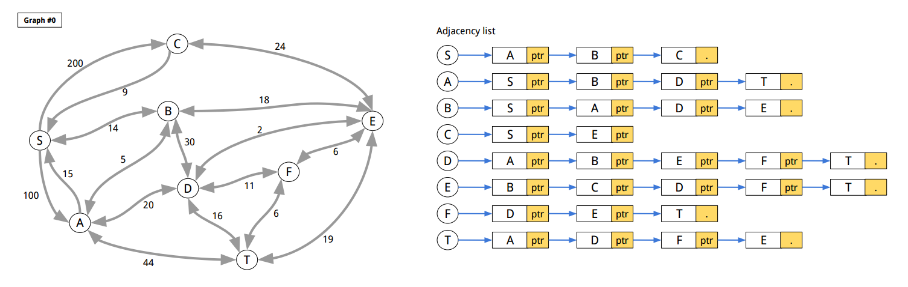
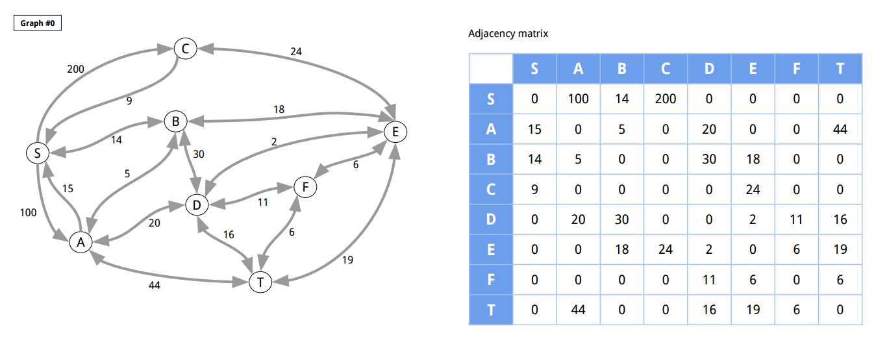
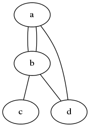
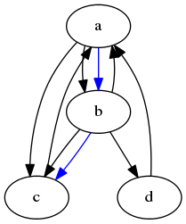
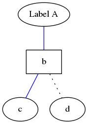
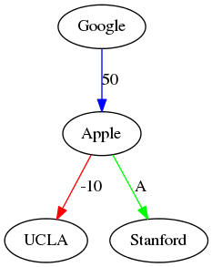
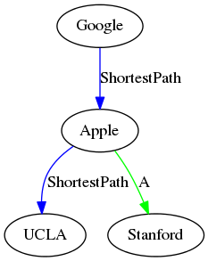

[*back to contents*](https://github.com/gyuho/learn#contents)<br>

# Go: graph, interface

- [Reference](#reference)
- [graph](#graph)
- [graph visualization with DOT](#graph-visualization-with-dot)

[↑ top](#go-graph-interface)
<br><br><br><br><hr>


#### Reference

- [Graph theory](https://en.wikipedia.org/wiki/Graph_theory)
- [Introduction to Graphs and Their Data Structures](https://www.topcoder.com/community/data-science/data-science-tutorials/introduction-to-graphs-and-their-data-structures-section-1/)
- [**My YouTube turorial Tree, Graph Theory Algorithms**](https://www.youtube.com/playlist?list=PLT6aABhFfinvsSn1H195JLuHaXNS6UVhf)
- [Graph Contraction II: Connectivity and MSTs](http://www.cs.cmu.edu/afs/cs/academic/class/15210-s12/www/lectures/lecture18.pdf)
- [Graph traversal](https://en.wikipedia.org/wiki/Graph_traversal)
- [**github.com/gyuho/goraph**](https://github.com/gyuho/goraph)

[↑ top](#go-graph-interface)
<br><br><br><br><hr>


#### graph

Graph is a fundamental data structure in computer science, widely used
in network and database systems. Let a graph be
`G = (V, E)`, where `V` is vertex(node) and `E` is edge between
vertices(nodes). `|V|` is the number of nodes in `G`, also called *order*
or *size* of a graph. `|E|` is the number of edges.



<br>

- `G` is [**sparse**](http://stackoverflow.com/questions/12599143/what-is-the-distinction-between-sparse-and-dense-graphs)
  when `|E|` is close to the minimum `|E|`.
- `G` is [**dense**](https://en.wikipedia.org/wiki/Dense_graph)
  when `|E|` is close to the maximum `|E|`.



<br>

Tree is also a graph. `G` is a **tree** iff:
- `|E| = |V| - 1`.
- `G` is acyclic.
- `G` is connected.
- Adding any `E` creates a cycle in `G`.
- `G` has only one path between a pair of vertices.

<br>

Graphs can be represented in many different ways:
- [**Adjacency list**](https://en.wikipedia.org/wiki/Adjacency_list),
  with a list of vertices, where each describes its neighboring vertices.
  **Adjacency list** is good for *sparse graphs* with fast iteration.
- [**Adjacency matrix**](https://en.wikipedia.org/wiki/Adjacency_matrix),
  to represent `G` in a `|V| x |V|` matrix.
  **Adjacency matrix** is good for *dense graphs* with fast lookup.




<br>

[My initial implementation](https://github.com/gyuho/goraph/pull/49)
used Go `struct`:

```go
type Graph struct {
	sync.Mutex

	// NodeMap is a hash-map for all Nodes in the graph.
	NodeMap map[*Node]bool

	// maintain nodeID in order not to have duplicate Node IDs in the graph.
	nodeID map[string]bool
}


// Node is a Node(node) in Graph.
type Node struct {

	// ID of Node is assumed to be unique among Nodes.
	ID string

	// Color is used for graph traversal.
	Color string

	sync.Mutex

	// WeightTo maps its Node to outgoing Nodes with its edge weight (outgoing edges from its Node).
	WeightTo map[*Node]float32

	// WeightFrom maps its Node to incoming Nodes with its edge weight (incoming edges to its Node).
	WeightFrom map[*Node]float32
}


// Edge connects from Src to Dst with weight.
type Edge struct {
	Src    *Node
	Dst    *Node
	Weight float32
}

```

<br>

There's nothing wrong about using `struct`, especially when you already
know types of data you would use. But it's not as generic as package
[`container/heap`](http://golang.org/pkg/container/heap/).
I want `interface` in order to allow any Go data types as long as they
satisfies my `interface`s. First, we need to define what methods we need
for graph operations. For example, `container/heap` interface:

```go
type Interface interface {
	sort.Interface
	Push(x interface{}) // add x as element Len()
	Pop() interface{}   // remove and return element Len() - 1.
}
```

<br>

`interface` might not be a good idea, but let's see how it goes:

**Graph**:
- Get all vertices in a graph.
- Find if a vertex exists in a graph or not.
- Add a vertex to a graph.
- Delete a vertex from a graph.
- Add an edge between two vertices.
- Replace an edge between two vertices.
- Delete an edge between two vertices.
- Get the weight value between vertices.
- Get the parent vertices of an argument vertex.
- Get the child vertices of an argument vertex.

<br>

And here's Go implementation of graphs:

```go
package main

import (
	"bytes"
	"encoding/json"
	"fmt"
	"io"
	"os"
	"sync"
)

func main() {
	f, err := os.Open("graph.json")
	if err != nil {
		panic(err)
	}
	defer f.Close()
	g, err := NewGraphFromJSON(f, "graph_00")
	if err != nil {
		panic(err)
	}
	fmt.Println(g.String())
	/*
		B -- 18.000 -→ E
		B -- 14.000 -→ S
		B -- 5.000 -→ A
		B -- 30.000 -→ D
		C -- 24.000 -→ E
		C -- 9.000 -→ S
		T -- 16.000 -→ D
		T -- 6.000 -→ F
		T -- 19.000 -→ E
		T -- 44.000 -→ A
		D -- 20.000 -→ A
		D -- 30.000 -→ B
		D -- 2.000 -→ E
		D -- 11.000 -→ F
		D -- 16.000 -→ T
		F -- 11.000 -→ D
		F -- 6.000 -→ E
		F -- 6.000 -→ T
		E -- 19.000 -→ T
		E -- 18.000 -→ B
		E -- 24.000 -→ C
		E -- 2.000 -→ D
		E -- 6.000 -→ F
		A -- 15.000 -→ S
		A -- 5.000 -→ B
		A -- 20.000 -→ D
		A -- 44.000 -→ T
		S -- 100.000 -→ A
		S -- 14.000 -→ B
		S -- 200.000 -→ C
	*/
}

// ID is unique identifier.
type ID interface {
	// String returns the string ID.
	String() string
}

type StringID string

func (s StringID) String() string {
	return string(s)
}

// Node is vertex. The ID must be unique within the graph.
type Node interface {
	// ID returns the ID.
	ID() ID
	String() string
}

type node struct {
	id string
}

var nodeCnt uint64

func NewNode(id string) Node {
	return &node{
		id: id,
	}
}

func (n *node) ID() ID {
	return StringID(n.id)
}

func (n *node) String() string {
	return n.id
}

// Edge connects between two Nodes.
type Edge interface {
	Source() Node
	Target() Node
	Weight() float64
	String() string
}

// edge is an Edge from Source to Target.
type edge struct {
	src Node
	tgt Node
	wgt float64
}

func NewEdge(src, tgt Node, wgt float64) Edge {
	return &edge{
		src: src,
		tgt: tgt,
		wgt: wgt,
	}
}

func (e *edge) Source() Node {
	return e.src
}

func (e *edge) Target() Node {
	return e.tgt
}

func (e *edge) Weight() float64 {
	return e.wgt
}

func (e *edge) String() string {
	return fmt.Sprintf("%s -- %.3f -→ %s\n", e.src, e.wgt, e.tgt)
}

type EdgeSlice []Edge

func (e EdgeSlice) Len() int           { return len(e) }
func (e EdgeSlice) Less(i, j int) bool { return e[i].Weight() < e[j].Weight() }
func (e EdgeSlice) Swap(i, j int)      { e[i], e[j] = e[j], e[i] }

// Graph describes the methods of graph operations.
// It assumes that the identifier of a Node is unique.
// And weight values is float64.
type Graph interface {
	// Init initializes a Graph.
	Init()

	// GetNodeCount returns the total number of nodes.
	GetNodeCount() int

	// GetNode finds the Node. It returns nil if the Node
	// does not exist in the graph.
	GetNode(id ID) Node

	// GetNodes returns a map from node ID to
	// empty struct value. Graph does not allow duplicate
	// node ID or name.
	GetNodes() map[ID]Node

	// AddNode adds a node to a graph, and returns false
	// if the node already existed in the graph.
	AddNode(nd Node) bool

	// DeleteNode deletes a node from a graph.
	// It returns true if it got deleted.
	// And false if it didn't get deleted.
	DeleteNode(id ID) bool

	// AddEdge adds an edge from nd1 to nd2 with the weight.
	// It returns error if a node does not exist.
	AddEdge(id1, id2 ID, weight float64) error

	// ReplaceEdge replaces an edge from id1 to id2 with the weight.
	ReplaceEdge(id1, id2 ID, weight float64) error

	// DeleteEdge deletes an edge from id1 to id2.
	DeleteEdge(id1, id2 ID) error

	// GetWeight returns the weight from id1 to id2.
	GetWeight(id1, id2 ID) (float64, error)

	// GetSources returns the map of parent Nodes.
	// (Nodes that come towards the argument vertex.)
	GetSources(id ID) (map[ID]Node, error)

	// GetTargets returns the map of child Nodes.
	// (Nodes that go out of the argument vertex.)
	GetTargets(id ID) (map[ID]Node, error)

	// String describes the Graph.
	String() string
}

// graph is an internal default graph type that
// implements all methods in Graph interface.
type graph struct {
	mu sync.RWMutex // guards the following

	// idToNodes stores all nodes.
	idToNodes map[ID]Node

	// nodeToSources maps a Node identifer to sources(parents) with edge weights.
	nodeToSources map[ID]map[ID]float64

	// nodeToTargets maps a Node identifer to targets(children) with edge weights.
	nodeToTargets map[ID]map[ID]float64
}

// newGraph returns a new graph.
func newGraph() *graph {
	return &graph{
		idToNodes:     make(map[ID]Node),
		nodeToSources: make(map[ID]map[ID]float64),
		nodeToTargets: make(map[ID]map[ID]float64),
		//
		// without this
		// panic: assignment to entry in nil map
	}
}

// NewGraph returns a new graph.
func NewGraph() Graph {
	return newGraph()
}

func (g *graph) Init() {
	// (X) g = newGraph()
	// this only updates the pointer
	//
	//
	// (X) *g = *newGraph()
	// assignment copies lock value

	g.idToNodes = make(map[ID]Node)
	g.nodeToSources = make(map[ID]map[ID]float64)
	g.nodeToTargets = make(map[ID]map[ID]float64)
}

func (g *graph) GetNodeCount() int {
	g.mu.RLock()
	defer g.mu.RUnlock()

	return len(g.idToNodes)
}

func (g *graph) GetNode(id ID) Node {
	g.mu.RLock()
	defer g.mu.RUnlock()

	return g.idToNodes[id]
}

func (g *graph) GetNodes() map[ID]Node {
	g.mu.RLock()
	defer g.mu.RUnlock()

	return g.idToNodes
}

func (g *graph) unsafeExistID(id ID) bool {
	_, ok := g.idToNodes[id]
	return ok
}

func (g *graph) AddNode(nd Node) bool {
	g.mu.Lock()
	defer g.mu.Unlock()

	if g.unsafeExistID(nd.ID()) {
		return false
	}

	id := nd.ID()
	g.idToNodes[id] = nd
	return true
}

func (g *graph) DeleteNode(id ID) bool {
	g.mu.Lock()
	defer g.mu.Unlock()

	if !g.unsafeExistID(id) {
		return false
	}

	delete(g.idToNodes, id)

	delete(g.nodeToTargets, id)
	for _, smap := range g.nodeToTargets {
		delete(smap, id)
	}

	delete(g.nodeToSources, id)
	for _, smap := range g.nodeToSources {
		delete(smap, id)
	}

	return true
}

func (g *graph) AddEdge(id1, id2 ID, weight float64) error {
	g.mu.Lock()
	defer g.mu.Unlock()

	if !g.unsafeExistID(id1) {
		return fmt.Errorf("%s does not exist in the graph.", id1)
	}
	if !g.unsafeExistID(id2) {
		return fmt.Errorf("%s does not exist in the graph.", id2)
	}

	if _, ok := g.nodeToTargets[id1]; ok {
		if v, ok2 := g.nodeToTargets[id1][id2]; ok2 {
			g.nodeToTargets[id1][id2] = v + weight
		} else {
			g.nodeToTargets[id1][id2] = weight
		}
	} else {
		tmap := make(map[ID]float64)
		tmap[id2] = weight
		g.nodeToTargets[id1] = tmap
	}
	if _, ok := g.nodeToSources[id2]; ok {
		if v, ok2 := g.nodeToSources[id2][id1]; ok2 {
			g.nodeToSources[id2][id1] = v + weight
		} else {
			g.nodeToSources[id2][id1] = weight
		}
	} else {
		tmap := make(map[ID]float64)
		tmap[id1] = weight
		g.nodeToSources[id2] = tmap
	}

	return nil
}

func (g *graph) ReplaceEdge(id1, id2 ID, weight float64) error {
	g.mu.Lock()
	defer g.mu.Unlock()

	if !g.unsafeExistID(id1) {
		return fmt.Errorf("%s does not exist in the graph.", id1)
	}
	if !g.unsafeExistID(id2) {
		return fmt.Errorf("%s does not exist in the graph.", id2)
	}

	if _, ok := g.nodeToTargets[id1]; ok {
		g.nodeToTargets[id1][id2] = weight
	} else {
		tmap := make(map[ID]float64)
		tmap[id2] = weight
		g.nodeToTargets[id1] = tmap
	}
	if _, ok := g.nodeToSources[id2]; ok {
		g.nodeToSources[id2][id1] = weight
	} else {
		tmap := make(map[ID]float64)
		tmap[id1] = weight
		g.nodeToSources[id2] = tmap
	}
	return nil
}

func (g *graph) DeleteEdge(id1, id2 ID) error {
	g.mu.Lock()
	defer g.mu.Unlock()

	if !g.unsafeExistID(id1) {
		return fmt.Errorf("%s does not exist in the graph.", id1)
	}
	if !g.unsafeExistID(id2) {
		return fmt.Errorf("%s does not exist in the graph.", id2)
	}

	if _, ok := g.nodeToTargets[id1]; ok {
		if _, ok := g.nodeToTargets[id1][id2]; ok {
			delete(g.nodeToTargets[id1], id2)
		}
	}
	if _, ok := g.nodeToSources[id2]; ok {
		if _, ok := g.nodeToSources[id2][id1]; ok {
			delete(g.nodeToSources[id2], id1)
		}
	}
	return nil
}

func (g *graph) GetWeight(id1, id2 ID) (float64, error) {
	g.mu.RLock()
	defer g.mu.RUnlock()

	if !g.unsafeExistID(id1) {
		return 0, fmt.Errorf("%s does not exist in the graph.", id1)
	}
	if !g.unsafeExistID(id2) {
		return 0, fmt.Errorf("%s does not exist in the graph.", id2)
	}

	if _, ok := g.nodeToTargets[id1]; ok {
		if v, ok := g.nodeToTargets[id1][id2]; ok {
			return v, nil
		}
	}
	return 0.0, fmt.Errorf("there is no edge from %s to %s", id1, id2)
}

func (g *graph) GetSources(id ID) (map[ID]Node, error) {
	g.mu.RLock()
	defer g.mu.RUnlock()

	if !g.unsafeExistID(id) {
		return nil, fmt.Errorf("%s does not exist in the graph.", id)
	}

	rs := make(map[ID]Node)
	if _, ok := g.nodeToSources[id]; ok {
		for n := range g.nodeToSources[id] {
			rs[n] = g.idToNodes[n]
		}
	}
	return rs, nil
}

func (g *graph) GetTargets(id ID) (map[ID]Node, error) {
	g.mu.RLock()
	defer g.mu.RUnlock()

	if !g.unsafeExistID(id) {
		return nil, fmt.Errorf("%s does not exist in the graph.", id)
	}

	rs := make(map[ID]Node)
	if _, ok := g.nodeToTargets[id]; ok {
		for n := range g.nodeToTargets[id] {
			rs[n] = g.idToNodes[n]
		}
	}
	return rs, nil
}

func (g *graph) String() string {
	g.mu.RLock()
	defer g.mu.RUnlock()

	buf := new(bytes.Buffer)
	for id1, nd1 := range g.idToNodes {
		nmap, _ := g.GetTargets(id1)
		for id2, nd2 := range nmap {
			weight, _ := g.GetWeight(id1, id2)
			fmt.Fprintf(buf, "%s -- %.3f -→ %s\n", nd1, weight, nd2)
		}
	}
	return buf.String()
}

// NewGraphFromJSON returns a new Graph from a JSON file.
// Here's the sample JSON data:
//
//	{
//	    "graph_00": {
//	        "S": {
//	            "A": 100,
//	            "B": 14,
//	            "C": 200
//	        },
//	        "A": {
//	            "S": 15,
//	            "B": 5,
//	            "D": 20,
//	            "T": 44
//	        },
//	        "B": {
//	            "S": 14,
//	            "A": 5,
//	            "D": 30,
//	            "E": 18
//	        },
//	        "C": {
//	            "S": 9,
//	            "E": 24
//	        },
//	        "D": {
//	            "A": 20,
//	            "B": 30,
//	            "E": 2,
//	            "F": 11,
//	            "T": 16
//	        },
//	        "E": {
//	            "B": 18,
//	            "C": 24,
//	            "D": 2,
//	            "F": 6,
//	            "T": 19
//	        },
//	        "F": {
//	            "D": 11,
//	            "E": 6,
//	            "T": 6
//	        },
//	        "T": {
//	            "A": 44,
//	            "D": 16,
//	            "F": 6,
//	            "E": 19
//	        }
//	    },
//	}
//
func NewGraphFromJSON(rd io.Reader, graphID string) (Graph, error) {
	js := make(map[string]map[string]map[string]float64)
	dec := json.NewDecoder(rd)
	for {
		if err := dec.Decode(&js); err == io.EOF {
			break
		} else if err != nil {
			return nil, err
		}
	}
	if _, ok := js[graphID]; !ok {
		return nil, fmt.Errorf("%s does not exist", graphID)
	}
	gmap := js[graphID]

	g := newGraph()
	for id1, mm := range gmap {
		nd1 := g.GetNode(StringID(id1))
		if nd1 == nil {
			nd1 = NewNode(id1)
			if ok := g.AddNode(nd1); !ok {
				return nil, fmt.Errorf("%s already exists", nd1)
			}
		}
		for id2, weight := range mm {
			nd2 := g.GetNode(StringID(id2))
			if nd2 == nil {
				nd2 = NewNode(id2)
				if ok := g.AddNode(nd2); !ok {
					return nil, fmt.Errorf("%s already exists", nd2)
				}
			}
			g.ReplaceEdge(nd1.ID(), nd2.ID(), weight)
		}
	}

	return g, nil
}

```

[↑ top](#go-graph-interface)
<br><br><br><br><hr>


#### graph visualization with DOT

`DOT` is a graph description language for [Graphviz](http://www.graphviz.org).
It is a simple way of describing graphs that both humans and computer
programs can use. `DOT` files typically have `.gv` (or `.dot`) extensions.

<br>

`sudo apt-get -y install graphviz` and save this file:

```go
// The graph name and the semicolons are optional
graph MyGraph {
	a -- b -- c;
	b -- d;
}

```

<br>

And compile:

```
dot -Tpng sample.dot -o sample.png;
dot -Tpdf sample.dot -o sample.pdf;
``` 

<br>

Output:


<br>
<br>

Here's are more examples:

<br>

###### undirected graph

```go
// The graph name and the semicolons are optional
graph graphname {
	a -- b -- c;
	b -- a;
	d -- a;
	b -- d;
}

```



<br>

###### directed graph

```go
digraph graphname {
	a -> b -> c;
	a -> b -> c [color=blue];
	b -> a;
	b -> d;
	d -> a;
	c -> a -> c;
}

```



<br>
<br>

###### attributes

```go
graph graphname {
	// The label attribute can be used to change the label of a node
	a [label="Label A"];

	// Here, the node shape is changed.
	b [shape=box];

	// These edges both have different line properties
	// Set line color as blue
	a -- b -- c [color=blue];

	// Set line style as dotted
	b -- d [style=dotted];
}

```



<br>
<br>

###### label

```go
digraph graphname {
	a [label="Google"]
	b [label="Apple"]
	c [label="UCLA"]
	d [label="Stanford"]
	a -> b [label=50, color=blue];
	b -> c [label=-10, color=red];
	b -> d [label="A", color=green];
}

```



<br>
<br>

```go
digraph graphname {
	Google -> Apple [label=50, color=blue];
	Apple -> UCLA [label=-10, color=red];
	Apple -> Stanford [label="A", color=green];
}

```


<br>
<br>

```go
digraph graphname {
	Google -> Apple -> UCLA [label=ShortestPath, color=blue];
	Apple -> Stanford [label="A", color=green];
}

```



[↑ top](#go-graph-interface)
<br><br><br><br><hr>
