[*back to contents*](https://github.com/gyuho/learn#contents)<br>

# Go: graph, minimum spanning tree

- [Reference](#reference)
- [Kruskal algorithm](#kruskal-algorithm)
- [Prim algorithm](#prim-algorithm)

[↑ top](#go-graph-minimum-spanning-tree)
<br><br><br><br><hr>


#### Reference

- [Disjoint-set data structure](https://en.wikipedia.org/wiki/Disjoint-set_data_structure)
- [Kruskal's algorithm](http://en.wikipedia.org/wiki/Kruskal%27s_algorithm)
- [Prim's algorithm](https://en.wikipedia.org/wiki/Prim%27s_algorithm)
- [**github.com/gyuho/goraph**](https://github.com/gyuho/goraph)

[↑ top](#go-graph-minimum-spanning-tree)
<br><br><br><br><hr>


#### Kruskal algorithm

> Kruskal's algorithm is a minimum-spanning-tree algorithm
> which finds an edge of the least possible weight that
> connects any two trees in the forest.It is a greedy algorithm
> in graph theory as it finds a minimum spanning tree for a connected
> weighted graph adding increasing cost arcs at each step. This means
> it finds a subset of the edges that forms a tree that includes every
> vertex, where the total weight of all the edges in the tree is minimized.
>
> [*Kruskal's algorithm*](http://en.wikipedia.org/wiki/Kruskal%27s_algorithm)
> *by Wikipedia*

```
 0. Kruskal(G)
 1.
 2. 	A = ∅
 3.
 4. 	for each vertex v in G:
 5. 		MakeDisjointSet(v)
 6.
 7. 	edges = get all edges
 8. 	sort edges in ascending order of weight
 9.
10. 	for each edge (u, v) in edges:
11. 		if FindSet(u) ≠ FindSet(v):
12. 			A = A ∪ {(u, v)}
13. 			Union(u, v)
14.
15. 	return A
```

<br>
Here's how it works:

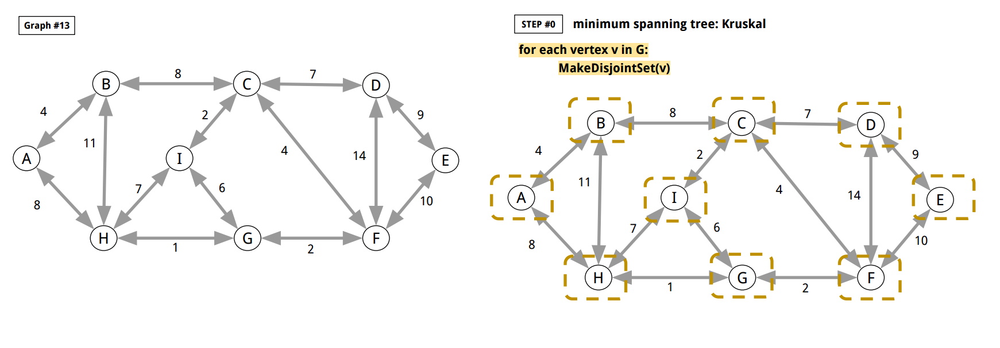
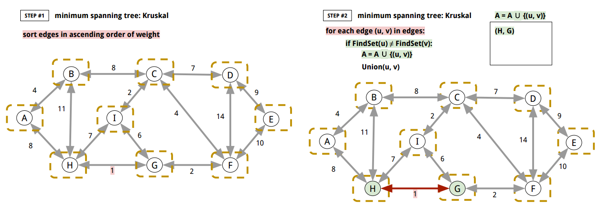
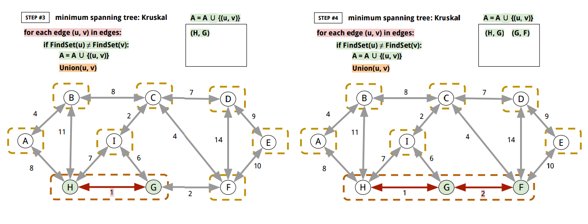
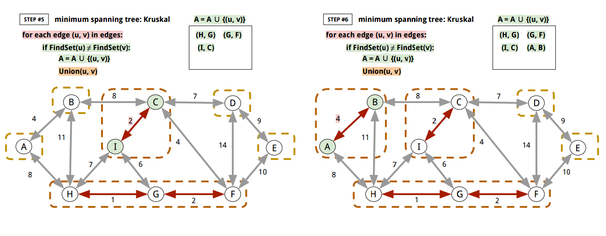
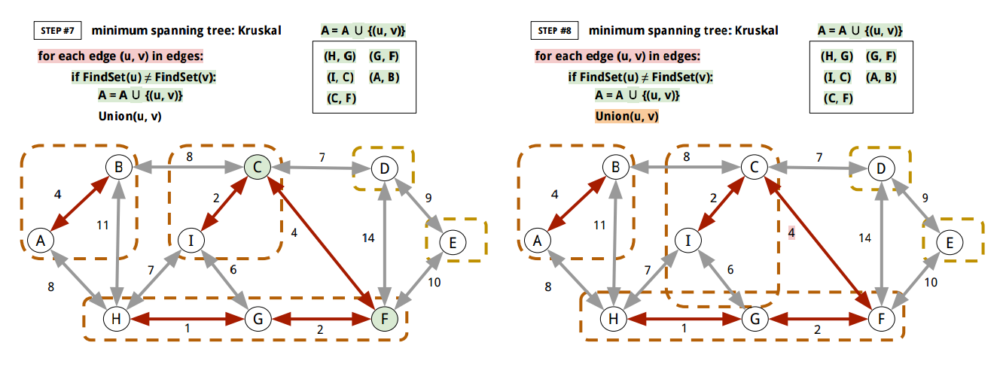
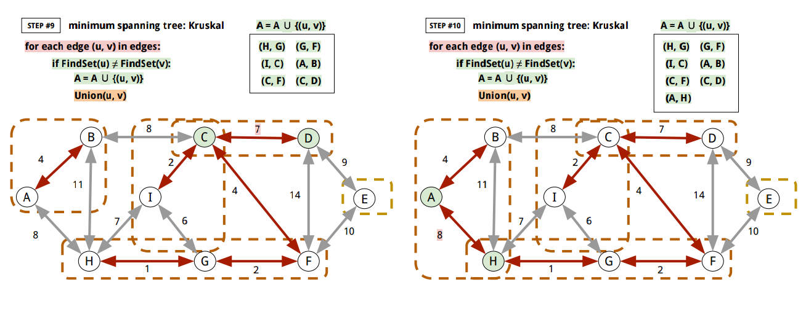
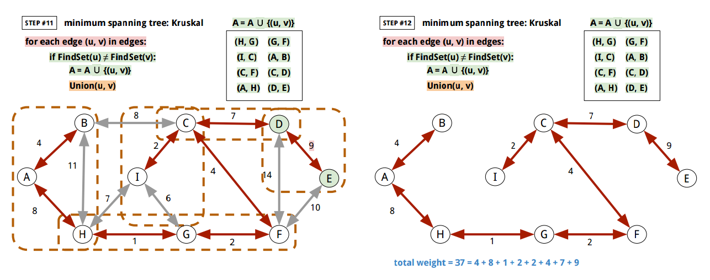

<br>
Here's Go implementation:

```go
package main

import (
	"bytes"
	"encoding/json"
	"fmt"
	"io"
	"log"
	"os"
	"sort"
	"sync"
)

// DisjointSet implements disjoint set.
// (https://en.wikipedia.org/wiki/Disjoint-set_data_structure)
type DisjointSet struct {
	represent string
	member    map[string]struct{}
}

// Forests is a set of DisjointSet.
type Forests struct {
	mu   sync.Mutex // guards the following
	data map[*DisjointSet]struct{}
}

// NewForests creates a new Forests.
func NewForests() *Forests {
	set := &Forests{}
	set.data = make(map[*DisjointSet]struct{})
	return set
}

// MakeDisjointSet creates a DisjointSet.
func MakeDisjointSet(forests *Forests, vtx string) {
	newDS := &DisjointSet{}
	newDS.represent = vtx
	member := make(map[string]struct{})
	member[vtx] = struct{}{}
	newDS.member = member
	forests.mu.Lock()
	defer forests.mu.Unlock()
	forests.data[newDS] = struct{}{}
}

// FindSet returns the DisjointSet with the represent u.
func FindSet(forests *Forests, u string) *DisjointSet {
	forests.mu.Lock()
	defer forests.mu.Unlock()
	for data := range forests.data {
		if data.represent == u {
			return data
		}
		for k := range data.member {
			if k == u {
				return data
			}
		}
	}
	return nil
}

// Union unions two DisjointSet, with ds1's represent.
func Union(forests *Forests, ds1, ds2 *DisjointSet) {
	newDS := &DisjointSet{}
	newDS.represent = ds1.represent
	newDS.member = ds1.member
	for k := range ds2.member {
		newDS.member[k] = struct{}{}
	}
	forests.mu.Lock()
	defer forests.mu.Unlock()
	forests.data[newDS] = struct{}{}
	delete(forests.data, ds1)
	delete(forests.data, ds2)
}

// Edge is an Edge from Source to Target.
type Edge struct {
	Source string
	Target string
	Weight float64
}

type EdgeSlice []Edge

func (e EdgeSlice) Len() int           { return len(e) }
func (e EdgeSlice) Less(i, j int) bool { return e[i].Weight < e[j].Weight }
func (e EdgeSlice) Swap(i, j int)      { e[i], e[j] = e[j], e[i] }

// Kruskal finds the minimum spanning tree with disjoint-set data structure.
// (http://en.wikipedia.org/wiki/Kruskal%27s_algorithm)
//
//	 0. Kruskal(G)
//	 1.
//	 2. 	A = ∅
//	 3.
//	 4. 	for each vertex v in G:
//	 5. 		MakeDisjointSet(v)
//	 6.
//	 7. 	edges = get all edges
//	 8. 	sort edges in ascending order of weight
//	 9.
//	10. 	for each edge (u, v) in edges:
//	11. 		if FindSet(u) ≠ FindSet(v):
//	12. 			A = A ∪ {(u, v)}
//	13. 			Union(u, v)
//	14.
//	15. 	return A
//
func Kruskal(g Graph) map[Edge]struct{} {

	// A = ∅
	A := make(map[Edge]struct{})

	// disjointSet maps a member Vertex to a represent.
	// (https://en.wikipedia.org/wiki/Disjoint-set_data_structure)
	forests := NewForests()

	// for each vertex v in G:
	for v := range g.GetVertices() {
		// MakeDisjointSet(v)
		MakeDisjointSet(forests, v)
	}

	// edges = get all edges
	edges := []Edge{}
	foundEdge := make(map[string]struct{})
	for vtx := range g.GetVertices() {
		cmap, err := g.GetChildren(vtx)
		if err != nil {
			panic(err)
		}
		for c := range cmap {
			// edge (vtx, c)
			weight, err := g.GetWeight(vtx, c)
			if err != nil {
				panic(err)
			}
			edge := Edge{}
			edge.Source = vtx
			edge.Target = c
			edge.Weight = weight
			if _, ok := foundEdge[fmt.Sprintf("%+v", edge)]; !ok {
				edges = append(edges, edge)
				foundEdge[fmt.Sprintf("%+v", edge)] = struct{}{}
			}
		}

		pmap, err := g.GetParents(vtx)
		if err != nil {
			panic(err)
		}
		for p := range pmap {
			// edge (p, vtx)
			weight, err := g.GetWeight(p, vtx)
			if err != nil {
				panic(err)
			}
			edge := Edge{}
			edge.Source = p
			edge.Target = vtx
			edge.Weight = weight
			if _, ok := foundEdge[fmt.Sprintf("%+v", edge)]; !ok {
				edges = append(edges, edge)
				foundEdge[fmt.Sprintf("%+v", edge)] = struct{}{}
			}
		}
	}

	// sort edges in ascending order of weight
	sort.Sort(EdgeSlice(edges))

	// for each edge (u, v) in edges:
	for _, edge := range edges {
		// if FindSet(u) ≠ FindSet(v):
		if FindSet(forests, edge.Source).represent != FindSet(forests, edge.Target).represent {

			// A = A ∪ {(u, v)}
			A[edge] = struct{}{}

			// Union(u, v)
			// overwrite v's represent with u's represent
			Union(forests, FindSet(forests, edge.Source), FindSet(forests, edge.Target))
		}
	}

	return A
}

func main() {
	f, err := os.Open("graph.json")
	if err != nil {
		panic(err)
	}
	defer f.Close()
	g, err := NewDefaultGraphFromJSON(f, "graph_13")
	if err != nil {
		panic(err)
	}
	A := Kruskal(g)
	total := 0.0
	for edge := range A {
		total += edge.Weight
	}
	if total != 37.0 {
		log.Fatalf("Expected total 37.0 but %.2f", total)
	}
	fmt.Println("Kruskal from graph_13:", A)
	// Kruskal from graph_13: map[{F C 4}:true {B A 4}:true {D C 7}:true {B C 8}:true {E D 9}:true {G H 1}:true {F G 2}:true {C I 2}:true]
}

// Graph describes the methods of graph operations.
// It assumes that the identifier of a Vertex is string and unique.
// And weight values is float64.
type Graph interface {
	// Init initializes a Graph.
	Init()

	// GetVertices returns a map from vertex ID to
	// empty struct value. Graph does not allow duplicate
	// vertex ID.
	GetVertices() map[string]struct{}

	// FindVertex returns true if the vertex already
	// exists in the graph.
	FindVertex(vtx string) bool

	// AddVertex adds a vertex to a graph, and returns false
	// if the vertex already existed in the graph.
	AddVertex(vtx string) bool

	// DeleteVertex deletes a vertex from a graph.
	// It returns true if it got deleted.
	// And false if it didn't get deleted.
	DeleteVertex(vtx string) bool

	// AddEdge adds an edge from vtx1 to vtx2 with the weight.
	AddEdge(vtx1, vtx2 string, weight float64) error

	// ReplaceEdge replaces an edge from vtx1 to vtx2 with the weight.
	ReplaceEdge(vtx1, vtx2 string, weight float64) error

	// DeleteEdge deletes an edge from vtx1 to vtx2.
	DeleteEdge(vtx1, vtx2 string) error

	// GetWeight returns the weight from vtx1 to vtx2.
	GetWeight(vtx1, vtx2 string) (float64, error)

	// GetParents returns the map of parent vertices.
	// (Vertices that come towards the argument vertex.)
	GetParents(vtx string) (map[string]struct{}, error)

	// GetChildren returns the map of child vertices.
	// (Vertices that go out of the argument vertex.)
	GetChildren(vtx string) (map[string]struct{}, error)

	// String describes the Graph.
	String() string
}

// defaultGraph is an internal default graph type that
// implements all methods in Graph interface.
type defaultGraph struct {
	mu sync.Mutex // guards the following

	// Vertices stores all vertices.
	Vertices map[string]struct{}

	// VertexToChildren maps a Vertex identifer to children with edge weights.
	VertexToChildren map[string]map[string]float64

	// VertexToParents maps a Vertex identifer to parents with edge weights.
	VertexToParents map[string]map[string]float64
}

// newDefaultGraph returns a new defaultGraph.
func newDefaultGraph() *defaultGraph {
	return &defaultGraph{
		Vertices:         make(map[string]struct{}),
		VertexToChildren: make(map[string]map[string]float64),
		VertexToParents:  make(map[string]map[string]float64),
		//
		// without this
		// panic: assignment to entry in nil map
	}
}

// NewDefaultGraph returns a new defaultGraph.
func NewDefaultGraph() Graph {
	return newDefaultGraph()
}

// newDefaultGraphFromJSON creates a graph Data from JSON.
// Here's the sample JSON data:
//
//	{
//	    "graph_00": {
//	        "S": {
//	            "A": 100,
//	            "B": 14,
//	            "C": 200
//	        },
//	        "A": {
//	            "S": 15,
//	            "B": 5,
//	            "D": 20,
//	            "T": 44
//	        },
//	        "B": {
//	            "S": 14,
//	            "A": 5,
//	            "D": 30,
//	            "E": 18
//	        },
//	        "C": {
//	            "S": 9,
//	            "E": 24
//	        },
//	        "D": {
//	            "A": 20,
//	            "B": 30,
//	            "E": 2,
//	            "F": 11,
//	            "T": 16
//	        },
//	        "E": {
//	            "B": 18,
//	            "C": 24,
//	            "D": 2,
//	            "F": 6,
//	            "T": 19
//	        },
//	        "F": {
//	            "D": 11,
//	            "E": 6,
//	            "T": 6
//	        },
//	        "T": {
//	            "A": 44,
//	            "D": 16,
//	            "F": 6,
//	            "E": 19
//	        }
//	    },
//	}
//
func newDefaultGraphFromJSON(rd io.Reader, graphID string) (*defaultGraph, error) {
	js := make(map[string]map[string]map[string]float64)
	dec := json.NewDecoder(rd)
	for {
		if err := dec.Decode(&js); err == io.EOF {
			break
		} else if err != nil {
			return nil, err
		}
	}
	if _, ok := js[graphID]; !ok {
		return nil, fmt.Errorf("%s does not exist", graphID)
	}
	gmap := js[graphID]
	g := newDefaultGraph()
	for vtx1, mm := range gmap {
		if !g.FindVertex(vtx1) {
			g.AddVertex(vtx1)
		}
		for vtx2, weight := range mm {
			if !g.FindVertex(vtx2) {
				g.AddVertex(vtx2)
			}
			g.ReplaceEdge(vtx1, vtx2, weight)
		}
	}
	return g, nil
}

// NewDefaultGraphFromJSON returns a new defaultGraph from a JSON file.
func NewDefaultGraphFromJSON(rd io.Reader, graphID string) (Graph, error) {
	return newDefaultGraphFromJSON(rd, graphID)
}

func (g *defaultGraph) Init() {
	// (X) g = newDefaultGraph()
	// this only updates the pointer
	//
	*g = *newDefaultGraph()
}

func (g *defaultGraph) GetVertices() map[string]struct{} {
	g.mu.Lock()
	defer g.mu.Unlock()
	return g.Vertices
}

func (g *defaultGraph) FindVertex(vtx string) bool {
	g.mu.Lock()
	defer g.mu.Unlock()
	if _, ok := g.Vertices[vtx]; !ok {
		return false
	}
	return true
}

func (g *defaultGraph) AddVertex(vtx string) bool {
	g.mu.Lock()
	defer g.mu.Unlock()
	if _, ok := g.Vertices[vtx]; !ok {
		g.Vertices[vtx] = struct{}{}
		return true
	}
	return false
}

func (g *defaultGraph) DeleteVertex(vtx string) bool {
	g.mu.Lock()
	defer g.mu.Unlock()
	if _, ok := g.Vertices[vtx]; !ok {
		return false
	} else {
		delete(g.Vertices, vtx)
	}
	if _, ok := g.VertexToChildren[vtx]; ok {
		delete(g.VertexToChildren, vtx)
	}
	for _, smap := range g.VertexToChildren {
		if _, ok := smap[vtx]; ok {
			delete(smap, vtx)
		}
	}
	if _, ok := g.VertexToParents[vtx]; ok {
		delete(g.VertexToParents, vtx)
	}
	for _, smap := range g.VertexToParents {
		if _, ok := smap[vtx]; ok {
			delete(smap, vtx)
		}
	}
	return true
}

func (g *defaultGraph) AddEdge(vtx1, vtx2 string, weight float64) error {
	g.mu.Lock()
	defer g.mu.Unlock()
	if _, ok := g.Vertices[vtx1]; !ok {
		return fmt.Errorf("%s does not exist in the graph.", vtx1)
	}
	if _, ok := g.Vertices[vtx2]; !ok {
		return fmt.Errorf("%s does not exist in the graph.", vtx2)
	}
	if _, ok := g.VertexToChildren[vtx1]; ok {
		if v, ok2 := g.VertexToChildren[vtx1][vtx2]; ok2 {
			g.VertexToChildren[vtx1][vtx2] = v + weight
		} else {
			g.VertexToChildren[vtx1][vtx2] = weight
		}
	} else {
		tmap := make(map[string]float64)
		tmap[vtx2] = weight
		g.VertexToChildren[vtx1] = tmap
	}
	if _, ok := g.VertexToParents[vtx2]; ok {
		if v, ok2 := g.VertexToParents[vtx2][vtx1]; ok2 {
			g.VertexToParents[vtx2][vtx1] = v + weight
		} else {
			g.VertexToParents[vtx2][vtx1] = weight
		}
	} else {
		tmap := make(map[string]float64)
		tmap[vtx1] = weight
		g.VertexToParents[vtx2] = tmap
	}
	return nil
}

func (g *defaultGraph) ReplaceEdge(vtx1, vtx2 string, weight float64) error {
	g.mu.Lock()
	defer g.mu.Unlock()
	if _, ok := g.Vertices[vtx1]; !ok {
		return fmt.Errorf("%s does not exist in the graph.", vtx1)
	}
	if _, ok := g.Vertices[vtx2]; !ok {
		return fmt.Errorf("%s does not exist in the graph.", vtx2)
	}
	if _, ok := g.VertexToChildren[vtx1]; ok {
		g.VertexToChildren[vtx1][vtx2] = weight
	} else {
		tmap := make(map[string]float64)
		tmap[vtx2] = weight
		g.VertexToChildren[vtx1] = tmap
	}
	if _, ok := g.VertexToParents[vtx2]; ok {
		g.VertexToParents[vtx2][vtx1] = weight
	} else {
		tmap := make(map[string]float64)
		tmap[vtx1] = weight
		g.VertexToParents[vtx2] = tmap
	}
	return nil
}

func (g *defaultGraph) DeleteEdge(vtx1, vtx2 string) error {
	g.mu.Lock()
	defer g.mu.Unlock()
	if _, ok := g.Vertices[vtx1]; !ok {
		return fmt.Errorf("%s does not exist in the graph.", vtx1)
	}
	if _, ok := g.Vertices[vtx2]; !ok {
		return fmt.Errorf("%s does not exist in the graph.", vtx2)
	}
	if _, ok := g.VertexToChildren[vtx1]; ok {
		if _, ok := g.VertexToChildren[vtx1][vtx2]; ok {
			delete(g.VertexToChildren[vtx1], vtx2)
		}
	}
	if _, ok := g.VertexToParents[vtx2]; ok {
		if _, ok := g.VertexToParents[vtx2][vtx1]; ok {
			delete(g.VertexToParents[vtx2], vtx1)
		}
	}
	return nil
}

func (g *defaultGraph) GetWeight(vtx1, vtx2 string) (float64, error) {
	g.mu.Lock()
	defer g.mu.Unlock()
	if _, ok := g.Vertices[vtx1]; !ok {
		return 0.0, fmt.Errorf("%s does not exist in the graph.", vtx1)
	}
	if _, ok := g.Vertices[vtx2]; !ok {
		return 0.0, fmt.Errorf("%s does not exist in the graph.", vtx2)
	}
	if _, ok := g.VertexToChildren[vtx1]; ok {
		if v, ok := g.VertexToChildren[vtx1][vtx2]; ok {
			return v, nil
		}
	}
	return 0.0, fmt.Errorf("there is not edge from %s to %s", vtx1, vtx2)
}

func (g *defaultGraph) GetParents(vtx string) (map[string]struct{}, error) {
	g.mu.Lock()
	defer g.mu.Unlock()
	if _, ok := g.Vertices[vtx]; !ok {
		return nil, fmt.Errorf("%s does not exist in the graph.", vtx)
	}
	rs := make(map[string]struct{})
	if _, ok := g.VertexToParents[vtx]; ok {
		for k := range g.VertexToParents[vtx] {
			rs[k] = struct{}{}
		}
	}
	return rs, nil
}

func (g *defaultGraph) GetChildren(vtx string) (map[string]struct{}, error) {
	g.mu.Lock()
	defer g.mu.Unlock()
	if _, ok := g.Vertices[vtx]; !ok {
		return nil, fmt.Errorf("%s does not exist in the graph.", vtx)
	}
	rs := make(map[string]struct{})
	if _, ok := g.VertexToChildren[vtx]; ok {
		for k := range g.VertexToChildren[vtx] {
			rs[k] = struct{}{}
		}
	}
	return rs, nil
}

func (g *defaultGraph) String() string {
	buf := new(bytes.Buffer)
	for vtx1 := range g.Vertices {
		cmap, _ := g.GetChildren(vtx1)
		for vtx2 := range cmap {
			weight, _ := g.GetWeight(vtx1, vtx2)
			fmt.Fprintf(buf, "%s -- %.3f --> %s\n", vtx1, weight, vtx2)
		}
	}
	return buf.String()
}

```

[↑ top](#go-graph-minimum-spanning-tree)
<br><br><br><br><hr>


#### Prim algorithm

> In computer science, Prim's algorithm is a greedy algorithm that
> finds a minimum spanning tree for a weighted undirected graph.
> This means it finds a subset of the edges that forms a tree that
> includes every vertex, where the total weight of all the edges in
> the tree is minimized. The algorithm operates by building this tree
> one vertex at a time, from an arbitrary starting vertex, at each
> step adding the cheapest possible connection from the tree to
> another vertex.
>
> [*Prim's algorithm*](https://en.wikipedia.org/wiki/Prim%27s_algorithm)
> *by Wikipedia*

```
 0. Prim(G, source)
 1.
 2. 	let Q be a priority queue
 3. 	distance[source] = 0
 4.
 5. 	for each vertex v in G:
 6.
 7. 		if v ≠ source:
 8. 			distance[v] = ∞
 9. 			prev[v] = undefined
10.
11. 		Q.add_with_priority(v, distance[v])
12.
13.
14. 	while Q is not empty:
15.
16. 		u = Q.extract_min()
17.
18. 		for each adjacent vertex v of u:
19.
21. 			if v ∈ Q and distance[v] > weight(u, v):
22. 				distance[v] = weight(u, v)
23. 				prev[v] = u
24. 				Q.decrease_priority(v, weight(u, v))
25.
26.
27. 	return tree from prev
```

<br>
Here's how it works:

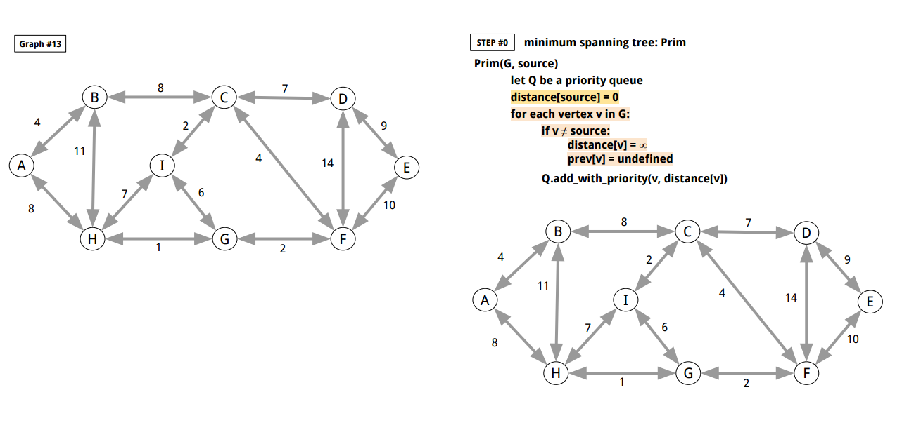
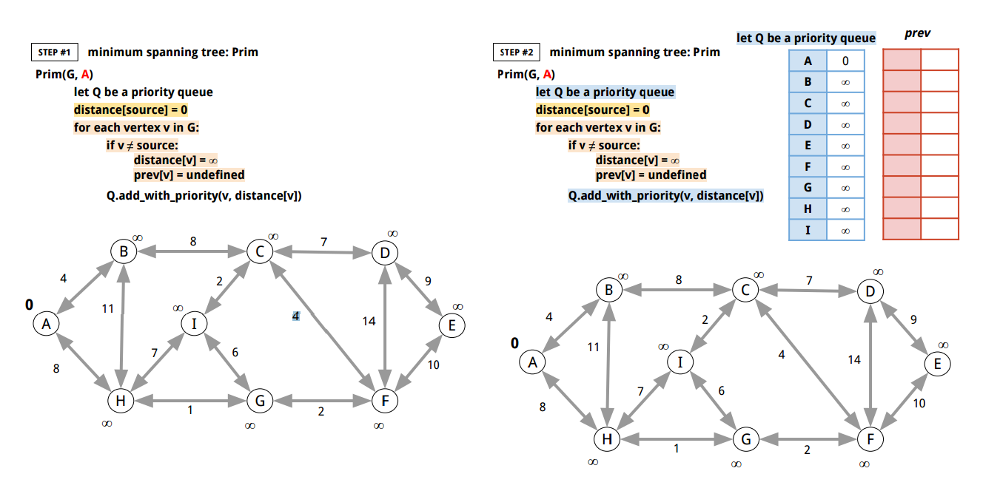
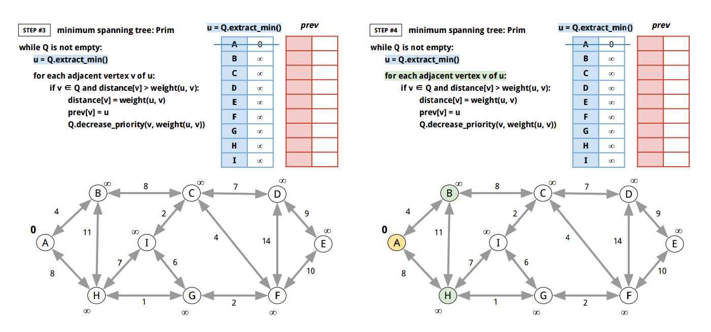
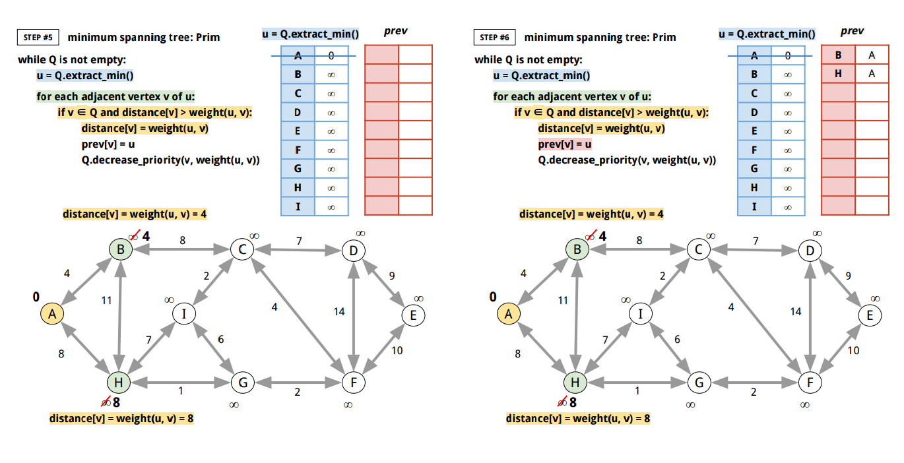
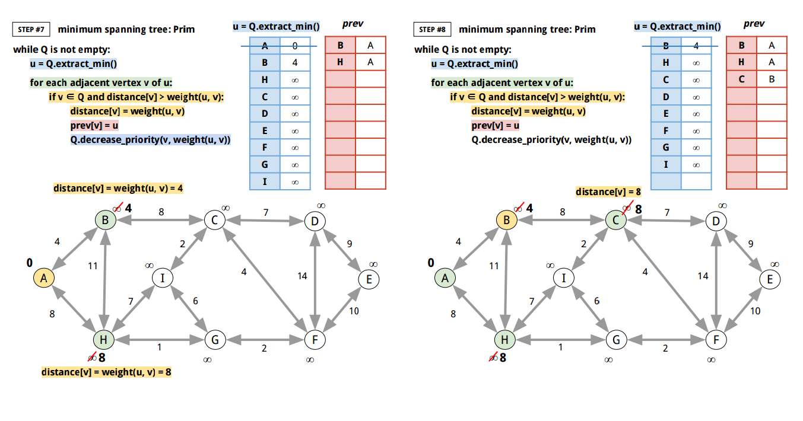
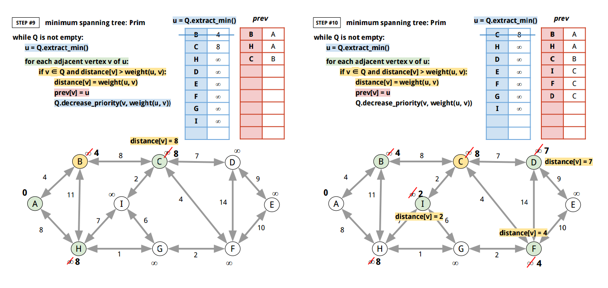
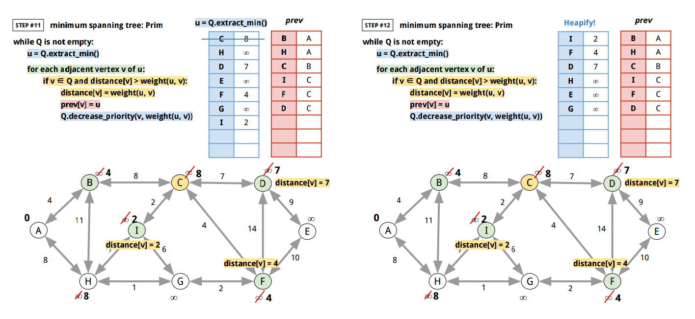

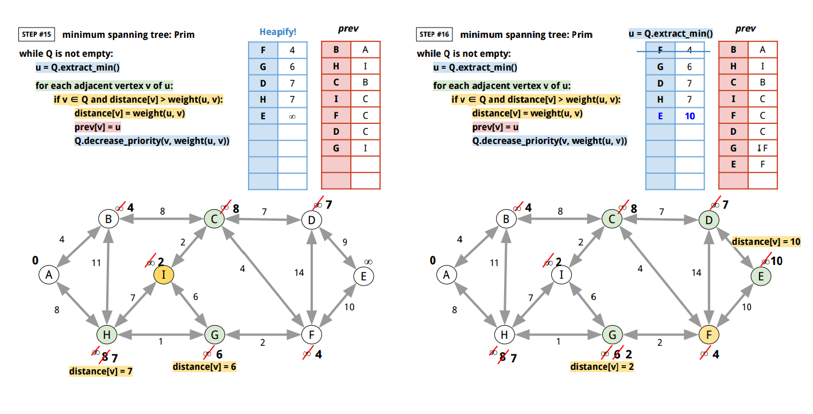
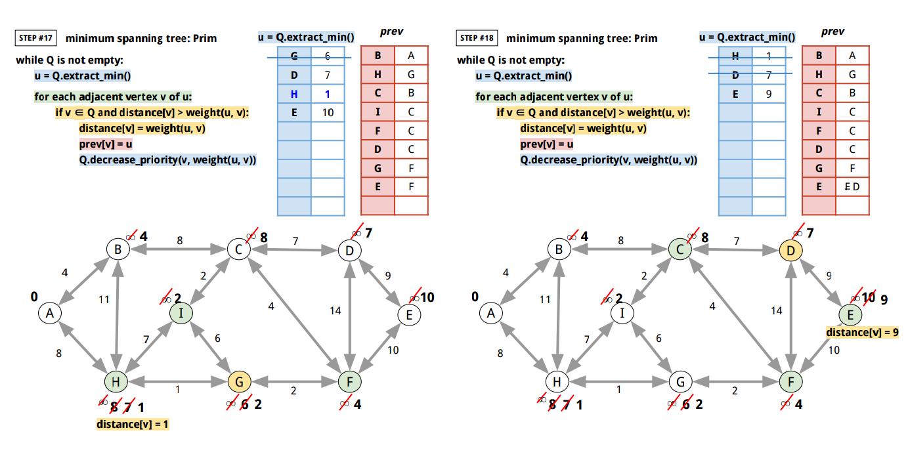
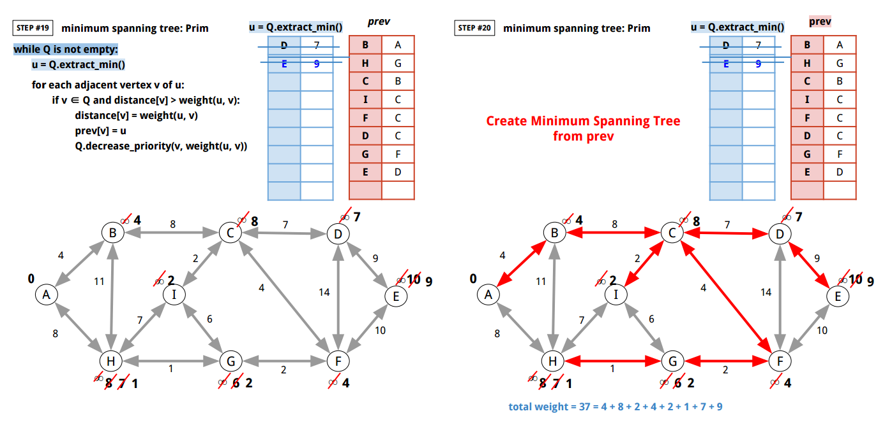

<br>
Here's Go implementation:

```go
package main

import (
	"bytes"
	"container/heap"
	"encoding/json"
	"fmt"
	"io"
	"log"
	"math"
	"os"
	"sync"
)

type vertexDistance struct {
	vertex   string
	distance float64
}

// container.Heap's Interface needs sort.Interface, Push, Pop to be implemented

// vertexDistanceHeap is a min-heap of vertexDistances.
type vertexDistanceHeap []vertexDistance

func (h vertexDistanceHeap) Len() int           { return len(h) }
func (h vertexDistanceHeap) Less(i, j int) bool { return h[i].distance < h[j].distance } // Min-Heap
func (h vertexDistanceHeap) Swap(i, j int)      { h[i], h[j] = h[j], h[i] }

func (h *vertexDistanceHeap) Push(x interface{}) {
	*h = append(*h, x.(vertexDistance))
}

func (h *vertexDistanceHeap) Pop() interface{} {
	heapSize := len(*h)
	lastVertex := (*h)[heapSize-1]
	*h = (*h)[0 : heapSize-1]
	return lastVertex
}

func (h *vertexDistanceHeap) updateDistance(vtx string, val float64) {
	for i := 0; i < len(*h); i++ {
		if (*h)[i].vertex == vtx {
			(*h)[i].distance = val
			break
		}
	}
}

// Edge is an Edge from Source to Target.
type Edge struct {
	Source string
	Target string
	Weight float64
}

type EdgeSlice []Edge

func (e EdgeSlice) Len() int           { return len(e) }
func (e EdgeSlice) Less(i, j int) bool { return e[i].Weight < e[j].Weight }
func (e EdgeSlice) Swap(i, j int)      { e[i], e[j] = e[j], e[i] }

// Prim finds the minimum spanning tree with min-heap (priority queue).
// (http://en.wikipedia.org/wiki/Prim%27s_algorithm)
//
//	 0. Prim(G, source)
//	 1.
//	 2. 	let Q be a priority queue
//	 3. 	distance[source] = 0
//	 4.
//	 5. 	for each vertex v in G:
//	 6.
//	 7. 		if v ≠ source:
//	 8. 			distance[v] = ∞
//	 9. 			prev[v] = undefined
//	10.
//	11. 		Q.add_with_priority(v, distance[v])
//	12.
//	13.
//	14. 	while Q is not empty:
//	15.
//	16. 		u = Q.extract_min()
//	17.
//	18. 		for each adjacent vertex v of u:
//	19.
//	21. 			if v ∈ Q and distance[v] > weight(u, v):
//	22. 				distance[v] = weight(u, v)
//	23. 				prev[v] = u
//	24. 				Q.decrease_priority(v, weight(u, v))
//	25.
//	26.
//	27. 	return tree from prev
//
func Prim(g Graph, source string) map[Edge]struct{} {

	// let Q be a priority queue
	minHeap := &vertexDistanceHeap{}

	// distance[source] = 0
	distance := make(map[string]float64)
	distance[source] = 0.0

	// for each vertex v in G:
	for vtx := range g.GetVertices() {

		// if v ≠ source:
		if vtx != source {
			// distance[v] = ∞
			distance[vtx] = math.MaxFloat64

			// prev[v] = undefined
			// prev[v] = ""
		}

		// Q.add_with_priority(v, distance[v])
		vd := vertexDistance{}
		vd.vertex = vtx
		vd.distance = distance[vtx]

		heap.Push(minHeap, vd)
	}

	heap.Init(minHeap)
	prev := make(map[string]string)

	// while Q is not empty:
	for minHeap.Len() != 0 {

		// u = Q.extract_min()
		u := heap.Pop(minHeap).(vertexDistance)

		// for each adjacent vertex v of u:
		cmap, err := g.GetChildren(u.vertex)
		if err != nil {
			panic(err)
		}
		for v := range cmap {

			isExist := false
			for _, one := range *minHeap {
				if v == one.vertex {
					isExist = true
					break
				}
			}

			// weight(u, v)
			weight, err := g.GetWeight(u.vertex, v)
			if err != nil {
				panic(err)
			}

			// if v ∈ Q and distance[v] > weight(u, v):
			if isExist && distance[v] > weight {

				// distance[v] = weight(u, v)
				distance[v] = weight

				// prev[v] = u
				prev[v] = u.vertex

				// Q.decrease_priority(v, weight(u, v))
				minHeap.updateDistance(v, weight)
				heap.Init(minHeap)
			}
		}
		pmap, err := g.GetParents(u.vertex)
		if err != nil {
			panic(err)
		}
		for uu := range pmap {
			v := u.vertex

			isExist := false
			for _, one := range *minHeap {
				if v == one.vertex {
					isExist = true
					break
				}
			}

			// weight(u, v)
			weight, err := g.GetWeight(uu, v)
			if err != nil {
				panic(err)
			}

			// if v ∈ Q and distance[v] > weight(u, v):
			if isExist && distance[v] > weight {

				// distance[v] = weight(u, v)
				distance[v] = weight

				// prev[v] = u
				prev[v] = uu

				// Q.decrease_priority(v, weight(u, v))
				minHeap.updateDistance(v, weight)
				heap.Init(minHeap)
			}
		}
	}

	tree := make(map[Edge]struct{})
	for k, v := range prev {
		one := Edge{}
		one.Source = v
		one.Target = k
		weight, err := g.GetWeight(v, k)
		if err != nil {
			panic(err)
		}
		one.Weight = weight
		tree[one] = struct{}{}
	}
	return tree
}

func main() {
	f, err := os.Open("graph.json")
	if err != nil {
		panic(err)
	}
	defer f.Close()
	g, err := NewDefaultGraphFromJSON(f, "graph_13")
	if err != nil {
		panic(err)
	}
	for v := range g.GetVertices() {
		A := Prim(g, v)
		total := 0.0
		for edge := range A {
			total += edge.Weight
		}
		if total != 37.0 {
			log.Fatalf("Expected total 37.0 but %.2f", total)
		}
		fmt.Println("Prim from graph_13:", A, "with", v)
	}
	/*
	   Prim from graph_13: map[{A B 4}:true {F C 4}:true {C I 2}:true {H G 1}:true {G F 2}:true {C D 7}:true {D E 9}:true {A H 8}:true] with A
	   Prim from graph_13: map[{F G 2}:true {B A 4}:true {D C 7}:true {C F 4}:true {D E 9}:true {C B 8}:true {C I 2}:true {G H 1}:true] with D
	   Prim from graph_13: map[{H A 8}:true {A B 4}:true {F G 2}:true {F C 4}:true {C D 7}:true {D E 9}:true {G H 1}:true {C I 2}:true] with F
	   Prim from graph_13: map[{C I 2}:true {C F 4}:true {C D 7}:true {F G 2}:true {D E 9}:true {B A 4}:true {G H 1}:true {B C 8}:true] with B
	   Prim from graph_13: map[{G F 2}:true {F C 4}:true {C D 7}:true {D E 9}:true {H G 1}:true {H A 8}:true {A B 4}:true {C I 2}:true] with H
	   Prim from graph_13: map[{C I 2}:true {C F 4}:true {C D 7}:true {G H 1}:true {F G 2}:true {D E 9}:true {H A 8}:true {A B 4}:true] with C
	   Prim from graph_13: map[{F G 2}:true {B A 4}:true {C F 4}:true {E D 9}:true {D C 7}:true {C B 8}:true {C I 2}:true {G H 1}:true] with E
	   Prim from graph_13: map[{H A 8}:true {A B 4}:true {C D 7}:true {D E 9}:true {F C 4}:true {G H 1}:true {C I 2}:true {G F 2}:true] with G
	   Prim from graph_13: map[{B A 4}:true {G H 1}:true {F G 2}:true {I C 2}:true {C D 7}:true {C B 8}:true {C F 4}:true {D E 9}:true] with I
	*/
}

// Graph describes the methods of graph operations.
// It assumes that the identifier of a Vertex is string and unique.
// And weight values is float64.
type Graph interface {
	// Init initializes a Graph.
	Init()

	// GetVertices returns a map from vertex ID to
	// empty struct value. Graph does not allow duplicate
	// vertex ID.
	GetVertices() map[string]struct{}

	// FindVertex returns true if the vertex already
	// exists in the graph.
	FindVertex(vtx string) bool

	// AddVertex adds a vertex to a graph, and returns false
	// if the vertex already existed in the graph.
	AddVertex(vtx string) bool

	// DeleteVertex deletes a vertex from a graph.
	// It returns true if it got deleted.
	// And false if it didn't get deleted.
	DeleteVertex(vtx string) bool

	// AddEdge adds an edge from vtx1 to vtx2 with the weight.
	AddEdge(vtx1, vtx2 string, weight float64) error

	// ReplaceEdge replaces an edge from vtx1 to vtx2 with the weight.
	ReplaceEdge(vtx1, vtx2 string, weight float64) error

	// DeleteEdge deletes an edge from vtx1 to vtx2.
	DeleteEdge(vtx1, vtx2 string) error

	// GetWeight returns the weight from vtx1 to vtx2.
	GetWeight(vtx1, vtx2 string) (float64, error)

	// GetParents returns the map of parent vertices.
	// (Vertices that come towards the argument vertex.)
	GetParents(vtx string) (map[string]struct{}, error)

	// GetChildren returns the map of child vertices.
	// (Vertices that go out of the argument vertex.)
	GetChildren(vtx string) (map[string]struct{}, error)

	// String describes the Graph.
	String() string
}

// defaultGraph is an internal default graph type that
// implements all methods in Graph interface.
type defaultGraph struct {
	mu sync.Mutex // guards the following

	// Vertices stores all vertices.
	Vertices map[string]struct{}

	// VertexToChildren maps a Vertex identifer to children with edge weights.
	VertexToChildren map[string]map[string]float64

	// VertexToParents maps a Vertex identifer to parents with edge weights.
	VertexToParents map[string]map[string]float64
}

// newDefaultGraph returns a new defaultGraph.
func newDefaultGraph() *defaultGraph {
	return &defaultGraph{
		Vertices:         make(map[string]struct{}),
		VertexToChildren: make(map[string]map[string]float64),
		VertexToParents:  make(map[string]map[string]float64),
		//
		// without this
		// panic: assignment to entry in nil map
	}
}

// NewDefaultGraph returns a new defaultGraph.
func NewDefaultGraph() Graph {
	return newDefaultGraph()
}

// newDefaultGraphFromJSON creates a graph Data from JSON.
// Here's the sample JSON data:
//
//	{
//	    "graph_00": {
//	        "S": {
//	            "A": 100,
//	            "B": 14,
//	            "C": 200
//	        },
//	        "A": {
//	            "S": 15,
//	            "B": 5,
//	            "D": 20,
//	            "T": 44
//	        },
//	        "B": {
//	            "S": 14,
//	            "A": 5,
//	            "D": 30,
//	            "E": 18
//	        },
//	        "C": {
//	            "S": 9,
//	            "E": 24
//	        },
//	        "D": {
//	            "A": 20,
//	            "B": 30,
//	            "E": 2,
//	            "F": 11,
//	            "T": 16
//	        },
//	        "E": {
//	            "B": 18,
//	            "C": 24,
//	            "D": 2,
//	            "F": 6,
//	            "T": 19
//	        },
//	        "F": {
//	            "D": 11,
//	            "E": 6,
//	            "T": 6
//	        },
//	        "T": {
//	            "A": 44,
//	            "D": 16,
//	            "F": 6,
//	            "E": 19
//	        }
//	    },
//	}
//
func newDefaultGraphFromJSON(rd io.Reader, graphID string) (*defaultGraph, error) {
	js := make(map[string]map[string]map[string]float64)
	dec := json.NewDecoder(rd)
	for {
		if err := dec.Decode(&js); err == io.EOF {
			break
		} else if err != nil {
			return nil, err
		}
	}
	if _, ok := js[graphID]; !ok {
		return nil, fmt.Errorf("%s does not exist", graphID)
	}
	gmap := js[graphID]
	g := newDefaultGraph()
	for vtx1, mm := range gmap {
		if !g.FindVertex(vtx1) {
			g.AddVertex(vtx1)
		}
		for vtx2, weight := range mm {
			if !g.FindVertex(vtx2) {
				g.AddVertex(vtx2)
			}
			g.ReplaceEdge(vtx1, vtx2, weight)
		}
	}
	return g, nil
}

// NewDefaultGraphFromJSON returns a new defaultGraph from a JSON file.
func NewDefaultGraphFromJSON(rd io.Reader, graphID string) (Graph, error) {
	return newDefaultGraphFromJSON(rd, graphID)
}

func (g *defaultGraph) Init() {
	// (X) g = newDefaultGraph()
	// this only updates the pointer
	//
	*g = *newDefaultGraph()
}

func (g *defaultGraph) GetVertices() map[string]struct{} {
	g.mu.Lock()
	defer g.mu.Unlock()
	return g.Vertices
}

func (g *defaultGraph) FindVertex(vtx string) bool {
	g.mu.Lock()
	defer g.mu.Unlock()
	if _, ok := g.Vertices[vtx]; !ok {
		return false
	}
	return true
}

func (g *defaultGraph) AddVertex(vtx string) bool {
	g.mu.Lock()
	defer g.mu.Unlock()
	if _, ok := g.Vertices[vtx]; !ok {
		g.Vertices[vtx] = struct{}{}
		return true
	}
	return false
}

func (g *defaultGraph) DeleteVertex(vtx string) bool {
	g.mu.Lock()
	defer g.mu.Unlock()
	if _, ok := g.Vertices[vtx]; !ok {
		return false
	} else {
		delete(g.Vertices, vtx)
	}
	if _, ok := g.VertexToChildren[vtx]; ok {
		delete(g.VertexToChildren, vtx)
	}
	for _, smap := range g.VertexToChildren {
		if _, ok := smap[vtx]; ok {
			delete(smap, vtx)
		}
	}
	if _, ok := g.VertexToParents[vtx]; ok {
		delete(g.VertexToParents, vtx)
	}
	for _, smap := range g.VertexToParents {
		if _, ok := smap[vtx]; ok {
			delete(smap, vtx)
		}
	}
	return true
}

func (g *defaultGraph) AddEdge(vtx1, vtx2 string, weight float64) error {
	g.mu.Lock()
	defer g.mu.Unlock()
	if _, ok := g.Vertices[vtx1]; !ok {
		return fmt.Errorf("%s does not exist in the graph.", vtx1)
	}
	if _, ok := g.Vertices[vtx2]; !ok {
		return fmt.Errorf("%s does not exist in the graph.", vtx2)
	}
	if _, ok := g.VertexToChildren[vtx1]; ok {
		if v, ok2 := g.VertexToChildren[vtx1][vtx2]; ok2 {
			g.VertexToChildren[vtx1][vtx2] = v + weight
		} else {
			g.VertexToChildren[vtx1][vtx2] = weight
		}
	} else {
		tmap := make(map[string]float64)
		tmap[vtx2] = weight
		g.VertexToChildren[vtx1] = tmap
	}
	if _, ok := g.VertexToParents[vtx2]; ok {
		if v, ok2 := g.VertexToParents[vtx2][vtx1]; ok2 {
			g.VertexToParents[vtx2][vtx1] = v + weight
		} else {
			g.VertexToParents[vtx2][vtx1] = weight
		}
	} else {
		tmap := make(map[string]float64)
		tmap[vtx1] = weight
		g.VertexToParents[vtx2] = tmap
	}
	return nil
}

func (g *defaultGraph) ReplaceEdge(vtx1, vtx2 string, weight float64) error {
	g.mu.Lock()
	defer g.mu.Unlock()
	if _, ok := g.Vertices[vtx1]; !ok {
		return fmt.Errorf("%s does not exist in the graph.", vtx1)
	}
	if _, ok := g.Vertices[vtx2]; !ok {
		return fmt.Errorf("%s does not exist in the graph.", vtx2)
	}
	if _, ok := g.VertexToChildren[vtx1]; ok {
		g.VertexToChildren[vtx1][vtx2] = weight
	} else {
		tmap := make(map[string]float64)
		tmap[vtx2] = weight
		g.VertexToChildren[vtx1] = tmap
	}
	if _, ok := g.VertexToParents[vtx2]; ok {
		g.VertexToParents[vtx2][vtx1] = weight
	} else {
		tmap := make(map[string]float64)
		tmap[vtx1] = weight
		g.VertexToParents[vtx2] = tmap
	}
	return nil
}

func (g *defaultGraph) DeleteEdge(vtx1, vtx2 string) error {
	g.mu.Lock()
	defer g.mu.Unlock()
	if _, ok := g.Vertices[vtx1]; !ok {
		return fmt.Errorf("%s does not exist in the graph.", vtx1)
	}
	if _, ok := g.Vertices[vtx2]; !ok {
		return fmt.Errorf("%s does not exist in the graph.", vtx2)
	}
	if _, ok := g.VertexToChildren[vtx1]; ok {
		if _, ok := g.VertexToChildren[vtx1][vtx2]; ok {
			delete(g.VertexToChildren[vtx1], vtx2)
		}
	}
	if _, ok := g.VertexToParents[vtx2]; ok {
		if _, ok := g.VertexToParents[vtx2][vtx1]; ok {
			delete(g.VertexToParents[vtx2], vtx1)
		}
	}
	return nil
}

func (g *defaultGraph) GetWeight(vtx1, vtx2 string) (float64, error) {
	g.mu.Lock()
	defer g.mu.Unlock()
	if _, ok := g.Vertices[vtx1]; !ok {
		return 0.0, fmt.Errorf("%s does not exist in the graph.", vtx1)
	}
	if _, ok := g.Vertices[vtx2]; !ok {
		return 0.0, fmt.Errorf("%s does not exist in the graph.", vtx2)
	}
	if _, ok := g.VertexToChildren[vtx1]; ok {
		if v, ok := g.VertexToChildren[vtx1][vtx2]; ok {
			return v, nil
		}
	}
	return 0.0, fmt.Errorf("there is not edge from %s to %s", vtx1, vtx2)
}

func (g *defaultGraph) GetParents(vtx string) (map[string]struct{}, error) {
	g.mu.Lock()
	defer g.mu.Unlock()
	if _, ok := g.Vertices[vtx]; !ok {
		return nil, fmt.Errorf("%s does not exist in the graph.", vtx)
	}
	rs := make(map[string]struct{})
	if _, ok := g.VertexToParents[vtx]; ok {
		for k := range g.VertexToParents[vtx] {
			rs[k] = struct{}{}
		}
	}
	return rs, nil
}

func (g *defaultGraph) GetChildren(vtx string) (map[string]struct{}, error) {
	g.mu.Lock()
	defer g.mu.Unlock()
	if _, ok := g.Vertices[vtx]; !ok {
		return nil, fmt.Errorf("%s does not exist in the graph.", vtx)
	}
	rs := make(map[string]struct{})
	if _, ok := g.VertexToChildren[vtx]; ok {
		for k := range g.VertexToChildren[vtx] {
			rs[k] = struct{}{}
		}
	}
	return rs, nil
}

func (g *defaultGraph) String() string {
	buf := new(bytes.Buffer)
	for vtx1 := range g.Vertices {
		cmap, _ := g.GetChildren(vtx1)
		for vtx2 := range cmap {
			weight, _ := g.GetWeight(vtx1, vtx2)
			fmt.Fprintf(buf, "%s -- %.3f --> %s\n", vtx1, weight, vtx2)
		}
	}
	return buf.String()
}

```

[↑ top](#go-graph-minimum-spanning-tree)
<br><br><br><br><hr>
