[*back to contents*](https://github.com/gyuho/learn#contents)
<br>

# Go: graph, shortest path

- [Reference](#reference)
- [Dijkstra algorithm](#dijkstra-algorithm)
- [Bellman–Ford algorithm](#bellmanford-algorithm)

[↑ top](#go-graph-shortest-path)
<br><br><br><br>
<hr>


#### Reference

- [Dijkstra's algorithm](https://en.wikipedia.org/wiki/Dijkstra%27s_algorithm)
- [Bellman–Ford algorithm](https://en.wikipedia.org/wiki/Bellman%E2%80%93Ford_algorithm)
- [Shortest Paths](http://www.columbia.edu/~cs2035/courses/ieor6614.S11/sp.pdf)
- [Lecture 15: Shortest Paths II by Prof. Erik Demaine](http://courses.csail.mit.edu/6.006/spring11/lectures/lec15.pdf)
- [**github.com/gyuho/goraph**](https://github.com/gyuho/goraph)

[↑ top](#go-graph-shortest-path)
<br><br><br><br>
<hr>


#### Dijkstra algorithm

> Dijkstra's algorithm is an algorithm for finding the shortest
> paths between nodes in a graph, which may represent, for example,
> road networks. It was conceived by computer scientist
> Edsger W. Dijkstra in 1956 and published three years later.
>
> [Dijkstra's algorithm](https://en.wikipedia.org/wiki/Dijkstra%27s_algorithm)
> *by Wikipedia*

```
 0. Dijkstra(G, source, target)
 1.
 2. 	let Q be a priority queue
 3. 	distance[source] = 0
 4.
 5. 	for each vertex v in G:
 6.
 7. 		if v ≠ source:
 8. 			distance[v] = ∞
 9. 			prev[v] = undefined
10.
11. 		Q.add_with_priority(v, distance[v])
12.
13. 	while Q is not empty:
14.
15. 		u = Q.extract_min()
16. 		if u == target:
17. 			break
18.
19. 		for each child vertex v of u:
20.
21. 			alt = distance[u] + weight(u, v)
22. 			if distance[v] > alt:
23. 				distance[v] = alt
24. 				prev[v] = u
25. 				Q.decrease_priority(v, alt)
26.
27. 	path = []
28. 	u = target
29. 	while prev[u] is defined:
30. 		path.push_front(u)
31. 		u = prev[u]
32.
33. 	return path, prev
```

<br>
Here's how it works:

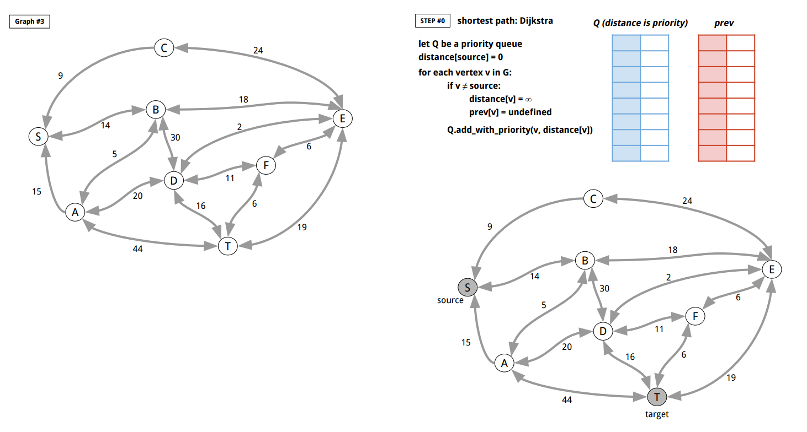
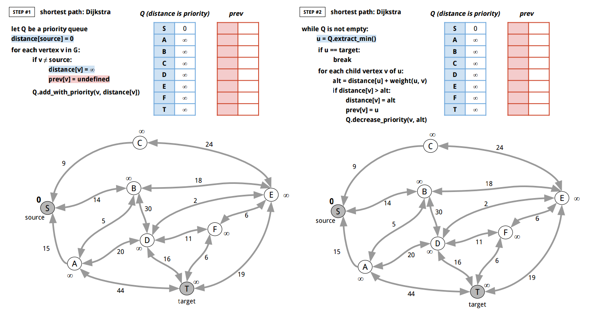
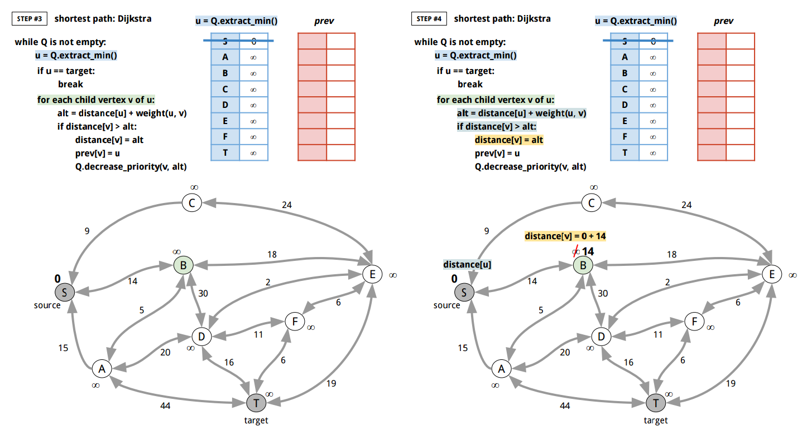

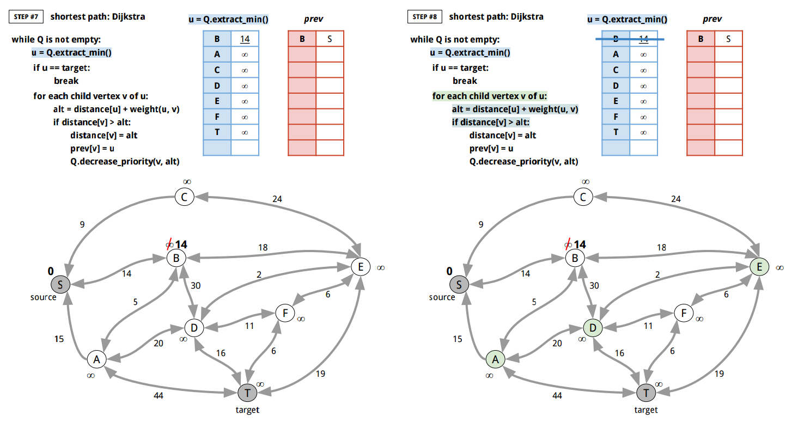
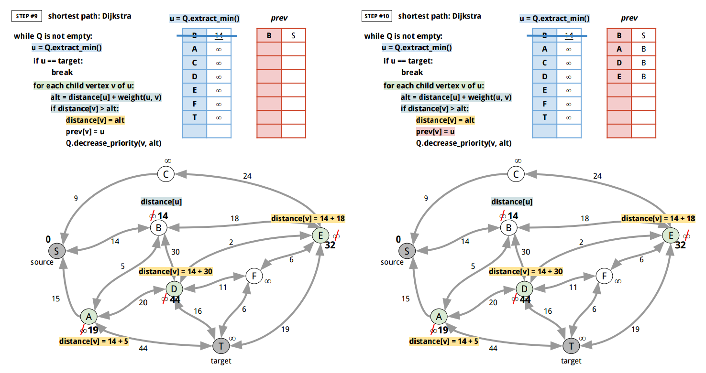
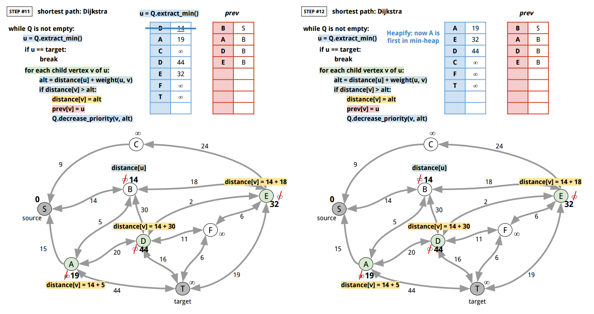
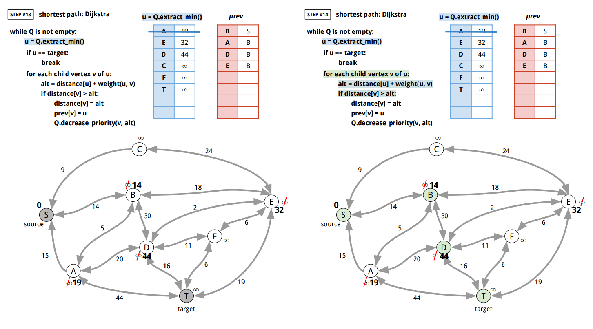
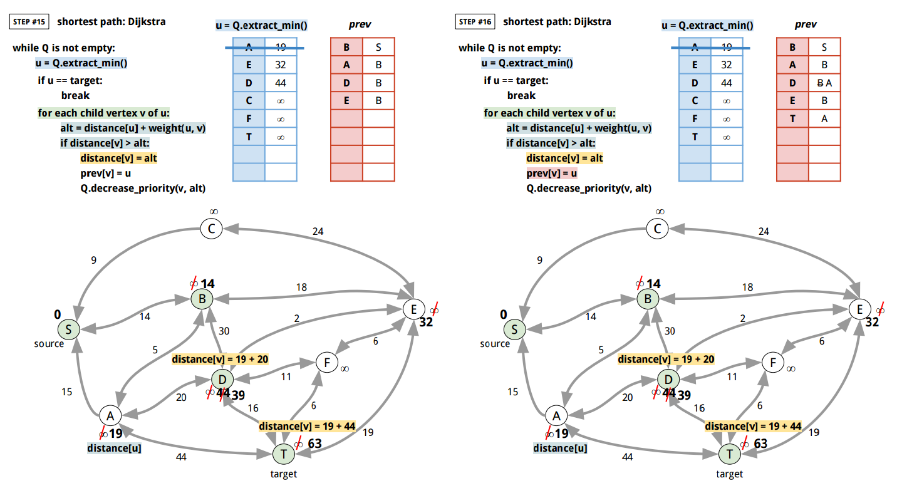
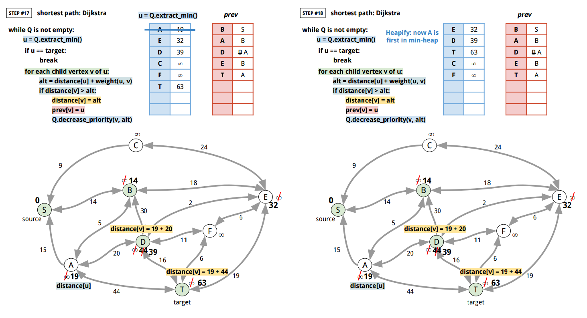
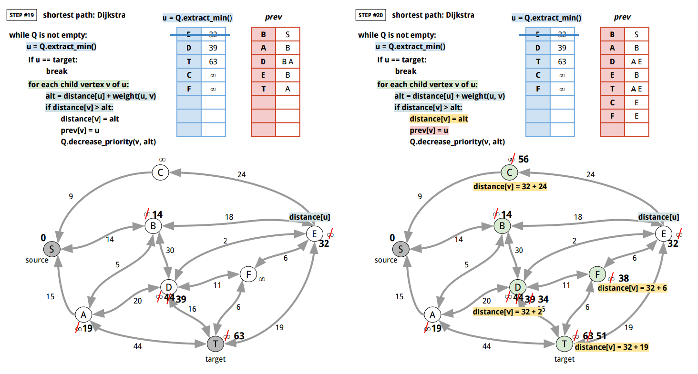
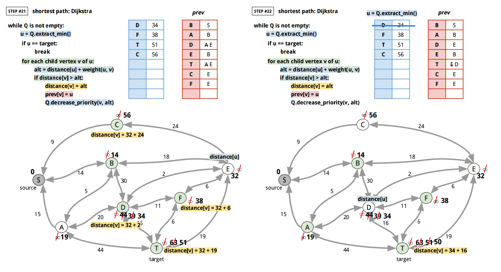
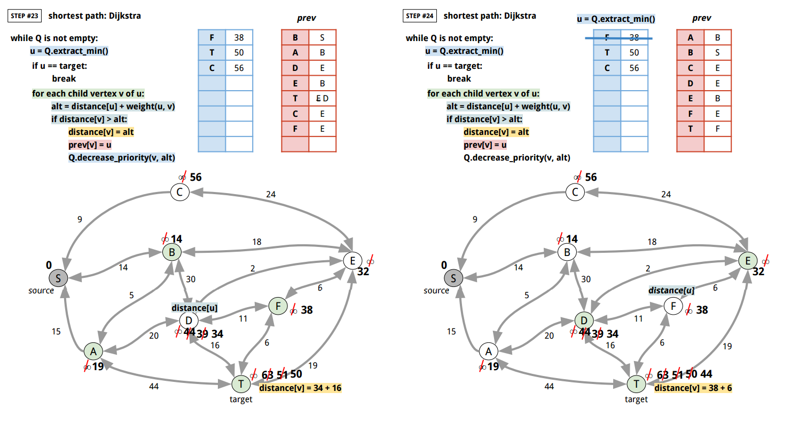
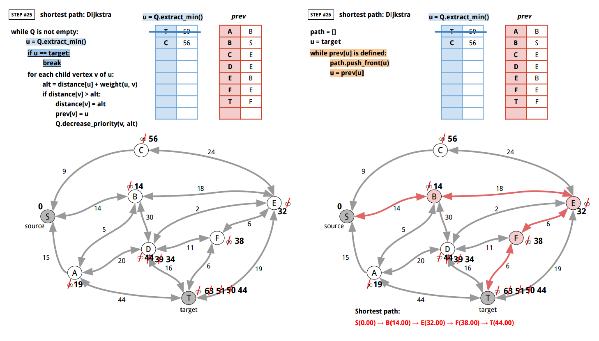

<br>
Here's Go implementation:

```go
package main

import (
	"bytes"
	"container/heap"
	"encoding/json"
	"fmt"
	"io"
	"log"
	"math"
	"os"
	"strings"
	"sync"
)

func main() {
	f, err := os.Open("graph.json")
	if err != nil {
		panic(err)
	}
	defer f.Close()
	g, err := NewDefaultGraphFromJSON(f, "graph_03")
	if err != nil {
		panic(err)
	}
	path, distance, err := Dijkstra(g, "S", "T")
	if err != nil {
		panic(err)
	}
	ts := []string{}
	for _, v := range path {
		ts = append(ts, fmt.Sprintf("%s(%.2f)", v, distance[v]))
	}
	if strings.Join(ts, " → ") != "S(0.00) → B(14.00) → E(32.00) → F(38.00) → T(44.00)" {
		log.Fatalf("Expected the shortest path S(0.00) → B(14.00) → E(32.00) → F(38.00) → T(44.00) but %s", strings.Join(ts, " → "))
	}
	if distance["T"] != 44.0 {
		log.Fatalf("Expected 44.0 but %f", distance["T"])
	}
	fmt.Println("graph_03:", strings.Join(ts, " → "))
	// graph_03: S(0.00) → B(14.00) → E(32.00) → F(38.00) → T(44.00)
}

type vertexDistance struct {
	vertex   string
	distance float64
}

// container.Heap's Interface needs sort.Interface, Push, Pop to be implemented

// vertexDistanceHeap is a min-heap of vertexDistances.
type vertexDistanceHeap []vertexDistance

func (h vertexDistanceHeap) Len() int           { return len(h) }
func (h vertexDistanceHeap) Less(i, j int) bool { return h[i].distance < h[j].distance } // Min-Heap
func (h vertexDistanceHeap) Swap(i, j int)      { h[i], h[j] = h[j], h[i] }

func (h *vertexDistanceHeap) Push(x interface{}) {
	*h = append(*h, x.(vertexDistance))
}

func (h *vertexDistanceHeap) Pop() interface{} {
	heapSize := len(*h)
	lastVertex := (*h)[heapSize-1]
	*h = (*h)[0 : heapSize-1]
	return lastVertex
}

func (h *vertexDistanceHeap) updateDistance(vtx string, val float64) {
	for i := 0; i < len(*h); i++ {
		if (*h)[i].vertex == vtx {
			(*h)[i].distance = val
			break
		}
	}
}

// Dijkstra returns the shortest path using Dijkstra
// algorithm with a min-priority queue. This algorithm
// does not work with negative weight edges.
// (https://en.wikipedia.org/wiki/Dijkstra%27s_algorithm)
//
//	 0. Dijkstra(G, source, target)
//	 1.
//	 2. 	let Q be a priority queue
//	 3. 	distance[source] = 0
//	 4.
//	 5. 	for each vertex v in G:
//	 6.
//	 7. 		if v ≠ source:
//	 8. 			distance[v] = ∞
//	 9. 			prev[v] = undefined
//	10.
//	11. 		Q.add_with_priority(v, distance[v])
//	12.
//	13. 	while Q is not empty:
//	14.
//	15. 		u = Q.extract_min()
//	16. 		if u == target:
//	17. 			break
//	18.
//	19. 		for each child vertex v of u:
//	20.
//	21. 			alt = distance[u] + weight(u, v)
//	22. 			if distance[v] > alt:
//	23. 				distance[v] = alt
//	24. 				prev[v] = u
//	25. 				Q.decrease_priority(v, alt)
//	26.
//	27. 	path = []
//	28. 	u = target
//	29. 	while prev[u] is defined:
//	30. 		path.push_front(u)
//	31. 		u = prev[u]
//	32.
//	33. 	return path, prev
//
func Dijkstra(g Graph, source, target string) ([]string, map[string]float64, error) {

	// let Q be a priority queue
	minHeap := &vertexDistanceHeap{}

	// distance[source] = 0
	distance := make(map[string]float64)
	distance[source] = 0.0

	// for each vertex v in G:
	for vtx := range g.GetVertices() {

		// if v ≠ source:
		if vtx != source {
			// distance[v] = ∞
			distance[vtx] = math.MaxFloat64

			// prev[v] = undefined
			// prev[v] = ""
		}

		// Q.add_with_priority(v, distance[v])
		vd := vertexDistance{}
		vd.vertex = vtx
		vd.distance = distance[vtx]

		heap.Push(minHeap, vd)
	}

	heap.Init(minHeap)
	prev := make(map[string]string)

	// while Q is not empty:
	for minHeap.Len() != 0 {

		// u = Q.extract_min()
		u := heap.Pop(minHeap).(vertexDistance)

		// if u == target:
		if u.vertex == target {
			break
		}

		// for each child vertex v of u:
		cmap, err := g.GetChildren(u.vertex)
		if err != nil {
			return nil, nil, err
		}
		for v := range cmap {

			// alt = distance[u] + weight(u, v)
			weight, err := g.GetWeight(u.vertex, v)
			if err != nil {
				return nil, nil, err
			}
			alt := distance[u.vertex] + weight

			// if distance[v] > alt:
			if distance[v] > alt {

				// distance[v] = alt
				distance[v] = alt

				// prev[v] = u
				prev[v] = u.vertex

				// Q.decrease_priority(v, alt)
				minHeap.updateDistance(v, alt)
				heap.Init(minHeap)
			}
		}
	}

	// path = []
	path := []string{}

	// u = target
	u := target

	// while prev[u] is defined:
	for {
		if _, ok := prev[u]; !ok {
			break
		}
		// path.push_front(u)
		temp := make([]string, len(path)+1)
		temp[0] = u
		copy(temp[1:], path)
		path = temp

		// u = prev[u]
		u = prev[u]

	}

	// add the source
	temp := make([]string, len(path)+1)
	temp[0] = source
	copy(temp[1:], path)
	path = temp

	return path, distance, nil
}

// Graph describes the methods of graph operations.
// It assumes that the identifier of a Vertex is string and unique.
// And weight values is float64.
type Graph interface {
	// GetVertices returns a map of all vertices.
	GetVertices() map[string]bool

	// FindVertex returns true if the vertex already
	// exists in the graph.
	FindVertex(vtx string) bool

	// AddVertex adds a vertex to a graph, and returns false
	// if the vertex already existed in the graph.
	AddVertex(vtx string) bool

	// DeleteVertex deletes a vertex from a graph.
	// It returns true if it got deleted.
	// And false if it didn't get deleted.
	DeleteVertex(vtx string) bool

	// AddEdge adds an edge from vtx1 to vtx2 with the weight.
	AddEdge(vtx1, vtx2 string, weight float64) error

	// ReplaceEdge replaces an edge from vtx1 to vtx2 with the weight.
	ReplaceEdge(vtx1, vtx2 string, weight float64) error

	// DeleteEdge deletes an edge from vtx1 to vtx2.
	DeleteEdge(vtx1, vtx2 string) error

	// GetWeight returns the weight from vtx1 to vtx2.
	GetWeight(vtx1, vtx2 string) (float64, error)

	// GetParents returns the map of parent vertices.
	// (Vertices that comes to the argument vertex.)
	GetParents(vtx string) (map[string]bool, error)

	// GetChildren returns the map of child vertices.
	// (Vertices that goes out of the argument vertex.)
	GetChildren(vtx string) (map[string]bool, error)
}

// DefaultGraph type implements all methods in Graph interface.
type DefaultGraph struct {
	sync.Mutex

	// Vertices stores all vertices.
	Vertices map[string]bool

	// VertexToChildren maps a Vertex identifer to children with edge weights.
	VertexToChildren map[string]map[string]float64

	// VertexToParents maps a Vertex identifer to parents with edge weights.
	VertexToParents map[string]map[string]float64
}

// NewDefaultGraph returns a new DefaultGraph.
func NewDefaultGraph() *DefaultGraph {
	return &DefaultGraph{
		Vertices:         make(map[string]bool),
		VertexToChildren: make(map[string]map[string]float64),
		VertexToParents:  make(map[string]map[string]float64),
		//
		// without this
		// panic: assignment to entry in nil map
	}
}

func (g *DefaultGraph) Init() {
	// (X) g = NewDefaultGraph()
	// this only updates the pointer
	//
	*g = *NewDefaultGraph()
}

func (g DefaultGraph) GetVertices() map[string]bool {
	g.Lock()
	defer g.Unlock()
	return g.Vertices
}

func (g DefaultGraph) FindVertex(vtx string) bool {
	g.Lock()
	defer g.Unlock()
	if _, ok := g.Vertices[vtx]; !ok {
		return false
	}
	return true
}

func (g *DefaultGraph) AddVertex(vtx string) bool {
	g.Lock()
	defer g.Unlock()
	if _, ok := g.Vertices[vtx]; !ok {
		g.Vertices[vtx] = true
		return true
	}
	return false
}

func (g *DefaultGraph) DeleteVertex(vtx string) bool {
	g.Lock()
	defer g.Unlock()
	if _, ok := g.Vertices[vtx]; !ok {
		return false
	} else {
		delete(g.Vertices, vtx)
	}
	if _, ok := g.VertexToChildren[vtx]; ok {
		delete(g.VertexToChildren, vtx)
	}
	for _, smap := range g.VertexToChildren {
		if _, ok := smap[vtx]; ok {
			delete(smap, vtx)
		}
	}
	if _, ok := g.VertexToParents[vtx]; ok {
		delete(g.VertexToParents, vtx)
	}
	for _, smap := range g.VertexToParents {
		if _, ok := smap[vtx]; ok {
			delete(smap, vtx)
		}
	}
	return true
}

func (g *DefaultGraph) AddEdge(vtx1, vtx2 string, weight float64) error {
	g.Lock()
	defer g.Unlock()
	if _, ok := g.Vertices[vtx1]; !ok {
		return fmt.Errorf("%s does not exist in the graph.", vtx1)
	}
	if _, ok := g.Vertices[vtx2]; !ok {
		return fmt.Errorf("%s does not exist in the graph.", vtx2)
	}
	if _, ok := g.VertexToChildren[vtx1]; ok {
		if v, ok2 := g.VertexToChildren[vtx1][vtx2]; ok2 {
			g.VertexToChildren[vtx1][vtx2] = v + weight
		} else {
			g.VertexToChildren[vtx1][vtx2] = weight
		}
	} else {
		tmap := make(map[string]float64)
		tmap[vtx2] = weight
		g.VertexToChildren[vtx1] = tmap
	}
	if _, ok := g.VertexToParents[vtx2]; ok {
		if v, ok2 := g.VertexToParents[vtx2][vtx1]; ok2 {
			g.VertexToParents[vtx2][vtx1] = v + weight
		} else {
			g.VertexToParents[vtx2][vtx1] = weight
		}
	} else {
		tmap := make(map[string]float64)
		tmap[vtx1] = weight
		g.VertexToParents[vtx2] = tmap
	}
	return nil
}

func (g *DefaultGraph) ReplaceEdge(vtx1, vtx2 string, weight float64) error {
	g.Lock()
	defer g.Unlock()
	if _, ok := g.Vertices[vtx1]; !ok {
		return fmt.Errorf("%s does not exist in the graph.", vtx1)
	}
	if _, ok := g.Vertices[vtx2]; !ok {
		return fmt.Errorf("%s does not exist in the graph.", vtx2)
	}
	if _, ok := g.VertexToChildren[vtx1]; ok {
		g.VertexToChildren[vtx1][vtx2] = weight
	} else {
		tmap := make(map[string]float64)
		tmap[vtx2] = weight
		g.VertexToChildren[vtx1] = tmap
	}
	if _, ok := g.VertexToParents[vtx2]; ok {
		g.VertexToParents[vtx2][vtx1] = weight
	} else {
		tmap := make(map[string]float64)
		tmap[vtx1] = weight
		g.VertexToParents[vtx2] = tmap
	}
	return nil
}

func (g *DefaultGraph) DeleteEdge(vtx1, vtx2 string) error {
	g.Lock()
	defer g.Unlock()
	if _, ok := g.Vertices[vtx1]; !ok {
		return fmt.Errorf("%s does not exist in the graph.", vtx1)
	}
	if _, ok := g.Vertices[vtx2]; !ok {
		return fmt.Errorf("%s does not exist in the graph.", vtx2)
	}
	if _, ok := g.VertexToChildren[vtx1]; ok {
		if _, ok := g.VertexToChildren[vtx1][vtx2]; ok {
			delete(g.VertexToChildren[vtx1], vtx2)
		}
	}
	if _, ok := g.VertexToParents[vtx2]; ok {
		if _, ok := g.VertexToParents[vtx2][vtx1]; ok {
			delete(g.VertexToParents[vtx2], vtx1)
		}
	}
	return nil
}

func (g *DefaultGraph) GetWeight(vtx1, vtx2 string) (float64, error) {
	g.Lock()
	defer g.Unlock()
	if _, ok := g.Vertices[vtx1]; !ok {
		return 0.0, fmt.Errorf("%s does not exist in the graph.", vtx1)
	}
	if _, ok := g.Vertices[vtx2]; !ok {
		return 0.0, fmt.Errorf("%s does not exist in the graph.", vtx2)
	}
	if _, ok := g.VertexToChildren[vtx1]; ok {
		if v, ok := g.VertexToChildren[vtx1][vtx2]; ok {
			return v, nil
		}
	}
	return 0.0, fmt.Errorf("there is not edge from %s to %s", vtx1, vtx2)
}

func (g *DefaultGraph) GetParents(vtx string) (map[string]bool, error) {
	g.Lock()
	defer g.Unlock()
	if _, ok := g.Vertices[vtx]; !ok {
		return nil, fmt.Errorf("%s does not exist in the graph.", vtx)
	}
	rs := make(map[string]bool)
	if _, ok := g.VertexToParents[vtx]; ok {
		for k := range g.VertexToParents[vtx] {
			rs[k] = true
		}
	}
	return rs, nil
}

func (g *DefaultGraph) GetChildren(vtx string) (map[string]bool, error) {
	g.Lock()
	defer g.Unlock()
	if _, ok := g.Vertices[vtx]; !ok {
		return nil, fmt.Errorf("%s does not exist in the graph.", vtx)
	}
	rs := make(map[string]bool)
	if _, ok := g.VertexToChildren[vtx]; ok {
		for k := range g.VertexToChildren[vtx] {
			rs[k] = true
		}
	}
	return rs, nil
}

// FromJSON creates a graph Data from JSON. Here's the sample JSON data:
//
//	{
//	    "graph_00": {
//	        "S": {
//	            "A": 100,
//	            "B": 14,
//	            "C": 200
//	        },
//	        "A": {
//	            "S": 15,
//	            "B": 5,
//	            "D": 20,
//	            "T": 44
//	        },
//	        "B": {
//	            "S": 14,
//	            "A": 5,
//	            "D": 30,
//	            "E": 18
//	        },
//	        "C": {
//	            "S": 9,
//	            "E": 24
//	        },
//	        "D": {
//	            "A": 20,
//	            "B": 30,
//	            "E": 2,
//	            "F": 11,
//	            "T": 16
//	        },
//	        "E": {
//	            "B": 18,
//	            "C": 24,
//	            "D": 2,
//	            "F": 6,
//	            "T": 19
//	        },
//	        "F": {
//	            "D": 11,
//	            "E": 6,
//	            "T": 6
//	        },
//	        "T": {
//	            "A": 44,
//	            "D": 16,
//	            "F": 6,
//	            "E": 19
//	        }
//	    },
//	}
//
func NewDefaultGraphFromJSON(rd io.Reader, graphID string) (*DefaultGraph, error) {
	js := make(map[string]map[string]map[string]float64)
	dec := json.NewDecoder(rd)
	for {
		if err := dec.Decode(&js); err == io.EOF {
			break
		} else if err != nil {
			return nil, err
		}
	}
	if _, ok := js[graphID]; !ok {
		return nil, fmt.Errorf("%s does not exist", graphID)
	}
	gmap := js[graphID]
	g := NewDefaultGraph()
	for vtx1, mm := range gmap {
		if !g.FindVertex(vtx1) {
			g.AddVertex(vtx1)
		}
		for vtx2, weight := range mm {
			if !g.FindVertex(vtx2) {
				g.AddVertex(vtx2)
			}
			g.ReplaceEdge(vtx1, vtx2, weight)
		}
	}
	return g, nil
}

func (g DefaultGraph) String() string {
	buf := new(bytes.Buffer)
	for vtx1 := range g.Vertices {
		cmap, _ := g.GetChildren(vtx1)
		for vtx2 := range cmap {
			weight, _ := g.GetWeight(vtx1, vtx2)
			fmt.Fprintf(buf, "%s -- %.3f --> %s\n", vtx1, weight, vtx2)
		}
	}
	return buf.String()
}

```

[↑ top](#go-graph-shortest-path)
<br><br><br><br>
<hr>


#### Bellman–Ford algorithm

> The Bellman–Ford algorithm is an algorithm that
> computes shortest paths from a single source vertex
> to all of the other vertices in a weighted digraph.
> It is slower than Dijkstra's algorithm for the same
> problem, but more versatile, as it is capable of **handling** 
> graphs in which **some of the edge weights are negative numbers**. 
>
> [*Bellman–Ford algorithm*](https://en.wikipedia.org/wiki/Bellman%E2%80%93Ford_algorithm)
> *by Wikipedia*


```
 0. BellmanFord(G, source, target)
 1.
 2. 	distance[source] = 0
 3.
 4. 	for each vertex v in G:
 5.
 6. 		if v ≠ source:
 7. 			distance[v] = ∞
 8. 			prev[v] = undefined
 9.
10.
11. 	for 1 to |V|-1:
12.
13. 		for every edge (u, v):
14.
15. 			alt = distance[u] + weight(u, v)
16. 			if distance[v] > alt:
17. 				distance[v] = alt
18. 				prev[v] = u
19.
20.
21. 	for every edge (u, v):
22.
23. 		alt = distance[u] + weight(u, v)
24. 		if distance[v] > alt:
25. 			there is a negative-weight cycle
26.
27.
28. 	path = []
29. 	u = target
30. 	while prev[u] is defined:
31. 		path.push_front(u)
32. 		u = prev[u]
33.
34. 	return path, prev
```

<br>
Here's how it works:

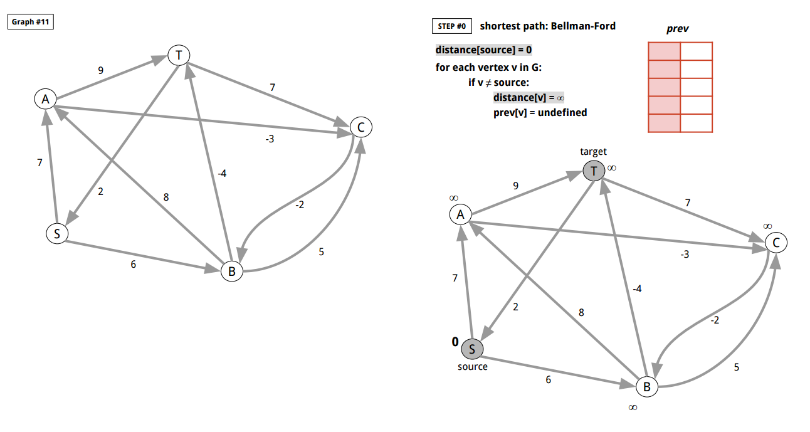

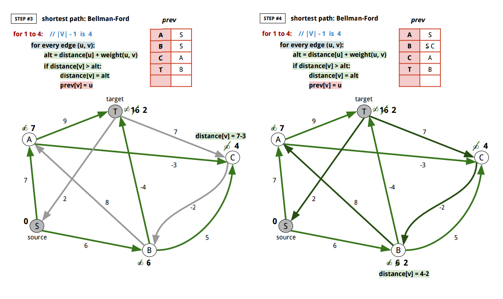

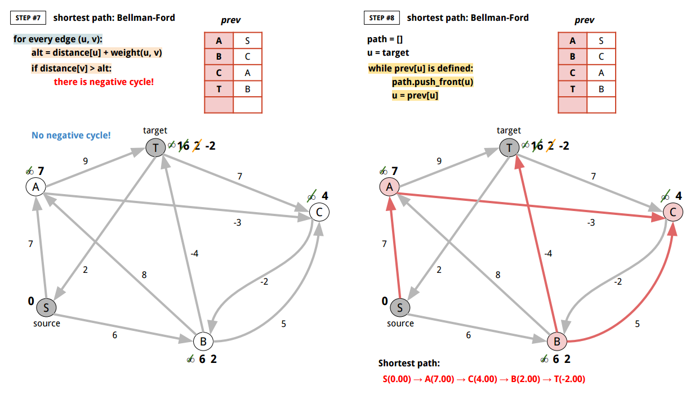

<br>
Here's Go implementation:

```go
package main

import (
	"bytes"
	"encoding/json"
	"fmt"
	"io"
	"log"
	"math"
	"os"
	"strings"
	"sync"
)

// BellmanFord returns the shortest path using Bellman-Ford algorithm
// This algorithm works with negative weight edges.
// Time complexity is O(|V||E|).
// (http://courses.csail.mit.edu/6.006/spring11/lectures/lec15.pdf)
// It returns error when there is a negative-weight cycle.
// A negatively-weighted cycle adds up to infinite negative-weight.
//
//	 0. BellmanFord(G, source, target)
//	 1.
//	 2. 	distance[source] = 0
//	 3.
//	 4. 	for each vertex v in G:
//	 5.
//	 6. 		if v ≠ source:
//	 7. 			distance[v] = ∞
//	 8. 			prev[v] = undefined
//	 9.
//	10.
//	11. 	for 1 to |V|-1:
//	12.
//	13. 		for every edge (u, v):
//	14.
//	15. 			alt = distance[u] + weight(u, v)
//	16. 			if distance[v] > alt:
//	17. 				distance[v] = alt
//	18. 				prev[v] = u
//	19.
//	20.
//	21. 	for every edge (u, v):
//	22.
//	23. 		alt = distance[u] + weight(u, v)
//	24. 		if distance[v] > alt:
//	25. 			there is a negative-weight cycle
//	26.
//	27.
//	28. 	path = []
//	29. 	u = target
//	30. 	while prev[u] is defined:
//	31. 		path.push_front(u)
//	32. 		u = prev[u]
//	33.
//	34. 	return path, prev
//
func BellmanFord(g Graph, source, target string) ([]string, map[string]float64, error) {

	// distance[source] = 0
	distance := make(map[string]float64)
	distance[source] = 0.0

	// for each vertex v in G:
	for vtx := range g.GetVertices() {

		// if v ≠ source:
		if vtx != source {
			// distance[v] = ∞
			distance[vtx] = math.MaxFloat64

			// prev[v] = undefined
			// prev[v] = ""
		}
	}

	prev := make(map[string]string)

	// for 1 to |V|-1:
	for i := 1; i <= len(g.GetVertices())-1; i++ {

		// for every edge (u, v):
		for vtx := range g.GetVertices() {

			cmap, err := g.GetChildren(vtx)
			if err != nil {
				return nil, nil, err
			}
			for v := range cmap {
				u := vtx
				// edge (u, v)
				weight, err := g.GetWeight(u, v)
				if err != nil {
					return nil, nil, err
				}

				// alt = distance[u] + weight(u, v)
				alt := distance[u] + weight

				// if distance[v] > alt:
				if distance[v] > alt {
					// distance[v] = alt
					distance[v] = alt

					// prev[v] = u
					prev[v] = u
				}
			}

			pmap, err := g.GetParents(vtx)
			if err != nil {
				return nil, nil, err
			}
			for u := range pmap {
				v := vtx
				// edge (u, v)
				weight, err := g.GetWeight(u, v)
				if err != nil {
					return nil, nil, err
				}

				// alt = distance[u] + weight(u, v)
				alt := distance[u] + weight

				// if distance[v] > alt:
				if distance[v] > alt {
					// distance[v] = alt
					distance[v] = alt

					// prev[v] = u
					prev[v] = u
				}
			}
		}
	}

	// for every edge (u, v):
	for vtx := range g.GetVertices() {

		cmap, err := g.GetChildren(vtx)
		if err != nil {
			return nil, nil, err
		}
		for v := range cmap {
			u := vtx
			// edge (u, v)
			weight, err := g.GetWeight(u, v)
			if err != nil {
				return nil, nil, err
			}

			// alt = distance[u] + weight(u, v)
			alt := distance[u] + weight

			// if distance[v] > alt:
			if distance[v] > alt {
				return nil, nil, fmt.Errorf("there is a negative-weight cycle: %v", g)
			}
		}

		pmap, err := g.GetParents(vtx)
		if err != nil {
			return nil, nil, err
		}
		for u := range pmap {
			v := vtx
			// edge (u, v)
			weight, err := g.GetWeight(u, v)
			if err != nil {
				return nil, nil, err
			}

			// alt = distance[u] + weight(u, v)
			alt := distance[u] + weight

			// if distance[v] > alt:
			if distance[v] > alt {
				return nil, nil, fmt.Errorf("there is a negative-weight cycle: %v", g)
			}
		}
	}

	// path = []
	path := []string{}

	// u = target
	u := target

	// while prev[u] is defined:
	for {
		if _, ok := prev[u]; !ok {
			break
		}
		// path.push_front(u)
		temp := make([]string, len(path)+1)
		temp[0] = u
		copy(temp[1:], path)
		path = temp

		// u = prev[u]
		u = prev[u]
	}

	// add the source
	temp := make([]string, len(path)+1)
	temp[0] = source
	copy(temp[1:], path)
	path = temp

	return path, distance, nil
}

func main() {
	f, err := os.Open("graph.json")
	if err != nil {
		panic(err)
	}
	defer f.Close()
	g, err := NewDefaultGraphFromJSON(f, "graph_11")
	if err != nil {
		panic(err)
	}
	path, distance, err := BellmanFord(g, "S", "T")
	if err != nil {
		log.Fatalf("There should be no negative-weight cycle but found one with %v", err)
	}
	ts := []string{}
	for _, v := range path {
		ts = append(ts, fmt.Sprintf("%s(%.2f)", v, distance[v]))
	}
	if strings.Join(ts, " → ") != "S(0.00) → A(7.00) → C(4.00) → B(2.00) → T(-2.00)" {
		log.Fatalf("Expected the shortest path S(0.00) → A(7.00) → C(4.00) → B(2.00) → T(-2.00) but %s", strings.Join(ts, " → "))
	}
	if distance["T"] != -2.0 {
		log.Fatalf("Expected -2.0 but %f", distance["T"])
	}
	fmt.Println("graph_11:", strings.Join(ts, " → "))
	// graph_11: S(0.00) → A(7.00) → C(4.00) → B(2.00) → T(-2.00)
}

// Graph describes the methods of graph operations.
// It assumes that the identifier of a Vertex is string and unique.
// And weight values is float64.
type Graph interface {
	// GetVertices returns a map of all vertices.
	GetVertices() map[string]bool

	// FindVertex returns true if the vertex already
	// exists in the graph.
	FindVertex(vtx string) bool

	// AddVertex adds a vertex to a graph, and returns false
	// if the vertex already existed in the graph.
	AddVertex(vtx string) bool

	// DeleteVertex deletes a vertex from a graph.
	// It returns true if it got deleted.
	// And false if it didn't get deleted.
	DeleteVertex(vtx string) bool

	// AddEdge adds an edge from vtx1 to vtx2 with the weight.
	AddEdge(vtx1, vtx2 string, weight float64) error

	// ReplaceEdge replaces an edge from vtx1 to vtx2 with the weight.
	ReplaceEdge(vtx1, vtx2 string, weight float64) error

	// DeleteEdge deletes an edge from vtx1 to vtx2.
	DeleteEdge(vtx1, vtx2 string) error

	// GetWeight returns the weight from vtx1 to vtx2.
	GetWeight(vtx1, vtx2 string) (float64, error)

	// GetParents returns the map of parent vertices.
	// (Vertices that comes to the argument vertex.)
	GetParents(vtx string) (map[string]bool, error)

	// GetChildren returns the map of child vertices.
	// (Vertices that goes out of the argument vertex.)
	GetChildren(vtx string) (map[string]bool, error)
}

// DefaultGraph type implements all methods in Graph interface.
type DefaultGraph struct {
	sync.Mutex

	// Vertices stores all vertices.
	Vertices map[string]bool

	// VertexToChildren maps a Vertex identifer to children with edge weights.
	VertexToChildren map[string]map[string]float64

	// VertexToParents maps a Vertex identifer to parents with edge weights.
	VertexToParents map[string]map[string]float64
}

// NewDefaultGraph returns a new DefaultGraph.
func NewDefaultGraph() *DefaultGraph {
	return &DefaultGraph{
		Vertices:         make(map[string]bool),
		VertexToChildren: make(map[string]map[string]float64),
		VertexToParents:  make(map[string]map[string]float64),
		//
		// without this
		// panic: assignment to entry in nil map
	}
}

func (g *DefaultGraph) Init() {
	// (X) g = NewDefaultGraph()
	// this only updates the pointer
	//
	*g = *NewDefaultGraph()
}

func (g DefaultGraph) GetVertices() map[string]bool {
	g.Lock()
	defer g.Unlock()
	return g.Vertices
}

func (g DefaultGraph) FindVertex(vtx string) bool {
	g.Lock()
	defer g.Unlock()
	if _, ok := g.Vertices[vtx]; !ok {
		return false
	}
	return true
}

func (g *DefaultGraph) AddVertex(vtx string) bool {
	g.Lock()
	defer g.Unlock()
	if _, ok := g.Vertices[vtx]; !ok {
		g.Vertices[vtx] = true
		return true
	}
	return false
}

func (g *DefaultGraph) DeleteVertex(vtx string) bool {
	g.Lock()
	defer g.Unlock()
	if _, ok := g.Vertices[vtx]; !ok {
		return false
	} else {
		delete(g.Vertices, vtx)
	}
	if _, ok := g.VertexToChildren[vtx]; ok {
		delete(g.VertexToChildren, vtx)
	}
	for _, smap := range g.VertexToChildren {
		if _, ok := smap[vtx]; ok {
			delete(smap, vtx)
		}
	}
	if _, ok := g.VertexToParents[vtx]; ok {
		delete(g.VertexToParents, vtx)
	}
	for _, smap := range g.VertexToParents {
		if _, ok := smap[vtx]; ok {
			delete(smap, vtx)
		}
	}
	return true
}

func (g *DefaultGraph) AddEdge(vtx1, vtx2 string, weight float64) error {
	g.Lock()
	defer g.Unlock()
	if _, ok := g.Vertices[vtx1]; !ok {
		return fmt.Errorf("%s does not exist in the graph.", vtx1)
	}
	if _, ok := g.Vertices[vtx2]; !ok {
		return fmt.Errorf("%s does not exist in the graph.", vtx2)
	}
	if _, ok := g.VertexToChildren[vtx1]; ok {
		if v, ok2 := g.VertexToChildren[vtx1][vtx2]; ok2 {
			g.VertexToChildren[vtx1][vtx2] = v + weight
		} else {
			g.VertexToChildren[vtx1][vtx2] = weight
		}
	} else {
		tmap := make(map[string]float64)
		tmap[vtx2] = weight
		g.VertexToChildren[vtx1] = tmap
	}
	if _, ok := g.VertexToParents[vtx2]; ok {
		if v, ok2 := g.VertexToParents[vtx2][vtx1]; ok2 {
			g.VertexToParents[vtx2][vtx1] = v + weight
		} else {
			g.VertexToParents[vtx2][vtx1] = weight
		}
	} else {
		tmap := make(map[string]float64)
		tmap[vtx1] = weight
		g.VertexToParents[vtx2] = tmap
	}
	return nil
}

func (g *DefaultGraph) ReplaceEdge(vtx1, vtx2 string, weight float64) error {
	g.Lock()
	defer g.Unlock()
	if _, ok := g.Vertices[vtx1]; !ok {
		return fmt.Errorf("%s does not exist in the graph.", vtx1)
	}
	if _, ok := g.Vertices[vtx2]; !ok {
		return fmt.Errorf("%s does not exist in the graph.", vtx2)
	}
	if _, ok := g.VertexToChildren[vtx1]; ok {
		g.VertexToChildren[vtx1][vtx2] = weight
	} else {
		tmap := make(map[string]float64)
		tmap[vtx2] = weight
		g.VertexToChildren[vtx1] = tmap
	}
	if _, ok := g.VertexToParents[vtx2]; ok {
		g.VertexToParents[vtx2][vtx1] = weight
	} else {
		tmap := make(map[string]float64)
		tmap[vtx1] = weight
		g.VertexToParents[vtx2] = tmap
	}
	return nil
}

func (g *DefaultGraph) DeleteEdge(vtx1, vtx2 string) error {
	g.Lock()
	defer g.Unlock()
	if _, ok := g.Vertices[vtx1]; !ok {
		return fmt.Errorf("%s does not exist in the graph.", vtx1)
	}
	if _, ok := g.Vertices[vtx2]; !ok {
		return fmt.Errorf("%s does not exist in the graph.", vtx2)
	}
	if _, ok := g.VertexToChildren[vtx1]; ok {
		if _, ok := g.VertexToChildren[vtx1][vtx2]; ok {
			delete(g.VertexToChildren[vtx1], vtx2)
		}
	}
	if _, ok := g.VertexToParents[vtx2]; ok {
		if _, ok := g.VertexToParents[vtx2][vtx1]; ok {
			delete(g.VertexToParents[vtx2], vtx1)
		}
	}
	return nil
}

func (g *DefaultGraph) GetWeight(vtx1, vtx2 string) (float64, error) {
	g.Lock()
	defer g.Unlock()
	if _, ok := g.Vertices[vtx1]; !ok {
		return 0.0, fmt.Errorf("%s does not exist in the graph.", vtx1)
	}
	if _, ok := g.Vertices[vtx2]; !ok {
		return 0.0, fmt.Errorf("%s does not exist in the graph.", vtx2)
	}
	if _, ok := g.VertexToChildren[vtx1]; ok {
		if v, ok := g.VertexToChildren[vtx1][vtx2]; ok {
			return v, nil
		}
	}
	return 0.0, fmt.Errorf("there is not edge from %s to %s", vtx1, vtx2)
}

func (g *DefaultGraph) GetParents(vtx string) (map[string]bool, error) {
	g.Lock()
	defer g.Unlock()
	if _, ok := g.Vertices[vtx]; !ok {
		return nil, fmt.Errorf("%s does not exist in the graph.", vtx)
	}
	rs := make(map[string]bool)
	if _, ok := g.VertexToParents[vtx]; ok {
		for k := range g.VertexToParents[vtx] {
			rs[k] = true
		}
	}
	return rs, nil
}

func (g *DefaultGraph) GetChildren(vtx string) (map[string]bool, error) {
	g.Lock()
	defer g.Unlock()
	if _, ok := g.Vertices[vtx]; !ok {
		return nil, fmt.Errorf("%s does not exist in the graph.", vtx)
	}
	rs := make(map[string]bool)
	if _, ok := g.VertexToChildren[vtx]; ok {
		for k := range g.VertexToChildren[vtx] {
			rs[k] = true
		}
	}
	return rs, nil
}

// FromJSON creates a graph Data from JSON. Here's the sample JSON data:
//
//	{
//	    "graph_00": {
//	        "S": {
//	            "A": 100,
//	            "B": 14,
//	            "C": 200
//	        },
//	        "A": {
//	            "S": 15,
//	            "B": 5,
//	            "D": 20,
//	            "T": 44
//	        },
//	        "B": {
//	            "S": 14,
//	            "A": 5,
//	            "D": 30,
//	            "E": 18
//	        },
//	        "C": {
//	            "S": 9,
//	            "E": 24
//	        },
//	        "D": {
//	            "A": 20,
//	            "B": 30,
//	            "E": 2,
//	            "F": 11,
//	            "T": 16
//	        },
//	        "E": {
//	            "B": 18,
//	            "C": 24,
//	            "D": 2,
//	            "F": 6,
//	            "T": 19
//	        },
//	        "F": {
//	            "D": 11,
//	            "E": 6,
//	            "T": 6
//	        },
//	        "T": {
//	            "A": 44,
//	            "D": 16,
//	            "F": 6,
//	            "E": 19
//	        }
//	    },
//	}
//
func NewDefaultGraphFromJSON(rd io.Reader, graphID string) (*DefaultGraph, error) {
	js := make(map[string]map[string]map[string]float64)
	dec := json.NewDecoder(rd)
	for {
		if err := dec.Decode(&js); err == io.EOF {
			break
		} else if err != nil {
			return nil, err
		}
	}
	if _, ok := js[graphID]; !ok {
		return nil, fmt.Errorf("%s does not exist", graphID)
	}
	gmap := js[graphID]
	g := NewDefaultGraph()
	for vtx1, mm := range gmap {
		if !g.FindVertex(vtx1) {
			g.AddVertex(vtx1)
		}
		for vtx2, weight := range mm {
			if !g.FindVertex(vtx2) {
				g.AddVertex(vtx2)
			}
			g.ReplaceEdge(vtx1, vtx2, weight)
		}
	}
	return g, nil
}

func (g DefaultGraph) String() string {
	buf := new(bytes.Buffer)
	for vtx1 := range g.Vertices {
		cmap, _ := g.GetChildren(vtx1)
		for vtx2 := range cmap {
			weight, _ := g.GetWeight(vtx1, vtx2)
			fmt.Fprintf(buf, "%s -- %.3f --> %s\n", vtx1, weight, vtx2)
		}
	}
	return buf.String()
}

```

[↑ top](#go-graph-shortest-path)
<br><br><br><br>
<hr>
