[*back to contents*](https://github.com/gyuho/learn#contents)<br>

# Go: graph, strongly connected components

- [Reference](#reference)
- [Strongly Connected Components: Tarjan](#strongly-connected-components-tarjan)

[↑ top](#go-graph-strongly-connected-components)
<br><br><br><br><hr>


#### Reference

- [Strongly connected component](http://en.wikipedia.org/wiki/Strongly_connected_component)
- [Tarjan's strongly connected components algorithm](http://en.wikipedia.org/wiki/Tarjan%27s_strongly_connected_components_algorithm)
- [**github.com/gyuho/goraph**](https://github.com/gyuho/goraph)

[↑ top](#go-graph-strongly-connected-components)
<br><br><br><br><hr>


#### Strongly Connected Components: Tarjan

> In the mathematical theory of directed graphs, a graph is
> said to be **strongly connected** if **every vertex** is **reachable**
> from **every other vertex**.
>
> [*Strongly connected component*](http://en.wikipedia.org/wiki/Strongly_connected_component)
> *by Wikipedia*

<br>

> Tarjan's Algorithm is an algorithm in graph theory for finding
> the strongly connected components of a graph. Although proposed
> earlier, it can be seen as an improved version of Kosaraju's algorithm,
> and is comparable in efficiency to the path-based strong component
> algorithm. Tarjan's Algorithm is named for its discoverer, Robert Tarjan.
>
> [*Tarjan's strongly connected components algorithm*](https://en.wikipedia.org/wiki/Tarjan%27s_strongly_connected_components_algorithm)
> *by Wikipedia*

```
 0. Tarjan(G):
 1.
 2. 	globalIndex = 0 // smallest unused index
 3. 	let S be a stack
 4. 	result = [][]
 5.
 6. 	for each vertex v in G:
 7. 		if v.index is undefined:
 8. 			tarjan(G, v, globalIndex, S, result)
 9.
10. 	return result
11.
12.
13. tarjan(G, v, globalIndex, S, result):
14.
15. 	v.index = globalIndex
16. 	v.lowLink = globalIndex
17. 	globalIndex++
18. 	S.push(v)
19.
20. 	for each child vertex w of v:
21.
22. 		if w.index is undefined:
23. 			recursively tarjan(G, w, globalIndex, S, result)
24. 			v.lowLink = min(v.lowLink, w.lowLink)
25.
26. 		else if w is in S:
27. 			v.lowLink = min(v.lowLink, w.index)
28.
29. 	// if v is the root
30. 	if v.lowLink == v.index:
31.
32. 		// start a new strongly connected component
33. 		component = []
34.
35. 		while True:
36.
37. 			u = S.pop()
38. 			component.push(u)
39.
40. 			if u == v:
41. 				result.push(component)
42. 				break
```

<br>

Here's how it works:

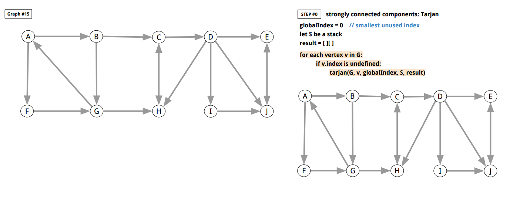
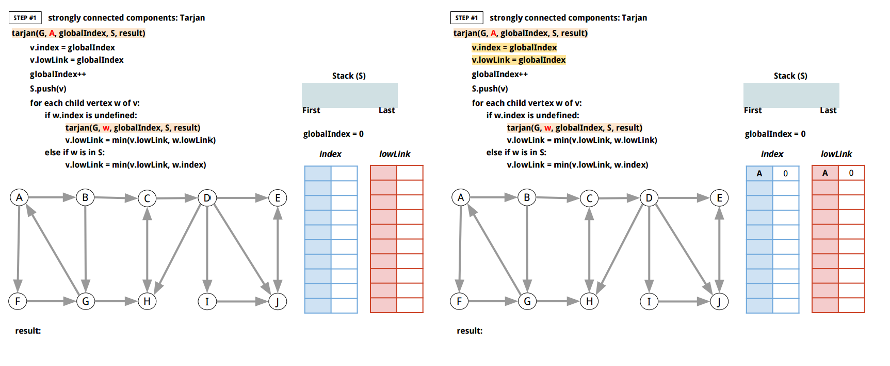
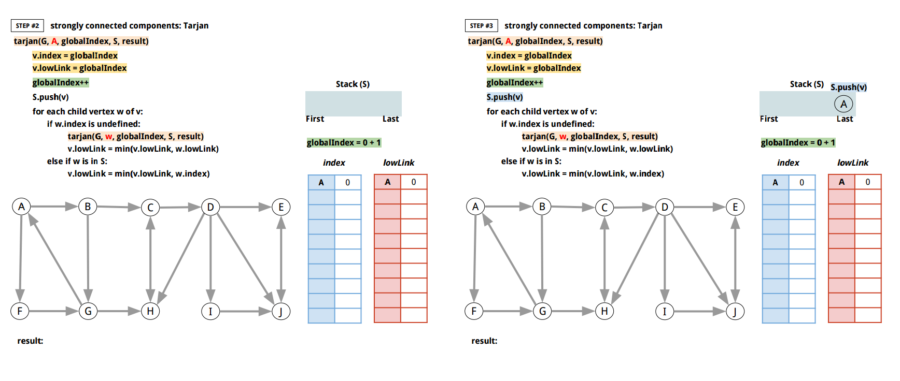
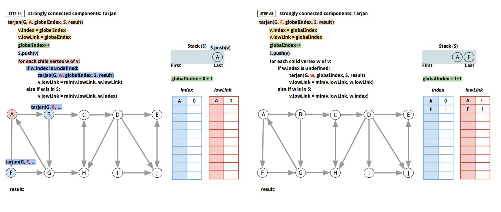
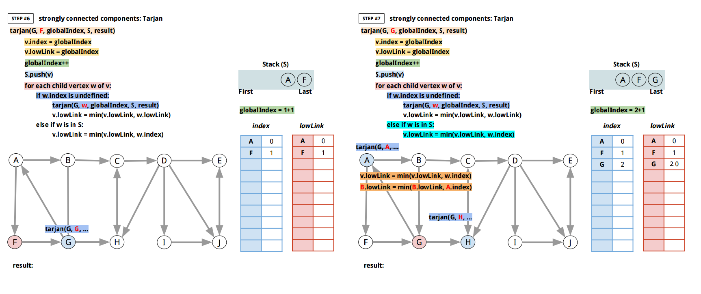
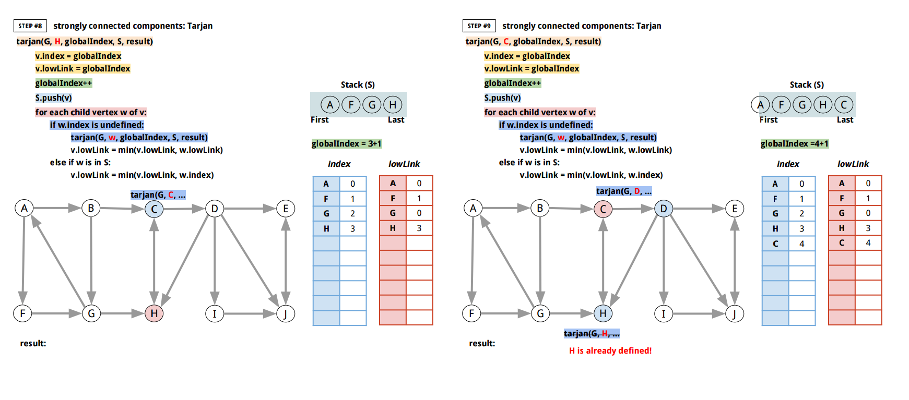
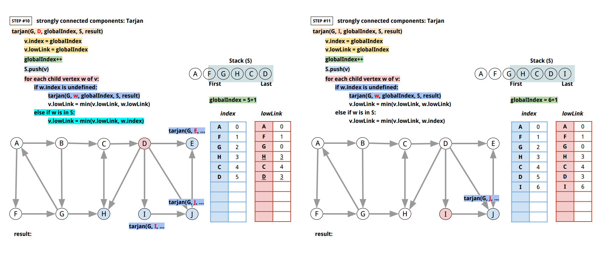
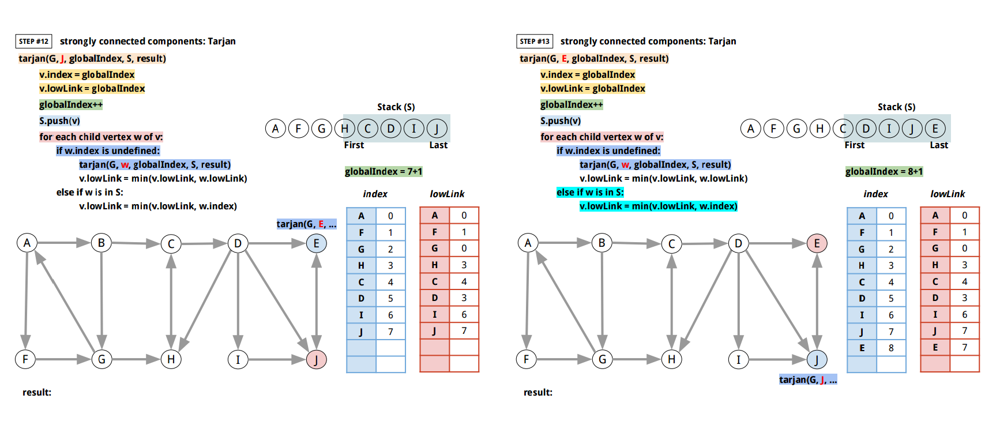
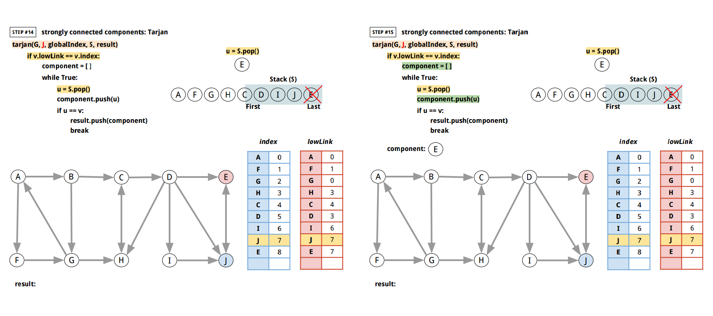
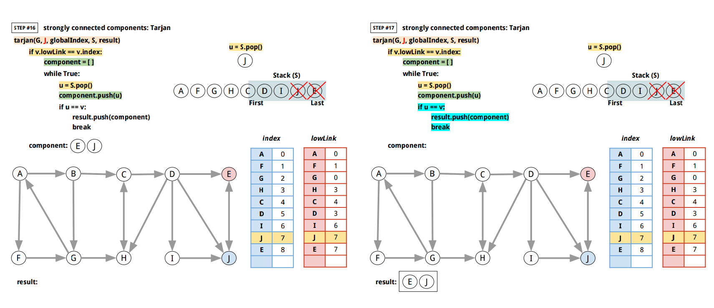
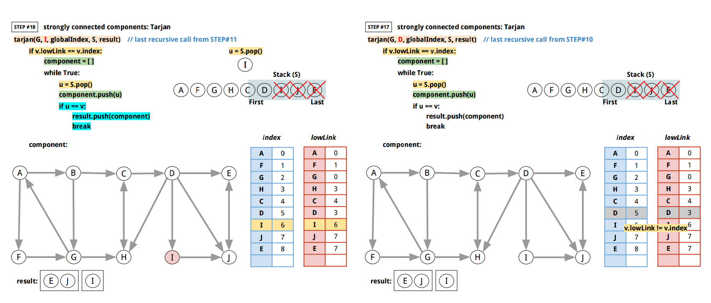
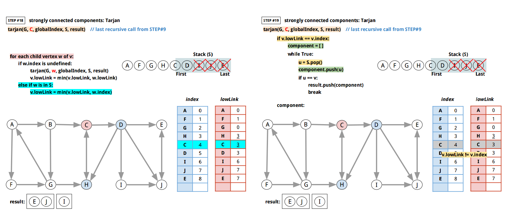
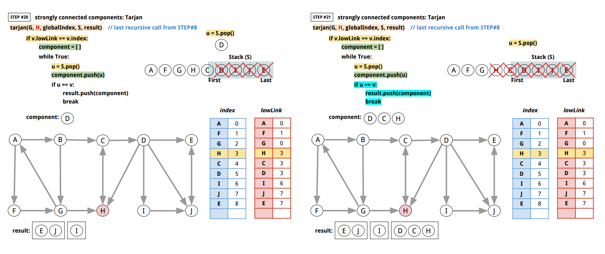
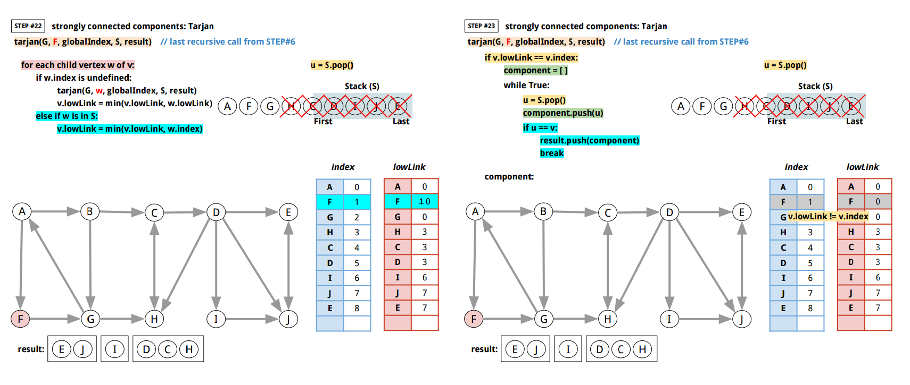
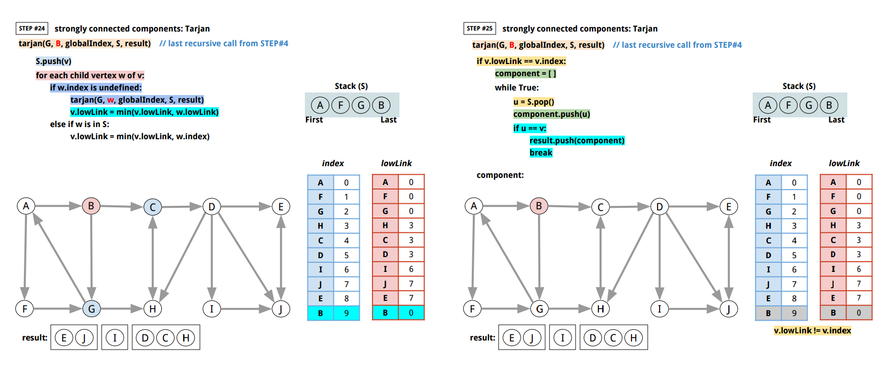
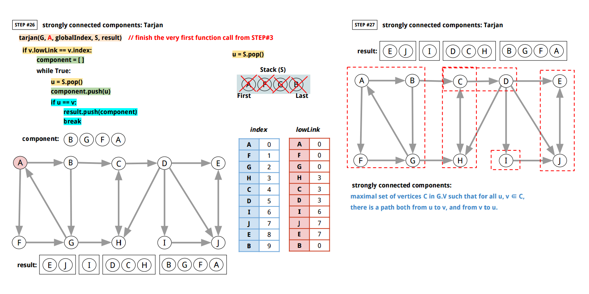

<br>

Here's Go implementation:

```go
package main

import (
	"bytes"
	"encoding/json"
	"fmt"
	"io"
	"log"
	"os"
	"sync"
)

// Tarjan finds the strongly connected components.
// In the mathematics, a directed graph is "strongly connected"
// if every vertex is reachable from every other node.
// Therefore, a graph is strongly connected if there is a path
// in each direction between each pair of node of a graph.
// Then a pair of vertices u and v is strongly connected to each other
// because there is a path in each direction.
// "Strongly connected components" of an arbitrary graph
// partition into sub-graphs that are themselves strongly connected.
// That is, "strongly connected component" of a directed graph
// is a sub-graph that is strongly connected.
// Formally, "Strongly connected components" of a graph is a maximal
// set of vertices C in G.V such that for all u, v ∈ C, there is a path
// both from u to v, and from v to u.
// (https://en.wikipedia.org/wiki/Tarjan%27s_strongly_connected_components_algorithm)
//
//	 0. Tarjan(G):
//	 1.
//	 2. 	globalIndex = 0 // smallest unused index
//	 3. 	let S be a stack
//	 4. 	result = [][]
//	 5.
//	 6. 	for each vertex v in G:
//	 7. 		if v.index is undefined:
//	 8. 			tarjan(G, v, globalIndex, S, result)
//	 9.
//	10. 	return result
//	11.
//	12.
//	13. tarjan(G, v, globalIndex, S, result):
//	14.
//	15. 	v.index = globalIndex
//	16. 	v.lowLink = globalIndex
//	17. 	globalIndex++
//	18. 	S.push(v)
//	19.
//	20. 	for each child vertex w of v:
//	21.
//	22. 		if w.index is undefined:
//	23. 			recursively tarjan(G, w, globalIndex, S, result)
//	24. 			v.lowLink = min(v.lowLink, w.lowLink)
//	25.
//	26. 		else if w is in S:
//	27. 			v.lowLink = min(v.lowLink, w.index)
//	28.
//	29. 	// if v is the root
//	30. 	if v.lowLink == v.index:
//	31.
//	32. 		// start a new strongly connected component
//	33. 		component = []
//	34.
//	35. 		while True:
//	36.
//	37. 			u = S.pop()
//	38. 			component.push(u)
//	39.
//	40. 			if u == v:
//	41. 				result.push(component)
//	42. 				break
//
func Tarjan(g Graph) [][]ID {
	d := newTarjanData()

	// for each vertex v in G:
	for v := range g.GetNodes() {
		// if v.index is undefined:
		if _, ok := d.index[v]; !ok {
			// tarjan(G, v, globalIndex, S, result)
			tarjan(g, v, d)
		}
	}
	return d.result
}

type tarjanData struct {
	mu sync.Mutex // guards the following

	// globalIndex is the smallest unused index
	globalIndex int

	// index is an index of a node to record
	// the order of being discovered.
	index map[ID]int

	// lowLink is the smallest index of any index
	// reachable from v, including v itself.
	lowLink map[ID]int

	// S is the stack.
	S []ID

	// extra map to check if a vertex is in S.
	smap map[ID]struct{}

	result [][]ID
}

func newTarjanData() *tarjanData {
	return &tarjanData{
		globalIndex: 0,
		index:       make(map[ID]int),
		lowLink:     make(map[ID]int),
		S:           []ID{},
		smap:        make(map[ID]struct{}),
		result:      [][]ID{},
	}
}

func tarjan(
	g Graph,
	id ID,
	data *tarjanData,
) {
	// This is not inherently parallelizable problem,
	// but just to make sure.
	data.mu.Lock()

	// v.index = globalIndex
	data.index[id] = data.globalIndex

	// v.lowLink = globalIndex
	data.lowLink[id] = data.globalIndex

	// globalIndex++
	data.globalIndex++

	// S.push(v)
	data.S = append(data.S, id)
	data.smap[id] = struct{}{}

	data.mu.Unlock()

	// for each child vertex w of v:
	cmap, err := g.GetTargets(id)
	if err != nil {
		panic(err)
	}
	for w := range cmap {

		// if w.index is undefined:
		if _, ok := data.index[w]; !ok {

			// recursively tarjan(G, w, globalIndex, S, result)
			tarjan(g, w, data)

			// v.lowLink = min(v.lowLink, w.lowLink)
			data.lowLink[id] = min(data.lowLink[id], data.lowLink[w])

		} else if _, ok := data.smap[w]; ok {
			// else if w is in S:

			// v.lowLink = min(v.lowLink, w.index)
			data.lowLink[id] = min(data.lowLink[id], data.index[w])
		}
	}

	data.mu.Lock()
	defer data.mu.Unlock()

	// if v is the root
	// if v.lowLink == v.index:
	if data.lowLink[id] == data.index[id] {
		// start a new strongly connected component
		component := []ID{}

		// while True:
		for {

			// u = S.pop()
			u := data.S[len(data.S)-1]
			data.S = data.S[:len(data.S)-1 : len(data.S)-1]
			delete(data.smap, u)

			// component.push(u)
			component = append(component, u)

			// if u == v:
			if u == id {
				data.result = append(data.result, component)
				break
			}
		}
	}
}

func min(a, b int) int {
	if a < b {
		return a
	}
	return b
}

func main() {
	f, err := os.Open("graph.json")
	if err != nil {
		panic(err)
	}
	defer f.Close()
	g, err := NewGraphFromJSON(f, "graph_15")
	if err != nil {
		panic(err)
	}
	scc := Tarjan(g)
	if len(scc) != 4 {
		log.Fatalf("Expected 4 but %v", scc)
	}
	fmt.Println("Tarjan graph_15:", scc)
	// Tarjan graph_15: [[E J] [I] [H D C] [F A G B]]
}

// ID is unique identifier.
type ID interface {
	// String returns the string ID.
	String() string
}

type StringID string

func (s StringID) String() string {
	return string(s)
}

// Node is vertex. The ID must be unique within the graph.
type Node interface {
	// ID returns the ID.
	ID() ID
	String() string
}

type node struct {
	id string
}

var nodeCnt uint64

func NewNode(id string) Node {
	return &node{
		id: id,
	}
}

func (n *node) ID() ID {
	return StringID(n.id)
}

func (n *node) String() string {
	return n.id
}

// Edge connects between two Nodes.
type Edge interface {
	Source() Node
	Target() Node
	Weight() float64
	String() string
}

// edge is an Edge from Source to Target.
type edge struct {
	src Node
	tgt Node
	wgt float64
}

func NewEdge(src, tgt Node, wgt float64) Edge {
	return &edge{
		src: src,
		tgt: tgt,
		wgt: wgt,
	}
}

func (e *edge) Source() Node {
	return e.src
}

func (e *edge) Target() Node {
	return e.tgt
}

func (e *edge) Weight() float64 {
	return e.wgt
}

func (e *edge) String() string {
	return fmt.Sprintf("%s -- %.3f -→ %s\n", e.src, e.wgt, e.tgt)
}

type EdgeSlice []Edge

func (e EdgeSlice) Len() int           { return len(e) }
func (e EdgeSlice) Less(i, j int) bool { return e[i].Weight() < e[j].Weight() }
func (e EdgeSlice) Swap(i, j int)      { e[i], e[j] = e[j], e[i] }

// Graph describes the methods of graph operations.
// It assumes that the identifier of a Node is unique.
// And weight values is float64.
type Graph interface {
	// Init initializes a Graph.
	Init()

	// GetNodeCount returns the total number of nodes.
	GetNodeCount() int

	// GetNode finds the Node. It returns nil if the Node
	// does not exist in the graph.
	GetNode(id ID) Node

	// GetNodes returns a map from node ID to
	// empty struct value. Graph does not allow duplicate
	// node ID or name.
	GetNodes() map[ID]Node

	// AddNode adds a node to a graph, and returns false
	// if the node already existed in the graph.
	AddNode(nd Node) bool

	// DeleteNode deletes a node from a graph.
	// It returns true if it got deleted.
	// And false if it didn't get deleted.
	DeleteNode(id ID) bool

	// AddEdge adds an edge from nd1 to nd2 with the weight.
	// It returns error if a node does not exist.
	AddEdge(id1, id2 ID, weight float64) error

	// ReplaceEdge replaces an edge from id1 to id2 with the weight.
	ReplaceEdge(id1, id2 ID, weight float64) error

	// DeleteEdge deletes an edge from id1 to id2.
	DeleteEdge(id1, id2 ID) error

	// GetWeight returns the weight from id1 to id2.
	GetWeight(id1, id2 ID) (float64, error)

	// GetSources returns the map of parent Nodes.
	// (Nodes that come towards the argument vertex.)
	GetSources(id ID) (map[ID]Node, error)

	// GetTargets returns the map of child Nodes.
	// (Nodes that go out of the argument vertex.)
	GetTargets(id ID) (map[ID]Node, error)

	// String describes the Graph.
	String() string
}

// graph is an internal default graph type that
// implements all methods in Graph interface.
type graph struct {
	mu sync.RWMutex // guards the following

	// idToNodes stores all nodes.
	idToNodes map[ID]Node

	// nodeToSources maps a Node identifer to sources(parents) with edge weights.
	nodeToSources map[ID]map[ID]float64

	// nodeToTargets maps a Node identifer to targets(children) with edge weights.
	nodeToTargets map[ID]map[ID]float64
}

// newGraph returns a new graph.
func newGraph() *graph {
	return &graph{
		idToNodes:     make(map[ID]Node),
		nodeToSources: make(map[ID]map[ID]float64),
		nodeToTargets: make(map[ID]map[ID]float64),
		//
		// without this
		// panic: assignment to entry in nil map
	}
}

// NewGraph returns a new graph.
func NewGraph() Graph {
	return newGraph()
}

func (g *graph) Init() {
	// (X) g = newGraph()
	// this only updates the pointer
	//
	//
	// (X) *g = *newGraph()
	// assignment copies lock value

	g.idToNodes = make(map[ID]Node)
	g.nodeToSources = make(map[ID]map[ID]float64)
	g.nodeToTargets = make(map[ID]map[ID]float64)
}

func (g *graph) GetNodeCount() int {
	g.mu.RLock()
	defer g.mu.RUnlock()

	return len(g.idToNodes)
}

func (g *graph) GetNode(id ID) Node {
	g.mu.RLock()
	defer g.mu.RUnlock()

	return g.idToNodes[id]
}

func (g *graph) GetNodes() map[ID]Node {
	g.mu.RLock()
	defer g.mu.RUnlock()

	return g.idToNodes
}

func (g *graph) unsafeExistID(id ID) bool {
	_, ok := g.idToNodes[id]
	return ok
}

func (g *graph) AddNode(nd Node) bool {
	g.mu.Lock()
	defer g.mu.Unlock()

	if g.unsafeExistID(nd.ID()) {
		return false
	}

	id := nd.ID()
	g.idToNodes[id] = nd
	return true
}

func (g *graph) DeleteNode(id ID) bool {
	g.mu.Lock()
	defer g.mu.Unlock()

	if !g.unsafeExistID(id) {
		return false
	}

	delete(g.idToNodes, id)

	delete(g.nodeToTargets, id)
	for _, smap := range g.nodeToTargets {
		delete(smap, id)
	}

	delete(g.nodeToSources, id)
	for _, smap := range g.nodeToSources {
		delete(smap, id)
	}

	return true
}

func (g *graph) AddEdge(id1, id2 ID, weight float64) error {
	g.mu.Lock()
	defer g.mu.Unlock()

	if !g.unsafeExistID(id1) {
		return fmt.Errorf("%s does not exist in the graph.", id1)
	}
	if !g.unsafeExistID(id2) {
		return fmt.Errorf("%s does not exist in the graph.", id2)
	}

	if _, ok := g.nodeToTargets[id1]; ok {
		if v, ok2 := g.nodeToTargets[id1][id2]; ok2 {
			g.nodeToTargets[id1][id2] = v + weight
		} else {
			g.nodeToTargets[id1][id2] = weight
		}
	} else {
		tmap := make(map[ID]float64)
		tmap[id2] = weight
		g.nodeToTargets[id1] = tmap
	}
	if _, ok := g.nodeToSources[id2]; ok {
		if v, ok2 := g.nodeToSources[id2][id1]; ok2 {
			g.nodeToSources[id2][id1] = v + weight
		} else {
			g.nodeToSources[id2][id1] = weight
		}
	} else {
		tmap := make(map[ID]float64)
		tmap[id1] = weight
		g.nodeToSources[id2] = tmap
	}

	return nil
}

func (g *graph) ReplaceEdge(id1, id2 ID, weight float64) error {
	g.mu.Lock()
	defer g.mu.Unlock()

	if !g.unsafeExistID(id1) {
		return fmt.Errorf("%s does not exist in the graph.", id1)
	}
	if !g.unsafeExistID(id2) {
		return fmt.Errorf("%s does not exist in the graph.", id2)
	}

	if _, ok := g.nodeToTargets[id1]; ok {
		g.nodeToTargets[id1][id2] = weight
	} else {
		tmap := make(map[ID]float64)
		tmap[id2] = weight
		g.nodeToTargets[id1] = tmap
	}
	if _, ok := g.nodeToSources[id2]; ok {
		g.nodeToSources[id2][id1] = weight
	} else {
		tmap := make(map[ID]float64)
		tmap[id1] = weight
		g.nodeToSources[id2] = tmap
	}
	return nil
}

func (g *graph) DeleteEdge(id1, id2 ID) error {
	g.mu.Lock()
	defer g.mu.Unlock()

	if !g.unsafeExistID(id1) {
		return fmt.Errorf("%s does not exist in the graph.", id1)
	}
	if !g.unsafeExistID(id2) {
		return fmt.Errorf("%s does not exist in the graph.", id2)
	}

	if _, ok := g.nodeToTargets[id1]; ok {
		if _, ok := g.nodeToTargets[id1][id2]; ok {
			delete(g.nodeToTargets[id1], id2)
		}
	}
	if _, ok := g.nodeToSources[id2]; ok {
		if _, ok := g.nodeToSources[id2][id1]; ok {
			delete(g.nodeToSources[id2], id1)
		}
	}
	return nil
}

func (g *graph) GetWeight(id1, id2 ID) (float64, error) {
	g.mu.RLock()
	defer g.mu.RUnlock()

	if !g.unsafeExistID(id1) {
		return 0, fmt.Errorf("%s does not exist in the graph.", id1)
	}
	if !g.unsafeExistID(id2) {
		return 0, fmt.Errorf("%s does not exist in the graph.", id2)
	}

	if _, ok := g.nodeToTargets[id1]; ok {
		if v, ok := g.nodeToTargets[id1][id2]; ok {
			return v, nil
		}
	}
	return 0.0, fmt.Errorf("there is no edge from %s to %s", id1, id2)
}

func (g *graph) GetSources(id ID) (map[ID]Node, error) {
	g.mu.RLock()
	defer g.mu.RUnlock()

	if !g.unsafeExistID(id) {
		return nil, fmt.Errorf("%s does not exist in the graph.", id)
	}

	rs := make(map[ID]Node)
	if _, ok := g.nodeToSources[id]; ok {
		for n := range g.nodeToSources[id] {
			rs[n] = g.idToNodes[n]
		}
	}
	return rs, nil
}

func (g *graph) GetTargets(id ID) (map[ID]Node, error) {
	g.mu.RLock()
	defer g.mu.RUnlock()

	if !g.unsafeExistID(id) {
		return nil, fmt.Errorf("%s does not exist in the graph.", id)
	}

	rs := make(map[ID]Node)
	if _, ok := g.nodeToTargets[id]; ok {
		for n := range g.nodeToTargets[id] {
			rs[n] = g.idToNodes[n]
		}
	}
	return rs, nil
}

func (g *graph) String() string {
	g.mu.RLock()
	defer g.mu.RUnlock()

	buf := new(bytes.Buffer)
	for id1, nd1 := range g.idToNodes {
		nmap, _ := g.GetTargets(id1)
		for id2, nd2 := range nmap {
			weight, _ := g.GetWeight(id1, id2)
			fmt.Fprintf(buf, "%s -- %.3f -→ %s\n", nd1, weight, nd2)
		}
	}
	return buf.String()
}

// NewGraphFromJSON returns a new Graph from a JSON file.
// Here's the sample JSON data:
//
//	{
//	    "graph_00": {
//	        "S": {
//	            "A": 100,
//	            "B": 14,
//	            "C": 200
//	        },
//	        "A": {
//	            "S": 15,
//	            "B": 5,
//	            "D": 20,
//	            "T": 44
//	        },
//	        "B": {
//	            "S": 14,
//	            "A": 5,
//	            "D": 30,
//	            "E": 18
//	        },
//	        "C": {
//	            "S": 9,
//	            "E": 24
//	        },
//	        "D": {
//	            "A": 20,
//	            "B": 30,
//	            "E": 2,
//	            "F": 11,
//	            "T": 16
//	        },
//	        "E": {
//	            "B": 18,
//	            "C": 24,
//	            "D": 2,
//	            "F": 6,
//	            "T": 19
//	        },
//	        "F": {
//	            "D": 11,
//	            "E": 6,
//	            "T": 6
//	        },
//	        "T": {
//	            "A": 44,
//	            "D": 16,
//	            "F": 6,
//	            "E": 19
//	        }
//	    },
//	}
//
func NewGraphFromJSON(rd io.Reader, graphID string) (Graph, error) {
	js := make(map[string]map[string]map[string]float64)
	dec := json.NewDecoder(rd)
	for {
		if err := dec.Decode(&js); err == io.EOF {
			break
		} else if err != nil {
			return nil, err
		}
	}
	if _, ok := js[graphID]; !ok {
		return nil, fmt.Errorf("%s does not exist", graphID)
	}
	gmap := js[graphID]

	g := newGraph()
	for id1, mm := range gmap {
		nd1 := g.GetNode(StringID(id1))
		if nd1 == nil {
			nd1 = NewNode(id1)
			if ok := g.AddNode(nd1); !ok {
				return nil, fmt.Errorf("%s already exists", nd1)
			}
		}
		for id2, weight := range mm {
			nd2 := g.GetNode(StringID(id2))
			if nd2 == nil {
				nd2 = NewNode(id2)
				if ok := g.AddNode(nd2); !ok {
					return nil, fmt.Errorf("%s already exists", nd2)
				}
			}
			g.ReplaceEdge(nd1.ID(), nd2.ID(), weight)
		}
	}

	return g, nil
}

```

[↑ top](#go-graph-strongly-connected-components)
<br><br><br><br><hr>
