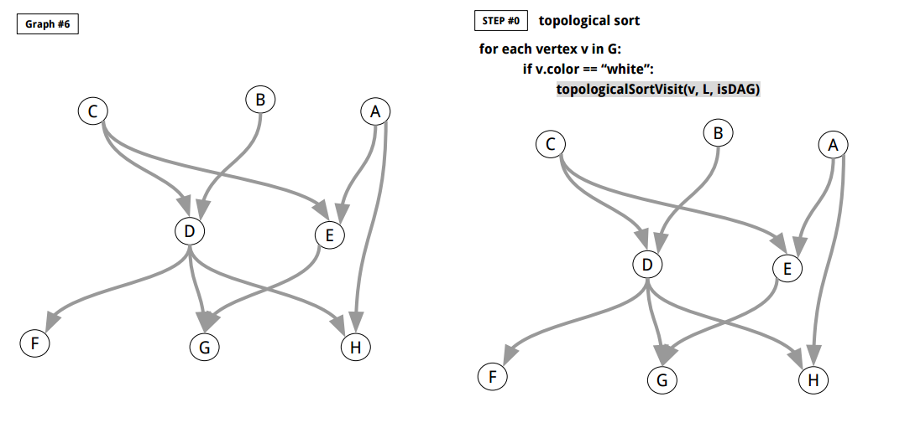
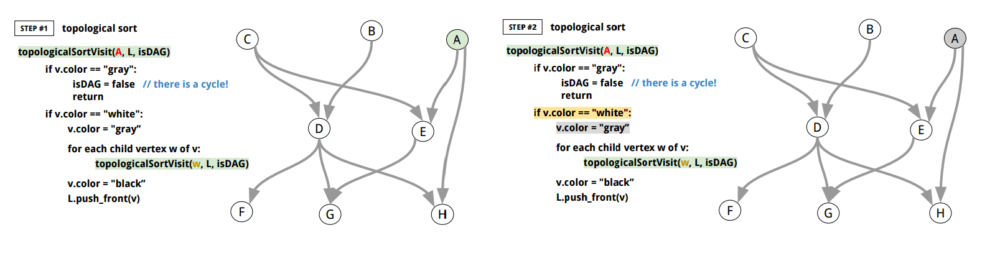
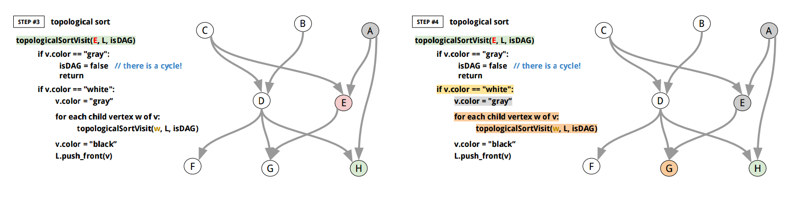
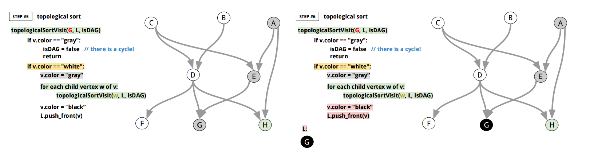
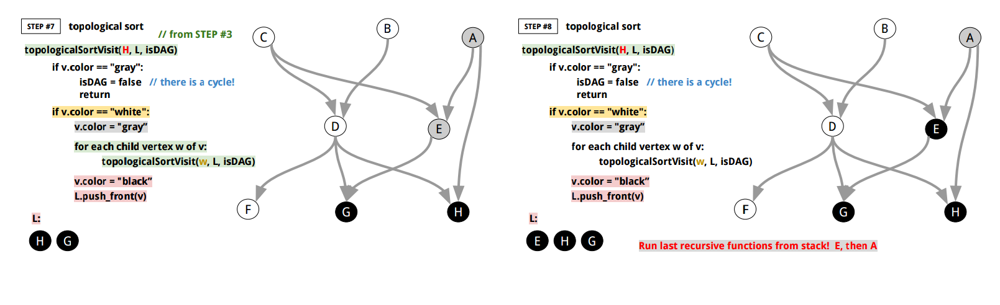
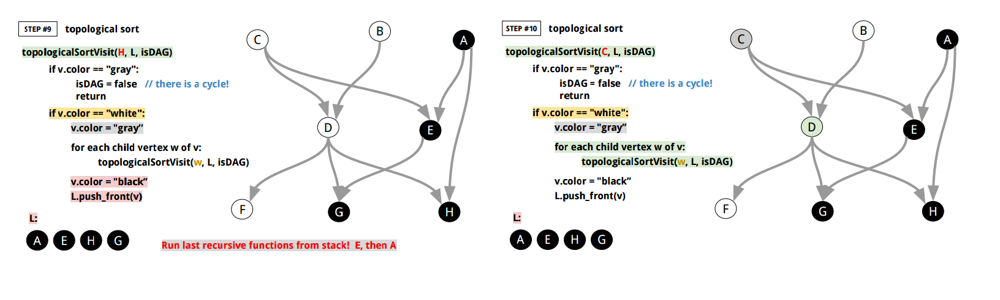
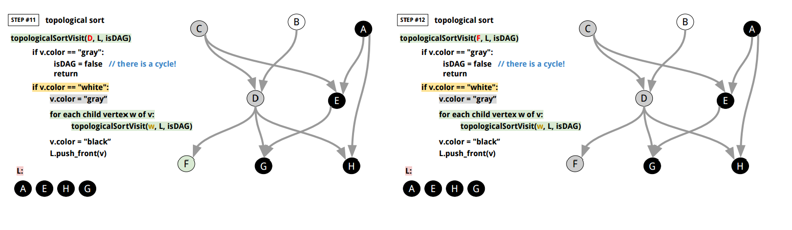
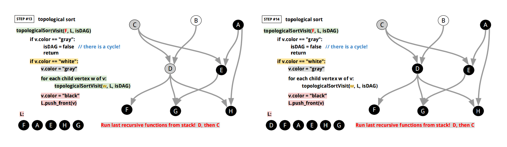
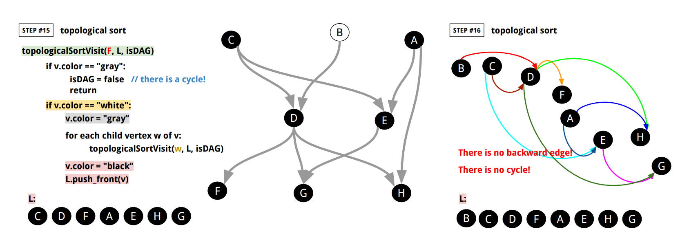

[*back to contents*](https://github.com/gyuho/learn#contents)<br>

# Go: graph, topological sort

- [Reference](#reference)
- [Topological sort](#topological-sort)

[↑ top](#go-graph-topological-sort)
<br><br><br><br><hr>


#### Reference

- [Topological sort](https://en.wikipedia.org/wiki/Topological_sorting)
- [**github.com/gyuho/goraph**](https://github.com/gyuho/goraph)

[↑ top](#go-graph-topological-sort)
<br><br><br><br><hr>


#### Topological sort

> In the field of computer science, a topological sort (sometimes abbreviated
> toposort) or topological ordering of a directed graph is a linear ordering
> of its vertices such that for every directed edge `uv` from vertex `u` to vertex
> `v`, `u` comes before `v` in the ordering. For instance, the vertices of the graph
> may represent tasks to be performed, and the edges may represent constraints
> that one task must be performed before another; in this application, a
> topological ordering is just a valid sequence for the tasks. A topological
> ordering is **possible if and only if** the graph has **no directed cycles**, that
> is, if it is a **directed acyclic graph (`DAG`)**. Any DAG has at least one
> topological ordering, and algorithms are known for constructing a topological
> ordering of any DAG in *linear time*.
>
> [*Topological sorting*](https://en.wikipedia.org/wiki/Topological_sorting)
> *by Wikipedia*

```
 0. TopologicalSort(G)
 1.
 2. 	L = Empty list that will contain the sorted nodes
 3. 	isDAG = true
 4.
 5. 	for each vertex v in G:
 6.
 7. 		if v.color == "white":
 8.
 9. 			topologicalSortVisit(v, L, isDAG)
10.
11.
12.
13.
14. topologicalSortVisit(v, L, isDAG)
15.
16. 	if v.color == "gray":
17. 		isDAG = false
18. 		return
19.
20. 	if v.color == "white":
21.
22. 		v.color = "gray":
23.
24.			for each child vertex w of v:
25. 			topologicalSortVisit(w, L, isDAG)
26.
27. 		v.color = "black"
28.			L.push_front(v)
```

<br>

Here's how it works:











<br>

Here's Go implementation:

```go
package main

import (
	"bytes"
	"encoding/json"
	"fmt"
	"io"
	"log"
	"os"
	"sync"
)

// TopologicalSort does topological sort(ordering) with DFS.
// It returns true if the graph is a DAG (no cycle, with a topological sort).
// False if the graph is not a DAG (cycle, with no topological sort).
//
//	 0. TopologicalSort(G)
//	 1.
//	 2. 	L = Empty list that will contain the sorted nodes
//	 3. 	isDAG = true
//	 4.
//	 5. 	for each vertex v in G:
//	 6.
//	 7. 		if v.color == "white":
//	 8.
//	 9. 			topologicalSortVisit(v, L, isDAG)
//	10.
//	11.
//	12.
//	13.
//	14. topologicalSortVisit(v, L, isDAG)
//	15.
//	16. 	if v.color == "gray":
//	17. 		isDAG = false
//	18. 		return
//	19.
//	20. 	if v.color == "white":
//	21.
//	22. 		v.color = "gray":
//	23.
//	24.			for each child vertex w of v:
//	25. 			topologicalSortVisit(w, L, isDAG)
//	26.
//	27. 		v.color = "black"
//	28.			L.push_front(v)
//
func TopologicalSort(g Graph) ([]ID, bool) {

	// L = Empty list that will contain the sorted nodes
	L := []ID{}
	isDAG := true
	color := make(map[ID]string)
	for v := range g.GetNodes() {
		color[v] = "white"
	}

	// for each vertex v in G:
	for v := range g.GetNodes() {
		// if v.color == "white":
		if color[v] == "white" {
			// topologicalSortVisit(v, L, isDAG)
			topologicalSortVisit(g, v, &L, &isDAG, &color)
		}
	}

	return L, isDAG
}

func topologicalSortVisit(
	g Graph,
	id ID,
	L *[]ID,
	isDAG *bool,
	color *map[ID]string,
) {

	// if v.color == "gray":
	if (*color)[id] == "gray" {
		// isDAG = false
		*isDAG = false
		return
	}

	// if v.color == "white":
	if (*color)[id] == "white" {
		// v.color = "gray":
		(*color)[id] = "gray"

		// for each child vertex w of v:
		cmap, err := g.GetTargets(id)
		if err != nil {
			panic(err)
		}
		for w := range cmap {
			// topologicalSortVisit(w, L, isDAG)
			topologicalSortVisit(g, w, L, isDAG, color)
		}

		// v.color = "black"
		(*color)[id] = "black"

		// L.push_front(v)
		temp := make([]ID, len(*L)+1)
		temp[0] = id
		copy(temp[1:], *L)
		*L = temp
	}
}

func main() {
	f, err := os.Open("graph.json")
	if err != nil {
		panic(err)
	}
	defer f.Close()
	g, err := NewGraphFromJSON(f, "graph_06")
	if err != nil {
		panic(err)
	}
	L, isDAG := TopologicalSort(g)
	if isDAG == false {
		log.Fatalf("there is no directed cycle in the graph so isDAG should be true but %+v %+v", L, isDAG)
	}
	fmt.Println("graph_06:", L)
	// graph_06: [C B D F A H E G]
}

// ID is unique identifier.
type ID interface {
	// String returns the string ID.
	String() string
}

type StringID string

func (s StringID) String() string {
	return string(s)
}

// Node is vertex. The ID must be unique within the graph.
type Node interface {
	// ID returns the ID.
	ID() ID
	String() string
}

type node struct {
	id string
}

var nodeCnt uint64

func NewNode(id string) Node {
	return &node{
		id: id,
	}
}

func (n *node) ID() ID {
	return StringID(n.id)
}

func (n *node) String() string {
	return n.id
}

// Edge connects between two Nodes.
type Edge interface {
	Source() Node
	Target() Node
	Weight() float64
	String() string
}

// edge is an Edge from Source to Target.
type edge struct {
	src Node
	tgt Node
	wgt float64
}

func NewEdge(src, tgt Node, wgt float64) Edge {
	return &edge{
		src: src,
		tgt: tgt,
		wgt: wgt,
	}
}

func (e *edge) Source() Node {
	return e.src
}

func (e *edge) Target() Node {
	return e.tgt
}

func (e *edge) Weight() float64 {
	return e.wgt
}

func (e *edge) String() string {
	return fmt.Sprintf("%s -- %.3f -→ %s\n", e.src, e.wgt, e.tgt)
}

type EdgeSlice []Edge

func (e EdgeSlice) Len() int           { return len(e) }
func (e EdgeSlice) Less(i, j int) bool { return e[i].Weight() < e[j].Weight() }
func (e EdgeSlice) Swap(i, j int)      { e[i], e[j] = e[j], e[i] }

// Graph describes the methods of graph operations.
// It assumes that the identifier of a Node is unique.
// And weight values is float64.
type Graph interface {
	// Init initializes a Graph.
	Init()

	// GetNodeCount returns the total number of nodes.
	GetNodeCount() int

	// GetNode finds the Node. It returns nil if the Node
	// does not exist in the graph.
	GetNode(id ID) Node

	// GetNodes returns a map from node ID to
	// empty struct value. Graph does not allow duplicate
	// node ID or name.
	GetNodes() map[ID]Node

	// AddNode adds a node to a graph, and returns false
	// if the node already existed in the graph.
	AddNode(nd Node) bool

	// DeleteNode deletes a node from a graph.
	// It returns true if it got deleted.
	// And false if it didn't get deleted.
	DeleteNode(id ID) bool

	// AddEdge adds an edge from nd1 to nd2 with the weight.
	// It returns error if a node does not exist.
	AddEdge(id1, id2 ID, weight float64) error

	// ReplaceEdge replaces an edge from id1 to id2 with the weight.
	ReplaceEdge(id1, id2 ID, weight float64) error

	// DeleteEdge deletes an edge from id1 to id2.
	DeleteEdge(id1, id2 ID) error

	// GetWeight returns the weight from id1 to id2.
	GetWeight(id1, id2 ID) (float64, error)

	// GetSources returns the map of parent Nodes.
	// (Nodes that come towards the argument vertex.)
	GetSources(id ID) (map[ID]Node, error)

	// GetTargets returns the map of child Nodes.
	// (Nodes that go out of the argument vertex.)
	GetTargets(id ID) (map[ID]Node, error)

	// String describes the Graph.
	String() string
}

// graph is an internal default graph type that
// implements all methods in Graph interface.
type graph struct {
	mu sync.RWMutex // guards the following

	// idToNodes stores all nodes.
	idToNodes map[ID]Node

	// nodeToSources maps a Node identifer to sources(parents) with edge weights.
	nodeToSources map[ID]map[ID]float64

	// nodeToTargets maps a Node identifer to targets(children) with edge weights.
	nodeToTargets map[ID]map[ID]float64
}

// newGraph returns a new graph.
func newGraph() *graph {
	return &graph{
		idToNodes:     make(map[ID]Node),
		nodeToSources: make(map[ID]map[ID]float64),
		nodeToTargets: make(map[ID]map[ID]float64),
		//
		// without this
		// panic: assignment to entry in nil map
	}
}

// NewGraph returns a new graph.
func NewGraph() Graph {
	return newGraph()
}

func (g *graph) Init() {
	// (X) g = newGraph()
	// this only updates the pointer
	//
	//
	// (X) *g = *newGraph()
	// assignment copies lock value

	g.idToNodes = make(map[ID]Node)
	g.nodeToSources = make(map[ID]map[ID]float64)
	g.nodeToTargets = make(map[ID]map[ID]float64)
}

func (g *graph) GetNodeCount() int {
	g.mu.RLock()
	defer g.mu.RUnlock()

	return len(g.idToNodes)
}

func (g *graph) GetNode(id ID) Node {
	g.mu.RLock()
	defer g.mu.RUnlock()

	return g.idToNodes[id]
}

func (g *graph) GetNodes() map[ID]Node {
	g.mu.RLock()
	defer g.mu.RUnlock()

	return g.idToNodes
}

func (g *graph) unsafeExistID(id ID) bool {
	_, ok := g.idToNodes[id]
	return ok
}

func (g *graph) AddNode(nd Node) bool {
	g.mu.Lock()
	defer g.mu.Unlock()

	if g.unsafeExistID(nd.ID()) {
		return false
	}

	id := nd.ID()
	g.idToNodes[id] = nd
	return true
}

func (g *graph) DeleteNode(id ID) bool {
	g.mu.Lock()
	defer g.mu.Unlock()

	if !g.unsafeExistID(id) {
		return false
	}

	delete(g.idToNodes, id)

	delete(g.nodeToTargets, id)
	for _, smap := range g.nodeToTargets {
		delete(smap, id)
	}

	delete(g.nodeToSources, id)
	for _, smap := range g.nodeToSources {
		delete(smap, id)
	}

	return true
}

func (g *graph) AddEdge(id1, id2 ID, weight float64) error {
	g.mu.Lock()
	defer g.mu.Unlock()

	if !g.unsafeExistID(id1) {
		return fmt.Errorf("%s does not exist in the graph.", id1)
	}
	if !g.unsafeExistID(id2) {
		return fmt.Errorf("%s does not exist in the graph.", id2)
	}

	if _, ok := g.nodeToTargets[id1]; ok {
		if v, ok2 := g.nodeToTargets[id1][id2]; ok2 {
			g.nodeToTargets[id1][id2] = v + weight
		} else {
			g.nodeToTargets[id1][id2] = weight
		}
	} else {
		tmap := make(map[ID]float64)
		tmap[id2] = weight
		g.nodeToTargets[id1] = tmap
	}
	if _, ok := g.nodeToSources[id2]; ok {
		if v, ok2 := g.nodeToSources[id2][id1]; ok2 {
			g.nodeToSources[id2][id1] = v + weight
		} else {
			g.nodeToSources[id2][id1] = weight
		}
	} else {
		tmap := make(map[ID]float64)
		tmap[id1] = weight
		g.nodeToSources[id2] = tmap
	}

	return nil
}

func (g *graph) ReplaceEdge(id1, id2 ID, weight float64) error {
	g.mu.Lock()
	defer g.mu.Unlock()

	if !g.unsafeExistID(id1) {
		return fmt.Errorf("%s does not exist in the graph.", id1)
	}
	if !g.unsafeExistID(id2) {
		return fmt.Errorf("%s does not exist in the graph.", id2)
	}

	if _, ok := g.nodeToTargets[id1]; ok {
		g.nodeToTargets[id1][id2] = weight
	} else {
		tmap := make(map[ID]float64)
		tmap[id2] = weight
		g.nodeToTargets[id1] = tmap
	}
	if _, ok := g.nodeToSources[id2]; ok {
		g.nodeToSources[id2][id1] = weight
	} else {
		tmap := make(map[ID]float64)
		tmap[id1] = weight
		g.nodeToSources[id2] = tmap
	}
	return nil
}

func (g *graph) DeleteEdge(id1, id2 ID) error {
	g.mu.Lock()
	defer g.mu.Unlock()

	if !g.unsafeExistID(id1) {
		return fmt.Errorf("%s does not exist in the graph.", id1)
	}
	if !g.unsafeExistID(id2) {
		return fmt.Errorf("%s does not exist in the graph.", id2)
	}

	if _, ok := g.nodeToTargets[id1]; ok {
		if _, ok := g.nodeToTargets[id1][id2]; ok {
			delete(g.nodeToTargets[id1], id2)
		}
	}
	if _, ok := g.nodeToSources[id2]; ok {
		if _, ok := g.nodeToSources[id2][id1]; ok {
			delete(g.nodeToSources[id2], id1)
		}
	}
	return nil
}

func (g *graph) GetWeight(id1, id2 ID) (float64, error) {
	g.mu.RLock()
	defer g.mu.RUnlock()

	if !g.unsafeExistID(id1) {
		return 0, fmt.Errorf("%s does not exist in the graph.", id1)
	}
	if !g.unsafeExistID(id2) {
		return 0, fmt.Errorf("%s does not exist in the graph.", id2)
	}

	if _, ok := g.nodeToTargets[id1]; ok {
		if v, ok := g.nodeToTargets[id1][id2]; ok {
			return v, nil
		}
	}
	return 0.0, fmt.Errorf("there is no edge from %s to %s", id1, id2)
}

func (g *graph) GetSources(id ID) (map[ID]Node, error) {
	g.mu.RLock()
	defer g.mu.RUnlock()

	if !g.unsafeExistID(id) {
		return nil, fmt.Errorf("%s does not exist in the graph.", id)
	}

	rs := make(map[ID]Node)
	if _, ok := g.nodeToSources[id]; ok {
		for n := range g.nodeToSources[id] {
			rs[n] = g.idToNodes[n]
		}
	}
	return rs, nil
}

func (g *graph) GetTargets(id ID) (map[ID]Node, error) {
	g.mu.RLock()
	defer g.mu.RUnlock()

	if !g.unsafeExistID(id) {
		return nil, fmt.Errorf("%s does not exist in the graph.", id)
	}

	rs := make(map[ID]Node)
	if _, ok := g.nodeToTargets[id]; ok {
		for n := range g.nodeToTargets[id] {
			rs[n] = g.idToNodes[n]
		}
	}
	return rs, nil
}

func (g *graph) String() string {
	g.mu.RLock()
	defer g.mu.RUnlock()

	buf := new(bytes.Buffer)
	for id1, nd1 := range g.idToNodes {
		nmap, _ := g.GetTargets(id1)
		for id2, nd2 := range nmap {
			weight, _ := g.GetWeight(id1, id2)
			fmt.Fprintf(buf, "%s -- %.3f -→ %s\n", nd1, weight, nd2)
		}
	}
	return buf.String()
}

// NewGraphFromJSON returns a new Graph from a JSON file.
// Here's the sample JSON data:
//
//	{
//	    "graph_00": {
//	        "S": {
//	            "A": 100,
//	            "B": 14,
//	            "C": 200
//	        },
//	        "A": {
//	            "S": 15,
//	            "B": 5,
//	            "D": 20,
//	            "T": 44
//	        },
//	        "B": {
//	            "S": 14,
//	            "A": 5,
//	            "D": 30,
//	            "E": 18
//	        },
//	        "C": {
//	            "S": 9,
//	            "E": 24
//	        },
//	        "D": {
//	            "A": 20,
//	            "B": 30,
//	            "E": 2,
//	            "F": 11,
//	            "T": 16
//	        },
//	        "E": {
//	            "B": 18,
//	            "C": 24,
//	            "D": 2,
//	            "F": 6,
//	            "T": 19
//	        },
//	        "F": {
//	            "D": 11,
//	            "E": 6,
//	            "T": 6
//	        },
//	        "T": {
//	            "A": 44,
//	            "D": 16,
//	            "F": 6,
//	            "E": 19
//	        }
//	    },
//	}
//
func NewGraphFromJSON(rd io.Reader, graphID string) (Graph, error) {
	js := make(map[string]map[string]map[string]float64)
	dec := json.NewDecoder(rd)
	for {
		if err := dec.Decode(&js); err == io.EOF {
			break
		} else if err != nil {
			return nil, err
		}
	}
	if _, ok := js[graphID]; !ok {
		return nil, fmt.Errorf("%s does not exist", graphID)
	}
	gmap := js[graphID]

	g := newGraph()
	for id1, mm := range gmap {
		nd1 := g.GetNode(StringID(id1))
		if nd1 == nil {
			nd1 = NewNode(id1)
			if ok := g.AddNode(nd1); !ok {
				return nil, fmt.Errorf("%s already exists", nd1)
			}
		}
		for id2, weight := range mm {
			nd2 := g.GetNode(StringID(id2))
			if nd2 == nil {
				nd2 = NewNode(id2)
				if ok := g.AddNode(nd2); !ok {
					return nil, fmt.Errorf("%s already exists", nd2)
				}
			}
			g.ReplaceEdge(nd1.ID(), nd2.ID(), weight)
		}
	}

	return g, nil
}

```

[↑ top](#go-graph-topological-sort)
<br><br><br><br><hr>
