[*back to contents*](https://github.com/gyuho/learn#contents)
<br>

# Go: graph, traversal

- [Reference](#reference)
- [graph traversal: BFS](#graph-traversal-bfs)
- [graph traversal: DFS](#graph-traversal-dfs)
- [graph traversal: DFS recursion](#graph-traversal-dfs-recursion)

[↑ top](#go-graph-traversal)
<br><br><br><br>
<hr>


#### Reference

- [Graph theory](https://en.wikipedia.org/wiki/Graph_theory)
- [Introduction to Graphs and Their Data Structures](https://www.topcoder.com/community/data-science/data-science-tutorials/introduction-to-graphs-and-their-data-structures-section-1/)
- [**My YouTube turorial Tree, Graph Theory Algorithms**](https://www.youtube.com/playlist?list=PLT6aABhFfinvsSn1H195JLuHaXNS6UVhf)
- [Graph Contraction II: Connectivity and MSTs](http://www.cs.cmu.edu/afs/cs/academic/class/15210-s12/www/lectures/lecture18.pdf)
- [Graph traversal](https://en.wikipedia.org/wiki/Graph_traversal)
- [**github.com/gyuho/goraph**](https://github.com/gyuho/goraph)

[↑ top](#go-graph-traversal)
<br><br><br><br>
<hr>


#### graph traversal: BFS

Graph traversal is visiting all nodes in a graph.
[Breadth-first search (`BFS`)](https://en.wikipedia.org/wiki/Breadth-first_search)
is a graph traversal algorithm. Its time complexity is `O(|V| + |E|)`.

- **Queue** (*FIFO* - first in first out): first inserted values gets popped off first.
- **Stack** (*LIFO* - last in first out): last inserted values gets popped off first.

`BFS` works for both directed and undirected graphs:
- It uses **queue**.
- It's useful for finding shortest paths.

<br>
Here's [pseudocode](http://en.wikipedia.org/wiki/Breadth-first_search):

```
 0. BFS(G, v):
 1.
 2. 	let Q be a queue
 3. 	Q.push(v)
 4. 	label v as visited
 5.
 6. 	while Q is not empty:
 7.
 8. 		u = Q.dequeue()
 9.
10. 		for each vertex w adjacent to u:
11.
12. 			if w is not visited yet:
13. 				Q.push(w)
14. 				label w as visited
```

<br>
Here's how it works:

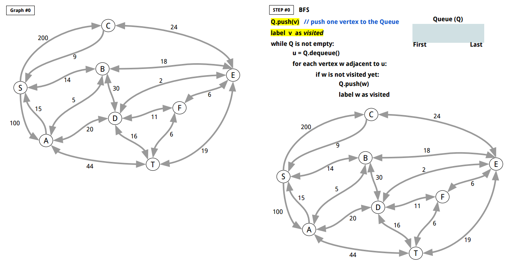
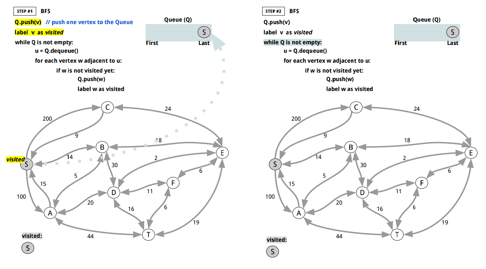
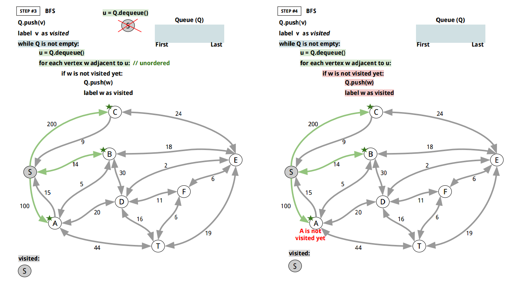
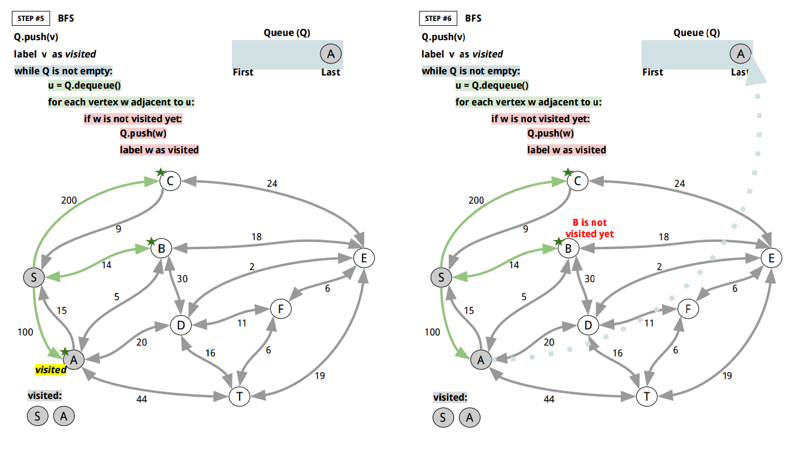
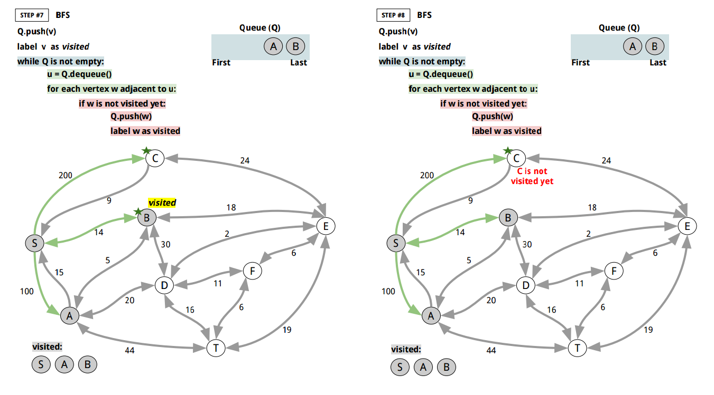
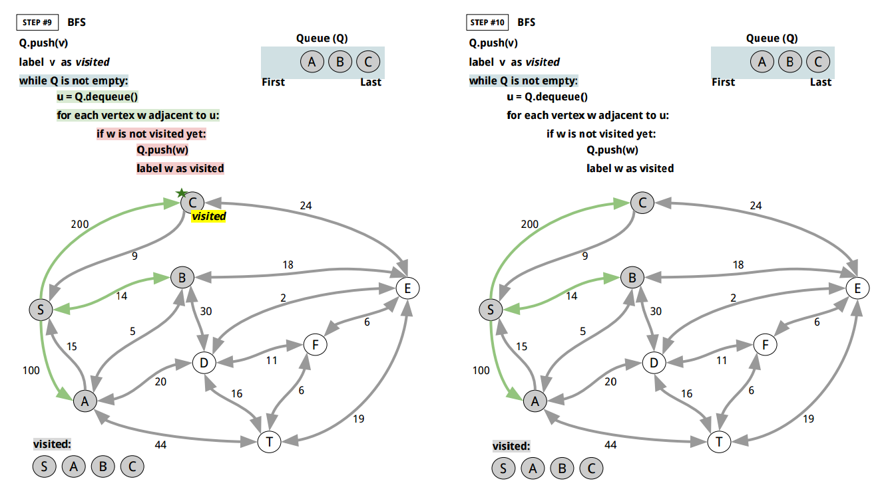
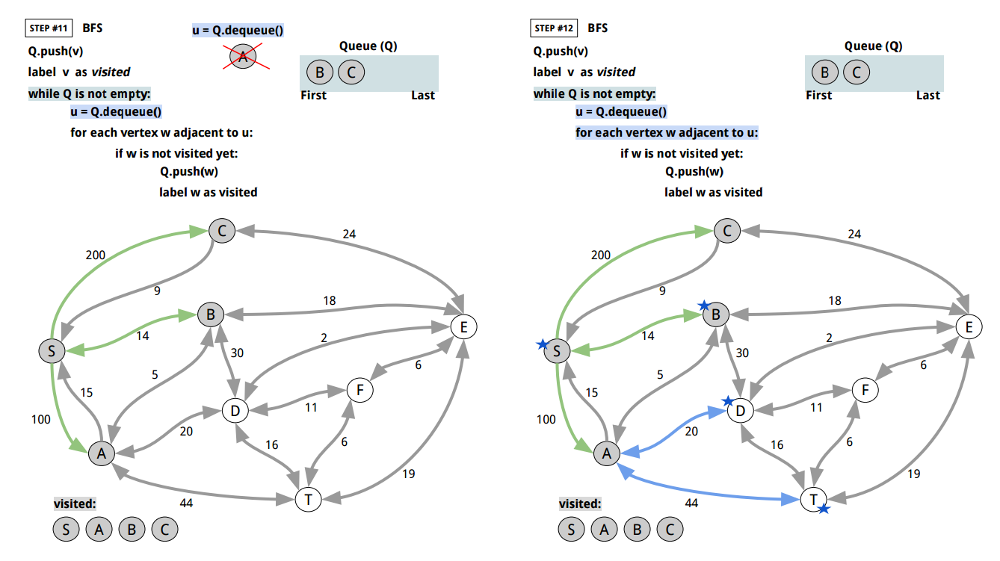
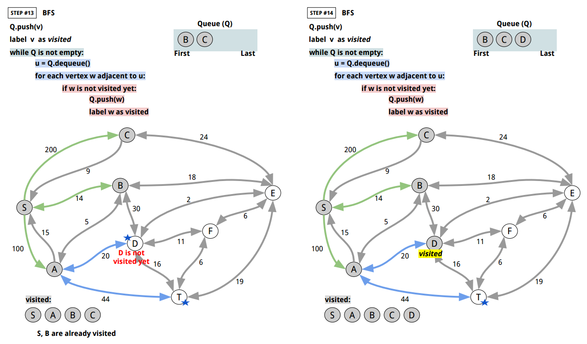
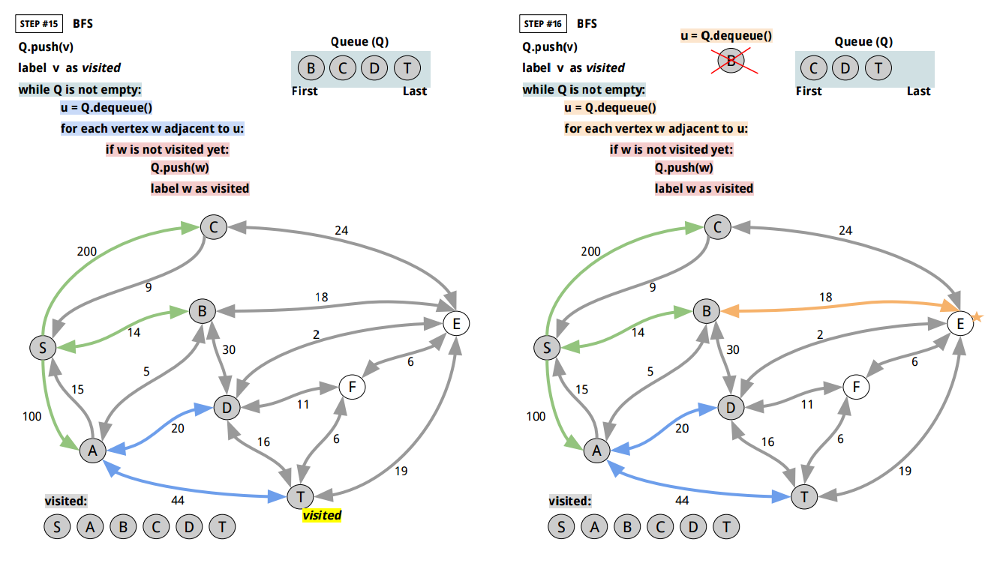
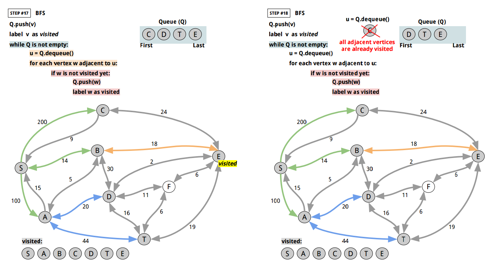
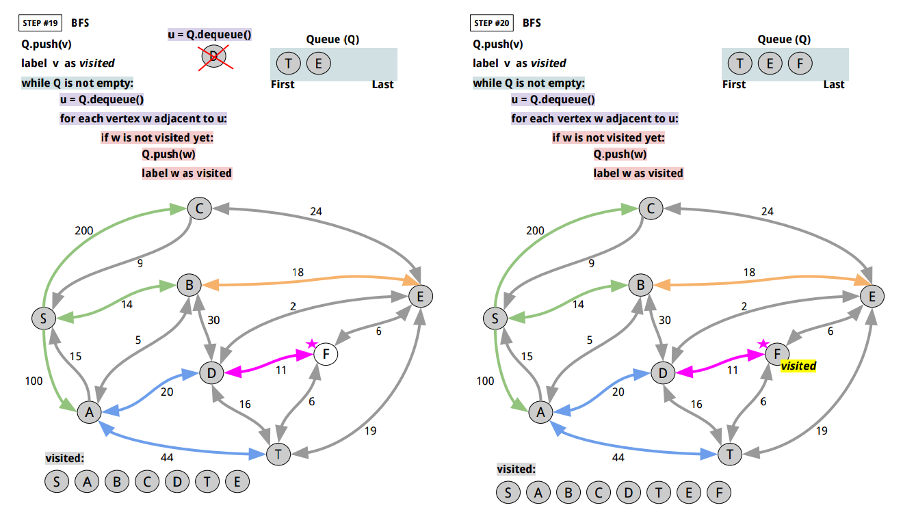
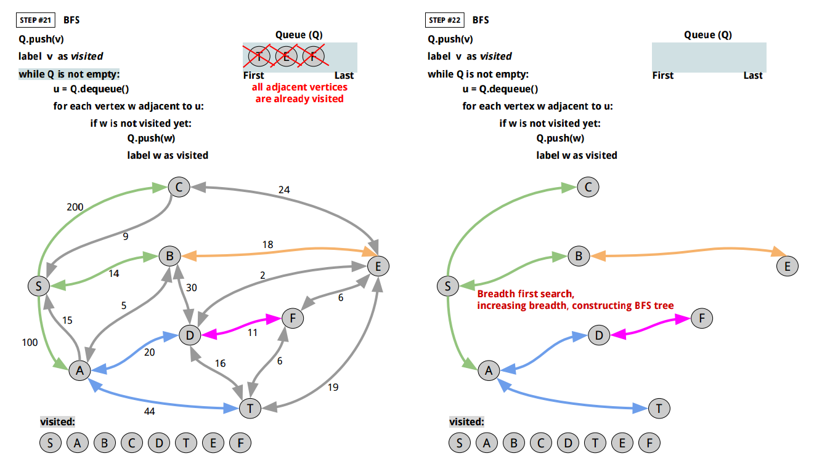

<br>
Here's Go implementation of `BFS`:

```go
package main

import (
	"bytes"
	"encoding/json"
	"fmt"
	"io"
	"log"
	"os"
	"sync"
)

// BFS does breadth-first search, and returns the list of vertices.
// (https://en.wikipedia.org/wiki/Breadth-first_search)
//
//	 0. BFS(G, v):
//	 1.
//	 2. 	let Q be a queue
//	 3. 	Q.push(v)
//	 4. 	label v as visited
//	 5.
//	 6. 	while Q is not empty:
//	 7.
//	 8. 		u = Q.dequeue()
//	 9.
//	10. 		for each vertex w adjacent to u:
//	11.
//	12. 			if w is not visited yet:
//	13. 				Q.push(w)
//	14. 				label w as visited
//
func BFS(g Graph, vtx string) []string {

	if !g.FindVertex(vtx) {
		return nil
	}

	q := []string{vtx}
	visited := make(map[string]bool)
	visited[vtx] = true
	rs := []string{vtx}

	// while Q is not empty:
	for len(q) != 0 {

		u := q[0]
		q = q[1:len(q):len(q)]

		// for each vertex w adjacent to u:
		cmap, _ := g.GetChildren(u)
		for w := range cmap {
			// if w is not visited yet:
			if _, ok := visited[w]; !ok {
				q = append(q, w)  // Q.push(w)
				visited[w] = true // label w as visited

				rs = append(rs, w)
			}
		}
		pmap, _ := g.GetParents(u)
		for w := range pmap {
			// if w is not visited yet:
			if _, ok := visited[w]; !ok {
				q = append(q, w)  // Q.push(w)
				visited[w] = true // label w as visited

				rs = append(rs, w)
			}
		}
	}

	return rs
}

func main() {
	f, err := os.Open("graph.json")
	if err != nil {
		panic(err)
	}
	defer f.Close()
	g, err := NewDefaultGraphFromJSON(f, "graph_00")
	if err != nil {
		panic(err)
	}
	rs := BFS(g, "S")
	fmt.Println("BFS:", rs) // [S A B C D T E F]
	if len(rs) != 8 {
		log.Fatalf("should be 8 vertices but %s", g)
	}
}

// Graph describes the methods of graph operations.
// It assumes that the identifier of a Vertex is string and unique.
// And weight values is float64.
type Graph interface {
	// Init initializes a Graph.
	Init()

	// GetVertices returns a map from vertex ID to
	// empty struct value. Graph does not allow duplicate
	// vertex ID.
	GetVertices() map[string]struct{}

	// FindVertex returns true if the vertex already
	// exists in the graph.
	FindVertex(vtx string) bool

	// AddVertex adds a vertex to a graph, and returns false
	// if the vertex already existed in the graph.
	AddVertex(vtx string) bool

	// DeleteVertex deletes a vertex from a graph.
	// It returns true if it got deleted.
	// And false if it didn't get deleted.
	DeleteVertex(vtx string) bool

	// AddEdge adds an edge from vtx1 to vtx2 with the weight.
	AddEdge(vtx1, vtx2 string, weight float64) error

	// ReplaceEdge replaces an edge from vtx1 to vtx2 with the weight.
	ReplaceEdge(vtx1, vtx2 string, weight float64) error

	// DeleteEdge deletes an edge from vtx1 to vtx2.
	DeleteEdge(vtx1, vtx2 string) error

	// GetWeight returns the weight from vtx1 to vtx2.
	GetWeight(vtx1, vtx2 string) (float64, error)

	// GetParents returns the map of parent vertices.
	// (Vertices that come towards the argument vertex.)
	GetParents(vtx string) (map[string]struct{}, error)

	// GetChildren returns the map of child vertices.
	// (Vertices that go out of the argument vertex.)
	GetChildren(vtx string) (map[string]struct{}, error)

	// String describes the Graph.
	String() string
}

// defaultGraph is an internal default graph type that
// implements all methods in Graph interface.
type defaultGraph struct {
	mu sync.Mutex // guards the following

	// Vertices stores all vertices.
	Vertices map[string]struct{}

	// VertexToChildren maps a Vertex identifer to children with edge weights.
	VertexToChildren map[string]map[string]float64

	// VertexToParents maps a Vertex identifer to parents with edge weights.
	VertexToParents map[string]map[string]float64
}

// newDefaultGraph returns a new defaultGraph.
func newDefaultGraph() *defaultGraph {
	return &defaultGraph{
		Vertices:         make(map[string]struct{}),
		VertexToChildren: make(map[string]map[string]float64),
		VertexToParents:  make(map[string]map[string]float64),
		//
		// without this
		// panic: assignment to entry in nil map
	}
}

// NewDefaultGraph returns a new defaultGraph.
func NewDefaultGraph() Graph {
	return newDefaultGraph()
}

// newDefaultGraphFromJSON creates a graph Data from JSON.
// Here's the sample JSON data:
//
//	{
//	    "graph_00": {
//	        "S": {
//	            "A": 100,
//	            "B": 14,
//	            "C": 200
//	        },
//	        "A": {
//	            "S": 15,
//	            "B": 5,
//	            "D": 20,
//	            "T": 44
//	        },
//	        "B": {
//	            "S": 14,
//	            "A": 5,
//	            "D": 30,
//	            "E": 18
//	        },
//	        "C": {
//	            "S": 9,
//	            "E": 24
//	        },
//	        "D": {
//	            "A": 20,
//	            "B": 30,
//	            "E": 2,
//	            "F": 11,
//	            "T": 16
//	        },
//	        "E": {
//	            "B": 18,
//	            "C": 24,
//	            "D": 2,
//	            "F": 6,
//	            "T": 19
//	        },
//	        "F": {
//	            "D": 11,
//	            "E": 6,
//	            "T": 6
//	        },
//	        "T": {
//	            "A": 44,
//	            "D": 16,
//	            "F": 6,
//	            "E": 19
//	        }
//	    },
//	}
//
func newDefaultGraphFromJSON(rd io.Reader, graphID string) (*defaultGraph, error) {
	js := make(map[string]map[string]map[string]float64)
	dec := json.NewDecoder(rd)
	for {
		if err := dec.Decode(&js); err == io.EOF {
			break
		} else if err != nil {
			return nil, err
		}
	}
	if _, ok := js[graphID]; !ok {
		return nil, fmt.Errorf("%s does not exist", graphID)
	}
	gmap := js[graphID]
	g := newDefaultGraph()
	for vtx1, mm := range gmap {
		if !g.FindVertex(vtx1) {
			g.AddVertex(vtx1)
		}
		for vtx2, weight := range mm {
			if !g.FindVertex(vtx2) {
				g.AddVertex(vtx2)
			}
			g.ReplaceEdge(vtx1, vtx2, weight)
		}
	}
	return g, nil
}

// NewDefaultGraphFromJSON returns a new defaultGraph from a JSON file.
func NewDefaultGraphFromJSON(rd io.Reader, graphID string) (Graph, error) {
	return newDefaultGraphFromJSON(rd, graphID)
}

func (g *defaultGraph) Init() {
	// (X) g = newDefaultGraph()
	// this only updates the pointer
	//
	*g = *newDefaultGraph()
}

func (g *defaultGraph) GetVertices() map[string]struct{} {
	g.mu.Lock()
	defer g.mu.Unlock()
	return g.Vertices
}

func (g *defaultGraph) FindVertex(vtx string) bool {
	g.mu.Lock()
	defer g.mu.Unlock()
	if _, ok := g.Vertices[vtx]; !ok {
		return false
	}
	return true
}

func (g *defaultGraph) AddVertex(vtx string) bool {
	g.mu.Lock()
	defer g.mu.Unlock()
	if _, ok := g.Vertices[vtx]; !ok {
		g.Vertices[vtx] = struct{}{}
		return true
	}
	return false
}

func (g *defaultGraph) DeleteVertex(vtx string) bool {
	g.mu.Lock()
	defer g.mu.Unlock()
	if _, ok := g.Vertices[vtx]; !ok {
		return false
	} else {
		delete(g.Vertices, vtx)
	}
	if _, ok := g.VertexToChildren[vtx]; ok {
		delete(g.VertexToChildren, vtx)
	}
	for _, smap := range g.VertexToChildren {
		if _, ok := smap[vtx]; ok {
			delete(smap, vtx)
		}
	}
	if _, ok := g.VertexToParents[vtx]; ok {
		delete(g.VertexToParents, vtx)
	}
	for _, smap := range g.VertexToParents {
		if _, ok := smap[vtx]; ok {
			delete(smap, vtx)
		}
	}
	return true
}

func (g *defaultGraph) AddEdge(vtx1, vtx2 string, weight float64) error {
	g.mu.Lock()
	defer g.mu.Unlock()
	if _, ok := g.Vertices[vtx1]; !ok {
		return fmt.Errorf("%s does not exist in the graph.", vtx1)
	}
	if _, ok := g.Vertices[vtx2]; !ok {
		return fmt.Errorf("%s does not exist in the graph.", vtx2)
	}
	if _, ok := g.VertexToChildren[vtx1]; ok {
		if v, ok2 := g.VertexToChildren[vtx1][vtx2]; ok2 {
			g.VertexToChildren[vtx1][vtx2] = v + weight
		} else {
			g.VertexToChildren[vtx1][vtx2] = weight
		}
	} else {
		tmap := make(map[string]float64)
		tmap[vtx2] = weight
		g.VertexToChildren[vtx1] = tmap
	}
	if _, ok := g.VertexToParents[vtx2]; ok {
		if v, ok2 := g.VertexToParents[vtx2][vtx1]; ok2 {
			g.VertexToParents[vtx2][vtx1] = v + weight
		} else {
			g.VertexToParents[vtx2][vtx1] = weight
		}
	} else {
		tmap := make(map[string]float64)
		tmap[vtx1] = weight
		g.VertexToParents[vtx2] = tmap
	}
	return nil
}

func (g *defaultGraph) ReplaceEdge(vtx1, vtx2 string, weight float64) error {
	g.mu.Lock()
	defer g.mu.Unlock()
	if _, ok := g.Vertices[vtx1]; !ok {
		return fmt.Errorf("%s does not exist in the graph.", vtx1)
	}
	if _, ok := g.Vertices[vtx2]; !ok {
		return fmt.Errorf("%s does not exist in the graph.", vtx2)
	}
	if _, ok := g.VertexToChildren[vtx1]; ok {
		g.VertexToChildren[vtx1][vtx2] = weight
	} else {
		tmap := make(map[string]float64)
		tmap[vtx2] = weight
		g.VertexToChildren[vtx1] = tmap
	}
	if _, ok := g.VertexToParents[vtx2]; ok {
		g.VertexToParents[vtx2][vtx1] = weight
	} else {
		tmap := make(map[string]float64)
		tmap[vtx1] = weight
		g.VertexToParents[vtx2] = tmap
	}
	return nil
}

func (g *defaultGraph) DeleteEdge(vtx1, vtx2 string) error {
	g.mu.Lock()
	defer g.mu.Unlock()
	if _, ok := g.Vertices[vtx1]; !ok {
		return fmt.Errorf("%s does not exist in the graph.", vtx1)
	}
	if _, ok := g.Vertices[vtx2]; !ok {
		return fmt.Errorf("%s does not exist in the graph.", vtx2)
	}
	if _, ok := g.VertexToChildren[vtx1]; ok {
		if _, ok := g.VertexToChildren[vtx1][vtx2]; ok {
			delete(g.VertexToChildren[vtx1], vtx2)
		}
	}
	if _, ok := g.VertexToParents[vtx2]; ok {
		if _, ok := g.VertexToParents[vtx2][vtx1]; ok {
			delete(g.VertexToParents[vtx2], vtx1)
		}
	}
	return nil
}

func (g *defaultGraph) GetWeight(vtx1, vtx2 string) (float64, error) {
	g.mu.Lock()
	defer g.mu.Unlock()
	if _, ok := g.Vertices[vtx1]; !ok {
		return 0.0, fmt.Errorf("%s does not exist in the graph.", vtx1)
	}
	if _, ok := g.Vertices[vtx2]; !ok {
		return 0.0, fmt.Errorf("%s does not exist in the graph.", vtx2)
	}
	if _, ok := g.VertexToChildren[vtx1]; ok {
		if v, ok := g.VertexToChildren[vtx1][vtx2]; ok {
			return v, nil
		}
	}
	return 0.0, fmt.Errorf("there is not edge from %s to %s", vtx1, vtx2)
}

func (g *defaultGraph) GetParents(vtx string) (map[string]struct{}, error) {
	g.mu.Lock()
	defer g.mu.Unlock()
	if _, ok := g.Vertices[vtx]; !ok {
		return nil, fmt.Errorf("%s does not exist in the graph.", vtx)
	}
	rs := make(map[string]struct{})
	if _, ok := g.VertexToParents[vtx]; ok {
		for k := range g.VertexToParents[vtx] {
			rs[k] = struct{}{}
		}
	}
	return rs, nil
}

func (g *defaultGraph) GetChildren(vtx string) (map[string]struct{}, error) {
	g.mu.Lock()
	defer g.mu.Unlock()
	if _, ok := g.Vertices[vtx]; !ok {
		return nil, fmt.Errorf("%s does not exist in the graph.", vtx)
	}
	rs := make(map[string]struct{})
	if _, ok := g.VertexToChildren[vtx]; ok {
		for k := range g.VertexToChildren[vtx] {
			rs[k] = struct{}{}
		}
	}
	return rs, nil
}

func (g *defaultGraph) String() string {
	buf := new(bytes.Buffer)
	for vtx1 := range g.Vertices {
		cmap, _ := g.GetChildren(vtx1)
		for vtx2 := range cmap {
			weight, _ := g.GetWeight(vtx1, vtx2)
			fmt.Fprintf(buf, "%s -- %.3f --> %s\n", vtx1, weight, vtx2)
		}
	}
	return buf.String()
}

```

[↑ top](#go-graph-traversal)
<br><br><br><br>
<hr>


#### graph traversal: DFS

Graph traversal is visiting all nodes in a graph.
[Depth-first search (`DFS`)](https://en.wikipedia.org/wiki/Depth-first_search)
is a graph traversal algorithm. Its time complexity is `O(|V| + |E|)`.

- **Queue** (*FIFO* - first in first out): first inserted values gets popped off first.
- **Stack** (*LIFO* - last in first out): last inserted values gets popped off first.

`DFS` works for both directed and undirected graphs:
- It uses **stack**.
- It's useful as a subroutine for other algorithms.

<br>
Here's [pseudocode](http://en.wikipedia.org/wiki/Depth-first_search):

```
 0. DFS(G, v):
 1.
 2. 	let S be a stack
 3. 	S.push(v)
 4.
 5. 	while S is not empty:
 6.
 7. 		u = S.pop()
 8.
 9. 		if u is not visited yet:
10.
11. 			label u as visited
12.
13. 			for each vertex w adjacent to u:
14.
15. 				if w is not visited yet:
16. 					S.push(w)
```

<br>
Here's how it works:

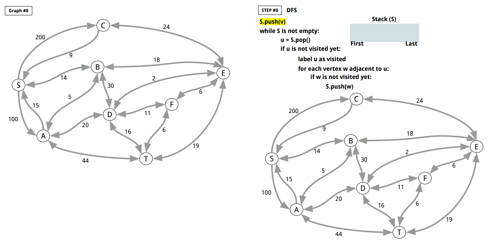
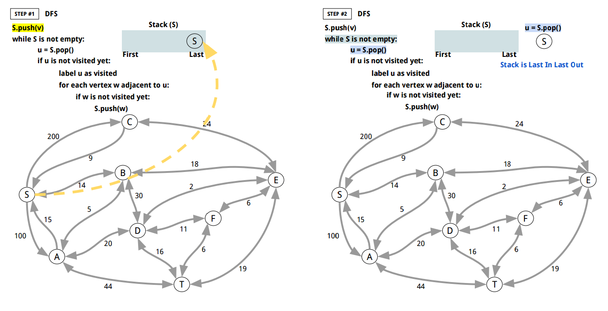
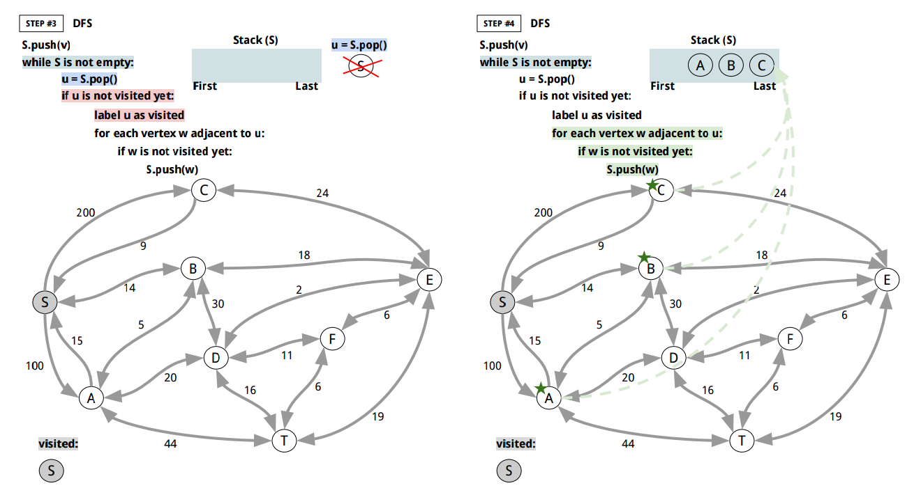
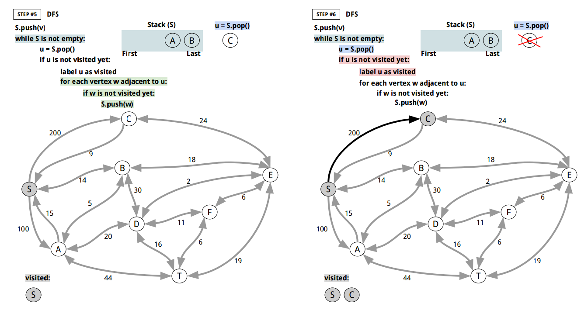
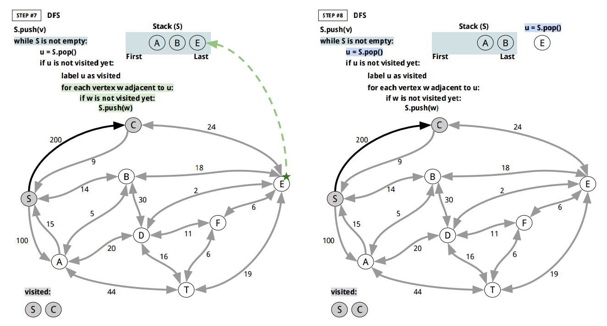
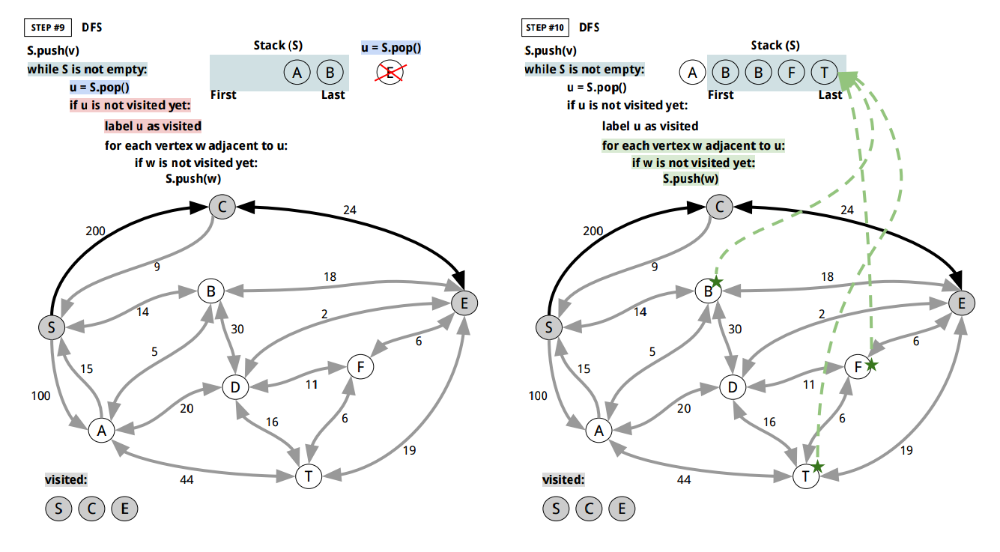
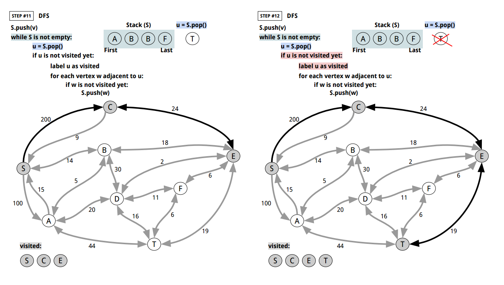
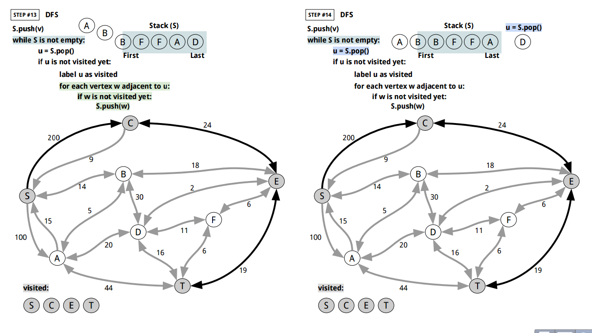
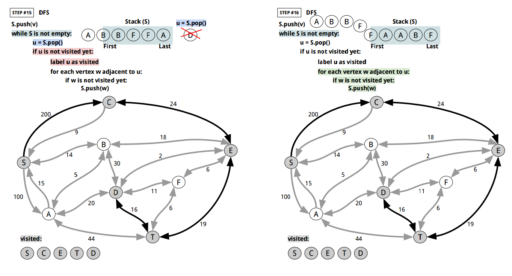
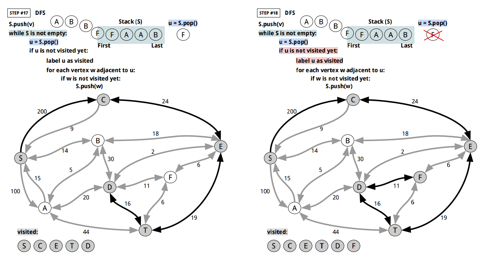
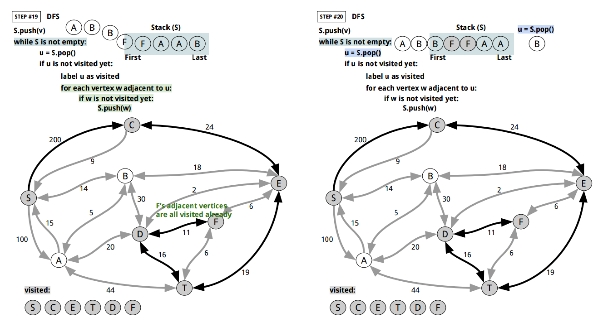
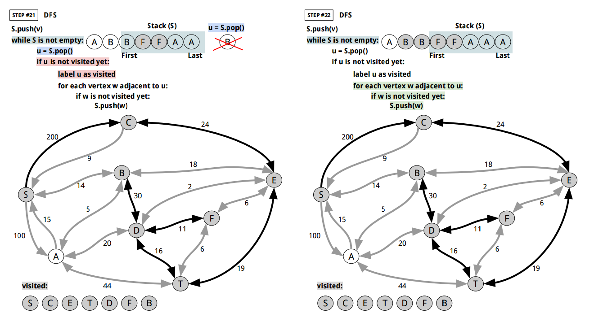
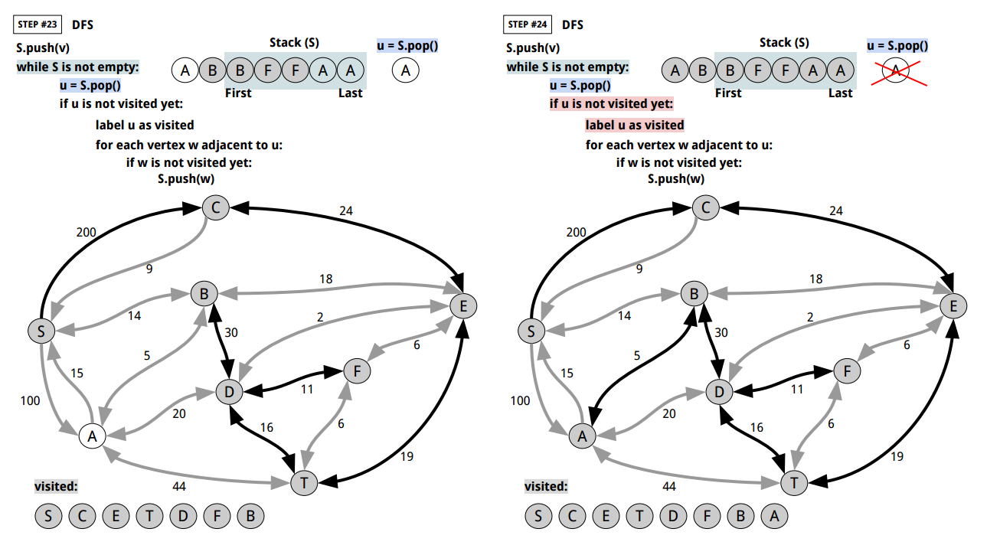
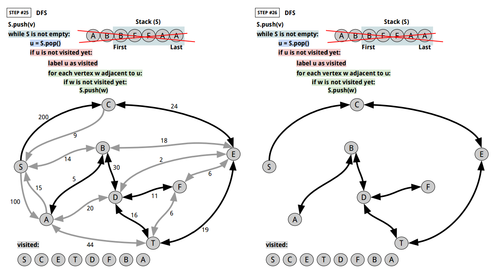

<br>
Here's Go implementation of `DFS`:

```go
package main

import (
	"bytes"
	"encoding/json"
	"fmt"
	"io"
	"log"
	"os"
	"sync"
)

// DFS does depth-first search, and returns the list of vertices.
// (https://en.wikipedia.org/wiki/Depth-first_search)
//
//	 0. DFS(G, v):
//	 1.
//	 2. 	let S be a stack
//	 3. 	S.push(v)
//	 4.
//	 5. 	while S is not empty:
//	 6.
//	 7. 		u = S.pop()
//	 8.
//	 9. 		if u is not visited yet:
//	10.
//	11. 			label u as visited
//	12.
//	13. 			for each vertex w adjacent to u:
//	14.
//	15. 				if w is not visited yet:
//	16. 					S.push(w)
//
func DFS(g Graph, vtx string) []string {

	if !g.FindVertex(vtx) {
		return nil
	}

	s := []string{vtx}
	visited := make(map[string]bool)
	rs := []string{}

	// while S is not empty:
	for len(s) != 0 {

		u := s[len(s)-1]
		s = s[:len(s)-1 : len(s)-1]

		// if u is not visited yet:
		if _, ok := visited[u]; !ok {
			// label u as visited
			visited[u] = true

			rs = append(rs, u)

			// for each vertex w adjacent to u:
			cmap, _ := g.GetChildren(u)
			for w := range cmap {
				// if w is not visited yet:
				if _, ok := visited[w]; !ok {
					s = append(s, w) // S.push(w)
				}
			}
			pmap, _ := g.GetParents(u)
			for w := range pmap {
				// if w is not visited yet:
				if _, ok := visited[w]; !ok {
					s = append(s, w) // S.push(w)
				}
			}
		}
	}

	return rs
}

func main() {
	f, err := os.Open("graph.json")
	if err != nil {
		panic(err)
	}
	defer f.Close()
	g, err := NewDefaultGraphFromJSON(f, "graph_00")
	if err != nil {
		panic(err)
	}
	rs := DFS(g, "S")
	fmt.Println("DFS:", rs) // [S A B C D T E F]
	if len(rs) != 8 {
		log.Fatalf("should be 8 vertices but %s", g)
	}
}

// Graph describes the methods of graph operations.
// It assumes that the identifier of a Vertex is string and unique.
// And weight values is float64.
type Graph interface {
	// Init initializes a Graph.
	Init()

	// GetVertices returns a map from vertex ID to
	// empty struct value. Graph does not allow duplicate
	// vertex ID.
	GetVertices() map[string]struct{}

	// FindVertex returns true if the vertex already
	// exists in the graph.
	FindVertex(vtx string) bool

	// AddVertex adds a vertex to a graph, and returns false
	// if the vertex already existed in the graph.
	AddVertex(vtx string) bool

	// DeleteVertex deletes a vertex from a graph.
	// It returns true if it got deleted.
	// And false if it didn't get deleted.
	DeleteVertex(vtx string) bool

	// AddEdge adds an edge from vtx1 to vtx2 with the weight.
	AddEdge(vtx1, vtx2 string, weight float64) error

	// ReplaceEdge replaces an edge from vtx1 to vtx2 with the weight.
	ReplaceEdge(vtx1, vtx2 string, weight float64) error

	// DeleteEdge deletes an edge from vtx1 to vtx2.
	DeleteEdge(vtx1, vtx2 string) error

	// GetWeight returns the weight from vtx1 to vtx2.
	GetWeight(vtx1, vtx2 string) (float64, error)

	// GetParents returns the map of parent vertices.
	// (Vertices that come towards the argument vertex.)
	GetParents(vtx string) (map[string]struct{}, error)

	// GetChildren returns the map of child vertices.
	// (Vertices that go out of the argument vertex.)
	GetChildren(vtx string) (map[string]struct{}, error)

	// String describes the Graph.
	String() string
}

// defaultGraph is an internal default graph type that
// implements all methods in Graph interface.
type defaultGraph struct {
	mu sync.Mutex // guards the following

	// Vertices stores all vertices.
	Vertices map[string]struct{}

	// VertexToChildren maps a Vertex identifer to children with edge weights.
	VertexToChildren map[string]map[string]float64

	// VertexToParents maps a Vertex identifer to parents with edge weights.
	VertexToParents map[string]map[string]float64
}

// newDefaultGraph returns a new defaultGraph.
func newDefaultGraph() *defaultGraph {
	return &defaultGraph{
		Vertices:         make(map[string]struct{}),
		VertexToChildren: make(map[string]map[string]float64),
		VertexToParents:  make(map[string]map[string]float64),
		//
		// without this
		// panic: assignment to entry in nil map
	}
}

// NewDefaultGraph returns a new defaultGraph.
func NewDefaultGraph() Graph {
	return newDefaultGraph()
}

// newDefaultGraphFromJSON creates a graph Data from JSON.
// Here's the sample JSON data:
//
//	{
//	    "graph_00": {
//	        "S": {
//	            "A": 100,
//	            "B": 14,
//	            "C": 200
//	        },
//	        "A": {
//	            "S": 15,
//	            "B": 5,
//	            "D": 20,
//	            "T": 44
//	        },
//	        "B": {
//	            "S": 14,
//	            "A": 5,
//	            "D": 30,
//	            "E": 18
//	        },
//	        "C": {
//	            "S": 9,
//	            "E": 24
//	        },
//	        "D": {
//	            "A": 20,
//	            "B": 30,
//	            "E": 2,
//	            "F": 11,
//	            "T": 16
//	        },
//	        "E": {
//	            "B": 18,
//	            "C": 24,
//	            "D": 2,
//	            "F": 6,
//	            "T": 19
//	        },
//	        "F": {
//	            "D": 11,
//	            "E": 6,
//	            "T": 6
//	        },
//	        "T": {
//	            "A": 44,
//	            "D": 16,
//	            "F": 6,
//	            "E": 19
//	        }
//	    },
//	}
//
func newDefaultGraphFromJSON(rd io.Reader, graphID string) (*defaultGraph, error) {
	js := make(map[string]map[string]map[string]float64)
	dec := json.NewDecoder(rd)
	for {
		if err := dec.Decode(&js); err == io.EOF {
			break
		} else if err != nil {
			return nil, err
		}
	}
	if _, ok := js[graphID]; !ok {
		return nil, fmt.Errorf("%s does not exist", graphID)
	}
	gmap := js[graphID]
	g := newDefaultGraph()
	for vtx1, mm := range gmap {
		if !g.FindVertex(vtx1) {
			g.AddVertex(vtx1)
		}
		for vtx2, weight := range mm {
			if !g.FindVertex(vtx2) {
				g.AddVertex(vtx2)
			}
			g.ReplaceEdge(vtx1, vtx2, weight)
		}
	}
	return g, nil
}

// NewDefaultGraphFromJSON returns a new defaultGraph from a JSON file.
func NewDefaultGraphFromJSON(rd io.Reader, graphID string) (Graph, error) {
	return newDefaultGraphFromJSON(rd, graphID)
}

func (g *defaultGraph) Init() {
	// (X) g = newDefaultGraph()
	// this only updates the pointer
	//
	*g = *newDefaultGraph()
}

func (g *defaultGraph) GetVertices() map[string]struct{} {
	g.mu.Lock()
	defer g.mu.Unlock()
	return g.Vertices
}

func (g *defaultGraph) FindVertex(vtx string) bool {
	g.mu.Lock()
	defer g.mu.Unlock()
	if _, ok := g.Vertices[vtx]; !ok {
		return false
	}
	return true
}

func (g *defaultGraph) AddVertex(vtx string) bool {
	g.mu.Lock()
	defer g.mu.Unlock()
	if _, ok := g.Vertices[vtx]; !ok {
		g.Vertices[vtx] = struct{}{}
		return true
	}
	return false
}

func (g *defaultGraph) DeleteVertex(vtx string) bool {
	g.mu.Lock()
	defer g.mu.Unlock()
	if _, ok := g.Vertices[vtx]; !ok {
		return false
	} else {
		delete(g.Vertices, vtx)
	}
	if _, ok := g.VertexToChildren[vtx]; ok {
		delete(g.VertexToChildren, vtx)
	}
	for _, smap := range g.VertexToChildren {
		if _, ok := smap[vtx]; ok {
			delete(smap, vtx)
		}
	}
	if _, ok := g.VertexToParents[vtx]; ok {
		delete(g.VertexToParents, vtx)
	}
	for _, smap := range g.VertexToParents {
		if _, ok := smap[vtx]; ok {
			delete(smap, vtx)
		}
	}
	return true
}

func (g *defaultGraph) AddEdge(vtx1, vtx2 string, weight float64) error {
	g.mu.Lock()
	defer g.mu.Unlock()
	if _, ok := g.Vertices[vtx1]; !ok {
		return fmt.Errorf("%s does not exist in the graph.", vtx1)
	}
	if _, ok := g.Vertices[vtx2]; !ok {
		return fmt.Errorf("%s does not exist in the graph.", vtx2)
	}
	if _, ok := g.VertexToChildren[vtx1]; ok {
		if v, ok2 := g.VertexToChildren[vtx1][vtx2]; ok2 {
			g.VertexToChildren[vtx1][vtx2] = v + weight
		} else {
			g.VertexToChildren[vtx1][vtx2] = weight
		}
	} else {
		tmap := make(map[string]float64)
		tmap[vtx2] = weight
		g.VertexToChildren[vtx1] = tmap
	}
	if _, ok := g.VertexToParents[vtx2]; ok {
		if v, ok2 := g.VertexToParents[vtx2][vtx1]; ok2 {
			g.VertexToParents[vtx2][vtx1] = v + weight
		} else {
			g.VertexToParents[vtx2][vtx1] = weight
		}
	} else {
		tmap := make(map[string]float64)
		tmap[vtx1] = weight
		g.VertexToParents[vtx2] = tmap
	}
	return nil
}

func (g *defaultGraph) ReplaceEdge(vtx1, vtx2 string, weight float64) error {
	g.mu.Lock()
	defer g.mu.Unlock()
	if _, ok := g.Vertices[vtx1]; !ok {
		return fmt.Errorf("%s does not exist in the graph.", vtx1)
	}
	if _, ok := g.Vertices[vtx2]; !ok {
		return fmt.Errorf("%s does not exist in the graph.", vtx2)
	}
	if _, ok := g.VertexToChildren[vtx1]; ok {
		g.VertexToChildren[vtx1][vtx2] = weight
	} else {
		tmap := make(map[string]float64)
		tmap[vtx2] = weight
		g.VertexToChildren[vtx1] = tmap
	}
	if _, ok := g.VertexToParents[vtx2]; ok {
		g.VertexToParents[vtx2][vtx1] = weight
	} else {
		tmap := make(map[string]float64)
		tmap[vtx1] = weight
		g.VertexToParents[vtx2] = tmap
	}
	return nil
}

func (g *defaultGraph) DeleteEdge(vtx1, vtx2 string) error {
	g.mu.Lock()
	defer g.mu.Unlock()
	if _, ok := g.Vertices[vtx1]; !ok {
		return fmt.Errorf("%s does not exist in the graph.", vtx1)
	}
	if _, ok := g.Vertices[vtx2]; !ok {
		return fmt.Errorf("%s does not exist in the graph.", vtx2)
	}
	if _, ok := g.VertexToChildren[vtx1]; ok {
		if _, ok := g.VertexToChildren[vtx1][vtx2]; ok {
			delete(g.VertexToChildren[vtx1], vtx2)
		}
	}
	if _, ok := g.VertexToParents[vtx2]; ok {
		if _, ok := g.VertexToParents[vtx2][vtx1]; ok {
			delete(g.VertexToParents[vtx2], vtx1)
		}
	}
	return nil
}

func (g *defaultGraph) GetWeight(vtx1, vtx2 string) (float64, error) {
	g.mu.Lock()
	defer g.mu.Unlock()
	if _, ok := g.Vertices[vtx1]; !ok {
		return 0.0, fmt.Errorf("%s does not exist in the graph.", vtx1)
	}
	if _, ok := g.Vertices[vtx2]; !ok {
		return 0.0, fmt.Errorf("%s does not exist in the graph.", vtx2)
	}
	if _, ok := g.VertexToChildren[vtx1]; ok {
		if v, ok := g.VertexToChildren[vtx1][vtx2]; ok {
			return v, nil
		}
	}
	return 0.0, fmt.Errorf("there is not edge from %s to %s", vtx1, vtx2)
}

func (g *defaultGraph) GetParents(vtx string) (map[string]struct{}, error) {
	g.mu.Lock()
	defer g.mu.Unlock()
	if _, ok := g.Vertices[vtx]; !ok {
		return nil, fmt.Errorf("%s does not exist in the graph.", vtx)
	}
	rs := make(map[string]struct{})
	if _, ok := g.VertexToParents[vtx]; ok {
		for k := range g.VertexToParents[vtx] {
			rs[k] = struct{}{}
		}
	}
	return rs, nil
}

func (g *defaultGraph) GetChildren(vtx string) (map[string]struct{}, error) {
	g.mu.Lock()
	defer g.mu.Unlock()
	if _, ok := g.Vertices[vtx]; !ok {
		return nil, fmt.Errorf("%s does not exist in the graph.", vtx)
	}
	rs := make(map[string]struct{})
	if _, ok := g.VertexToChildren[vtx]; ok {
		for k := range g.VertexToChildren[vtx] {
			rs[k] = struct{}{}
		}
	}
	return rs, nil
}

func (g *defaultGraph) String() string {
	buf := new(bytes.Buffer)
	for vtx1 := range g.Vertices {
		cmap, _ := g.GetChildren(vtx1)
		for vtx2 := range cmap {
			weight, _ := g.GetWeight(vtx1, vtx2)
			fmt.Fprintf(buf, "%s -- %.3f --> %s\n", vtx1, weight, vtx2)
		}
	}
	return buf.String()
}

```

[↑ top](#go-graph-traversal)
<br><br><br><br>
<hr>


#### graph traversal: DFS recursion

We can also traverse the graph recursively.

```
 0. DFS(G, v):
 1.
 2. 	if v is visited:
 3. 		return
 4.
 5. 	label v as visited
 6.
 7. 	for each vertex u adjacent to v:
 8.
 9. 		if u is not visited yet:
10. 			recursive DFS(G, u)
```

<br>
Here's how it works:

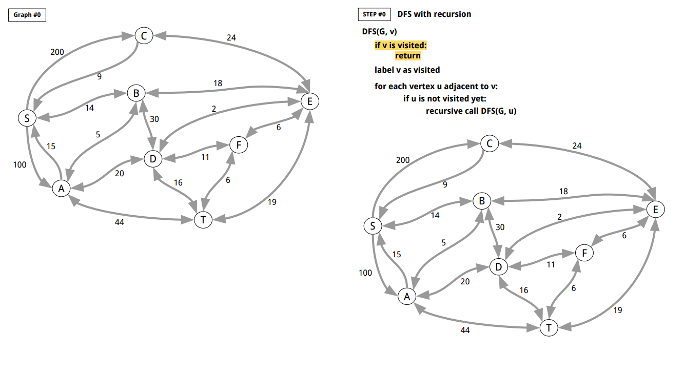
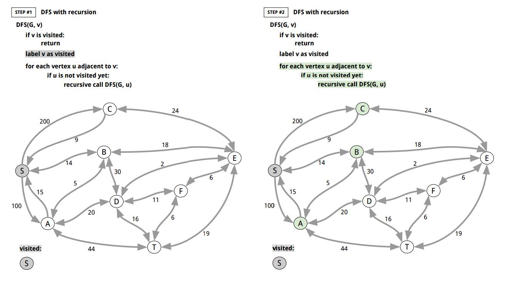
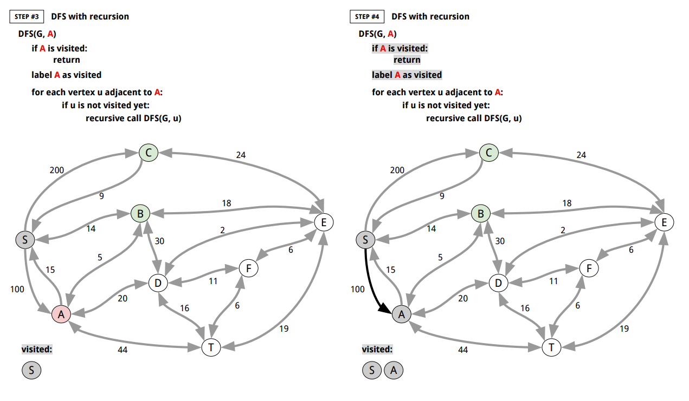
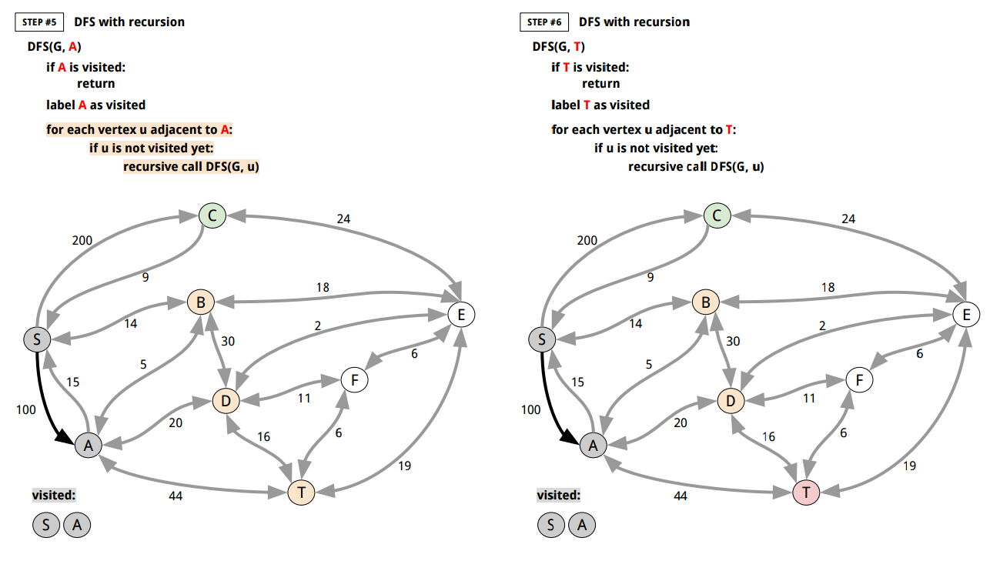
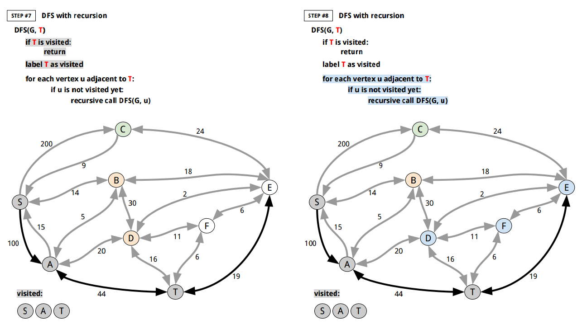
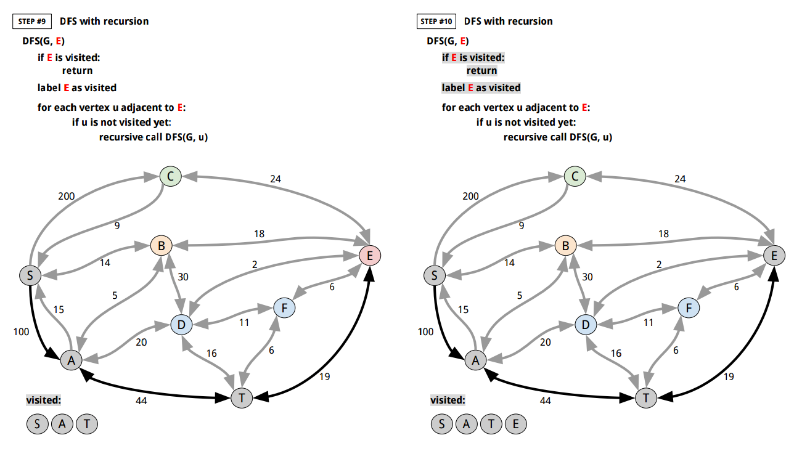
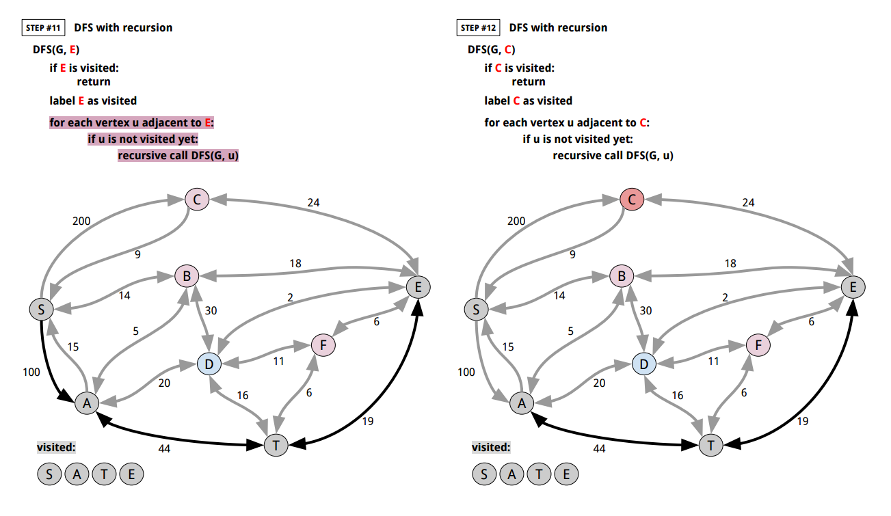
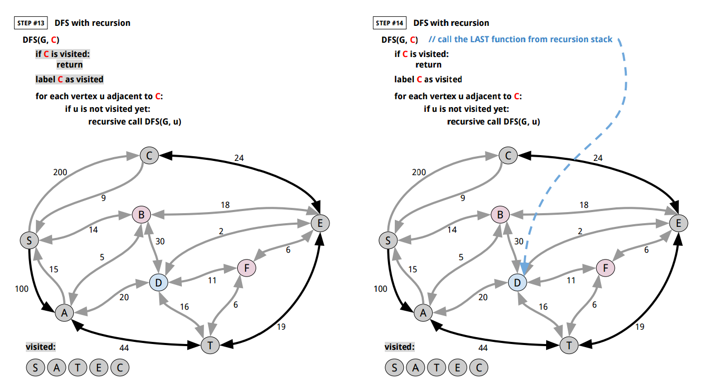
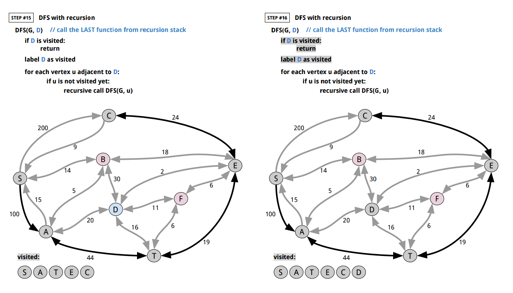

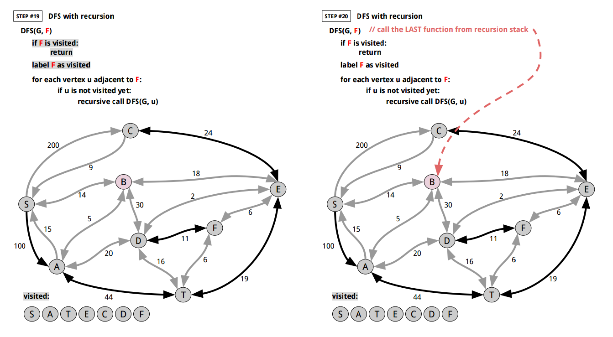
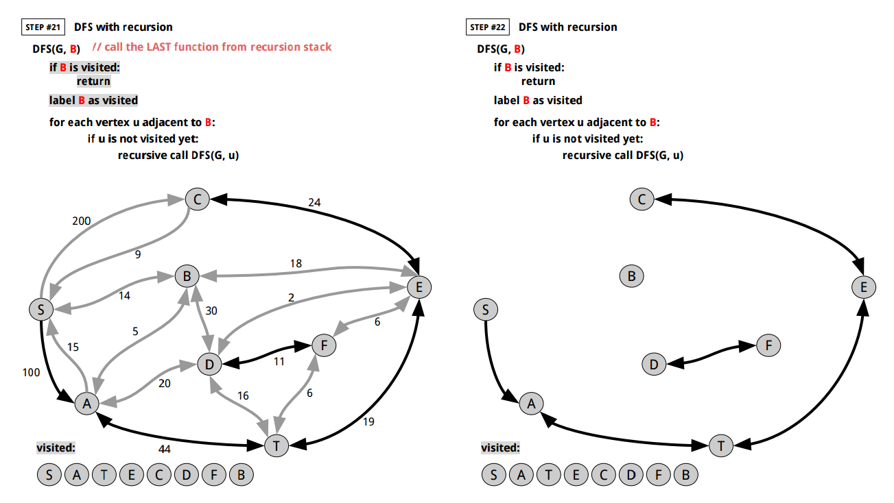

<br>
Here's Go implementation of `DFS`:

```go
package main

import (
	"bytes"
	"encoding/json"
	"fmt"
	"io"
	"log"
	"os"
	"sync"
)

// DFSRecursion does depth-first search recursively.
//
//	 0. DFS(G, v):
//	 1.
//	 2. 	if v is visited:
//	 3. 		return
//	 4.
//	 5. 	label v as visited
//	 6.
//	 7. 	for each vertex u adjacent to v:
//	 8.
//	 9. 		if u is not visited yet:
//	10. 			recursive DFS(G, u)
//
func DFSRecursion(g Graph, vtx string) []string {

	if !g.FindVertex(vtx) {
		return nil
	}

	visited := make(map[string]bool)
	rs := []string{}

	dfsRecursion(g, vtx, visited, &rs)

	return rs
}

func dfsRecursion(g Graph, vtx string, visited map[string]bool, rs *[]string) {

	// base case of recursion
	//
	// if v is visited:
	if _, ok := visited[vtx]; ok {
		return
	}

	// label v as visited
	visited[vtx] = true
	*rs = append(*rs, vtx)

	// for each vertex u adjacent to v:
	cmap, _ := g.GetChildren(vtx)
	for u := range cmap {
		// if u is not visited yet:
		if _, ok := visited[u]; !ok {
			// recursive DFS(G, u)
			dfsRecursion(g, u, visited, rs)
		}
	}
	pmap, _ := g.GetParents(vtx)
	for u := range pmap {
		// if u is not visited yet:
		if _, ok := visited[u]; !ok {
			// recursive DFS(G, u)
			dfsRecursion(g, u, visited, rs)
		}
	}
}

func main() {
	f, err := os.Open("graph.json")
	if err != nil {
		panic(err)
	}
	defer f.Close()
	g, err := NewDefaultGraphFromJSON(f, "graph_00")
	if err != nil {
		panic(err)
	}
	rs := DFSRecursion(g, "S")
	fmt.Println("DFSRecursion:", rs) // [S A B C D T E F]
	if len(rs) != 8 {
		log.Fatalf("should be 8 vertices but %s", g)
	}
}

// Graph describes the methods of graph operations.
// It assumes that the identifier of a Vertex is string and unique.
// And weight values is float64.
type Graph interface {
	// Init initializes a Graph.
	Init()

	// GetVertices returns a map from vertex ID to
	// empty struct value. Graph does not allow duplicate
	// vertex ID.
	GetVertices() map[string]struct{}

	// FindVertex returns true if the vertex already
	// exists in the graph.
	FindVertex(vtx string) bool

	// AddVertex adds a vertex to a graph, and returns false
	// if the vertex already existed in the graph.
	AddVertex(vtx string) bool

	// DeleteVertex deletes a vertex from a graph.
	// It returns true if it got deleted.
	// And false if it didn't get deleted.
	DeleteVertex(vtx string) bool

	// AddEdge adds an edge from vtx1 to vtx2 with the weight.
	AddEdge(vtx1, vtx2 string, weight float64) error

	// ReplaceEdge replaces an edge from vtx1 to vtx2 with the weight.
	ReplaceEdge(vtx1, vtx2 string, weight float64) error

	// DeleteEdge deletes an edge from vtx1 to vtx2.
	DeleteEdge(vtx1, vtx2 string) error

	// GetWeight returns the weight from vtx1 to vtx2.
	GetWeight(vtx1, vtx2 string) (float64, error)

	// GetParents returns the map of parent vertices.
	// (Vertices that come towards the argument vertex.)
	GetParents(vtx string) (map[string]struct{}, error)

	// GetChildren returns the map of child vertices.
	// (Vertices that go out of the argument vertex.)
	GetChildren(vtx string) (map[string]struct{}, error)

	// String describes the Graph.
	String() string
}

// defaultGraph is an internal default graph type that
// implements all methods in Graph interface.
type defaultGraph struct {
	mu sync.Mutex // guards the following

	// Vertices stores all vertices.
	Vertices map[string]struct{}

	// VertexToChildren maps a Vertex identifer to children with edge weights.
	VertexToChildren map[string]map[string]float64

	// VertexToParents maps a Vertex identifer to parents with edge weights.
	VertexToParents map[string]map[string]float64
}

// newDefaultGraph returns a new defaultGraph.
func newDefaultGraph() *defaultGraph {
	return &defaultGraph{
		Vertices:         make(map[string]struct{}),
		VertexToChildren: make(map[string]map[string]float64),
		VertexToParents:  make(map[string]map[string]float64),
		//
		// without this
		// panic: assignment to entry in nil map
	}
}

// NewDefaultGraph returns a new defaultGraph.
func NewDefaultGraph() Graph {
	return newDefaultGraph()
}

// newDefaultGraphFromJSON creates a graph Data from JSON.
// Here's the sample JSON data:
//
//	{
//	    "graph_00": {
//	        "S": {
//	            "A": 100,
//	            "B": 14,
//	            "C": 200
//	        },
//	        "A": {
//	            "S": 15,
//	            "B": 5,
//	            "D": 20,
//	            "T": 44
//	        },
//	        "B": {
//	            "S": 14,
//	            "A": 5,
//	            "D": 30,
//	            "E": 18
//	        },
//	        "C": {
//	            "S": 9,
//	            "E": 24
//	        },
//	        "D": {
//	            "A": 20,
//	            "B": 30,
//	            "E": 2,
//	            "F": 11,
//	            "T": 16
//	        },
//	        "E": {
//	            "B": 18,
//	            "C": 24,
//	            "D": 2,
//	            "F": 6,
//	            "T": 19
//	        },
//	        "F": {
//	            "D": 11,
//	            "E": 6,
//	            "T": 6
//	        },
//	        "T": {
//	            "A": 44,
//	            "D": 16,
//	            "F": 6,
//	            "E": 19
//	        }
//	    },
//	}
//
func newDefaultGraphFromJSON(rd io.Reader, graphID string) (*defaultGraph, error) {
	js := make(map[string]map[string]map[string]float64)
	dec := json.NewDecoder(rd)
	for {
		if err := dec.Decode(&js); err == io.EOF {
			break
		} else if err != nil {
			return nil, err
		}
	}
	if _, ok := js[graphID]; !ok {
		return nil, fmt.Errorf("%s does not exist", graphID)
	}
	gmap := js[graphID]
	g := newDefaultGraph()
	for vtx1, mm := range gmap {
		if !g.FindVertex(vtx1) {
			g.AddVertex(vtx1)
		}
		for vtx2, weight := range mm {
			if !g.FindVertex(vtx2) {
				g.AddVertex(vtx2)
			}
			g.ReplaceEdge(vtx1, vtx2, weight)
		}
	}
	return g, nil
}

// NewDefaultGraphFromJSON returns a new defaultGraph from a JSON file.
func NewDefaultGraphFromJSON(rd io.Reader, graphID string) (Graph, error) {
	return newDefaultGraphFromJSON(rd, graphID)
}

func (g *defaultGraph) Init() {
	// (X) g = newDefaultGraph()
	// this only updates the pointer
	//
	*g = *newDefaultGraph()
}

func (g *defaultGraph) GetVertices() map[string]struct{} {
	g.mu.Lock()
	defer g.mu.Unlock()
	return g.Vertices
}

func (g *defaultGraph) FindVertex(vtx string) bool {
	g.mu.Lock()
	defer g.mu.Unlock()
	if _, ok := g.Vertices[vtx]; !ok {
		return false
	}
	return true
}

func (g *defaultGraph) AddVertex(vtx string) bool {
	g.mu.Lock()
	defer g.mu.Unlock()
	if _, ok := g.Vertices[vtx]; !ok {
		g.Vertices[vtx] = struct{}{}
		return true
	}
	return false
}

func (g *defaultGraph) DeleteVertex(vtx string) bool {
	g.mu.Lock()
	defer g.mu.Unlock()
	if _, ok := g.Vertices[vtx]; !ok {
		return false
	} else {
		delete(g.Vertices, vtx)
	}
	if _, ok := g.VertexToChildren[vtx]; ok {
		delete(g.VertexToChildren, vtx)
	}
	for _, smap := range g.VertexToChildren {
		if _, ok := smap[vtx]; ok {
			delete(smap, vtx)
		}
	}
	if _, ok := g.VertexToParents[vtx]; ok {
		delete(g.VertexToParents, vtx)
	}
	for _, smap := range g.VertexToParents {
		if _, ok := smap[vtx]; ok {
			delete(smap, vtx)
		}
	}
	return true
}

func (g *defaultGraph) AddEdge(vtx1, vtx2 string, weight float64) error {
	g.mu.Lock()
	defer g.mu.Unlock()
	if _, ok := g.Vertices[vtx1]; !ok {
		return fmt.Errorf("%s does not exist in the graph.", vtx1)
	}
	if _, ok := g.Vertices[vtx2]; !ok {
		return fmt.Errorf("%s does not exist in the graph.", vtx2)
	}
	if _, ok := g.VertexToChildren[vtx1]; ok {
		if v, ok2 := g.VertexToChildren[vtx1][vtx2]; ok2 {
			g.VertexToChildren[vtx1][vtx2] = v + weight
		} else {
			g.VertexToChildren[vtx1][vtx2] = weight
		}
	} else {
		tmap := make(map[string]float64)
		tmap[vtx2] = weight
		g.VertexToChildren[vtx1] = tmap
	}
	if _, ok := g.VertexToParents[vtx2]; ok {
		if v, ok2 := g.VertexToParents[vtx2][vtx1]; ok2 {
			g.VertexToParents[vtx2][vtx1] = v + weight
		} else {
			g.VertexToParents[vtx2][vtx1] = weight
		}
	} else {
		tmap := make(map[string]float64)
		tmap[vtx1] = weight
		g.VertexToParents[vtx2] = tmap
	}
	return nil
}

func (g *defaultGraph) ReplaceEdge(vtx1, vtx2 string, weight float64) error {
	g.mu.Lock()
	defer g.mu.Unlock()
	if _, ok := g.Vertices[vtx1]; !ok {
		return fmt.Errorf("%s does not exist in the graph.", vtx1)
	}
	if _, ok := g.Vertices[vtx2]; !ok {
		return fmt.Errorf("%s does not exist in the graph.", vtx2)
	}
	if _, ok := g.VertexToChildren[vtx1]; ok {
		g.VertexToChildren[vtx1][vtx2] = weight
	} else {
		tmap := make(map[string]float64)
		tmap[vtx2] = weight
		g.VertexToChildren[vtx1] = tmap
	}
	if _, ok := g.VertexToParents[vtx2]; ok {
		g.VertexToParents[vtx2][vtx1] = weight
	} else {
		tmap := make(map[string]float64)
		tmap[vtx1] = weight
		g.VertexToParents[vtx2] = tmap
	}
	return nil
}

func (g *defaultGraph) DeleteEdge(vtx1, vtx2 string) error {
	g.mu.Lock()
	defer g.mu.Unlock()
	if _, ok := g.Vertices[vtx1]; !ok {
		return fmt.Errorf("%s does not exist in the graph.", vtx1)
	}
	if _, ok := g.Vertices[vtx2]; !ok {
		return fmt.Errorf("%s does not exist in the graph.", vtx2)
	}
	if _, ok := g.VertexToChildren[vtx1]; ok {
		if _, ok := g.VertexToChildren[vtx1][vtx2]; ok {
			delete(g.VertexToChildren[vtx1], vtx2)
		}
	}
	if _, ok := g.VertexToParents[vtx2]; ok {
		if _, ok := g.VertexToParents[vtx2][vtx1]; ok {
			delete(g.VertexToParents[vtx2], vtx1)
		}
	}
	return nil
}

func (g *defaultGraph) GetWeight(vtx1, vtx2 string) (float64, error) {
	g.mu.Lock()
	defer g.mu.Unlock()
	if _, ok := g.Vertices[vtx1]; !ok {
		return 0.0, fmt.Errorf("%s does not exist in the graph.", vtx1)
	}
	if _, ok := g.Vertices[vtx2]; !ok {
		return 0.0, fmt.Errorf("%s does not exist in the graph.", vtx2)
	}
	if _, ok := g.VertexToChildren[vtx1]; ok {
		if v, ok := g.VertexToChildren[vtx1][vtx2]; ok {
			return v, nil
		}
	}
	return 0.0, fmt.Errorf("there is not edge from %s to %s", vtx1, vtx2)
}

func (g *defaultGraph) GetParents(vtx string) (map[string]struct{}, error) {
	g.mu.Lock()
	defer g.mu.Unlock()
	if _, ok := g.Vertices[vtx]; !ok {
		return nil, fmt.Errorf("%s does not exist in the graph.", vtx)
	}
	rs := make(map[string]struct{})
	if _, ok := g.VertexToParents[vtx]; ok {
		for k := range g.VertexToParents[vtx] {
			rs[k] = struct{}{}
		}
	}
	return rs, nil
}

func (g *defaultGraph) GetChildren(vtx string) (map[string]struct{}, error) {
	g.mu.Lock()
	defer g.mu.Unlock()
	if _, ok := g.Vertices[vtx]; !ok {
		return nil, fmt.Errorf("%s does not exist in the graph.", vtx)
	}
	rs := make(map[string]struct{})
	if _, ok := g.VertexToChildren[vtx]; ok {
		for k := range g.VertexToChildren[vtx] {
			rs[k] = struct{}{}
		}
	}
	return rs, nil
}

func (g *defaultGraph) String() string {
	buf := new(bytes.Buffer)
	for vtx1 := range g.Vertices {
		cmap, _ := g.GetChildren(vtx1)
		for vtx2 := range cmap {
			weight, _ := g.GetWeight(vtx1, vtx2)
			fmt.Fprintf(buf, "%s -- %.3f --> %s\n", vtx1, weight, vtx2)
		}
	}
	return buf.String()
}

```

[↑ top](#go-graph-traversal)
<br><br><br><br>
<hr>
