[*back to contents*](https://github.com/gyuho/learn#contents)
<br>

# Go: heap, priority queue 

- [Heap and Priority Queue](#heap-and-priority-queue)
- [Heap Implementation](#heap-implementation)
- [standard `container/heap` package](#standard-containerheap-package)
- [Build Min-Heap](#build-min-heap)
- [`heap.Push`](#heappush)
- [`heap.Pop`](#heappop)
- [Priority Queue](#priority-queue)

[↑ top](#go-heap-priority-queue)
<br><br><br><br>
<hr>


#### Heap and Priority Queue

What is [**heap**](http://en.wikipedia.org/wiki/Heap_%28data_structure%29)?
Here's my old YouTube video tutorial.

<a href="https://www.youtube.com/watch?v=OGOK97VLwV8" target="_blank">
</a>


[*garbage-collectedi*](http://en.wikipedia.org/wiki/Garbage_collection_%28computer_science%29)
but here we are talking about **heap data structure.** It is a *complete binary
tree*, where a tree is completely filled on all levels, possibly except the
lowest level.

Suppose a binary tree of height *h* with *n* number of nodes. Then the heap
height would be:

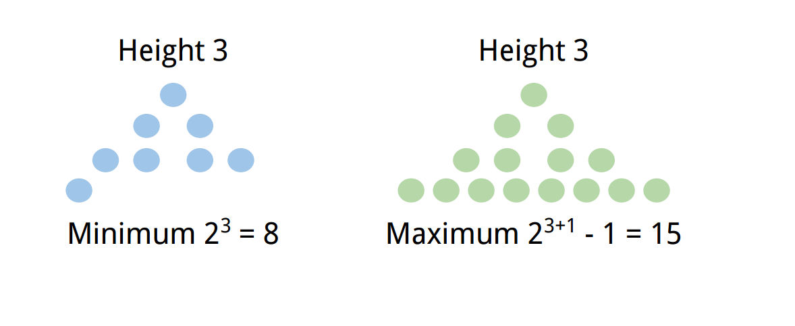


Keep this in mind. This is *important* when we calculate the *time complexities*
of data structures.


<br>
There are *two* kinds of **_heap_**:

- **Max**-*heap*: **parent node is always greater than** or **equal to
  children**. The **root** node has the **highest** value.
- **Min**-*heap*: *parent node is always less than* or *equal to children*.
  The *root* node has the *lowest* value.


<br><br>

Here is an *array* of 10 integers:

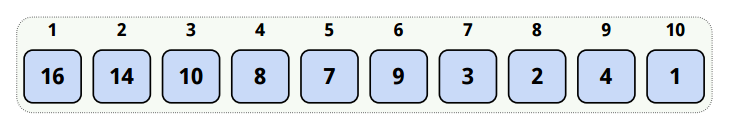


<br>

**_Max-_** and **_Min-_**-*heap* from this array would be:

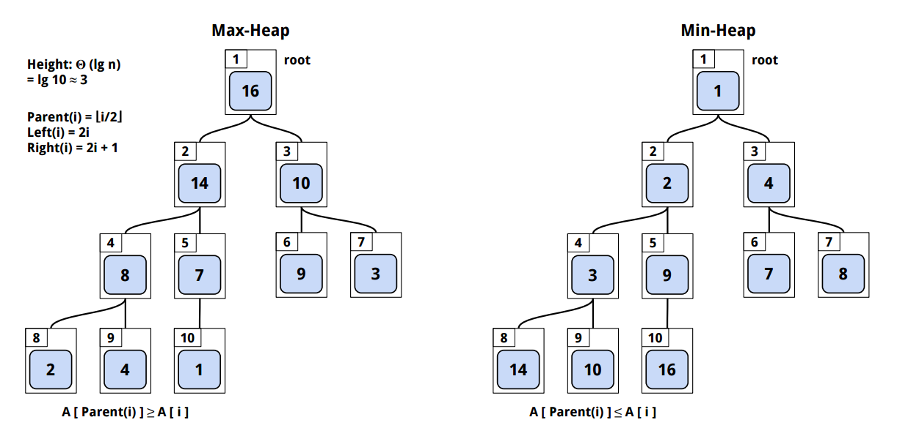


<br>

**_Heapify_** updates the *tree* so that it satisfies the *Max-* or *Min-*
properties. First here's how **`Max-Heapify`** works to maintain *max-heap*
property **`A[Parent(i)] ≥ A[i]`**:

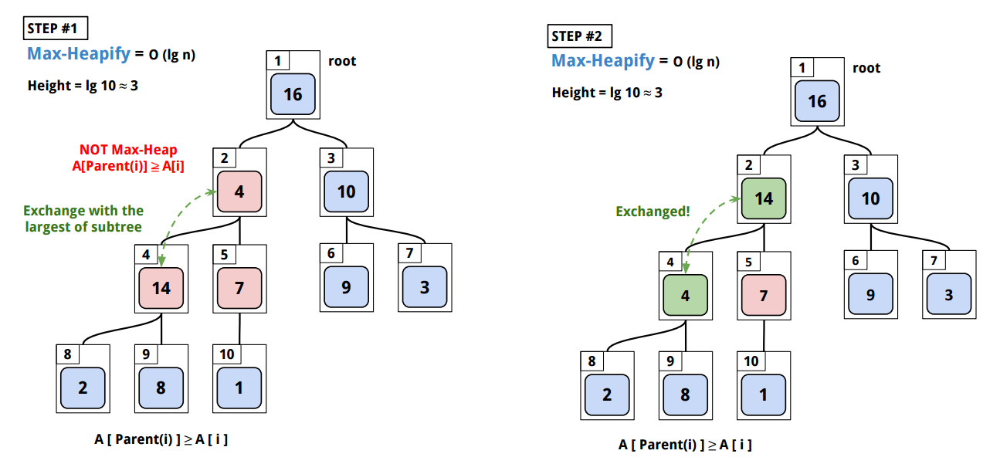
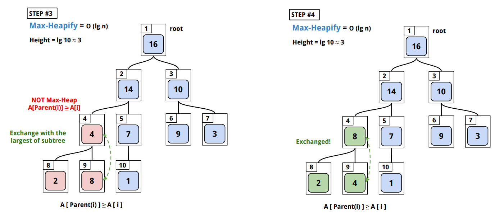

<br>
**`Min-Heapify`** to maintain *min-heap* property **`A[Parent(i)] ≤ A[i]`**:

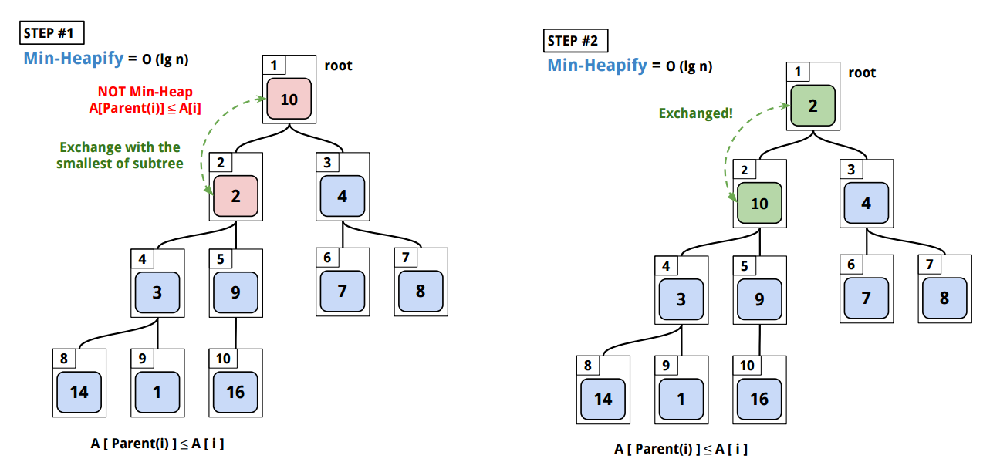
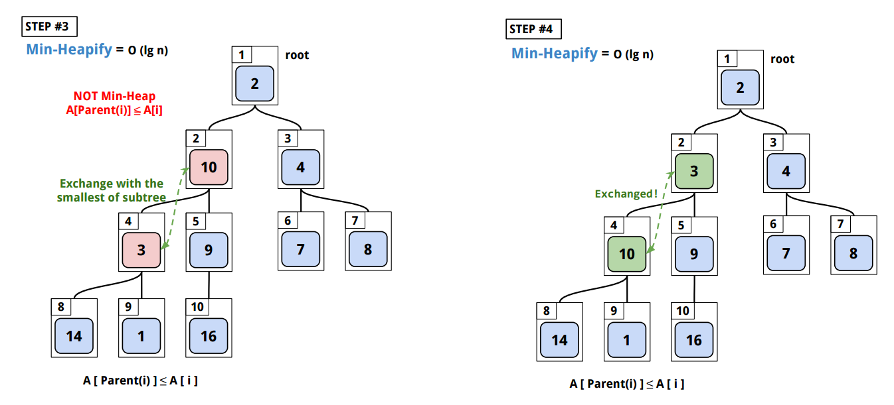
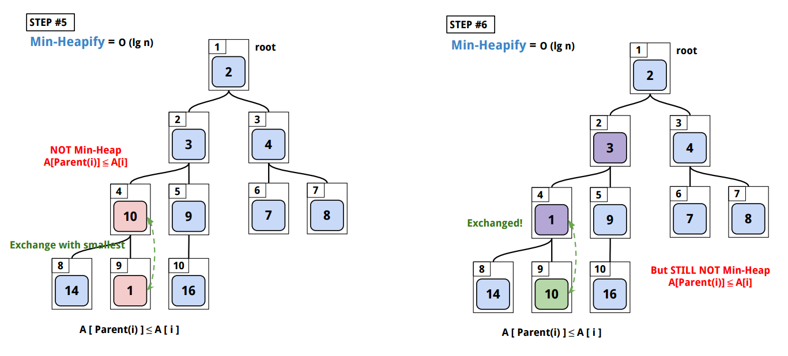


<br><br>

For **Max-** and **Min-Heapify**, you **specify an index to start the
operation** and **recursively heapify the tree—in practice, start from the middle
index.** One `heapify` operation can take as much computation as the height of
the tree, thus the *time complexity* of `heapify` is *`O(lg n)`*.

However, as you can see in the `STEP #6` of `Min-Heapify`, even after you
`heapify` once, the tree can **still violate the `heap` property**. Therefore,
we need **`Build Max/Min Heap`** operation to repeat **_n_** number of
**_`heapify`_** operations, each of which takes *`O(lg n)`*.

Then the *time complexity* of **`Build Max/Min Heap`** would be **_`O(n lg
n)`_**. And with [**tighter
analysis**](http://courses.csail.mit.edu/6.006/fall10/handouts/recitation10-8.pdf),
`Build Max/Min Heap` takes **_`O(n)`_**.

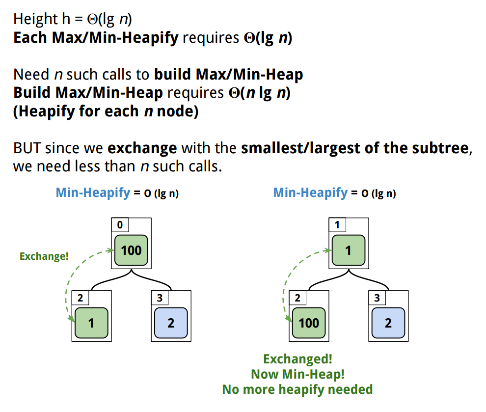

Therefore, tighter bound would be:

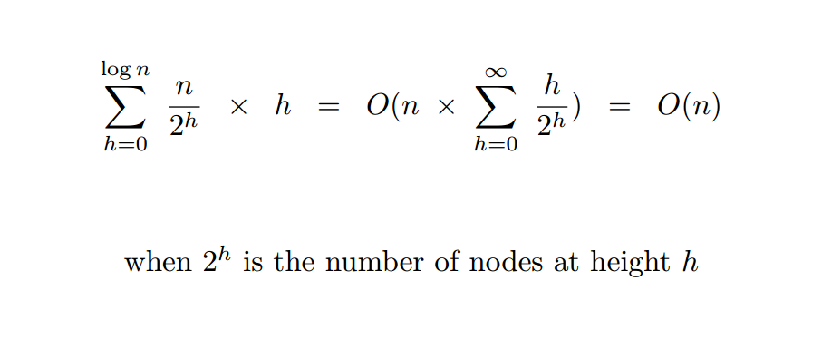


[↑ top](#go-heap-priority-queue)
<br><br><br><br>
<hr>


#### Heap Implementation

Go has [container/heap](http://golang.org/pkg/container/heap/) package:

```go
type Interface interface {
    sort.Interface
    Push(x interface{})
    Pop() interface{}
}
```

[**`heap.Interface`**](http://golang.org/pkg/container/heap/#Interface) embeds
[**`sort.Interface`**](http://golang.org/pkg/sort/#Interface). When a type
implements all the methods in an interface type, the type implicitly satisfies
the interface. In order to satisfy `heap.Interface`, a type must implement all
*three* methods *`Len`*, *`Swap`*, *`Less`* in `sort.Interface` plus *two*
methods **_`Push`_** and **_`Pop`_**. And
[**`heap.Init`**](http://golang.org/pkg/container/heap/#Init) function takes
the `heap.Interface` as an argument:

```go
Init(h heap.Interface)
```

The **interface** type variable *`h`* **would have** **_a concrete value_** as
long as the value **_implements the interface's methods_**. That is, **a type
must implement** all 5 methods—*`Len`*, *`Swap`*, *`Less`* in `sort.Interface` and
*`Push`*, *`Pop`* in `heap.Interface`, in order to be used as an **argument**
to **_`heap.Init`_**, as [below](http://play.golang.org/p/PoSTxQ4tSa):

```go
package main

import (
	"container/heap"
	"fmt"
)

// An IntHeap is a min-heap of ints.
type IntHeap []int

func (h IntHeap) Len() int           { return len(h) }
func (h IntHeap) Less(i, j int) bool { return h[i] < h[j] }
func (h IntHeap) Swap(i, j int)      { h[i], h[j] = h[j], h[i] }

func (h *IntHeap) Push(x interface{}) {
	// Push and Pop use pointer receivers
	// because they modify the slice's length,
	// not just its contents.
	*h = append(*h, x.(int))
}

func (h *IntHeap) Pop() interface{} {
	heapSize := len(*h)
	lastNode := (*h)[heapSize-1]
	*h = (*h)[:heapSize-1]
	return lastNode
}

// This example inserts several ints into an IntHeap, checks the minimum,
// and removes them in order of priority.
func main() {
	h := &IntHeap{10, 99, 7, 16, 5}
	heap.Init(h)
	heap.Push(h, 3)
	fmt.Printf("minimum: %d\n", (*h)[0])
	// minimum: 3

	// Keep popping the minimum element
	for h.Len() > 0 {
		fmt.Printf("%d ", heap.Pop(h))
	}
	// 3 5 7 10 16 99
}
```

<br>

- [**`heap.Init`**](http://golang.org/pkg/container/heap/#Init) builds
  Max/Min-Heap = *`O(n)`*
- [**`heap.Push`**](http://golang.org/pkg/container/heap/#Push) inserts into a
  heap and does **heapify** = *`O(lg n)`*
- [**`heap.Pop`**](http://golang.org/pkg/container/heap/#Pop) removes the
  minimum element from the heap and does **heapify** = *`O(lg n)`*

And [here](http://play.golang.org/p/OMVaCDkyBL)'s re-implementation of [original Go source code](https://go.googlesource.com/go/+/master/src/container/heap/heap.go):

```go
package main

import (
	"fmt"
	"sort"
)

// heap is from Go's standard container/heap package
// https://go.googlesource.com/go/+/master/src/container/heap/heap.go
type heap interface {
	sort.Interface          // embed sort then implement your own: Swap, Len, Less
	push(value interface{}) // add to heap
	pop() interface{}       // pop from heap (depends on Min,Max-Heap)
}

// down heapify downwards
func down(h heap, idx, heapSize int) {
	for {
		// minimum(maximum) element in the tree is the root, at index 0.

		// parent := idx / 2
		left := 2*idx + 1
		right := 2*idx + 2

		// no need to heapify (already heapified) / overflow
		if left >= heapSize || left < 0 {
			break
		}

		// Assume that you implement Min-Heap (right should be bigger)

		// just make it consistent that left is smaller in Min-Heap
                // (Max-Heap: left is bigger)
		if right < heapSize && h.Less(right, left) {
			left = right
		}

		// no need to heapify (already heapified)
		if h.Less(idx, left) {
			break
		}

		h.Swap(idx, left)
		idx = left

		// keep heapifying downwards
	}
}

// up heapify upwards
func up(h heap, idx int) {
	for {
		parent := (idx - 1) / 2

		// Assume that you implement Min-Heap (parent should be smaller)

		// no need to heapify (already heapified)
		if parent == idx || h.Less(parent, idx) {
			break
		}

		h.Swap(idx, parent)
		idx = parent

		// keep heapifying upwards
	}
}

// build : O(n) where n = h.Len()
func build(h heap) {
	heapSize := h.Len()
	for idx := heapSize/2 - 1; idx >= 0; idx-- {
		down(h, idx, heapSize)
	}
}

// to satisfy the heap interface
// any type that uses heap interface
// will need to implement push method.
// O(log(n)) where n = h.Len()
func push(h heap, val interface{}) {
	h.push(val)
	// heapify from bottom
	up(h, h.Len()-1)
}

// to satisfy the heap interface
// any type that uses heap interface
// will need to implement pop method.
// O(log(n)) where n = h.Len()
func pop(h heap) interface{} {
	lastIdx := h.Len() - 1

	// assume the min-heap
	// then pop returns the minimum

	// exchange the one to pop at root 0
	// with the one in the last node
	h.Swap(0, lastIdx)

	heapSize := lastIdx

	// heapify except the lastIdx node
	down(h, 0, heapSize)

	return h.pop()
}

// Note that Go source code heap implements "MIN" heap
// Go heap embeds sort.Interface
// Therefore, we need to define our custom Interface

type intMinHeap []int

func (s intMinHeap) Len() int           { return len(s) }
func (s intMinHeap) Less(i, j int) bool { return s[i] < s[j] }
func (s intMinHeap) Swap(i, j int)      { s[i], s[j] = s[j], s[i] }

//use pointer receivers
// because they modify the slice's length,
func (s *intMinHeap) push(val interface{}) {
	*s = append(*s, val.(int))
}

func (s *intMinHeap) pop() interface{} {
	heapSize := len(*s)
	lastNode := (*s)[heapSize-1]
	*s = (*s)[:heapSize-1]
	return lastNode
}

func main() {
	intSlice := &intMinHeap{12, 100, -15, 200, -5, 3, -12, 7}

	// make sure build Heap
	build(intSlice)

	// intSlice.push(-10) (X) is only interface without heapifying
	push(intSlice, -10)
	push(intSlice, 17)

	fmt.Println("after push and build:", intSlice)

	// heap sort on Min-Heap
	// keep popping the last Node which is the smallest in the Min-Heap
	// root is the smallest but had been exchanged for pop operation
	// biggest is popped at the end
	for intSlice.Len() != 0 {
		fmt.Print(pop(intSlice), " ")
	}
	println()

	println()
	itemSlice := &itemMaxHeap{
		item{value: "Apple", priority: 5},
		item{value: "Google", priority: 10},
	}
	build(itemSlice)

	push(itemSlice, item{value: "Amazon", priority: 3})

	// no need to build again
	// because push does the build heap
	// build(itemSlice)

	for _, elem := range *itemSlice {
		fmt.Println("after push:", elem.value)
		fmt.Println("after push:", elem.priority)
		println()
	}
	for itemSlice.Len() != 0 {
		fmt.Print(pop(itemSlice), " ")
	}
	println()
}

type item struct {
	value    string
	priority int
}

type itemMaxHeap []item

func (s itemMaxHeap) Len() int           { return len(s) }
func (s itemMaxHeap) Less(i, j int) bool { return s[i].priority > s[j].priority } // Max-Heap
func (s itemMaxHeap) Swap(i, j int)      { s[i], s[j] = s[j], s[i] }

func (s *itemMaxHeap) push(val interface{}) {
	*s = append(*s, val.(item))
}

func (s *itemMaxHeap) pop() interface{} {
	heapSize := len(*s)
	lastNode := (*s)[heapSize-1]
	*s = (*s)[0 : heapSize-1]
	return lastNode
}

/*
after push and build: &[-15 -5 -12 7 12 3 -10 100 200 17]
-15 -12 -10 -5 3 7 12 17 100 200
after push: Google
after push: 10
after push: Apple
after push: 5
after push: Amazon
after push: 3
{Google 10} {Apple 5} {Amazon 3}
*/
```

[↑ top](#go-heap-priority-queue)
<br><br><br><br>
<hr>


#### standard `container/heap` package

Using standard `container/heap` package, it would be like
[this](http://play.golang.org/p/8xk2L2j0k-):

```go
package main

import (
	"container/heap"
	"fmt"
)

type intMinHeap []int

func (s intMinHeap) Len() int           { return len(s) }
func (s intMinHeap) Less(i, j int) bool { return s[i] < s[j] }
func (s intMinHeap) Swap(i, j int)      { s[i], s[j] = s[j], s[i] }

//use pointer receivers
// because they modify the slice's length,
func (s *intMinHeap) Push(val interface{}) {
	*s = append(*s, val.(int))
}

func (s *intMinHeap) Pop() interface{} {
	heapSize := len(*s)
	lastNode := (*s)[heapSize-1]
	*s = (*s)[:heapSize-1]
	return lastNode
}

func main() {
	intSlice := &intMinHeap{12, 100, -15, 200, -5, 3, -12, 7}

	// make sure build Heap
	heap.Init(intSlice)

	heap.Push(intSlice, -10)
	heap.Push(intSlice, 17)

	fmt.Println("after build and push:", intSlice)

	// heap sort on Min-Heap
	// keep popping the last Node which is the smallest in the Min-Heap
	// root is the smallest but had been exchanged for pop operation
	// biggest is popped at the end
	for intSlice.Len() != 0 {
		fmt.Print(heap.Pop(intSlice), " ")
	}
	println()

	println()
	itemSlice := &itemMaxHeap{
		item{value: "Apple", priority: 5},
		item{value: "Google", priority: 10},
	}
	heap.Init(itemSlice)

	heap.Push(itemSlice, item{value: "Amazon", priority: 3})

	// no need to build again
	// because push does the build heap
	// heap.Init(itemSlice)

	for _, elem := range *itemSlice {
		fmt.Println("after push:", elem.value)
		fmt.Println("after push:", elem.priority)
		println()
	}
	for itemSlice.Len() != 0 {
		fmt.Print(heap.Pop(itemSlice), " ")
	}
	println()
}

type item struct {
	value    string
	priority int
}

type itemMaxHeap []item

func (s itemMaxHeap) Len() int           { return len(s) }
func (s itemMaxHeap) Less(i, j int) bool { return s[i].priority > s[j].priority } // Max-Heap
func (s itemMaxHeap) Swap(i, j int)      { s[i], s[j] = s[j], s[i] }

func (s *itemMaxHeap) Push(val interface{}) {
	*s = append(*s, val.(item))
}

func (s *itemMaxHeap) Pop() interface{} {
	heapSize := len(*s)
	lastNode := (*s)[heapSize-1]
	*s = (*s)[0 : heapSize-1]
	return lastNode
}

/*
after push and build: &[-15 -5 -12 7 12 3 -10 100 200 17]
-15 -12 -10 -5 3 7 12 17 100 200
after push: Google
after push: 10
after push: Apple
after push: 5
after push: Amazon
after push: 3
{Google 10} {Apple 5} {Amazon 3}
*/
```

[↑ top](#go-heap-priority-queue)
<br><br><br><br>
<hr>


#### Build Min-Heap

[**`heap.Init`**](http://golang.org/pkg/container/heap/#Init) builds
**Min-Heap**:

```go
func build(h heap) {
    heapSize := h.Len()
    for idx := heapSize/2 - 1; idx >= 0; idx-- {
        down(h, idx, heapSize)
    }
}
```

For instance, suppose an array of 10 integers, as below:

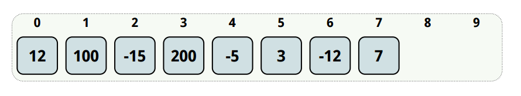

And **`Build Min-Heap`** would be like:

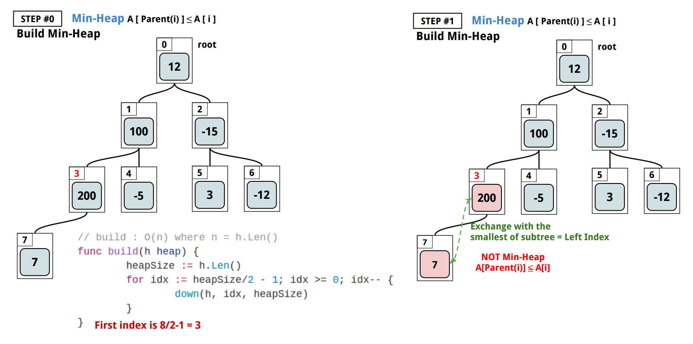
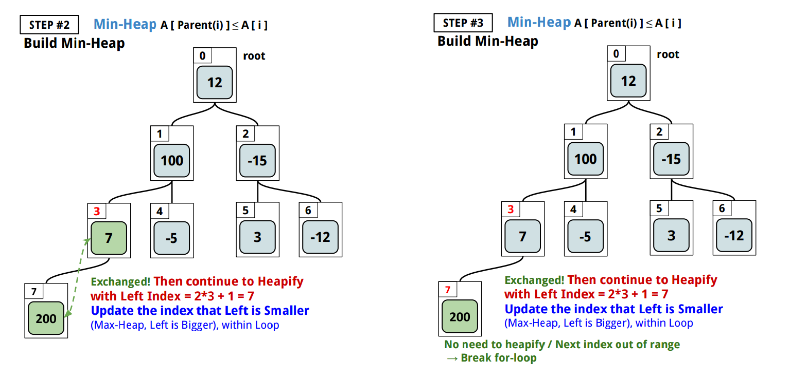
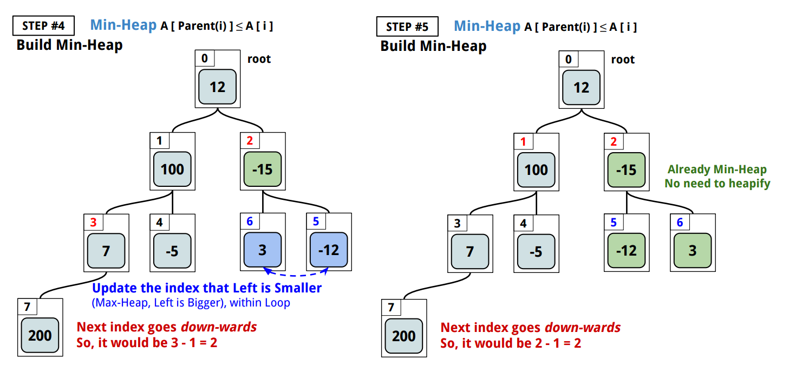
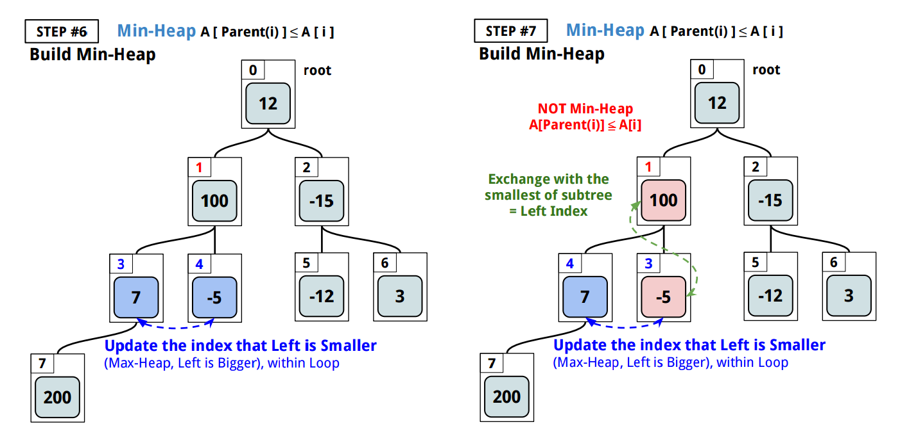
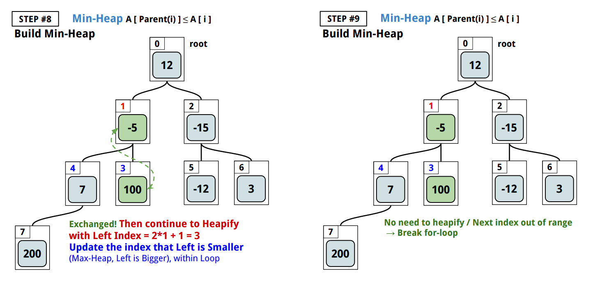
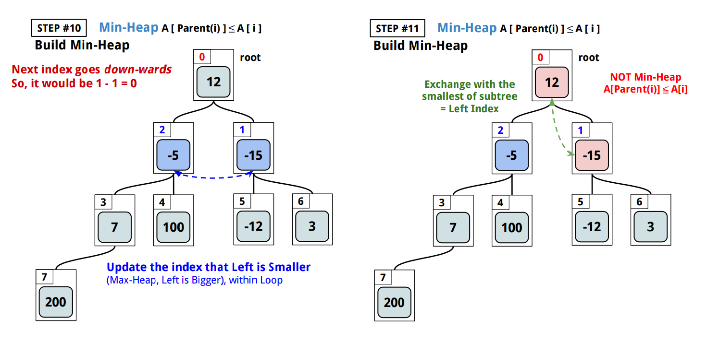
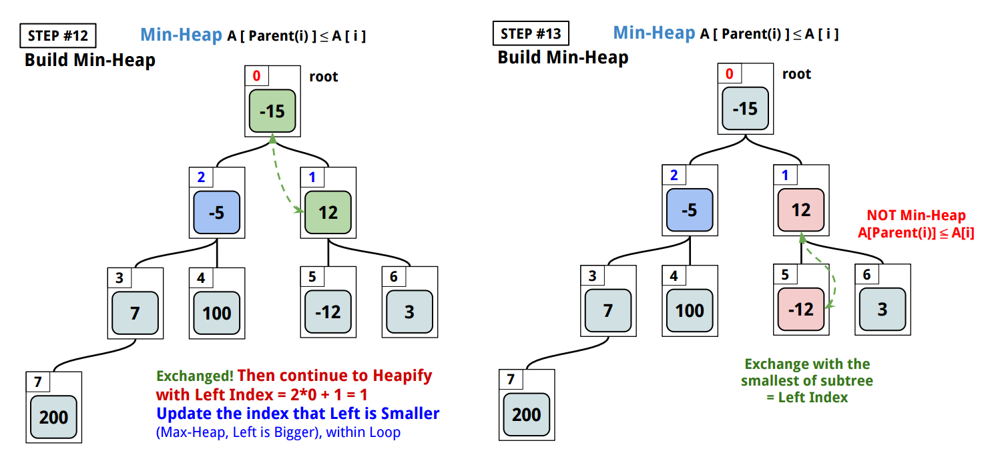
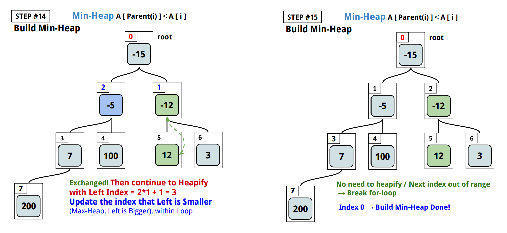

Now the **`Min-Heap`** got built.

[↑ top](#go-heap-priority-queue)
<br><br><br><br>
<hr>


#### `heap.Push`

[**`heap.Push`**](http://golang.org/pkg/container/heap/#Push) inserts a node to a `heap` data structure whiling maintaining the
heap properties:

```go
func push(h heap, val interface{}) {
    h.push(val)
    up(h, h.Len()-1)
}
```

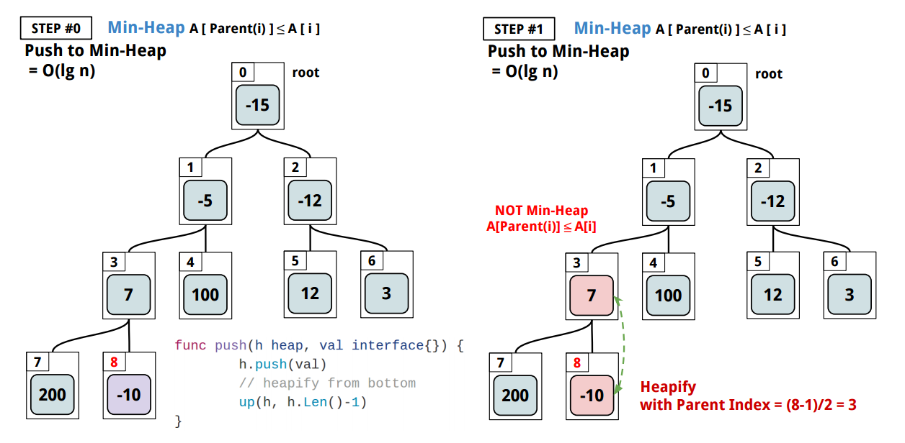
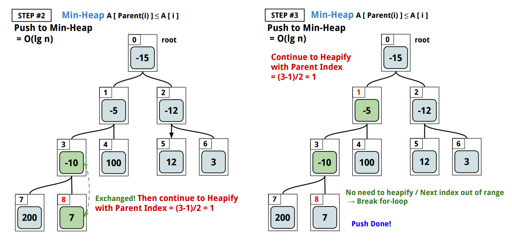
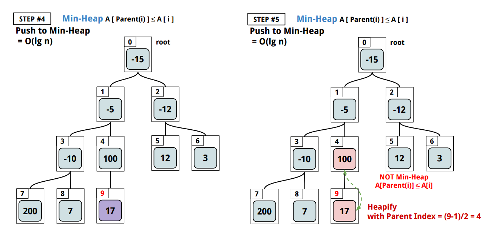
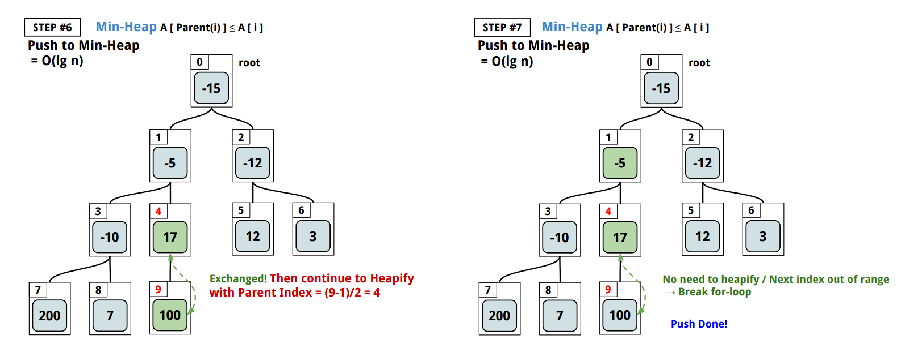

[↑ top](#go-heap-priority-queue)
<br><br><br><br>
<hr>


#### `heap.Pop`

[**`heap.Pop`**](http://golang.org/pkg/container/heap/#Pop) pops the **_minimum value_** in **Min-Heap**.
And **_maximum value_** in **Max-Heap**, while maintaining the heap
properties:


```go
func pop(h heap) interface{} {
   lastIdx := h.Len() - 1
   h.Swap(0, lastIdx)
   heapSize := lastIdx
   down(h, 0, heapSize)
   return h.pop()
}
```

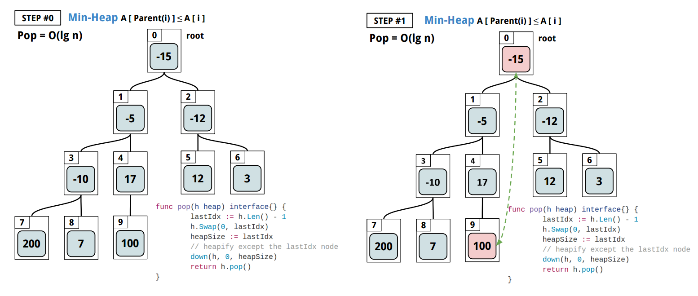
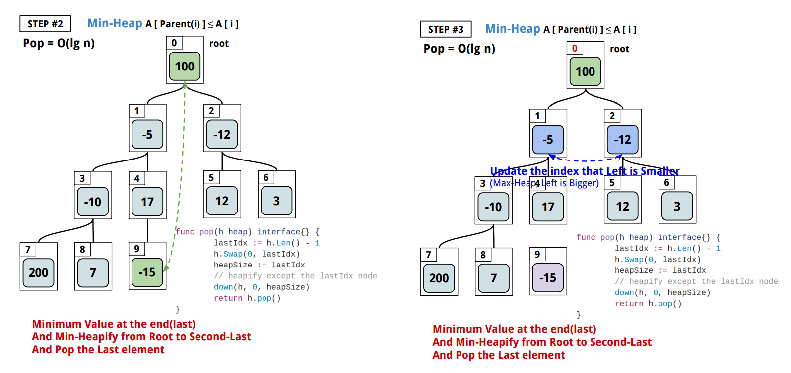
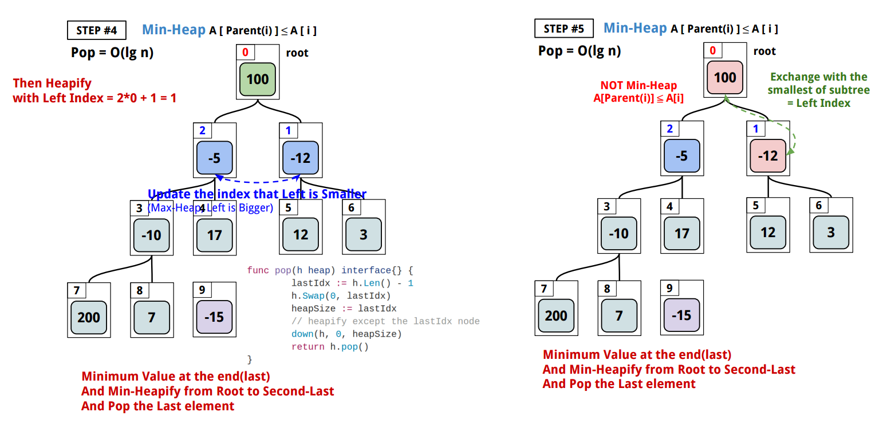
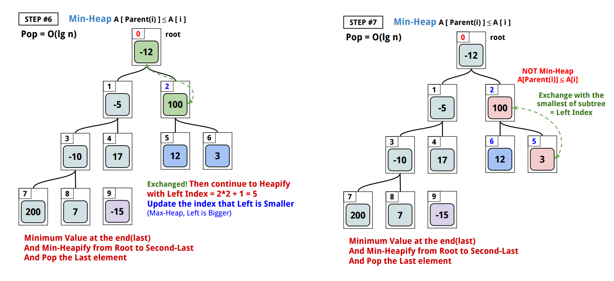
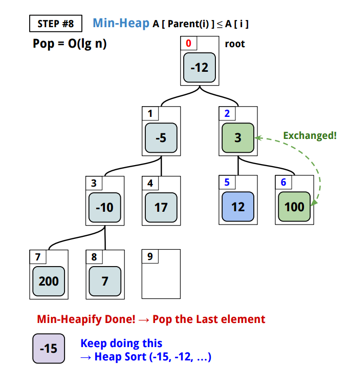

[↑ top](#go-heap-priority-queue)
<br><br><br><br>
<hr>


#### Priority Queue

[**Priority queue**](https://en.wikipedia.org/wiki/Priority_queue) can be
implemented by
[`container/heap`](http://golang.org/pkg/container/heap/), like
[here](http://play.golang.org/p/yNZyBW8Zcz):

```go
// This example demonstrates a priority queue built using the heap interface.
// Source: https://go.googlesource.com/go/+/master/src/container/heap/example_pq_test.go
//
package main

import (
	"container/heap"
	"fmt"
)

// An Item is something we manage in a priority queue.
type Item struct {
	value    string // The value of the item; arbitrary.
	priority int    // The priority of the item in the queue.
	// The index is needed by update and is maintained by the heap.Interface methods.
	index int // The index of the item in the heap.
}

// A PriorityQueue implements heap.Interface and holds Items.
type PriorityQueue []*Item

func (pq PriorityQueue) Len() int { return len(pq) }

func (pq PriorityQueue) Less(i, j int) bool {
	// We want Pop to give us the highest, not lowest, priority so we use greater than here.
	return pq[i].priority > pq[j].priority
}

func (pq PriorityQueue) Swap(i, j int) {
	pq[i], pq[j] = pq[j], pq[i]
	pq[i].index = i
	pq[j].index = j
}

func (pq *PriorityQueue) Push(x interface{}) {
	n := len(*pq)
	item := x.(*Item)
	item.index = n
	*pq = append(*pq, item)
}

func (pq *PriorityQueue) Pop() interface{} {
	old := *pq
	n := len(old)
	item := old[n-1]
	item.index = -1 // for safety
	*pq = old[0 : n-1]
	return item
}

// update modifies the priority and value of an Item in the queue.
func (pq *PriorityQueue) update(item *Item, value string, priority int) {
	item.value = value
	item.priority = priority
	heap.Fix(pq, item.index)
}

// This example creates a PriorityQueue with some items, adds and manipulates an item,
// and then removes the items in priority order.
func main() {
	// Some items and their priorities.
	items := map[string]int{
		"banana": 3, "apple": 2, "pear": 4,
	}

	// Create a priority queue, put the items in it, and
	// establish the priority queue (heap) invariants.
	pq := make(PriorityQueue, len(items))
	i := 0
	for value, priority := range items {
		pq[i] = &Item{
			value:    value,
			priority: priority,
			index:    i,
		}
		i++
	}
	heap.Init(&pq)

	// Insert a new item and then modify its priority.
	item := &Item{
		value:    "orange",
		priority: 1,
	}
	heap.Push(&pq, item)
	pq.update(item, item.value, 5)

	// Take the items out; they arrive in decreasing priority order.
	for pq.Len() > 0 {
		item := heap.Pop(&pq).(*Item)
		fmt.Printf("%.2d:%s ", item.priority, item.value)
	}
	// 05:orange 04:pear 03:banana 02:apple 
}
```

[↑ top](#go-heap-priority-queue)
<br><br><br><br>
<hr>
