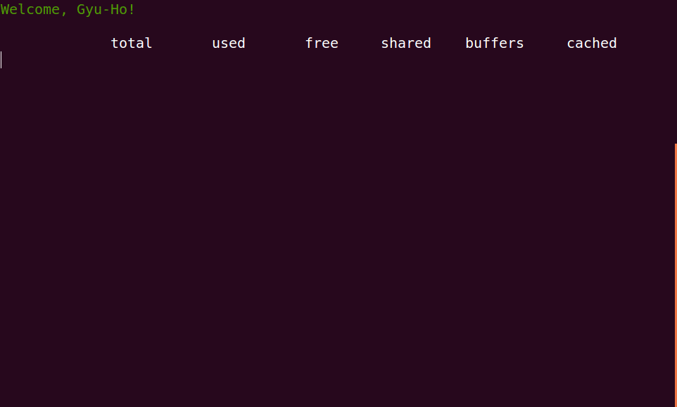

[*back to contents*](https://github.com/gyuho/learn#contents)
<br>

# Go: interface

- [Reference](#reference)
- [Why Interface: Less is More](#why-interface-less-is-more)
- [**`struct` for data, `interface` for method, `interface` contains data?**](#struct-for-data-interface-for-method-interface-contains-data)
- [empty `interface`](#empty-interface)
- [interface in `io.Reader` and `io.Writer`](#interface-in-ioreader-and-iowriter)
- [package `io/ioutil`](#package-ioioutil)
- [interface in `container/heap`](#interface-in-containerheap)
- [**review `interface`**](#review-interface)
- [`ioprogress`](#ioprogress)
- [`sort`](#sort)
- [sort table](#sort-table)
- [permute `string`](#permute-string)
- [random `bytes`](#random-bytes)
- [permute `bytes`](#permute-bytes)

[↑ top](#go-interface)
<br><br><br><br>
<hr>


#### Reference

There are many great articles on *Go interfaces*:

- [*Less is exponentially more by Rob
  Pike*](http://commandcenter.blogspot.co.il/2012/06/less-is-exponentially-more.html)
- [*Go at Google by Rob Pike*](https://talks.golang.org/2012/splash.article)
- [*Laws of reflection by Rob Pike*](http://blog.golang.org/laws-of-reflection)
- [*Interfaces by Russ Cox*](http://research.swtch.com/interfaces)
- [*Expressiveness of Go by Rob
  Pike*](http://talks.golang.org/2010/ExpressivenessOfGo-2010.pdf)
- [*How to use interfaces in Go by Jordan
  Orelli*](http://jordanorelli.com/post/32665860244/how-to-use-interfaces-in-go)
- [*Interface pollution in Go by Burcu
  Dogan*](https://medium.com/@rakyll/interface-pollution-in-go-7d58bccec275)

And Go has great documentation at [*golang.org*](http://golang.org/doc/), with
almost everything you need. But for some reason, *interface* never felt clear
to me. It wasn't until I transliterated
[`container/heap`](https://go.googlesource.com/go/+/master/src/container/heap/heap.go)
package, that I came to appreciate the subtlety and elegance of interface in
Go. Are you still confused about interface? Pick any standard package with an
interface and transcribe them line by line. This summarizes what I have
learned from that practice.

[↑ top](#go-interface)
<br><br><br><br>
<hr>


#### Why Interface: Less is More

Go has **static** and [**dynamic** types](https://golang.org/ref/spec#Variables):

> The static type (or just type) of a variable is the type given in its
> declaration, the type provided in the new call or composite literal, or the
> type of an element of a structured variable. **Variables of interface type also
> have a distinct dynamic type**, which is the concrete type of the value
> assigned to the variable at run time (unless the value is the predeclared
> identifier nil, which has no type). **The dynamic type may vary during
> execution but values stored in interface variables are always assignable to
> the static type of the variable.**
>
> [**_Go Spec_**](https://golang.org/ref/spec#Variables)

```go
var x interface{}  // x is nil and has static type interface{}
var v *T           // v has value nil, static type *T
x = 42             // x has value 42 and dynamic type int
x = v              // x has value (*T)(nil) and dynamic type *T
```

Type system feels lighter than in C or C++. And **Go interface** makes **code**
**_composable_** with generic functionalities. But don't overuse it:

> Introduce concrete types and don’t export any interfaces unless you have to
> encourage external packages to implement one.
>
> [**_Burcu
> Dorgan_**](https://medium.com/@rakyll/interface-pollution-in-go-7d58bccec275)

With that in mind...

<br>

> Programmers who come to Go from C++ and Java miss the idea of programming
> with types, particularly inheritance and subclassing and all that. […] If you
> believe that types address all design issues you must make that decision. […]
> What matters isn’t the ancestor relations between things but what they can do
> for you. That, of course, is where interfaces come into Go. But they’re part
> of a bigger picture, the true Go philosophy. If C++ and Java are about type
> hierarchies and the taxonomy of types, **_Go is about composition_**.
>
> [**_Rob
> Pike_**](http://commandcenter.blogspot.co.il/2012/06/less-is-exponentially-more.html)

There is **neither inheritance nor type hierarchies in Go**: it has type
embedding. Go composes different types using interface. **Go is about
composition,** not inheritance:

<br>

> **Note too that the elimination of the type hierarchy also eliminates a form
> of dependency hierarchy. Interface satisfaction allows the program to grow
> organically without predetermined contracts.** And it is a linear form of
> growth; a change to an interface affects only the immediate clients of that
> interface; there is no subtree to update. **The lack of implements
> declarations disturbs some people but it enables programs to grow naturally,
> gracefully, and safely.**
>
> [**_Rob Pike_**](https://talks.golang.org/2012/splash.article)

Interface is a set of methods (not functions).
[Polymorphism](http://en.wikipedia.org/wiki/Polymorphism_%28computer_science%29)
can be done via interfaces. Any type that implements those set of methods
automatically satisfies the interface. **Interface is satisfied implicitly**:
you don’t have to specify that *a data type A implements interface B.*
Therefore, we can define our own interface methods for the code that we don’t
own. This has a huge impact on program design and encourages to write
compatible code.

[↑ top](#go-interface)
<br><br><br><br>
<hr>


#### **`struct` for data, `interface` for method, `interface` contains data?**

Go **struct** controls the layout of **data**, while Go **interface**:
- is a set of methods.
- is a set of constraints on types.
- is to specify the behavior of an object.

<br>

> Interfaces in Go provide a way to specify the behavior of an object: if
> **something can do this, then it can be used here**.
>
> [**_Effective
> Go_**](https://golang.org/doc/effective_go.html#interfaces_and_types)

<br>


For instance,
[`time.Time`](https://go.googlesource.com/go/+/master/src/time/time.go) is
**_`struct`_** because it contains **data** of your local time:

```go
type Time struct {
    sec  int64
    nsec int32
    loc  *Location
}
```

[**`sort.Interface`**](http://golang.org/pkg/sort/#Interface)
is **_`interface`_** to specify **_behaviors_** or **_requirements_** for
[*`sort`*](http://golang.org/pkg/sort/):

```go
type Interface interface {
    Len() int
    Less(i, j int) bool
    Swap(i, j int)
}
```

**_`struct`_** is a **type** to **contain data with a set of fields for its
values**. **_`interface`_** is also a **type** to **represent a behavior with a
set of methods**. **_`interface`_** is a set of **constraints on types with
methods**. When a **type implements all the methods in an interface type**, the
**_type_** **implicitly satisfies the interface**. You need not declare that a
type is trying to use the interface. Here’s an
[example](http://play.golang.org/p/WDQWzdlHnu):

```go
package main
 
import (
	"fmt"
	"sort"
)
 
var words = []string{
	"adasdasd", "d", "aaasdasdasd", "qqqq", "kkkk",
}
 
type byLength []string
 
func (s byLength) Len() int {
	return len(s)
}
func (s byLength) Swap(i, j int) {
	s[i], s[j] = s[j], s[i]
}
func (s byLength) Less(i, j int) bool {
	return len(s[i]) < len(s[j]) // ascending order
}
 
func main() {
	sort.Sort(sort.StringSlice(words))
	// sort.Strings(words)
	fmt.Printf("%q\n", words)
	// ["aaasdasdasd" "adasdasd" "d" "kkkk" "qqqq"]
 
	sort.Sort(byLength(words))
	fmt.Printf("%q\n", words)
	// ["d" "kkkk" "qqqq" "adasdasd" "aaasdasdasd"]
}
```


There is **no explicit declaration** that the *type* **_byLength_** implements
the interface [**_`sort.Interface`_**](http://golang.org/pkg/sort/#Interface) because
the type already implements all three methods: *`Len`*, *`Swap`*, and *`Less`*. 
Then the *type* **_byLength_** satisfies the **_`sort.Interface`_** implicitly. 

<br>

- *`struct`* is a type and contains data with a set of fields.
- *`interface`* is also a type and represents a behavior with a set of methods. 

<br>

**In practice**, **_interface tends to be used as an argument for a function._** 
For instance, [**_sort.Sort_**](http://golang.org/pkg/sort/#Sort) **function** takes 
the **_`sort.Interface`_** as an argument:

```go
// Sort sorts data.
// It makes one call to data.Len to determine n
// , and O(n*log(n)) calls to data.Less and data.Swap.
func Sort(data Interface) {
    n := data.Len()
    maxDepth := 0
    for i := n; i > 0; i >>= 1 {
        maxDepth++
    }
    maxDepth *= 2
    quickSort(data, 0, n, maxDepth)
}
```

<br>

*interface* is a set of constraints. Then how possible to pass *`interface`* 
as an argument?

> One important category of type is interface types, which represent fixed sets
> of methods. **An interface variable can store any concrete (non-interface)
> value as long as that value implements the `interface`’s methods.**
>
> [**_Laws of Reflection by Rob Pike_**](http://blog.golang.org/laws-of-reflection)

Therefore, `interface` can contain data(or value) as long as a
type satisfies the `interface`.

<br>

When a type implements all the *three* methods—*`Len`*, *`Swap`*, *`Less`* in
**_`sort.Intetface`_**, a value of the type that implements can be used as an 
interface variable *`sort.Interface`*. In the example above, **_byLength_** type 
implements all those *three* methods, therefore being passed as an argument to
[**_`sort.Sort`_**](http://golang.org/pkg/sort/#Sort):

```go
// sort.Sort(data sort.Interface)
sort.Sort(byLength(words))
```


<br>
Here's another [example](http://play.golang.org/p/ZMHCZI98Sw) to use
**_`sort.Interface`_**. And you can use this for any data types as long as your 
type satisfies the **_`sort.Interface`_**:

```go
package main
 
import (
	"fmt"
	"sort"
)
 
type keyValue struct {
	key   string
	value float64
}
 
type keyValueSlice []keyValue
 
func (p keyValueSlice) Swap(i, j int) { p[i], p[j] = p[j], p[i] }
func (p keyValueSlice) Len() int      { return len(p) }
func (p keyValueSlice) Less(i, j int) bool {
	return p[i].value < p[j].value
}
 
func sortMapByValue(m map[string]float64) keyValueSlice {
	p := make(keyValueSlice, len(m))
	i := 0
	for k, v := range m {
		p[i] = keyValue{k, v}
		i++
	}
	sort.Sort(p)
	return p
}
 
func main() {
	sfmap := map[string]float64{
		"California":    9.9,
		"Japan":         7.23,
		"Korea":         -.3,
		"Hello":         1.5,
		"USA":           8.4,
		"San Francisco": 8.4,
		"Ohio":          -1.10,
		"New York":      1.23,
		"Los Angeles":   23.1,
		"Mountain View": 9.9,
	}
	fmt.Println(sortMapByValue(sfmap), len(sortMapByValue(sfmap)))
	// [{Ohio -1.1} {Korea -0.3} {New York 1.23} {Hello 1.5}
	// {Japan 7.23} {USA 8.4} {San Francisco 8.4} {California 9.9}
	// {Mountain View 9.9} {Los Angeles 23.1}] 10
}
```


[↑ top](#go-interface)
<br><br><br><br>
<hr>


#### empty `interface`

An `interface` type variable **can have a concrete (non-interface) value as long
as the value’s type implements the interface’s methods.**  Then how about *empty interface*?


```go
type _ interface {

}

// empty struct with no data would be:
// struct{}{}
```

The empty interface type does not require any methods. Then any type of value
satisfies the empty interface. **Empty interface can represent any value** in Go,
like the following [code](http://play.golang.org/p/AGbhwvGenY):

```go
package main
 
import (
	"fmt"
	"reflect"
)
 
func main() {
	var slice = []interface{}{"A", 1, struct{}{}}
	fmt.Printf("slice %+v\n", slice)
	fmt.Printf("slice %+v\n", reflect.TypeOf(slice))
 
	fmt.Printf("slice %+v\n", reflect.ValueOf(slice).Kind())
	fmt.Printf("slice %+v\n", reflect.ValueOf(slice).String())
}
 
/*
slice [A 1 {}]
slice []interface {}
slice slice
slice <[]interface {} Value>
*/
```

[↑ top](#go-interface)
<br><br><br><br>
<hr>


#### interface in `io.Reader` and `io.Writer`

Go interface gives us an incredible amount of composability. Things just fit
together. It’s very simple and composable between different kinds of
implementations in Go, especially when working with files or a stream of bytes.
Most widely used interface would be
[*`io.Reader`*](http://golang.org/pkg/io/#Reader) and
[*`io.Writer`*](http://golang.org/pkg/io/#Writer), the types *`Reader`* and
*`Writer`* from [`io` package](http://golang.org/pkg/io/):

```go
// Reader is the interface that wraps the basic Read method.
type Reader interface {
    Read(p []byte) (n int, err error)
}

// Writer is the interface that wraps the basic Write method.
type Writer interface {
    Write(p []byte) (n int, err error)
}
```

<br>
**Any type that implements** a **_`Read`_**(or **_`Write`_**) method with the same
signature is said to implement [*`io.Reader`*](http://golang.org/pkg/io/#Reader) 
or [*`io.Writer`*](http://golang.org/pkg/io/#Writer) interface, and the
**_interface type variable can have a concrete value_**. Here's an example from
[`bufio`](http://golang.org/pkg/bufio/#NewScanner) package:

```go
NewScanner(r io.Reader) *Scanner
```

**`bufio.NewScanner`** takes **`io.Reader`** *interface* variable as an
*argument*. And the **interface type variable** **_`r`_** has a **_concrete
value_** when the **value's type** **_implements(or satisfies)_** the **interface's
methods.** That is, a **type must implement** **_`Read`_** **method** in order to
be used as an **argument to**
[**_`bufio.NewScanner`_**](http://golang.org/pkg/bufio/#NewScanner).


<br>
For example, [*`os.File`*](https://go.googlesource.com/go/+/master/src/os/file.go)
implements *`Read`* method as
[follows](https://github.com/golang/go/blob/master/src/os/file.go#L91):

```go
func (f *File) Read(b []byte) (n int, err error) {
    if f == nil {
        return 0, ErrInvalid
    }
    n, e := f.read(b)
    if n < 0 {
        n = 0
    }
    if n == 0 && len(b) > 0 && e == nil {
        return 0, io.EOF
    }
    if e != nil {
        err = &PathError("read", f.name, e}
    }
    return n, err
}
```

<br>
Since the [*`os.File`*](https://go.googlesource.com/go/+/master/src/os/file.go)
implements *Read* method, it can be used as an argument to
[**_`bufio.NewScanner`_**](http://golang.org/pkg/bufio/#NewScanner). And the
usage would be:

```go
package main
 
import (
	"bufio"
	"fmt"
	"log"
	"os"
)
 
var fpath = "a.txt"
 
func main() {
	// func OpenFile(name string, flag int, perm FileMode) (file *File, err error)
	f, err := os.OpenFile(fpath, os.O_RDONLY, 0444)
	if err != nil {
		log.Fatal(err)
	}
	lines := []string{}
	scanner := bufio.NewScanner(f)
	for scanner.Scan() {
		lines = append(lines, scanner.Text())
	}
	if err := scanner.Err(); err != nil {
		log.Fatal(err)
	}
	if err := f.Close(); err != nil {
		log.Fatal(err)
	}
	fmt.Printf("%q\n", lines)
	// a.txt contents ...
}
```

<br>
Here are types that satisfy **_`io.Reader`_** interface by implementing **_`Read`_** method:

- *bufio.Reader, os.File, os.Stdin, os.Stdout, os.Stderr, bytes.Buffer,
  net.Conn, http.Request.Body, http.Response.Body, …*

Here are types that satisfy **_`io.Writer`_** interface by implementing
**_`Write`_** method:

- *bufio.Writer, os.File, os.Stdin, os.Stdout, os.Stderr, bytes.Buffer,
  net.Conn, …*


[↑ top](#go-interface)
<br><br><br><br>
<hr>


#### package `io/ioutil`

[package `io/ioutil`](http://golang.org/pkg/io/ioutil) implements some I/O utility functions.

```go
package main

import (
	"fmt"
	"io/ioutil"
	"net/http"
)

func main() {
	resp, err := http.Get("http://google.com/")
	if err != nil {
		panic(err)
	}
	defer resp.Body.Close()
	bts, err := ioutil.ReadAll(resp.Body)
	if err != nil {
		panic(err)
	}
	fmt.Println(string(bts))
	// <div id=gbar><nobr><b class=gb1>Search</b>...
}
```

<br>
<br>
[`ioutil.ReadAll`](http://golang.org/pkg/io/ioutil/#ReadAll) takes `io.Reader` as an argument:

```go
func ReadAll(r io.Reader) ([]byte, error)
```

<br>
<br>
[`http.Response`](http://golang.org/pkg/net/http/#Response) struct 
embeds `io.ReadCloser` interface.:

```go
type Response struct {
	...
	Body io.ReadCloser
}
```

<br>
<br>
[`io.ReadCloser`](http://golang.org/pkg/io/#ReadCloser) interface embeds `io.Reader` interface:

```go
type ReadCloser interface {
	Reader
	Closer
}
```

Therefore, `http.Response.Body` of type `io.ReadCloser` is also type `io.Reader`.
Any type that satisfies `io.Reader` interface (*implements* `Read` method)
can be passed to `ioutil.ReadAll`. 

```go
ioutil.ReadAll(resp.Body)
```


<br>
Then does `http.Response.Body` type implement `Read` method? *No.*
`http.Response.Body` is used as `io.Reader` interface argument.
Then you might think `http.Response.Body` type should implement 
`Read` method to satisfy the `io.Reader` interface but it doesn not. 
Neither does `Close`. `http.Response.Body` can hold any type that
implements `Read` and `Close`, but the **actual type** depends on 
the server that you are getting response from, as
[here](https://github.com/golang/go/blob/master/src/net/http/transfer.go):

```go
	// Prepare body reader.  ContentLength < 0 means chunked encoding
	// or close connection when finished, since multipart is not supported yet
	switch {
	case chunked(t.TransferEncoding):
		if noBodyExpected(t.RequestMethod) {
			t.Body = eofReader
		} else {
			t.Body = &body{src: internal.NewChunkedReader(r), hdr: msg, r: r, closing: t.Close}
		}
	case realLength == 0:
		t.Body = eofReader
	case realLength > 0:
		t.Body = &body{src: io.LimitReader(r, realLength), closing: t.Close}
	default:
		// realLength < 0, i.e. "Content-Length" not mentioned in header
		if t.Close {
			// Close semantics (i.e. HTTP/1.0)
			t.Body = &body{src: r, closing: t.Close}
		} else {
			// Persistent connection (i.e. HTTP/1.1)
			t.Body = eofReader
		}
	}
```

[↑ top](#go-interface)
<br><br><br><br>
<hr>


#### interface in `container/heap`

Here's an *interface* in
[`container/heap`](https://go.googlesource.com/go/+/master/src/container/heap/heap.go)
package:

```go
type Interface interface {
    sort.Interface
    Push(x interface{})
    Pop() interface{}
}
```

As you can see,
[**_`heap.Interface`_**](http://golang.org/pkg/container/heap/#Interface) embeds
[**_`sort.Interface`_**](http://golang.org/pkg/sort/#Interface). When a type
implements all the methods in an interface type, the type implicitly satisfies
the interface. In order to satisfy **_heap.Interface_**, a type must implement
all *three* methods *`Len`*, *`Swap`*, and *`Less`* in **_`sort.Interface`_** plus
*two* methods **_`Push`_** and **_`Pop`_**. And here's the
[**_`Init`_**](http://golang.org/pkg/container/heap/#Init) that takes the
*interface* as an argument:

```go
func Init(h heap.Interface)
```

[**_`heap.Init`_**](http://golang.org/pkg/container/heap/#Init) takes
[**_`heap.Interface`_**](http://golang.org/pkg/container/heap/#Interface)
*variable* as an *argument*. And the **interface type variable** **_h_**
**would have a** **_concrete value_** as long as the **value implements the
interface's methods.** That is, **a type must implement** all *three* methods
*`Len`*, *`Swap`*, and *`Less`* for **_`sort.Interface`_** and *two* methods *`Push`* and
*`Pop`* for **_`heap.Interface`_**—in order to be used as an **argument to**
[**_`heap.Init`_**](http://golang.org/pkg/container/heap/#Init). Here's an
[example](http://play.golang.org/p/PoSTxQ4tSa):

```go
package main
 
import (
	"container/heap"
	"fmt"
)
 
// An IntHeap is a min-heap of ints.
type IntHeap []int
 
func (h IntHeap) Len() int           { return len(h) }
func (h IntHeap) Less(i, j int) bool { return h[i] < h[j] }
func (h IntHeap) Swap(i, j int)      { h[i], h[j] = h[j], h[i] }
 
func (h *IntHeap) Push(x interface{}) {
	// Push and Pop use pointer receivers
	// because they modify the slice's length,
	// not just its contents.
	*h = append(*h, x.(int))
}
 
func (h *IntHeap) Pop() interface{} {
	heapSize := len(*h)
	lastNode := (*h)[heapSize-1]
	*h = (*h)[:heapSize-1]
	return lastNode
}
 
// This example inserts several ints into an IntHeap, checks the minimum,
// and removes them in order of priority.
func main() {
	h := &IntHeap{10, 99, 7, 16, 5}
	heap.Init(h)
	heap.Push(h, 3)
	fmt.Printf("minimum: %d\n", (*h)[0])
	// minimum: 3
 
	// Keep popping the minimum element
	for h.Len() > 0 {
		fmt.Printf("%d ", heap.Pop(h))
	}
	// 3 5 7 10 16 99
}
```

[↑ top](#go-interface)
<br><br><br><br>
<hr>


#### **review `interface`**

> **Note too that the elimination of the type hierarchy also eliminates a form
> of dependency hierarchy. Interface satisfaction allows the program to grow
> organically without predetermined contracts.** And it is a linear form of
> growth; a change to an interface affects only the immediate clients of that
> interface; there is no subtree to update. **The lack of implements
> declarations disturbs some people but it enables programs to grow naturally,
> gracefully, and safely.**
>
> [**_Rob Pike_**](https://talks.golang.org/2012/splash.article)

Interface is a set of methods (not functions).
[Polymorphism](http://en.wikipedia.org/wiki/Polymorphism_%28computer_science%29)
can be done via interfaces. Any type that implements those set of methods
automatically satisfies the interface. **Interface is satisfied implicitly**:
you don’t have to specify that *a data type A implements interface B.*
Therefore, we can define our own interface methods for the code that we don’t
own. This has a huge impact on program design and encourages to write
compatible code.

<br>

> One important category of type is interface types, which represent fixed sets
> of methods. **An interface variable can store any concrete (non-interface)
> value as long as that value implements the `interface`’s methods.**
>
> [**_Laws of Reflection by Rob Pike_**](http://blog.golang.org/laws-of-reflection)

[↑ top](#go-interface)
<br><br><br><br>
<hr>


#### `ioprogress`

One great example of Go *interface* is
[`ioprogress`](https://github.com/mitchellh/ioprogress) by [*Mitchell
Hashimoto*](https://github.com/mitchellh):




```go
package main
 
import (
	"fmt"
	"io"
	"log"
	"net/http"
	"os"
	"time"
 
	"github.com/mitchellh/ioprogress"
)
 
func main() {
	downloadTarget := "http://releases.ubuntu.com/14.04.2/ubuntu-14.04.2-desktop-amd64.iso"
	resp, err := http.Get(downloadTarget)
	if err != nil {
		log.Fatal(err)
	}
 
	size := resp.ContentLength
	progressR := &ioprogress.Reader{
		Reader:       resp.Body,
		Size:         size,
		DrawInterval: time.Millisecond,
		DrawFunc: func(progress, total int64) error {
			if progress == total {
				fmt.Printf("\rDownloading: %s%10s", ioprogress.DrawTextFormatBytes(size, size), "")
				return nil
			}
			fmt.Printf("\rDownloading: %s%10s", ioprogress.DrawTextFormatBytes(progress, total), "")
			return nil
		},
	}
 
	file, err := open("ubuntu.iso")
	if err != nil {
		log.Fatal(err)
	}
	if _, err = io.Copy(file, progressR); err != nil {
		log.Fatal(err)
	}
}
 
func open(fpath string) (*os.File, error) {
	file, err := os.OpenFile(fpath, os.O_RDWR|os.O_TRUNC, 0777)
	if err != nil {
		file, err = os.Create(fpath)
		if err != nil {
			return file, err
		}
	}
	return file, nil
}
```

[↑ top](#go-interface)
<br><br><br><br>
<hr>


#### `sort`

[Code](http://play.golang.org/p/Ss48HqtqMo):

```go
package main

import (
	"fmt"
	"sort"
)

type person struct {
	Name string
	Age  int
}

func (p person) String() string {
	return fmt.Sprintf("%s: %d", p.Name, p.Age)
}

// byAge implements sort.Interface for []person based on
// the Age field.
type byAge []person

func (a byAge) Len() int           { return len(a) }
func (a byAge) Swap(i, j int)      { a[i], a[j] = a[j], a[i] }
func (a byAge) Less(i, j int) bool { return a[i].Age < a[j].Age }

func main() {
	people := []person{
		{"Bob", 31},
		{"John", 42},
		{"Michael", 17},
		{"Jenny", 26},
	}

	fmt.Println(people) // [Bob: 31 John: 42 Michael: 17 Jenny: 26]
	sort.Sort(byAge(people))
	fmt.Println(people) // [Michael: 17 Jenny: 26 Bob: 31 John: 42]
}
```

[↑ top](#go-interface)
<br><br><br><br>
<hr>


#### sort table

Try [this](http://play.golang.org/p/b3iZfgsGe5) and [this](http://play.golang.org/p/h2OLcglgjq):

```go
package main

import (
	"fmt"
	"sort"
)

func main() {
	rows := [][]string{
		[]string{"1", "a", "1", "10"},
		[]string{"1", "b", "1", "9"},
		[]string{"1", "c", "1", "8"},
		[]string{"1", "d", "1", "7"},
		[]string{"1", "e", "1", "6"},
		[]string{"1", "f", "1", "5"},
		[]string{"1", "g", "1", "4"},
		[]string{"1", "h", "1", "3"},
		[]string{"1", "i", "1", "2"},
		[]string{"1", "j", "1", "1"},
	}
	rs1 := stringsAscending(rows, 1)
	if fmt.Sprintf("%v", rs1) != "[[1 a 1 10] [1 b 1 9] [1 c 1 8] [1 d 1 7] [1 e 1 6] [1 f 1 5] [1 g 1 4] [1 h 1 3] [1 i 1 2] [1 j 1 1]]" {
		fmt.Errorf("rs1 %v", rs1)
	}
	rs2 := stringsAscending(rows, 3)
	if fmt.Sprintf("%v", rs2) != "[[1 j 1 1] [1 a 1 10] [1 i 1 2] [1 h 1 3] [1 g 1 4] [1 f 1 5] [1 e 1 6] [1 d 1 7] [1 c 1 8] [1 b 1 9]]" {
		fmt.Errorf("rs2 %v", rs2)
	}
	rs3 := stringsDescending(rows, 1)
	if fmt.Sprintf("%v", rs3) != "[[1 j 1 1] [1 i 1 2] [1 h 1 3] [1 g 1 4] [1 f 1 5] [1 e 1 6] [1 d 1 7] [1 c 1 8] [1 b 1 9] [1 a 1 10]]" {
		fmt.Errorf("rs3 %v", rs3)
	}
	rs4 := stringsDescending(rows, 3)
	if fmt.Sprintf("%v", rs4) != "[[1 b 1 9] [1 c 1 8] [1 d 1 7] [1 e 1 6] [1 f 1 5] [1 g 1 4] [1 h 1 3] [1 i 1 2] [1 a 1 10] [1 j 1 1]]" {
		fmt.Errorf("rs4 %v", rs4)
	}
}

var sortColumnIndex int

// sortByIndexAscending sorts two-dimensional strings in an ascending order, at a specified index.
type sortByIndexAscending [][]string

func (s sortByIndexAscending) Len() int {
	return len(s)
}

func (s sortByIndexAscending) Swap(i, j int) {
	s[i], s[j] = s[j], s[i]
}

func (s sortByIndexAscending) Less(i, j int) bool {
	return s[i][sortColumnIndex] < s[j][sortColumnIndex]
}

// stringsAscending sorts two dimensional strings in an ascending order.
func stringsAscending(rows [][]string, idx int) [][]string {
	sortColumnIndex = idx
	sort.Sort(sortByIndexAscending(rows))
	return rows
}

// sortByIndexDescending sorts two-dimensional strings in an Descending order, at a specified index.
type sortByIndexDescending [][]string

func (s sortByIndexDescending) Len() int {
	return len(s)
}

func (s sortByIndexDescending) Swap(i, j int) {
	s[i], s[j] = s[j], s[i]
}

func (s sortByIndexDescending) Less(i, j int) bool {
	return s[i][sortColumnIndex] > s[j][sortColumnIndex]
}

// stringsDescending sorts two dimensional strings in a descending order.
func stringsDescending(rows [][]string, idx int) [][]string {
	sortColumnIndex = idx
	sort.Sort(sortByIndexDescending(rows))
	return rows
}
```

```go
package main

import (
	"fmt"
	"log"
	"sort"
	"strconv"
)

func strToFloat64(str string) float64 {
	f, err := strconv.ParseFloat(str, 64)
	if err != nil {
		log.Fatal(err)
	}
	return f
}

func main() {
	rows := [][]string{
		[]string{"cdomain.com", "3", "-5.02", "aaa", "aaa"},
		[]string{"cdomain.com", "2", "133.02", "aaa", "aaa"},
		[]string{"cdomain.com", "1", "1.02", "aaa", "aaa"},
		[]string{"bdomain.com", "2", "23.02", "aaa", "aaa"},
		[]string{"bdomain.com", "1", "12.02", "aaa", "aaa"},
		[]string{"bdomain.com", "3", "53.02", "aaa", "aaa"},
		[]string{"adomain.com", "5", "32.1232", "aaa", "aaa"},
		[]string{"adomain.com", "3", "2.02202", "aaa", "aaa"},
		[]string{"adomain.com", "1", "511.02", "aaa", "aaa"},
	}
	ascendingName0 := func(row1, row2 *[]string) bool {
		return (*row1)[0] < (*row2)[0]
	}
	descendingVal := func(row1, row2 *[]string) bool {
		return strToFloat64((*row1)[2]) > strToFloat64((*row2)[2])
	}
	ascendingName1 := func(row1, row2 *[]string) bool {
		return (*row1)[1] < (*row2)[1]
	}
	by(rows, ascendingName0, descendingVal, ascendingName1).Sort(rows)
	rs := fmt.Sprintf("%v", rows)
	if rs != "[[adomain.com 1 511.02 aaa aaa] [adomain.com 5 32.1232 aaa aaa] [adomain.com 3 2.02202 aaa aaa] [bdomain.com 3 53.02 aaa aaa] [bdomain.com 2 23.02 aaa aaa] [bdomain.com 1 12.02 aaa aaa] [cdomain.com 2 133.02 aaa aaa] [cdomain.com 1 1.02 aaa aaa] [cdomain.com 3 -5.02 aaa aaa]]" {
		fmt.Errorf("%v", rows)
	}
}

// by returns a multiSorter that sorts using the less functions
func by(rows [][]string, lesses ...lessFunc) *multiSorter {
	return &multiSorter{
		data: rows,
		less: lesses,
	}
}

// lessFunc compares between two string slices.
type lessFunc func(p1, p2 *[]string) bool

func makelessFunc(idx int) func(row1, row2 *[]string) bool {
	return func(row1, row2 *[]string) bool {
		return (*row1)[idx] < (*row2)[idx]
	}
}

// multiSorter implements the Sort interface
// , sorting the two dimensional string slices within.
type multiSorter struct {
	data [][]string
	less []lessFunc
}

// Sort sorts the rows according to lessFunc.
func (ms *multiSorter) Sort(rows [][]string) {
	sort.Sort(ms)
}

// Len is part of sort.Interface.
func (ms *multiSorter) Len() int {
	return len(ms.data)
}

// Swap is part of sort.Interface.
func (ms *multiSorter) Swap(i, j int) {
	ms.data[i], ms.data[j] = ms.data[j], ms.data[i]
}

// Less is part of sort.Interface.
func (ms *multiSorter) Less(i, j int) bool {
	p, q := &ms.data[i], &ms.data[j]
	var k int
	for k = 0; k < len(ms.less)-1; k++ {
		less := ms.less[k]
		switch {
		case less(p, q):
			// p < q
			return true
		case less(q, p):
			// p > q
			return false
		}
		// p == q; try next comparison
	}
	return ms.less[k](p, q)
}
```

[↑ top](#go-interface)
<br><br><br><br>
<hr>


#### permute `string`

[Code](http://play.golang.org/p/8nr3k1r_rC):

```go
package main

import (
	"bytes"
	"fmt"
	"sort"
	"strings"
)

func main() {
	func() {
		slice := []string{"D", "C", "A", "E", "X"}
		rs := permuteStrings(slice)
		// var buf bytes.Buffer
		buf := new(bytes.Buffer)
		for _, elem1 := range rs {
			for _, elem2 := range elem1 {
				buf.WriteString(elem2)
			}
		}
		if len(buf.String()) != 600 {
			fmt.Errorf("Length should be 600 but %d", len(buf.String()))
		}
	}()

	func() {
		slice := []string{"E", "A", "A"}
		rs := permuteStrings(slice)
		// var buf bytes.Buffer
		buf := new(bytes.Buffer)
		for _, elem1 := range rs {
			for _, elem2 := range elem1 {
				buf.WriteString(elem2)
			}
		}
		if len(buf.String()) != 9 || len(rs) != 3 {
			fmt.Errorf("Length should be 9 but %d", len(buf.String()))
		}
	}()

	func() {
		slice := []string{"1", "2", "3"}
		rs := permuteStrings(slice)
		// var buf bytes.Buffer
		buf := new(bytes.Buffer)
		for _, elem1 := range rs {
			for _, elem2 := range elem1 {
				buf.WriteString(elem2)
			}
			buf.WriteString("---")
		}
		rStr := buf.String()
		if len(rStr) != 36 {
			fmt.Errorf("Length should be 600 but %s", rStr)
		}
		if !strings.Contains(rStr, "123") ||
			!strings.Contains(rStr, "132") ||
			!strings.Contains(rStr, "213") ||
			!strings.Contains(rStr, "231") ||
			!strings.Contains(rStr, "312") ||
			!strings.Contains(rStr, "321") {
			fmt.Errorf("Missing a permutation %s", rStr)
		}
	}()
}

func first(data sort.Interface) {
	sort.Sort(data)
}

// next returns false when it cannot permute any more
// http://en.wikipedia.org/wiki/Permutation#Generation_in_lexicographic_order
func next(data sort.Interface) bool {
	var k, l int
	for k = data.Len() - 2; ; k-- {
		if k < 0 {
			return false
		}
		if data.Less(k, k+1) {
			break
		}
	}
	for l = data.Len() - 1; !data.Less(k, l); l-- {
	}
	data.Swap(k, l)
	for i, j := k+1, data.Len()-1; i < j; i++ {
		data.Swap(i, j)
		j--
	}
	return true
}

// permuteStrings returns all possible permutations of string slice.
func permuteStrings(slice []string) [][]string {
	first(sort.StringSlice(slice))

	copied1 := make([]string, len(slice)) // we need to make a copy!
	copy(copied1, slice)
	result := [][]string{copied1}

	for {
		isDone := next(sort.StringSlice(slice))
		if !isDone {
			break
		}

		// https://groups.google.com/d/msg/golang-nuts/ApXxTALc4vk/z1-2g1AH9jQJ
		// Lesson from Dave Cheney:
		// A slice is just a pointer to the underlying back array, your storing multiple
		// copies of the slice header, but they all point to the same backing array.

		// NOT
		// result = append(result, slice)

		copied2 := make([]string, len(slice))
		copy(copied2, slice)
		result = append(result, copied2)
	}

	combNum := 1
	for i := 0; i < len(slice); i++ {
		combNum *= i + 1
	}
	if len(result) != combNum {
		fmt.Printf("Expected %d combinations but %+v because of duplicate elements", combNum, result)
	}

	return result
}
```

[↑ top](#go-interface)
<br><br><br><br>
<hr>


#### random `bytes`

[Code](http://play.golang.org/p/lS72n_EfiN):

```go
package main

import (
	"fmt"
	"math/rand"
	"time"
)

func init() {
	rand.Seed(time.Now().UnixNano())
}

func main() {
	fmt.Println(string(randBytes(10)))
}

const (
	// http://stackoverflow.com/questions/22892120/how-to-generate-a-random-string-of-a-fixed-length-in-golang
	letterBytes   = "abcdefghijklmnopqrstuvwxyzABCDEFGHIJKLMNOPQRSTUVWXYZ"
	letterIdxBits = 6                    // 6 bits to represent a letter index
	letterIdxMask = 1<<letterIdxBits - 1 // All 1-bits, as many as letterIdxBits
	letterIdxMax  = 63 / letterIdxBits   // # of letter indices fitting in 63 bits
)

func randBytes(n int) []byte {
	src := rand.NewSource(time.Now().UnixNano())
	b := make([]byte, n)
	// A src.Int63() generates 63 random bits, enough for letterIdxMax characters!
	for i, cache, remain := n-1, src.Int63(), letterIdxMax; i >= 0; {
		if remain == 0 {
			cache, remain = src.Int63(), letterIdxMax
		}
		if idx := int(cache & letterIdxMask); idx < len(letterBytes) {
			b[i] = letterBytes[idx]
			i--
		}
		cache >>= letterIdxBits
		remain--
	}
	return b
}
```

[↑ top](#go-interface)
<br><br><br><br>
<hr>


#### permute `bytes`

[Code](http://play.golang.org/p/AEvyUX58-6):

```go
package main

import (
	"fmt"
	"math/rand"
	"sort"
	"strings"
	"time"
)

func main() {
	bslice := randBytes(3)
	fmt.Println(string(bslice))
	fmt.Println(permuteBytes(bslice))
	/*
	   sam
	   [ams asm mas msa sam sma]
	*/
}

const (
	// http://stackoverflow.com/questions/22892120/how-to-generate-a-random-string-of-a-fixed-length-in-golang
	letterBytes   = "abcdefghijklmnopqrstuvwxyzABCDEFGHIJKLMNOPQRSTUVWXYZ"
	letterIdxBits = 6                    // 6 bits to represent a letter index
	letterIdxMask = 1<<letterIdxBits - 1 // All 1-bits, as many as letterIdxBits
	letterIdxMax  = 63 / letterIdxBits   // # of letter indices fitting in 63 bits
)

func randBytes(n int) []byte {
	var src = rand.NewSource(time.Now().UnixNano())
	b := make([]byte, n)
	// A src.Int63() generates 63 random bits, enough for letterIdxMax characters!
	for i, cache, remain := n-1, src.Int63(), letterIdxMax; i >= 0; {
		if remain == 0 {
			cache, remain = src.Int63(), letterIdxMax
		}
		if idx := int(cache & letterIdxMask); idx < len(letterBytes) {
			b[i] = letterBytes[idx]
			i--
		}
		cache >>= letterIdxBits
		remain--
	}
	return b
}

func first(data sort.Interface) {
	sort.Sort(data)
}

// next returns false when it cannot permute any more
// http://en.wikipedia.org/wiki/Permutation#Generation_in_lexicographic_order
func next(data sort.Interface) bool {
	var k, l int
	for k = data.Len() - 2; ; k-- {
		if k < 0 {
			return false
		}
		if data.Less(k, k+1) {
			break
		}
	}
	for l = data.Len() - 1; !data.Less(k, l); l-- {
	}
	data.Swap(k, l)
	for i, j := k+1, data.Len()-1; i < j; i++ {
		data.Swap(i, j)
		j--
	}
	return true
}

// permuteBytes returns all possible permutations of string slice.
func permuteBytes(bts []byte) []string {
	slice := []string{}
	for _, c := range bts {
		slice = append(slice, string(c))
	}
	first(sort.StringSlice(slice))

	copied1 := make([]string, len(slice)) // we need to make a copy!
	copy(copied1, slice)
	result := [][]string{copied1}

	for {
		isDone := next(sort.StringSlice(slice))
		if !isDone {
			break
		}

		// https://groups.google.com/d/msg/golang-nuts/ApXxTALc4vk/z1-2g1AH9jQJ
		// Lesson from Dave Cheney:
		// A slice is just a pointer to the underlying back array, your storing multiple
		// copies of the slice header, but they all point to the same backing array.

		// NOT
		// result = append(result, slice)

		copied2 := make([]string, len(slice))
		copy(copied2, slice)
		result = append(result, copied2)
	}

	combNum := 1
	for i := 0; i < len(slice); i++ {
		combNum *= i + 1
	}
	if len(result) != combNum {
		fmt.Printf("Expected %d combinations but %+v because of duplicate elements", combNum, result)
	}

	rs := []string{}
	for _, elem := range result {
		rs = append(rs, strings.Join(elem, ""))
	}
	return rs
}
```

[↑ top](#go-interface)
<br><br><br><br>
<hr>
