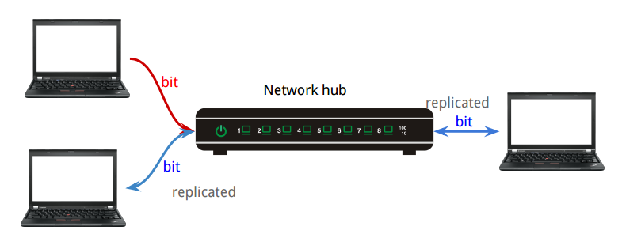
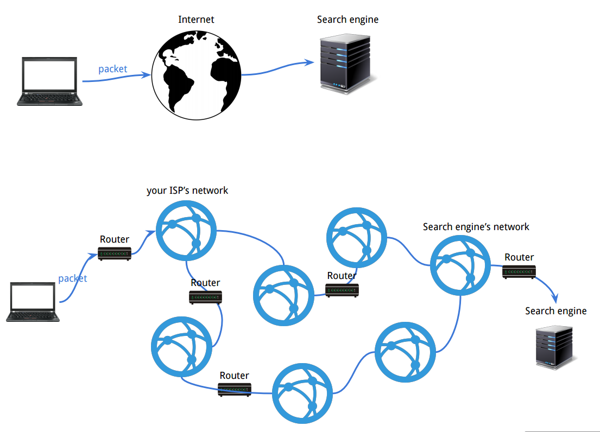

[*back to contents*](https://github.com/gyuho/learn#contents)<br>

# Go: network

- [Reference](#reference)
- [Overview of network layers](#overview-of-network-layers)
	- [physical layer](#physical-layer)
	- [data link layer](#data-link-layer)
	- [network layer](#network-layer)
	- [transport layer](#transport-layer)
	- [session layer](#session-layer)
	- [presentation layer](#presentation-layer)
	- [application layer](#application-layer)
- [`http`, `proxy`, `https`, `http2`](#http-proxy-https-http2)
	- [cache server](#cache-server)
	- [`proxy`](#proxy)
	- [`http` session](#http-session)
	- [`https`](#https)
	- [`http2`](#http2)
- [**kill process, netstat**](#kill-process-netstat)
- [hello world](#hello-world)
- [loopback, localhost](#loopback-localhost)
- [simple web server](#simple-web-server)
- [http request, roundtrip](#http-request-roundtrip)
- [simple echo server](#simple-echo-server)
- [simple JSON RPC server/client](#simple-json-rpc-serverclient)
- [file descriptors, error too many open files](#file-descriptors-error-too-many-open-files)
- [**_`net/context`_**](#netcontext)
- [`text/template`](#texttemplate)
- [serve image](#serve-image)
- [container](#container)
- [`ssh`, `scp`](#ssh-scp)
- [implement `ssh`](#implement-ssh)
- [`scp` from a local file, directory](#scp-from-a-local-file-directory)
- [`scp` from a remote file](#scp-from-a-remote-file)

[↑ top](#go-network)
<br><br><br><br><hr>


#### Reference

- [OSI model](https://en.wikipedia.org/wiki/OSI_model)
- [Network hardware](https://en.wikipedia.org/wiki/Networking_hardware)
- [package `net`](http://golang.org/pkg/net/)
- [Sirupsen/logrus](https://github.com/Sirupsen/logrus)
- [`net/context`](https://godoc.org/golang.org/x/net/context)
- [Go Concurrency Patterns: Context](https://blog.golang.org/context)
- [**Go's net/context and http.Handler**](https://joeshaw.org/net-context-and-http-handler/)
- [The OAuth 2.0 Authorization Framework](http://tools.ietf.org/html/rfc6749)
- [Using OAuth 2.0 to Access Google APIs](https://developers.google.com/identity/protocols/OAuth2)
- [Google+ Platform for Web: Sign In Users](https://developers.google.com/+/web/signin/)
- [golang.org/x/oauth2](http://godoc.org/golang.org/x/oauth2)
- [github.com/markbates/goth](https://github.com/markbates/goth)
- [github.com/bradrydzewski/go.auth](https://github.com/bradrydzewski/go.auth)
- [Graceful Shutdown, Linger Options, and Socket Closure](https://msdn.microsoft.com/en-us/library/windows/desktop/ms738547(v=vs.85).aspx)
- [github.com/tylerb/graceful](https://github.com/tylerb/graceful)
- [Javascript](https://developer.mozilla.org/en-US/docs/Web/JavaScript)
- [Javascript Wikipedia](https://en.wikipedia.org/wiki/JavaScript)
- [jQuery Wikipedia](https://en.wikipedia.org/wiki/JQuery)
- [Proxy server](https://en.wikipedia.org/wiki/Proxy_server)
- [Reverse proxy](https://en.wikipedia.org/wiki/Reverse_proxy)
- [Nginx](https://en.wikipedia.org/wiki/Nginx)
- [Docker](https://www.docker.com/)
- [Docker Jumpstart, by Andrew Odewahn](https://github.com/odewahn/docker-jumpstart/)
- [Best practices for writing Dockerfiles](https://docs.docker.com/articles/dockerfile_best-practices/)
- [CoreOS](https://coreos.com/)
- [App Container Specification](https://github.com/appc/spec)
- [Amazon Web Service (AWS)](https://aws.amazon.com/)
- [Google Cloud Platform (GCP)](https://cloud.google.com/)
- [**How DNS works**](https://howdns.works/)
- [How the Domain Name System (DNS) Works](http://www.verisign.com/en_US/domain-names/online/how-dns-works/index.xhtml?inc=www.verisigninc.com)
- [Secure Shell](https://en.wikipedia.org/wiki/Secure_Shell)
- [Secure copy](https://en.wikipedia.org/wiki/Secure_copy)
- [How the SCP protocol works](https://blogs.oracle.com/janp/entry/how_the_scp_protocol_works)
- [Why aren’t we using SSH for everything?](https://medium.com/@shazow/ssh-how-does-it-even-9e43586e4ffc)

[↑ top](#go-network)
<br><br><br><br><hr>


#### Overview of network layers

<br>

<br>

[↑ top](#go-network)
<br><br><br>


##### physical layer

[Physical layer](https://en.wikipedia.org/wiki/Physical_layer)
refers to basic networking hardware transmissions. It defines how
to transfer raw bits over a physical link connecting network nodes.
For example, a [ethernet hub](https://en.wikipedia.org/wiki/Ethernet_hub)
works on a physical layer. It coordinates multiple network objects
and makes them act as a single network segment and share the
bandwidth of a network.

<br>


Ethernet hub works by repeating bits received from one of its ports to
all other ports, which means each incoming bit gets replicated to all
other interfaces. But this can generate unnecessary traffic and
waste bandwidth. This is where [network switch](https://en.wikipedia.org/wiki/Network_switch)
comes in.

[↑ top](#go-network)
<br><br><br>


##### data link layer

[Data link layer](https://en.wikipedia.org/wiki/Data_link_layer) transfers
data between adjacent network nodes. [Ethernet](https://en.wikipedia.org/wiki/Ethernet)
is an example of data link layer. It is a networking technology for
[LAN](https://en.wikipedia.org/wiki/Local_area_network). Ethernet is used to
communicate between this *local area networks (LAN)*.
Data link layer uses [MAC addresss](https://en.wikipedia.org/wiki/MAC_address)
to transfer data between two nodes in a network,
using [ARP](https://en.wikipedia.org/wiki/Address_Resolution_Protocol).
[Switch](https://en.wikipedia.org/wiki/Network_switch) and
[bridge](https://en.wikipedia.org/wiki/Network_bridge)
work on data link layer. Unlike less advanced [network hubs](https://en.wikipedia.org/wiki/Ethernet_hub),
a [**network switch**](https://en.wikipedia.org/wiki/Network_switch)
forwards data only to one or multiple devices that need to receive it,
rather than replicating data to every single port.

<br>


But what if we want to send packets across different networks?
This is where [router](https://en.wikipedia.org/wiki/Router_(computing))
comes in.

[↑ top](#go-network)
<br><br><br>


##### network layer

[Network layer](https://en.wikipedia.org/wiki/Network_layer) defines
[routing](https://en.wikipedia.org/wiki/Routing)
and [packet forwarding](https://en.wikipedia.org/wiki/Packet_forwarding),
to transfer data between hosts.
[Router](https://en.wikipedia.org/wiki/Router_(computing)) on network layer
fowards data packets between computer networks.
A [network switch](https://en.wikipedia.org/wiki/Network_switch)
in data link layer connects data lines from one single network,
while a [**router**](https://en.wikipedia.org/wiki/Router_(computing))
connects data lines from **different networks**.
[**Router**](https://en.wikipedia.org/wiki/Router_(computing)) is a networking
device that transfer *data packets* **between computer networks**.
In most cases, you have your own router at home to connect to Internet
through your own [ISP](https://en.wikipedia.org/wiki/Internet_service_provider).


<br>
**Router** also does:

- [Network Address Translation (NAT)](https://en.wikipedia.org/wiki/Network_address_translation)
- [Dynamic Host Configuration Protocol (DHCP)](https://en.wikipedia.org/wiki/Dynamic_Host_Configuration_Protocol)

<br>
<br>
**NAT** remaps one IP address space into another by modifying
network address information. It helps conserve IPv4 addresses by abstracting
the entire IP address space with private network IP addresses.


<br>
<br>
**DHCP** dynamically distributes network configurations, such as IP addresses.
It usually reserves a range of IP addresses, and each DHCP client requests an
IP address from DHCP server during network initialization. It uses a lease
concept with limited time period, so that DHCP server can reclaim, reallocate,
and renew IP addresses.


[↑ top](#go-network)
<br><br><br>


##### transport layer

[Transport layer](https://en.wikipedia.org/wiki/Transport_layer) provides
end-to-end or host-to-host communication. Let's compare two most popular
transport protocols: [Transmission Control Protocol (TCP)](https://en.wikipedia.org/wiki/Transmission_Control_Protocol)
and [User Datagram Protocol (UDP)](https://en.wikipedia.org/wiki/User_Datagram_Protocol).

|        |  TCP 	|  UDP 	|
|:-:	 |:-:	|:-:	|
| header | 20 bytes | 8 bytes |
| connection | need connection(3 way) |  no need |
| data corruption | retry | no retry |
| in order | ordered | no order |
| congestion control | Yes | No |

<br>
> TCP provides reliable, ordered, and error-checked delivery of a stream of
> octets between applications running on hosts communicating over an IP
> network. TCP is the protocol that major Internet applications such as the
> World Wide Web, email, remote administration and file transfer rely on.
> Applications that do not require reliable data stream service may use the
> User Datagram Protocol (UDP), which provides a connectionless datagram
> service that emphasizes reduced latency over reliability.
>
> [*Transmission Control
> Protocol*](https://en.wikipedia.org/wiki/Transmission_Control_Protocol) *by Wikipedia*

So, `TCP` is good for static contens, where you need to transfer relatively
large chunck data at punctual intervals. For example, you would use `TCP` to
download a file that won't change for the next 5 minutes (*static*). `UDP` is
for real-time and continuous stream of data, when you do not want to wait to
check its packet consistency. You might lose your data but get performance and
responsiveness. VOIP uses `UDP` and  `TCP` is more universal these days.
Some network devices do not support `UDP`. Many video streamings are served
via `TCP` if the data are stored statically. Online live streaming would use
`UDP`.

[↑ top](#go-network)
<br><br><br>


##### session layer

[Session layer](https://en.wikipedia.org/wiki/Session_layer) stores
states between two connections.

[↑ top](#go-network)
<br><br><br>


##### presentation layer

[Presentation layer](https://en.wikipedia.org/wiki/Presentation_layer)
converts between different formats of data, such as encoding, encryption,
or decryption.

[↑ top](#go-network)
<br><br><br>


##### application layer

[Application layer](https://en.wikipedia.org/wiki/Application_layer) refers
to shared protocols and interface methods between hosts, such as HTTP, SSH,
SMTP (which will be covered separately).

[↑ top](#go-network)
<br><br><br><br><hr>


#### `http`, `proxy`, `https`, `http2`

*Hypertext Transfer Protocol (`HTTP`)* is the application protocol for exchange
or transfer of hypertext in World Wide Web. It presumes underlying *transport
layer*, such as
[TCP](https://en.wikipedia.org/wiki/Transmission_Control_Protocol) and
[UDP](https://en.wikipedia.org/wiki/User_Datagram_Protocol).
Between client and server, `HTTP` functions as a request-response protocol.
When a client, *for example a web browser*, sends `HTTP` **request** message
to the server, then the server returns **response** message (*or resource*)
to client.


<br>
#### cache server

**`HTTP` allows intermediate networks**. Web cache server between client and
server can decrease the workloads of high-traffic websites by serving cached
contents on behalf of upstream servers, which can decrease the response time.
A [forward cache](https://en.wikipedia.org/wiki/Web_cache) is a cache outside
web server's network, that is stored in client's computer(or *browser*).
A [reverse cache](https://en.wikipedia.org/wiki/Web_cache) is a cache
to serves contents in front of web servers, such as
[CDN](https://en.wikipedia.org/wiki/Content_delivery_network), providing
multiple content resources distributed over several regions.


<br>
#### `proxy`

**`HTTP` allows intermediate networks**. `HTTP` proxy sits between client and
server.

> In computer networks, a **proxy server** is a server (a computer system or an
> application) that acts as an **intermediary** for **requests from clients**
> seeking resources from other servers. A client connects to the proxy server,
> requesting some service, such as a file, connection, web page, or other
> resource available from a different server and the proxy server **evaluates
> the request** as a way to simplify and control its complexity.
>
> A reverse proxy is usually an Internet-facing proxy used as a front-end to
> control and **protect access to a server** on a private network. A reverse
> proxy commonly also performs tasks such as load-balancing, authentication,
> decryption or caching.
>
> A **reverse proxy** (or surrogate) is a proxy server that *appears to clients* to
> be an *ordinary server*. **Requests are forwarded to** one or more **proxy servers**
> which handle the request. The **response from the proxy server** is returned *as
> if* it came directly from the **original server**, leaving the client no knowledge
> of the origin servers.
>
> [*Proxy server*](https://en.wikipedia.org/wiki/Proxy_server) *by Wikipedia*

<br>
> A reverse proxy taking requests from the Internet and forwarding them to
> servers in an internal network. Those making requests to the proxy may not be
> aware of the internal network.
> 
> Reverse proxies can hide the existence and characteristics of an origin
> server or servers.
>
> [*Reverse proxy*](https://en.wikipedia.org/wiki/Reverse_proxy) *by Wikipedia*

<br>
We can use [Nginx](http://wiki.nginx.org/Main) as an HTTP server, reverse proxy
along with Go web servers:


<br>
Then why do we bother to run another web server, or reverse proxy while we can
do pretty much everything in Go?

```go
package main

import (
    "fmt"
    "net/http"
)

func handler(w http.ResponseWriter, r *http.Request) {
    fmt.Fprintf(w, "Hi there, I love %s!", r.URL.Path[1:])
}

func main() {
    http.HandleFunc("/", handler)
    http.ListenAndServe(":8080", nil)
}

```

<br>
It's because popular web proxies like `Nginx` provides useful features
out-of-the box. So it's not to reinvent the wheels while we can just add
another module to `Nginx` configuration. `Nginx` provides:

- Rate limiting.
- Access, error logs.
- Serve static files with `try_files`.
- Auth, compression support.
- Serve cached contents while the application is down.

For more, please visit [Nginx wiki](http://wiki.nginx.org/Main).

<br>
#### `http` session

> An `HTTP` **session** is a sequence of network request-response transactions.
> An `HTTP` client **initiates a request by establishing** a Transmission
> Control Protocol (**TCP**) connection **to a particular port on a server**
> (typically port 80, occasionally port 8080).
>
> An HTTP server listening on that port waits for a client's request message.
> Upon receiving the request, the server sends back a status line, such as
> "HTTP/1.1 200 OK", and a message of its own. The body of this message is
> typically the requested resource, although an error message or other
> information may also be returned.
>
> [*HTTP session*](https://en.wikipedia.org/wiki/Hypertext_Transfer_Protocol)
> *by Wikipedia*

<br>
#### `https`

[`HTTP` Secure](https://en.wikipedia.org/wiki/HTTPS) is `HTTPS` for encrypted
`HTTP` connections. Its goal is to authenticate web sites and protect privacy
and integrity of exchanged data. It creates a secure channel over an insecure
network with [`TLS`](https://en.wikipedia.org/wiki/Transport_Layer_Security):
`TLS`, *Transport Layer Security*, is a cryptographic protocol encrypting data
between two parties. 

> Web browsers know how to trust `HTTPS` websites based on certificate
> authorities that come pre-installed in their software. Certificate
> authorities are in this way being trusted by web browser creators to provide
> valid certificates.
>
> [`HTTPS`](https://en.wikipedia.org/wiki/HTTPS) *by Wikipedia*


<br>
#### `http2`

[`HTTP/2.0`](https://http2.github.io/) is the most recent major version of
`HTTP` protocol:

> In particular, HTTP/1.0 allowed only one request to be outstanding at a time
> on a given TCP connection. HTTP/1.1 added request pipelining, but this only
> partially addressed request concurrency and still suffers from head-of-line
> blocking. Therefore, **`HTTP/1.0` and `HTTP/1.1` clients that need to make
> many requests use multiple connections to a server in order to achieve
> concurrency and thereby reduce latency**.
>
> Furthermore, **`HTTP` header fields are often repetitive and verbose**,
> causing unnecessary network traffic as well as causing the initial TCP
> congestion window to quickly fill. This can result in excessive latency
> when multiple requests are made on a new TCP connection.
>
> `HTTP/2` addresses these issues by defining an optimized mapping of HTTP's
> semantics to an underlying connection. Specifically, it **allows interleaving
> of request and response messages on the same connection** and uses an
> **efficient coding for `HTTP` header fields**. It also **allows
> prioritization of requests, letting more important requests complete more
> quickly, further improving performance**.
>
> The resulting protocol is more friendly to the network because **fewer TCP
> connections can be used in comparison to HTTP/1.x**. This means less
> competition with other flows and longer-lived connections, which in turn
> lead to better utilization of available network capacity.
>
> Finally, **`HTTP/2` also enables more efficient processing of messages
> through use of binary message framing**.
> 
> ...
>
> **`HTTP/2` allows a server to pre-emptively send (or "push") responses**
> (along with corresponding "promised" requests) **to a client** in association
> with a previous client-initiated request. This can be **useful when the
> server knows the client will need to have those responses available** in
> order to fully process the response to the original request.
>
> [`RFC7540` Hypertext Transfer Protocol Version 2
> (HTTP/2)](https://httpwg.github.io/specs/rfc7540.html)

So to summarize, `HTTP/2` is better: faster page loads with binary messaging
framing, better utilization of available network capacity with a single
long-lived connections, instead of multiple TCP connections, less round-trips
with server push, cheaper `HTTP` request by compressing headers, etc.

[↑ top](#go-network)
<br><br><br><br><hr>


#### kill process, netstat

```go
package main

import (
	"bufio"
	"bytes"
	"fmt"
	"io"
	"os"
	"os/exec"
	"strconv"
	"strings"
	"syscall"
)

func main() {
	var (
		w = os.Stdout

		sudo = true

		// socket = "tcp"
		socket = "tcp6"

		program = ""
		// program = "bin/etcd"

		// port = ""
		port = ":8080"
	)

	ps, err := NetStat(w, sudo, socket, program, port)
	if err != nil {
		fmt.Fprintln(os.Stderr, err)
		os.Exit(-1)
	}

	Kill(w, ps...)
	/*
	   [NetStat] socket: 'tcp6' / program: '00_hello_world' / host: '::' / port: ':8080' / pid: '9768'
	   [Kill] syscall.Kill -> socket: 'tcp6' / program: '00_hello_world' / host: '::' / port: ':8080' / pid: '9768'
	   [Kill] Done!
	*/
}

// Process describes OS processes.
type Process struct {
	Socket  string
	Program string
	Host    string
	Port    string
	PID     int
}

func (p Process) String() string {
	return fmt.Sprintf("socket: '%s' / program: '%s' / host: '%s' / port: '%s' / pid: '%d'",
		p.Socket,
		p.Program,
		p.Host,
		p.Port,
		p.PID,
	)
}

// Kill kills all processes in arguments.
func Kill(w io.Writer, ps ...Process) {
	defer func() {
		recover()
	}()
	for _, v := range ps {
		fmt.Fprintf(w, "[Kill] syscall.Kill -> %s\n", v)
		if err := syscall.Kill(v.PID, syscall.SIGINT); err != nil {
			fmt.Fprintln(w, "[Kill - error]", err)
		}
	}
	fmt.Fprintln(w, "[Kill] Done!")
}

/*
NetStat parses the output of netstat command in linux.
Pass '' or '*' to match all. For example, call Kill("tcp", "bin/etcd", "*")
to kill all processes that are running "bin/etcd":

	netstat -tlpn

	(Not all processes could be identified, non-owned process info
	 will not be shown, you would have to be root to see it all.)
	Active Internet connections (only servers)
	Proto Recv-Q Send-Q Local Address           Foreign Address         State       PID/Program name
	tcp        0      0 127.0.0.1:2379          0.0.0.0:*               LISTEN      21524/bin/etcd
	tcp        0      0 127.0.0.1:22379         0.0.0.0:*               LISTEN      21526/bin/etcd
	tcp        0      0 127.0.0.1:22380         0.0.0.0:*               LISTEN      21526/bin/etcd
	tcp        0      0 127.0.0.1:32379         0.0.0.0:*               LISTEN      21528/bin/etcd
	tcp        0      0 127.0.0.1:12379         0.0.0.0:*               LISTEN      21529/bin/etcd
	tcp        0      0 127.0.0.1:32380         0.0.0.0:*               LISTEN      21528/bin/etcd
	tcp        0      0 127.0.0.1:12380         0.0.0.0:*               LISTEN      21529/bin/etcd
	tcp        0      0 127.0.0.1:53697         0.0.0.0:*               LISTEN      2608/python2
	tcp6       0      0 :::8555                 :::*                    LISTEN      21516/goreman

Otherwise, you would have to run something like the following:

	sudo kill $(sudo netstat -tlpn | perl -ne 'my @a = split /[ \/]+/; print "$a[6]\n" if m/:12379/gio');
	sudo kill $(sudo netstat -tlpn | perl -ne 'my @a = split /[ \/]+/; print "$a[6]\n" if m/:22379/gio');
	sudo kill $(sudo netstat -tlpn | perl -ne 'my @a = split /[ \/]+/; print "$a[6]\n" if m/:32379/gio');
	sudo kill $(sudo netstat -tlpn | perl -ne 'my @a = split /[ \/]+/; print "$a[6]\n" if m/:2379/gio');
	sudo kill $(sudo netstat -tlpn | perl -ne 'my @a = split /[ \/]+/; print "$a[6]\n" if m/:8080/gio');

*/
func NetStat(w io.Writer, sudo bool, socket, program, port string) ([]Process, error) {
	socket = strings.TrimSpace(socket)
	program = strings.TrimSpace(program)
	if program == "" {
		program = "*"
	}
	port = strings.TrimSpace(port)
	if port == "" {
		port = "*"
	}
	if port != "*" {
		if !strings.HasPrefix(port, ":") {
			port = ":" + port
		}
	}
	if program == "*" && port == "*" {
		fmt.Fprintln(w, "[NetStat - warning] grepping all programs.")
	}

	var flag string
	flagFormat := "-%slpn"
	switch socket {
	case "tcp":
		flag = fmt.Sprintf(flagFormat, "t")
	case "tcp6":
		flag = fmt.Sprintf(flagFormat, "t")
	case "tcp*": // match all tcp connections
		flag = fmt.Sprintf(flagFormat, "t")
	case "udp":
		flag = fmt.Sprintf(flagFormat, "u")
	default:
		return nil, fmt.Errorf("socket '%s' is unknown", socket)
	}

	cmd := exec.Command("netstat", flag)
	if sudo {
		cmd = exec.Command("sudo", "netstat", flag)
	}
	buf := new(bytes.Buffer)
	cmd.Stdout = buf
	cmd.Stderr = buf
	if err := cmd.Run(); err != nil {
		return nil, err
	}

	rd := bufio.NewReader(buf)
	lines := [][]string{}
	for {
		l, _, err := rd.ReadLine()
		if err == io.EOF {
			break
		}
		s := string(l)
		if !strings.HasPrefix(s, socket) {
			if !strings.HasPrefix(s, "tcp") && socket != "tcp*" {
				continue
			}
		}
		sl := strings.Fields(s)
		lines = append(lines, sl)
	}

	socketIdx := 0
	portIdx := 3
	programIdx := 6

	ps := []Process{}

	fmt.Fprintf(w, "[netstat] 'netstat %s' returned %d lines.\n", flag, len(lines))
	for _, sl := range lines {

		theSocket := sl[socketIdx]
		if theSocket != socket {
			if !strings.HasPrefix(theSocket, "tcp") && socket != "tcp*" {
				fmt.Fprintln(w, "[NetStat] different socket. Skipping", sl)
				continue
			}
		}

		asl := strings.Split(sl[portIdx], ":")
		if len(asl) < 2 {
			fmt.Fprintln(w, "[NetStat] skipping", sl)
			continue
		}
		thePort := ":" + asl[len(asl)-1]
		if port != "*" {
			if thePort != port {
				fmt.Fprintln(w, "[NetStat] different port. Skipping", sl)
				continue
			}
		}

		theHost := strings.TrimSpace(strings.Replace(sl[portIdx], thePort, "", -1))

		psl := strings.SplitN(sl[programIdx], "/", 2)
		if len(psl) != 2 {
			continue
		}
		theProgram := strings.TrimSpace(psl[1])
		if program != "*" {
			if theProgram != program {
				fmt.Fprintln(w, "[NetStat] different program. Skipping", sl)
				continue
			}
		}

		thePID := 0
		if d, err := strconv.Atoi(psl[0]); err != nil {
			fmt.Fprintln(w, "[NetStat - error] %v / Skipping %+v\n", err, sl)
			continue
		} else {
			thePID = d
		}

		p := Process{}
		p.Socket = theSocket
		p.Program = theProgram
		p.Host = theHost
		p.Port = thePort
		p.PID = thePID
		ps = append(ps, p)
	}

	for _, v := range ps {
		fmt.Fprintf(w, "[NetStat] %s\n", v)
	}
	return ps, nil
}

```

[↑ top](#go-network)
<br><br><br><br><hr>


#### hello world

```go
package main

import (
	"fmt"
	"log"
	"net/http"
)

const port = ":8080"

func main() {
	mainRouter := http.NewServeMux()
	mainRouter.HandleFunc("/", handler)

	log.Println("Serving http://localhost" + port)
	if err := http.ListenAndServe(port, mainRouter); err != nil {
		panic(err)
	}
}

/*
curl http://localhost:8080
Hello World!
*/

func handler(w http.ResponseWriter, req *http.Request) {
	switch req.Method {
	case "GET":
		fmt.Fprintln(w, "Hello World!")
	default:
		http.Error(w, "Method Not Allowed", 405)
	}
}

```

[↑ top](#go-network)
<br><br><br><br><hr>


#### loopback, localhost

```go
package main

import (
	"errors"
	"fmt"
	"net"
	"net/http"
)

// Below, copied from
// https://github.com/camlistore/camlistore/blob/master/pkg/netutil/netutil.go

// localhostLookup looks for a loopback IP by resolving localhost.
func localhostLookup() net.IP {
	// IPv6, it returns 0:0:0:0:0:0:0:1 or ::1
	if ips, err := net.LookupIP("localhost"); err == nil && len(ips) > 0 {
		return ips[0]
	}
	return nil
}

// loopbackIP returns the first loopback IP address sniffing network
// interfaces or nil if none is found.
func loopbackIP() net.IP {
	interfaces, err := net.Interfaces()
	if err != nil {
		return nil
	}
	for _, inf := range interfaces {
		const flagUpLoopback = net.FlagUp | net.FlagLoopback
		if inf.Flags&flagUpLoopback == flagUpLoopback {
			addrs, _ := inf.Addrs()
			for _, addr := range addrs {
				ip, _, err := net.ParseCIDR(addr.String())
				if err == nil && ip.IsLoopback() {
					return ip
				}
			}
		}
	}
	return nil
}

// localhost returns the first address found when
// doing a lookup of "localhost". If not successful,
// it looks for an ip on the loopback interfaces.
func localhost() (net.IP, error) {
	if ip := localhostLookup(); ip != nil {
		return ip, nil
	}
	if ip := loopbackIP(); ip != nil {
		return ip, nil
	}
	return nil, errors.New("No loopback ip found.")
}

func main() {
	lp, err := localhost()
	if err != nil {
		panic(err)
	}
	if lp.To4() != nil {
		fmt.Println(lp.String(), "is IPv4!")
	} else if lp.To16() != nil {
		fmt.Println(lp.String(), "is IPv6!")
	}
	// ::1 is IPv6!

	fmt.Println("loopbackIP:", loopbackIP().String())
	// loopbackIP: 127.0.0.1

	mainRouter := http.NewServeMux()
	mainRouter.HandleFunc("/", handler)

	const port = ":8080"
	fmt.Println("Serving http://localhost" + port)
	if err := http.ListenAndServe(port, mainRouter); err != nil {
		panic(err)
	}
}

/*
$ curl http://localhost:8080
r.RemoteAddr: [::1]:52310

$ curl -L http://localhost:8080
r.RemoteAddr: [::1]:52316
*/

// RemoteAddr is for the remote client's IP and port
// (original requester or last proxy address).
// Whenever a client sends a request, its OS open an ephemeral port
// (https://en.wikipedia.org/wiki/Ephemeral_port) to send that request,
// and then the IP and port used for this request is shown in RemoteAddr.
func handler(w http.ResponseWriter, r *http.Request) {
	fmt.Fprintf(w, "r.RemoteAddr: %s\n", r.RemoteAddr)
}

```

[↑ top](#go-network)
<br><br><br><br><hr>


#### simple web server

```go
package main

import (
	"encoding/gob"
	"encoding/json"
	"fmt"
	"io"
	"io/ioutil"
	"net/http"
	"os"
	"time"

	stdlog "log"
)

var (
	port   = ":8080"
	logger = stdlog.New(os.Stdout, "[TEST] ", stdlog.Ldate|stdlog.Ltime)
)

func wrapFunc(fn func(w http.ResponseWriter, req *http.Request)) func(w http.ResponseWriter, req *http.Request) {
	return func(w http.ResponseWriter, req *http.Request) {
		start := time.Now()
		fn(w, req)
		logger.Printf("wrapFunc: %s %s | Took %s", req.Method, req.URL.Path, time.Since(start))
	}
}

func wrapHandlerFunc(h http.HandlerFunc) http.HandlerFunc {
	return func(w http.ResponseWriter, req *http.Request) {
		start := time.Now()
		h.ServeHTTP(w, req)
		logger.Printf("wrapHandlerFunc: %s %s | Took %s", req.Method, req.URL.Path, time.Since(start))
	}
}

func main() {
	go sendRequest(port, "/")
	go sendRequest(port, "/json")
	go sendRequest(port, "/gob")

	mainRouter := http.NewServeMux()
	mainRouter.HandleFunc("/", wrapFunc(handler))
	mainRouter.HandleFunc("/json", wrapHandlerFunc(handlerJSON))
	mainRouter.HandleFunc("/gob", wrapHandlerFunc(handlerGOB))

	stdlog.Println("Serving http://localhost" + port)
	if err := http.ListenAndServe(port, mainRouter); err != nil {
		panic(err)
	}
}

/*
XXXX/XX/XX 17:17:15 Serving http://localhost:8080
[TEST] XXXX/XX/XX 17:17:18 wrapHandlerFunc: GET /json | Took 59.349µs
[TEST] XXXX/XX/XX 17:17:18 wrapFunc: GET / | Took 7.359µs
response for / = Hello World!
[TEST] XXXX/XX/XX 17:17:18 wrapHandlerFunc: GET /gob | Took 132.61µs
response for /json = {Go 1000 XXXX-XX-XX 17:17:18}
response for /gob = {Go 1000 XXXX-XX-XX 17:17:18}
*/

type Data struct {
	Name  string
	Value float64
	TS    string
}

func handler(w http.ResponseWriter, req *http.Request) {
	switch req.Method {
	case "GET":
		fmt.Fprintf(w, "Hello World!")
	default:
		http.Error(w, "Method Not Allowed", 405)
	}
}

func handlerJSON(w http.ResponseWriter, req *http.Request) {
	switch req.Method {
	case "GET":
		data := Data{}
		data.Name = "Go"
		data.Value = 1000
		data.TS = time.Now().String()[:19]
		if err := json.NewEncoder(w).Encode(data); err != nil {
			panic(err)
		}

	default:
		http.Error(w, "Method Not Allowed", 405)
	}
}

func handlerGOB(w http.ResponseWriter, req *http.Request) {
	switch req.Method {
	case "GET":
		data := Data{}
		data.Name = "Go"
		data.Value = 1000
		data.TS = time.Now().String()[:19]
		if err := gob.NewEncoder(w).Encode(data); err != nil {
			panic(err)
		}

	default:
		http.Error(w, "Method Not Allowed", 405)
	}
}

func sendRequest(port, endPoint string) {
	time.Sleep(3 * time.Second)

	client := http.DefaultClient
	req, err := http.NewRequest("GET", "http://localhost"+port+endPoint, nil)
	if err != nil {
		panic(err)
	}
	resp, err := client.Do(req)
	if err != nil {
		panic(err)
	}
	defer resp.Body.Close()

	switch endPoint {
	case "/":
		b, err := ioutil.ReadAll(resp.Body)
		if err != nil {
			panic(err)
		}
		fmt.Println("response for", endPoint, "=", string(b))

	case "/json":
		data := Data{}
		for {
			if err := json.NewDecoder(resp.Body).Decode(&data); err == io.EOF {
				break
			} else if err != nil {
				panic(err)
			}
		}
		fmt.Println("response for", endPoint, "=", data)

	case "/gob":
		data := Data{}
		for {
			if err := gob.NewDecoder(resp.Body).Decode(&data); err == io.EOF {
				break
			} else if err != nil {
				panic(err)
			}
		}
		fmt.Println("response for", endPoint, "=", data)
	}
}

```

[↑ top](#go-network)
<br><br><br><br><hr>


#### http request, roundtrip

[`RoundTripper`](http://golang.org/pkg/net/http/#RoundTripper)
is an interface for a single HTTP transaction.

```
type RoundTripper interface {
        // RoundTrip executes a single HTTP transaction, returning
        // the Response for the request req.  RoundTrip should not
        // attempt to interpret the response.  In particular,
        // RoundTrip must return err == nil if it obtained a response,
        // regardless of the response's HTTP status code.  A non-nil
        // err should be reserved for failure to obtain a response.
        // Similarly, RoundTrip should not attempt to handle
        // higher-level protocol details such as redirects,
        // authentication, or cookies.
        //
        // RoundTrip should not modify the request, except for
        // consuming and closing the Body, including on errors. The
        // request's URL and Header fields are guaranteed to be
        // initialized.
        RoundTrip(*Request) (*Response, error)
}
```

A `RoundTripper` is safe for concurrent use by multiple goroutines.

```
var DefaultTransport RoundTripper = &Transport{
        Proxy: ProxyFromEnvironment,
        Dial: (&net.Dialer{
                Timeout:   30 * time.Second,
                KeepAlive: 30 * time.Second,
        }).Dial,
        TLSHandshakeTimeout: 10 * time.Second,
}
```

And [`http.Transport`](http://golang.org/pkg/net/http/#Transport.RoundTrip)
implements `RoundTrip` therefore satisfying the `RoundTripper` interface.

<br>
```go
package main

import (
	"fmt"
	"log"
	"net"
	"net/http"
	"strings"
	"time"

	"golang.org/x/net/context"
)

func main() {
	Do("HEAD", "google.com", time.Second)
	Do("HEAD", "http://httpbin.org/redirect/3", time.Second)
	DoWithRedirectCheck("HEAD", "http://httpbin.org/redirect/3", time.Second)
	RoundTrip("HEAD", "google.com", time.Second)
	RoundTrip("HEAD", "http://httpbin.org/redirect/3", time.Second)
}

/*
2015/10/22 15:04:25 [SUCCESS] HEAD => Took: 615.66134ms [ 200 | OK | http://google.com ]                                                                                                                                      │DE12015/10/22 15:04:26 [SUCCESS] HEAD => Took: 379.768387ms [ 200 | OK | http://httpbin.org/redirect/3 ]                                                                                                                         │kIF2015/10/22 15:04:26 http://httpbin.org/redirect/3 => redirect [1]                                                                                                                                                             │s
2015/10/22 15:04:26 http://httpbin.org/redirect/3 => redirect [2]                                                                                                                                                             │On
2015/10/22 15:04:26 http://httpbin.org/redirect/3 => redirect [3]                                                                                                                                                             │bra
2015/10/22 15:04:26 [SUCCESS] HEAD => Took: 586.503507ms [ 200 | OK | http://httpbin.org/redirect/3 ]                                                                                                                         │nch
2015/10/22 15:04:26 [SUCCESS] HEAD => Took: 146.107978ms [ 301 | Moved Permanently | http://google.com ]                                                                                                                      │ ma
2015/10/22 15:04:27 [SUCCESS] HEAD => Took: 153.807455ms [ 302 | Found | http://httpbin.org/redirect/3 ]
*/

func httpen(dom string) string {
	dom = strings.TrimSpace(dom)
	if !strings.HasPrefix(dom, "http://") {
		dom = "http://" + dom
	}
	return dom
}

// Do sends HTTP requests.
func Do(requestType, target string, timeout time.Duration) {
	run(requestType, target, timeout, do)
}

// DoWithRedirectCheck sends HTTP requests and checks the redirects.
func DoWithRedirectCheck(requestType, target string, timeout time.Duration) {
	run(requestType, target, timeout, doWithRedirectCheck)
}

// RoundTrip sends HTTP requests with RoundTripper.
func RoundTrip(requestType, target string, timeout time.Duration) {
	run(requestType, target, timeout, roundTrip)
}

func run(requestType, target string, timeout time.Duration, f func(string, string) (int, error)) {
	target = httpen(target)
	qt, cancel := context.WithTimeout(context.Background(), timeout)
	defer cancel()
	now := time.Now()
	done := make(chan struct{})
	var (
		statusCode int
		errMsg     error
	)
	go func() {
		statusCode, errMsg = f(requestType, target)
		done <- struct{}{}
	}()
	select {
	case <-done:
		if errMsg != nil {
			log.Printf(
				"[ERROR (%v)] %s => Took: %v [ %d | %s | %s ]",
				errMsg,
				requestType,
				time.Since(now),
				statusCode,
				http.StatusText(statusCode),
				target,
			)
		} else {
			log.Printf(
				"[SUCCESS] %s => Took: %v [ %d | %s | %s ]",
				requestType,
				time.Since(now),
				statusCode,
				http.StatusText(statusCode),
				target,
			)
		}
	case <-qt.Done():
		log.Printf(
			"[ERROR - timed out (%v)] %s => Took: %v [ %d | %s | %s ]",
			qt.Err(),
			requestType,
			time.Since(now),
			statusCode,
			http.StatusText(statusCode),
			target,
		)
	}
}

func do(requestType, target string) (int, error) {
	req, err := http.NewRequest(requestType, target, nil)
	if err != nil {
		return -1, err
	}
	client := http.DefaultClient
	resp, err := client.Do(req)
	if err != nil {
		return -1, err
	}
	resp.Body.Close()
	return resp.StatusCode, nil
}

func doWithRedirectCheck(requestType, target string) (int, error) {
	req, err := http.NewRequest(requestType, target, nil)
	if err != nil {
		return -1, err
	}
	client := http.DefaultClient

	// Without this, for redirects, all HTTP headers get reset by default
	// https://code.google.com/p/go/issues/detail?id=4800&q=request%20header
	client.CheckRedirect = func(req *http.Request, via []*http.Request) error {
		log.Printf("%s => redirect [%d]", target, len(via))
		// mutate the subsequent redirect requests with the first Header
		for key, val := range via[0].Header {
			req.Header[key] = val
		}
		return nil
	}

	resp, err := client.Do(req)
	if err != nil {
		return -1, err
	}
	resp.Body.Close()
	return resp.StatusCode, nil
}

func newClient(
	dialTimeout time.Duration,
	responseHeaderTimeout time.Duration,
	responseTimeout time.Duration,
	redirectLimit int,
	disableAlive bool,
) *http.Client {

	// http://golang.org/src/pkg/net/http/transport.go
	dialfunc := func(network, addr string) (net.Conn, error) {
		cn, err := net.DialTimeout(network, addr, dialTimeout)
		if err != nil {
			return nil, err
		}
		return cn, err
	}

	// This will still be type http.RoundTripper
	// If we want to update Transport, we need to type-assert like:
	// client.Transport.(*http.Transport)
	transport := &http.Transport{
		ResponseHeaderTimeout: responseHeaderTimeout,
		Dial:              dialfunc,
		DisableKeepAlives: disableAlive,
	}

	// http://golang.org/src/pkg/net/http/client.go
	client := &http.Client{
		Transport: transport,
		Timeout:   responseTimeout,
		Jar:       nil,
	}

	// Without this, for redirects, all HTTP headers get reset by default
	// https://code.google.com/p/go/issues/detail?id=4800&q=request%20header
	client.CheckRedirect = func(req *http.Request, via []*http.Request) error {
		if len(via) > redirectLimit {
			return fmt.Errorf("%d consecutive requests(redirects)", len(via))
		}
		if len(via) == 0 {
			// no redirect
			return nil
		}
		// mutate the subsequent redirect requests with the first Header
		for key, val := range via[0].Header {
			req.Header[key] = val
		}
		return nil
	}

	return client
}

// roundTrip executes a single HTTP transaction.
func roundTrip(requestType, target string) (int, error) {
	req, err := http.NewRequest(requestType, target, nil)
	if err != nil {
		return -1, err
	}
	client := newClient(30*time.Second, 30*time.Second, 30*time.Second, 5, true)
	resp, err := client.Transport.RoundTrip(req)
	if err != nil {
		return -1, err
	}
	resp.Body.Close()
	return resp.StatusCode, nil
}

```

[↑ top](#go-network)
<br><br><br><br><hr>


#### simple echo server

```go
package main

import (
	"fmt"
	"net"
)

func startServer(port string) {
	// Listen function creates servers,
	// listening for incoming connections.
	ln, err := net.Listen("tcp", port)
	if err != nil {
		panic(err)
	}
	defer ln.Close()
	fmt.Println("Listening on", port)
	for {
		// Listen for an incoming connection.
		conn, err := ln.Accept()
		if err != nil {
			panic(err)
		}
		go handleRequests(conn)
	}
}

// Handles incoming requests.
func handleRequests(conn net.Conn) {
	fmt.Printf("Received from %s → %s\n", conn.RemoteAddr(), conn.LocalAddr())
	buf := make([]byte, 5) // read max 5 characters
	if _, err := conn.Read(buf); err != nil {
		panic(err)
	}
	conn.Write([]byte("received message: " + string(buf) + "\n"))
	conn.Close()
}

func main() {
	const port = ":8080"
	startServer(port)
}

/*
$ echo "Hello server" | nc localhost 8080

Received from 127.0.0.1:58405 → 127.0.0.1:8080
Received from 127.0.0.1:58406 → 127.0.0.1:8080
Received from 127.0.0.1:58407 → 127.0.0.1:8080
Received from 127.0.0.1:58408 → 127.0.0.1:8080
Received from 127.0.0.1:58409 → 127.0.0.1:8080
...
*/

```

[↑ top](#go-network)
<br><br><br><br><hr>


#### simple JSON RPC server/client

```go
package main

import (
	"fmt"
	"log"
	"net"
	"net/rpc"
	"net/rpc/jsonrpc"
	"strings"
	"time"
)

var (
	port     = ":8080"
	endpoint = "localhost" + port
	msg      = MessageType{
		Contents: "    hello    world!   ",
	}

	callSize = 15000
)

type MessageType struct {
	Contents string
}

func main() {

	go startServerJSONRPC(port)
	sj := time.Now()
	for i := 0; i < callSize; i++ {
		clientJSONRPC(endpoint, msg)
	}
	fmt.Printf("clientJSONRPC took %v for %d calls.\n", time.Since(sj), callSize)

}

func (r *MessageType) MyMethod(msg MessageType, resp *MessageType) error {
	resp.Contents = strings.Join(strings.Fields(strings.TrimSpace(msg.Contents)), " ")
	return nil
}

func startServerJSONRPC(port string) {
	log.Println("RPC on", port)

	srv := rpc.NewServer()
	s := new(MessageType)
	srv.Register(s)
	srv.HandleHTTP(rpc.DefaultRPCPath, rpc.DefaultDebugPath)

	// Listen function creates servers,
	// listening for incoming connections.
	ln, err := net.Listen("tcp", port)
	if err != nil {
		panic(err)
	}
	defer ln.Close()

	for {
		// Listen for an incoming connection.
		conn, err := ln.Accept()
		if err != nil {
			panic(err)
		}
		go srv.ServeCodec(jsonrpc.NewServerCodec(conn))
	}
}

func clientJSONRPC(endpoint string, msg MessageType) {
	conn, err := net.Dial("tcp", endpoint)
	if err != nil {
		panic(err)
	}
	defer conn.Close()

	client := jsonrpc.NewClient(conn)

	resp := &MessageType{}

	if err := client.Call("MessageType.MyMethod", msg, resp); err != nil {
		panic(err)
	}

	if resp.Contents != "hello world!" {
		log.Fatalf("rpc failed with %v", resp.Contents)
	}
}

```

[↑ top](#go-network)
<br><br><br><br><hr>


#### file descriptors, error too many open files

> Everything is a file.
>
> *Unix*

When a file is opened, a [*file descriptor*] gets created.
And *file descriptor* is an interface for byte stream I/O.
So *file descriptor* refers to the streams of data in Unix.

To check the *file descriptor* status:

```go
// Copyright 2015 CoreOS, Inc.
//
// Licensed under the Apache License, Version 2.0 (the "License");
// you may not use this file except in compliance with the License.
// You may obtain a copy of the License at
//
//     http://www.apache.org/licenses/LICENSE-2.0
//
// Unless required by applicable law or agreed to in writing, software
// distributed under the License is distributed on an "AS IS" BASIS,
// WITHOUT WARRANTIES OR CONDITIONS OF ANY KIND, either express or implied.
// See the License for the specific language governing permissions and
// limitations under the License.

// https://github.com/coreos/etcd/blob/master/pkg/runtime/fds_linux.go
package main

import (
	"io/ioutil"
	"syscall"
)

func FDLimit() (uint64, error) {
	var rlimit syscall.Rlimit
	if err := syscall.Getrlimit(syscall.RLIMIT_NOFILE, &rlimit); err != nil {
		return 0, err
	}
	return rlimit.Cur, nil
}

func FDUsage() (uint64, error) {
	fds, err := ioutil.ReadDir("/proc/self/fd")
	if err != nil {
		return 0, err
	}
	return uint64(len(fds)), nil
}

```

<br>
*Unix* also creates *file descriptors* for
[anonymous pipes](https://en.wikipedia.org/wiki/Anonymous_pipe)
and [network sockets](https://en.wikipedia.org/wiki/Network_socket).
So it is more accurate to say:

> Everything is a file descriptor or a process
>
> [*Linus Torvalds*](http://yarchive.net/comp/linux/everything_is_file.html)

Therefore, open `TCP/IP` sockets (socket address is the combination of an IP
address and a port number) are also considered **open files**. And most Linux
has a limit on the number of maximum open files to prevent forgetting to
close a lot of files because it will cause system-wide problems. 

<br>
[*Dave Cheney*](http://dave.cheney.net/) explains in this article
[Why is a Goroutine’s stack infinite?](http://dave.cheney.net/2013/06/02/why-is-a-goroutines-stack-infinite):

> One of the key features of Goroutines is their cost; they are cheap to create
> in terms of initial memory footprint (as opposed to the 1 to 8 megabytes with
> a traditional POSIX thread) and their stack grows and shrinks as necessary.
> This allows a Goroutine to start with a single 4096 byte stack which grows
> and shrinks as needed without the risk of ever running out.
> (**goroutine is 2048 bytes as of Go1.4**)

goroutine's stack grows and shrinks as needed.
Launching millions of goroutines shouldn't cause any problem.
But the following program crashes with:

```
dial tcp 127.0.0.1:42940: too many open files
exit status 1
```

```go
package main

import (
	"fmt"
	"io/ioutil"
	"net/http"
	"net/http/httptest"
	"sync"
)

func main() {
	ts := httptest.NewServer(http.HandlerFunc(func(w http.ResponseWriter, r *http.Request) {
		fmt.Fprintln(w, "Hello, client")
	}))
	defer ts.Close()

	var wg sync.WaitGroup

	for i := 0; i < 10; i++ {
		wg.Add(1)
		go func(i int) {
			defer wg.Done()
			resp, err := http.Get(ts.URL)
			if err != nil {
				panic(err)
			}
			defer resp.Body.Close()
			greeting, err := ioutil.ReadAll(resp.Body)
			if err != nil {
				panic(err)
			}
			fmt.Printf("Get [%5d] : %s", i, greeting)
		}(i)
	}
	wg.Wait()

	for i := 0; i < 10; i++ {
		wg.Add(1)
		go func(i int) {
			defer wg.Done()
			client := http.DefaultClient
			req, err := http.NewRequest("GET", ts.URL, nil)
			if err != nil {
				panic(err)
			}
			resp, err := client.Do(req)
			if err != nil {
				panic(err)
			}
			defer resp.Body.Close()
			greeting, err := ioutil.ReadAll(resp.Body)
			if err != nil {
				panic(err)
			}
			fmt.Printf("Get [%5d] : %s", i, greeting)
		}(i)
	}
	wg.Wait()

	for i := 0; i < 10000; i++ {
		wg.Add(1)
		go func(i int) {
			defer wg.Done()

			// client := http.DefaultClient
			// req, err := http.NewRequest("GET", ts.URL, nil)
			// if err != nil {
			// 	panic(err)
			// }
			// resp, err := client.Do(req)
			// if err != nil {
			// 	panic(err)
			// }
			// defer resp.Body.Close()
			// greeting, err := ioutil.ReadAll(resp.Body)
			// if err != nil {
			// 	panic(err)
			// }

			resp, err := http.Get(ts.URL)
			if err != nil {
				panic(err)
			}
			greeting, err := ioutil.ReadAll(resp.Body)
			resp.Body.Close()
			if err != nil {
				panic(err)
			}

			fmt.Printf("Get [%5d] : %s", i, greeting)
		}(i)
	}
	wg.Wait()
}

/*
Get [    9] : Hello, client
Get [    0] : Hello, client
Get [    1] : Hello, client
Get [    2] : Hello, client
Get [    3] : Hello, client
Get [    4] : Hello, client
Get [    5] : Hello, client
Get [    6] : Hello, client
Get [    7] : Hello, client
Get [    8] : Hello, client
2015/09/01 05:06:07 Get http://127.0.0.1:42940: dial tcp 127.0.0.1:42940: too many open files
exit status 1
*/

```

<br>
To investigate more:

```
$ ps ax | grep "go run"

$ lsof -p

COMMAND   PID   USER   FD   TYPE DEVICE SIZE/OFF    NODE NAME
go      14752 ubuntu  cwd    DIR    8,1     4096 1836373 /home/ubuntu/go/src/github.com/gyuho/learn/doc/network_net_http/code
go      14752 ubuntu  rtd    DIR    8,1     4096       2 /
go      14752 ubuntu  txt    REG    8,1  9571864 5642709 /usr/local/go/bin/go
go      14752 ubuntu  mem    REG    8,1  1840928 1572965 /lib/x86_64-linux-gnu/libc-2.19.so
go      14752 ubuntu  mem    REG    8,1   141574 1572966 /lib/x86_64-linux-gnu/libpthread-2.19.so
go      14752 ubuntu  mem    REG    8,1   149120 1572962 /lib/x86_64-linux-gnu/ld-2.19.so
go      14752 ubuntu    0u   CHR 136,24      0t0      27 /dev/pts/24
go      14752 ubuntu    1u   CHR 136,24      0t0      27 /dev/pts/24
go      14752 ubuntu    2u   CHR 136,24      0t0      27 /dev/pts/24
```

<br>
Nothing much. So I looked into the maximum number of file descriptors:

```
$ ulimit -Hn
4096

$ ulimit -Sn
1024

$ ulimit -n
1024
```

<br>
It was **exceeding the maximum number of possible open files** in the OS(*Ubuntu*).
To increase the limit, we can do:

```
$ sudo vi /etc/security/limits.conf;

# add the following lines
* soft nofile 120000
* hard nofile 120000

# and reboot the machine
# or log out/in
```

<br>
Once the limit is increased, the same code works with no crash:

```
...
Get [ 5390] : Hello, client
Get [ 5525] : Hello, client
...
```

[↑ top](#go-network)
<br><br><br><br><hr>


#### `net/context`

> In Go servers, **each incoming request** is handled in its **own goroutine**.
> Request handlers often start additional goroutines to access backends such
> as databases and RPC services. The set of goroutines working on a request
> typically needs access to request-specific values such as the identity of the
> end user, authorization tokens, and the request's deadline. When a request is
> canceled or times out, all the goroutines working on that request should exit
> quickly so the system can reclaim any resources they are using.
>
> At Google, we developed a `context` package that makes it easy to pass
> **request-scoped values**, cancelation signals, and deadlines across API
> boundaries to all the **goroutines involved in handling a request**.
>
> [*Go Concurrency Patterns: Context*](https://blog.golang.org/context) *by
> Sameer Ajmani*

<br>
> **Incoming requests** to a server should **create a Context**,
> and **outgoing calls** to servers should **accept a Context**.
> The chain of function calls between must **propagate the Context**,
> optionally replacing it  with a modified copy created using WithDeadline,
> WithTimeout, WithCancel, or WithValue.
>
> [package `context`](https://godoc.org/golang.org/x/net/context)

<br>
And here's an simple example of `context` package:

```go
package main

import (
	"fmt"
	"time"

	"golang.org/x/net/context"
)

type key int

const appStartTSKey key = 0

const userIPKey key = 1

const userAgentKey key = 2

func setContextWithAppStartTS(ctx context.Context, ts string) context.Context {
	return context.WithValue(ctx, appStartTSKey, ts)
}

func setContextWithIP(ctx context.Context, userIP string) context.Context {
	return context.WithValue(ctx, userIPKey, userIP)
}

func setContextWithUserAgent(ctx context.Context, userAgent string) context.Context {
	return context.WithValue(ctx, userAgentKey, userAgent)
}

func getAppStartTSFromContext(ctx context.Context) (string, bool) {
	ts, ok := ctx.Value(appStartTSKey).(string)
	return ts, ok
}

func getIPFromContext(ctx context.Context) (string, bool) {
	userIP, ok := ctx.Value(userIPKey).(string)
	return userIP, ok
}

func getUserAgentFromContext(ctx context.Context) (string, bool) {
	userAgent, ok := ctx.Value(userAgentKey).(string)
	return userAgent, ok
}

func main() {
	func() {
		ctx := context.Background()
		ctx = setContextWithAppStartTS(ctx, time.Now().String())
		ctx = setContextWithIP(ctx, "1.2.3.4")
		ctx = setContextWithUserAgent(ctx, "Linux")
		fmt.Println(ctx)
		fmt.Println(getAppStartTSFromContext(ctx))
		fmt.Println(getIPFromContext(ctx))
		fmt.Println(getUserAgentFromContext(ctx))
		fmt.Println("Done 1:", ctx)
	}()
	/*
	   Done 1: context.Background.WithValue(0, "2015-09-02 22:38:00.640981471 -0700 PDT").WithValue(1, "1.2.3.4").WithValue(2, "Linux")
	*/

	fmt.Println()
	func() {
		timeout := 100 * time.Millisecond
		processingTime := time.Nanosecond
		ctx, cancel := context.WithTimeout(context.Background(), timeout)
		cancel()
		send(ctx, processingTime)
		fmt.Println("Done 2")
	}()
	/*
		send Timeout: context canceled
		Done 2
	*/

	fmt.Println()
	func() {
		timeout := 100 * time.Millisecond
		processingTime := time.Nanosecond
		ctx, cancel := context.WithTimeout(context.Background(), timeout)
		defer cancel()
		send(ctx, processingTime)
		fmt.Println("Done 3")
	}()
	/*
		send Done!
		Done 3
	*/

	fmt.Println()
	func() {
		timeout := 100 * time.Millisecond
		processingTime := time.Minute
		ctx, cancel := context.WithTimeout(context.Background(), timeout)
		defer cancel()
		send(ctx, processingTime)
		fmt.Println("Done 4")
	}()
	/*
		send Timeout: context deadline exceeded
		Done 4
	*/
}

func send(ctx context.Context, processingTime time.Duration) {
	done := make(chan struct{})
	go func() {
		time.Sleep(processingTime)
		done <- struct{}{}
	}()
	select {
	case <-done:
		fmt.Println("send Done!")
		return
	case <-ctx.Done():
		// Done channel is closed when the deadline expires(times out)
		// or canceled.
		fmt.Println("send Timeout:", ctx.Err())
		return
	}
}

```


<br>
And here's my approach to incorporate `net/context` package with Go standard
[`http`](http://golang.org/pkg/net/http) package *as smoothly as possible*,
and to share contexts, states, information between handlers and other services,
optionally with timeouts, and so on.

Key idea is to understand the [`http.Handler`](http://golang.org/pkg/net/http/#Handler)
interface:

```go
type Handler interface {
	ServeHTTP(ResponseWriter, *Request)
}
```

Any **type** that *implements* `ServeHTTP(ResponseWriter, *Request)` satisfies
`http.Handler` **interface**. For example:

1. type [`http.HandlerFunc`](http://golang.org/pkg/net/http/#HandlerFunc) satisfies `http.Handler` interface,
   with [`ServeHTTP`](http://golang.org/pkg/net/http/#HandlerFunc.ServeHTTP).
2. type [`http.ServeMux`](http://golang.org/pkg/net/http/#ServeMux) satisfies `http.Handler` interface,
   with [`ServeHTTP`](http://golang.org/pkg/net/http/#ServeMux.ServeHTTP).

```go
// The HandlerFunc type is an adapter to allow the use of
// ordinary functions as HTTP handlers.  If f is a function
// with the appropriate signature, HandlerFunc(f) is a
// Handler object that calls f.
type HandlerFunc func(ResponseWriter, *Request)

// ServeHTTP calls f(w, r).
func (f HandlerFunc) ServeHTTP(w ResponseWriter, r *Request) {
	f(w, r)
}

type ServeMux struct {
	mu    sync.RWMutex
	m     map[string]muxEntry
	hosts bool // whether any patterns contain hostnames
}

// ServeHTTP dispatches the request to the handler whose
// pattern most closely matches the request URL.
func (mux *ServeMux) ServeHTTP(w ResponseWriter, r *Request) {
	if r.RequestURI == "*" {
		if r.ProtoAtLeast(1, 1) {
			w.Header().Set("Connection", "close")
		}
		w.WriteHeader(StatusBadRequest)
		return
	}
	h, _ := mux.Handler(r)
	h.ServeHTTP(w, r)
}

```

<br>
So that they can be used as below:

```
func Handle(pattern string, handler Handler)
func HandleFunc(pattern string, handler func(ResponseWriter, *Request))
func ListenAndServe(addr string, handler Handler) error

func (mux *ServeMux) Handle(pattern string, handler Handler)
func (mux *ServeMux) HandleFunc(pattern string, handler func(ResponseWriter, *Request))
```

<br>
Then I need to come up with a type that implements `ServeHTTP`
just like `http.HandlerFunc` and `http.ServeMux`, and then satisfy the
interface `http.Handler` so that we can just use the same patterns.
This is a type of function that I want to use globally:

```go
func handler(ctx context.Context, w http.ResponseWriter, req *http.Request) {
	fmt.Fprintf(w, "Hello World")
}
```

But the function signature does not match with `http.HandlerFunc`:

```go
type HandlerFunc func(ResponseWriter, *Request)
```

<br>
Then I need to wrap `context.Context` with methods:

```go
func (ctx context.Context) handler(w http.ResponseWriter, req *http.Request) {
	fmt.Fprintf(w, "Hello World")
}
```

This is exactly what does to satisfy the `http.Handler` interface:

```go
type HandlerFunc func(ResponseWriter, *Request)

// ServeHTTP calls f(w, r).
func (f HandlerFunc) ServeHTTP(w ResponseWriter, r *Request) {
	f(w, r)
}
```

<br>
So now we know that we need to define a type that wraps `context.Context`,
and the type must implement `ServeHTTP`:

```go
type HandlerFunc func(ResponseWriter, *Request)

// ServeHTTP calls f(w, r).
func (f HandlerFunc) ServeHTTP(w ResponseWriter, r *Request) {
	f(w, r)
}


type ContextAdapter struct{
	ctx context.Context
}

func (ca *ContextAdapter) ServeHTTP(w http.ResponseWriter, req *http.Request) {
	// ContextAdapter should contain some kind of function...
	// so that we can execute func(ResponseWriter, *Request)
	//                     or func(context.Context, ResponseWriter, *Request)
}
```

This tells that I need to create our own interface to define
serving methods. And I can:

```go
type HandlerFunc func(ResponseWriter, *Request)

// ServeHTTP calls f(w, r).
func (f HandlerFunc) ServeHTTP(w ResponseWriter, r *Request) {
	f(w, r)
}


type ContextHandler interface {
	ServeHTTPContext(context.Context, http.ResponseWriter, *http.Request) error
}

// ContextHandlerFunc wraps func(context.Context, ResponseWriter, *Request)
type ContextHandlerFunc func(context.Context, http.ResponseWriter, *http.Request) error

func (f ContextHandlerFunc) ServeHTTPContext(ctx context.Context, w http.ResponseWriter, req *http.Request) error {
	return f(ctx, r, req)
}

type ContextAdapter struct{
	ctx     context.Context
	handler ContextHandler // to wrap func(context.Context, ResponseWriter, *Request)
}

func (ca *ContextAdapter) ServeHTTP(w http.ResponseWriter, req *http.Request) {
	ca.handler.ServeHTTPContext(ca.ctx, r, req)
}
```

<br>
Now I have created an interface `ContextHandler` with a method `ContextHandlerFunc`
in order to wrap `context.Context` in handlers. And with this interface, I have
`ContextAdapter` type that embeds `ContextHandler` interface and implements
`ServeHTTP` so that it can satisfy the interface `http.Handler`. 
Now everything seems ready to use handler with `context.Context`:

```
func handler(ctx context.Context, w http.ResponseWriter, req *http.Request) error {
	fmt.Fprintf(w, "Hello World")
	return nil
}

func Handle(pattern string, handler Handler)
func ListenAndServe(addr string, handler Handler) error

func (mux *ServeMux) Handle(pattern string, handler Handler)
```

And here's an example:

```go
package main

import (
	"encoding/json"
	"fmt"
	"net/http"
	"time"

	"golang.org/x/net/context"
)

type ContextHandler interface {
	ServeHTTPContext(context.Context, http.ResponseWriter, *http.Request) error
}

// ContextHandlerFunc wraps func(context.Context, ResponseWriter, *Request)
type ContextHandlerFunc func(context.Context, http.ResponseWriter, *http.Request) error

func (f ContextHandlerFunc) ServeHTTPContext(ctx context.Context, w http.ResponseWriter, req *http.Request) error {
	return f(ctx, w, req)
}

// ContextAdapter satisfies:
//	1. interface 'ContextHandler'
//	2. interface 'http.Handler'
type ContextAdapter struct {
	ctx     context.Context
	handler ContextHandler // to wrap func(context.Context, ResponseWriter, *Request) error
}

func (ca *ContextAdapter) ServeHTTP(w http.ResponseWriter, req *http.Request) {
	if err := ca.handler.ServeHTTPContext(ca.ctx, w, req); err != nil {
		w.WriteHeader(http.StatusBadRequest)
		json.NewEncoder(w).Encode(map[string]string{
			"status":  "error",
			"message": err.Error(),
		})
	}
}

// The key type is unexported to prevent collisions with context keys defined in
// other packages.
type key int

const appStartTSKey key = 0

func withTS(h ContextHandler) ContextHandler {
	return ContextHandlerFunc(func(ctx context.Context, w http.ResponseWriter, req *http.Request) error {
		ctx = context.WithValue(ctx, appStartTSKey, time.Now().String())
		return h.ServeHTTPContext(ctx, w, req)
	})
}

func handlerRoot(ctx context.Context, w http.ResponseWriter, req *http.Request) error {
	switch req.Method {
	case "GET":
		ts := ctx.Value(appStartTSKey).(string)
		fmt.Fprintf(w, "TS: %s", ts)
		return nil

	default:
		http.Error(w, "Method Not Allowed", 405)
		return fmt.Errorf("Method Not Allowed:", req.Method)
	}
}

func main() {
	rootContext := context.Background()

	mainRouter := http.NewServeMux()

	// values are not shared between handlers!
	// context package is for passing request-scoped values,
	mainRouter.Handle("/", &ContextAdapter{
		ctx:     rootContext,
		handler: withTS(ContextHandlerFunc(handlerRoot)),
	})

	port := ":5000"
	fmt.Println("Serving http://localhost" + port)
	if err := http.ListenAndServe(port, mainRouter); err != nil {
		panic(err)
	}
}

```

<br>
Note that `context` package is for passing request-scoped values.
I was trying to use it to pass values between handlers, but `context`
is not the way of doing it. **Idiomatic Go** only **initialize** 
the `context` within the boundary of an incoming request, and optionally
pass it to the outgoing request from there. If you want to have timeouts
in your downstream jobs, `context` is a great way of implementing it.

[↑ top](#go-network)
<br><br><br><br><hr>


#### `text/template`

[Here](http://play.golang.org/p/V5fh24NbSf)'s an example of
[text/template](http://golang.org/pkg/text/template/) package:

```go
package main
 
import (
	"bytes"
	"fmt"
	"log"
	"text/template"
)
 
func main() {
	tagName := "{{.BranchName}}_{{.Type}}"
	tagStruct := struct {
		BranchName string
		Type       string
	}{
		"gyuho",
		"prod",
	}
	buf := new(bytes.Buffer)
	if err := template.Must(template.New("tmpl").Parse(tagName)).Execute(buf, tagStruct); err != nil {
		log.Fatal(err)
	}
	fmt.Println(buf.String())
	// gyuho_prod
 
	queryStruct := struct {
		SchemaName string
		TableName  string
		Slice      []map[string]string
		LastIndex  int
	}{
		"my",
		"table",
		[]map[string]string{
			map[string]string{"key": "VARCHAR(100) PRIMARY KEY NOT NULL"},
			map[string]string{"value1": "INTEGER"},
			map[string]string{"value2": "INTEGER"},
		},
		2,
	}
	var queryTmpl = `CREATE TABLE IF NOT EXISTS {{.SchemaName}}.{{.TableName}}  ({{$lastIndex := .LastIndex}}
{{range $index, $valueMap := .Slice}}{{if ne $lastIndex $index}}{{range $key, $value := $valueMap}}	{{$key}} {{$value}},{{end}}
{{else}}{{range $key, $value := $valueMap}}	{{$key}} {{$value}}{{end}}
{{end}}{{end}});`
	tb := new(bytes.Buffer)
	if err := template.Must(template.New("tmpl").Parse(queryTmpl)).Execute(tb, queryStruct); err != nil {
		log.Fatal(err)
	}
	fmt.Println(tb.String())
	/*
	   CREATE TABLE IF NOT EXISTS my.table  (
	   	key VARCHAR(100) PRIMARY KEY NOT NULL,
	   	value1 INTEGER,
	   	value2 INTEGER
	   );
	*/
}

```

[↑ top](#go-network)
<br><br><br><br><hr>


#### serve image

```go
package main

import (
	"net/http"
	"path"
)

func main() {
	http.HandleFunc("/", foo)
	http.ListenAndServe(":3000", nil)
}

func foo(w http.ResponseWriter, r *http.Request) {
	fp := path.Join(".", "gopherbw.png")
	http.ServeFile(w, r, fp)
}

```

[↑ top](#go-network)
<br><br><br><br><hr>


#### container

These are great introductory articles about Docker, rkt, containers:

- https://www.docker.com/whatisdocker
- https://coreos.com/using-coreos/containers/
- https://coreos.com/rkt/docs/latest/

And this is just how I understand them.

<br>
**Docker** is like a big binary file for an application.
Just like Unix, you can compile an application into one file, and run it as a
process. **Docker** is an application container, not a system container.

Then what is *container*? Containers *contain* the *application* and all its
*dependencies*, but they share the kernel with other containers. And containers
are running as a separate process under its host operating system. (It's
recommended that you [run only one process per
container](https://docs.docker.com/articles/dockerfile_best-practices/).)
It's usually faster, lighter than VMs. Pre-existing techonologies include:

- [*`cgroups`*](https://en.wikipedia.org/wiki/Cgroups)
- [*`LXC`*](https://en.wikipedia.org/wiki/LXC)
- [*`namespace`*](http://man7.org/linux/man-pages/man7/namespaces.7.html)
- [*`AUFS`*](https://en.wikipedia.org/wiki/Aufs)

<br>
> The most powerful feature of containers is the ability to run any Linux
> userland that's compatible with the latest kernel.
>
> [*Container Overview*](https://coreos.com/using-coreos/containers/) *by
> CoreOS*

<br>
Software engineering becomes frustrating when you have to deal with
inconsistent development, production environments. This is the core problem
that containerization solves, by **documenting** those processes in
`Dockerfile` or `App Container Specification`. It helps define and maintain
homogeneous *dev/test/prod* environments in a reproduceable way. There are
many other reasons why you would use
[containers](http://kubernetes.io/v1.0/docs/whatisk8s.html):

- Application centric development with higher level of abstraction running an
  application on an OS using logical resources, not having to worry about
  running an OS on virtual hardware.
- Separation of development and operation, build and deployment.
- Container image immutability provides continous development, quick and easy
  way to roll-back.
- Good for distributed, independent micro-services.
- Consistent development, testing, production environments.
- Portable with any Cloud and OS.
- Resource isolation and utilization.

[↑ top](#go-network)
<br><br><br><br><hr>


#### `ssh`, `scp`

Application layer refers to shared protocols and interface
methods between hosts, such as HTTP, [SSH](https://en.wikipedia.org/wiki/Secure_Shell)
, SMTP.

> Secure Shell, or SSH, is a cryptographic (encrypted) network protocol for
> initiating text-based shell sessions on remote machines
> in a secure way.
>
> This allows a user to run commands on a machine's command prompt without them
> being physically present near the machine. It also allows a user to establish
> a secure channel over an insecure network in a client-server architecture,
> connecting an SSH client application with an SSH server. Common
> applications include remote command-line login and remote command execution,
> but any network service can be secured with SSH. The protocol specification
> distinguishes between two major versions, referred to as SSH-1 and SSH-2.
>
> [*Secure Shell*](https://en.wikipedia.org/wiki/Secure_Shell) *by Wikipedia*

<br>
> Secure copy or SCP is a means of securely transferring computer files between
> a local host and a remote host or between two remote hosts. It is based on
> the Secure Shell (SSH) protocol.
>
> The SCP protocol is a network protocol, based on the BSD RCP protocol,
> which supports file transfers between hosts on a network. SCP uses Secure
> Shell (SSH) for data transfer and uses the same mechanisms for
> authentication, thereby ensuring the authenticity and confidentiality of the
> data in transit. A client can send (upload) files to a server, optionally
> including their basic attributes (permissions, timestamps). Clients can also
> request files or directories from a server (download). SCP runs over TCP port
> 22 by default. Like RCP, there is no RFC that defines the specifics of the
> protocol.
> 
> [Secure copy](https://en.wikipedia.org/wiki/Secure_copy) *by Wikipedia*

<br>
Here's how you use `ssh` and `scp` in Ubuntu:

```
# ssh into a remote machine:
ssh -i KEY_PATH \
USER@HOST
;

# upload from local to remote:
scp -i KEY_PATH \
-r SOURCE_PATH_IN_LOCAL \
USER@HOST:DESTINATION_PATH_IN_REMOTE
;

# download from remote to local:
scp -i KEY_PATH \
USER@HOST:SOURCE_PATH_IN_REMOTE \
DESTINATION_PATH_IN_LOCAL
;
```

[↑ top](#go-network)
<br><br><br><br><hr>


#### implement `ssh`

[golang.org/x/crypto/ssh](https://godoc.org/golang.org/x/crypto/ssh)
implements `SSH` client and server.
We use `SSH` to run commands in a remote machine.
And here's how you would do it in Go:

```go
package main

import (
	"bytes"
	"encoding/pem"
	"errors"
	"fmt"
	"io"
	"io/ioutil"
	"log"
	"net"
	"os"
	"time"

	"golang.org/x/crypto/ssh"
	"golang.org/x/crypto/ssh/testdata"
)

func main() {
	func() {
		var (
			keyPath     = "/home/ubuntu/my.pem"
			user        = "ubuntu"
			host        = "YOUR_HOST"
			port        = "22"
			dialTimeout = 5 * time.Second
			execTimeout = 5 * time.Second
			cmd1        = "cd $HOME; pwd; ls;"
			cmd2        = "cd $HOME; pwd; ls;"
		)
		f, err := openToRead(keyPath)
		if err != nil {
			panic(err)
		}
		sshSigner, err := getSSHSigner(f)
		if err != nil {
			panic(err)
		}
		fmt.Printf("sshSigner: %+v\n", sshSigner)
		//
		sshClient, err := getSSHClient(sshSigner, user, host, port, dialTimeout)
		if err != nil {
			panic(err)
		}
		fmt.Printf("sshClient: %+v\n", sshClient)
		//
		output1, err := runCommand(sshClient, cmd1, execTimeout)
		if err != nil {
			panic(err)
		}
		fmt.Printf("output1:\n%+v\n", output1)
		//
		output2, err := runCommand(sshClient, cmd2, execTimeout)
		if err != nil {
			panic(err)
		}
		fmt.Printf("output2:\n%+v\n", output2)
	}()

	runTestServer()
}

func openToRead(fpath string) (*os.File, error) {
	f, err := os.OpenFile(fpath, os.O_RDONLY, 0444)
	if err != nil {
		return f, err
	}
	return f, nil
}

func getSSHSigner(rd io.Reader) (ssh.Signer, error) {
	// ioutil.ReadAll can take `os.File` as a `io.Reader` or `io.Writer`
	// Make sure to get the fresh reader for every GetSSHSigner call
	bts, err := ioutil.ReadAll(rd)
	if err != nil {
		return nil, err
	}
	// parse the private key to check if the private key has a password.
	block, _ := pem.Decode(bts)
	if block == nil {
		return nil, fmt.Errorf("no PEM data is found")
	}
	if block.Headers["Proc-Type"] == "4,ENCRYPTED" {
		return nil, fmt.Errorf("Password protected key is not supported. Please decrypt the key prior to use.")
	}
	sg, err := ssh.ParsePrivateKey(bts)
	if err != nil {
		return nil, err
	}
	if t, ok := rd.(*os.File); ok {
		t.Close()
	}
	return sg, nil
}

func getSSHClient(
	sshSigner ssh.Signer,
	user string,
	host string,
	port string,
	dialTimeout time.Duration,
) (*ssh.Client, error) {

	clientConfig := ssh.ClientConfig{
		User: user,
		Auth: []ssh.AuthMethod{ssh.PublicKeys(sshSigner)},
		// ssh.Password("password"),
	}
	addr := host + ":" + port

	// if we need to set up dial timeout.
	//
	c, err := net.DialTimeout("tcp", addr, dialTimeout)
	if err != nil {
		return nil, err
	}
	if tc, ok := c.(*net.TCPConn); ok {
		// if c is tcp connection, set these:
		tc.SetKeepAlive(true)
		tc.SetKeepAlivePeriod(5 * time.Second)
	}
	// func NewClientConn(c net.Conn, addr string, config *ClientConfig)
	// (Conn, <-chan NewChannel, <-chan *Request, error)
	conn, newChan, reqChan, err := ssh.NewClientConn(
		c,
		addr,
		&clientConfig,
	)
	if err != nil {
		return nil, err
	}
	if conn == nil {
		return nil, errors.New("Can't establish SSH")
	}
	// func NewClient(c Conn, chans <-chan NewChannel, reqs <-chan *Request) *Client
	return ssh.NewClient(conn, newChan, reqChan), nil

	// or
	//
	// return ssh.Dial("tcp", addr, &clientConfig)
}

func runCommand(
	sshClient *ssh.Client,
	cmd string,
	execTimeout time.Duration,
) (string, error) {

	session, err := sshClient.NewSession()
	if err != nil {
		return "", err
	}
	defer session.Close()

	termModes := ssh.TerminalModes{
		ssh.ECHO:          0,     // do not echo
		ssh.TTY_OP_ISPEED: 14400, // input speed = 14.4kbaud
		ssh.TTY_OP_OSPEED: 14400, // output speed = 14.4kbaud
	}
	if err := session.RequestPty("xterm", 80, 40, termModes); err != nil {
		return "", err
	}

	stdinBuf, stdoutBuf, stderrBuf := new(bytes.Buffer), new(bytes.Buffer), new(bytes.Buffer)
	session.Stdin = stdinBuf
	session.Stdout = stdoutBuf
	session.Stderr = stderrBuf

	outputChan := make(chan string)
	errChan := make(chan error)
	go func() {
		if err := session.Run(cmd); err != nil {
			errChan <- fmt.Errorf("%v, %s", err, stderrBuf.String())
			return
		}
		outputChan <- stdoutBuf.String()
	}()
	select {
	case output := <-outputChan:
		return output, nil

	case err := <-errChan:
		return "", err

	case <-time.After(execTimeout):
		return "", fmt.Errorf("execution timeout.")
	}
}

func runTestServer() {
	// Parse and set the private key of the server, required to accept connections
	//
	// testKeyByte is RSA sample private key from
	// https://github.com/golang/crypto/blob/master/ssh/testdata/keys.go
	sshSigner, err := getSSHSigner(bytes.NewReader(testdata.PEMBytes["rsa"]))
	// sshSigner, err := ssh.ParsePrivateKey(testdata.PEMBytes["rsa"])
	if err != nil {
		panic(err)
	}
	serverConfig := &ssh.ServerConfig{
		PublicKeyCallback: func(conn ssh.ConnMetadata, key ssh.PublicKey) (*ssh.Permissions, error) {
			log.Println(conn.RemoteAddr(), "is authenticated with", key.Type())
			return nil, nil
		},
	}
	serverConfig.AddHostKey(sshSigner)
	l, err := net.Listen("tcp", "127.0.0.1:0")
	if err != nil {
		panic(err)
	}
	defer l.Close()
	go func() {
		c, err := l.Accept()
		if err != nil {
			panic(err)
		}
		defer c.Close()
		conn, chans, _, err := ssh.NewServerConn(c, serverConfig)
		if err != nil {
			fmt.Printf("Handshaking error: %v", err)
		}
		fmt.Println("Accepted SSH connection")
		for newChannel := range chans {
			channel, _, err := newChannel.Accept()
			if err != nil {
				panic("Unable to accept channel.")
			}
			fmt.Println("Accepted channel")
			go func() {
				defer channel.Close()
				conn.OpenChannel(newChannel.ChannelType(), nil)
			}()
		}
		conn.Close()
	}()
	addr := l.Addr().String()
	fmt.Println("Returning address:", addr)
	clientConfig := ssh.ClientConfig{
		User: "ubuntu",
		Auth: []ssh.AuthMethod{ssh.PublicKeys(sshSigner)},
	}
	sshClient, err := ssh.Dial("tcp", addr, &clientConfig)
	if err != nil {
		panic(err)
	}
	session, err := sshClient.NewSession()
	if err != nil {
		panic(err)
	}
	defer session.Close()
	fmt.Printf("session: %+v\n", session)
}

```

[↑ top](#go-network)
<br><br><br><br><hr>


#### `scp` from a local file, directory

```go
package main

import (
	"bufio"
	"encoding/pem"
	"errors"
	"fmt"
	"io"
	"io/ioutil"
	"os"
	"path/filepath"
	"time"

	"golang.org/x/crypto/ssh"
)

func main() {
	func() {
		var (
			keyPath     = "/home/ubuntu/my.pem"
			user        = "ubuntu"
			host        = "YOUR_HOST"
			port        = "22"
			dialTimeout = 5 * time.Second
			execTimeout = 15 * time.Second

			fromPath = "testdata/hello.txt"
			toPath   = "/home/ubuntu/hello_copy.txt"
		)
		if err := scpToRemoteFile(keyPath, user, host, port, dialTimeout, fromPath, toPath, execTimeout); err != nil {
			panic(err)
		}
	}()

	func() {
		var (
			keyPath     = "/home/ubuntu/my.pem"
			user        = "ubuntu"
			host        = "YOUR_HOST"
			port        = "22"
			dialTimeout = 5 * time.Second
			execTimeout = 15 * time.Second

			fromPath = "testdata/world.txt"
			toPath   = "/home/ubuntu/world_copy.txt"
		)
		if err := scpToRemoteFile(keyPath, user, host, port, dialTimeout, fromPath, toPath, execTimeout); err != nil {
			panic(err)
		}
	}()

	func() {
		var (
			keyPath     = "/home/ubuntu/my.pem"
			user        = "ubuntu"
			host        = "YOUR_HOST"
			port        = "22"
			dialTimeout = 5 * time.Second
			execTimeout = 15 * time.Second

			fromDirPath = "testdata"
			toDirPath   = "/home/ubuntu/testdata_copy"
		)
		if err := scpToRemoteDir(keyPath, user, host, port, dialTimeout, fromDirPath, toDirPath, execTimeout); err != nil {
			panic(err)
		}
	}()
}

func openToRead(fpath string) (*os.File, error) {
	f, err := os.OpenFile(fpath, os.O_RDONLY, 0444)
	if err != nil {
		return f, err
	}
	return f, nil
}

func getSSHSigner(rd io.Reader) (ssh.Signer, error) {
	// ioutil.ReadAll can take `os.File` as a `io.Reader` or `io.Writer`
	// Make sure to get the fresh reader for every GetSSHSigner call
	bts, err := ioutil.ReadAll(rd)
	if err != nil {
		return nil, err
	}
	// parse the private key to check if the private key has a password.
	block, _ := pem.Decode(bts)
	if block == nil {
		return nil, fmt.Errorf("no PEM data is found")
	}
	if block.Headers["Proc-Type"] == "4,ENCRYPTED" {
		return nil, fmt.Errorf("Password protected key is not supported. Please decrypt the key prior to use.")
	}
	sg, err := ssh.ParsePrivateKey(bts)
	if err != nil {
		return nil, err
	}
	if t, ok := rd.(*os.File); ok {
		t.Close()
	}
	return sg, nil
}

func getSSHClient(
	sshSigner ssh.Signer,
	user string,
	host string,
	port string,
	dialTimeout time.Duration,
) (*ssh.Client, error) {
	clientConfig := ssh.ClientConfig{
		User: user,
		Auth: []ssh.AuthMethod{ssh.PublicKeys(sshSigner)},
		// ssh.Password("password"),
	}
	addr := host + ":" + port
	return ssh.Dial("tcp", addr, &clientConfig)
}

func check(stdoutBufioReader *bufio.Reader) error {
	code, err := stdoutBufioReader.ReadByte()
	if err != nil {
		return err
	}
	//  0 (OK), 1 (warning) or 2 (fatal error; will end the connection)
	if code != 0 {
		msg, _, err := stdoutBufioReader.ReadLine()
		if err != nil {
			return fmt.Errorf("stdoutBufioReader.ReadLine error: %+v", err)
		}
		return fmt.Errorf("stdoutBufioReader.ReadByte error: %+v / %s", err, string(msg))
	}
	return nil
}

func uploadFile(
	fromPath string,
	toPath string,
	stdinPipe io.Writer,
	stdoutBufioReader *bufio.Reader,
) error {
	/////////////////////////////
	// copy to a temporary file.
	r, err := os.Open(fromPath)
	if err != nil {
		return err
	}
	defer r.Close()
	w, err := ioutil.TempFile("", "temp_prefix_")
	if err != nil {
		return err
	}
	defer w.Close()
	if _, err = io.Copy(w, r); err != nil {
		return err
	}
	if err := w.Sync(); err != nil {
		return err
	}
	if _, err := w.Seek(0, 0); err != nil {
		return err
	}
	wi, err := w.Stat()
	if err != nil {
		return err
	}
	fsize := wi.Size()
	/////////////////////////////

	/////////////////////////////
	// start scp protocol.
	toPathFileName := filepath.Base(toPath)
	fmt.Fprintln(stdinPipe, "C0644", fsize, toPathFileName)
	if err := check(stdoutBufioReader); err != nil {
		return err
	}
	/////////////////////////////

	/////////////////////////////
	// start writing.
	if _, err := io.Copy(stdinPipe, w); err != nil {
		return err
	}
	fmt.Fprint(stdinPipe, "\x00")
	if err := check(stdoutBufioReader); err != nil {
		return err
	}
	/////////////////////////////

	return nil
}

func scpToRemoteFile(
	keyPath string,
	user string,
	host string,
	port string,
	dialTimeout time.Duration,
	fromPath string,
	toPath string,
	execTimeout time.Duration,
) error {
	/////////////////////////////
	f, err := openToRead(keyPath)
	if err != nil {
		return err
	}
	sshSigner, err := getSSHSigner(f)
	if err != nil {
		return err
	}
	sshClient, err := getSSHClient(sshSigner, user, host, port, dialTimeout)
	if err != nil {
		return err
	}
	session, err := sshClient.NewSession()
	if err != nil {
		return err
	}
	defer session.Close()
	stdoutPipe, err := session.StdoutPipe()
	if err != nil {
		return err
	}
	stdoutBufioReader := bufio.NewReader(stdoutPipe)
	stdinPipe, err := session.StdinPipe()
	if err != nil {
		return err
	}
	if stdinPipe == nil {
		return fmt.Errorf("stdinPipe is nil")
	}
	// defer stdinPipe.Close()
	// make sure to close this before session.Wait()
	//
	// https://blogs.oracle.com/janp/entry/how_the_scp_protocol_works
	// In all cases aside from remote-to-remote scenario the scp command
	// processes command line options and then starts an SSH connection
	// to the remote host. Another scp command is run on the remote side
	// through that connection in either source or sink mode. Source mode
	// reads files and sends them over to the other side, sink mode accepts them.
	// Source and sink modes are triggered using -f (from) and -t (to) options, respectively.
	if err := session.Start(fmt.Sprintf("scp -vt %s", toPath)); err != nil {
		return err
	}
	/////////////////////////////

	/////////////////////////////
	if err := uploadFile(fromPath, toPath, stdinPipe, stdoutBufioReader); err != nil {
		return err
	}
	// make sure to close this before session.Wait()
	stdinPipe.Close()
	/////////////////////////////

	/////////////////////////////
	// wait for session to finish.
	doneChan := make(chan struct{})
	errChan := make(chan error)
	go func() {
		if err := session.Wait(); err != nil {
			fmt.Println("wait returns err", err)
			if exitErr, ok := err.(*ssh.ExitError); ok {
				fmt.Printf("non-zero exit status: %d", exitErr.ExitStatus())
				// If we exited with status 127, it means SCP isn't available in remote server.
				// Return a more descriptive error for that.
				if exitErr.ExitStatus() == 127 {
					errChan <- errors.New("SCP is not installed in the remote server: `apt-get install openssh-client`")
					return
				}
			}
			errChan <- err
			return
		}
		doneChan <- struct{}{}
	}()
	select {
	case <-doneChan:
		fmt.Println("done with scpToRemoteFile.")
		return nil

	case err := <-errChan:
		return err

	case <-time.After(execTimeout):
		return fmt.Errorf("execution timeout.")
	}
	/////////////////////////////
}

func writeDirProtocal(
	dirInfo os.FileInfo,
	toDirPath string,
	stdinPipe io.Writer,
	stdoutBufioReader *bufio.Reader,
	uploadFunc func() error,
) error {
	fmt.Println("writeDirProtocal from", dirInfo.Name(), "to", toDirPath)
	fmt.Fprintln(stdinPipe, fmt.Sprintf("D%04o", dirInfo.Mode().Perm()), 0, toDirPath)
	if err := check(stdoutBufioReader); err != nil {
		return err
	}
	if err := uploadFunc(); err != nil {
		return err
	}
	fmt.Fprintln(stdinPipe, "E")
	if err := check(stdoutBufioReader); err != nil {
		return err
	}
	return nil
}

func recursiveUploadDir(
	fromDirPath string,
	fileInfos []os.FileInfo,
	toDirPath string,
	stdinPipe io.Writer,
	stdoutBufioReader *bufio.Reader,
) error {
	for _, fi := range fileInfos {
		localFilePath := filepath.Join(fromDirPath, fi.Name())
		fmt.Println("recursiveUploadDir from", localFilePath, "to", filepath.Join(toDirPath, fi.Name()))

		// check if this is actually a symlink to a directory. If it is
		// a symlink to a file we don't do any special behavior because uploading
		// a file just works. If it is a directory, we need to know so we
		// treat it differently.
		isSymlinkToDir := false
		if fi.Mode()&os.ModeSymlink == os.ModeSymlink {
			symPath, err := filepath.EvalSymlinks(localFilePath)
			if err != nil {
				return err
			}
			symFi, err := os.Lstat(symPath)
			if err != nil {
				return err
			}
			isSymlinkToDir = symFi.IsDir()
		}
		// neither directory, nor symlink
		// then it is just a regular file
		if !fi.IsDir() && !isSymlinkToDir {
			if err := uploadFile(
				localFilePath,
				fi.Name(),
				stdinPipe,
				stdoutBufioReader,
			); err != nil {
				return err
			}
			continue
		}
		// to create the directory
		uploadFunc := func() error {
			remotePath := filepath.Join(fromDirPath, fi.Name())
			f, err := os.Open(remotePath)
			if err != nil {
				return err
			}
			defer f.Close()
			rfs, err := f.Readdir(-1)
			if err != nil {
				return err
			}
			// recursively call
			return recursiveUploadDir(
				remotePath,
				rfs,
				toDirPath,
				stdinPipe,
				stdoutBufioReader,
			)
		}
		if err := writeDirProtocal(
			fi,
			fi.Name(),
			stdinPipe,
			stdoutBufioReader,
			uploadFunc,
		); err != nil {
			return err
		}
	}
	return nil
}

func startUploadingDir(
	keyPath string,
	user string,
	host string,
	port string,
	dialTimeout time.Duration,
	fromDirPath string,
	toDirPath string,
	execTimeout time.Duration,
	stdinPipe io.Writer,
	stdoutBufioReader *bufio.Reader,
) error {
	r, err := os.Open(fromDirPath)
	if err != nil {
		return err
	}
	defer r.Close()
	ri, err := r.Stat()
	if err != nil {
		return err
	}
	if !ri.IsDir() {
		fmt.Println(ri.Name(), "is not a directory. Running scpToRemoteFile")
		return scpToRemoteFile(keyPath, user, host, port, dialTimeout, fromDirPath, toDirPath, execTimeout)
	}
	// now we need to recursively scp directories and files
	//
	// to create the directory
	uploadFunc := func() error {
		f, err := os.Open(fromDirPath)
		if err != nil {
			return err
		}
		defer f.Close()
		rfs, err := f.Readdir(-1)
		if err != nil {
			return err
		}
		return recursiveUploadDir(
			fromDirPath,
			rfs,
			toDirPath,
			stdinPipe,
			stdoutBufioReader,
		)
	}
	return writeDirProtocal(
		ri,
		ri.Name(),
		stdinPipe,
		stdoutBufioReader,
		uploadFunc,
	)
}

func scpToRemoteDir(
	keyPath string,
	user string,
	host string,
	port string,
	dialTimeout time.Duration,
	fromDirPath string,
	toDirPath string,
	execTimeout time.Duration,
) error {
	/////////////////////////////
	f, err := openToRead(keyPath)
	if err != nil {
		return err
	}
	sshSigner, err := getSSHSigner(f)
	if err != nil {
		return err
	}
	sshClient, err := getSSHClient(sshSigner, user, host, port, dialTimeout)
	if err != nil {
		return err
	}
	session, err := sshClient.NewSession()
	if err != nil {
		return err
	}
	defer session.Close()
	stdoutPipe, err := session.StdoutPipe()
	if err != nil {
		return err
	}
	stdoutBufioReader := bufio.NewReader(stdoutPipe)
	stdinPipe, err := session.StdinPipe()
	if err != nil {
		return err
	}
	if stdinPipe == nil {
		return fmt.Errorf("stdinPipe is nil")
	}
	// defer stdinPipe.Close()
	// make sure to close this before session.Wait()
	//
	// https://blogs.oracle.com/janp/entry/how_the_scp_protocol_works
	// In all cases aside from remote-to-remote scenario the scp command
	// processes command line options and then starts an SSH connection
	// to the remote host. Another scp command is run on the remote side
	// through that connection in either source or sink mode. Source mode
	// reads files and sends them over to the other side, sink mode accepts them.
	// Source and sink modes are triggered using -f (from) and -t (to) options, respectively.
	if err := session.Start(fmt.Sprintf("scp -rvt %s", toDirPath)); err != nil {
		return err
	}
	/////////////////////////////

	/////////////////////////////
	if err := startUploadingDir(keyPath, user, host, port, dialTimeout, fromDirPath, toDirPath, execTimeout, stdinPipe, stdoutBufioReader); err != nil {
		return err
	}
	// make sure to close this before session.Wait()
	stdinPipe.Close()
	/////////////////////////////

	/////////////////////////////
	// wait for session to finish.
	doneChan := make(chan struct{})
	errChan := make(chan error)
	go func() {
		if err := session.Wait(); err != nil {
			fmt.Println("wait returns err", err)
			if exitErr, ok := err.(*ssh.ExitError); ok {
				fmt.Printf("non-zero exit status: %d", exitErr.ExitStatus())
				// If we exited with status 127, it means SCP isn't available in remote server.
				// Return a more descriptive error for that.
				if exitErr.ExitStatus() == 127 {
					errChan <- errors.New("SCP is not installed in the remote server: `apt-get install openssh-client`")
					return
				}
			}
			errChan <- err
			return
		}
		doneChan <- struct{}{}
	}()
	select {
	case <-doneChan:
		fmt.Println("done with scpToRemoteDir.")
		return nil

	case err := <-errChan:
		return err

	case <-time.After(execTimeout):
		return fmt.Errorf("execution timeout.")
	}
	/////////////////////////////
}

```

[↑ top](#go-network)
<br><br><br><br><hr>


#### `scp` from a remote file

```go
package main

import (
	"fmt"
	"os/exec"
)

func main() {
	if err := scpFromRemoteFile(
		"/home/ubuntu/my.pem",
		"ubuntu",
		"YOUR_HOST",
		"/home/ubuntu/hello.txt",
		"/home/ubuntu/hello_copy.txt",
	); err != nil {
		panic(err)
	}
}

func scpFromRemoteFile(
	keyPath string,
	user string,
	host string,
	fromPath string,
	toPath string,
) error {
	target := fmt.Sprintf(
		"%s@%s:%s",
		user,
		host,
		fromPath,
	)
	if err := exec.Command("scp", "-i", keyPath, target, toPath).Run(); err != nil {
		return err
	}
	return nil
}

```

[↑ top](#go-network)
<br><br><br><br><hr>

