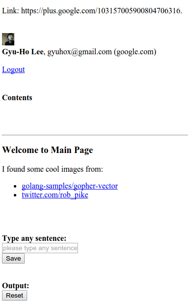
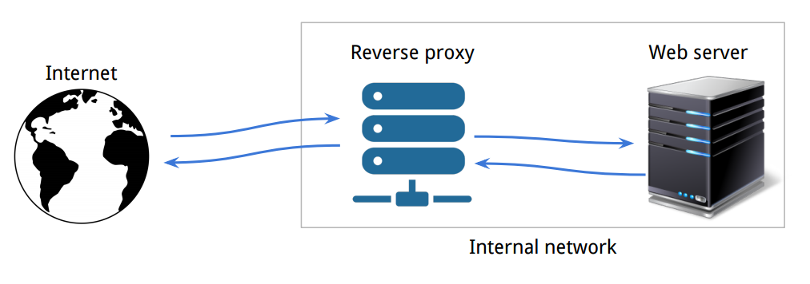

[*back to contents*](https://github.com/gyuho/learn#contents)
<br>

# Go: web application, deploy, container

- [Reference](#reference)
- [frontend with Javascript](#frontend-with-javascript)
- [proxy](#proxy)
- [docker, rkt](#docker-rkt)

[↑ top](#go-web-application-deploy-container)
<br><br><br><br>
<hr>


#### Reference

- [Javascript](https://developer.mozilla.org/en-US/docs/Web/JavaScript)
- [Javascript Wikipedia](https://en.wikipedia.org/wiki/JavaScript)
- [jQuery Wikipedia](https://en.wikipedia.org/wiki/JQuery)
- [Proxy server](https://en.wikipedia.org/wiki/Proxy_server)
- [Reverse proxy](https://en.wikipedia.org/wiki/Reverse_proxy)
- [Nginx](https://en.wikipedia.org/wiki/Nginx)
- [Docker](https://www.docker.com/)
- [Docker Jumpstart, by Andrew Odewahn](https://github.com/odewahn/docker-jumpstart/)
- [Best practices for writing Dockerfiles](https://docs.docker.com/articles/dockerfile_best-practices/)
- [CoreOS](https://coreos.com/)
- [App Container Specification](https://github.com/appc/spec)
- [Amazon Web Service (AWS)](https://aws.amazon.com/)
- [Google Cloud Platform (GCP)](https://cloud.google.com/)
- [**How DNS works**](https://howdns.works/)
- [How the Domain Name System (DNS) Works](http://www.verisign.com/en_US/domain-names/online/how-dns-works/index.xhtml?inc=www.verisigninc.com)

[↑ top](#go-web-application-deploy-container)
<br><br><br><br>
<hr>


#### frontend with Javascript

If you need to write a web application, you need Javascript.
Let's create a simple web site for getting inputs and outputs from users:

<br>
```javascript
$(document).ready(function() {

	$('#form_trigger_id_sentence').submit(function(e) {
		e.preventDefault();
		$.ajax({
			type: "POST",
			url: "/main/post_form_sentence",
			data: $(this).serialize(),
			success: function(myData) {
				$.ajax({
					type: "GET",
					url: "/main/get_form_sentence",
					async: true,
					dataType: "json",
					success: function(myData) {
						var elem = document.getElementById('Sentence');
						elem.style.fontSize = "17px";
						elem.style.fontVariant = "bold";
						if (!myData.Sentence) {
							document.getElementsByName('form_name_sentence')[0].placeholder = 'please type anything...';
							elem.innerHTML = ""
						} else {
							elem.innerHTML = myData.Sentence;
						}
					}
				});
			}
		});
	});

	$('#button_trigger_id_reset').click(function(e) {
		e.preventDefault();
		$.ajax({
			type: "GET",
			url: "/main/reset",
			async: true,
			dataType: "json",
			success: function(myData) {
				var elem = document.getElementById('Sentence');
				elem.style.fontSize = "17px";
				elem.style.fontVariant = "bold";
				elem.innerHTML = "";
				document.getElementsByName('form_name_sentence')[0].placeholder = 'please type anything...';
			}
		});
	});

});

```

<br>
```html
{{define "base"}}
<!DOCTYPE html>
<html lang="en">

<head>
    <meta charset="utf-8">
    <meta http-equiv="X-UA-Compatible" content="IE=edge">
    <meta name="viewport" content="width=device-width, initial-scale=1">
    <meta name="author" content="Gyu-Ho Lee">
    <link rel="icon" href="/static/img/favicon.ico">
    <title>{{.Link}}</title>

    {{template "head" .}}
</head>

<body>
<br> 
<br> 
<br> 
Link: {{.Link}}.
<br> 
<br> 
<br> 

<br> 
<b>{{.Name}}</b>, {{.Email}} ({{.Provider}})
<br>
<br>
<a href="/auth/logout">Logout</a>
<br>
<br>
<h4>Contents</h4>
<br>
{{template "body" .}}
<br>
</body>
</html>

{{end}}

```

```html
{{define "head"}}
<script type="text/javascript" src="http://code.jquery.com/jquery-1.11.1.min.js"></script>
<script src="/static/js/main.js"></script>
{{end}}

{{define "body"}}

<br>
<hr>
<h3>Welcome to Main Page</h3>
I found some cool images from:
<ul>
    <li><a href="https://github.com/golang-samples/gopher-vector" target="_blank">golang-samples/gopher-vector</a></li>
    <li><a href="https://twitter.com/rob_pike" target="_blank">twitter.com/rob_pike</a></li>
</ul>
<br>
<br>
<br>
<b>Type any sentence:</b>
<br>
<div class="input-group">
	<form method="POST" id="form_trigger_id_sentence">
		<input
		name="form_name_sentence"
		type="text"
		placeholder="please type any sentence...">
	</form>
	<button form="form_trigger_id_sentence" type="submit">Save</button>
</div>
<br>
<br>
<b>Output:</b> <span id="Sentence"></span>
<br>
<button id="button_trigger_id_reset" type="submit">Reset</button>
<br>
{{end}}

```

<br>
```go
package main

import (
	"encoding/gob"
	"encoding/json"
	"fmt"
	"io"
	"io/ioutil"
	"net"
	"net/http"
	"os"
	"reflect"
	"runtime"
	"strings"
	"sync"
	"text/template"
	"time"

	"golang.org/x/net/context"

	stdlog "log"

	log "github.com/Sirupsen/logrus"
	auth "github.com/bradrydzewski/go.auth"
	uuid "github.com/satori/go.uuid"
	graceful "gopkg.in/tylerb/graceful.v1"
)

/*
sudo kill $(sudo netstat -tlpn | perl -ne 'my @a = split /[ \/]+/; print "$a[6]\n" if m/:8080/gio');
go run main.go 1>>stdout.log 2>>stderr.log;
*/

type (
	key int

	storage struct {
		sync.Mutex
		userIdentifierToData map[string]*data
	}

	data struct {
		ID string
	}
)

const (
	UserKey key = 0
	DBKey   key = 1
)

var (
	port    = ":8080"
	logPath = "web.log"

	isProd             = false
	googleClientID     = "YOUR_KEY"
	googleClientSecret = "YOUR_SECRET"

	// people from here can only access this web site.
	accessibleEmail = map[string]bool{
		"gyuhox@gmail.com": true,
	}

	globalStorage storage
)

func init() {
	// Log as JSON instead of the default ASCII formatter.
	log.SetFormatter(new(log.JSONFormatter))

	// https://godoc.org/github.com/Sirupsen/logrus#Level
	// log.SetLevel(log.PanicLevel)
	// log.SetLevel(log.FatalLevel)
	// log.SetLevel(log.ErrorLevel)
	// log.SetLevel(log.WarnLevel)
	// log.SetLevel(log.InfoLevel)
	log.SetLevel(log.DebugLevel)

	globalStorage.Lock()
	globalStorage.userIdentifierToData = make(map[string]*data)
	globalStorage.Unlock()
}

func main() {
	lf, err := openToAppend(logPath)
	if err != nil {
		log.Panic(err)
	}
	defer lf.Close()
	log.SetOutput(lf)

	googleRedirect := "http://yourrealwebsite.com/auth/login"
	if !isProd {
		googleRedirect = fmt.Sprintf("http://localhost%s/auth/login", port)
	}
	auth.Config.CookieSecret = []byte("YOUR_COOKIE_SECRET")
	auth.Config.LoginSuccessRedirect = "/main"
	auth.Config.CookieSecure = false

	rootContext := context.Background()
	// rootContext = context.WithValue(rootContext, dbKey, db)

	mainRouter := http.NewServeMux()
	mainRouter.Handle("/", &ContextAdapter{
		ctx:     rootContext,
		handler: ContextHandlerFunc(handlerRoot),
	})
	mainRouter.Handle("/auth/login", auth.Google(
		googleClientID,
		googleClientSecret,
		googleRedirect,
	))
	mainRouter.Handle("/auth/logout", &ContextAdapter{
		ctx:     rootContext,
		handler: ContextHandlerFunc(handlerLogout),
	})

	mainRouter.Handle("/main", &ContextAdapter{
		ctx:     rootContext,
		handler: WithAuthentication(ContextHandlerFunc(handlerMain)),
	})
	mainRouter.Handle("/main/post_form_sentence", &ContextAdapter{
		ctx:     rootContext,
		handler: WithAuthentication(ContextHandlerFunc(handlerMainPostFormSentence)),
	})
	mainRouter.Handle("/main/get_form_sentence", &ContextAdapter{
		ctx:     rootContext,
		handler: WithAuthentication(ContextHandlerFunc(handlerMainGetFormSentence)),
	})
	mainRouter.Handle("/main/reset", &ContextAdapter{
		ctx:     rootContext,
		handler: WithAuthentication(ContextHandlerFunc(handlerMainReset)),
	})

	mainRouter.Handle("/photo", &ContextAdapter{
		ctx:     rootContext,
		handler: WithAuthentication(ContextHandlerFunc(handlerPhoto)),
	})

	mainRouter.Handle("/sendjson", &ContextAdapter{
		ctx:     rootContext,
		handler: ContextHandlerFunc(handlerSendJSON),
	})
	mainRouter.Handle("/sendgob", &ContextAdapter{
		ctx:     rootContext,
		handler: ContextHandlerFunc(handlerSendGOB),
	})
	mainRouter.Handle("/json", &ContextAdapter{
		ctx:     rootContext,
		handler: ContextHandlerFunc(handlerJSON),
	})
	mainRouter.Handle("/gob", &ContextAdapter{
		ctx:     rootContext,
		handler: ContextHandlerFunc(handlerGOB),
	})

	// func (mux *ServeMux) Handle(pattern string, handler Handler)
	mainRouter.Handle("/static/", http.StripPrefix("/static/", http.FileServer(http.Dir("static"))))

	fmt.Println("Serving http://localhost" + port)
	log.Infoln("Server started at", port)
	// if err := http.ListenAndServe(port, wrapRouterWithLogrus(mainRouter)); err != nil {
	// 	log.Panic(err)
	// }
	graceful.Run(port, 10*time.Second, wrapRouterWithLogrus(mainRouter))
}

// https://github.com/bradrydzewski/go.auth/blob/master/auth.go
func WithAuthentication(h ContextHandler) ContextHandler {
	return ContextHandlerFunc(func(ctx context.Context, w http.ResponseWriter, req *http.Request) error {
		user, err := auth.GetUserCookie(req)
		// if no active user session then authorize user
		if err != nil || user.Id() == "" {
			http.Redirect(w, req, auth.Config.LoginRedirect, http.StatusSeeOther)
			log.Warnf("unidentified user: %+v", user)
			return nil
		}
		if _, ok := accessibleEmail[user.Email()]; !ok {
			auth.DeleteUserCookie(w, req)
			http.Redirect(w, req, "http://google.com", http.StatusSeeOther)
			log.Warnf("unidentified user: %+v", user)
			return nil
		}
		// else, add the user to the URL and continue
		// req.URL.User = url.User(user.Id())

		ctx = context.WithValue(ctx, UserKey, &user)
		return h.ServeHTTPContext(ctx, w, req)
	})
}

func with(h ContextHandler) ContextHandler {
	return ContextHandlerFunc(func(ctx context.Context, w http.ResponseWriter, req *http.Request) error {
		return h.ServeHTTPContext(ctx, w, req)
	})
}

func wrapRouterWithLogrus(h http.Handler) http.HandlerFunc {
	return func(w http.ResponseWriter, req *http.Request) {
		defer func() {
			if err := recover(); err != nil {
				log.Printf("recovered from panic: %+v / %+v", err, req)
				// http.Error(w, http.StatusText(500), 500)
			}
		}()
		start := time.Now()
		h.ServeHTTP(w, req)
		took := time.Since(start)
		ip, err := getIP(req)
		if err != nil {
			log.Warnf("getIP error: %v", err)
		}
		log.WithFields(log.Fields{
			"event_type": "router",
			"referrer":   req.Referer(),
			"ua":         req.UserAgent(),
			"method":     req.Method,
			"path":       req.URL.Path,
			"ip":         ip,
			"uuid":       uuid.NewV4(),
		}).Debugf("took %s", took)
	}
}

type ContextHandler interface {
	ServeHTTPContext(context.Context, http.ResponseWriter, *http.Request) error
}

// ContextHandlerFunc wraps func(context.Context, ResponseWriter, *Request)
type ContextHandlerFunc func(context.Context, http.ResponseWriter, *http.Request) error

func (f ContextHandlerFunc) ServeHTTPContext(ctx context.Context, w http.ResponseWriter, req *http.Request) error {
	return f(ctx, w, req)
}

// ContextAdapter satisfies:
//	1. interface 'ContextHandler'
//	2. interface 'http.Handler'
type ContextAdapter struct {
	ctx     context.Context
	handler ContextHandler // to wrap func(context.Context, ResponseWriter, *Request) error
}

func (ca *ContextAdapter) ServeHTTP(w http.ResponseWriter, req *http.Request) {
	if err := ca.handler.ServeHTTPContext(ca.ctx, w, req); err != nil {
		// (X)
		// w.WriteHeader(http.StatusBadRequest)
		// http: multiple response.WriteHeader calls
		// recovered from panic: runtime error: invalid memory address
		// or nil pointer dereference

		ip, err := getIP(req)
		if err != nil {
			log.Warnf("getIP error: %v", err)
		}
		log.WithFields(log.Fields{
			"referrer": req.Referer(),
			"ua":       req.UserAgent(),
			"method":   req.Method,
			"path":     req.URL.Path,
			"ip":       ip,
			"error":    err.Error(),
		}).Errorln("ServeHTTP error")

		// json.NewEncoder(w).Encode(map[string]string{
		// 	"status":  "error",
		// 	"message": err.Error(),
		// })
	}
}

func handlerRoot(ctx context.Context, w http.ResponseWriter, req *http.Request) error {
	switch req.Method {
	case "GET":
		fmt.Fprintf(w, `<a href="/auth/login"></a>`)
		return nil

	default:
		http.Error(w, "Method Not Allowed", 405)
		return fmt.Errorf("Method Not Allowed: %+v", req.Method)
	}
}

func handlerLogout(ctx context.Context, w http.ResponseWriter, req *http.Request) error {
	switch req.Method {
	case "GET":
		auth.DeleteUserCookie(w, req)
		http.Redirect(w, req, "/", http.StatusSeeOther)
		return nil

	default:
		http.Error(w, "Method Not Allowed", 405)
		return fmt.Errorf("Method Not Allowed: %+v", req.Method)
	}
}

func handlerMain(ctx context.Context, w http.ResponseWriter, req *http.Request) error {
	switch req.Method {
	case "GET":
		user := ctx.Value(UserKey).(*auth.User)
		type page struct {
			Link     string
			Email    string
			Name     string
			Picture  string
			Provider string
		}
		if err := mainTemplate.ExecuteTemplate(w, "base", &page{
			Link:  (*user).Link(),
			Email: (*user).Email(),
			Name:  (*user).Name(),
			// Picture:   "/static/img/gopher.png",
			Picture:  (*user).Picture(),
			Provider: (*user).Provider(),
		}); err != nil {
			return err
		}
		return nil

		// THIS IS NOT WORKING
		// No data received ERR_EMPTY_RESPONSE in Chrome
		//
		// Not work because ExecuteTemplate returns nil
		// if it succeeds
		//
		// panic(mainTemplate.ExecuteTemplate(w, "base", &page{
		// 	Title:     "Test Title",
		// 	Email:     "gyuhox@gmail.com",
		// 	Name:      "Gyu-Ho Lee",
		// 	Picture:   "/static/img/gopher.png",
		// 	Authority: "Owner",
		// }))

	default:
		http.Error(w, "Method Not Allowed", 405)
		return fmt.Errorf("Method Not Allowed: %+v", req.Method)
	}
}

func handlerMainPostFormSentence(ctx context.Context, w http.ResponseWriter, req *http.Request) error {
	switch req.Method {
	case "POST":
		user := ctx.Value(UserKey).(*auth.User)
		userIdentifier := fmt.Sprintf("%+v", *user)
		if err := req.ParseForm(); err != nil {
			return err
		}
		inputSentence := ""
		if _, ok := req.Form["form_name_sentence"]; !ok {
			return fmt.Errorf("wrong Form: %+v", req.Form)
		} else {
			inputSentence = req.Form["form_name_sentence"][0]
		}
		globalStorage.Lock()
		globalStorage.userIdentifierToData[userIdentifier] = inputSentence
		globalStorage.Unlock()
		return nil

	default:
		http.Error(w, "Method Not Allowed", 405)
		return fmt.Errorf("Method Not Allowed: %+v", req.Method)
	}
}

func handlerMainGetFormSentence(ctx context.Context, w http.ResponseWriter, req *http.Request) error {
	switch req.Method {
	case "GET":
		user := ctx.Value(UserKey).(*auth.User)
		userIdentifier := fmt.Sprintf("%+v", *user)
		globalStorage.Lock()
		sentence := ""
		if v, ok := globalStorage.userIdentifierToData[userIdentifier]; ok {
			sentence = strings.TrimSpace(strings.ToUpper(v))
			globalStorage.userIdentifierToData[userIdentifier] = sentence
		}
		globalStorage.Unlock()
		response := struct {
			Sentence string
		}{
			sentence,
		}
		return json.NewEncoder(w).Encode(response)

	default:
		http.Error(w, "Method Not Allowed", 405)
		return fmt.Errorf("Method Not Allowed: %+v", req.Method)
	}
}

func handlerMainReset(ctx context.Context, w http.ResponseWriter, req *http.Request) error {
	switch req.Method {
	case "GET":
		user := ctx.Value(UserKey).(*auth.User)
		userIdentifier := fmt.Sprintf("%+v", *user)
		globalStorage.Lock()
		globalStorage.userIdentifierToData[userIdentifier] = ""
		globalStorage.Unlock()
		response := struct {
			Sentence string
		}{
			"",
		}
		return json.NewEncoder(w).Encode(response)

	default:
		http.Error(w, "Method Not Allowed", 405)
		return fmt.Errorf("Method Not Allowed: %+v", req.Method)
	}
}

func handlerPhoto(ctx context.Context, w http.ResponseWriter, req *http.Request) error {
	switch req.Method {
	case "GET":
		if _, err := fmt.Fprint(w, photoHTML); err != nil {
			return err
		}
		return nil

	default:
		http.Error(w, "Method Not Allowed", 405)
		return fmt.Errorf("Method Not Allowed: %+v", req.Method)
	}
}

func handlerSendJSON(ctx context.Context, w http.ResponseWriter, req *http.Request) error {
	switch req.Method {
	case "GET":
		fmt.Fprintf(w, "handlerSendJSON")
		ctx, cancel := context.WithTimeout(ctx, 200*time.Millisecond)
		defer cancel()
		sendRequest(ctx, port, "/json")
		return nil

	default:
		http.Error(w, "Method Not Allowed", 405)
		return fmt.Errorf("Method Not Allowed: %+v", req.Method)
	}
}

func handlerSendGOB(ctx context.Context, w http.ResponseWriter, req *http.Request) error {
	switch req.Method {
	case "GET":
		fmt.Fprintf(w, "handlerSendGOB")
		ctx, cancel := context.WithTimeout(ctx, 200*time.Millisecond)
		defer cancel()
		sendRequest(ctx, port, "/gob")
		return nil

	default:
		http.Error(w, "Method Not Allowed", 405)
		return fmt.Errorf("Method Not Allowed: %+v", req.Method)
	}
}

func sendRequest(ctx context.Context, port, endPoint string) {
	go func() {
		client := http.DefaultClient
		req, err := http.NewRequest("GET", "http://localhost"+port+endPoint, nil)
		if err != nil {
			log.Warnln(err)
			return
		}
		resp, err := client.Do(req)
		if err != nil {
			log.Warnln(err)
			return
		}
		defer resp.Body.Close()

		switch endPoint {
		case "/":
			b, err := ioutil.ReadAll(resp.Body)
			if err != nil {
				log.Warnln(err)
				return
			}
			log.WithFields(log.Fields{
				"port":     port,
				"endPoint": endPoint,
			}).Infoln("response:", string(b))

		case "/json":
			data := Data{}
			for {
				if err := json.NewDecoder(resp.Body).Decode(&data); err == io.EOF {
					break
				} else if err != nil {
					log.Warnln(err)
					return
				}
			}
			log.WithFields(log.Fields{
				"port":     port,
				"endPoint": endPoint,
			}).Infof("response: %+v", data)

		case "/gob":
			data := Data{}
			for {
				if err := gob.NewDecoder(resp.Body).Decode(&data); err == io.EOF {
					break
				} else if err != nil {
					log.Warnln(err)
					return
				}
			}
			log.WithFields(log.Fields{
				"port":     port,
				"endPoint": endPoint,
			}).Infof("response: %+v", data)
		}
	}()
	select {
	case <-ctx.Done():
		// Done channel is closed when the deadline expires(times out)
		log.Println("sendRequest timed out!")
		return
	}
}

type Data struct {
	Name  string
	Value float64
	TS    string
}

func handlerJSON(ctx context.Context, w http.ResponseWriter, req *http.Request) error {
	switch req.Method {
	case "GET":
		data := Data{}
		data.Name = "Go"
		data.Value = 1000
		data.TS = time.Now().String()[:19]
		if err := json.NewEncoder(w).Encode(data); err != nil {
			return err
		}
		return nil

	default:
		http.Error(w, "Method Not Allowed", 405)
		return fmt.Errorf("Method Not Allowed: %+v", req.Method)
	}
}

func handlerGOB(ctx context.Context, w http.ResponseWriter, req *http.Request) error {
	switch req.Method {
	case "GET":
		data := Data{}
		data.Name = "Go"
		data.Value = 2000
		data.TS = time.Now().String()[:19]
		if err := gob.NewEncoder(w).Encode(data); err != nil {
			return err
		}
		return nil

	default:
		http.Error(w, "Method Not Allowed", 405)
		return fmt.Errorf("Method Not Allowed: %+v", req.Method)
	}
}

func openToAppend(fpath string) (*os.File, error) {
	f, err := os.OpenFile(fpath, os.O_RDWR|os.O_APPEND, 0777)
	if err != nil {
		f, err = os.Create(fpath)
		if err != nil {
			return f, err
		}
	}
	return f, nil
}

// getIP extracts the user IP address from req, if present.
// https://blog.golang.org/context/userip/userip.go
func getIP(req *http.Request) (net.IP, error) {
	ip, _, err := net.SplitHostPort(req.RemoteAddr)
	if err != nil {
		return nil, fmt.Errorf("userip: %q is not IP:port", req.RemoteAddr)
	}
	userIP := net.ParseIP(ip)
	if userIP == nil {
		return nil, fmt.Errorf("userip: %q is not IP:port", req.RemoteAddr)
	}
	return userIP, nil
}

var logger = stdlog.New(os.Stdout, "[TEST] ", stdlog.Ldate|stdlog.Ltime)

func wrapHandlerFunc0(fn func(w http.ResponseWriter, req *http.Request)) func(w http.ResponseWriter, req *http.Request) {
	return func(w http.ResponseWriter, req *http.Request) {
		start := time.Now()
		fn(w, req)
		logger.Printf("%s %s   |  Took %s", req.Method, req.URL.Path, time.Since(start))
	}
}

func wrapHandlerFunc1(h http.HandlerFunc) http.HandlerFunc {
	return func(w http.ResponseWriter, req *http.Request) {
		start := time.Now()
		h.ServeHTTP(w, req)
		logger.Printf("%s %s   |  Took %s", req.Method, req.URL.Path, time.Since(start))
	}
}

func wrapHandlerFunc2(fn func(w http.ResponseWriter, req *http.Request)) func(w http.ResponseWriter, req *http.Request) {
	return func(w http.ResponseWriter, req *http.Request) {
		defer func() {
			if err := recover(); err != nil {
				log.Printf("recovered from panic: %+v / %+v", err, req)
				// http.Error(w, http.StatusText(500), 500)
			}
		}()
		start := time.Now()

		fn(w, req) // execute the handler
		took := time.Since(start)

		ip, err := getIP(req)
		if err != nil {
			log.Warnf("getIP error: %v", err)
		}
		log.WithFields(log.Fields{
			"event_type": runtime.FuncForPC(reflect.ValueOf(fn).Pointer()).Name(),
			"referrer":   req.Referer(),
			"ua":         req.UserAgent(),
			"method":     req.Method,
			"path":       req.URL.Path,
			"ip":         ip,
			"uuid":       uuid.NewV4(),
		}).Debugf("took %s", took)
	}
}

var (
	mainTemplate = template.Must(template.ParseFiles("templates/base.html", "templates/main.html"))
	photoHTML    = `
<html>
<head>
<title>photo!</title>
<style>
* {
	margin: 0;
	padding: 0;
}
	
html { 
	background: url(/static/img/bg.jpg) no-repeat center center fixed; 
	-webkit-background-size: cover;
	-moz-background-size: cover;
	-o-background-size: cover;
	background-size: cover;
}

img.mainpage {
    display: block;
    margin-left: auto;
    margin-right: auto;
}

#page-wrap { width: 400px; margin: 50px auto; padding: 20px; background: white; -moz-box-shadow: 0 0 20px black; -webkit-box-shadow: 0 0 20px black; box-shadow: 0 0 20px black; }
p {
	font: 15px/2 Georgia, Serif;
	margin: 0 0 30px 0;
	text-indent: 40px;
}
</style>
</head>

<body>
	<br>
	<br>
	<br>
	<p>photos!</p>
	<br>
	<a href="/main">Go to main</a>
</body>

</html>		
`
)

```

<br>
And here's the output:



[↑ top](#go-web-application-deploy-container)
<br><br><br><br>
<hr>


#### proxy

> In computer networks, a **proxy server** is a server (a computer system or an
> application) that acts as an intermediary for requests from clients seeking
> resources from other servers. A client connects to the proxy server,
> requesting some service, such as a file, connection, web page, or other
> resource available from a different server and the proxy server evaluates the
> request as a way to simplify and control its complexity.
>
> A reverse proxy is usually an Internet-facing proxy used as a front-end to
> control and protect access to a server on a private network. A reverse proxy
> commonly also performs tasks such as load-balancing, authentication,
> decryption or caching.
>
> A **reverse proxy** (or surrogate) is a proxy server that *appears to clients* to
> be an *ordinary server*. **Requests are forwarded to** one or more **proxy servers**
> which handle the request. The **response from the proxy server** is returned *as
> if* it came directly from the **original server**, leaving the client no knowledge
> of the origin servers.
>
> [*Proxy server*](https://en.wikipedia.org/wiki/Proxy_server) *by Wikipedia*

<br>
> A reverse proxy taking requests from the Internet and forwarding them to
> servers in an internal network. Those making requests to the proxy may not be
> aware of the internal network.
> 
> Reverse proxies can hide the existence and characteristics of an origin
> server or servers.
>
> [*Reverse proxy*](https://en.wikipedia.org/wiki/Reverse_proxy) *by Wikipedia*

<br>
We can use [Nginx](http://wiki.nginx.org/Main) as an HTTP server, reverse proxy
along with Go web servers:



<br>
Then why do we bother to run another web server, or reverse proxy while we can
do pretty much everything in Go?

```go
package main

import (
    "fmt"
    "net/http"
)

func handler(w http.ResponseWriter, r *http.Request) {
    fmt.Fprintf(w, "Hi there, I love %s!", r.URL.Path[1:])
}

func main() {
    http.HandleFunc("/", handler)
    http.ListenAndServe(":8080", nil)
}

```

<br>
It's because popular web proxies like `Nginx` provides useful features
out-of-the box. So it's not to reinvent the wheels while we can just add
another module to `Nginx` configuration. `Nginx` provides:

- Rate limiting.
- Access, error logs.
- Serve static files with `try_files`.
- Auth, compression support.
- Serve cached contents while the application is down.

<br>
For more, please visit [Nginx wiki](http://wiki.nginx.org/Main).

[↑ top](#go-web-application-deploy-container)
<br><br><br><br>
<hr>


#### docker, rkt

These are great introductory articles about Docker, rkt, containers:

- https://www.docker.com/whatisdocker
- https://coreos.com/using-coreos/containers/
- https://coreos.com/rkt/docs/latest/

And this is just how I understand them.

<br>
**Docker** is like a big binary file for an application.
Just like Unix, you can compile an application into one file, and run it as a
process. **Docker** is an application container, not a system container.
Then what is *container*? Containers *contain* the *application* and all its
*dependencies*, but they share the kernel with other containers. And containers
are running as a separate process under its host operating system. (It's
recommended that you [run only one process per
container](https://docs.docker.com/articles/dockerfile_best-practices/).)
It's usually faster, lighter than VMs. Pre-existing techonologies include:

- [*`cgroups`*](https://en.wikipedia.org/wiki/Cgroups)
- [*`LXC`*](https://en.wikipedia.org/wiki/LXC)
- [*`namespace`*](http://man7.org/linux/man-pages/man7/namespaces.7.html)
- [*`AUFS`*](https://en.wikipedia.org/wiki/Aufs)

<br>
> The most powerful feature of containers is the ability to run any Linux
> userland that's compatible with the latest kernel.
>
> [*Container Overview*](https://coreos.com/using-coreos/containers/) *by
> CoreOS*

<br>
Software engineering becomes frustrating when you have to deal with
inconsistent development, production environments. This is the core problem
that containerization solves, in that developers can now **document** those
processes in `Dockerfile` or `App Container Specification`.
It helps define and maintain homogeneous dev/test/prod environments
in a reproduceable way.

<br>
Then let's write actual `Dockerfile` and `App Container Specification`
to deploy my
[web application](./code):

<br>
**`Docker`**:

```
FROM ubuntu:14.04
RUN apt-get update
RUN apt-get install -y nginx
ADD ./nginx.conf /etc/nginx/sites-available/default
RUN service nginx restart

# automatically copies the package source,
# fetches the application dependencies
# builds the program, and configures it to run on startup.
FROM golang:onbuild
EXPOSE 8080

```

```sh
#!/bin/bash
sudo docker build -t code .;
sudo docker run --publish 8080:8080 --name test --rm code;

```


<br>
<br>
**`App Container Specification`**:

**TODO: THIS IS NOT WORKING... (https://github.com/appc/spec/issues/480)**


```json
{
	"acKind": "ImageManifest",
	"acVersion": "0.6.1",
	"name": "gyuho/code",
	"labels": [
		{
			"name": "version",
			"value": "0.0.1"
		},
		{
			"name": "arch",
			"value": "amd64"
		},
		{
			"name": "os",
			"value": "linux"
		}
	],
	"app": {
		"user": "root",
		"group": "root",
		"exec": [
			"/usr/bin/code"
		],
		"mountPoints": [
			{
				"name": "static",
				"path": "/usr/bin/static"
			},
			{
				"name": "templates",
				"path": "/usr/bin/templates"
			}
		],
		"ports": [
			{
				"name": "web-server",
				"protocol": "tcp",
				"port": 8080
			}
		]
	},
	"annotations": [
		{
			"name": "authors",
			"value": "Gyu-Ho Lee <gyuhox@gmail.com>"
		}
	]
}

```

```sh
#!/bin/bash
# https://github.com/coreos/rkt/blob/master/Documentation/getting-started-guide.md

CGO_ENABLED=0 GOOS=linux go build -o code -a -installsuffix cgo .;
file code;
ldd code;
sudo ./actool --debug validate manifest.json;

mkdir -p image/rootfs/usr/bin;

sudo cp manifest.json image/manifest;

sudo cp code image/rootfs/usr/bin;
sudo cp -rf static/ image/rootfs/usr/bin;
sudo cp -rf templates/ image/rootfs/usr/bin;

sudo ./actool build --overwrite image/ code-0.0.1-linux-amd64.aci;
sudo ./actool --debug validate code-0.0.1-linux-amd64.aci;

sudo ./rkt metadata-service >/dev/null 2>&1 & # run in background

sudo ./rkt --insecure-skip-verify run \
code-0.0.1-linux-amd64.aci \
--volume static,kind=host,source=/usr/bin/static \
--volume templates,kind=host,source=/usr/bin/templates \
-- \
;

```

[↑ top](#go-web-application-deploy-container)
<br><br><br><br>
<hr>
