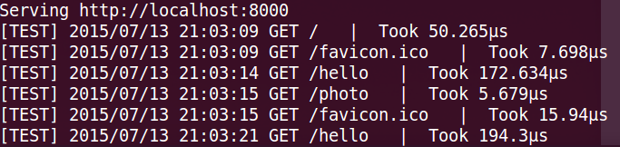
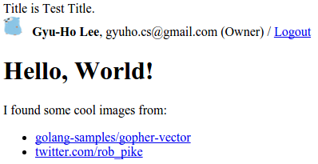

[*back to contents*](https://github.com/gyuho/learn#contents)
<br>

# Go: web server with template, log, context

- [Reference](#reference)
- [`text/template`](#texttemplate)
- [serve image](#serve-image)
- [`log`](#log)
- [`logrus`](#logrus)
- [concurrent web requests](#concurrent-web-requests)
- [`net/context`](#netcontext)
- [web server with `html/template`, `logrus`, `net/context`](#web-server-with-htmltemplate-logrus-netcontext)

[↑ top](#go-web-server-with-template-log-context)
<br><br><br><br>
<hr>


#### Reference

- [Using The Log Package In Go](http://www.goinggo.net/2013/11/using-log-package-in-go.html)
- [Sirupsen/logrus](https://github.com/Sirupsen/logrus)
- [`net/context`](https://godoc.org/golang.org/x/net/context)
- [Go Concurrency Patterns: Context](https://blog.golang.org/context)
- [Go's net/context and http.Handler](https://joeshaw.org/net-context-and-http-handler/)

[↑ top](#go-web-server-with-template-log-context)
<br><br><br><br>
<hr>


#### `text/template`

[Here](http://play.golang.org/p/V5fh24NbSf)'s an example of
[text/template](http://golang.org/pkg/text/template/) package:

```go
package main
 
import (
	"bytes"
	"fmt"
	"log"
	"text/template"
)
 
func main() {
	tagName := "{{.BranchName}}_{{.Type}}"
	tagStruct := struct {
		BranchName string
		Type       string
	}{
		"gyuho",
		"prod",
	}
	buf := new(bytes.Buffer)
	if err := template.Must(template.New("tmpl").Parse(tagName)).Execute(buf, tagStruct); err != nil {
		log.Fatal(err)
	}
	fmt.Println(buf.String())
	// gyuho_prod
 
	queryStruct := struct {
		SchemaName string
		TableName  string
		Slice      []map[string]string
		LastIndex  int
	}{
		"my",
		"table",
		[]map[string]string{
			map[string]string{"key": "VARCHAR(100) PRIMARY KEY NOT NULL"},
			map[string]string{"value1": "INTEGER"},
			map[string]string{"value2": "INTEGER"},
		},
		2,
	}
	var queryTmpl = `CREATE TABLE IF NOT EXISTS {{.SchemaName}}.{{.TableName}}  ({{$lastIndex := .LastIndex}}
{{range $index, $valueMap := .Slice}}{{if ne $lastIndex $index}}{{range $key, $value := $valueMap}}	{{$key}} {{$value}},{{end}}
{{else}}{{range $key, $value := $valueMap}}	{{$key}} {{$value}}{{end}}
{{end}}{{end}});`
	tb := new(bytes.Buffer)
	if err := template.Must(template.New("tmpl").Parse(queryTmpl)).Execute(tb, queryStruct); err != nil {
		log.Fatal(err)
	}
	fmt.Println(tb.String())
	/*
	   CREATE TABLE IF NOT EXISTS my.table  (
	   	key VARCHAR(100) PRIMARY KEY NOT NULL,
	   	value1 INTEGER,
	   	value2 INTEGER
	   );
	*/
}
```

[↑ top](#go-web-server-with-template-log-context)
<br><br><br><br>
<hr>


#### serve image

```go
package main

import (
	"net/http"
	"path"
)

func main() {
	http.HandleFunc("/", foo)
	http.ListenAndServe(":3000", nil)
}

func foo(w http.ResponseWriter, r *http.Request) {
	fp := path.Join(".", "gopherbw.png")
	http.ServeFile(w, r, fp)
}

```

[↑ top](#go-web-server-with-template-log-context)
<br><br><br><br>
<hr>


#### `log`

Here's how I use [`log`](http://golang.org/pkg/log/) package.

```go
// go run 00_log.go 1>>stdout.log 2>>stderr.log;
package main

import (
	"fmt"
	"log"
)

func main() {
	log.Println("First log message!")
	ss := []int{1, 2, 3}
	fmt.Println(ss)
	fmt.Println(ss[5])
}

```

<br>
And if you run this program with
`go run 00_log.go 1>>stdout.log 2>>stderr.log;`,
you will see output of `log` package pipes into `stderr`
and output of `fmt` package pipes to `stdout`.

[↑ top](#go-web-server-with-template-log-context)
<br><br><br><br>
<hr>


#### `logrus`

If you need to store logs in files, you can use
[Sirupsen/logrus](https://github.com/Sirupsen/logrus):

```go
package main

import (
	"os"

	log "github.com/Sirupsen/logrus"
)

func openToAppend(fpath string) (*os.File, error) {
	f, err := os.OpenFile(fpath, os.O_RDWR|os.O_APPEND, 0777)
	if err != nil {
		f, err = os.Create(fpath)
		if err != nil {
			return f, err
		}
	}
	return f, nil
}

func init() {
	// Log as JSON instead of the default ASCII formatter.
	log.SetFormatter(new(log.JSONFormatter))

	// https://godoc.org/github.com/Sirupsen/logrus#Level
	// log.SetLevel(log.WarnLevel)
	// log.SetLevel(log.InfoLevel)
	log.SetLevel(log.DebugLevel)
}

func main() {
	lf, err := openToAppend("my.log")
	if err != nil {
		panic(err)
	}
	defer lf.Close()
	// Output to stderr instead of stdout, could also be a file.
	log.SetOutput(lf)

	log.Println("Hello World!") // Println belongs to Infoln
	log.WithFields(log.Fields{
		"animal": "walrus",
		"size":   10,
	}).Info("A group of walrus emerges from the ocean")

	log.WithFields(log.Fields{
		"omg":    true,
		"number": 122,
	}).Warn("The group's number increased tremendously!")

	log.Panic("panic")

	log.WithFields(log.Fields{
		"omg":    true,
		"number": 100,
	}).Panic("The ice breaks!")
}

```

```
# my.log
{"level":"warning","msg":"The group's number increased tremendously!","number":122,"omg":true,"time":"2015-09-01T23:23:44-07:00"}
{"level":"fatal","msg":"The ice breaks!","number":100,"omg":true,"time":"2015-09-01T23:23:44-07:00"}
{"animal":"walrus","level":"info","msg":"A group of walrus emerges from the ocean","size":10,"time":"2015-09-01T23:25:48-07:00"}
{"level":"warning","msg":"The group's number increased tremendously!","number":122,"omg":true,"time":"2015-09-01T23:25:48-07:00"}
{"level":"panic","msg":"The ice breaks!","number":100,"omg":true,"time":"2015-09-01T23:25:48-07:00"}
{"animal":"walrus","level":"info","msg":"A group of walrus emerges from the ocean","size":10,"time":"2015-09-01T23:27:00-07:00"}
{"level":"warning","msg":"The group's number increased tremendously!","number":122,"omg":true,"time":"2015-09-01T23:27:00-07:00"}
{"level":"panic","msg":"panic","time":"2015-09-01T23:27:00-07:00"}
{"level":"info","msg":"Hello World!","time":"2015-09-01T23:40:25-07:00"}
{"animal":"walrus","level":"info","msg":"A group of walrus emerges from the ocean","size":10,"time":"2015-09-01T23:40:25-07:00"}
{"level":"warning","msg":"The group's number increased tremendously!","number":122,"omg":true,"time":"2015-09-01T23:40:25-07:00"}
{"level":"panic","msg":"panic","time":"2015-09-01T23:40:25-07:00"}

```

[↑ top](#go-web-server-with-template-log-context)
<br><br><br><br>
<hr>


#### concurrent web requests

<br>
> In Go servers, **each incoming request** is handled in its **own goroutine**.
> Request handlers often start additional goroutines to access backends such
> as databases and RPC services. The set of goroutines working on a request
> typically needs access to request-specific values such as the identity of the
> end user, authorization tokens, and the request's deadline. When a request is
> canceled or times out, all the goroutines working on that request should exit
> quickly so the system can reclaim any resources they are using.
>
> At Google, we developed a `context` package that makes it easy to pass
> **request-scoped values**, cancelation signals, and deadlines across API
> boundaries to all the goroutines involved in handling a request.
>
> [Go Concurrency Patterns: Context](https://blog.golang.org/context) *by
> Sameer Ajmani*
<br>


```go
package main

import (
	"fmt"
	"io/ioutil"
	"log"
	"net/http"
	"time"
)

/*
sudo kill $(sudo netstat -tlpn | perl -ne 'my @a = split /[ \/]+/; print "$a[6]\n" if m/:3000/gio');
*/

// global variable shared by all concurrent requests
var color string

// This is not a good practice because the global variable
// is being affected by race conditions with concurrent web requests.

func main() {
	for i := 0; i < 100; i++ {
		go sendRequestRed()
		go sendRequestBlue()
	}
	http.HandleFunc("/", handler)
	http.HandleFunc("/red", red)
	http.HandleFunc("/blue", blue)
	fmt.Println("Listening to http://localhost:3000")
	http.ListenAndServe(":3000", nil)
}

func handler(w http.ResponseWriter, req *http.Request) {
	switch req.Method {
	case "GET":
		fmt.Fprintf(w, "Hello World! Global color is now %s", color)
	default:
		http.Error(w, "Method Not Allowed", 405)
	}
}

func red(w http.ResponseWriter, req *http.Request) {
	switch req.Method {
	case "GET":
		color = "red"
		fmt.Fprintf(w, "set red")
	default:
		http.Error(w, "Method Not Allowed", 405)
	}
}

func blue(w http.ResponseWriter, req *http.Request) {
	switch req.Method {
	case "GET":
		color = "blue"
		fmt.Fprintf(w, "set blue")
	default:
		http.Error(w, "Method Not Allowed", 405)
	}
}

func sendRequestRed() {
	time.Sleep(3 * time.Second)
	client := http.DefaultClient
	req, err := http.NewRequest("GET", "http://localhost:3000/red", nil)
	if err != nil {
		log.Panic(err)
	}
	resp, err := client.Do(req)
	if err != nil {
		log.Panic(err)
	}
	defer resp.Body.Close()
	b, err := ioutil.ReadAll(resp.Body)
	if err != nil {
		log.Panic(err)
	}
	fmt.Println("response is", string(b))
}

func sendRequestBlue() {
	time.Sleep(3 * time.Second)
	client := http.DefaultClient
	req, err := http.NewRequest("GET", "http://localhost:3000/blue", nil)
	if err != nil {
		log.Panic(err)
	}
	resp, err := client.Do(req)
	if err != nil {
		log.Panic(err)
	}
	defer resp.Body.Close()
	b, err := ioutil.ReadAll(resp.Body)
	if err != nil {
		log.Panic(err)
	}
	fmt.Println("response is", string(b))
}

```

[↑ top](#go-web-server-with-template-log-context)
<br><br><br><br>
<hr>


#### `net/context`

> In Go servers, **each incoming request** is handled in its **own goroutine**.
> Request handlers often start additional goroutines to access backends such
> as databases and RPC services. The set of goroutines working on a request
> typically needs access to request-specific values such as the identity of the
> end user, authorization tokens, and the request's deadline. When a request is
> canceled or times out, all the goroutines working on that request should exit
> quickly so the system can reclaim any resources they are using.
>
> At Google, we developed a `context` package that makes it easy to pass
> **request-scoped values**, cancelation signals, and deadlines across API
> boundaries to all the **goroutines involved in handling a request**.
>
> [*Go Concurrency Patterns: Context*](https://blog.golang.org/context) *by
> Sameer Ajmani*

<br>
> **Incoming requests** to a server should **create a Context**,
> and **outgoing calls** to servers should **accept a Context**.
> The chain of function calls between must **propagate the Context**,
> optionally replacing it  with a modified copy created using WithDeadline,
> WithTimeout, WithCancel, or WithValue.
>
> [package `context`](https://godoc.org/golang.org/x/net/context)

<br>
And here's an simple example of `context` package:

```go
package main

import (
	"fmt"
	"time"

	"golang.org/x/net/context"
)

type key int

const appStartTSKey key = 0

const userIPKey key = 1

const userAgentKey key = 2

func setContextWithAppStartTS(ctx context.Context, ts string) context.Context {
	return context.WithValue(ctx, appStartTSKey, ts)
}

func setContextWithIP(ctx context.Context, userIP string) context.Context {
	return context.WithValue(ctx, userIPKey, userIP)
}

func setContextWithUserAgent(ctx context.Context, userAgent string) context.Context {
	return context.WithValue(ctx, userAgentKey, userAgent)
}

func getAppStartTSFromContext(ctx context.Context) (string, bool) {
	ts, ok := ctx.Value(appStartTSKey).(string)
	return ts, ok
}

func getIPFromContext(ctx context.Context) (string, bool) {
	userIP, ok := ctx.Value(userIPKey).(string)
	return userIP, ok
}

func getUserAgentFromContext(ctx context.Context) (string, bool) {
	userAgent, ok := ctx.Value(userAgentKey).(string)
	return userAgent, ok
}

func main() {
	func() {
		ctx := context.Background()
		ctx = setContextWithAppStartTS(ctx, time.Now().String())
		ctx = setContextWithIP(ctx, "1.2.3.4")
		ctx = setContextWithUserAgent(ctx, "Linux")
		fmt.Println(ctx)
		fmt.Println(getAppStartTSFromContext(ctx))
		fmt.Println(getIPFromContext(ctx))
		fmt.Println(getUserAgentFromContext(ctx))
		fmt.Println("Done 1:", ctx)
	}()
	/*
	   Done 1: context.Background.WithValue(0, "2015-09-02 22:38:00.640981471 -0700 PDT").WithValue(1, "1.2.3.4").WithValue(2, "Linux")
	*/

	fmt.Println()
	func() {
		// Done channel is closed when the deadline expires(times out)
		ctx, cancel := context.WithTimeout(context.Background(), 100*time.Millisecond)
		ctx = setContextWithUserAgent(ctx, "Linux")
		cancel()
		select {
		case <-time.After(200 * time.Millisecond):
			panic("overslept")
		case <-ctx.Done():
			// Done channel is closed when the deadline expires(times out)
			fmt.Println("Done 2:", ctx)
			fmt.Println("Done 2:", ctx.Err()) // prints "context canceled"
		}
	}()
	/*
	   Done 2: context.Background.WithDeadline(2015-09-02 22:38:00.841406346 -0700 PDT [99.990302ms]).WithValue(2, "Linux")
	   Done 2: context canceled
	*/

	fmt.Println()
	func() {
		// Done channel is closed when the deadline expires(times out)
		ctx, cancel := context.WithTimeout(context.Background(), 100*time.Millisecond)
		go sendRequest(ctx, time.Second)
		defer cancel()
		select {
		case <-time.After(200 * time.Millisecond):
			panic("overslept")
		case <-ctx.Done():
			// Done channel is closed when the deadline expires(times out)
			fmt.Println("Done 3 timed out:", ctx)
			fmt.Println("Done 3 timed out:", ctx.Err()) // prints "context deadline exceeded"
		}
	}()
	time.Sleep(time.Second)
	/*
	   Started: sendRequest
	   Done 3 timed out: context.Background.WithDeadline(2015-09-02 22:38:00.841432965 -0700 PDT [-105.376µs])
	   Done 3 timed out: context deadline exceeded
	   Done: sendRequest
	*/

	fmt.Println()
	func() {
		// Done channel is closed when the deadline expires(times out)
		ctx, cancel := context.WithTimeout(context.Background(), 100*time.Millisecond)
		go sendRequest(ctx, time.Millisecond)
		defer cancel()
		select {
		case <-ctx.Done():
			// Done channel is closed when the deadline expires(times out)
			fmt.Println("Done 4 timed out:", ctx)
			fmt.Println("Done 4 timed out:", ctx.Err()) // prints "context deadline exceeded"
		}
	}()
	/*
		Started: sendRequest
		Done: sendRequest
		Done 4 timed out: context.Background.WithDeadline(2015-09-02 23:41:38.874000873 -0700 PDT [-139.856µs])
		Done 4 timed out: context deadline exceeded
	*/

	fmt.Println()
	func() {
		// Done channel is closed when the deadline expires(times out)
		ctx, cancel := context.WithTimeout(context.Background(), 100*time.Millisecond)
		defer cancel()
		sendRequestCorrectWawy(ctx, 500*time.Millisecond)
		fmt.Println("Done 5")
	}()
	/*
		Started: sendRequestCorrectWawy
		Timed out: sendRequestCorrectWawy
		Done 5
	*/

	fmt.Println()
	func() {
		// Done channel is closed when the deadline expires(times out)
		ctx, cancel := context.WithTimeout(context.Background(), 100*time.Millisecond)
		defer cancel()
		sendRequestCorrectWawy(ctx, time.Millisecond)
		fmt.Println("Done 6")
	}()
	/*
		Started: sendRequestCorrectWawy
		Done: sendRequestCorrectWawy
		Done 6
	*/

	fmt.Println()
	func() {
		// Done channel is closed when the deadline expires(times out)
		ctx, cancel := context.WithTimeout(context.Background(), 100*time.Millisecond)
		cancel()
		sendRequestCorrectWawy(ctx, time.Millisecond)
		fmt.Println("Done 7")
	}()
	/*
		Started: sendRequestCorrectWawy
		Timed out: sendRequestCorrectWawy
		Done 7
	*/
}

func sendRequest(ctx context.Context, duration time.Duration) {
	fmt.Println("Started: sendRequest")
	time.Sleep(duration)
	fmt.Println("Done: sendRequest")
}

func sendRequestCorrectWawy(ctx context.Context, duration time.Duration) {
	fmt.Println("Started: sendRequestCorrectWawy")
	select {
	case <-time.After(duration):
		fmt.Println("Done: sendRequestCorrectWawy")
		return
	case <-ctx.Done():
		fmt.Println("Timed out: sendRequestCorrectWawy")
		return
	}
}

```


<br>
And here's my approach to incorporate `net/context` package with Go standard
[`http`](http://golang.org/pkg/net/http) package *as smoothly as possible*,
and to share contexts, states, information between handlers and other services,
optionally with timeouts, and so on.

Key idea is to understand the [`http.Handler`](http://golang.org/pkg/net/http/#Handler)
interface:

```go
type Handler interface {
	ServeHTTP(ResponseWriter, *Request)
}
```

Any **type** that *implements* `ServeHTTP(ResponseWriter, *Request)` satisfies
`http.Handler` **interface**. For example:

1. type [`http.HandlerFunc`](http://golang.org/pkg/net/http/#HandlerFunc) satisfies `http.Handler` interface,
   with [`ServeHTTP`](http://golang.org/pkg/net/http/#HandlerFunc.ServeHTTP).
2. type [`http.ServeMux`](http://golang.org/pkg/net/http/#ServeMux) satisfies `http.Handler` interface,
   with [`ServeHTTP`](http://golang.org/pkg/net/http/#ServeMux.ServeHTTP).

```go
// The HandlerFunc type is an adapter to allow the use of
// ordinary functions as HTTP handlers.  If f is a function
// with the appropriate signature, HandlerFunc(f) is a
// Handler object that calls f.
type HandlerFunc func(ResponseWriter, *Request)

// ServeHTTP calls f(w, r).
func (f HandlerFunc) ServeHTTP(w ResponseWriter, r *Request) {
	f(w, r)
}

type ServeMux struct {
	mu    sync.RWMutex
	m     map[string]muxEntry
	hosts bool // whether any patterns contain hostnames
}

// ServeHTTP dispatches the request to the handler whose
// pattern most closely matches the request URL.
func (mux *ServeMux) ServeHTTP(w ResponseWriter, r *Request) {
	if r.RequestURI == "*" {
		if r.ProtoAtLeast(1, 1) {
			w.Header().Set("Connection", "close")
		}
		w.WriteHeader(StatusBadRequest)
		return
	}
	h, _ := mux.Handler(r)
	h.ServeHTTP(w, r)
}
```

<br>
So that they can be used as below:

```
func Handle(pattern string, handler Handler)
func HandleFunc(pattern string, handler func(ResponseWriter, *Request))
func ListenAndServe(addr string, handler Handler) error

func (mux *ServeMux) Handle(pattern string, handler Handler)
func (mux *ServeMux) HandleFunc(pattern string, handler func(ResponseWriter, *Request))
```

<br>
Then I need to come up with a type that implements `ServeHTTP`
just like `http.HandlerFunc` and `http.ServeMux`, and then satisfy the
interface `http.Handler` so that we can just use the same patterns.
This is a type of function that I want to use globally:

```go
func handler(ctx context.Context, w http.ResponseWriter, req *http.Request) {
	fmt.Fprintf(w, "Hello World")
}
```

But the function signature does not match with `http.HandlerFunc`:

```go
type HandlerFunc func(ResponseWriter, *Request)
```

<br>
Then I need to wrap `context.Context` with methods:

```go
func (ctx context.Context) handler(w http.ResponseWriter, req *http.Request) {
	fmt.Fprintf(w, "Hello World")
}
```

This is exactly what does to satisfy the `http.Handler` interface:

```go
type HandlerFunc func(ResponseWriter, *Request)

// ServeHTTP calls f(w, r).
func (f HandlerFunc) ServeHTTP(w ResponseWriter, r *Request) {
	f(w, r)
}
```

<br>
So now we know that we need to define a type that wraps `context.Context`,
and the type must implement `ServeHTTP`:

```go
type HandlerFunc func(ResponseWriter, *Request)

// ServeHTTP calls f(w, r).
func (f HandlerFunc) ServeHTTP(w ResponseWriter, r *Request) {
	f(w, r)
}


type ContextAdapter struct{
	ctx context.Context
}

func (ca *ContextAdapter) ServeHTTP(w http.ResponseWriter, req *http.Request) {
	// ContextAdapter should contain some kind of function...
	// so that we can execute func(ResponseWriter, *Request)
	//                     or func(context.Context, ResponseWriter, *Request)
}
```

This tells that I need to create our own interface to define
serving methods. And I can:

```go
type HandlerFunc func(ResponseWriter, *Request)

// ServeHTTP calls f(w, r).
func (f HandlerFunc) ServeHTTP(w ResponseWriter, r *Request) {
	f(w, r)
}


type ContextHandler interface {
	ServeHTTPContext(context.Context, http.ResponseWriter, *http.Request) error
}

// ContextHandlerFunc wraps func(context.Context, ResponseWriter, *Request)
type ContextHandlerFunc func(context.Context, http.ResponseWriter, *http.Request) error

func (f ContextHandlerFunc) ServeHTTPContext(ctx context.Context, w http.ResponseWriter, req *http.Request) error {
	return f(ctx, r, req)
}

type ContextAdapter struct{
	ctx     context.Context
	handler ContextHandler // to wrap func(context.Context, ResponseWriter, *Request)
}

func (ca *ContextAdapter) ServeHTTP(w http.ResponseWriter, req *http.Request) {
	ca.handler.ServeHTTPContext(ca.ctx, r, req)
}
```

<br>
Now I have created an interface `ContextHandler` with a method `ContextHandlerFunc`
in order to wrap `context.Context` in handlers. And with this interface, I have
`ContextAdapter` type that embeds `ContextHandler` interface and implements
`ServeHTTP` so that it can satisfy the interface `http.Handler`. 
Now everything seems ready to use handler with `context.Context`:

```
func handler(ctx context.Context, w http.ResponseWriter, req *http.Request) error {
	fmt.Fprintf(w, "Hello World")
	return nil
}

func Handle(pattern string, handler Handler)
func ListenAndServe(addr string, handler Handler) error

func (mux *ServeMux) Handle(pattern string, handler Handler)
```

And here's an example:

```go
package main

import (
	"encoding/json"
	"fmt"
	"net"
	"net/http"
	"time"

	"golang.org/x/net/context"
)

/*
sudo kill $(sudo netstat -tlpn | perl -ne 'my @a = split /[ \/]+/; print "$a[6]\n" if m/:5000/gio');
*/

type ContextHandler interface {
	ServeHTTPContext(context.Context, http.ResponseWriter, *http.Request) error
}

// ContextHandlerFunc wraps func(context.Context, ResponseWriter, *Request)
type ContextHandlerFunc func(context.Context, http.ResponseWriter, *http.Request) error

func (f ContextHandlerFunc) ServeHTTPContext(ctx context.Context, w http.ResponseWriter, req *http.Request) error {
	return f(ctx, w, req)
}

// ContextAdapter satisfies:
//	1. interface 'ContextHandler'
//	2. interface 'http.Handler'
type ContextAdapter struct {
	ctx     context.Context
	handler ContextHandler // to wrap func(context.Context, ResponseWriter, *Request) error
}

func (ca *ContextAdapter) ServeHTTP(w http.ResponseWriter, req *http.Request) {
	if err := ca.handler.ServeHTTPContext(ca.ctx, w, req); err != nil {
		w.WriteHeader(http.StatusBadRequest)
		json.NewEncoder(w).Encode(map[string]string{
			"status":  "error",
			"message": err.Error(),
		})
	}
}

func main() {
	rootContext := context.Background()
	mainRouter := http.NewServeMux()

	// values are not shared between handlers!
	// context package is for passing request-scoped values,
	mainRouter.Handle("/", &ContextAdapter{
		ctx:     rootContext,
		handler: ContextHandlerFunc(handlerRoot),
	})
	mainRouter.Handle("/root", &ContextAdapter{
		ctx:     rootContext,
		handler: withTS(ContextHandlerFunc(handlerRoot)),
	})
	mainRouter.Handle("/set", &ContextAdapter{
		ctx:     rootContext,
		handler: ContextHandlerFunc(handlerSet),
	})
	mainRouter.Handle("/send1", &ContextAdapter{
		ctx:     rootContext,
		handler: ContextHandlerFunc(handlerSend1),
	})
	mainRouter.Handle("/send2", &ContextAdapter{
		ctx:     rootContext,
		handler: ContextHandlerFunc(handlerSend2),
	})

	port := ":5000"
	fmt.Println("Serving http://localhost" + port)
	if err := http.ListenAndServe(port, mainRouter); err != nil {
		panic(err)
	}
}

/*
sendRequest1 started
sendRequest1 done!

sendRequest2 started
sendRequest2 timed out!
*/

func handlerRoot(ctx context.Context, w http.ResponseWriter, req *http.Request) error {
	switch req.Method {
	case "GET":
		fmt.Println("handlerRoot")
		ts, _ := getAppStartTSFromContext(ctx)
		ip, _ := getIPFromContext(ctx)
		ua, _ := getUserAgentFromContext(ctx)
		fmt.Fprintf(w, "Root = AppStartTS: %s / IP: %v / UserAgent: %s", ts, ip, ua)
		return nil

	default:
		http.Error(w, "Method Not Allowed", 405)
		return fmt.Errorf("Method Not Allowed:", req.Method)
	}
}

func handlerSet(ctx context.Context, w http.ResponseWriter, req *http.Request) error {
	switch req.Method {
	case "GET":
		fmt.Println("handlerSet")
		ts := time.Now().String()
		ip, err := getIP(req)
		if err != nil {
			return err
		}
		ua := req.UserAgent()
		ctx = setContextWithAppStartTS(ctx, ts)
		ctx = setContextWithIP(ctx, ip)
		ctx = setContextWithUserAgent(ctx, ua)
		fmt.Fprintf(w, "Set = AppStartTS: %s / IP: %v / UserAgent: %s", ts, ip, ua)
		return nil

	default:
		http.Error(w, "Method Not Allowed", 405)
		return fmt.Errorf("Method Not Allowed:", req.Method)
	}
}

func withTS(h ContextHandler) ContextHandler {
	return ContextHandlerFunc(func(ctx context.Context, w http.ResponseWriter, req *http.Request) error {
		ctx = setContextWithAppStartTS(ctx, time.Now().String())
		return h.ServeHTTPContext(ctx, w, req)
	})
}

func handlerSend1(ctx context.Context, w http.ResponseWriter, req *http.Request) error {
	switch req.Method {
	case "GET":
		fmt.Fprintf(w, "handlerSend1")
		// Done channel is closed when the deadline expires(times out)
		ctx, cancel := context.WithTimeout(ctx, time.Second)
		defer cancel()
		sendRequest(ctx, "sendRequest1", time.Millisecond)
		return nil

	default:
		http.Error(w, "Method Not Allowed", 405)
		return fmt.Errorf("Method Not Allowed:", req.Method)
	}
}

func handlerSend2(ctx context.Context, w http.ResponseWriter, req *http.Request) error {
	switch req.Method {
	case "GET":
		fmt.Fprintf(w, "handlerSend2")
		// Done channel is closed when the deadline expires(times out)
		ctx, cancel := context.WithTimeout(ctx, time.Second)
		defer cancel()
		sendRequest(ctx, "sendRequest2", 2*time.Second)
		return nil

	default:
		http.Error(w, "Method Not Allowed", 405)
		return fmt.Errorf("Method Not Allowed:", req.Method)
	}
}

func sendRequest(ctx context.Context, msg string, duration time.Duration) {
	fmt.Println(msg, "started")
	select {
	case <-time.After(duration):
		fmt.Println(msg, "done!")
		return
	case <-ctx.Done():
		// Done channel is closed when the deadline expires(times out)
		fmt.Println(msg, "timed out!")
		return
	}
}

// The key type is unexported to prevent collisions with context keys defined in
// other packages.
type key int

const appStartTSKey key = 0

const userIPKey key = 1

const userAgentKey key = 2

func setContextWithAppStartTS(ctx context.Context, ts string) context.Context {
	return context.WithValue(ctx, appStartTSKey, ts)
}

func setContextWithIP(ctx context.Context, userIP net.IP) context.Context {
	return context.WithValue(ctx, userIPKey, userIP)
}

func setContextWithUserAgent(ctx context.Context, userAgent string) context.Context {
	return context.WithValue(ctx, userAgentKey, userAgent)
}

func getAppStartTSFromContext(ctx context.Context) (string, bool) {
	// ctx.Value returns nil if ctx has no value for the key;
	// the string type assertion returns ok=false for nil.
	ts, ok := ctx.Value(appStartTSKey).(string)
	return ts, ok
}

func getIPFromContext(ctx context.Context) (net.IP, bool) {
	userIP, ok := ctx.Value(userIPKey).(net.IP)
	return userIP, ok
}

func getUserAgentFromContext(ctx context.Context) (string, bool) {
	userAgent, ok := ctx.Value(userAgentKey).(string)
	return userAgent, ok
}

// getIP extracts the user IP address from req, if present.
// https://blog.golang.org/context/userip/userip.go
func getIP(req *http.Request) (net.IP, error) {
	ip, _, err := net.SplitHostPort(req.RemoteAddr)
	if err != nil {
		return nil, fmt.Errorf("userip: %q is not IP:port", req.RemoteAddr)
	}
	userIP := net.ParseIP(ip)
	if userIP == nil {
		return nil, fmt.Errorf("userip: %q is not IP:port", req.RemoteAddr)
	}
	return userIP, nil
}

```

<br>
Note that `context` package is for passing request-scoped values.
I was trying to use it to pass values between handlers, but `context`
is not the way of doing it. **Idiomatic Go** only **initialize** 
the `context` within the boundary of an incoming request, and optionally
pass it to the outgoing request from there. If you want to have timeouts
in your downstream jobs, `context` is a great way of implementing it.

[↑ top](#go-web-server-with-template-log-context)
<br><br><br><br>
<hr>


#### web server with `html/template`, `logrus`, `net/context`

Then let's create a simple web server with
[html/template](http://golang.org/pkg/html/template/),
[`logrus`](https://github.com/Sirupsen/logrus),
[`net/context`](https://godoc.org/golang.org/x/net/context):

```html
<!-- base.html -->
{{define "base"}}
<!DOCTYPE html>
<html lang="en">
 
<head>
    <meta charset="utf-8">
    <meta http-equiv="X-UA-Compatible" content="IE=edge">
    <meta name="viewport" content="width=device-width, initial-scale=1">
    <meta name="author" content="Gyu-Ho Lee">
    <link rel="icon" href="/static/img/favicon.ico">
    <title>{{.Title}}</title>
 
    {{template "head" .}}
</head>
 
<body>
 
Title is {{.Title}}.
<br> 
 
 &thinsp;
<b>{{.Name}}</b>, {{.Email}} ({{.Authority}}) / <a href="http://google.com">Logout</a>
<br>
 
{{template "body" .}}
 
</body>
 
</html>
{{end}}
```

```html
<!-- hello.html -->
{{define "head"}} {{end}} {{define "body"}}
 
<h1>Hello, World!</h1>
I found some cool images from:
<ul>
    <li><a href="https://github.com/golang-samples/gopher-vector" target="_blank">golang-samples/gopher-vector</a></li>
    <li><a href="https://twitter.com/rob_pike" target="_blank">twitter.com/rob_pike</a></li>
</ul>
 
{{end}}
```

<br>
```go
package main

import (
	"encoding/gob"
	"encoding/json"
	"fmt"
	"io"
	"io/ioutil"
	"net"
	"net/http"
	"os"
	"reflect"
	"runtime"
	"text/template"
	"time"

	"golang.org/x/net/context"

	stdlog "log"

	log "github.com/Sirupsen/logrus"
	"github.com/satori/go.uuid"
)

/*
sudo kill $(sudo netstat -tlpn | perl -ne 'my @a = split /[ \/]+/; print "$a[6]\n" if m/:5000/gio');
go run 07_web_server.go 1>>stdout.log 2>>stderr.log;
*/

var (
	port    = ":5000"
	logPath = "web.log"
)

func init() {
	// Log as JSON instead of the default ASCII formatter.
	log.SetFormatter(new(log.JSONFormatter))

	// https://godoc.org/github.com/Sirupsen/logrus#Level
	// log.SetLevel(log.PanicLevel)
	// log.SetLevel(log.FatalLevel)
	// log.SetLevel(log.ErrorLevel)
	// log.SetLevel(log.WarnLevel)
	// log.SetLevel(log.InfoLevel)
	log.SetLevel(log.DebugLevel)
}

func wrapRouterWithLogrus(h http.Handler) http.HandlerFunc {
	return func(w http.ResponseWriter, req *http.Request) {
		defer func() {
			if err := recover(); err != nil {
				log.Printf("panic: %+v", err)
				http.Error(w, http.StatusText(500), 500)
			}
		}()
		start := time.Now()
		h.ServeHTTP(w, req)
		took := time.Since(start)

		ip, err := getIP(req)
		if err != nil {
			log.Warnf("getIP error: %v", err)
		}
		log.WithFields(log.Fields{
			"event_type": "router",
			"referrer":   req.Referer(),
			"ua":         req.UserAgent(),
			"method":     req.Method,
			"path":       req.URL.Path,
			"ip":         ip,
			"uuid":       uuid.NewV4(),
		}).Debugf("took %s", took)
	}
}

var logger = stdlog.New(os.Stdout, "[TEST] ", stdlog.Ldate|stdlog.Ltime)

func wrapHandlerFunc0(fn func(w http.ResponseWriter, req *http.Request)) func(w http.ResponseWriter, req *http.Request) {
	return func(w http.ResponseWriter, req *http.Request) {
		start := time.Now()
		fn(w, req)
		logger.Printf("%s %s   |  Took %s", req.Method, req.URL.Path, time.Since(start))
	}
}

func wrapHandlerFunc1(h http.HandlerFunc) http.HandlerFunc {
	return func(w http.ResponseWriter, req *http.Request) {
		start := time.Now()
		h.ServeHTTP(w, req)
		logger.Printf("%s %s   |  Took %s", req.Method, req.URL.Path, time.Since(start))
	}
}

func wrapHandlerFunc2(fn func(w http.ResponseWriter, req *http.Request)) func(w http.ResponseWriter, req *http.Request) {
	return func(w http.ResponseWriter, req *http.Request) {
		defer func() {
			if err := recover(); err != nil {
				log.Printf("panic: %+v", err)
				http.Error(w, http.StatusText(500), 500)
			}
		}()
		start := time.Now()

		fn(w, req) // execute the handler
		took := time.Since(start)

		ip, err := getIP(req)
		if err != nil {
			log.Warnf("getIP error: %v", err)
		}
		log.WithFields(log.Fields{
			"event_type": runtime.FuncForPC(reflect.ValueOf(fn).Pointer()).Name(),
			"referrer":   req.Referer(),
			"ua":         req.UserAgent(),
			"method":     req.Method,
			"path":       req.URL.Path,
			"ip":         ip,
			"uuid":       uuid.NewV4(),
		}).Debugf("took %s", took)
	}
}

type ContextHandler interface {
	ServeHTTPContext(context.Context, http.ResponseWriter, *http.Request) error
}

// ContextHandlerFunc wraps func(context.Context, ResponseWriter, *Request)
type ContextHandlerFunc func(context.Context, http.ResponseWriter, *http.Request) error

func (f ContextHandlerFunc) ServeHTTPContext(ctx context.Context, w http.ResponseWriter, req *http.Request) error {
	return f(ctx, w, req)
}

// ContextAdapter satisfies:
//	1. interface 'ContextHandler'
//	2. interface 'http.Handler'
type ContextAdapter struct {
	ctx     context.Context
	handler ContextHandler // to wrap func(context.Context, ResponseWriter, *Request) error
}

func (ca *ContextAdapter) ServeHTTP(w http.ResponseWriter, req *http.Request) {
	if err := ca.handler.ServeHTTPContext(ca.ctx, w, req); err != nil {
		w.WriteHeader(http.StatusBadRequest)

		ip, err := getIP(req)
		if err != nil {
			log.Warnf("getIP error: %v", err)
		}
		log.WithFields(log.Fields{
			"referrer": req.Referer(),
			"ua":       req.UserAgent(),
			"method":   req.Method,
			"path":     req.URL.Path,
			"ip":       ip,
			"error":    err.Error(),
		}).Errorln("ServeHTTP error")

		// json.NewEncoder(w).Encode(map[string]string{
		// 	"status":  "error",
		// 	"message": err.Error(),
		// })
	}
}

func main() {
	lf, err := openToAppend(logPath)
	if err != nil {
		log.Panic(err)
	}
	defer lf.Close()
	log.SetOutput(lf)

	rootContext := context.Background()
	// rootContext = context.WithValue(rootContext, dbKey, db)

	mainRouter := http.NewServeMux()
	mainRouter.Handle("/", &ContextAdapter{
		ctx:     rootContext,
		handler: ContextHandlerFunc(handlerRoot),
	})
	mainRouter.Handle("/sendjson", &ContextAdapter{
		ctx:     rootContext,
		handler: ContextHandlerFunc(handlerSendJSON),
	})
	mainRouter.Handle("/sendgob", &ContextAdapter{
		ctx:     rootContext,
		handler: ContextHandlerFunc(handlerSendGOB),
	})
	mainRouter.Handle("/hello", &ContextAdapter{
		ctx:     rootContext,
		handler: ContextHandlerFunc(handlerHello),
	})
	mainRouter.Handle("/photo", &ContextAdapter{
		ctx:     rootContext,
		handler: ContextHandlerFunc(handlerPhoto),
	})
	mainRouter.Handle("/json", &ContextAdapter{
		ctx:     rootContext,
		handler: ContextHandlerFunc(handlerJSON),
	})
	mainRouter.Handle("/gob", &ContextAdapter{
		ctx:     rootContext,
		handler: ContextHandlerFunc(handlerGOB),
	})

	// func (mux *ServeMux) Handle(pattern string, handler Handler)
	mainRouter.Handle("/static/", http.StripPrefix("/static/", http.FileServer(http.Dir("static"))))

	fmt.Println("Serving http://localhost" + port)
	log.Infoln("Server started at", port)
	if err := http.ListenAndServe(port, wrapRouterWithLogrus(mainRouter)); err != nil {
		log.Panic(err)
	}
}

func handlerRoot(ctx context.Context, w http.ResponseWriter, req *http.Request) error {
	switch req.Method {
	case "GET":
		fmt.Fprintf(w, "Hello World!")
		return nil

	default:
		http.Error(w, "Method Not Allowed", 405)
		return fmt.Errorf("Method Not Allowed")
	}
}

func handlerSendJSON(ctx context.Context, w http.ResponseWriter, req *http.Request) error {
	switch req.Method {
	case "GET":
		fmt.Fprintf(w, "handlerSendJSON")
		ctx, cancel := context.WithTimeout(ctx, 200*time.Millisecond)
		defer cancel()
		sendRequest(ctx, port, "/json")
		return nil

	default:
		http.Error(w, "Method Not Allowed", 405)
		return fmt.Errorf("Method Not Allowed")
	}
}

func handlerSendGOB(ctx context.Context, w http.ResponseWriter, req *http.Request) error {
	switch req.Method {
	case "GET":
		fmt.Fprintf(w, "handlerSendGOB")
		ctx, cancel := context.WithTimeout(ctx, 200*time.Millisecond)
		defer cancel()
		sendRequest(ctx, port, "/gob")
		return nil

	default:
		http.Error(w, "Method Not Allowed", 405)
		return fmt.Errorf("Method Not Allowed")
	}
}

func sendRequest(ctx context.Context, port, endPoint string) {
	go func() {
		client := http.DefaultClient
		req, err := http.NewRequest("GET", "http://localhost"+port+endPoint, nil)
		if err != nil {
			log.Warnln(err)
			return
		}
		resp, err := client.Do(req)
		if err != nil {
			log.Warnln(err)
			return
		}
		defer resp.Body.Close()

		switch endPoint {
		case "/":
			b, err := ioutil.ReadAll(resp.Body)
			if err != nil {
				log.Warnln(err)
				return
			}
			log.WithFields(log.Fields{
				"port":     port,
				"endPoint": endPoint,
			}).Infoln("response:", string(b))

		case "/json":
			data := Data{}
			for {
				if err := json.NewDecoder(resp.Body).Decode(&data); err == io.EOF {
					break
				} else if err != nil {
					log.Warnln(err)
					return
				}
			}
			log.WithFields(log.Fields{
				"port":     port,
				"endPoint": endPoint,
			}).Infof("response: %+v", data)

		case "/gob":
			data := Data{}
			for {
				if err := gob.NewDecoder(resp.Body).Decode(&data); err == io.EOF {
					break
				} else if err != nil {
					log.Warnln(err)
					return
				}
			}
			log.WithFields(log.Fields{
				"port":     port,
				"endPoint": endPoint,
			}).Infof("response: %+v", data)
		}
	}()
	select {
	case <-ctx.Done():
		// Done channel is closed when the deadline expires(times out)
		log.Println("sendRequest timed out!")
		return
	}
}

func handlerHello(ctx context.Context, w http.ResponseWriter, req *http.Request) error {
	switch req.Method {
	case "GET":
		type page struct {
			Title     string
			Email     string
			Name      string
			Picture   string
			Authority string
		}
		if err := helloTemplate.ExecuteTemplate(w, "base", &page{
			Title:     "Test Title",
			Email:     "gyuho.cs@gmail.com",
			Name:      "Gyu-Ho Lee",
			Picture:   "/static/img/gopher.png",
			Authority: "Owner",
		}); err != nil {
			return err
		}
		return nil

		// THIS IS NOT WORKING
		// No data received ERR_EMPTY_RESPONSE in Chrome
		//
		// Not work because ExecuteTemplate returns nil
		// if it succeeds
		//
		// panic(helloTemplate.ExecuteTemplate(w, "base", &page{
		// 	Title:     "Test Title",
		// 	Email:     "gyuho.cs@gmail.com",
		// 	Name:      "Gyu-Ho Lee",
		// 	Picture:   "/static/img/gopher.png",
		// 	Authority: "Owner",
		// }))

	default:
		http.Error(w, "Method Not Allowed", 405)
		return fmt.Errorf("Method Not Allowed")
	}
}

func handlerPhoto(ctx context.Context, w http.ResponseWriter, req *http.Request) error {
	switch req.Method {
	case "GET":
		if _, err := fmt.Fprint(w, photoHTML); err != nil {
			return err
		}
		return nil

	default:
		http.Error(w, "Method Not Allowed", 405)
		return fmt.Errorf("Method Not Allowed")
	}
}

type Data struct {
	Name  string
	Value float64
	TS    string
}

func handlerJSON(ctx context.Context, w http.ResponseWriter, req *http.Request) error {
	switch req.Method {
	case "GET":
		data := Data{}
		data.Name = "Go"
		data.Value = 1000
		data.TS = time.Now().String()[:19]
		if err := json.NewEncoder(w).Encode(data); err != nil {
			return err
		}
		return nil

	default:
		http.Error(w, "Method Not Allowed", 405)
		return fmt.Errorf("Method Not Allowed")
	}
}

func handlerGOB(ctx context.Context, w http.ResponseWriter, req *http.Request) error {
	switch req.Method {
	case "GET":
		data := Data{}
		data.Name = "Go"
		data.Value = 2000
		data.TS = time.Now().String()[:19]
		if err := gob.NewEncoder(w).Encode(data); err != nil {
			return err
		}
		return nil

	default:
		http.Error(w, "Method Not Allowed", 405)
		return fmt.Errorf("Method Not Allowed")
	}
}

func openToAppend(fpath string) (*os.File, error) {
	f, err := os.OpenFile(fpath, os.O_RDWR|os.O_APPEND, 0777)
	if err != nil {
		f, err = os.Create(fpath)
		if err != nil {
			return f, err
		}
	}
	return f, nil
}

// getIP extracts the user IP address from req, if present.
// https://blog.golang.org/context/userip/userip.go
func getIP(req *http.Request) (net.IP, error) {
	ip, _, err := net.SplitHostPort(req.RemoteAddr)
	if err != nil {
		return nil, fmt.Errorf("userip: %q is not IP:port", req.RemoteAddr)
	}
	userIP := net.ParseIP(ip)
	if userIP == nil {
		return nil, fmt.Errorf("userip: %q is not IP:port", req.RemoteAddr)
	}
	return userIP, nil
}

var (
	helloTemplate = template.Must(template.ParseFiles("templates/base.html", "templates/hello.html"))
	photoHTML     = `
<html>
<head>
<title>photo!</title>
<style>
* {
	margin: 0;
	padding: 0;
}
	
html { 
	background: url(/static/img/bg.jpg) no-repeat center center fixed; 
	-webkit-background-size: cover;
	-moz-background-size: cover;
	-o-background-size: cover;
	background-size: cover;
}

img.mainpage {
    display: block;
    margin-left: auto;
    margin-right: auto;
}

#page-wrap { width: 400px; margin: 50px auto; padding: 20px; background: white; -moz-box-shadow: 0 0 20px black; -webkit-box-shadow: 0 0 20px black; box-shadow: 0 0 20px black; }
p {
	font: 15px/2 Georgia, Serif;
	margin: 0 0 30px 0;
	text-indent: 40px;
}
</style>
</head>

<body>
	<br>
	<br>
	<br>
	<p>photos!</p>
</body>

</html>		
`
)

```

<br>
And output:


<br>

 

<br>
with log:

```json
{"level":"info","msg":"Server started at :5000","time":"2015-09-03T01:20:55-07:00"}
{"event_type":"router","ip":"127.0.0.1","level":"debug","method":"GET","msg":"took 10.464µs","path":"/","referrer":"","time":"2015-09-03T01:20:58-07:00","ua":"Mozilla/5.0 (X11; Linux x86_64) AppleWebKit/537.36 (KHTML, like Gecko) Chrome/44.0.2403.157 Safari/537.36","uuid":"9d1ef9d5-4db8-47e3-97e4-d2666418da9f"}
{"event_type":"router","ip":"127.0.0.1","level":"debug","method":"GET","msg":"took 7.68µs","path":"/favicon.ico","referrer":"http://localhost:5000/","time":"2015-09-03T01:20:58-07:00","ua":"Mozilla/5.0 (X11; Linux x86_64) AppleWebKit/537.36 (KHTML, like Gecko) Chrome/44.0.2403.157 Safari/537.36","uuid":"30f15fd9-a28a-41ed-83ab-895c8250a714"}
{"event_type":"router","ip":"127.0.0.1","level":"debug","method":"GET","msg":"took 87.709µs","path":"/json","referrer":"","time":"2015-09-03T01:21:05-07:00","ua":"Go 1.1 package http","uuid":"cce48259-d562-41f3-9544-8122e1581840"}
{"endPoint":"/json","level":"info","msg":"response: {Name:Go Value:1000 TS:2015-09-03 01:21:05}","port":":5000","time":"2015-09-03T01:21:05-07:00"}
{"event_type":"router","ip":"127.0.0.1","level":"debug","method":"GET","msg":"took 116.301µs","path":"/gob","referrer":"","time":"2015-09-03T01:21:12-07:00","ua":"Go 1.1 package http","uuid":"8a8365f7-d03c-424b-9c49-39bde33192b8"}
{"endPoint":"/gob","level":"info","msg":"response: {Name:Go Value:2000 TS:2015-09-03 01:21:12}","port":":5000","time":"2015-09-03T01:21:12-07:00"}
{"event_type":"router","ip":"127.0.0.1","level":"debug","method":"GET","msg":"took 89.135µs","path":"/hello","referrer":"","time":"2015-09-03T01:21:28-07:00","ua":"Mozilla/5.0 (X11; Linux x86_64) AppleWebKit/537.36 (KHTML, like Gecko) Chrome/44.0.2403.157 Safari/537.36","uuid":"968c3ae4-8207-4408-8598-e73a223126c0"}
{"event_type":"router","ip":"127.0.0.1","level":"debug","method":"GET","msg":"took 165.91529ms","path":"/img/gopher.png","referrer":"http://localhost:5000/hello","time":"2015-09-03T01:21:28-07:00","ua":"Mozilla/5.0 (X11; Linux x86_64) AppleWebKit/537.36 (KHTML, like Gecko) Chrome/44.0.2403.157 Safari/537.36","uuid":"41154ae7-e216-4222-bf46-392ccd33f972"}
{"event_type":"router","ip":"127.0.0.1","level":"debug","method":"GET","msg":"took 10.891µs","path":"/photo","referrer":"","time":"2015-09-03T01:21:32-07:00","ua":"Mozilla/5.0 (X11; Linux x86_64) AppleWebKit/537.36 (KHTML, like Gecko) Chrome/44.0.2403.157 Safari/537.36","uuid":"d208a6a3-e3a9-46b5-b8c8-a0583141b87e"}
{"event_type":"router","ip":"127.0.0.1","level":"debug","method":"GET","msg":"took 140.80375ms","path":"/img/bg.jpg","referrer":"http://localhost:5000/photo","time":"2015-09-03T01:21:32-07:00","ua":"Mozilla/5.0 (X11; Linux x86_64) AppleWebKit/537.36 (KHTML, like Gecko) Chrome/44.0.2403.157 Safari/537.36","uuid":"1a7bbff0-d5db-4fc8-969d-e3afa8e28fb2"}
{"event_type":"router","ip":"127.0.0.1","level":"debug","method":"GET","msg":"took 7.962µs","path":"/favicon.ico","referrer":"http://localhost:5000/photo","time":"2015-09-03T01:21:32-07:00","ua":"Mozilla/5.0 (X11; Linux x86_64) AppleWebKit/537.36 (KHTML, like Gecko) Chrome/44.0.2403.157 Safari/537.36","uuid":"454c7677-5734-4a0e-abf1-317a8a1e53ee"}
{"event_type":"router","ip":"127.0.0.1","level":"debug","method":"GET","msg":"took 9.51µs","path":"/","referrer":"","time":"2015-09-03T01:21:48-07:00","ua":"Mozilla/5.0 (X11; Linux x86_64) AppleWebKit/537.36 (KHTML, like Gecko) Chrome/44.0.2403.157 Safari/537.36","uuid":"0925cf02-c271-4534-ac8e-56ad7ed6ef68"}
{"event_type":"router","ip":"127.0.0.1","level":"debug","method":"GET","msg":"took 7.655µs","path":"/favicon.ico","referrer":"http://localhost:5000/","time":"2015-09-03T01:21:48-07:00","ua":"Mozilla/5.0 (X11; Linux x86_64) AppleWebKit/537.36 (KHTML, like Gecko) Chrome/44.0.2403.157 Safari/537.36","uuid":"42f7d7c0-2ee4-4438-a2f4-faee4d32d999"}

```

<br>
Next posts will add more features to this.

[↑ top](#go-web-server-with-template-log-context)
<br><br><br><br>
<hr>
