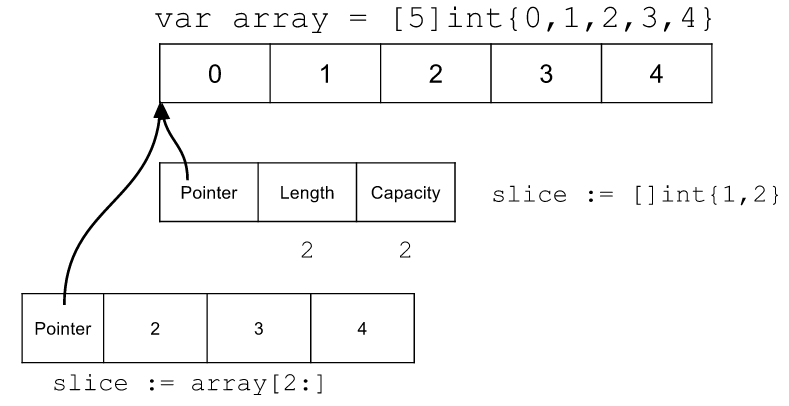
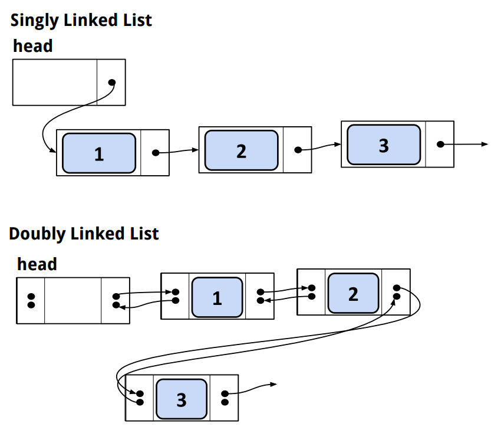

[*back to contents*](https://github.com/gyuho/learn#contents)
<br>

# Linked list

- [`container/list`, linked list](#containerlist-linked-list)
	- [doubly linked list implementation](#doubly-linked-list-implementation)
	- [singly linked list implementation](#singly-linked-list-implementation)

[↑ top](#linked-list)
<br><br><br><br>
<hr>


#### `container/list`, linked list

**Linked list** is similar to an **array** in that they both store the
collection of data in **sequence**. **Array** (or *slice*) is a list of items
that are **contiguously allocated in memory space**. An array allocates memory
for all items in one block of memory. **Linked list** is a *group of nodes*, each
of which is **connected** by **pointers**. A node should contain **_data_** and
**_reference (pointer)_** to its *next* or *previous* node. **A linked list
allocates memory for each node, separately in its own memory space.** A **_linked
list_** is useful when you do lots of *insertions* and *removals*:
**searching** can be *inefficient* because you need to iterate from beginning
whatever item you try to find.

<br>
**_Slice_** is like:



<br>
**_Linked lists_** are like:



<br>
Go [**`container/list`**](http://golang.org/pkg/container/list/)
implements the **doubly linked list**. To simplify its implementation, Go
`list` is implemented as if it were a *ring*. The **_root node (`Element`)_**
is both **_previous element of the first node_** and **_next element of the
last node_**, as [here](http://play.golang.org/p/NKzqyoYt47):

```go
package main

import (
	"container/list"
	"fmt"
)

func main() {
	func() {
		myList := list.New()
		myList.PushBack(1)
		myList.PushBack(2)
		myList.PushBack(3)
		for e := myList.Front(); e != nil; e = e.Next() {
			fmt.Print(e.Value, " ")
		}
		// 1 2 3

		fmt.Println()
		myList.InsertAfter(50, myList.PushFront(10))
		for e := myList.Front(); e != nil; e = e.Next() {
			fmt.Print(e.Value, " ")
		}
		// 10 50 1 2 3

		fmt.Println()
		myList.Remove(myList.Front())
		for e := myList.Front(); e != nil; e = e.Next() {
			fmt.Print(e.Value, " ")
		}
		// 50 1 2 3
	}()

	func() {
		myList := list.New()
		for i := 0; i < 10; i++ {
			myList.PushBack(i)
		}

		// when deleting, the list gets changed too
		// we need to declare next element outside
		var next *list.Element
		for elem := myList.Front(); elem != nil; elem = next {
			next = elem.Next()
			myList.Remove(myList.Front())
		}
		fmt.Println()
		fmt.Println(myList.Len()) // 0
	}()
}

```

<br>
In C++, we can use STL `list`:

```cpp
#include <iostream>
#include <list>
using namespace std;

int main()
{
	double myDs[] = {1.2, -5.3, 10.2, 1, -100.23};
	list<double> myList (myDs, myDs+5);

	cout << "myList contains: " << endl;
	for (list<double>::iterator it=myList.begin(); it!=myList.end(); ++it)
		cout << " " << *it;
	cout << endl;

	myList.front() = -100.55;

	cout << "myList contains: " << endl;
	for (list<double>::iterator it=myList.begin(); it!=myList.end(); ++it)
		cout << " " << *it;
	cout << endl;

	for (int i=0; i<=1000; ++i)
		myList.push_back(i);

	int sum(0);
	while (!myList.empty())
	{
		sum += myList.front();
		myList.pop_front();
	}

	cout << "total: " << sum << endl; 
}

/*
myList contains: 
 1.2 -5.3 10.2 1 -100.23
myList contains: 
 -100.55 -5.3 10.2 1 -100.23
total: 500307
*/

```

[↑ top](#linked-list)
<br><br><br><br>
<hr>


#### doubly linked list implementation

Go [**`container/list`**](http://golang.org/pkg/container/list/)
implements the **doubly linked list**, as [here](http://play.golang.org/p/MYkHhhVmaF):

```go
// http://golang.org/pkg/container/list
// package "container/list" is for a doubly-linked list
// https://code.google.com/p/go/source/browse/#hg%2Fsrc%2Fpkg%2Fcontainer%2Flist

// Copyright 2009 The Go Authors. All rights reserved.
// Use of this source code is governed by a BSD-style
// license that can be found in the LICENSE file.

// Package list implements a doubly linked list.
//
// To iterate over a list (where l is a *List):
//	for e := l.Front(); e != nil; e = e.Next() {
//		// do something with e.Value
//	}
//
package main

import "fmt"

type List struct {
	// when a function exits, all of its variables are popped off of the stack
	// if we want to update outside of this, we need pointer
	// use pointers to access memory on the heap
	// Heap variables are essentially global in scope
	root *Element
	len  int
}

// Element is an element of a linked list.
type Element struct {
	// Next and previous pointers in the doubly-linked list of elements.
	// To simplify the implementation, internally a list l is implemented
	// as a ring, such that &l.root is both the next element of the last
	// list element (l.Back()) and the previous element of the first list
	// element (l.Front()).
	next, prev *Element
	list       *List
	Value      int
}

func (l *List) insert(e, at *Element) *Element {
	n := at.next
	at.next = e
	e.prev = at
	e.next = n
	n.prev = e

	e.list = l
	l.len++
	return e
}

func (l *List) remove(e *Element) *Element {
	e.prev.next = e.next
	e.next.prev = e.prev

	e.next = nil
	e.prev = nil

	e.list = nil
	l.len--

	return e
}

// Next returns the next list element or nil.
func (e *Element) Next() *Element {
	if p := e.next; e.list != nil && p != e.list.root {
		return p
	}
	return nil
}

// Prev returns the previous list element or nil.
func (e *Element) Prev() *Element {
	if p := e.prev; e.list != nil && p != e.list.root {
		return p
	}
	return nil
}

// Init initializes or clears list l.
func (l *List) Init() *List {

	// references to data structures that must be initialized before use.
	//
	// never dereference a nil pointer
	// root will never be nil with this
	l.root = new(Element) // do not need this if 'root Element'

	l.root.next = l.root
	l.root.prev = l.root
	l.len = 0
	return l
}

func New() *List {
	return new(List).Init()
}

func (l *List) Len() int {
	return l.len
}

func (l *List) Front() *Element {
	if l.len == 0 {
		return nil
	}
	return l.root.next
}

func (l *List) Back() *Element {
	if l.len == 0 {
		return nil
	}
	return l.root.prev
}

func (l *List) lazyInit() {
	if l.root.next == nil {
		l.Init()
	}
}

func (l *List) insertValue(v int, at *Element) *Element {
	return l.insert(&Element{Value: v}, at)
}

func (l *List) InsertAfter(v int, mark *Element) *Element {
	if mark.list != l {
		return nil
	}
	return l.insertValue(v, mark)
}

func (l *List) Remove(e *Element) int {
	if e.list == l {
		l.remove(e)
	}
	return e.Value
}

func (l *List) PushFront(v int) *Element {
	l.lazyInit()
	// return l.insertValue(v, &l.root)
	return l.insertValue(v, l.root)
}

func (l *List) PushBack(v int) *Element {
	l.lazyInit()
	return l.insertValue(v, l.root.prev)
}

func main() {
	list1 := New()
	list1.PushBack(1)
	list1.PushBack(2)
	list1.PushBack(3)
	for e := list1.Front(); e != nil; e = e.Next() {
		fmt.Print(e.Value, " ")
	}
	// 1 2 3

	fmt.Println()
	list1.InsertAfter(50, list1.PushFront(10))
	for e := list1.Front(); e != nil; e = e.Next() {
		fmt.Print(e.Value, " ")
	}
	// 10 50 1 2 3

	fmt.Println()
	list1.Remove(list1.Front())
	for e := list1.Front(); e != nil; e = e.Next() {
		fmt.Print(e.Value, " ")
	}
	// 50 1 2 3

	list2 := New()
	for i := 0; i < 10; i++ {
		list2.PushBack(i)
	}

	// when deleting, the list gets changed too
	// we need to declare next element outside
	var next *Element
	for elem := list2.Front(); elem != nil; elem = next {
		next = elem.Next()
		list2.Remove(list2.Front())
	}

	fmt.Println()
	fmt.Println(list2.Len()) // 0
}

func (l *List) InsertBefore(v int, mark *Element) *Element {
	if mark.list != l {
		return nil
	}
	return l.insertValue(v, mark.prev)
}

func (l *List) MoveToFront(e *Element) {
	if e.list != l || l.root.next == e {
		return
	}
	l.insert(l.remove(e), l.root)
}

func (l *List) MoveToBack(e *Element) {
	if e.list != l || l.root.prev == e {
		return
	}
	l.insert(l.remove(e), l.root.prev)
}

func (l *List) MoveBefore(e, mark *Element) {
	if e.list != l || e == mark {
		return
	}
	l.insert(l.remove(e), mark)
}

func (l *List) PushBackList(other *List) {
	l.lazyInit()
	for i, e := other.Len(), other.Front(); i > 0; i, e = i-1, e.Next() {
		l.insertValue(e.Value, l.root.prev)
	}
}

func (l *List) PushFrontList(other *List) {
	l.lazyInit()
	for i, e := other.Len(), other.Front(); i > 0; i, e = i-1, e.Prev() {
		l.insertValue(e.Value, l.root)
	}
}
```

<br>
In C++, you would:

```cpp
#include <iostream>
using namespace std;
 
struct Node
{
	int value;
	Node *prev, *next;
	Node(int y)
	{
		value = y;
		next = prev = NULL;
	}
};
 
class LinkedList
{
	Node *head;
	Node *tail;

	public:
		LinkedList()
		{ 
			head = NULL;
			tail = NULL;
		}

		~LinkedList()
		{
			destroyList();
		}

		void pushFront(int x);
		void pushBack(int x);
		void printNodesForward();
		void printNodesReverse();
		void destroyList();
};

void LinkedList::pushFront(int x)
{
	Node *nd = new Node(x);
	if( head == NULL)
	{
		head = nd;
		tail = nd;
	}
	else
	{
		head->prev = nd;
		nd->next = head;
		head = nd;
	}
}

void LinkedList::pushBack(int x)
{
	Node *nd = new Node(x);
	if( tail == NULL)
	{
		head = nd;
		tail = nd;
	}
	else
	{
		tail->next = nd;
		nd->prev = tail;
		tail = nd;
	}
}
 
void LinkedList::printNodesForward()
{
	Node *temp = head;
	cout << "\nNodes in forward order:" << endl;
	while(temp != NULL)
	{
		cout << temp->value << "   " ;
		temp = temp->next;
	}
}

void LinkedList::printNodesReverse()
{
	Node *temp = tail;
	cout << "\nNodes in reverse order :" << endl;
	while(temp != NULL)
	{
		cout << temp->value << "   " ;
		temp = temp->prev;
	}
}

void LinkedList::destroyList()
{
	Node *T = tail;
	while(T != NULL)
	{
		Node *T2 = T;
		T = T->prev;
		delete T2;
	}
	head = NULL;
	tail = NULL;
}

int main()
{
		LinkedList *list = new LinkedList();
		//append nodes to front of the list
		for( int i = 1 ; i < 4 ; i++)
			list->pushFront(i);
 
		list->printNodesForward();
		list->printNodesReverse();
 
		//append nodes to back of the list
		for( int i = 1 ; i < 4 ; i++)
			list->pushBack(i+10);

		cout << endl << endl;
		list->printNodesForward();
		list->printNodesReverse();
 
		cout << endl << endl;
		delete list;
}
 
/*
Nodes in forward order:
3   2   1   
Nodes in reverse order :
1   2   3   


Nodes in forward order:
3   2   1   11   12   13   
Nodes in reverse order :
13   12   11   1   2   3 
*/

```

[↑ top](#linked-list)
<br><br><br><br>
<hr>


#### singly linked list implementation

Try [this](http://play.golang.org/p/g7Vjk-yAa-):

```go
package main

import "fmt"

type List struct {
	root *Element
	tail *Element
	len  int
}

type Element struct {
	next  *Element
	list  *List
	Value int
}

func (l *List) insert(e, at *Element) *Element {
	// add first time
	if l.len == 0 {

		l.root.next = e
		e.next = l.tail

	} else if at == l.tail {

		// push back
		e.next = l.tail

		// update the previous element of tail
		atPrev := l.root
		for p := l.Front(); p != at; p = p.Next() {
			atPrev = p
		}
		atPrev.next = e

	} else {

		// push front or between
		n := at.next
		at.next = e
		e.next = n

	}

	e.list = l
	l.len++
	return e
}

func (l *List) remove(e *Element) *Element {
	if e == l.root || e == l.tail {
		return nil
	}
	ePrev := l.root
	for p := l.Front(); p != e; p = p.Next() {
		ePrev = p
	}
	n := e.next
	ePrev.next = n
	e.next = nil
	e.list = nil
	l.len--
	return e
}

func (e *Element) Next() *Element {
	if p := e.next; e.list != nil && p != e.list.root {
		return p
	}
	return nil
}

func (l *List) Init() *List {
	l.root = new(Element)
	l.tail = new(Element)
	l.root.next = l.tail
	l.len = 0
	return l
}

func New() *List {
	return new(List).Init()
}

func (l *List) Len() int {
	return l.len
}

func (l *List) Front() *Element {
	if l.len == 0 {
		return nil
	}
	return l.root.next
}

func (l *List) insertValue(v int, at *Element) *Element {
	return l.insert(&Element{Value: v}, at)
}

func (l *List) InsertAfter(v int, mark *Element) *Element {
	if mark.list != l {
		return nil
	}
	return l.insertValue(v, mark)
}

func (l *List) PushFront(v int) *Element {
	return l.insertValue(v, l.root)
}

func (l *List) PushBack(v int) *Element {
	return l.insertValue(v, l.tail)
}

func (l *List) Remove(e *Element) int {
	if e.list == l {
		l.remove(e)
	}
	return e.Value
}

func main() {
	list1 := New()
	list1.PushBack(1)
	list1.PushBack(2)
	list1.PushBack(3)
	list1.PushFront(5)
	for e := list1.Front(); e != list1.tail; e = e.Next() {
		fmt.Print(e.Value, " ")
	}
	// 5 1 2 3

	fmt.Println()
	list1.InsertAfter(50, list1.PushFront(10))
	for e := list1.Front(); e != list1.tail; e = e.Next() {
		fmt.Print(e.Value, " ")
	}
	// 10 50 5 1 2 3

	fmt.Println()
	list1.Remove(list1.Front())
	for e := list1.Front(); e != list1.tail; e = e.Next() {
		fmt.Print(e.Value, " ")
	}
	// 50 5 1 2 3

	fmt.Println()
	list2 := reverseList(list1)
	for e := list2.Front(); e != list2.tail; e = e.Next() {
		fmt.Print(e.Value, " ")
	}
	// 3 2 1 5 50

	a := New()
	for i := 0; i < 10; i++ {
		a.PushBack(i)
	}
	var next *Element
	for elem := a.Front(); elem != a.tail; elem = next {
		next = elem.Next()
		a.Remove(a.Front())
	}

	fmt.Println()
	fmt.Println(a.Len()) // 0
}

func reverseList(l *List) *List {
	tempList := New()
	for e := l.Front(); e != l.tail; e = e.Next() {
		tempList.PushFront(e.Value)
	}
	return tempList
}
```

<br>
In C++, you would:

```cpp
#include <iostream>
using namespace std;

class LinkedList{
	struct Node {
		int value;
		Node *next;
	};

	public:
		// constructor
		LinkedList(){
			head = NULL;
		}

		void pushFront(int val){
			Node *nd = new Node();
			nd->value = val;
			nd->next = head;
			head = nd;
		}

		int popFront(){
			Node *nd = head;
			int rv = nd->value;

			head = head->next;
			delete nd;
			return rv;
		}

	private:
		Node *head;
};

int main() {
	LinkedList list;

	list.pushFront(1);
	list.pushFront(2);
	list.pushFront(3);

	cout << list.popFront() << endl; // 3
	cout << list.popFront() << endl; // 2
	cout << list.popFront() << endl; // 1
}

```

[↑ top](#linked-list)
<br><br><br><br>
<hr>
