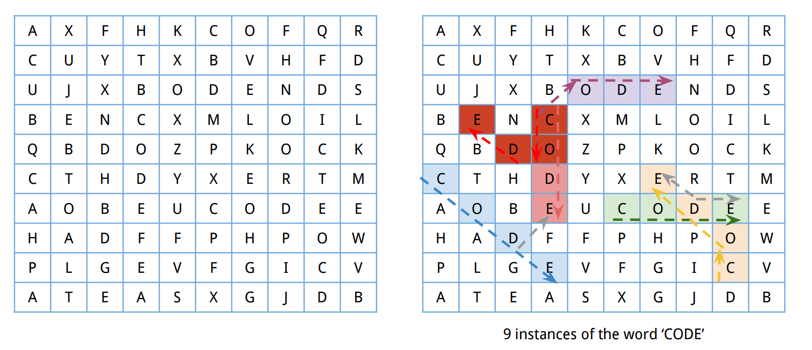

[*back to problems*](https://github.com/gyuho/learn/tree/master/doc/problems)
<br>

# Problem

**Word-search game.** Finds all instances of the word `CODE` in the board:



**Input:**

```go
// Go
var board [][]string = [][]string{
	{"A", "X", "F", "H", "K", "C", "O", "F", "Q", "R"},
	{"C", "U", "Y", "T", "X", "B", "V", "H", "F", "D"},
	{"U", "J", "X", "B", "O", "D", "E", "N", "D", "S"},
	{"B", "E", "N", "C", "X", "M", "L", "O", "I", "L"},
	{"Q", "B", "D", "O", "Z", "P", "K", "O", "C", "K"},
	{"C", "T", "H", "D", "Y", "X", "E", "R", "T", "M"},
	{"A", "O", "B", "E", "U", "C", "O", "D", "E", "E"},
	{"H", "A", "D", "F", "F", "P", "H", "P", "O", "W"},
	{"P", "L", "G", "E", "V", "F", "G", "I", "C", "V"},
	{"A", "T", "E", "A", "S", "X", "G", "J", "D", "B"},
}

```

```cpp
// C++
char[][] board = {
	{'A', 'X', 'F', 'H', 'K', 'C', 'O', 'F', 'Q', 'R'},
	{'C', 'U', 'Y', 'T', 'X', 'B', 'V', 'H', 'F', 'D'},
	{'U', 'J', 'X', 'B', 'O', 'D', 'E', 'N', 'D', 'S'},
	{'B', 'E', 'N', 'C', 'X', 'M', 'L', 'O', 'I', 'L'},
	{'Q', 'B', 'D', 'O', 'Z', 'P', 'K', 'O', 'C', 'K'},
	{'C', 'T', 'H', 'D', 'Y', 'X', 'E', 'R', 'T', 'M'},
	{'A', 'O', 'B', 'E', 'U', 'C', 'O', 'D', 'E', 'E'},
	{'H', 'A', 'D', 'F', 'F', 'P', 'H', 'P', 'O', 'W'},
	{'P', 'L', 'G', 'E', 'V', 'F', 'G', 'I', 'C', 'V'},
	{'A', 'T', 'E', 'A', 'S', 'X', 'G', 'J', 'D', 'B'},
};

```

<br>
**Output:** 6 

<br><br><br>
- [Reference](#reference)
- [Algorithm #1](#algorithm-1)
- [Solution #1, in Go](#solution-1-in-go)
- [Solution #1, in C++](#solution-1-in-c)

[↑ top](#problem)
<br><br><br><br>
<hr>


<br><br><br><br><br><br><br><br><br><br>
<br><br><br><br><br><br><br><br><br><br>
<br><br><br><br><br><br><br><br><br><br>

*Please do not at my soluition yet. Please try it by yourself first.*

<br><br><br><br><br><br><br><br><br><br>
<br><br><br><br><br><br><br><br><br><br>
<br><br><br><br><br><br><br><br><br><br>
<hr>


#### Reference

- [Module 2: Multidimensional Arrays](http://www.seas.gwu.edu/~drum/cs1112/lectures/module2/suppl/index.html)
- [Module 9: Recursion, Part II](http://www.seas.gwu.edu/~drum/cs1112/lectures/module9/module9.html)

[↑ top](#problem)
<br><br><br><br>
<hr>


#### Algorithm #1

**Use recursion for multiple related decisions.** This is like a maze:
*each position in board leads to 8 other choices*. You need to decide which
direction to move: *left*, *right*, *up*, *down*, or *diagonals*. It's
multiple related decisions, so it's natural to try *recursion*. I will try
brute-forcing with recursion at every single row and column. And later
see if we can do better.

<br>
**FIRST**. Specify the **base case** of *recursion*? End recursion when:

1. Have found all the previous letters (e.g. `C`, `O`, `D` for `CODE`), and 
   just found the last letter (`E` for `CODE`).
2. No more position to move. Out of array range, at the end of board.

<br>
**SECOND**. Decide what to pass around to *recursive* functions:

1. Target letter. This being empty means you do not want to
   proceed search anymore, therefore ending the recursion.
2. Position on board to search for the target letter.
   This tells which direction to move.
3. You want to store previously found instances (full letters),
   so not to overcount.

<br>
**THIRD**. Create a two dimensional array with values from the board.
Start with the *first letter as a target letter*, at the position
*(0, 0)* in a two dimensional array. And if it *finds the target letter*,
call *recursive* function *onto other directions*. Otherwise, keep moving from
*left-top to right-bottom* until it reaches the end *(N, N)*.

[↑ top](#problem)
<br><br><br><br>
<hr>


#### Solution #1, in Go

```go

```

[↑ top](#problem)
<br><br><br><br>
<hr>


#### Solution #1, in C++

```cpp

```

[↑ top](#problem)
<br><br><br><br>
<hr>
