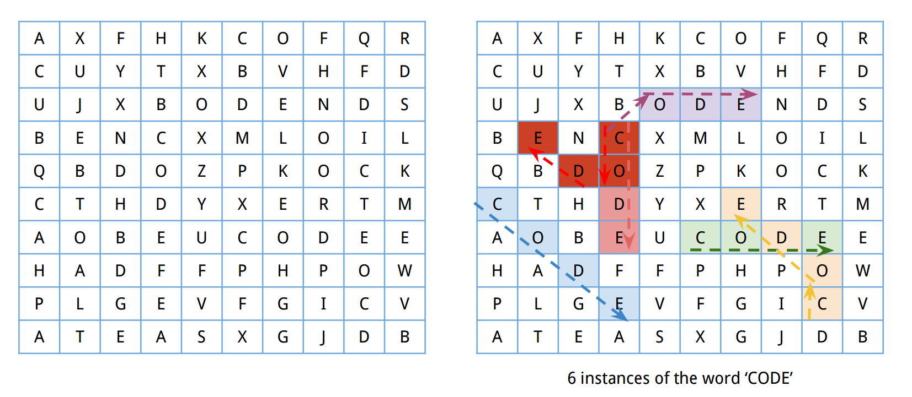

[*back to problems*](https://github.com/gyuho/learn/tree/master/doc/problems)
<br>

# Problem

**Word-search game.** Implement a program that finds all instances of the word
`code` in the board *below*:



[↑ top](#problem)
<br><br><br><br>
<hr>


<br><br><br><br><br><br><br><br><br><br>
<br><br><br><br><br><br><br><br><br><br>
<br><br><br><br><br><br><br><br><br><br>
<hr>

#### Solution in Go

```go

```

[↑ top](#problem)
<br><br><br><br>
<hr>


#### Solution in C++

```cpp

```

[↑ top](#problem)
<br><br><br><br>
<hr>


