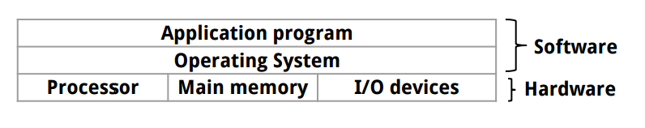
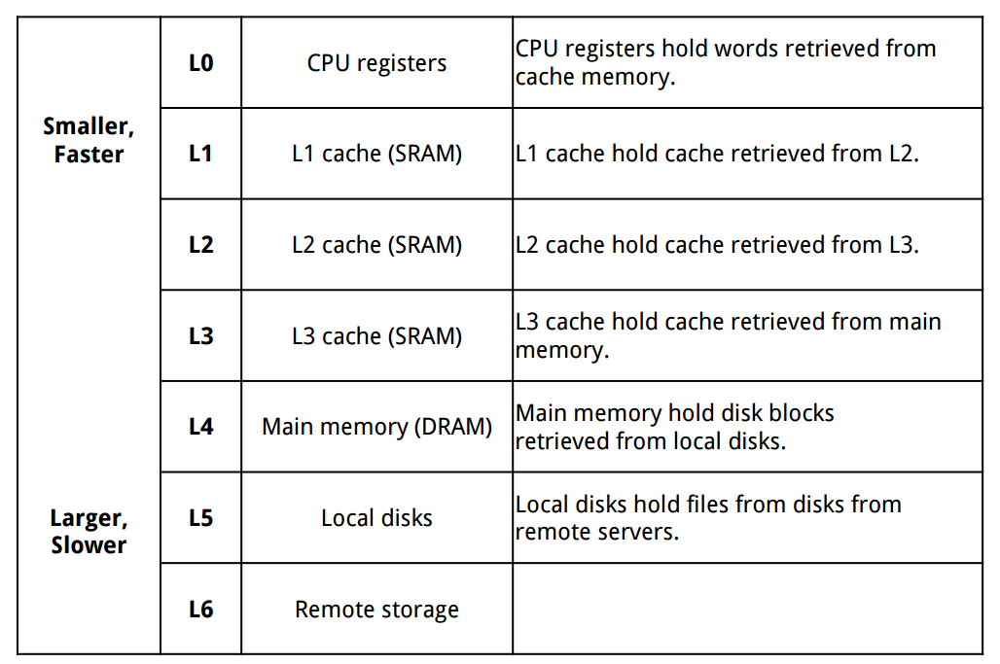

[*back to contents*](https://github.com/gyuho/learn#contents)
 

# Virtual memory

- [Reference](#reference)
- [Memory hierarchy](#memory-hierarchy)
- [Why virtual memory?](#why-virtual-memory)
- [Page cache](#page-cache)

[↑ top](#virtual-memory)
    

#### Reference

- [Virtual memory](https://en.wikipedia.org/wiki/Virtual_memory)
- [Computer systems: a programmer's perspective](http://csapp.cs.cmu.edu/)
- [MIT lecture: Computer System Architecture](http://ocw.mit.edu/courses/electrical-engineering-and-computer-science/6-823-computer-system-architecture-fall-2005/)
- [**Memory : Stack vs Heap**](http://gribblelab.org/CBootcamp/7_Memory_Stack_vs_Heap.html)
- [Varnish Architect Notes](https://www.varnish-cache.org/trac/wiki/ArchitectNotes)

[↑ top](#virtual-memory)
    

#### Computer system

Here's an example computer architecture in very high level:

- `CPU` is a central processing unit, *or processor*, that interprets and 
	executes the machine instructions stored in `main memory`. Processor has a small storage called `register` to provide the fastest way to access data.
- `Main memory` is a temporary storage both for executing programs and 
	data during execution.
- `Disk` stores data. It can contain more data than memory, but is much
	slower to read from disks.

[↑ top](#virtual-memory)
    

#### Memory hierarchy

- Computer's total system memory is from `RAM` (physical memory)
	and `virtual memory`.
- `Main memory` or **Random-access memory** (`RAM`) is a form of computer
	data storage that can be accessed randomly when you know the
	intersecting row and column at cell. It consists of collection of `DRAM`.
- [`DRAM` (Dynamic Random Access Memory)](https://en.wikipedia.org/wiki/Dynamic_random-access_memory) is used for `main memory`. Data get lost when the power is off.
- [`SRAM` (Static Random Access Memory)](https://en.wikipedia.org/wiki/Static_random-access_memory) is faster and less volatile than `DRAM`
	but more expensive. It's typically used for **`CPU` cache**.

[↑ top](#virtual-memory)
    

#### Why virtual memory?

For a program to run, code and its data must be accessible in main memory, but
the memory might not be large enough to handle the entire process. Having a
very large memory to fit them all is very costly. This is where `virtual
memory` comes in. It separates *logical memory required by process* from
*physical memory of processor*. And it provides each program with its own
complete and independent memory.

> Virtual memory is a component of most operating systems, such as MAC OS,
> Windows and Linux. Virtual memory has a very important role in the operating
> system. It allows us to run more applications on the system than we have
> enough physical memory to support. Virtual memory is simulated memory that is
> written to a file on the hard drive. That file is often called page file or
> swap file. It's used by operating systems to simulate physical RAM by using
> hard disk space. To understand how virtual memory works we have to go back in
> time, before virtual memory even exited. In the days of Windows version 1 or
> 2, we actually couldn't run many applications if we didn't have enough
> physical RAM installed. As we know, the system itself is using a portion of
> RAM. If we run more applications, each application will also get its own
> portion of RAM. If we run too many applications, at one point we will run out
> of RAM. At that point we won't be able to open any additional application.
> Back in those days we had to live with that. If we don't have enough memory,
> we can't run applications.
>
> Everything changed with the release of Windows 3.0 and the 8386 processor.
> With these two together we could use virtual memory. With virtual memory we
> still use our physically installed RAM, but we can also map RAM addresses to
> the hard drive. To do that, a portion of the hard drive is reserved by the
> system. That portion can be either a file or a separate partition. In the
> case of Windows it is a file called pagefile.sys. Under Linux a separate
> partition is used for memory. When the system needs more memory it maps some
> of it's memory addresses out to the hard disk drive. That means that we can
> run more applications than we have RAM installed. As far as the CPU is
> concerned there is enough memory to accommodate all applications. That extra
> memory doesn't actually exist in RAM. It's the storage space on the hard
> drive. 
>
> [*What is Virtual
> Memory*](http://www.utilizewindows.com/pc-fundamentals/optimization/345-what-is-virtual-memory-and-why-do-we-need-it)

`Virtual memory` is an abstraction layer of `main memory` for `process`.
Each process can have an uniform way of looking at the memory, which is
known as `virtual address space`. Each process can have its own `virtual
address space` for memory management, and its memory addresses. `Virtual
memory` with `virtual address space` is useful for multiple programs running
at the same time with shared resources, because each data object can get
multiple **independent** addresses. `Virtual memory` keeps memory isolated
from other processes and prevents data corruption from each other. And size
of `virtual memory` is limited by the size of pointers on a given operating
system.

 
Another great answer [here](http://stackoverflow.com/a/19349645/4211028):

> If you have a **compiled binary**, **each function has a fixed address**
> in memory and the assembly instructions to call functions have that address
> hardcoded. If **virtual memory didn't exist**, two programs **couldn't be
> loaded into memory** and **run at the same time**, because they'd potentially
> **need to have different functions at the same physical address**.
>
> If two or more programs are **running at the same time** (or are being
> context-switched between) and **use direct addresses**, a **memory error in
> one program** (for example, reading a bad pointer) could **destroy memory
> being used by the other process**, taking down multiple programs due to a
> single crash.
>
> On a similar note, there's a security issue where a process could read
> sensitive data in another program by guessing what physical address it would
> be located at and just reading it directly.
>
> If you **try to combat the two above issues by paging out all the memory
> for one process when switching to a second process**, you incur a **massive
> performance hit because you might have to page out all of memory**.
>
> Depending on the hardware, some memory addresses might be reserved for
> physical devices (for example, video RAM, external devices, etc.) If programs
> are compiled without knowing that those addresses are significant, they might
> physically break plugged-in devices by reading and writing to their memory.
> Worse, if that memory is read-only or write-only, the program might write
> bits to an address expecting them to stay there and then read back different
> values.

 
> Because people began running multiple programs on a single computer
> **simultaneously**, problems started to arise with **programs interfering
> with each other**. The solution to this is to **present each program with
> its own complete memory**. Virtual memory provides this. **Virtual memory**
> provides a **mapping** that the processor and operating system control that
> **converts virtual address that are not unique, but are given out to each
> program into unique physical addresses that are used by the memory system**.
> This *translation happens by dividing memory into pages*. **A page table that
> exists in memory contains a translation from virtual page numbers to physical
> page numbers**. Since this page table exists in memory and memory performance
> is a problem, a higher performance means of finding these translations is
> needed. A **translation look-aside buffer (TLB) behaves as a cache for this
> page table**. The processor first looks in the TLB for a translation. If a 
> translation is available it uses that and proceeds to look in the cache.
> If a translation is not available, the processor signals the operating system
> to look in the page table for the translation. Once the translation is found,
> the operating system updates the TLB so that the next time the same
> translation is requested it will be found in the TLB and be a fast
> translation.
>
> [*Virtual
> Memory*](http://eces.colorado.edu/~coxaj/software/memsim/memsim.html)

[↑ top](#virtual-memory)
    

#### Page cache

> Varnish stores data in **virtual memory** and leaves the task of deciding
> what is stored in memory and what gets **paged out** to disk to the
> operating system. This helps avoid the situation where the operating system
> starts caching data while it is moved to disk by the application.
> 
> [*Varnish*](https://en.wikipedia.org/wiki/Varnish_(software)) *by Wikipedia*

 
> A *CPU cache* is a **cache** used by the central processing unit (CPU) of a
> computer to **reduce the average time to access data from the main memory**.
> The cache is a smaller, faster memory which stores copies of the data from
> frequently used main memory locations. Most CPUs have different independent
> caches, including instruction and data caches, where the data cache is
> usually organized as a hierarchy of more cache levels (L1, L2, etc.)
> 
> [*CPU cache*](https://en.wikipedia.org/wiki/CPU_cache) *by Wikipedia*

 
> A *translation lookaside buffer (TLB)* is a **cache** that memory management
> hardware uses to **improve virtual address translation speed**. The majority
> of desktop, laptop, and server processors includes one or more TLBs in the
> memory management hardware, and it is nearly always present in any hardware
> that utilizes paged or segmented virtual memory.
>
> [*Translation lookaside
> buffer*](https://en.wikipedia.org/wiki/Translation_lookaside_buffer) *by
> Wikipedia*

 
> A **page**, memory page, or virtual page is a **fixed-length contiguous
> block of virtual memory**, described by a **single entry in the page table**.
> It is the **smallest unit of data for memory management in a virtual memory**
> operating system. 
>
> [*Page*](https://en.wikipedia.org/wiki/Page_(computer_memory)) *by Wikipedia*

 
> In computer operating systems, **paging** is one of the memory management
> schemes by which a **computer stores and retrieves data from the secondary
> storage for use in main memory**.
>
> [*Paging*](https://en.wikipedia.org/wiki/Paging) *by Wikipedia*

 
> A **page table** is the data structure used by a virtual memory system in a
> computer operating system to **store the mapping between virtual addresses
> and physical addresses**. Virtual addresses are used by the accessing process,
> while physical addresses are used by the hardware or more specifically to the
> RAM.
>
> [*Page table*](https://en.wikipedia.org/wiki/Page_table) *by Wikipedia*

 
> In computing, a **page cache**, sometimes also called **disk cache**, is a
> transparent **cache for the pages** originating **from a secondary storage**
> device such as a hard disk drive (HDD). The operating system keeps a **page
> cache in otherwise unused portions of the main memory (RAM)**, resulting in
> **quicker access to the contents of cached pages** and overall performance
> improvements. A page cache is implemented in kernels with the paging memory
> management, and is mostly transparent to applications.
>
> Usually, **all physical memory not directly allocated to applications** is
> used by the operating system for the **page cache**.
>
> [*Page cache*](https://en.wikipedia.org/wiki/Page_cache) *by Wikipedia*

 
> The **page cache caches pages of files to optimize file I/O**.
>
> The VM subsystem now drives I/O and it does so out of the page cache. If
> cached data has both a file and a block representation—as most data does—the
> buffer cache will simply point into the page cache; thus only one instance of
> the data is cached in memory. The page cache is what you picture when you
> think of a **disk cache**: It **caches file data from a disk to make
> subsequent I/O faster**.
> 
> [*Page
> cache*](https://www.quora.com/What-is-the-major-difference-between-the-buffer-cache-and-the-page-cache) *by Robert Love*

 
> A **memory-mapped file** is a **segment of virtual memory** which has been
> assigned a direct byte-for-byte correlation with **some portion of a file**
> or file-like resource. This resource is **typically a file that is physically
> present on-disk**, but can also be a device, shared memory object, or **other
> resource that the operating system can reference through a file descriptor**.
> Once present, this correlation between the file and the memory space permits
> applications to **treat the mapped portion as if it were primary memory**.
>
> The major reason to choose memory mapped file I/O is performance.
> Nevertheless, there can be tradeoffs. The standard I/O approach is costly due
> to system call overhead and memory copying. The memory mapped approach has
> its cost in minor page faults - when a block of data is loaded in page cache,
> but is not yet mapped into the process's virtual memory space. In some
> circumstances, memory mapped file I/O can be substantially slower than
> standard file I/O.
>
> Perhaps the most common use for a memory-mapped file is the process loader in
> most modern operating systems (including Microsoft Windows and Unix-like
> systems.) When a process is started, the operating system uses a memory
> mapped file to bring the executable file, along with any loadable modules,
> into memory for execution. Most memory-mapping systems use a technique called
> demand paging, where the file is loaded into physical memory in subsets (one
> page each), and only when that page is actually referenced. In the
> specific case of executable files, this permits the OS to selectively load
> only those portions of a process image that actually need to execute.
>
> [*Memory-mapped file*](https://en.wikipedia.org/wiki/Memory-mapped_file) *by
> Wikipedia*

 
> In computing, `mmap(2)` is a POSIX-compliant Unix system call that maps files
> or devices into memory. It is a method of memory-mapped file I/O. It
> naturally implements demand paging, because file contents are not read from
> disk initially and do not use physical RAM at all. The actual reads from disk
> are performed in a "lazy" manner, after a specific location is accessed.
> After the memory is no longer needed it is important to `munmap(2)` the
> pointers to it. Protection information can be managed using `mprotect(2)` and
> special treatment can be enforced using `madvise(2)`.
>
> [*mmap*](https://en.wikipedia.org/wiki/Mmap) *by Wikipedia*

[↑ top](#virtual-memory)
    

