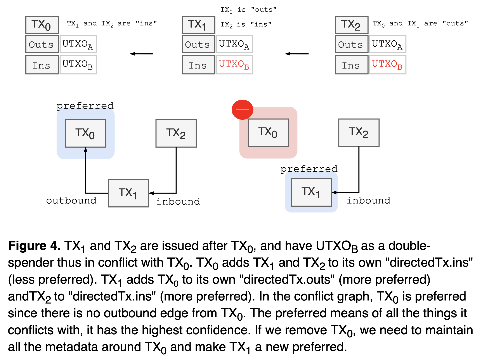
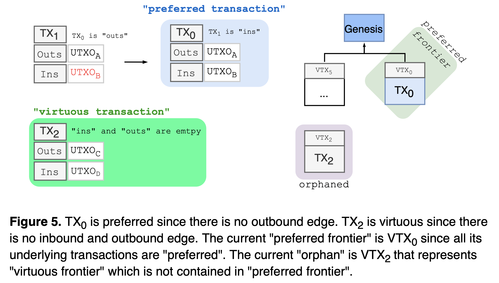
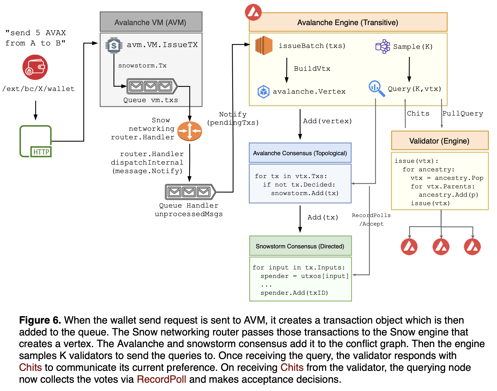
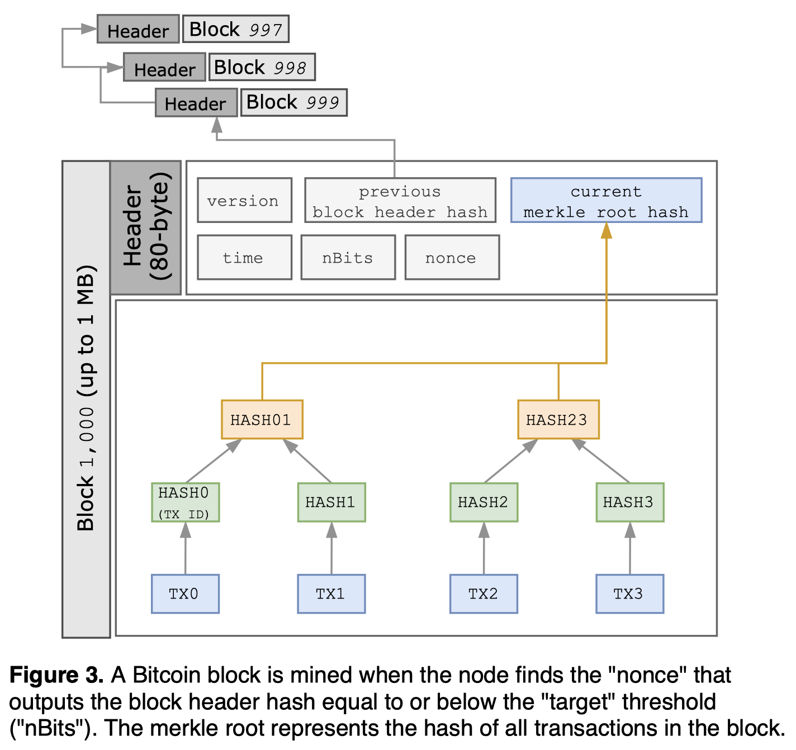

# Nakamoto(Bitcoin) vs. Snow(Avalanche): consensus

🚧❄️☃️❄️🚧 *Actively working on it...* 🚧❄️☃️❄️🚧

*Last update: December 6, 2021*

*Previous: [Paxos(etcd) vs. Nakamoto(Bitcoin): consensus](./paxos-etcd-vs-nakamoto-bitcoin-consensus.md)*

*Next: [etcd vs. Avalanche: storage](./etcd-vs-avalanche-storage.md)*

- [What is consensus?](#what-is-consensus)
- [What is Nakamoto consensus?](#what-is-nakamoto-consensus)
- [What is Snow consensus?](#what-is-snow-consensus)
- [Unspent transaction output (UTXO)](#unspent-transaction-output-utxo)
- [Proof-of-Stake (PoS)](#proof-of-stake-pos)
- [Agreement in Nakamoto](#agreement-in-nakamoto)
- [Agreement in Snow](#agreement-in-snow)
  - [Key guarantees](#key-guarantees)
  - [Snow family protocols](#snow-family-protocols)
    - [Slush: introducing metastability](#slush-introducing-metastability)
    - [Slush → Snowflake: BFT](#slush--snowflake-bft)
    - [Snowflake → Snowball: adding confidence](#snowflake--snowball-adding-confidence)
    - [Snowball → Avalanche](#snowball--avalanche)
    - [Avalanche → Snowman](#avalanche--snowman)
    - [Frosty](#frosty)
  - [Avalanche platform](#avalanche-platform)
  - [How does X/P/C-chain actually work?](#how-does-xpc-chain-actually-work)
  - [Who initiates the block (data)?](#who-initiates-the-block-data)
    - [Peer/node discovery](#peernode-discovery)
    - [Message relay](#message-relay)
  - [What's in the block (data)?](#whats-in-the-block-data)
    - [Unit of consensus](#unit-of-consensus)
    - [Data structure](#data-structure)
    - [Payload and data limit](#payload-and-data-limit)
  - [How to resolve the block (data) conflicts?](#how-to-resolve-the-block-data-conflicts)
    - [Definition of conflict](#definition-of-conflict)
    - [Definition of longest chain](#definition-of-longest-chain)
    - [Choice between conflicting chains](#choice-between-conflicting-chains)
  - [How to distribute the block (data)?](#how-to-distribute-the-block-data)
    - [Build consensus](#build-consensus)
    - [Information propagation speed and finality](#information-propagation-speed-and-finality)
- [Summary](#summary)
- [Reference](#reference)

### What is consensus?

Applications may crash, [server hardwares fail](https://conferences.sigcomm.org/sigcomm/2011/papers/sigcomm/p350.pdf), natural disasters can take out data centers in a region. To limit the impact of such occasional but inevitable failures, the system must develop the redundancy for the service. This strategy often entails geographically distributing a system, which requires a consistent view of the system state. The distributed consensus enables this group of processes to reach an agreement on a value in the face of asynchronous, unreliable networks: critical configuration data, leader election, service/member discovery, distributed locking, etc..

> Assume a collection of processes that can propose values. A consensus algorithm ensures that a single one among the proposed values is chosen.
>
> *Leslie Lamport, [Paxos Made Simple (2001)](https://lamport.azurewebsites.net/pubs/paxos-simple.pdf)*

### What is Nakamoto consensus?

Introduced by *Satoshi Nakamoto, [Bitcoin: A Peer-to-Peer Electronic Cash System (2008)](https://bitcoin.org/bitcoin.pdf)*, the Nakamoto algorithm solves the agreement problem in the face of Byzantine faults, where malicious nodes may pass incorrect messages.

Nakamoto consensus powers [Bitcoin](https://bitcoin.org) to achieve a distributed consensus on the chain without relying on any trusted third party. Bitcoin is a permissionless Blockchain, allowing anyone to create blocks through transactions among participating nodes. The chain state and transaction logs are transparent and accessible to any anonymous participant. Bitcoin being public introduces different kinds of attacking vectors, which is a key to understanding its consensus mechanism. The focus is on the byzantine fault tolerance, [sybil attack](https://www.microsoft.com/en-us/research/wp-content/uploads/2002/01/IPTPS2002.pdf) protection, and DoS (Denial of Service) resistance.

### What is Snow consensus?

Introduced by *Team Rocket, [Scalable and Probabilistic Leaderless BFT Consensus through Metastability (2020)](https://files.avalabs.org/papers/consensus.pdf)*, the Snow algorithm similarly solves the agreement problem in the face of Byzantine nodes. Snow consensus powers [Avalanche](https://avax.network) to achieve a distributed consensus on the chain without relying on any trusted third party. Unlike Nakamoto that relies on Proof-of-Work (PoW) to prevent sybil attack and also to build agreement among participants, Snow relies on Proof-of-Stake (PoS), thus green, quiescent, and efficient.

### Unspent transaction output (UTXO)

Both Bitcoin and Avalanche use the [unspent transaction output (UTXO) model](https://en.wikipedia.org/wiki/Unspent_transaction_output) to record the state of individual coin transfers between wallets (much like physical coins), instead of tracking the balance of each account (e.g., Ethereum). A UTXO represents an output of a transaction that has not been spent and thus can be used as an input to a new transaction -- only the unspent output can be used for the next transaction to prevent double-spending. Each UTXO is a chain of ownership where the current owner (sender) signs the transaction that transfers the UTXO ownership to the public key of the new owner (receiver).

The total UTXO sets in a blockchain represent the set that every transaction consumes elements from and creates new ones to, which represents the total supply of the currency. When a transaction occurs, the transaction input (e.g., send 2.5 BTC from A to B) is to be destroyed from the UTXO set, and the respective output (e.g., receive 2.5 BTC from A to B) creates a new UTXO to the UTXO set. Such UTXO model enables client-side aggregation, reducing the computation requirements in the network, making it easier to parallelize transactions.

### Proof-of-Stake (PoS)

Proof-of-Work (PoW) requires miners to consume electricity to compute the desired hash. The increasing hash difficulty leads to more energy consumption and demands more powerful mining rigs. Such substantial cost is deterrant to decentralizaton of participants. According to [hashrate distribution](https://blockchain.info/pools) (as of November 2021), only four Bitcoin mining pools control 50% of hashrate. Apart from this, PoW generally suffers from a low throughput and other scalability issues.

Unlike PoW, Proof-of-Stake (PoS) participant is only required to own and lock a certain amount of the corresponding currency, referred to as "stake". The stake acts as a guarantee that the holder will behave as per the protocol rules in the block creation process. PoS is more energy efficient as there is no need to solve a compute-intensive cryptographic puzzle, thus less susceptible to the centralization of mining pools.

Unlike PoW that only selects the node that finds the desired hash, PoS can select any stakeholder for block creation, as per the protocol rules.

### Agreement in Nakamoto

The unit of Bitcoin consensus is a block of multiple transactions. Each transaction (e.g., send 1 BTC to a friend) is signed by the current wallet's private key with the signature to provide the mathematical proof and thus protect against malicious actors. Once the signatures are validated, the miner combines those multiple transactions into one single unit of consensus, rather than initiating a new consensus for each transaction. Then the node starts the mining process to extend the chain by enumerating the "nonces" until a hash less than or equal to the "target" value is found. Such process is referred to as mining or Proof-of-Work (PoW), as it requires substantial amount of computing work. When the proper "nonce" is found, the miner is rewarded with a new Bitcoin for its expended CPU time and electricity (i.e., [coinbase transaction](https://en.bitcoin.it/wiki/Coinbase)). Then the node broadcasts the newly mined block to its peers, subsequently with each peer forwarding the block to every one of its neighbors eventually flooding the whole network (gossip).

### Agreement in Snow

By construction, a Bitcoin node is always active, and the network consumes 197.47 TWh per year (estimated as of November 2021), comparable to the power consumption of Thailand (see [Bitcoin energy consumption](https://digiconomist.net/bitcoin-energy-consumption) and [CIA world factbook](https://www.cia.gov/the-world-factbook/countries/thailand/#energy)). The node builds the block template whether its mempool has any transaction or not. The miner runs through different "nonce" values until the resulting hash is below the current "target". That is, the Nakamoto protocol requires constant participation of miners even when there is no decision to be made. Unlike Nakamoto, Snow protocol is quiescent when there is no decision to be made. Similar to Nakamoto, Snow protocol trades off a determinstic safety guarantee for a probabilistic one. The key difference is the use of PoS and sub-sample voting mechanism, which makes Avalanche more scalable.

The protocol is best illustrated with this [2-minute video](https://youtu.be/Sfb8G54AM_4) by [Emin Gün Sirer](https://twitter.com/el33th4xor).

<iframe width="560" height="315" src="https://www.youtube.com/embed/Sfb8G54AM_4" title="YouTube video player" frameborder="0" allow="accelerometer; autoplay; clipboard-write; encrypted-media; gyroscope; picture-in-picture" allowfullscreen></iframe>

To develop the initial intuition about the protocol, let's imagine a room full of people trying to agree on what to drink: "coffee" or "wine". Some prefer "coffee" at first, while others choosing "wine". The goal is to build consensus on the single value -- one kind of drink. Each participant starts out with no preference (uncolored state) and asks a random subset of its neighbors in the room for their drink preference (e.g., ask only 10 out of 1,000 people). The rule is each person adopts the preference of the majority (defined as \\(≥ α\\) or quorum) -- "looks like more people are leaning toward coffee, so I prefer coffee now." When everyone repeats the same process, more and more people converge onto the same preference. After enough rounds, the protocol reaches agreement on the single value that everyone prefers. The "preference" in the protocol represents the binary decision between two colors, although the protocol can be generalized to support multi-value consensus.

#### Key guarantees

Asynchronous network assumes each process operates at arbitrary speeds and may take arbitrarily long to deliver messages. [Impossibility of Distributed Consensus with One Faulty Process (1985)](https://groups.csail.mit.edu/tds/papers/Lynch/jacm85.pdf) proved that in such "asynchronous" network, even one faulty process makes it impossible for remote processes to reach agreement. In other words, for any consensus protocol, there exists a path of non-termination (against liveness).

> No completely asynchronous consensus protocol can tolerate even a single unannounced process death. We do not consider Byzantine failures, and we assume that the message system is reliable -- it delivers all messages correctly and exactly once. Nevertheless, even with these assumptions, the stopping of a single process at an inopportune time can cause any distributed commit protocol to fail to reach agreement. Thus, this important problem has no robust solution without further assumptions about the computing environment or still greater restrictions on the kind of failures to be tolerated!
>
> Crucial to our proof is that processing is completely asynchronous; that is, we make no assumptions about the relative speeds of processes or about the delay time in delivering a message. We also assume that processes do not have access to synchronized clocks, so algorithms based on time-outs, for example, cannot be used. Finally, we do not postulate the ability to detect the death of a process, so it is impossible for one process to tell whether another has died (stopped entirely) or is just running very slowly.
>
> *Michael Fischer, Nancy Lynch and Michael Paterson, [Impossibility of Distributed Consensus with One Faulty Process (1985)](https://groups.csail.mit.edu/tds/papers/Lynch/jacm85.pdf)*

Agreement in consensus is a safety property, and termination is a liveness property where correct (non-faulty) processes can eventually produce a value thus making progress. In practice, one can weaken some problems to achieve both safety (agreement) and liveness (termination), as follows:

- **We can assume synchrony.** The protocol can assume a synchronous network with a strict upper bound for message delays -- see [The Byzantine Generals Problem by Lamport (1981)](https://lamport.azurewebsites.net/pubs/byz.pdf). Paxos/Raft assumes synchrony by implementing timeouts and retries for building consensus, thus achieving termination (liveness) guarantees.
- **We can use probabilistic termination.** To work around the impossibility of deterministic termination, the protocol can opt for a probabilistic guarantee that some value is correct (e.g., Nakamoto consensus). Thereby the path of non-termination (infinite undecision) can have an exponentially small probability.

Paxos operates in a fully asynchronous setting but does not suffer such safety and livenss issues, as the proposal is only made to a known set of correct participants. However, Snow protocol that operates in a permissionless setting, is susceptible to adversary that may not transmit messages and being stuck waiting for the response. To ensure liveness, a node implements timeouts for the wait and probabilistic termination. Snow protocol satisfies consistency given bounded network delays, thus guaranteeing the liveness. Likewise, Nakamoto consensus satisfies consistency as its PoW difficulty depends on the maximum network delay -- see [Analysis of the Blockchain Protocol in Asynchronous Networks (2016)](https://eprint.iacr.org/2016/454.pdf).

The Snow protocol defines the following key guarantees:

- **P1. Safety (agreement).** Two correct nodes may make conflicting decisions on a transaction but with negligible probability \\(≤ ε\\).
- **P2. Livenss (termination, upper bound).** The decision is made with a strictly positive probability within \\(t_{max}\\) rounds, where \\(n\\) is the total number of participants and \\(O(log n) < t_{max} < ∞\\).
- **P3. Livenss (termination, strong).** If \\(f ≤ O(\sqrt{n})\\) where \\(n\\) is the total number of participants and \\(f\\) is the number of adversary nodes, the decision is made with high probability \\(≥ 1 - ε\\) within \\(O(log n)\\) rounds.

#### Snow family protocols

Snow is a family of binary BFT protocols based on a non-BFT protocol *Slush*, which incrementally builds up to *Snowflake* and *Snowball* BFT protocols in the Snow family.


##### Slush: introducing metastability

Slush is the foundation of Snow family consensus and introduces metastability in decision making process. Slush is a single-decree (choosing a single value) consensus protocol and is not tolerant against Byzantine faults (non-BFT), but can be extended to following BFT protocols (Snowflake and Snowball).

The goal is the nodes agree on the single value -- binary decison on the color. A Slush node starts as an uncolored state. When it receives a transaction from a client (e.g., wallet), the uncolored node changes its own color as in the transaction and initiates a query to its neighbors. The node only queries a sub-sampled set of peers -- the network sample size \\(k\\) is uniformly at random, and can be parameterized (via [`avalanchego --snow-sample-size`](https://github.com/ava-labs/avalanchego/blob/v1.7.1/config/config.go#L118)). Upon receiving the query, an uncolored node adopts the same color as the query sender, responds back with the color, and then initiates its own query to its neighbors. The already colored node simply responds with its current color. Once the querying node collects \\(k\\) responses, the node calculates the color ratio to check against the threshold and decide on the agreement. Let's define alpha \\(α\\) to be the threshold, sufficiently large fraction of the sample (quorum), where \\(α > \lfloor k/2 \rfloor\\) and which can be parameterized by the protocol (via [`avalanchego --snow-quorum-size`](https://github.com/ava-labs/avalanchego/blob/v1.7.1/config/config.go#L119)). If the ratio is \\(≥ α\\) for the different color than the querying node, the node flips the color, and initiates the subsequent rounds of queries with a different set of samples (up to \\(m\\) rounds). Each successful query that yields \\(≥ α\\) responses will update the color of the node. Then the node decides the current color at round \\(m\\) selecting the tip.

```python
def respond_to_query(v, new_col):
    # ⊥ is uncolored
    # local node own color is none
    if cur_col == ⊥:
        # upon receiving the query,
        # the uncolored node adopts
        # the same color as in transaction
        # or as the query sender
        cur_col = new_col
    respond(v, cur_col)

def slush_loop(u, col_init in {R, B, ⊥}):
    # initialize the color
    cur_col = col_init

    # repeated sampling and queries for m rounds
    for r in {1...m}:
        # random sample k peers out of N
        set_k = random_sample(u, k/N)

        # for each peer, query/count the color ratio
        # map from color to the ratio
        count = {}
        for vdr in set_k:
            count.update(query(vdr, cur_col))

        for c in {R, B}:
            # every successful query that yields ≥α responses
            # updates the color of the node
            if count[c] >= α:
                cur_col = c
                break

    # the node decides color at time m
    accept_and_decide(cur_col)
```

> *Then what is "metastability"?*

[Metastability](https://en.wikipedia.org/wiki/Metastability) is a condition of a system that spontaneously leaves a state of higher energy for the least energetic state after a sequence of transitions. Metastability is a precarious state that can be easily disturbed. For example, bowling pins are metastable that wobbles for a moment before completely tipped over. The snow slide (also called [avalanche](https://en.wikipedia.org/wiki/Avalanche)) shows similar metastability: the large piles of snow on the steep slope stay still in dry conditions (low energy), but the entire mountainside of snow may suddenly slide in presence of a skier or a loud noise (high energy). The minor disturbance can cause the metastable system to fall to a state of lower energy.

Similarly, for each Slush round, the protocol converts the bivalent state (e.g., 50/50 color split) into a state of full imbalance (e.g., all nodes are colored identically if \\(m\\) is high enough) -- "escape the metastable state". In other words, the sequence of random sampling perturbs the conflicting states among the nodes, causing one to gain more edge over time in order to amplify the imbalance.

##### Slush → Snowflake: BFT

Even when honest Slush nodes develop the preference for one color, an adversary node can still attempt to flip the preference, therefore halting the decision process in the network. This is where Snowflake comes in, the first BFT protocol in Snow family. Snowflake is Byzantine fault tolerant, while Slush is not.

Snowflake augments Slush with a counter that tracks the "conviction" of the local node for its current color. The conviction counter increments for each successful query that has sampled \\(k\\) out of \\(N\\) nodes and resulted in \\(≥ α\\) responses for the same color as the querying node, and resets otherwise. That is, the conviction count represents how many consecutive samples of the network from the node have all yielded the same color as the querying node. And the node accepts and decides the current color when its conviction count reaches the threshold \\(β\\).

The alpha \\(α\\) represents a sufficiently large portion of the participants as in Slush -- quorum. And let's define the beta \\(β\\) to be another security threshold for the conviction counter -- decision threshold. \\(α\\) and \\(β\\) are safety threshold. As the protocol increases \\(α\\) and \\(β\\), the safety increases but with decreased liveness.

```python
def respond_to_query(v, new_col):
    # ⊥ is uncolored
    # local node own color is none
    if cur_col == ⊥:
        # upon receiving the query,
        # the uncolored node adopts
        # the same color as in transaction
        # or as the query sender
        cur_col = new_col
    respond(v, cur_col)

def snowflake_loop(u, col_init in {R, B, ⊥}):
    # initialize the color
    cur_col = col_init

    # initialize the conviction count
    # represents how many consecutive samples
    # yield the same color
    # "consecutive successes"
    conviction = 0

    # repeated sampling and queries
    # until the color is decided
    decided = False
    while not decided:
        # random sample k peers out of N
        set_k = random_sample(u, k/N)

        # for each peer, query/count the color ratio
        # map from color to the ratio
        count = {}
        for vdr in set_k:
            count.update(query(vdr, cur_col))

        # only increment conviction counter
        # iff queries yield ≥ α
        # for the same color as node
        quorum_reached = False
        for c in {R, B}:
            # every successful query that yields ≥α responses
            # updates the color of the node
            if count[c] >= α:
                # found a color of sufficiently large ratio
                quorum_reached = True

                # only increment counter
                # if it were the same color as node
                if c != cur_col:
                    cur_col = c
                    conviction = 1
                else:
                    # same color as node, thus increment
                    conviction++

                # meets the security threshold β
                # threshold for the conviction counter
                if conviction >= β:
                    accept_and_decide(c)
                    decided = True

        # no color fraction is sufficiently large
        # thus undecided
        if not quorum_reached:
            conviction = 0
```

> *How is Snowflake "BFT"?*

The protocol iteratively chooses a small sample to query the preference of neighbors, and updates the color of the querying node based on voting results. The "update color" part is the core of the consensus algorithm that needs to work in the presence of Byzantine nodes which otherwise prevents the network from reaching consensus.

For safety guarantees, let's define epsilon \\(ε\\) to be the threshold on the probability of conflicting transactions. When the protocol is properly parameterized for Byzantine node ratios and desired \\(ε\\)-guarantees, the Byzantine node will lose its ability to keep the network in a bivalent state (conflicting state). The correct nodes will sway towards one color and eventually commit past the "irreversible" state -- the nodes will not switch to the other color, no matter what malicious actors do given such bounds, which makes it Byzantine fault tolerant.

The key tradeoff is: Since conflicting transactions only come from malicious actors and its probability \\(ε\\) is sufficiently small, the protocol does not need to guarantee liveness or finality for such transactions. In other words, the time for finality approaches \\(\infty\\) as \\(f\\) approaches \\(n/2\\).

The protocol can parameterize a higher Byzantine node ratio \\(f/n\\) (e.g., 80% nodes are allowed to be adversary) to sacrifice liveness (termination) for stronger safety guarantees, as it requires more rounds for convergence. And likewise, lower \\(f/n\\) threshold to sacrifice safety for liveness, as it requires less rounds for agreement.

##### Snowflake → Snowball: adding confidence

Snowflake conviction count represents how many consecutive samples of the network from the node have all yielded the same color. However, "conviction" count is an ephemeral state, which resets for each color flip and thus may prevent decision making. This is where Snowball comes in.

Snowball extends Snowflake with "confidence" to account for the total accrued confidence when updating its preference (color): For each query, the node increments its confidence counter for the corresponding color, and switches its color when the confidence counter of the new color exceeds the one of its current color. The confidence counter represents how many successful queries that have yielded \\(≥ α\\) responses per each color. In other words, "confidence" tracks the historical "conviction" counts for each color (whether consecutive or not), so the querying node can switch to the one with higher "confidence". And the node accepts and decides the current color when its conviction count reaches the threshold \\(β\\).

```python
def respond_to_query(v, new_col):
    # ⊥ is uncolored
    # local node own color is none
    if cur_col == ⊥:
        # upon receiving the query,
        # the uncolored node adopts
        # the same color as in transaction
        # or as the query sender
        cur_col = new_col
    respond(v, cur_col)

def snowball_loop(u, col_init in {R, B, ⊥}):
    # initialize the color
    prev_col = col_init
    cur_col = col_init

    # "confidence" represents
    # how many successful, consecutive queries
    # that yields ≥α responses
    # (α as per Slush, quorum)
    confidence[R] = 0
    confidence[B] = 0

    # "conviction" represents
    # how many consecutive samples yield the same color
    # "consecutive successes"
    conviction = 0

    # repeated sampling and queries
    # until the color is decided
    decided = False
    while not decided:
        # random sample k peers out of N
        set_k = random_sample(u, k/N)

        # for each peer, query/count the color ratio
        # map from color to the ratio
        count = {}
        for vdr in set_k:
            count.update(query(vdr, cur_col))

        # only increment conviction counter
        # iff queries yield ≥ α
        # for the same color as node
        quorum_reached = False
        for c in {R, B}:
            # every successful query that yields ≥α responses
            # updates the color of the node
            if count[c] >= α:
                # found a color of sufficiently large ratio
                quorum_reached = True
                # successful query that yields ≥α
                confidence[c]++

                # switches color when the confidence counter of new
                # exceeds the one of current color
                if confidence[c] > confidence[cur_col]:
                    cur_col = c

                # check if this new color is same as last one
                # in order to track the historical "confidence"
                # based on current "conviction"
                if c != prev_col:
                    prev_col = c
                    conviction = 1
                else:
                    conviction++

                # meets the security threshold β
                # threshold for the conviction counter
                if conviction >= β:
                    accept_and_decide(c)
                    decided = True

        # no color fraction is sufficiently large
        # thus undecided
        if not quorum_reached:
            conviction = 0
```

See [Snow BFT demo by Ted Yin, Ava Labs co-founder](https://tedyin.com/archive/snow-bft-demo/#/snow).

##### Snowball → Avalanche

> *Then how does Snowball of sub-sample voting achieve agreement to build an immutable ordered sequence of transactions in a fully permissionless settings?*

Avalanche is to Snowball, as Raft is to Paxos. While Snowball protocol can simply be described in a page of pseudo-code, the real-world payment system requires more features and optimizations. This is where Avalanche comes in, to address all major pieces moving from theory to practice.

The key observation is the standard replication from traditional consensus protocols may not be necessary for a payment system, when the focus is on the prevention of double-spending and conflict resolution. The safety (agreement) and liveness (termination) are guaranteed for virtuous transactions (from honest nodes), but the liveness is not guaranteed for rogue transactions (from Byzantine clients) that have created conflicts among participants. Which makes room for weakened liveness. That is, it's ok for malicious spenders to be stuck in the transaction forever. The time for rogue transaction finality will reach \\(\infty\\), as \\(f\\) nears \\(n/2\\). But, malicious actors have no safety impact on virtuous transactions.

Snowball can eventually make progress using binary decomposition, whereas Avalanche may not make progress in the presence of multi-conflict transactions. The [Avalanche paper](https://files.avalabs.org/papers/consensus.pdf) demonstrates this is a sensible tradeoff, and sufficient for building complex payment systems.

[DAG](https://en.wikipedia.org/wiki/Directed_acyclic_graph) is to Avalanche, as chain is to Bitcoin: Avalanche consists of multiple single-decree [Snowball](#snowflake--snowball-adding-confidence) instances to build a dynamic, append-only directed acyclic graph (DAG) of all known transactions -- each Snowball instance is a vertex in a graph. Avalanche DAG defines one single sink, "genesis" vertex, with an out-degree of zero. DAG provides more efficiency, because a single vote on a DAG vertex implicitly endorses all transactions that lead to the genesis vertex (transitive). And it also provides better security, because similar to Bitcoin blockchain, the DAG interconects transactions, thus difficult to revert past commit.

When a client creates an Avalanche transaction, it names one or more parents. Each transaction forms a conflict set. Avalanche instantiates a Snowball instance for each conflict set on the DAG. Each Snowball instance represents a vertex in the graph. A vertex may consist of multiple transactions. So, the vertex is a set of transactions and an instance of Snowball consensus -- *unit of consensus*.

Avalanche may batch multiple transactions for querying the underlying Snowball instances, but still maintains the confidence values for each individual transaction. The challenge in maintaining the DAG is to choose among conflicting transactions (e.g., double-spending the same UTXO), which forms a conflict set on the DAG, only one of which can be accepted. Avalanche instantiates a Snowball instance for each conflict set, to take advantage of the DAG structure.

Note that the child transaction is not required to have any application-specific or funding dependency on the parent. Instead, it defines "ancestry" to be all transactions reachable via parent edges (ancestor set), and "progeny" to be all child transactions and their offspring.


In Avalanche, transactions that spend the same UTXO are in conflict. For instance, each Avalanche transaction \\(T\\) belongs to a conflict set \\(P_{T}\\). Since conflicts are transitive in DAG, if \\(T_{i}\\) and \\(T_{j}\\) are in conflict, then they belong to the same conflict set \\(P_{T}\\), where \\(P_{T_{i}} = P_{T_{j}}\\) but to be tracked separately. Only one transaction in the conflict set can be accepted, and each node can prefer only one transaction in the conflict set. When a transaction \\(T\\) is queried, all transactions reachable from \\(T\\) are implicitly part of the query: If a transaction \\(T\\) is final from a node's perspective, the node can assume the entire ancestry of the transaction \\(T\\) are also final. Likewise, if a transaction \\(T\\) is rejected due to double-spend, its progeny can also be rejected. Each transaction \\(T\\) belongs to its own conflict set \\(P_{T}\\), and one vertex may have multiple transactions. Two transactions with overlapping input IDs are in conflict. The node locally pre-processes transactions so that conflicting transactions never belong to the same vertex, or drops the whole vertex if conflicts are found within a vertex.

Unlike Bitcoin that waits for next block creation to exclude double-spending transactions, Avalanche instantiates a Snowball instance for each conflict set, taking advantage of DAG. Similar to Snowball, Avalanche iteratively chooses a small sample to query the preference and updates the color of the querying node based on vote results. The receiving node responds positively to the query, if and only if the transaction \\(T\\) and its ancestry are currently the preferred option in the respective conflict sets. Once the querying node collects positive responses beyond its threshold \\(α\\) (quorum), the transaction collects a "chit". Then the node builds "confidence" with the total number of chits in the progeny of the transaction.

Each node \\(u\\) calculates its confidence value \\(d_{u}(T)\\) from its progeny: \\(d_{u}(T) = \sum_{T' \in \mathcal{T_{u}}, T \leftarrow{} T'} C_{uT'}\\) to add up all chit values from child nodes. The chit value of transaction \\(T\\) is \\(C_{T} \in \\{0, 1\\}\\) and \\(C_{uT'}\\) stands for the chit value of transaction \\(T'\\) for the node \\(u\\). Each transaction in a node has an initial chit value of 0, before the node receives the query responses. If the querying node \\(u\\) collects yes-votes beyond the threshold \\(α\\) (quorum), the value \\(C_{uT'}\\) is set to 1, otherwise remains 0 forever. A chit value represents the result from the one-time query of its corresponding transaction, and becomes immutable afterwards. The confidence value \\(d(T)\\) for transaction \\(T\\) can increase as the DAG grows its size, as it collects more chits in its progeny.

For virtuous (honest) transactions, the transaction is accepted when it is the only transaction in its conflict set and its confidence value is \\(>β\\). If a transaction failed to get accepted due to a problem with parents, it could be reissued with different parents.

Below illustrates the Avalanche protocol main loop which is executed by each node. In each iteration, the node selects a transaction that has not been queried. As in Snowball, the node samples \\(k\\) peers to query. If more than \\(α\\) (quorum) respond positively to the querying node, the protocol sets the chit value of the querying node for the respective transaction \\(T\\) to 1. The receiving node responds positively to the query, if and only if the transaction \\(T\\) and its ancestry are currently the preferred option in the respective conflict sets. Then the protocol builds "confidence" with the total number of chits in the progeny of the transaction. Using this "confidence" state, the querying node updates the preferred transaction of each conflict set of ancestry transactions. And this transaction \\(T\\) is added to the set \\(Q\\) so it will never be queried again by the node. The protocol may batch multiple transactions for querying but still maintains the confidence values for each individual transaction. The protocol accepts a transaction if there is no other transaction in the conflict set and if its confidence value is \\(>β\\). Similary, vertex is marked as accepted if all transactions in the vertex and its parent are accepted (transitively accept).

The sample size \\(k\\) is set via `avalanchego --snow-sample-size` or `snowball.Parameters.K`. The quorum size \\(α\\) is set via `avalanchego --snow-quorum-size` or `snowball.Parameters.Alpha`. A transaction is rogue when the instance has multiple choices. The confidence value is incremented if the current preferrence of the instance is the same as the one from a success poll -- \\(votes > α\\) and see [`RecordSuccessfulPoll`](https://pkg.go.dev/github.com/ava-labs/avalanchego/snow/consensus/snowball?utm_source=gopls#NnarySnowflake). The beta for virtuos transactions \\(β_{1}\\) is set via `avalanchego --snow-virtuous-commit-threshold` or `snowball.Parameters.BetaVirtuous`. `BetaVirtuous` is \\(β\\)-threshold in case the node has never seen the conflict yet. A transaction is finalized if it's not rogue and its confidence value is equal to or greater than \\(β_{1}\\).  The beta for rogue transactions \\(β_{2}\\) is set via `avalanchego --snow-rogue-commit-threshold` or `snowball.Parameters.BetaRogue`. `BetaRogue` is \\(β\\)-threshold in case the node has seen a conflict. A transaction is finalized if it is rogue or its confidence value is less than \\(β_{1}\\) but equal to or greater than \\(β_{2}\\). 

When the vertex is issued to the conflict graph, it samples \\(k\\) validators among its preferred frontier and sends `message.PushQuery` to such nodes. On receiving `message.PushQuery` from the querying node, the Avalanche engine validates the vertex and requests for the issuance of its ancestry. The querying node repeats the next rounds with `message.PullQuery`, at most `avalanchego --snow-concurrent-repolls` rounds. On receiving `message.Push/PullQuery` from the querying node, the queried node's Avalanche engine responds with `message.Chits` to communicate its current preference. 


```python
def init():
    # set of known transactions
    set_t = {}
    # set of queried transactions
    set_q = {}

def on_receive_tx(tx):
    # if the transaction is not known yet
    if tx not in set_t:
        # if no conflict has been found yet
        if conflicts[tx] is None:
            # add to a conflict set
            conflicts[tx] = {tx}
            # set it as current preference
            preference[tx] = tx
            # record the last preference
            last[tx] = tx
            # reset count value
            count[tx] = 0
        else:
            # conflicts found
            conflicts[tx].add(tx)

        # add it to known transactions
        set_t.add(tx)
        # initialize chit value
        chits[tx] = 0

def is_preferred(tx):
    # true if the transaction is same as
    # current preferred value in the conflict set
    return tx == preference[tx]

def is_strongly_preferred(tx):
    # for every single ancestor
    for a in ancestry[tx]:
        if not is_preferred(a):
            return False
    return True

def respond_to_query(v, tx):
    on_receive_tx(tx)
    respond(v, is_strongly_preferred(tx))

def avalanche_loop(u):
    while True:
        # find T from set_t but not in set_q
        tx = select(set_t) and not in set_q

        # random sample k peers out of N
        set_k = random_sample(u, k/N)

        # for each peer, query/count how many of its ancestry
        # strongly prefer the transaction "tx"
        strongly_prefers = 0
        for v in set_k:
            if query(v, tx):
                strongly_prefers++

        if strongly_prefers >= α:
            chits[tx] = 1

            # update preference for each ancestor
            for a in ancestry[tx]:
                if confidence[a] > confidence[preference[a]]:
                    preference[a] = a
                if a != last[a]:
                    last[a] = a
                    count[a] = 1
                else:
                    count[a]++
        
        else:
            for a in ancestry[tx]:
                count[a] = 0

        # otherwise, chit for "tx" remains 0 forever
        set_q.add(tx)
```

##### Avalanche → Snowman

[Ethereum](https://ethereum.org/) supports [smart contract](https://ethereum.org/en/developers/docs/smart-contracts/), a computation model where each contract is persisted as an on-chain state, and called on a method in a transaction -- each method call creates a state transition of the smart contract, querying or updating its persistent state. Like a regular transaction, a smart contract has its own balance in Ethereum currency (ETH), which is kept as part of its state. The smart contract are written in a high-level programming language [Solidity](https://en.wikipedia.org/wiki/Solidity), and gets compiled down to the bytecode for Ethereum Virtual Machine (EVM). In order to deploy a smart contract, the bytecode is encoded in a transaction (thus block on-chain). In order to run the bytecode, one needs to instantiate the transaction with the arguments for the method calls and persist its output on-chain. That is, both contract logic and its input and output need to be encoded on-chain.

Although Avalanche native VM (AVM) makes it easier to define a blockchain-based application, Ethereum smart contract became the de-facto language in the industry. This is where [Snowman](https://support.avax.network/en/articles/4058299-what-is-the-snowman-consensus-protocol) comes in to support EVM-compatible smart contract: Snowman is a linearized version of Avalanche protocol, and used for Avalanche [Platform chain (P-chain)](https://docs.avax.network/learn/platform-overview#platform-chain-p-chain) and [Contract chain (C-chain)](https://docs.avax.network/learn/platform-overview#contract-chain-c-chain). Snowman is a linear chain of totally-ordered blocks, whereas Avalanche is a DAG of vertices.

#### Frosty

*What is Frosty? We will find out! Coming soon...*

#### Avalanche platform

Unlike Bitcoin that has a single blockchain network, Avalanche has different types of transactions and consists of multiple blockchains: Exchange chain (X-chain), Platform chain (P-chain), Contract chain (C-chain), and subnetwork (subnet) -- see [platform overview](https://docs.avax.network/learn/platform-overview).

Avalanche subnet represents a set of validators that build consensus on the state of blockchain(s). Subnet is special in that each Avalanche blockchain can only be validated by exactly one subnet, but the subnet can validate multiple blockchains. An Avalanche node may belong to many subnets. Subnet manages its own membership and can implement its own membership properties. For example, a private subnet may only allow pre-defined validators for compliance reasons.

Avalanche [Primary Network](https://support.avax.network/en/articles/4135650-what-is-the-primary-network) is a special kind of subnet that validates X/P/C-chains. Remember, subnet-to-blockchain is one-to-many relationship, whereas blockchain-to-subnet is one-to-one. All members of all custom subnets must be a member of this Primary Network subnet.

X-chain is an Avalanche blockchain for creating and trading digital assets with a set of rules to govern its behavior (e.g., can only be sent to US citizens). X-chain is an instance of the Avalanche Virtual Machine (AVM). For example, `$AVAX` (Avalanche token) is traded on X-chain. X-chain implements [Avalanche consensus protocol](https://docs.avax.network/#avalanche-consensus-protocol).

P-chain is an Avalanche blockchain that coordinates validators, controls staking, manages active subnets, and creates new subnets. P-chain implements [Snowman consensus protocol](https://docs.avax.network/#snowman-consensus-protocol).

C-chain is an Avalanche blockchain that supports smart contract creation. C-chain is an instance of the Ethereum Virtual Machine (EVM), powered by Avalanche. C-chain implements [Snowman consensus protocol](https://docs.avax.network/#snowman-consensus-protocol).

#### How does X/P/C-chain actually work?

> *The receiving (Avalanche) node responds positively to the query, if and only if the transaction \\(T\\) and its ancestry are currently the preferred option in the respective conflict sets. Then the protocol builds "confidence" with the total number of chits in the progeny of the transaction. Using this "confidence" state, the querying node updates the preferred transaction of each conflict set of ancestry transactions. [...]*

The original Avalanche paper succinctly describes the "Avalanche" protocol with precise specification, but still difficult to follow without any visualized explanation. While it provides a good theoretical foundation, building a production system takes more than just translating the pseudo code. As a result, the actual implementation is quite different than the original paper.

> *Again how does Avalanche of sub-sample voting and DAG achieve agreement to build an immutable ordered sequence of transactions in a fully permissionless settings?*

"Sub-sample voting" and "DAG" are already confusing terms to begin with, let alone connecting the Snowball algorithm with agreement problems. There’s a lot to unpack here, and we will have to review the key concepts a few times in order to understand the whole picture. So please bear with me. I will explain Avalanche consensus as implemented in [AvalancheGo](https://github.com/ava-labs/avalanchego) code.

For X-chain, `avm.VM` implements the virtual machine interface `vertex.DAGVM`. `router.Handler` serialize consensus events for the engine. `Transitive` implements the consensus engine interface `avalanche.Engine`. `Topological` implements the vertex-level conflict graph with `avalanche.Consensus` interface. `Directed` implements the transaction-level conflict set via `snowstorm.Consensus` interface.

*[`avm.VM`](https://pkg.go.dev/github.com/ava-labs/avalanchego/vms/avm#VM) implements [`vertex.DAGVM`](https://pkg.go.dev/github.com/ava-labs/avalanchego/snow/engine/avalanche/vertex#DAGVM)* -- Defines an interface that an Avalanche VM must implement. Avalanche is a network composed of multiple blockchains. Each blockchain is an instance of a Virtual Machine (VM), in analogy to an object in an object-oriented language being an instance of a class. That is, the VM defines the behavior of the blockchain. EVM on Avalanche is a canonical use case of virtual machine (VM) that enables smart contracts for decentralized finance applications. The Avalanche Virtual Machine (AVM) is one of the Avalanche network's built-in virtual machines to create and trade assets in the Avalanche network (e.g., X-chain). For instance, the [`WalletService`](https://pkg.go.dev/github.com/ava-labs/avalanchego/vms/avm#WalletService) embeds `avm.VM` to process transactions from the RPC server. And the `avm.VM` struct has a queue, `txs`, to contain newly created transactions and send a batch of transactions to the engine via [`VM.FlushTxs`](https://pkg.go.dev/github.com/ava-labs/avalanchego/vms/avm#VM.FlushTxs). Basically, `avm.VM` (of `vertex.DAGVM` interface) is responsible for creating transactions and caching them in memory.

*[`router.Handler`](https://pkg.go.dev/github.com/ava-labs/avalanchego/snow/networking/router#Handler)* -- Passes incoming messages from the network to the consensus engine. The `Handler` struct has a queue, `unprocessedMsgs`, to contain pending messages from the consensus engine `Transitive`. The newly created transactions are first added to `VM.txs`. Upon notified via `VM.FlushTxs` by `avm`, the `Handler` schedules a `Notify` in `Handler.unprocessedMsgs` queue. Then, the `Handler` processes the `Notify` message by calling `Transitive.Notify` on the engine to build a vertex from all pending (newly issued) transactions. Basically, `Handler` is responsible for connecting `avm.VM` with `Transitive` (consensus engine) and serializing consensus events. `Handler` embeds `Transitive` in the `common.Engine` field.

*[`avalanche.Transitive`](https://pkg.go.dev/github.com/ava-labs/avalanchego/snow/engine/avalanche#Transitive) implements [`avalanche.Engine`](https://pkg.go.dev/github.com/ava-labs/avalanchego/snow/engine/avalanche#Engine)* -- Defines an interface for an Avalanche engine to process consensus events. `Transitive` is responsible for polling the pending transactions from its local `avm.VM` via [`VM.PendingTxs`](https://pkg.go.dev/github.com/ava-labs/avalanchego/vms/avm#VM.PendingTxs), building a new vertex with the pending transactions, and issuing the vertex to the consensus. `Transitive` embeds `Topological` in the `avalanche.Consensus` field.

*[`snowstorm.Tx`](https://pkg.go.dev/github.com/ava-labs/avalanchego/snow/consensus/snowstorm#Tx)* -- Unit of state transition that represents an Avalanche transaction. The interface is implemented by [`avm.UniqueTx`](https://pkg.go.dev/github.com/ava-labs/avalanchego/vms/avm#UniqueTx). The `avalanche.Consensus` instance adds a `snowstorm.Tx` object to the conflict graph via `snowstorm.Consensus`.

*[`avm.UniqueTx`](https://pkg.go.dev/github.com/ava-labs/avalanchego/vms/avm#UniqueTx)* -- Implements Avalanche transaction de-duplication logic and [`snowstorm.Tx`](https://pkg.go.dev/github.com/ava-labs/avalanchego/snow/consensus/snowstorm#Tx) interface. `avm.UniqueTx` embeds [`TxCachedState`](https://pkg.go.dev/github.com/ava-labs/avalanchego/vms/avm#TxCachedState) for performance, which again embeds [`avm.Tx`](https://pkg.go.dev/github.com/ava-labs/avalanchego/vms/avm#Tx) struct to model UTXO transaction operations.

*[`avm.Tx`](https://pkg.go.dev/github.com/ava-labs/avalanchego/vms/avm#Tx)* -- Represents the underlying transaction, and embeds [`avm.UnsignedTx`](https://pkg.go.dev/github.com/ava-labs/avalanchego/vms/avm#UnsignedTx), an interface for an unsigned transaction that defines basic transaction properties such as inputs and outputs.

*[`avm.BaseTx`](https://pkg.go.dev/github.com/ava-labs/avalanchego/vms/avm#BaseTx)* -- Represents the basis transaction of all transactions, created by [`Send`](https://pkg.go.dev/github.com/ava-labs/avalanchego/vms/avm#WalletService.Send), when a new transaction is initiated by the wallet service. `avm.BaseTx` wraps `avax.BaseTx` to implement `avm.UnsignedTx` interface.

*[`avax.BaseTx`](https://pkg.go.dev/github.com/ava-labs/avalanchego/vms/components/avax#BaseTx)* -- Represents the base transaction and includes transferable asset inputs and outputs. In UTXO model, the input of the new transaction refers to the outputs of the previous transactions that is to be consumed if the new transaction is accepted (e.g., A has 50 AVAX and is about to send 10 AVAX to B). The output of the new transaction refers to the new state if the current transaction is accepted (e.g., B receives 10 AVAX from A).

*[`BaseTx.InputUTXOs`](https://pkg.go.dev/github.com/ava-labs/avalanchego/vms/components/avax#BaseTx.InputUTXOs)* -- Returns the list of input UTXO IDs that the current transaction to consume if the current transaction is accepted (e.g., A has 50 AVAX and is about to transfer some).

*[`BaseTx.UTXOs`](https://pkg.go.dev/github.com/ava-labs/avalanchego/vms/components/avax#BaseTx.UTXOs)* -- Returns the list of output UTXOs that the current transaction produces if the current transaction is accepted (e.g., B receives 10 AVAX from A).

*[`UniqueTx.InputUTXOs`](https://pkg.go.dev/github.com/ava-labs/avalanchego/vms/avm#UniqueTx.InputUTXOs)* -- Returns the list of input UTXO IDs that the current transaction consumes if the current transaction is accepted. Used for `UniqueTx.InputIDs`.

*[`UniqueTx.UTXOs`](https://pkg.go.dev/github.com/ava-labs/avalanchego/vms/avm#UniqueTx.UTXOs)* -- Returns the list of UTXO objects to produce if the current transaction is accepted.

*[`UniqueTx.Dependencies`](https://pkg.go.dev/github.com/ava-labs/avalanchego/vms/avm#UniqueTx.Dependencies)* -- Returns the list of `snowstorm.Tx` objects that the current transaction depends on. The input UTXOs are the dependencies since the current transaction needs them for spending.

*[`UniqueTx.Accept`](https://pkg.go.dev/github.com/ava-labs/avalanchego/vms/avm#UniqueTx.Accept)* -- Required for `snowstorm.Tx` interface, to be called when the transaction is accepted by the network. Upon acceptance, the transaction removes the spent UTXOs and adds new UTXOs for the next transactions. The `Accept` for transaction is called in `snow/consensus/snowstorm`.

*[`snowstorm.Directed`](https://pkg.go.dev/github.com/ava-labs/avalanchego/snow/consensus/snowstorm#Directed) implements [`snowstorm.Consensus`](https://pkg.go.dev/github.com/ava-labs/avalanchego/snow/consensus/snowstorm#Consensus)* -- Defines an interface for a Snowball instance that makes decisions between a unbounded number of non-transitive conflicts. `Directed.txs` tracks all currently processing (neither accepted nor rejected) transactions, where the key is the transaction ID and the value is the corresponding `directedTx` object. Once accepted or rejected, the transactions are removed from `Directed.txs`. `Directed.utxos` tracks all UTXO spenders, where the key is the input UTXO transaction ID to be consumed and the value is the set of transaction IDs that spend the UTXO in the key (i.e., "UTXO spenders"). Once a transaction is accepted, its inputs are removed from `Directed.utxos`.

*[`snowstorm.directedTx`](https://github.com/ava-labs/avalanchego/blob/v1.7.1/snow/consensus/snowstorm/directed.go#L34-L51)* -- Represents a Snowball instance and embeds `snowstorm.Tx` as the underlying transaction object. `directedTx.outs` contains all preceding transactions (issued before) that consume the same UTXO as the underlying transaction, thus in conflict. Such `outs` transactions are preferred over the underlying transaction. Now that it has seen the conflict, each `outs` transaction is marked as rogue and adds the underlying transaction to its own `directedTx.ins`. That is, `directedTx.outs` are more preferred than the underlying transaction, and `directedTx.ins` are less preferred than the underlying transaction -- forming edges on the conflict graph. The edges on the transaction are redirected whenever the number of successful polls is higher than its `outs` -- see [`Directed.Add`](https://pkg.go.dev/github.com/ava-labs/avalanchego/snow/consensus/snowstorm#Directed.Add) and [`Directed.RecordPoll`](https://pkg.go.dev/github.com/ava-labs/avalanchego/snow/consensus/snowstorm#Directed.RecordPoll).



*[`Directed.Preferences`](https://pkg.go.dev/github.com/ava-labs/avalanchego/snow/consensus/snowstorm#Directed.Preferences)* -- Returns the IDs of preferred transactions. A transaction is "preferred" when it has no outbound edge -- most preferred in case of conflicts. The `directedTx.outs` of a preferred transaction is empty, because no transaction is preferred over this underlying transaction. Once accepted or rejected, the transaction is removed from the "preferred" set.

*[`Directed.Virtuous`](https://pkg.go.dev/github.com/ava-labs/avalanchego/snow/consensus/snowstorm#Directed.Virtuous)* -- Returns the IDs of virtuous transactions. A transaction is "virtuous" when it has no inbound and outbound edge -- no conflict in both ways. The `directedTx.outs` of a virtuous transaction is empty, because no transaction is preferred over this underlying transaction. Once accepted, the transaction is removed from the "virtuous" set. When there is a conflicting transaction that spends the same UTXO, the underlying transaction is removed from the "virtuous" set.

*[`Directed.VirtuousVoting`](https://pkg.go.dev/github.com/ava-labs/avalanchego/snow/consensus/snowstorm#Directed.VirtuousVoting)* -- Returns the IDs of virtuous transactions that are still being voted on. A transaction is "virtuous" when it has no inbound and outbound edge thus no conflict. Same as the "virtuous" set but only removed when the transaction has a conflict or is accepted.

*[`Directed.IsVirtuous`](https://pkg.go.dev/github.com/ava-labs/avalanchego/snow/consensus/snowstorm#Directed.IsVirtuous)* -- Returns true if the specified transaction is currently being processed and not rogue (never seen a conflict), or if the specified transaction is not currently processing and no input conflict (double-spending) was ever observed for its inputs.

*[`Directed.Issued`](https://pkg.go.dev/github.com/ava-labs/avalanchego/snow/consensus/snowstorm#Directed.Issued)* -- Returns true if the specified transaction has already been issued. The currently processing transactions are stored in `Directed.txs`. Or if the transaction status is already decided, it had already been issued and processed, thus returning true for `Directed.Issued`.

*[`Directed.Finalized`](https://pkg.go.dev/github.com/ava-labs/avalanchego/snow/consensus/snowstorm#Directed.Finalized)* -- Returns true if there is no "preferred" transaction.

*[`Directed.Quiesce`](https://pkg.go.dev/github.com/ava-labs/avalanchego/snow/consensus/snowstorm#Directed.Quiesce)* -- Returns true if there is no virtuous transaction being voted on. If `Directed.Finalized`, `Quiesce` must return true.

*[`Directed.Conflicts`](https://pkg.go.dev/github.com/ava-labs/avalanchego/snow/consensus/snowstorm#Directed.Conflicts)* -- Returns the IDs of transactions that are in conflict with the specified transaction. If the specified transaction is currently being processed, the conflicts are just the union of `directedTx.ins` and `outs`. Otherwise, the conflicts are all spending transactions for its inputs.

*[`Topological`](https://pkg.go.dev/github.com/ava-labs/avalanchego/snow/consensus/avalanche#Topological) that implements [`avalanche.Consensus`](https://pkg.go.dev/github.com/ava-labs/avalanchego/snow/consensus/avalanche#Consensus)* -- Defines an interface for an Avalanche instance that processes a series of partially ordered transactions with vertices. Basically, `Topological` is responsible for validating vertices and achieving consensus at a vertex level. `Topological` embeds `Directed` in the `snowstorm.Consensus` field.

*[`Topological.Preferences`](https://pkg.go.dev/github.com/ava-labs/avalanchego/snow/consensus/avalanche#Topological.Preferences)* -- Returns the "strongly preferred" frontier of the vertices. The vertex is "preferred" when (1) the vertex has been accepted, or (2) no transaction in the vertex is rejected, and every processing transaction in the vertex is preferred, and (3) all parent vertices are preferred. Once the vertex is marked as "preferred", its parent vertices are removed from the "strongly preferred" frontier. In other words, the "strongly preferred" vertex is a vertex whose transitive closure of transactions are all "preferred", which means the confidence of all the transactions that are referenced in the specific vertex and all of its ancestor vertices all the way up to the genesis have the higest confidence value in any of their conflict sets. The "strongly preferred" vertex implies that all of its parent vertices are also "strongly preferred", as the parents have the strictly smaller transitive closure of transactions.

*[`Topological.Virtuous`](https://pkg.go.dev/github.com/ava-labs/avalanchego/snow/consensus/avalanche#Topological.Virtuous)* -- Returns the "strongly virtuous" frontier of the vertices. The vertex is "virtuous" when (1) the vertex has been accepted, or (2) no transaction in the vertex is rejected, and every processing transaction in the vertex is virtuous, and (3) all parent vertices are virtuous. Once the vertex is marked as "virtuous", its parent vertices are removed from the "strongly virtuous" frontier.

*[`Topological.frontier`](https://pkg.go.dev/github.com/ava-labs/avalanchego/snow/consensus/avalanche#Topological)* -- "frontier" contains the set of newly issued vertices that have no descendants -- see [`finishBootstrapping`](https://github.com/ava-labs/avalanchego/blob/v1.7.1/snow/engine/avalanche/transitive.go#L90-L105). The "frontier" of vertices are generated to avoid inspecting all vertices to find the one with the highest confidence. That is, the "frontier" is a set of vertices whose ancestry maintains some property as per the protocol rules while none of their descendants maintains that property: The "accepted frontier" represents the set of "accepted" vertices with no inbound edge (no children) -- see [`Edge`](https://pkg.go.dev/github.com/ava-labs/avalanchego/snow/engine/avalanche/vertex#Storage) and [`uniqueVertex.Accept`](https://github.com/ava-labs/avalanchego/blob/v1.7.1/snow/engine/avalanche/state/unique_vertex.go#L167-L191). The "strongly preferred frontier" represents the set of "strongly preferred" vertices with no inbound edge (no children), the parent vertices of which are also "strongly preferred", as the parent has the strictly smaller transitive closure of transactions. Basically, "strongly preferred frontier" describes all the "strongly preferred" vertices just by referring to the "strongly preferred" vertices that have no children but are still "strongly preferred" -- frontier. Think of it as a cut in the DAG: everything on the frontier side is "strongly preferred", while others are not. Now, when a node queries the peer of its preferences, the peer can just respond with the preferred frontier. For a vertex to be accepted, all of its ancestry has to be accepted. When a vertex is accepted, the node can safely remove all of its parents from the "accepted frontier".

*[`Topological.VertexIssued`](https://pkg.go.dev/github.com/ava-labs/avalanchego/snow/consensus/avalanche#Topological.VertexIssued)* -- Returns true if the vertex is accepted or rejected (already issued), or if the vertex is still being processed (currently issued).

*[`Topological.Orphans`](https://pkg.go.dev/github.com/ava-labs/avalanchego/snow/consensus/avalanche#Topological.Orphans)* -- Returns the "virtuous frontier" but not contained in the "preferred frontier". Used for reissuing the transactions to the consensus.



*[`avalanche.Vertex`](https://pkg.go.dev/github.com/ava-labs/avalanchego/snow/consensus/avalanche#Vertex)* -- Unit of consensus that includes one or more `snowstorm.Tx` object(s). The interface is implemented by [`uniqueVertex`](https://github.com/ava-labs/avalanchego/blob/v1.7.1/snow/engine/avalanche/state/unique_vertex.go), and the `uniqueVertex` object is created by [`BuildVtx`](https://pkg.go.dev/github.com/ava-labs/avalanchego/snow/engine/avalanche/state#Serializer.BuildVtx). The parent vertices are selected from the current "virtuous frontier", during vertex creation in [`Transitive.issueBatch`](https://github.com/ava-labs/avalanchego/blob/v1.7.1/snow/engine/avalanche/transitive.go#L639-L667). The following `issue` method adds the newly created `avalanche.Vertex` object to `Topologial` to initiate the consensus.

*[`uniqueVertex.Parents`](https://github.com/ava-labs/avalanchego/blob/v1.7.1/snow/engine/avalanche/state/unique_vertex.go#L210-L228)* -- Returns the list of parent vertices. The parent vertices are selected from the current "virtuous frontier" during vertex creation in [`Transitive.issueBatch`](https://github.com/ava-labs/avalanchego/blob/v1.7.1/snow/engine/avalanche/transitive.go#L639-L667).

*[`uniqueVertex.Height`](https://github.com/ava-labs/avalanchego/blob/v1.7.1/snow/engine/avalanche/state/unique_vertex.go#L231-L239)* -- Returns the current height of the vertex. The height is chosen with the maximum height value among its parents (and plus 1) -- see [`BuildVtx`](https://pkg.go.dev/github.com/ava-labs/avalanchego/snow/engine/avalanche/state#Serializer.BuildVtx).

*[`Transitive.issueBatch`](https://github.com/ava-labs/avalanchego/blob/v1.7.1/snow/engine/avalanche/transitive.go#L639-L667)* -- Puts a batch of pending transactions into a new vertex and issues the new vertex to the consensus. It samples the "strongly virtuous" frontier and uses them as parents to the new vertex, and calls `issue` on the new vertex.

*[`Transitive.issue`](https://github.com/ava-labs/avalanchego/blob/v1.7.1/snow/engine/avalanche/transitive.go#L482-L553) and [`issuer`](https://github.com/ava-labs/avalanchego/blob/v1.7.1/snow/engine/avalanche/issuer.go)* -- Issues a vertex to the consensus. The newly issued vertex is passed into `Transitive.issue` which then creates `issuer` with the vertex. `issuer` then calls `issuer.Update` to validate underlying transactions and issue the vertex to the consensus (via `Topological.Add`). Once the vertex has been added to the consensus and the `issuer` has not surveyed the preferences of the vertex (request ID) yet, it sends `message.PushQuery` with the newly issued vertex object and `message.PullQuery` with one vertex in the "strongly preferred" frontier (via `issueRepoll`, at most `avalanchego --snow-concurrent-repolls` rounds) to random validators.

*[`Topological.Add`](https://pkg.go.dev/github.com/ava-labs/avalanchego/snow/consensus/avalanche#Topological.Add)* -- Adds a vertex to the consensus. If the vertex state is already decided (either accepted or rejected), it skips. Otherwise, it adds all undecided (processing) transactions in the vertex to the transaction conflict graph (via `Directed.Add`). Then calls `Topological.update` to update the vertex and its ancestry.

*[`Topological.update`](https://github.com/ava-labs/avalanchego/blob/v1.7.1/snow/consensus/avalanche/topological.go#L421)* -- Updates the specified vertex and its ancestry based on the vertex state and frontier status. If the vertex is acceptable, it accepts the vertex. If the vertex is rejectable, it rejects the vertex. (1) `update` is called for each newly issued vertex. (2) `update` is called for frontier vertices after each poll. (3) `update` is called recursively for each parent vertex.

*[`Directed.Add`](https://pkg.go.dev/github.com/ava-labs/avalanchego/snow/consensus/snowstorm#Directed.Add)* -- Add a transaction to the conflict graph by creating `directedTx`. It inspects the input UTXOs to form edges between conflicting transactions.

*[`Transitive.PushQuery`](https://pkg.go.dev/github.com/ava-labs/avalanchego/snow/engine/avalanche#Transitive.PushQuery)* -- Handles incoming `message.PushQuery` to receive a newly issued vertex object from the other validator. On receiving `message.PushQuery`, (1) the node parses the vertex object, (2) fetches the vertex object via `message.Get` if not found locally, (3) issues the vertex and its parents, and (4) calls `Transitive.PullQuery`.

*[`Transitive.PullQuery`](https://pkg.go.dev/github.com/ava-labs/avalanchego/snow/engine/avalanche#Transitive.PullQuery)* -- Handles incoming `message.PullQuery` that requests for one "strongly preferred" vertex of the receiver. On receiving `message.PullQuery`, (1) the node fetches the vertex object via `message.Get` if not found locally, (2) issues the vertex and its parents, (3) responds with `message.Chits` to send its "strongly preferred" frontier (via `convincer`), and (4) issues the pending transactions to the consensus. Then when does a node send `message.PullQuery`? Each poll randomly samples validators to send `message.PullQuery` to query one "strongly preferred" vertex.

*[`Transitive.Chits`](https://pkg.go.dev/github.com/ava-labs/avalanchego/snow/engine/avalanche#Transitive.Chits)* -- Handles incoming `message.Chits` that includes the preferred vertices of the sender. On receiving `message.Chits`, (1) the engine iterates each vertex ID of the preferred frontier of the sender, (2) issues and fetches the vertex and its ancestry, (3) creates `voter` to vote for the preferences, and (4) calls `RecordPoll`. Then when does a node send `message.Chits`? [`convincer`](https://github.com/ava-labs/avalanchego/blob/v1.7.1/snow/engine/avalanche/convincer.go) creates and sends `message.Chits` with its "strongly preferred" frontier to a validator, in response to `message.PullQuery`.

*[`voter.bubbleVotes`](https://github.com/ava-labs/avalanchego/blob/v1.7.1/snow/engine/avalanche/voter.go#L85)* -- On receiving `message.Chits` that includes "stronly preferred" frontier of the sender, the engine creates `voter` to register the query response from the sender for each query. If the response has non-empty results, `voter` calls `bubbleVotes` and `Topological.RecordPoll` for each result. `bubbleVotes` loads all voted vertices from the storage -- "stronly preferred" frontier of the sender is a set of vertex IDs. `bubbleVotes` then records all vertices that are fetched but whose status has not been decided yet. If the given vertex has not been issued, it adds its parents to the search heap. The updated voting records are now passed to `Topological.RecordPoll`.

*[`Topological.calculateInDegree`](https://github.com/ava-labs/avalanchego/blob/v1.7.1/snow/consensus/avalanche/topological.go#L264-L296)* -- Called by `Topological.RecordPoll` to perform the topological sort on the voting records based on [Kahn's topological sorting](https://www.geeksforgeeks.org/topological-sorting-indegree-based-solution/) and store the results in `Topological.kahnNodes`.

*[`Topological.pushVotes`](https://github.com/ava-labs/avalanchego/blob/v1.7.1/snow/consensus/avalanche/topological.go#L348-L410)* -- Called by `Topological.RecordPoll` to push votes upwards through vertex ancestry and count the number of votes in the order of topological sort.

*[`Transitive.Put`](https://pkg.go.dev/github.com/ava-labs/avalanchego/snow/engine/avalanche#Transitive.Put)* -- Handles `message.Put` to receive a single vertex object from the other validator. On receiving `message.Put`, (1) the node parses the vertex object, (2) fetches the vertex object via `message.Get` if not found locally, and (3) issues the vertex, its parents, and pending transactions to the consensus. Then when does a node send `message.Put`? The node sends `message.Put` in response to `message.Get`.

*[`Transitive.Get`](https://pkg.go.dev/github.com/ava-labs/avalanchego/snow/engine/avalanche#Transitive.Get)* -- Handles incoming `message.Get` that requests for a container (vertex for Avalanche or block for Snowman). Then when does a node send `message.Get`? Whenever a node does not have the vertex object locally, it sends `message.Get` to the other validator -- see [`sendRequest`](https://github.com/ava-labs/avalanchego/blob/v1.7.1/snow/engine/avalanche/transitive.go#L669-L679).

*[`Transitive.Notify`](https://pkg.go.dev/github.com/ava-labs/avalanchego/snow/engine/avalanche#Transitive.Notify)* -- Handles `message.Notify` from the local node itself to issue all pending transactions and vertices to the consensus. Then when does a node send `message.Notify`? The `router.Hander` creates an internal `message.Notify` when it receives a message from `avm.VM` -- see [`FlushTxs`](https://github.com/ava-labs/avalanchego/blob/v1.7.1/vms/avm/vm.go#L495-L506).

*[`Bootstrapper.MultiPut`](https://pkg.go.dev/github.com/ava-labs/avalanchego/snow/engine/avalanche/bootstrap#Bootstrapper.MultiPut)* -- Handles `message.MultiPut` to receive multiple vertex objects. Then when does a node send `message.MultiPut`? The node sends `message.MultiPut` in response to `message.GetAncestors` -- see [`Transitive.GetAncestors`](https://pkg.go.dev/github.com/ava-labs/avalanchego/snow/engine/avalanche#Transitive.GetAncestors).

*[`Transitive.GetAncestors`](https://pkg.go.dev/github.com/ava-labs/avalanchego/snow/engine/avalanche#Transitive.GetAncestors)* -- Handles incoming `message.GetAncestors` that requests for a container (vertex for Avalanche or block for Snowman) and its ancestors. Then when does a node send `message.GetAncestors`? Whenever a node needs to fetch a vertex and its ancestry, the node sends `message.GetAncestors` to the other validator.

*[`Transitive.Gossip`](https://pkg.go.dev/github.com/ava-labs/avalanchego/snow/engine/avalanche#Transitive.Gossip)* -- Handles `message.GossipRequest` from the local node itself, to send one vertex in its accepted frontier to randomly sampled peers -- see [`selectPeersForGossip`](https://github.com/ava-labs/avalanchego/blob/v1.7.1/network/network.go#L394-L417). The "accepted frontier" means a list of accepted vertices with no accepted children -- see [`Edge`](https://pkg.go.dev/github.com/ava-labs/avalanchego/snow/engine/avalanche/vertex#Storage). Then when does a node send `message.GossipRequest`? `ChainRouter.Initialize` creates a periodic gossiper with the frequency set via `avalanchego --consensus-gossip-frequency`.

*[`Topological.RecordPoll`](https://pkg.go.dev/github.com/ava-labs/avalanchego/snow/consensus/avalanche#Topological.RecordPoll)* -- On receiving `message.Chits`, the `voter` instance calls `Topological.RecordPoll` and `Directed.RecordPoll` to record the preferred frontier and votes. Each `message.Chits` triggers `Topological.RecordPoll` on the receiver, which then counts the current votes, calls `Directed.RecordPoll`, and `Topological.updateFrontiers` to update the vertex states based on voting results.

*[`Directed.RecordPoll`](https://pkg.go.dev/github.com/ava-labs/avalanchego/snow/consensus/snowstorm#Directed.RecordPoll)* -- `Topological.RecordPoll` calls `Directed.RecordPoll` with the voting results for each transaction in the vertex, and `Directed.RecordPoll` processes them to either accept or redirect edges.

Let's recap: Once initiated, the Avalanche X-chain transaction is processed via: (1) `avm` wallet RPC service for issuing and batching transactions, (2) `snow` `networking` router for dispatching messages to the consensus engine in sequence, (3) `snow` `engine` for building a vertex from pending transactions, (4) `snow` `consensus` for building consensus, in order.

The client request begins when a wallet sends a transaction to transfer an asset from one address to the other, as follows:

```bash  
# API call to avalanchego node
curl -X POST --data '{
    "jsonrpc":"2.0",
    "id"     :1,
    "method" :"wallet.send",
    "params" :{
        "assetID"   : "AVAX",
        "amount"    : 10000,
        "from"      : ["A"],
        "to"        : "B",
        "memo"      : "hi!",
        "username":"testusername123",
        "password":"insecurestring789"
    }
}' -H 'content-type:application/json;' 127.0.0.1:9650/ext/bc/X/wallet
```

*Step 1 -- `avm` wallet RPC service for issuing and batching transactions.* The send request via `/ext/bc/X/wallet` is routed to [`avm.WalletService.Send`](https://pkg.go.dev/github.com/ava-labs/avalanchego/vms/avm#WalletService.Send) that sanitizes the inputs and creates a transaction object. Once the transaction is signed, the wallet service handler schedules the transaction in the queue, and finally responds with the issued transaction ID -- see [`avm.VM.IssueTx`](https://pkg.go.dev/github.com/ava-labs/avalanchego/vms/avm#VM.IssueTx). Note that the transaction send is an asynchronous API, so the user is expected to poll the transaction status with [`GetTxStatus`](https://pkg.go.dev/github.com/ava-labs/avalanchego/vms/avm#Service.GetTxStatus) API.

```go
// vms/avm/vm.go
walletServer := rpc.NewServer()
walletServer.RegisterService(&vm.walletService, "wallet")
map[string]*common.HTTPHandler{
	"":        {Handler: rpcServer},
	"/wallet": {Handler: walletServer},
}

// vms/avm/wallet_service.go, "SendMultiple"
tx := Tx{UnsignedTx: &BaseTx{BaseTx: avax.BaseTx{
    NetworkID:    w.vm.ctx.NetworkID,
    BlockchainID: w.vm.ctx.ChainID,
    Outs:         outs,
    Ins:          ins,
    Memo:         memoBytes,
}}}
tx.SignSECP256K1Fx(w.vm.codec, keys)
txID, err := w.issue(tx.Bytes())
```

When the transaction is issued, the base transaction `snowstorm.Tx` is added to the queue in `avm.VM`. Multiple base transactions are batched up to 30 transactions or flushed after 1-second -- see [`avm.VM.issueTx`](https://github.com/ava-labs/avalanchego/blob/v1.7.1/vms/avm/vm.go#L625-L633).

```go
// vms/avm/vm.go
func (vm *VM) issueTx(tx snowstorm.Tx) {
	vm.txs = append(vm.txs, tx)
	switch {
	case len(vm.txs) == batchSize:
		vm.FlushTxs()
	case len(vm.txs) == 1:
		vm.timer.SetTimeoutIn(vm.batchTimeout)
	}
}

func (vm *VM) FlushTxs() {
	select {
	case vm.toEngine <- common.PendingTxs:
        ...
```

*Step 2 -- `snow` `networking` router for dispatching messages to the consensus engine in sequence.* The batched transactions are flushed out of `avm.VM`, notifying Avalanche networking router of its pending transactions by signaling the message channel. [`snow/networking/router.Handler`](https://github.com/ava-labs/avalanchego/blob/v1.7.1/chains/manager.go#L513-L623) shares the message channel to communicate with the `avm.VM`. When notified of the pending transactions, the networking router internally generates `message.Notify` and appends it to the `unprocessedMsgs` queue -- see [`router.Handler.dispatchInternal`](https://github.com/ava-labs/avalanchego/blob/v1.7.1/snow/networking/router/handler.go#L443-L457).

```go
// snow/networking/router/handler.go
func (h *Handler) Dispatch() {
	go h.dispatchInternal()
	for {
		msg := h.unprocessedMsgs.Pop()
		err := h.handleMsg(msg)
		...
	}
}

func (h *Handler) dispatchInternal() {
	for {
		select {
		case msg := <-h.msgFromVMChan:
			// message.Notify
			inMsg := h.mc.InternalVMMessage(h.ctx.NodeID, uint32(msg))
			// add to "h.unprocessedMsgs"
			h.Push(inMsg)
```

The unprocessed messages in the `Handler.unprocessedMsgs` queue are then passed to [`router.Handler.handleMsg`](https://github.com/ava-labs/avalanchego/blob/v1.7.1/snow/networking/router/handler.go#L167-L188) in sequence by [`router.Handler.Dispatch`](https://github.com/ava-labs/avalanchego/blob/v1.7.1/snow/networking/router/handler.go#L102-L143). On receiving `message.Notify`, [`Transitive.Notify`](https://pkg.go.dev/github.com/ava-labs/avalanchego/snow/engine/avalanche#Transitive.Notify) fetches the pending transactions to issue to the consensus.

```go
// snow/engine/avalanche/transitive.go
func (t *Transitive) Notify(msg common.Message) error {
	switch msg {
	case common.PendingTxs:
		t.pendingTxs = append(t.pendingTxs, t.VM.PendingTxs()...)
		return t.attemptToIssueTxs()
```

*Step 3 -- `snow` `engine` for building vertices from pending transactions.* Upon notified of pending transactions in a batch, the Avalanche engine creates a vertex that includes all pending transactions. The newly created vertex connects to one or more parent transactions, forming edges on the DAG -- see [`issueBatch`](https://github.com/ava-labs/avalanchego/blob/v1.7.1/snow/engine/avalanche/transitive.go#L639-L667).

```go
// snow/engine/avalanche/transitive.go
func (t *Transitive) issueBatch(txs []snowstorm.Tx) error {
    virtuousIDs := t.Consensus.Virtuous()...
    ...
    vtx, err := t.Manager.BuildVtx(parentIDs, txs)
    ...
    return t.issue(vtx)
```

*Step 4 -- `snow` `consensus` for building consensus.* Once the vertex is created and passed to the `Transitive.issue` method, the engine computes the dependencies between transactions and initiates the consensus via [`issuer`](https://github.com/ava-labs/avalanchego/blob/v1.7.1/snow/engine/avalanche/issuer.go): (1) `issuer.Update` validates the transactions in the vertex. (2) Once validated, the vertex is added to `Topological` via `Topological.Add`. (3) When the vertex is added to `Topological`, all undecided transactions in the vertex are added to `Directed` via `Directed.Add`. (4) When the transaction is added to `Directed`, the transaction is added to the conflict set (e.g., virtuous and preferences). (5) After all transactions in the vertex are added to `Directed`, `Topological.Add` calls `Topological.update` on the vertex. (6) `Topological.update` updates the frontiers of the vertex and its parents. (7) After calling `Topological.Add` on the vertex, the original vertex `issuer` sends `message.PushQuery` to random validators with the newly issued vertex object. (8) On receiving `message.PushQuery` from the original vertex `issuer`, each node parses the vertex object, issues the vertex and its parents, and calls `Transitive.PullQuery` against the local node (`message.PushQuery` receiver itself). (9) On `Transitive.PullQuery`, the node issues the vertex and its parents, and responds back to the the original vertex `issuer` with `message.Chits` to send its "strongly preferred" frontier (via `convincer`). In this case, `message.Chits` is sent to the original vertex `issuer`. (10) On receiving `message.Chits` from the other node, the original vertex `issuer` now issues and fetches the preferred frontier and its ancestry of the `message.Chits` sender, and creates `voter` to vote for the preferences and call `Topological.RecordPoll`. In this case, `message.Chits` is sent from randomly selected validators that had received `message.PullQuery`, and the original vertex `issuer` is the one calling `Topological.RecordPoll`. (11) After sending `message.PushQuery`, the original vertex `issuer` now sends `message.PullQuery` to random validators with one "strongly preferred" vertex ID (via `Transitive.repoll`, at most `avalanchego --snow-concurrent-repolls` rounds). (12) On receiving `message.PullQuery` from the original vertex `issuer`, the other node issues the vertex and its parents, and responds back to the original vertex `issuer` with `message.Chits` to send its "strongly preferred" frontier (via `convincer`). In this case, `message.Chits` is sent to the original vertex `issuer`.



> *When the unit of consensus is a set of transactions in a vertex, how does protocol detect the conflict? How does the protocol represent such as a binary option in Snowball? What if there is no conflict? How exactly does Avalanche use "DAG" to resolve transaction conflicts?*

Let's recap: When a client creates an Avalanche transaction, it names one or more parents from the current "virtuous frontier". Each transaction forms a conflict set. Avalanche instantiates a Snowball instance for each conflict set on the DAG. Each Snowball instance represents a vertex in the graph. A vertex may consist of multiple transactions. So, the vertex is a set of transactions, each of which is an instance of Snowball consensus. That is, a vertex is a unit of consensus, while the conflicts are voted at the transaction level. *[`snowstorm.directedTx`](https://github.com/ava-labs/avalanchego/blob/v1.7.1/snow/consensus/snowstorm/directed.go#L34-L51)* records the state of an Snowball instance for each transaction. When `Topological.RecordPoll` calls `Directed.RecordPoll` with the voting results for each transaction in the vertex, `Directed.RecordPoll` processes them to either accept the transaction or redirect edges. If the voting for a transaction satisfies the threshold alpha \\(α\\), it increments the confidence value of the transaction (via `snowball.RecordSuccessfulPoll`). If the transaction `directedTx` is finalized based on beta thresholds, the transaction is accepted. And the vertex is accepted if all underlying transactions and its parent vertices have been accepted (via `Topological.update` and `updateFrontiers`).

#### Who initiates the block (data)?

##### Peer/node discovery

Bitcoin client uses DNS to discover the list of node IPs (see [wiki](https://en.bitcoin.it/wiki/Satoshi_Client_Node_Discovery)). Similarly, Avalanche uses DNS seed nodes to find the active participants. Unlike Bitcoin that requires one correct DNS seed node (i.e., seed anchor), Avalanche only requires a simple majority of the anchors to be valid -- an Avalanche node can discover its peers by connecting to any set of seed anchors. And there is no barrier to become a DNS seed anchor -- one set of seed anchors can not dictate whether a node may or may not join the network (see [Avalanche platform paper](https://files.avalabs.org/papers/platform.pdf)).

##### Message relay

New Bitcoin transactions are broadcast over peer-to-peer network: An initiated transaction from a wallet client is sent to a node as an `inv`entory message, and the node requests the full transaction with `getdata`. After validating the transaction, the node sends the transaction to all of its peers with an `inv`. If the connected peer has not received such announced transaction yet, it sends the `getdata` request to get the transaction details, and so on. Such mesh layout of network can quickly disseminate the announced transaction from one node to the rest of the cluster.


An initiated Avalanche transaction from a wallet client is sent to an Avalanche VM (node). T

TODO

#### What's in the block (data)?

##### Unit of consensus

The unit of Bitcoin consensus is a block of multiple transactions. Each transaction (e.g., send 1 BTC to a friend) is signed by the current wallet's private key with the signature to provide the mathematical proof and thus protect against malicious actors. Once the signatures are validated, the miner combines those multiple transactions into one single unit of consensus, rather than initiating a new consensus for each transaction.

Like Bitcoin, Avalanche uses cryptographic signatures to enforce only a key owner can spend on the respective funds. Avalanche nodes batch incoming transactions to create vertices in a DAG. And the parents of a vertex are chosen from the preferred nodes at the tip of the DAG. The protocol transactionalize the vertex as a unit of consensus.

TODO

##### Data structure

Bitcoin network is open to arbitrary participants, thus need for auxiliary information to protect against Byzantine faults. The sequence of the Bitcoin blocks is strictly ordered, as each block is cryptographically chained to the prior. The sequence of Bitcoin transactions within a single block can be in any order, so long as a transaction which spends an output from the same block is placed after its parent. The transactions for each block are stored in a [Merkle tree](https://en.wikipedia.org/wiki/Merkle_tree) data structure, where every leaf node is labelled with a data block and every non-leaf node hashes the labels (transaction IDs) of its child nodes. The merkle tree root represents the hash of all transactions in the block, used for proving its data integrity and ensuring the immutability of transaction ordering: Changing the order will change the merkle root (thus block hash).



TODO

##### Payload and data limit

Each Bitcoin block (set of transactions, unit of consensus) is limited to 1 MB (see [wiki](https://en.bitcoin.it/wiki/Block_size_limit_controversy)). The whole Bitcoin blockchain database size is over 370 GB (as of October 2021, see [chart](https://www.blockchain.com/charts/blocks-size)).

Bitcoin is relatively slow in making a single decision, and thus requires a very large batch (block) size for better performance. Unlike Bitcoin, Avalanche achieves much higher throughput with smaller batch size, thus lower latency. The [test](https://files.avalabs.org/papers/consensus.pdf) shows that Avalanche can process 7,000 TPS with 40 transactions per batch (1 KB block size). The whole Avalanche blockchain database size is >200 GB for full archival node and 10 GB with pruning (as of October 2021).

#### How to resolve the block (data) conflicts?

##### Definition of conflict

Two competing Bitcoin miners may create two blocks with different sets of transactions simultaneously, having conflicting perspectives on the chain (fork). To resolve the conflict, each node always selects and extends the longest chain. Once the longest chain is selected, the other chain becomes "stale".

In Avalanche, transactions that spend the same UTXO are in conflict. For instance, each Avalanche transaction \\(T\\) belongs to a conflict set \\(P_{T}\\). Since conflicts are transitive in DAG, if \\(T_{i}\\) and \\(T_{j}\\) are in conflict, then they belong to the same conflict set \\(P_{T}\\), where \\(P_{T_{i}} = P_{T_{j}}\\) but to be tracked separately. Only one transaction in the conflict set can be accepted, and each node prefer only one transaction in the conflict set.

In Avalanche, two transactions with overlapping input IDs are in conflict (see ["Tx" interface](https://github.com/ava-labs/avalanchego/blob/v1.6.4/snow/consensus/snowstorm/tx.go#L23-L28) and ["Conflicts" method](https://github.com/ava-labs/avalanchego/blob/v1.6.4/snow/consensus/snowstorm/directed.go#L88-L107)). The node locally pre-processes transactions so that conflicting transactions never belong to the same vertex, or drop the whole vertex if conflicts are found within a vertex (see ["batch" method](https://github.com/ava-labs/avalanchego/blob/v1.6.4/snow/engine/avalanche/transitive.go#L550-L570)).

TODO

##### Choice between conflicting chains

Two Bitcoin nodes may broadcast different versions of blocks simultaneously, when the blocks were mined roughly at the same time. Then the neighboring node will use whichever branch it received first and save the other branch in case it becomes the longer chain. For instance, the branch A and B are both valid blocks but competing for the next block. They may share transactions so cannot be placed one after the other. This tie breaks when the node hears or mines a new block C extended on top of A. Then the node purges the block B that is not part of the longest chain, switches to the longer branch with A with the most accumulated PoW, and returns the transactions in B but not in A to the mempool, to be mined in a new block.


Avalanche conflict is between the vertices (vs. between Bitcoin blocks).

TODO

#### How to distribute the block (data)?

##### Build consensus

When newly joined, Bitcoin node needs to wait for the data sync before participating in the consensus. Bitcoin node can create a block template and start mining regardless of how many transaction it has received -- there is no requirement that the block template must have more than 1 transaction. Bitcoin consensus is built when the node finds a PoW by enumerating the nonces and broadcasts the newly mined block to all other nodes. Bitcoin does not message its peers to build agreement, but instead performs PoW locally and disseminates the state information by gossip.

TODO

##### Information propagation speed and finality

New Bitcoin transactions are broadcast to all nodes using peer-to-peer network. When the transaction is validated, each peer broadcasts the transaction to all of its peers. Bitcoin regulates the speed of block creation by adjusting the "target" threshold in order to secure the network against malicious attacks. A Bitcoin node takes 12.6 seconds on average to see a newly mined block (see [paper](https://tik-old.ee.ethz.ch/file//49318d3f56c1d525aabf7fda78b23fc0/P2P2013_041.pdf)).

Let's define "finality" to be the affirmation of time it takes from a transaction proposal to its consensus (see [paper](https://arxiv.org/abs/1711.03936)) -- that is, once the entry or the block is committed to the chain, the transaction won't be revoked. For Bitcoin network, it takes 6 confirmations (depth of 1 block, or 6 blocks) to reach finality, *60-minute* (see [wiki](https://en.bitcoin.it/wiki/Confirmation)).

Unlike Bitcoin that batches several thousands of transactions per block, Avalanche can achieve much higher throughput with smaller batch size. Bitcoin protocol is restricted to 7 TPS with [1,500 transactions on average per batch](https://www.blockchain.com/charts/n-transactions-per-block). Avalanche achieves 7,000 TPS with only 40 transactions per batch. Unlike Bitcoin whose transaction is only confirmed after 60-minute, Avalanche transaction finality is 1.35-second. Avalanche protocol is faster in making a single decision, therefore requiring a very small batch (block) size. 

### Summary

*(as of October 27, 2021)*

| Consensus protocols | Nakamoto(Bitcoin) | Snow(Avalanche) |
|----------|:-------------:|:-----:|
| Publication | *Satoshi Nakamoto, [2008](https://bitcoin.org/bitcoin.pdf)* | *Team Rocket, [2020](https://files.avalabs.org/papers/consensus.pdf)* |
| Unit of consensus/value | Block (list of transactions) | Vertex (set of transactions) |
| Payload/value limit | [1 MB](https://en.bitcoin.it/wiki/Block_size_limit_controversy) | 2 MB |
| Database size | [>370 GB](https://www.blockchain.com/charts/blocks-size) | >200 GB (archival node), 10 GB (pruned node) |
| Network | Permissionless | Permissionless |
| Data replication | Peer-to-peer | Peer-to-peer |
| Sybill protection | Proof of work | Proof of stake |
| Number of participants | [>13,870 nodes](https://bitnodes.io/) | [>1,000 nodes](https://explorer.avax.network/validators) |
| Peer discovery | DNS | DNS |
| Transaction finality | 60-minute | <2-second |
| Transaction throughput | [7 TPS](https://en.wikipedia.org/wiki/Bitcoin_scalability_problem#cite_note-onscaling-2) | >4,500 TPS |

### Reference

- [bitcoin.org](https://bitcoin.org/en/how-it-works)
- [Avalanche](https://avax.network)
- [Avalanche Consensus](https://docs.avax.network/learn/platform-overview/avalanche-consensus)
- [Determinant/phd-dissertation](https://github.com/Determinant/phd-dissertation)

[↑ top](#nakamotobitcoin-vs-snowavalanche-consensus)
