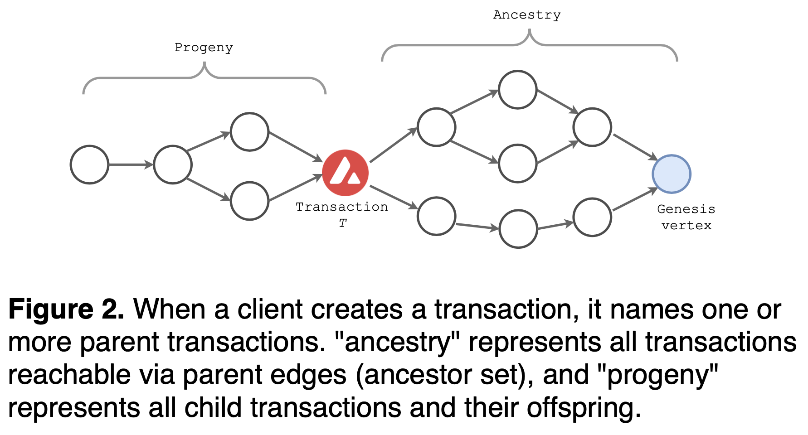
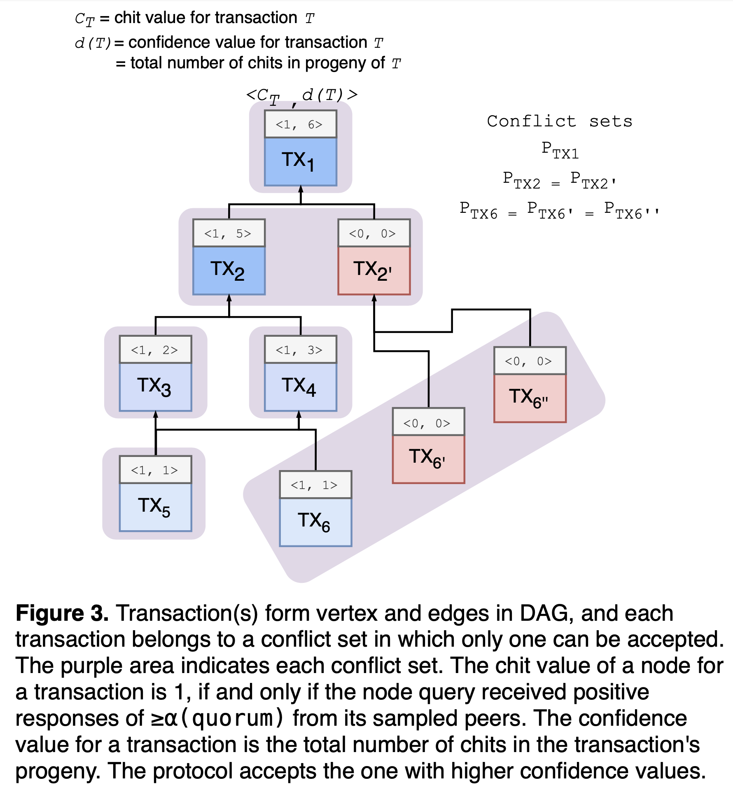

# Nakamoto(Bitcoin) vs. Snow(Avalanche): consensus

🚧❄️☃️❄️🚧 *Actively working on it...* 🚧❄️☃️❄️🚧

*Last update: September 10, 2022*

*Previous: [Paxos(etcd) vs. Nakamoto(Bitcoin): consensus](./paxos-etcd-vs-nakamoto-bitcoin-consensus.md)*

*Next: [Avalanche deep dive](./avalanche-deep-dive.md)*

- [What is consensus?](#what-is-consensus)
- [What is Nakamoto consensus?](#what-is-nakamoto-consensus)
- [What is Snow consensus?](#what-is-snow-consensus)
- [Unspent transaction output (UTXO)](#unspent-transaction-output-utxo)
- [Proof-of-Work and Proof-of-Stake](#proof-of-work-and-proof-of-stake)
- [Proof-of-Stake (PoS)](#proof-of-stake-pos)
- [Agreement in Nakamoto](#agreement-in-nakamoto)
- [Agreement in Snow](#agreement-in-snow)
  - [Key guarantees](#key-guarantees)
  - [Synchrony](#synchrony)
  - [Safety and liveness](#safety-and-liveness)
  - [Snow family protocols](#snow-family-protocols)
    - [Slush: introducing metastability](#slush-introducing-metastability)
    - [Slush → Snowflake: BFT](#slush--snowflake-bft)
    - [Snowflake → Snowball: adding confidence](#snowflake--snowball-adding-confidence)
    - [Snowball → Avalanche: adding chits to track confidence on DAG](#snowball--avalanche-adding-chits-to-track-confidence-on-dag)
    - [Avalanche → Snowman: linear chain without DAG](#avalanche--snowman-linear-chain-without-dag)
    - [Frosty](#frosty)
  - [Avalanche platform](#avalanche-platform)
  - [Who initiates the block (data)?](#who-initiates-the-block-data)
    - [Peer/node discovery](#peernode-discovery)
    - [Message relay](#message-relay)
  - [What's in the block (data)?](#whats-in-the-block-data)
    - [Unit of consensus](#unit-of-consensus)
    - [Data structure](#data-structure)
    - [Payload and data limit](#payload-and-data-limit)
  - [How to resolve the block (data) conflicts?](#how-to-resolve-the-block-data-conflicts)
    - [Definition of conflict](#definition-of-conflict)
    - [Definition of longest chain](#definition-of-longest-chain)
    - [Choice between conflicting chains](#choice-between-conflicting-chains)
  - [How to distribute the block (data)?](#how-to-distribute-the-block-data)
    - [Build consensus](#build-consensus)
    - [Information propagation speed and finality](#information-propagation-speed-and-finality)
- [Reference](#reference)

### What is consensus?

Applications may crash, [server hardwares fail](https://conferences.sigcomm.org/sigcomm/2011/papers/sigcomm/p350.pdf), natural disasters can take out data centers in a region. To limit the impact of such occasional but inevitable failures, the system must develop the redundancy for the service. This strategy often entails geographically distributing a system, which requires a consistent view of the system state. The distributed consensus enables this group of processes to reach an agreement on a value in the face of asynchronous, unreliable networks: critical configuration data, leader election, service/member discovery, distributed locking, etc..

> Assume a collection of processes that can propose values. A consensus algorithm ensures that a single one among the proposed values is chosen.
>
> *Leslie Lamport, [Paxos Made Simple (2001)](https://lamport.azurewebsites.net/pubs/paxos-simple.pdf)*

### What is Nakamoto consensus?

Introduced by *Satoshi Nakamoto, [Bitcoin: A Peer-to-Peer Electronic Cash System (2008)](https://bitcoin.org/bitcoin.pdf)*, the Nakamoto algorithm solves the agreement problem in the face of Byzantine faults, where malicious nodes may pass incorrect messages.

Nakamoto consensus powers [Bitcoin](https://bitcoin.org) to achieve a distributed consensus on the chain without relying on any trusted third party. Bitcoin is a permissionless Blockchain, allowing anyone to create blocks through transactions among participating nodes. The chain state and transaction logs are transparent and accessible to any anonymous participant. Bitcoin being public introduces different kinds of attacking vectors, which is a key to understanding its consensus mechanism. The focus is on the byzantine fault tolerance, [sybil attack](https://www.microsoft.com/en-us/research/wp-content/uploads/2002/01/IPTPS2002.pdf) protection, and DoS (Denial of Service) resistance.

### What is Snow consensus?

Introduced by *Team Rocket, [Scalable and Probabilistic Leaderless BFT Consensus through Metastability (2020)](https://files.avalabs.org/papers/consensus.pdf)*, the Snow algorithm similarly solves the agreement problem in the face of Byzantine nodes. Snow consensus powers [Avalanche](https://avax.network) to achieve a distributed consensus on the chain without relying on any trusted third party. Unlike Nakamoto that uses Proof-of-Work (PoW) to prevent sybil attack and build agreement among participants, Snow uses Proof-of-Stake (PoS) thus green, quiescent, and efficient (see the report [here](https://medium.com/avalancheavax/ccri-finds-avalanche-to-consume-35-000x-less-energy-than-ethereum-and-200-000x-less-than-bitcoin-70ba519d22c3)).

### Unspent transaction output (UTXO)

Bitcoin uses the [unspent transaction output (UTXO) model](https://en.wikipedia.org/wiki/Unspent_transaction_output) to record the state of individual coin transfers between wallets (much like physical coins). Rather than tracking the balance of each account (e.g., Ethereum), a UTXO represents a transaction output that has not been spent and thus can be used as an input to a new transaction. Only the unspent output can be used for the next transaction to prevent double-spending. Each UTXO is a chain of ownership where the current owner (currency/asset sender) signs the transaction to transfer the UTXO ownership to the public key of the new owner (receiver).

When a transaction occurs, the transaction input (e.g., "A has 100 BTC, and A sends 10 BTC to B") is to be destroyed from the UTXO set, and the respective outputs (e.g., "A balance changes to 90 BTC, and B receives 10 BTC from A") creates a new UTXO to the UTXO set. Such UTXO model enables client-side aggregation, reduces the computation requirements in the network, and makes it easier to parallelize transactions.

The total UTXO sets in a blockchain represent the set that every transaction consumes elements from and creates new ones to, which represents the total supply of the currency.

### Proof-of-Work and Proof-of-Stake

*Proof-of-Work (PoW)* and *Proof-of-Stake (PoS)* are not consensus algorithms but sybil control mechanisms. PoW, by itself, is not a consensus mechanism. In order to achieve consensus, Bitcoin uses the longest chain selection rule. Likewise, PoS does not achieve consensus by itself. It has to be coupled with a consensus protocol, such as PBFT, or Tendermint/Cosmos, or Avalanche, in order to make decisions. PoW or PoS does not get you agreement, it only gets you rate limiting.

### Proof-of-Stake (PoS)

Proof-of-Work (PoW) requires miners to consume electricity to compute the desired hash. The increasing hash difficulty leads to more energy consumption and demands more powerful mining rigs. Such substantial cost is deterrant to decentralizaton of participants. According to [hashrate distribution](https://blockchain.info/pools) (as of November 2021), only four Bitcoin mining pools control 50% of hashrate. Apart from this, PoW generally suffers from a low throughput and other scalability issues.

Unlike PoW, Proof-of-Stake (PoS) participant is only required to own and lock a certain amount of the corresponding currency, referred to as "stake". The stake acts as a guarantee that the holder will behave as per the protocol rules in the block creation process. PoS is more energy efficient as there is no need to solve a compute-intensive cryptographic puzzle, thus less susceptible to the centralization of mining pools.

Unlike PoW that only selects the node that finds the desired hash, PoS can select any stakeholder for block creation, as per the protocol rules.

### Agreement in Nakamoto

The unit of Bitcoin consensus is a block of multiple transactions. Each transaction (e.g., send 1 BTC to a friend) is signed by the current wallet's private key with the signature to provide the mathematical proof and thus protect against malicious actors. Once the signatures are validated, the miner combines those multiple transactions into one single unit of consensus, rather than initiating a new consensus for each transaction. Then the node starts mining to extend the chain by enumerating the "nonces" until a hash less than or equal to the "target" value is found. Such process is referred to as mining or Proof-of-Work (PoW), as it requires substantial amount of computing work. When the proper "nonce" is found, the miner is rewarded with a new Bitcoin for its expended CPU time and electricity (i.e., [coinbase transaction](https://en.bitcoin.it/wiki/Coinbase)). Then the node broadcasts the newly mined block to its peers, subsequently with each peer forwarding the block to every one of its neighbors, eventually flooding the whole network (gossip).

### Agreement in Snow

By construction, a Bitcoin node is always active, and the network consumes 204.50 TWh per year (estimated as of March 2022), comparable to the power consumption of Thailand (see [Bitcoin energy consumption](https://digiconomist.net/bitcoin-energy-consumption) and [CIA world factbook](https://www.cia.gov/the-world-factbook/countries/thailand/#energy)). The node builds the block template whether its mempool has any transaction or not. The miner runs through different "nonce" values until the resulting hash is below the current "target". That is, the Nakamoto protocol requires constant participation of miners even when there is no decision to be made. Unlike Nakamoto, Snow protocol is quiescent when there is no decision to be made. Similar to Nakamoto, Snow protocol trades off a determinstic safety guarantee for a probabilistic one. The key difference is the use of PoS and repeated sub-sample voting mechanism, which makes Avalanche more scalable.

The protocol is best illustrated with this [2-minute video](https://youtu.be/Sfb8G54AM_4) by [Emin Gün Sirer](https://twitter.com/el33th4xor).

<iframe width="560" height="315" src="https://www.youtube.com/embed/Sfb8G54AM_4" title="YouTube video player" frameborder="0" allow="accelerometer; autoplay; clipboard-write; encrypted-media; gyroscope; picture-in-picture" allowfullscreen></iframe>

To develop the initial intuition about the protocol, let's imagine a room full of people trying to agree on what to drink: "coffee" or "wine". Some prefer "coffee" at first, while others choosing "wine". The goal is to build consensus on the single value -- one kind of drink. Each participant starts out with no preference (uncolored state) and asks a random subset of its neighbors in the room for their drink preference (e.g., ask only 10 out of 1,000 people). The rule is each person adopts the preference of the majority (defined as \\(≥ α\\) or quorum) -- "looks like more people are leaning toward coffee, so I prefer coffee now." When everyone repeats the same process, more and more people converge onto the same preference. After enough rounds, the protocol reaches agreement on the single value that everyone prefers. The "preference" in the protocol represents the binary decision between two colors, although the protocol can be generalized to support multi-value consensus.

#### Key guarantees

Asynchronous network assumes each process operates at arbitrary speeds and may take arbitrarily long to deliver messages. [Impossibility of Distributed Consensus with One Faulty Process (1985)](https://groups.csail.mit.edu/tds/papers/Lynch/jacm85.pdf) proved that in such "asynchronous" network, even one faulty process makes it impossible for remote processes to reach agreement. In other words, for any consensus protocol, there exists a path of non-termination (against liveness).

> No completely asynchronous consensus protocol can tolerate even a single unannounced process death. We do not consider Byzantine failures, and we assume that the message system is reliable -- it delivers all messages correctly and exactly once. Nevertheless, even with these assumptions, the stopping of a single process at an inopportune time can cause any distributed commit protocol to fail to reach agreement. Thus, this important problem has no robust solution without further assumptions about the computing environment or still greater restrictions on the kind of failures to be tolerated!
>
> Crucial to our proof is that processing is completely asynchronous; that is, we make no assumptions about the relative speeds of processes or about the delay time in delivering a message. We also assume that processes do not have access to synchronized clocks, so algorithms based on time-outs, for example, cannot be used. Finally, we do not postulate the ability to detect the death of a process, so it is impossible for one process to tell whether another has died (stopped entirely) or is just running very slowly.
>
> *Michael Fischer, Nancy Lynch and Michael Paterson, [Impossibility of Distributed Consensus with One Faulty Process (1985)](https://groups.csail.mit.edu/tds/papers/Lynch/jacm85.pdf)*

Agreement in consensus is a safety property, and termination is a liveness property where correct (non-faulty) processes can eventually produce a value thereby making progress. In practice, one can weaken some problems above to achieve both safety (agreement) and liveness (termination), as follows:

- **We can assume synchrony.** The protocol can assume a synchronous network with a strict upper bound for message delays -- see [The Byzantine Generals Problem by Lamport (1981)](https://lamport.azurewebsites.net/pubs/byz.pdf). Paxos/Raft assumes synchrony by implementing timeouts and retries for building consensus, in order to achieve termination (liveness) guarantees.
- **We can use probabilistic termination.** To work around the impossibility of deterministic termination, the protocol can opt for a probabilistic guarantee that some value is correct (e.g., Nakamoto consensus). Thereby the path of non-termination (infinite undecision) can have an exponentially small probability.

Paxos operates in a fully asynchronous setting but does not suffer such safety and liveness issues, as the proposal is only made to a known set of correct participants. However, Snow protocol operates in a permissionless setting, thus susceptible to adversary that may not transmit messages and being stuck waiting for the response. In order to ensure liveness, a node implements timeouts for the wait and probabilistic termination. Snow protocol satisfies consistency given bounded network delays, to guarantee the liveness. Likewise, Nakamoto consensus satisfies consistency as its PoW difficulty depends on the maximum network delay -- see [Analysis of the Blockchain Protocol in Asynchronous Networks (2016)](https://eprint.iacr.org/2016/454.pdf).

The Snow protocol defines the following key guarantees:

- **P1. Safety (agreement).** Two correct nodes may make conflicting decisions on a transaction but with negligible probability \\(≤ ε\\).
- **P2. Liveness (termination with upper bound).** The decision is made with a strictly positive probability within \\(t_{max}\\) rounds, where \\(n\\) is the total number of participants and \\(O(log n) < t_{max} < ∞\\).
- **P3. Liveness (strong form of termination).** If \\(f ≤ O(\sqrt{n})\\) where \\(n\\) is the total number of participants and \\(f\\) is the number of adversary nodes, the decision is made with high probability \\(≥ 1 - ε\\) within \\(O(log n)\\) rounds.

#### Synchrony

Some protocols assume a *synchronous* network with a strict upper bound for message delays (see [DWORK1988](https://groups.csail.mit.edu/tds/papers/Lynch/jacm88.pdf)). The synchronous network is slower than asynchronous but easier to build. The synchronous model is simple: Two machines are guaranteed to communicate with each other within a certain period of time. Nakamoto consensus is a synchronous protocol, assuming the propagation of a block for a certain amount of time. The protocol is safely synchronous as you are guaranteed to not double spend as long as the network remains within the delta of the block propagation time.

Bitcoin only works synchronously, and the network has to have at least 50% or more of the nodes to download the block within the 10 minutes. If the 50% or more do not receive the block within the 10-minute, blocks will be confirmed independently in each partition. When they merge, whichever has more hash power will overwrite the other.

Due to this arbitrary bottleneck in the synchronous network, Bitcoin can only accept 1 or 2 MiB for every 10 minute. Regardless of how powerful the underlying hardwares are, the protocol will not accept blocks beyond the rules of synchronicity assumptions of Bitcoin.

The *asynchronous* model is not dependent on such paremeters of speed. The network can process blocks as soon as it gets some super majority of the votes. It can go however fastest the majority of the network are but has very large communication complexities. One node cannot produce a block the same way as Nakamoto consensus. When a node receives a transaction, it validates, asks everybody else for votes, and then collects the votes for finalization, which has qubic complexity. An agreement for 10 nodes takes 1,000 messages. Thus the bottleneck in the *asynchronous* network is, the more nodes, the more messages are needed for an agreement.

The Avalanche protocol is *synchronous*, as it implements timeouts and retries to achieve termination (liveness) guarantees. When a node happens to sample the majority of adversarial nodes, the node waits with some timeout in order to prevent itself from being stuck waiting for the responses.

#### Safety and liveness

To recap, *safety* is a property of "agreement". The *safety* of the protocol fails when two nodes are finalized with two different blocks for the same height. *Liveness* is a property of "termination": Correct members eventually reach an agreement and produce a value to make progress.

The classical consensus protocol such as Paxos or PBFT has a determinstic safety guarantee, as the proposal is only made to a known set of correct, good-behaving members. Avalanche protocol trades away determinstic safety with a probabilistic one. That is, two correct nodes may make conflicting decisions, but with infinitely small probability. Such loosely formed agreement enables much stronger guarantees than Nakamoto consensus and better scalability in network communication.

In Avalanche protocol, these "safety" and "liveness" thresholds can be parameterized. The protocol intentially trades "liveness" for higher "safety" threshold, because that is a safer way to implement payment system on the blockchain. The tradeoff is, the higher "safety" threshold requires more rounds to reach an agreement, therefore lowers the "liveness".

In Avalanche protocol, "safety" and "liveness" are only guaranteed for virtuous transactions with no previously issued conflicting transaction. And the "liveness" is not guaranteed for rogue transactions that are in conflict spending with the previously issued transactions. This may sound like, the protocol does not make progress when there's a conflicting transaction (rogue), but that is not true. It is about the guarantees on the number of rounds to reach an agreement. The protocol allows malicious or double spending transactions to be stuck forever. To be more precise, the "liveness" for double spending transactions is not guaranteed. For end-users, if a transaction did not get accepted with a sub-second finality, they can simply reissue the transaction, and it will go through on retries. And if there's no conflict in the transaction, the node just relays the transaction to the other nodes to accept. The sub-sampled voting is only for resolving the transaction conflicts.

#### Snow family protocols

Snow is a family of binary BFT protocols based on a non-BFT protocol *Slush*, which incrementally builds up to *Snowflake* and *Snowball* BFT protocols in the Snow family.


##### Slush: introducing metastability

Slush is the foundation of Snow family consensus and introduces metastability in decision making process. Slush is a single-decree (decide a single value) consensus protocol and not tolerant against Byzantine faults (non-BFT), but can be extended to BFT protocols of Snowflake and Snowball.

The goal is the nodes agree on the single value -- binary decison on the color. A Slush node starts as an uncolored state. When it initially receives a transaction, the uncolored node changes its own color as in the transaction and initiates queries to its neighbors. The node only queries the sub-sampled set of peers -- the sample size \\(k\\) is uniformly at random, and can be parameterized (via [`--snow-sample-size`](https://pkg.go.dev/github.com/ava-labs/avalanchego/snow/consensus/snowball#Parameters)). Upon receiving the query, an uncolored node adopts the same color as the query sender, responds back with the color, and then initiates its own query to its neighbors. The already colored node simply responds with its current color. Once the querying node collects \\(k\\) responses, the node calculates the color ratio to check against the threshold and decide on the agreement. Let's define alpha \\(α\\) to be the threshold, sufficiently large fraction of the sample (quorum), where \\(α > \lfloor k/2 \rfloor\\) and which can be parameterized by the protocol (via [`--snow-quorum-size`](https://pkg.go.dev/github.com/ava-labs/avalanchego/snow/consensus/snowball#Parameters)). If the ratio is \\(≥ α\\) for the different color, the node flips the color and initiates the subsequent rounds of queries with a different set of samples (repeated up to \\(m\\) rounds, set via [`--snow-concurrent-repolls`](https://pkg.go.dev/github.com/ava-labs/avalanchego/snow/consensus/snowball#Parameters)). Each successful query that yields \\(≥ α\\) responses will update the color of the node. Then the node decides the current color at the round \\(m\\) selecting the tip.

```python
def respond_to_query(v, new_col):
    # respond with current preference
    # rather than its preference after
    # observing the querying color
    #
    # safety analysis requires nodes to be already colored
    # prior to receiving the query when responding affirmatively
    #
    # note that current coloring of the network
    # should be independent from the current sampling
    #
    # "current" coloring can be biased towards the colors
    # that are sampled if the node is uncolored
    #
    # ref. https://github.com/ava-labs/avalanchego/commit/20e7e388645c2898dc6eac776d8e9ca8609f7c54
    respond(v, cur_col)

    # ⊥ is uncolored
    # local node own color is none
    if cur_col == ⊥:
        # upon receiving the query,
        # the uncolored node adopts
        # the same color as in transaction
        # or as the query sender
        cur_col = new_col

def slush_loop(u, col_init in {R, B, ⊥}):
    # initialize the color
    cur_col = col_init

    # repeated sampling and queries for m rounds
    for r in {1...m}:
        # random sample k peers out of N
        set_k = random_sample(u, k/N)

        # for each peer, query/count the color ratio
        # map from color to the ratio
        count = {}
        for vdr in set_k:
            count.update(query(vdr, cur_col))

        for c in {R, B}:
            # every successful query that yields ≥α responses
            # updates the color of the node
            if count[c] >= α:
                cur_col = c
                break

    # the node decides color at time m
    accept_and_decide(cur_col)
```

> *Then what is "metastability"?*

[Metastability](https://en.wikipedia.org/wiki/Metastability) is a condition of a system that spontaneously leaves a state of higher energy for the least energetic state after a sequence of transitions. Metastability is a precarious state that can be easily disturbed. For example, bowling pins are metastable that wobbles for a moment before completely tipped over. The snow slide (i.e., [avalanche](https://en.wikipedia.org/wiki/Avalanche)) shows similar metastability: the large piles of snow on the steep slope stay still in dry conditions (low energy), but the entire mountainside of snow may suddenly slide in presence of a skier or a loud noise (high energy). The minor disturbance can cause the metastable system to fall to a state of lower energy.

Similarly, for each Slush round, the protocol converts the bivalent state (e.g., 50/50 color split) into a state of full imbalance (e.g., all nodes are colored identically if the poll number \\(m\\) is high enough) -- "escape the metastable state". In other words, the sequence of random sampling perturbs the conflicting states among the nodes, causing one to gain more edge over time in order to amplify the imbalance.

##### Slush → Snowflake: BFT

Even when honest Slush nodes develop the preference for one color, an adversary node can still attempt to flip the preference, in order to halt the decision process in the network. This is where Snowflake comes in, the first BFT protocol in Snow family. Snowflake is Byzantine fault tolerant, while Slush is not.

Snowflake augments Slush with a counter that tracks the "conviction" of the local node for its current color. The conviction counter increments for each successful query that has sampled \\(k\\) out of \\(N\\) nodes and resulted in \\(≥ α\\) responses for the same color as the querying node, and resets otherwise. That is, the "conviction" count represents how many consecutive samples of the network from the node have all yielded the same color as the local node. And the node accepts and decides the current color when its conviction count reaches the threshold \\(β\\).

As in Slush, the alpha \\(α\\) represents a sufficiently large portion of the participants -- quorum. And let's define the beta \\(β\\) to be another security threshold for the conviction counter -- decision threshold. Both \\(α\\) and \\(β\\) are safety threshold. The higher \\(α\\) and \\(β\\) increase the protocol safety but decrease the liveness.

The \\(α\\) threshold can be set via [`--snow-quorum-size`](https://pkg.go.dev/github.com/ava-labs/avalanchego/snow/consensus/snowball#Parameters). The \\(β\\) thresholds can be set via [`--snow-virtuous-commit-threshold`](https://pkg.go.dev/github.com/ava-labs/avalanchego/snow/consensus/snowball#Parameters) for virtuous transactions and [`--snow-rogue-commit-threshold`](https://pkg.go.dev/github.com/ava-labs/avalanchego/snow/consensus/snowball#Parameters) for rogue transactions.

```python
def respond_to_query(v, new_col):
    # respond with current preference
    # rather than its preference after
    # observing the querying color
    #
    # safety analysis requires nodes to be already colored
    # prior to receiving the query when responding affirmatively
    #
    # note that current coloring of the network
    # should be independent from the current sampling
    #
    # "current" coloring can be biased towards the colors
    # that are sampled if the node is uncolored
    #
    # ref. https://github.com/ava-labs/avalanchego/commit/20e7e388645c2898dc6eac776d8e9ca8609f7c54
    respond(v, cur_col)

    # ⊥ is uncolored
    # local node own color is none
    if cur_col == ⊥:
        # upon receiving the query,
        # the uncolored node adopts
        # the same color as in transaction
        # or as the query sender
        cur_col = new_col

def snowflake_loop(u, col_init in {R, B, ⊥}):
    # initialize the color
    cur_col = col_init

    # initialize the conviction count
    # represents how many consecutive samples
    # yield the same color
    # "consecutive successes"
    conviction = 0

    # repeated sampling and queries
    # until the color is decided
    decided = False
    while not decided:
        # random sample k peers out of N
        set_k = random_sample(u, k/N)

        # for each peer, query/count the color ratio
        # map from color to the ratio
        count = {}
        for vdr in set_k:
            count.update(query(vdr, cur_col))

        # only increment conviction counter
        # iff queries yield ≥ α
        # for the same color as node
        quorum_reached = False
        for c in {R, B}:
            # every successful query that yields ≥α responses
            # updates the color of the node
            if count[c] >= α:
                # found a color of sufficiently large ratio
                quorum_reached = True

                # only increment counter
                # if it were the same color as node
                if c != cur_col:
                    cur_col = c
                    conviction = 1
                else:
                    # same color as node, thus increment
                    conviction++

                # meets the security threshold β
                # threshold for the conviction counter
                if conviction >= β:
                    accept_and_decide(c)
                    decided = True

        # no color fraction is sufficiently large
        # thus undecided
        if not quorum_reached:
            conviction = 0
```

> *Then how is Snowflake "BFT"?*

A node iteratively chooses a small sample to query the preference of its neighbors, and updates its color based on voting results. The "update color" part is the core of the consensus algorithm that needs to work in the presence of Byzantine nodes which otherwise prevents the network from reaching consensus.

For safety guarantees, let's define epsilon \\(ε\\) to be the threshold on the probability of conflicting transactions. When the protocol is properly parameterized for Byzantine node ratios and desired \\(ε\\)-guarantees, the Byzantine node will lose its ability to keep the network in a bivalent state (conflicting state). The correct nodes will sway towards one color and eventually commit past the "irreversible" state -- the nodes will not switch to the other color, no matter what malicious actors do given such bounds, thus Byzantine fault tolerant.

The key tradeoff is: conflicting transactions only come from malicious actors and the probability \\(ε\\) is sufficiently small, and thus the protocol does not need to guarantee liveness or finality for such transactions. In other words, the time for finality approaches \\(\infty\\) as the number of adversary nodes \\(f\\) approaches \\(n/2\\).

The protocol can parameterize a higher Byzantine node ratio \\(f/n\\) (e.g., 80% nodes are allowed to be adversary) to sacrifice liveness (termination) for stronger safety guarantees, as it requires more rounds for convergence. And likewise, lower \\(f/n\\) threshold sacrifices the safety for liveness, as it requires less rounds to reach an agreement.

##### Snowflake → Snowball: adding confidence

Snowflake conviction count represents how many consecutive samples of the network from the node have all yielded the same color. However, "conviction" count is an ephemeral state, reset for each color flip, which may prevent decision making. This is where Snowball comes in.

Snowball extends Snowflake with "confidence" to account for the total accrued confidence when updating its preference (color): For each query, the node increments its confidence counter for the corresponding color, and switches its color when the confidence counter of the new color exceeds the one of its current color. The confidence counter represents how many successful queries that have yielded \\(≥ α\\) responses per each color. In other words, "confidence" tracks the historical "conviction" counts for each color (whether consecutive or not), so the querying node can switch to the one with higher "confidence". And the node accepts and decides the current color when its conviction count reaches the threshold \\(β\\).

The \\(α\\) threshold can be set via [`--snow-quorum-size`](https://pkg.go.dev/github.com/ava-labs/avalanchego/snow/consensus/snowball#Parameters). The \\(β\\) thresholds can be set via [`--snow-virtuous-commit-threshold`](https://pkg.go.dev/github.com/ava-labs/avalanchego/snow/consensus/snowball#Parameters) for virtuous transactions and [`--snow-rogue-commit-threshold`](https://pkg.go.dev/github.com/ava-labs/avalanchego/snow/consensus/snowball#Parameters) for rogue transactions.


```python
def respond_to_query(v, new_col):
    # respond with current preference
    # rather than its preference after
    # observing the querying color
    #
    # safety analysis requires nodes to be already colored
    # prior to receiving the query when responding affirmatively
    #
    # note that current coloring of the network
    # should be independent from the current sampling
    #
    # "current" coloring can be biased towards the colors
    # that are sampled if the node is uncolored
    #
    # ref. https://github.com/ava-labs/avalanchego/commit/20e7e388645c2898dc6eac776d8e9ca8609f7c54
    respond(v, cur_col)

    # ⊥ is uncolored
    # local node own color is none
    if cur_col == ⊥:
        # upon receiving the query,
        # the uncolored node adopts
        # the same color as in transaction
        # or as the query sender
        cur_col = new_col

def snowball_loop(u, col_init in {R, B, ⊥}):
    # initialize the color
    prev_col = col_init
    cur_col = col_init

    # "confidence" represents
    # how many successful, consecutive queries
    # that yields ≥α responses
    # (α as per Slush, quorum)
    confidence[R] = 0
    confidence[B] = 0

    # "conviction" represents
    # how many consecutive samples yield the same color
    # "consecutive successes"
    conviction = 0

    # repeated sampling and queries
    # until the color is decided
    decided = False
    while not decided:
        # random sample k peers out of N
        set_k = random_sample(u, k/N)

        # for each peer, query/count the color ratio
        # map from color to the ratio
        count = {}
        for vdr in set_k:
            count.update(query(vdr, cur_col))

        # only increment conviction counter
        # iff queries yield ≥ α
        # for the same color as node
        quorum_reached = False
        for c in {R, B}:
            # every successful query that yields ≥α responses
            # updates the color of the node
            if count[c] >= α:
                # found a color of sufficiently large ratio
                quorum_reached = True
                # successful query that yields ≥α
                confidence[c]++

                # switches color when the confidence counter of new
                # exceeds the one of current color
                if confidence[c] > confidence[cur_col]:
                    cur_col = c

                # check if this new color is same as last one
                # in order to track the historical "confidence"
                # based on current "conviction"
                if c != prev_col:
                    prev_col = c
                    conviction = 1
                else:
                    conviction++

                # meets the security threshold β
                # threshold for the conviction counter
                if conviction >= β:
                    accept_and_decide(c)
                    decided = True

        # no color fraction is sufficiently large
        # thus undecided
        if not quorum_reached:
            conviction = 0
```

See [Snow BFT demo by Ted Yin, Ava Labs co-founder](https://tedyin.com/archive/snow-bft-demo/#/snow).

##### Snowball → Avalanche: adding chits to track confidence on DAG

> *Then how does Snowball of repeated sub-sample voting achieve agreement to build an immutable ordered sequence of transactions in a fully permissionless settings?*

Avalanche is to Snowball, as Raft is to Paxos. While Snowball protocol can simply be described in a page of pseudo-code, the real-world payment system requires more features and optimizations. This is where Avalanche comes in, to address all major pieces moving from theory to practice.

The key observation is the standard replication from traditional consensus protocols may not be necessary for a payment system, when the focus is on the prevention of double-spending and conflict resolution. The safety (agreement) and liveness (termination) are guaranteed for virtuous transactions, while the liveness is not guaranteed for rogue transactions that have created conflicts among participants. It is ok for malicious spenders (Byzantine clients) to be stuck in the transaction forever. The time for rogue transaction finality will reach \\(\infty\\), as the number of adversary nodes \\(f\\) nears \\(n/2\\). Then malicious actors would have no safety impact on the virtuous transactions.

Snowball can eventually make progress using binary decomposition, whereas Avalanche may not make progress in the presence of multi-conflict transactions. The [Avalanche paper](https://files.avalabs.org/papers/consensus.pdf) demonstrates this is a sensible tradeoff, and sufficient for building complex payment systems.

The classical BFT systems (e.g., Nakamoto consensus) has 33% Byzantine fault tolerance limits both for safety and liveness -- see ["Majority is not Enough" by Ittay Eyal and Emin Gün Sirer](http://www.cs.cornell.edu/~ie53/publications/btcProcFC.pdf): The malicious party only needs to control the 33% of the network to break the network (e.g., double spends). Avalanche is different because the protocol makes trade-offs of weakened liveness for the Byzantine clients, thus higher levels of safety -- 80% safety threshold. Note that the percent in Avalanche represents the percentage of the stake held by Avalanche network validators: The malicious nodes will need control the total stake amount beyond safety thresholds. Avalanche safety limits are probabilistic as the protocol performs sample-voting against validators -- see [`IsValidatorOnly`](https://pkg.go.dev/github.com/ava-labs/avalanchego/snow#ConsensusContext.IsValidatorOnly). The validator is weighted based on its stake amount for consensus queries, and non-validator is never queried for such consensus polling.

[DAG](https://en.wikipedia.org/wiki/Directed_acyclic_graph) is to Avalanche, as chain is to Bitcoin: Avalanche consists of multiple single-decree [Snowball](#snowflake--snowball-adding-confidence) instances to build a dynamic, append-only directed acyclic graph (DAG) of all known transactions -- each Snowball instance is a vertex in a graph. Avalanche DAG defines one single sink, "genesis" vertex, with an out-degree of zero. DAG provides more efficiency, because a single vote on a DAG vertex implicitly endorses all transactions that lead to the genesis vertex (transitive). And it also provides better security, because similar to Bitcoin blockchain, the DAG interconnects transactions, thus difficult to revert past commit.

When an Avalanche transaction is issued, it names one or more parents. Each transaction forms a conflict set. Avalanche instantiates a Snowball instance for each conflict set on the DAG. Each Snowball instance represents a vertex in the graph. A vertex may consist of multiple transactions. So, the vertex is a set of transactions and an instance of Snowball consensus.

Avalanche may batch multiple transactions for querying the underlying Snowball instances, but still maintains the confidence values for each individual transaction. That is, Avalanche consensus uses the transaction as a *unit of consensus*, and batches multiple transactions into a vertex to amortize the polling and succinctly represent the evergrowing set of vertices: A vote for a vertex is for all  transactions that lead to the genesis vertex (transitive).

The challenge in maintaining the DAG is to choose among conflicting transactions (e.g., double-spending the same UTXO), which forms a conflict set on the DAG, only one of which can be accepted. Avalanche instantiates a Snowball instance for each conflict set, to take advantage of the DAG structure.

Note that the child transaction is not required to have any application-specific or funding dependency on the parent. Instead, it defines "ancestry" to be all transactions reachable via parent edges (ancestor set), and "progeny" to be all child transactions and their offspring.



In Avalanche, transactions that spend the same UTXO are in conflict: Two transactions with overlapping input IDs are in conflict. Let's say an Avalanche transaction \\(T\\) belongs to a conflict set \\(P_{T}\\). Since conflicts are transitive in DAG, when \\(T_{i}\\) and \\(T_{j}\\) are in conflict, then they belong to the same conflict set \\(P_{T}\\), where \\(P_{T_{i}} = P_{T_{j}}\\) but to be tracked separately. Only one transaction in the conflict set can be accepted, and each node can prefer only one transaction in the conflict set. When such transaction \\(T\\) is queried, all transactions reachable from \\(T\\) are implicitly part of the query: If a transaction \\(T\\) is final from a node's perspective, the node can assume the entire ancestry of the transaction \\(T\\) are also final. Likewise, if a transaction \\(T\\) is rejected, its progeny can also be rejected. Each transaction \\(T\\) belongs to its own conflict set \\(P_{T}\\), and one vertex may have multiple transactions. The node filters transactions early, so that conflicting transactions never belong to the same vertex, or drops the whole vertex if conflicts were found within the vertex.

Unlike Bitcoin that waits for next block creation to exclude double-spending transactions, Avalanche instantiates a Snowball instance for each conflict set, taking advantage of DAG. Similar to Snowball, Avalanche iteratively chooses a small sample to query the preference and updates the color of the querying node based on vote results. The receiving node responds positively to the query, if and only if the transaction \\(T\\) and its ancestry are currently the preferred option in the respective conflict sets. Once the querying node collects positive responses beyond its threshold \\(α\\) (quorum), the transaction collects a "chit". Then the node builds "confidence" with the total number of chits in the progeny of the transaction.

Each node \\(u\\) calculates its confidence value \\(d_{u}(T)\\) from its progeny: \\(d_{u}(T) = \sum_{T' \in \mathcal{T_{u}}, T \leftarrow{} T'} C_{uT'}\\) to add up all chit values from child nodes. The chit value of transaction \\(T\\) is \\(C_{T} \in \\{0, 1\\}\\) and \\(C_{uT'}\\) stands for the chit value of transaction \\(T'\\) for the node \\(u\\). Each transaction in a node has an initial chit value of 0, before the node receives the query responses. If the querying node \\(u\\) collects yes-votes beyond the threshold \\(α\\) (quorum), the value \\(C_{uT'}\\) is set to 1, otherwise remains 0. A chit value represents the result from the one-time query of its corresponding transaction, and becomes immutable afterwards. The confidence value \\(d(T)\\) for transaction \\(T\\) can increase as the DAG grows its size, as it collects more chits in its progeny.

For virtuous (honest) transactions, the transaction is accepted when it is the only transaction in its conflict set and its confidence value is \\(>β\\). The \\(β\\) thresholds can be set via [`--snow-virtuous-commit-threshold`](https://pkg.go.dev/github.com/ava-labs/avalanchego/snow/consensus/snowball#Parameters) for virtuous transactions and [`--snow-rogue-commit-threshold`](https://pkg.go.dev/github.com/ava-labs/avalanchego/snow/consensus/snowball#Parameters) for rogue transactions. If a transaction failed to get accepted due to a problem with the parents, it could be reissued with different parents.

Below illustrates the Avalanche protocol main loop which is executed by each node. In each iteration, the node selects a transaction that has not been queried. As in Snowball, the node samples \\(k\\) peers to query. If more than \\(α\\) (quorum) respond positively to the querying node, the protocol sets the chit value of the querying node for the respective transaction \\(T\\) to 1. The receiving node responds positively to the query, if and only if the transaction \\(T\\) and its ancestry are currently the preferred option in the respective conflict sets. Then the protocol builds "confidence" with the total number of chits in the progeny of the transaction. Using this "confidence" state, the querying node updates the preferred transaction of each conflict set of ancestry transactions. And this transaction \\(T\\) is added to the set \\(Q\\) so it will never be queried again by the node. The protocol can batch multiple transactions in a vertex for queries but still tracks the confidence for each individual transaction. The protocol accepts a transaction when there is no other transaction in the conflict set and its confidence value is \\(>β\\). Similary, vertex is marked as accepted if all transactions in the vertex and its parent are accepted (transitively accept).



```python
def init():
    # set of known transactions
    set_t = {}
    # set of queried transactions
    set_q = {}

def on_receive_tx(tx):
    # if the transaction is not known yet
    if tx not in set_t:
        # if no conflict has been found yet
        if conflicts[tx] is None:
            # add to a conflict set
            conflicts[tx] = {tx}
            # set it as current preference
            preference[tx] = tx
            # record the last preference
            last[tx] = tx
            # reset count value
            count[tx] = 0
        else:
            # conflicts found
            conflicts[tx].add(tx)

        # add it to known transactions
        set_t.add(tx)
        # initialize chit value
        chits[tx] = 0

def is_preferred(tx):
    # true if the transaction is same as
    # current preferred value in the conflict set
    return tx == preference[tx]

def is_strongly_preferred(tx):
    # for every single ancestor
    for a in ancestry[tx]:
        if not is_preferred(a):
            return False
    return True

def respond_to_query(v, tx):
    on_receive_tx(tx)
    respond(v, is_strongly_preferred(tx))

def avalanche_loop(u):
    while True:
        # find T from set_t but not in set_q
        tx = select(set_t) and not in set_q

        # random sample k peers out of N
        set_k = random_sample(u, k/N)

        # for each peer, query/count how many of its ancestry
        # strongly prefer the transaction "tx"
        strongly_prefers = 0
        for v in set_k:
            if query(v, tx):
                strongly_prefers++

        if strongly_prefers >= α:
            chits[tx] = 1

            # update preference for each ancestor
            for a in ancestry[tx]:
                if confidence[a] > confidence[preference[a]]:
                    preference[a] = a
                if a != last[a]:
                    last[a] = a
                    count[a] = 1
                else:
                    count[a]++
        
        else:
            for a in ancestry[tx]:
                count[a] = 0

        # otherwise, chit for "tx" remains 0
        set_q.add(tx)
```

##### Avalanche → Snowman: linear chain without DAG

[Ethereum](https://ethereum.org/) supports [smart contract](https://ethereum.org/en/developers/docs/smart-contracts/), a computation model where each contract is persisted as an on-chain state, and called on a method in a transaction -- each method call creates a state transition of the smart contract, querying or updating its persistent state. Like a regular transaction, a smart contract has its own balance in Ethereum currency (ETH), which is kept as part of its state. The smart contract are written in a high-level programming language [Solidity](https://en.wikipedia.org/wiki/Solidity), and gets compiled down to the bytecode for Ethereum Virtual Machine (EVM). In order to deploy a smart contract, the bytecode is encoded in a transaction (thus block on-chain). In order to run the bytecode, one needs to instantiate the transaction with the arguments for the method calls and persist its output on-chain. That is, both contract logic and its input and output need to be encoded on-chain.

Snowman is a linearized version of Avalanche protocol, and used for Avalanche [Platform chain (P-chain)](https://docs.avax.network/learn/platform-overview#platform-chain-p-chain) and [Contract chain (C-chain)](https://docs.avax.network/learn/platform-overview#contract-chain-c-chain). Snowman is a linear chain of totally-ordered blocks, whereas Avalanche is a DAG of vertices.

Although Avalanche native VM (AVM) makes it easier to define a blockchain-based application, Ethereum smart contract became the de-facto language in the industry. This is where [Snowman](https://support.avax.network/en/articles/4058299-what-is-the-snowman-consensus-protocol) comes in to support EVM-compatible smart contract.

#### Frosty

*What is Frosty? We will find out! Coming soon...*

#### Avalanche platform

Unlike Bitcoin that has a single blockchain network, Avalanche has different types of transactions and consists of multiple blockchains: Exchange chain (X-chain), Platform chain (P-chain), Contract chain (C-chain), and subnetwork (subnet) -- see [platform overview](https://docs.avax.network/learn/platform-overview).

Avalanche subnet represents a set of validators that build consensus on the state of blockchain(s). Subnet is special in that each Avalanche blockchain can only be validated by exactly one subnet, but the subnet can validate multiple blockchains. An Avalanche node may belong to many subnets. Subnet manages its own membership and can implement its own membership properties. For example, a private subnet may only allow pre-defined validators for compliance reasons.

Avalanche [Primary Network](https://support.avax.network/en/articles/4135650-what-is-the-primary-network) is a special kind of subnet that validates X/P/C-chains. Remember, subnet-to-blockchain is one-to-many relationship, whereas blockchain-to-subnet is one-to-one. All members of all custom subnets must be a member of this Primary Network subnet.

X-chain is an Avalanche blockchain for creating and trading digital assets with a set of rules to govern its behavior (e.g., can only be sent to US citizens). X-chain is an instance of the Avalanche Virtual Machine (AVM). For example, `$AVAX` (Avalanche token) is traded on X-chain. X-chain implements [Avalanche consensus protocol](https://docs.avax.network/#avalanche-consensus-protocol).

P-chain is an Avalanche blockchain that coordinates validators, controls staking, manages active subnets, and creates new subnets. P-chain implements [Snowman consensus protocol](https://docs.avax.network/#snowman-consensus-protocol).

C-chain is an Avalanche blockchain that supports smart contract creation. C-chain is an instance of the Ethereum Virtual Machine (EVM), powered by Avalanche. C-chain implements [Snowman consensus protocol](https://docs.avax.network/#snowman-consensus-protocol).

> As powerful as DAG is, the core limitation is that you can either provide a partial ordering or stick a total ordering in there by essentially limiting to one UTXO per state. But, you end up having some issues with non-transitive conflict support and things like that. So, we ended up implementing snowman as kind of a second consensus instance. It is a strict subset of avalanche but allows you to do a bunch of optimizations on the consensus side, around the use of transitive conflicts. Transitive conflict means if two blocks are issued at the same height, they conflict. If a third block is issued at the same height, all three of them conflict, whereas in avalanche, if you have multiple input UTXOs, the transactions can actually not form transitive conflicts: where transaction A, B, and C, A conflicts with B, B conflicts with C, but A doesn't actually conflict with C. So, digging into snowman, we ended up implementing that out. And that kind of fleshed out two different components in consensus infrastruction. That ended up introducing two different interfaces for virtual machines to plug into on the avalanche consensus and then the other with the snowman consensus.
>
> P-chain and C-chain both use snowman, so they implement the VM specification for snowman blocks, and the X-chain is a DAG, so it actually implements the DAG VM interface. That's kind of how the separation works there, so when a node is running the primary network without any additional subnets, it's actually running three different consensus instances: It's running the avalanche consensus instance for the X-chain, and it's running two instances of the snowman consensus engine. That's how avalanche go ends up managing the consensus side of these two implementations.
>
> With snowman++, we improved snowman with reducing contention and with frosty, we'll be further improving some of the kind of theoretical bounds of the native snowman consensus.
>
> P-chain and X-chain are inside of avalanche go repository, but VMs are also able to dynamically be added to avalanche go, so you can set up what we call plugins to run with your VMs. C-chain is actually using coreth, which is a separate repository we manage. And coreth is a fork of geth, which defines the VM for the C-chain, essentially the EVM. These plugins are essentially used to define the state transitions of blocks, and also to be able to query the state. So, avalanche go is totally separate from really anything ethereum, but C-chain specifically is the fork. That's how avalanche go ends up being so extensible. C-chain is actually implemented as a plug-in.
>
> [*Stephen Buttolph (Chief Protocol Architect at Ava Labs)*](https://youtu.be/2siiIM9oUwk?t=470)

> The thinking was, if we are going to push hard on this generic VM concept and if we can implement an EVM compatible chain using our plug-in interface, we should be able to implement almost any virtual machine using that plug-in interface.
>
> Since mainnet launch, we've been focusing on improving that experience both from a UX, like developer expected perspectives, as well as from a performance perspective of how you pipeline things over gRPC, how you cache better, how you reduce the communication overhead of running these like dynamic virtual machines. And I think that the continued growth of the C-chain has continued to push us further along that road, but it's totally separate and you could just as easily take any number of the popular virtual machines people are developing and run them just like you would coreth. So, you could take a Cosmos virtual machine, you could take Solana, you could take Rust virtual machine, and just run it just like you would coreth as the separate virtual machine.
>
> Generally speaking, we view ourselves as someone that provides very high fidelity examples of what you could try to do with these virtual machines such that you could take them and build as you saw fit on top of this interface. We would roll out different examples that have complicated state access, or like complicated transaction processing, or are optimized for some type of transaction processing, and then leave it to people to extend where they could see that going.
>
> [*Patrick O'Grady (VP of Engineering at Ava Labs)*](https://youtu.be/2siiIM9oUwk?t=886)

> We can abstract all that away, they don't have to deal with the consensus. They don't have to deal with the networking. They don't have to deal with any of this stuff. They just have to deal with kind of what their core innovation is. I think that the innovation space in the VM land is so rich that, there's really not going to be like someone that implements some killer VM that kills everything. People are always going to want to make their own innovation.
>
> [*Stephen Buttolph (Chief Protocol Architect at Ava Labs)*](https://youtu.be/2siiIM9oUwk?t=1139)

#### Who initiates the block (data)?

##### Peer/node discovery

Bitcoin client uses DNS to discover the list of node IPs (see [wiki](https://en.bitcoin.it/wiki/Satoshi_Client_Node_Discovery)). Avalanche uses hard-coded beacon nodes as seed anchors -- see [beacon nodes](https://github.com/ava-labs/avalanchego/blob/v1.7.7/genesis/beacons.go). Unlike Bitcoin that requires one correct DNS seed node (i.e., seed anchor), Avalanche only requires a simple majority of the anchors to be valid -- an Avalanche node can discover its peers by connecting to any set of seed anchors. And there is no barrier to become a seed anchor -- one set of seed anchors can not dictate whether a node may or may not join the network (see [Avalanche platform paper](https://files.avalabs.org/papers/platform.pdf)).

##### Message relay

New Bitcoin transactions are broadcast over peer-to-peer network: An initiated transaction from a wallet client is sent to a node as an `inv`entory message, and the node requests the full transaction with `getdata`. After validating the transaction, the node sends the transaction to all of its peers with an `inv`. If the connected peer has not received such announced transaction yet, it sends the `getdata` request to get the transaction details, and so on. Such mesh layout of network can quickly disseminate the announced transaction from one node to the rest of the cluster.


Each VM bootstraps into a network by randomly sub-sampling the beacon validators set -- see [`snow/validator.Set`](https://pkg.go.dev/github.com/ava-labs/avalanchego/snow/validators#Set).

#### What's in the block (data)?

##### Unit of consensus

The unit of Bitcoin consensus is a block of multiple transactions. Each transaction (e.g., send 1 BTC to a friend) is signed by the current wallet's private key with the signature to provide the mathematical proof and thus protect against malicious actors. Once the signatures are validated, the miner combines those multiple transactions into one single unit of consensus, rather than initiating a new consensus for each transaction.

Like Bitcoin, Avalanche uses cryptographic signatures to enforce only a key owner can spend on the respective funds. Avalanche nodes batch incoming transactions to create vertices in a DAG. And the parents of a vertex are chosen from the preferred nodes at the tip of the DAG. The protocol transactionalize the vertex as a unit of consensus. Snowman protocol uses the block as a unit of consensus.

##### Data structure

Bitcoin network is open to arbitrary participants, thus need for auxiliary information to protect against Byzantine faults. The sequence of the Bitcoin blocks is strictly ordered, as each block is cryptographically chained to the prior. The sequence of Bitcoin transactions within a single block can be in any order, so long as a transaction which spends an output from the same block is placed after its parent. The transactions for each block are stored in a [Merkle tree](https://en.wikipedia.org/wiki/Merkle_tree) data structure, where every leaf node is labelled with a data block and every non-leaf node hashes the labels (transaction IDs) of its child nodes. The merkle tree root represents the hash of all transactions in the block, used for proving its data integrity and ensuring the immutability of transaction ordering: Changing the order will change the merkle root (thus block hash).


TODO

##### Payload and data limit

Each Bitcoin block (set of transactions, unit of consensus) is limited to 1 MB (see [wiki](https://en.bitcoin.it/wiki/Block_size_limit_controversy)). The whole Bitcoin blockchain database size is over 370 GB (as of October 2021, see [chart](https://www.blockchain.com/charts/blocks-size)).

Bitcoin is relatively slow in making a single decision, and thus requires a very large batch (block) size for better performance. Unlike Bitcoin, Avalanche achieves much higher throughput with smaller batch size, thus lower latency. The [test](https://files.avalabs.org/papers/consensus.pdf) shows that Avalanche can process 7,000 TPS with 40 transactions per batch (1 KB block size). The whole Avalanche blockchain database size is >200 GB for full archival node and 10 GB with pruning (as of October 2021).

#### How to resolve the block (data) conflicts?

##### Definition of conflict

Two competing Bitcoin miners may create two blocks with different sets of transactions simultaneously, having conflicting perspectives on the chain (fork). To resolve the conflict, each node always selects and extends the longest chain. Once the longest chain is selected, the other chain becomes "stale".

In Avalanche, transactions that spend the same UTXO are in conflict. For instance, each Avalanche transaction \\(T\\) belongs to a conflict set \\(P_{T}\\). Since conflicts are transitive in DAG, if \\(T_{i}\\) and \\(T_{j}\\) are in conflict, then they belong to the same conflict set \\(P_{T}\\), where \\(P_{T_{i}} = P_{T_{j}}\\) but to be tracked separately. Only one transaction in the conflict set can be accepted, and each node prefer only one transaction in the conflict set.

In Avalanche, two transactions with overlapping input IDs are in conflict -- see ["Tx" interface](https://github.com/ava-labs/avalanchego/blob/v1.6.4/snow/consensus/snowstorm/tx.go#L23-L28) and ["Conflicts" method](https://github.com/ava-labs/avalanchego/blob/v1.6.4/snow/consensus/snowstorm/directed.go#L88-L107). The node locally pre-processes transactions so that conflicting transactions never belong to the same vertex, or drop the whole vertex if conflicts are found within a vertex -- see ["batch" method](https://github.com/ava-labs/avalanchego/blob/v1.6.4/snow/engine/avalanche/transitive.go#L550-L570).

##### Choice between conflicting chains

Two Bitcoin nodes may broadcast different versions of blocks simultaneously, when the blocks were mined roughly at the same time. Then the neighboring node will use whichever branch it received first and save the other branch in case it becomes the longer chain. For instance, the branch A and B are both valid blocks but competing for the next block. They may share transactions so cannot be placed one after the other. This tie breaks when the node hears or mines a new block C extended on top of A. Then the node purges the block B that is not part of the longest chain, switches to the longer branch with A with the most accumulated PoW, and returns the transactions in B but not in A to the mempool, to be mined in a new block.


TODO

#### How to distribute the block (data)?

##### Build consensus

When newly joined, Bitcoin node needs to wait for the data sync before participating in the consensus. Bitcoin node can create a block template and start mining regardless of how many transaction it has received -- there is no requirement that the block template must have more than 1 transaction. Bitcoin consensus is built when the node finds a PoW by enumerating the nonces and broadcasts the newly mined block to all other nodes. Bitcoin does not message its peers to build agreement, but instead performs PoW locally and disseminates the state information by gossip.

A newly issued Avalanche transaction is first validated by the node. Once validating, the node queries the preferred transactions against randomly sub-sampled validators to build transactio confidence.  Once the transaction confidence threshold is met, the transaction is marked as accepted, and other conflicting transactions are rejected.

##### Information propagation speed and finality

New Bitcoin transactions are broadcast to all nodes using peer-to-peer network. When the transaction is validated, each peer broadcasts the transaction to all of its peers. Bitcoin regulates the speed of block creation by adjusting the "target" threshold in order to secure the network against malicious attacks. A Bitcoin node takes 12.6 seconds on average to see a newly mined block (see [paper](https://tik-old.ee.ethz.ch/file//49318d3f56c1d525aabf7fda78b23fc0/P2P2013_041.pdf)).

Let's define "finality" to be the affirmation of time it takes from a transaction proposal to its consensus (see [paper](https://arxiv.org/abs/1711.03936)) -- that is, once the entry or the block is committed to the chain, the transaction won't be revoked. For Bitcoin network, it takes 6 confirmations (depth of 1 block, or 6 blocks) to reach finality, *60-minute* (see [wiki](https://en.bitcoin.it/wiki/Confirmation)).

Unlike Bitcoin that batches several thousands of transactions per block, Avalanche can achieve much higher throughput with smaller batch size. Bitcoin protocol is restricted to 7 TPS with [1,500 transactions on average per batch](https://www.blockchain.com/charts/n-transactions-per-block). Avalanche achieves 7,000 TPS with only 40 transactions per batch. Unlike Bitcoin whose transaction is only confirmed after 60-minute, Avalanche transaction finality is 1.35-second. Avalanche protocol is faster in making a single decision, therefore requiring a very small batch (block) size. 

### Reference

- [bitcoin.org](https://bitcoin.org/en/how-it-works)
- [Avalanche](https://avax.network)
- [Avalanche Consensus](https://docs.avax.network/learn/platform-overview/avalanche-consensus)
- [`Determinant/phd-dissertation`](https://github.com/Determinant/phd-dissertation)

[↑ top](#nakamotobitcoin-vs-snowavalanche-consensus)
