# Run Avalanche on local machine

*Last update: November 5, 2021*

*Next: [Run Avalanche on cloud with Kubernetes](./run-avalanche-on-cloud-with-kubernetes.md)*

- [What is Avalanche"?](#what-is-avalanche)
- [What is "Run Avalanche"?](#what-is-run-avalanche)
- [What is "Run Avalanche on local machine"?](#what-is-run-avalanche-on-local-machine)
    - [Install](#install)
    - [Set up a local test network](#set-up-a-local-test-network)
        - [Understanding basic configuration](#understanding-basic-configuration)
        - [Run a single node](#run-a-single-node)
        - [Run multiple nodes](#run-multiple-nodes)
    - [Verify nodes are connected](#verify-nodes-are-connected)
- [Test transaction via wallet UI](#test-transaction-via-wallet-ui)
- [Test transaction via client API calls](#test-transaction-via-client-api-calls)
- [Reference](#reference)

### What is "Avalanche"?

[Avalanche](https://www.avax.network/) is an open-source [decentralized application](https://support.avax.network/en/articles/4587146-what-is-a-decentralized-application-dapp) platform, powered by [Avalanche consensus](./nakamoto-bitcoin-vs-snow-avalanche-consensus.md). It achieves global finance scalability with near-instant transaction finality, without compromising the decentralization. It enables enterprise blockchain deployments in one interoperable, highly scalable ecosystem. Ethereum developers can quickly build on Avalanche as Solidity (smart contract platform in Ethereum) works out-of-the-box.

### What is "Run Avalanche"?

"Run Avalanche" here means "install and run Avalanche node". Anybody can participate in the Avalanche network to help secure the ecosystem in a decentralized manner. Each Avalanche node installs [AvalancheGo](https://github.com/ava-labs/avalanchego) software, the Go implementation of an Avalanche node, to verify transaction data in the distributed network.

### What is "Run Avalanche on local machine"?

The below instruction shows how to install [AvalancheGo](https://github.com/ava-labs/avalanchego) and run Avalanche network in your local machine (MacOS/Linux).

#### Install

The below commands assume you have [Go](https://golang.org/dl/) installed.

```bash
if [[ ! -d ${HOME}/go/src/github.com/ava-labs/avalanchego ]]
then
  echo "cloning ava-labs/avalanchego"
  mkdir -p ${HOME}/go/src/github.com/ava-labs
  rm -rf ${HOME}/go/src/github.com/ava-labs/avalanchego
  cd ${HOME}/go/src/github.com/ava-labs
  git clone git@github.com:ava-labs/avalanchego.git
  cd ${HOME}/go/src/github.com/ava-labs/avalanchego
else
  echo "syncing ava-labs/avalanchego"
  cd ${HOME}/go/src/github.com/ava-labs/avalanchego
  git fetch --all
  git checkout master
  git pull origin master
fi
```

To compile [AvalancheGo](https://github.com/ava-labs/avalanchego):

```bash
cd ${HOME}/go/src/github.com/ava-labs/avalanchego
./scripts/build.sh
./build/avalanchego -h
```

See [Download AvalancheGo](https://docs.avax.network/build/tutorials/nodes-and-staking/run-avalanche-node#download-avalanchego) for more.

#### Set up a local test network

##### Understanding basic configuration

First, let's go over some common configuration to the `avalanchego` binary. For example, the [documentation](https://docs.avax.network/build/tutorials/platform/create-a-local-test-network#manually) has the below commands:

```bash
# first node
./build/avalanchego \
--public-ip=127.0.0.1 \
--snow-sample-size=2 \
--snow-quorum-size=2 \
--http-port=9650 \
--staking-port=9651 \
--db-dir=db/node1 \
--staking-enabled=true \
--network-id=local \
--bootstrap-ips= \
--staking-tls-cert-file=$(pwd)/staking/local/staker1.crt \
--staking-tls-key-file=$(pwd)/staking/local/staker1.key

# second node
./build/avalanchego \
--public-ip=127.0.0.1 \
--snow-sample-size=2 \
--snow-quorum-size=2 \
--http-port=9652 \
--staking-port=9653 \
--db-dir=db/node2 \
--staking-enabled=true \
--network-id=local \
--bootstrap-ips=127.0.0.1:9651 \
--bootstrap-ids=NodeID-7Xhw2mDxuDS44j42TCB6U5579esbSt3Lg \
--staking-tls-cert-file=$(pwd)/staking/local/staker2.crt \
--staking-tls-key-file=$(pwd)/staking/local/staker2.key

# ...
```

*See [`config/keys.go`](https://github.com/ava-labs/avalanchego/blob/v1.6.4/config/keys.go) for all configurations.*

- *`network-id`*: Network ID this node will connect to. The default is to connect to the `mainnet`. Set it to `local` for cluster test network. For example, the network ID is used for checking the version compatibility.
- *`public-ip`*: Public IP of this node for peer-to-peer communication. If empty, the node tries to discover the node IP with [NAT traversal](https://en.wikipedia.org/wiki/NAT_traversal). `public-ip` value is ignored if `dynamic-public-ip` is non-empty (e.g., `opendns`).
- *`http-port`*: Port of the HTTP server. [AvalancheGo API](https://docs.avax.network/build/avalanchego-apis) calls are made to this `[node-ip]:[http-port]`. For instance, `/ext/health` endpoint responds with `200` if the node is healthy.
- *`snow-sample-size`*: As in Snowball, the node samples \\(k\\) peers to query. Once the querying node collects \\(k\\) responses, the node calculates the color ratio to check against a threshold and decide on the agreement.
- *`snow-quorum-size`*: Alpha \\(α\\) in Snowman protocol. The threshold, sufficiently large fraction of the sample (quorum). If more than \\(α\\) (quorum) respond positively to the querying node, the protocol sets the chit value of the querying node for the respective transaction \\(T\\) to 1 -- "strongly preferred".
- *`db-dir`*: Directory path for database backend.
- *`staking-enabled`*: Every Avalanche node must stake `AVAX` tokens to validate. Such proof-of-stake makes it infeasibly expensive for a malicious actor to gain enough influence over the network and compromise the network (e.g., Sybil attack). Set `true` to enable staking. If enabled, TLS network is required. If disabled, Sybil attack control is not enforced -- see [staking](https://docs.avax.network/learn/platform-overview/staking) for more.
- *`staking-port`*: Port of the consensus server.
- *`staking-tls-key-file`*: File path to the TLS certificate for staking.
- *`staking-tls-cert-file`*: File path to the TLS private key for staking.
- *`bootstrap-ips`*: Comma separated list of bootstrap peer IPs to connect to. Empty by default. If empty, the value defaults to sample beacons in the network. If not empty, it overwrites the sample beacon IPs. The default beacon nodes are hardcoded in [`genesis/beacons.go`](https://github.com/ava-labs/avalanchego/blob/v1.6.4/genesis/beacons.go).
- *`bootstrap-ids`*: Comma separated list of bootstrap peer IDs to connect to. Empty by default. If empty, the value defaults to sample beacons in the network. If not empty, it overwrites the sample beacon IDs.

Since each node runs on the local network, we will set *`--network-id=local`* and use the standard IPv4 loopback address *`--public-ip=127.0.0.1`*. And we need to assign each node a unique port for *`--http-port=`* for API endpoints, because otherwise the port will conflict with other nodes on the host. If the cluster size is only 5, the sample and quorum size of 2 will be sufficient for consensus: *`--snow-sample-size=2`* and *`--snow-quorum-size=2`*. We will enable staking with *`--staking-enabled=true`* to simulate proof-of-stake mechanisms as in practice. We will set *`--bootstrap-ips`* to the first node with `[node-ip]:[staking-port]`. In practice, we set it to empty, so that the node can connect to the pre-defined beacon nodes in the network.

> *What if one disables staking via `--staking-enabled=false`?*

Any node can join the network (e.g., `mainnet`) with staking disabled via `--staking-enabled=false`, which requires no TLS network but does not enforce Sybil attack controls. TODO

##### Run a single node

```bash
rm -rf /tmp/avax-tester-db \
&& mkdir -p /tmp/avax-tester-db

kill -9 $(lsof -t -i:9650)
cd ${HOME}/go/src/github.com/ava-labs/avalanchego
./build/avalanchego \
--log-level=verbo \
--network-id=local \
--public-ip=127.0.0.1 \
--http-port=9650 \
--snow-sample-size=1 \
--snow-quorum-size=1 \
--db-dir=/tmp/avax-tester-db \
--staking-enabled=false
```

##### Run multiple nodes

To auto-generate the certificates and commands, install [`gyuho/avax-tester`](https://github.com/gyuho/avax-tester). `avax-tester local create` imports [`staking/tls.go`](https://github.com/ava-labs/avalanchego/blob/v1.6.4/staking/tls.go#L107-L122) to generate certificates and node IDs.

```go
// to generate the staking key pair
import (
	"bytes"
	"crypto/rand"
	"crypto/rsa"
	"crypto/tls"
	"crypto/x509"
	"encoding/pem"
    ...
)

key, err := rsa.GenerateKey(rand.Reader, 4096)

certTemplate := &x509.Certificate{
	SerialNumber:          big.NewInt(0),
	NotBefore:             time.Date(2000, time.January, 0, 0, 0, 0, 0, time.UTC),
	NotAfter:              time.Now().AddDate(100, 0, 0),
	KeyUsage:              x509.KeyUsageKeyEncipherment | x509.KeyUsageDigitalSignature | x509.KeyUsageDataEncipherment,
	BasicConstraintsValid: true,
}
certBytes, err := x509.CreateCertificate(rand.Reader, certTemplate, certTemplate, &key.PublicKey, key)

var certBuff bytes.Buffer
err := pem.Encode(&certBuff, &pem.Block{Type: "CERTIFICATE", Bytes: certBytes})

privBytes, err := x509.MarshalPKCS8PrivateKey(key)

var keyBuff bytes.Buffer
err := pem.Encode(&keyBuff, &pem.Block{Type: "PRIVATE KEY", Bytes: privBytes})

return certBuff.Bytes(), keyBuff.Bytes(), nil
```

```go
// to generate the node ID
import (
    "github.com/ava-labs/avalanchego/ids"
    "github.com/ava-labs/avalanchego/utils/constants"
    "github.com/ava-labs/avalanchego/utils/hashing"
    ...
)

id, err := ids.ToShortID(hashing.PubkeyBytesToAddress(n.Config.StakingTLSCert.Leaf.Raw))
id.PrefixedString(constants.NodeIDPrefix)
```

This command will output a set of commands to run 5-node Avalanche cluster on your local network:

```bash
if [[ ! -d ${HOME}/go/src/github.com/gyuho/avax-tester ]]
then
  echo "cloning gyuho/avax-tester"
  mkdir -p ${HOME}/go/src/github.com/gyuho
  rm -rf ${HOME}/go/src/github.com/gyuho/avax-tester
  cd ${HOME}/go/src/github.com/gyuho
  git clone git@github.com:gyuho/avax-tester.git
  cd ${HOME}/go/src/github.com/gyuho/avax-tester
else
  echo "syncing gyuho/avax-tester"
  cd ${HOME}/go/src/github.com/gyuho/avax-tester
  git fetch --all
  git checkout main
  git pull origin main
fi

cd ${HOME}/go/src/github.com/gyuho/avax-tester
go install -v ./cmd/avax-tester
```

```bash
avax-tester local create \
--nodes 5 \
--db-dir-path /tmp/avax-tester-db \
--certs-dir-path /tmp/avax-tester-certs \
--cmd-output-path ./avax-tester.bash
```

Sample outputs:

```bash
# [01]
# commands for s1, NodeID-MRtV2tLo9LnArKa69aS3QfKS2LLxVejBS
kill -9 $(lsof -t -i:9650)
kill -9 $(lsof -t -i:9651)
openssl x509 -in /tmp/avax-tester-certs/s1.crt -text -noout
cd ${HOME}/go/src/github.com/ava-labs/avalanchego
./build/avalanchego \
--log-level=info \
--network-id=local \
--public-ip=127.0.0.1 \
--http-port=9650 \
--snow-sample-size=2 \
--snow-quorum-size=2 \
--db-dir=/tmp/avax-tester-db/s1 \
--staking-enabled=true \
--staking-port=9651 \
--bootstrap-ips= \
--bootstrap-ids= \
--staking-tls-key-file=/tmp/avax-tester-certs/s1.key \
--staking-tls-cert-file=/tmp/avax-tester-certs/s1.crt


# [02]
# commands for s2, NodeID-BGfz6oGtRWUaNSUDWbK8bYLrzyWoeUpmj
kill -9 $(lsof -t -i:9652)
kill -9 $(lsof -t -i:9653)
openssl x509 -in /tmp/avax-tester-certs/s2.crt -text -noout
cd ${HOME}/go/src/github.com/ava-labs/avalanchego
./build/avalanchego \
--log-level=info \
--network-id=local \
--public-ip=127.0.0.1 \
--http-port=9652 \
--snow-sample-size=2 \
--snow-quorum-size=2 \
--db-dir=/tmp/avax-tester-db/s2 \
--staking-enabled=true \
--staking-port=9653 \
--bootstrap-ips=127.0.0.1:9651 \
--bootstrap-ids=NodeID-MRtV2tLo9LnArKa69aS3QfKS2LLxVejBS \
--staking-tls-key-file=/tmp/avax-tester-certs/s2.key \
--staking-tls-cert-file=/tmp/avax-tester-certs/s2.crt


# [03]
# commands for s3, NodeID-M6pVLu6Xsnxh7VBFcwApHPN48BbtdyGrW
kill -9 $(lsof -t -i:9654)
kill -9 $(lsof -t -i:9655)
openssl x509 -in /tmp/avax-tester-certs/s3.crt -text -noout
cd ${HOME}/go/src/github.com/ava-labs/avalanchego
./build/avalanchego \
--log-level=info \
--network-id=local \
--public-ip=127.0.0.1 \
--http-port=9654 \
--snow-sample-size=2 \
--snow-quorum-size=2 \
--db-dir=/tmp/avax-tester-db/s3 \
--staking-enabled=true \
--staking-port=9655 \
--bootstrap-ips=127.0.0.1:9651 \
--bootstrap-ids=NodeID-MRtV2tLo9LnArKa69aS3QfKS2LLxVejBS \
--staking-tls-key-file=/tmp/avax-tester-certs/s3.key \
--staking-tls-cert-file=/tmp/avax-tester-certs/s3.crt


# [04]
# commands for s4, NodeID-ATSf3xGyWeMwGK5LkS7CWTm2KzSQ3rFTW
kill -9 $(lsof -t -i:9656)
kill -9 $(lsof -t -i:9657)
openssl x509 -in /tmp/avax-tester-certs/s4.crt -text -noout
cd ${HOME}/go/src/github.com/ava-labs/avalanchego
./build/avalanchego \
--log-level=info \
--network-id=local \
--public-ip=127.0.0.1 \
--http-port=9656 \
--snow-sample-size=2 \
--snow-quorum-size=2 \
--db-dir=/tmp/avax-tester-db/s4 \
--staking-enabled=true \
--staking-port=9657 \
--bootstrap-ips=127.0.0.1:9651 \
--bootstrap-ids=NodeID-MRtV2tLo9LnArKa69aS3QfKS2LLxVejBS \
--staking-tls-key-file=/tmp/avax-tester-certs/s4.key \
--staking-tls-cert-file=/tmp/avax-tester-certs/s4.crt


# [05]
# commands for s5, NodeID-6XoUxcWDn1U9fnuDMgf9FqNPvBvbRYDmj
kill -9 $(lsof -t -i:9658)
kill -9 $(lsof -t -i:9659)
openssl x509 -in /tmp/avax-tester-certs/s5.crt -text -noout
cd ${HOME}/go/src/github.com/ava-labs/avalanchego
./build/avalanchego \
--log-level=info \
--network-id=local \
--public-ip=127.0.0.1 \
--http-port=9658 \
--snow-sample-size=2 \
--snow-quorum-size=2 \
--db-dir=/tmp/avax-tester-db/s5 \
--staking-enabled=true \
--staking-port=9659 \
--bootstrap-ips=127.0.0.1:9651 \
--bootstrap-ids=NodeID-MRtV2tLo9LnArKa69aS3QfKS2LLxVejBS \
--staking-tls-key-file=/tmp/avax-tester-certs/s5.key \
--staking-tls-cert-file=/tmp/avax-tester-certs/s5.crt
```

#### Verify nodes are connected

To verify nodes are connected via HTTP endpoints:

```bash
# use this to test API
curl -X POST --data '{
    "jsonrpc":"2.0",
    "id"     :1,
    "method" :"info.peers"
}' \
-H 'content-type:application/json;' \
127.0.0.1:9650/ext/info
```

### Test transaction via wallet UI

```bash
rm -rf /tmp/avax-tester-db \
&& mkdir -p /tmp/avax-tester-db

kill -9 $(lsof -t -i:9650)
cd ${HOME}/go/src/github.com/ava-labs/avalanchego
./build/avalanchego \
--log-level=verbo \
--network-id=local \
--public-ip=127.0.0.1 \
--http-port=9650 \
--snow-sample-size=1 \
--snow-quorum-size=1 \
--db-dir=/tmp/avax-tester-db \
--staking-enabled=false
```

Now that we created the network, let's [fund the local test network](https://docs.avax.network/build/tutorials/platform/fund-a-local-test-network).

**Step 1.** Go to [wallet.avax.network](https://wallet.avax.network) and click "Access Wallet".

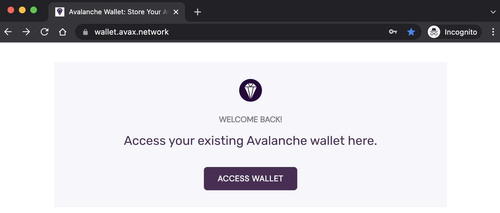

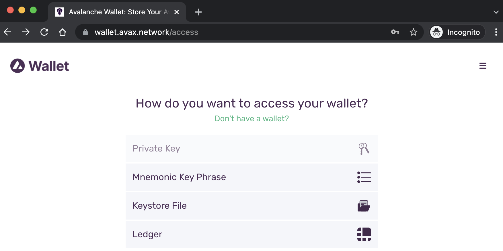

**Step 2.** Use the [pre-funded private key](https://docs.avax.network/build/tutorials/platform/fund-a-local-test-network) to access funds on the X-Chain, C-Chain and P-Chain on the local test network:

```
PrivateKey-ewoqjP7PxY4yr3iLTpLisriqt94hdyDFNgchSxGGztUrTXtNN
```

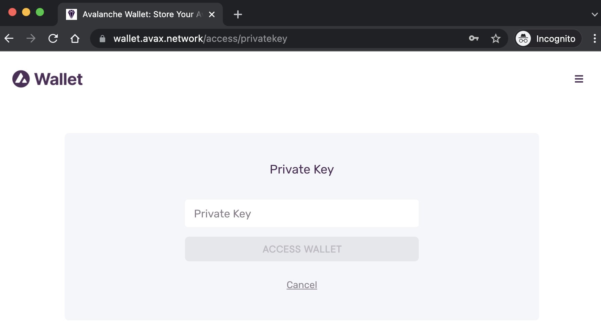

**Step 3.** Once you have access to the wallet, add the custom network -- set `URL` to `http://localhost:9650`:

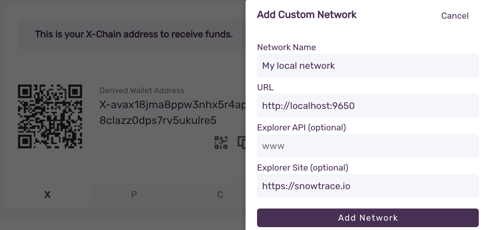

**Step 4.** Select the local network to connect to the local AvalancheGo process and the funds:

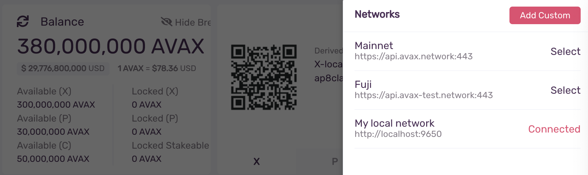

**Step 5.** Create another wallet for the local test network.

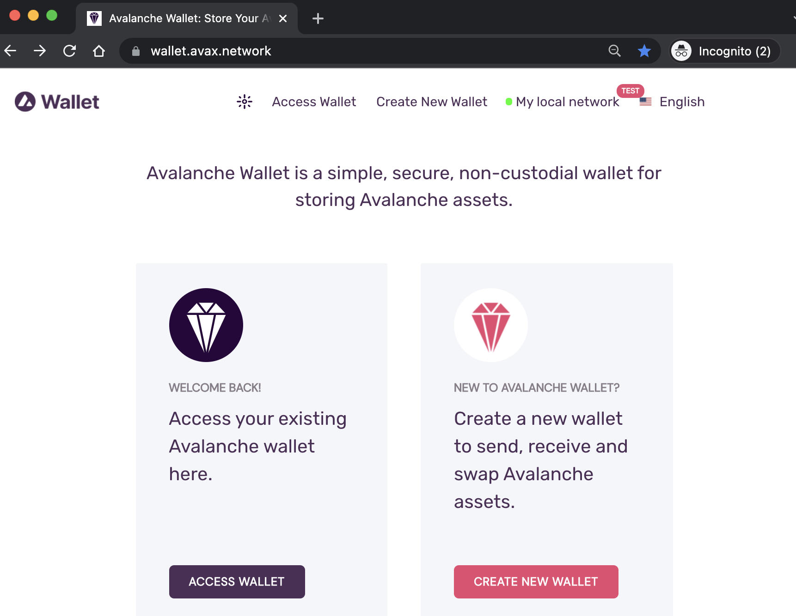

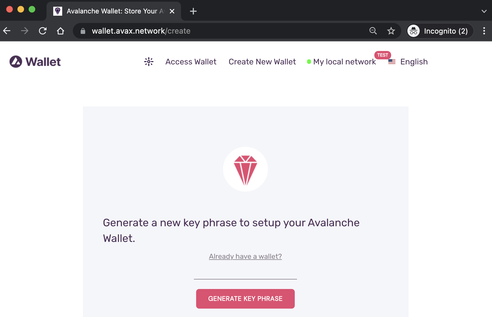

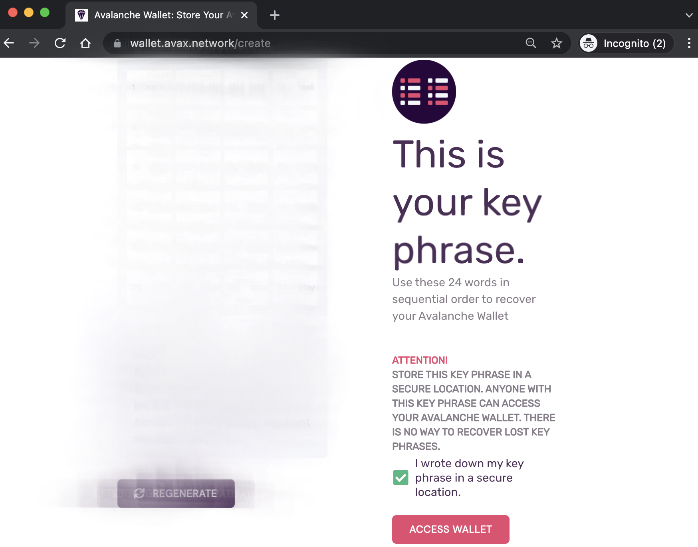

**Step 6.** Once you have access to the other wallet, copy the X-chain wallet address.

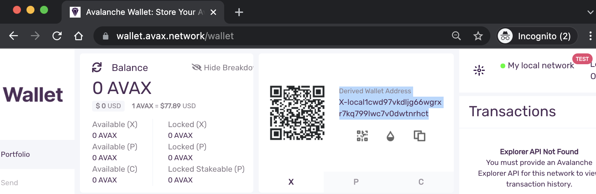

**Step 7.** Try sending tokens from the first wallet to the second.

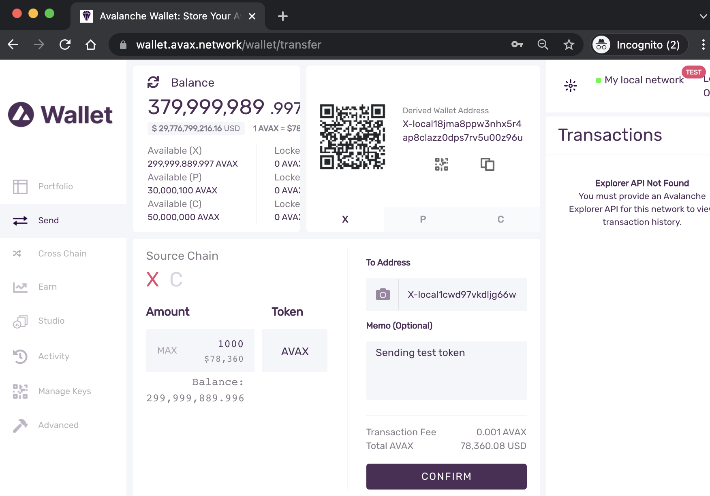

**Step 8.** Make sure the second wallet receives the funds from the first.

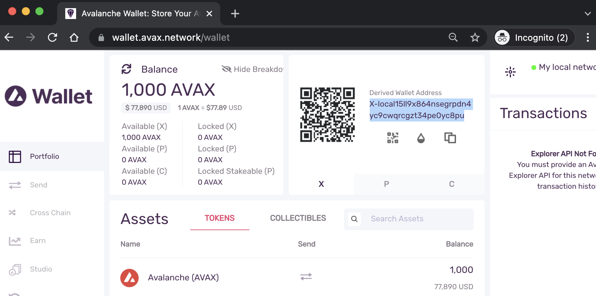

### Test transaction via client API calls

```bash
rm -rf /tmp/avax-tester-db \
&& mkdir -p /tmp/avax-tester-db

kill -9 $(lsof -t -i:9650)
cd ${HOME}/go/src/github.com/ava-labs/avalanchego
./build/avalanchego \
--log-level=verbo \
--network-id=local \
--public-ip=127.0.0.1 \
--http-port=9650 \
--snow-sample-size=1 \
--snow-quorum-size=1 \
--db-dir=/tmp/avax-tester-db \
--staking-enabled=false
```

Now that we created the network, let's [issue API calls to the local network](https://docs.avax.network/build/avalanchego-apis/issuing-api-calls).

**Step 1.** Create a user in the local keystore.

```bash
curl --location --request POST '127.0.0.1:9650/ext/keystore' \
--header 'Content-Type: application/json' \
--data-raw '{
    "jsonrpc":"2.0",
    "id"     :1,
    "method" :"keystore.createUser",
    "params" :{
        "username":"testusername123",
        "password":"insecurestring789"
    }
}'
```

**Step 2.** Import the pre-funded private key to the chains and create addresses:

```
PrivateKey-ewoqjP7PxY4yr3iLTpLisriqt94hdyDFNgchSxGGztUrTXtNN
```

```bash
# X-chain
curl --location --request POST '127.0.0.1:9650/ext/bc/X' \
--header 'Content-Type: application/json' \
--data-raw '{
    "jsonrpc":"2.0",
    "id"     :1,
    "method" :"avm.importKey",
    "params" :{
        "username": "testusername123",
        "password": "insecurestring789",
        "privateKey":"PrivateKey-ewoqjP7PxY4yr3iLTpLisriqt94hdyDFNgchSxGGztUrTXtNN"
    }
}'
# {"jsonrpc":"2.0","result":{"address":"X-local18jma8ppw3nhx5r4ap8clazz0dps7rv5u00z96u"},"id":1}

# P-chain
curl --location --request POST '127.0.0.1:9650/ext/bc/P' \
--header 'Content-Type: application/json' \
--data-raw '{
    "jsonrpc":"2.0",
    "id"     :1,
    "method" :"platform.importKey",
    "params" :{
        "username":"testusername123",
        "password":"insecurestring789",
        "privateKey":"PrivateKey-ewoqjP7PxY4yr3iLTpLisriqt94hdyDFNgchSxGGztUrTXtNN"
    }
}'
# {"jsonrpc":"2.0","result":{"address":"P-local18jma8ppw3nhx5r4ap8clazz0dps7rv5u00z96u"},"id":1}

# C-chain
curl --location --request POST '127.0.0.1:9650/ext/bc/C/avax' \
--header 'Content-Type: application/json' \
--data-raw '{
    "method": "avax.importKey",
    "params": {
        "username":"testusername123",
        "password":"insecurestring789",
        "privateKey":"PrivateKey-ewoqjP7PxY4yr3iLTpLisriqt94hdyDFNgchSxGGztUrTXtNN"
    },
    "jsonrpc": "2.0",
    "id": 1
}'
# {"jsonrpc":"2.0","result":{"address":"0x8db97C7cEcE249c2b98bDC0226Cc4C2A57BF52FC"},"id":1}
```

**Step 3.** Get the list of addresses for the pre-funded key:

```bash
# X-chain
curl -X POST --data '{
    "jsonrpc": "2.0",
    "method": "avm.listAddresses",
    "params": {
        "username":"testusername123",
        "password":"insecurestring789"
    },
    "id": 1
}' -H 'content-type:application/json;' 127.0.0.1:9650/ext/bc/X
# {"jsonrpc":"2.0","result":{"addresses":["X-local18jma8ppw3nhx5r4ap8clazz0dps7rv5u00z96u"]},"id":1}

# P-chain
curl -X POST --data '{
    "jsonrpc": "2.0",
    "method": "platform.listAddresses",
    "params": {
        "username":"testusername123",
        "password":"insecurestring789"
    },
    "id": 1
}' -H 'content-type:application/json;' 127.0.0.1:9650/ext/bc/P
# {"jsonrpc":"2.0","result":{"addresses":["P-local18jma8ppw3nhx5r4ap8clazz0dps7rv5u00z96u"]},"id":1}

# C-chain
curl --location --request POST '127.0.0.1:9650/ext/bc/C/avax' \
--header 'Content-Type: application/json' \
--data-raw '{
    "method": "avax.importKey",
    "params": {
        "username":"testusername123",
        "password":"insecurestring789",
        "privateKey":"PrivateKey-ewoqjP7PxY4yr3iLTpLisriqt94hdyDFNgchSxGGztUrTXtNN"
    },
    "jsonrpc": "2.0",
    "id": 1
}'
# {"jsonrpc":"2.0","result":{"address":"0x8db97C7cEcE249c2b98bDC0226Cc4C2A57BF52FC"},"id":1}
```

**Step 4.** Get the balance of the pre-funded wallet:

```bash
# X-chain
curl -X POST --data '{
  "jsonrpc":"2.0",
  "id"     : 1,
  "method" :"avm.getBalance",
  "params" :{
      "address":"X-local18jma8ppw3nhx5r4ap8clazz0dps7rv5u00z96u",
      "assetID": "AVAX"
  }
}' -H 'content-type:application/json;' 127.0.0.1:9650/ext/bc/X
# {"jsonrpc":"2.0","result":{"balance":"300000000000000000","utxoIDs":[{"txID":"2fombhL7aGPwj3KH4bfrmJwW6PVnMobf9Y2fn9GwxiAAJyFDbe","outputIndex":1}]},"id":1}

# P-chain
curl --location --request POST '127.0.0.1:9650/ext/bc/P' \
--header 'Content-Type: application/json' \
--data-raw '{
    "jsonrpc":"2.0",
    "id"     :1,
    "method" :"platform.getBalance",
    "params" :{
      "address":"P-local18jma8ppw3nhx5r4ap8clazz0dps7rv5u00z96u"
    }
}'
# {"jsonrpc":"2.0","result":{"balance":"30000000000000000","unlocked":"30000000000000000","lockedStakeable":"0","lockedNotStakeable":"0","utxoIDs":[{"txID":"11111111111111111111111111111111LpoYY","outputIndex":1},{"txID":"11111111111111111111111111111111LpoYY","outputIndex":0}]},"id":1}

# C-chain
curl --location --request POST 'localhost:9650/ext/bc/C/rpc' \
--header 'Content-Type: application/json' \
--data-raw '{
    "jsonrpc": "2.0",
    "method": "eth_getBalance",
    "params": [
        "0x8db97C7cEcE249c2b98bDC0226Cc4C2A57BF52FC",
        "latest"
    ],
    "id": 1
}'
# {"jsonrpc":"2.0","id":1,"result":"0x295be96e64066972000000"}
```

**Step 5.** Create another address in X-chain for transfer:

```bash
# X-chain create address
curl -X POST --data '{
    "jsonrpc": "2.0",
    "method": "avm.createAddress",
    "params": {
        "username":"testusername123",
        "password":"insecurestring789"
    },
    "id": 1
}' -H 'content-type:application/json;' 127.0.0.1:9650/ext/bc/X
# {"jsonrpc":"2.0","result":{"address":"X-local1xuaxdx8w8qkz9zn6dznzdrn97ulj2fega77q76"},"id":1}

# X-chain addresses
curl -X POST --data '{
    "jsonrpc": "2.0",
    "method": "avm.listAddresses",
    "params": {
        "username":"testusername123",
        "password":"insecurestring789"
    },
    "id": 1
}' -H 'content-type:application/json;' 127.0.0.1:9650/ext/bc/X
# {"jsonrpc":"2.0","result":{"addresses":["X-local18jma8ppw3nhx5r4ap8clazz0dps7rv5u00z96u","X-local1xuaxdx8w8qkz9zn6dznzdrn97ulj2fega77q76"]},"id":1}
```

**Step 6.** Check the balance and transfer from one to another:

```bash
# X-chain, pre-funded account, transferrer
curl -X POST --data '{
  "jsonrpc":"2.0",
  "id"     : 1,
  "method" :"avm.getBalance",
  "params" :{
      "address":"X-local18jma8ppw3nhx5r4ap8clazz0dps7rv5u00z96u",
      "assetID": "AVAX"
  }
}' -H 'content-type:application/json;' 127.0.0.1:9650/ext/bc/X
# {"jsonrpc":"2.0","result":{"balance":"300000000000000000","utxoIDs":[{"txID":"2fombhL7aGPwj3KH4bfrmJwW6PVnMobf9Y2fn9GwxiAAJyFDbe","outputIndex":1}]},"id":1}

# X-chain, new account, transferee
curl -X POST --data '{
  "jsonrpc":"2.0",
  "id"     : 1,
  "method" :"avm.getBalance",
  "params" :{
      "address":"X-local1xuaxdx8w8qkz9zn6dznzdrn97ulj2fega77q76",
      "assetID": "AVAX"
  }
}' -H 'content-type:application/json;' 127.0.0.1:9650/ext/bc/X
# {"jsonrpc":"2.0","result":{"balance":"0","utxoIDs":[]},"id":1}
```

```bash
# send money
curl -X POST --data '{
    "jsonrpc":"2.0",
    "id"     :1,
    "method" :"wallet.send",
    "params" :{
        "assetID"   : "AVAX",
        "amount"    : 10000,
        "from"      : ["X-local18jma8ppw3nhx5r4ap8clazz0dps7rv5u00z96u"],
        "to"        : "X-local1xuaxdx8w8qkz9zn6dznzdrn97ulj2fega77q76",
        "memo"      : "hi!",
        "username":"testusername123",
        "password":"insecurestring789"
    }
}' -H 'content-type:application/json;' 127.0.0.1:9650/ext/bc/X/wallet
# {"jsonrpc":"2.0","result":{"txID":"27jD3pyGDoz25pE1rujGqHLUYXfGAXGhVMLkSz7aNPE56f5Xhd","changeAddr":"X-local18jma8ppw3nhx5r4ap8clazz0dps7rv5u00z96u"},"id":1}
```

**Step 7.** Check the status of the transaction and confirm that the asset has been transferred:

```bash
# check the transaction status
curl -X POST --data '{
    "jsonrpc":"2.0",
    "id"     :1,
    "method" :"avm.getTxStatus",
    "params" :{
        "txID":"27jD3pyGDoz25pE1rujGqHLUYXfGAXGhVMLkSz7aNPE56f5Xhd"
    }
}' -H 'content-type:application/json;' 127.0.0.1:9650/ext/bc/X
# {"jsonrpc":"2.0","result":{"status":"Accepted"},"id":1}

# X-chain, new account, transferee
curl -X POST --data '{
  "jsonrpc":"2.0",
  "id"     : 1,
  "method" :"avm.getBalance",
  "params" :{
      "address":"X-local18jma8ppw3nhx5r4ap8clazz0dps7rv5u00z96u",
      "assetID": "AVAX"
  }
}' -H 'content-type:application/json;' 127.0.0.1:9650/ext/bc/X
# {"jsonrpc":"2.0","result":{"balance":"299999999998990000","utxoIDs":[{"txID":"27jD3pyGDoz25pE1rujGqHLUYXfGAXGhVMLkSz7aNPE56f5Xhd","outputIndex":1}]},"id":1}

# X-chain, new account, transferee
curl -X POST --data '{
  "jsonrpc":"2.0",
  "id"     : 1,
  "method" :"avm.getBalance",
  "params" :{
      "address":"X-local1xuaxdx8w8qkz9zn6dznzdrn97ulj2fega77q76",
      "assetID": "AVAX"
  }
}' -H 'content-type:application/json;' 127.0.0.1:9650/ext/bc/X
# {"jsonrpc":"2.0","result":{"balance":"10000","utxoIDs":[{"txID":"27jD3pyGDoz25pE1rujGqHLUYXfGAXGhVMLkSz7aNPE56f5Xhd","outputIndex":0}]},"id":1}
```

All these can be automated with [`gyuho/avax-tester`](https://github.com/gyuho/avax-tester). `avax-tester local send` imports the test private key and initiates a test transaction.

For a single node:

```bash
rm -rf /tmp/avax-tester-db \
&& mkdir -p /tmp/avax-tester-db

kill -9 $(lsof -t -i:9650)
cd ${HOME}/go/src/github.com/ava-labs/avalanchego
./build/avalanchego \
--log-level=verbo \
--network-id=local \
--public-ip=127.0.0.1 \
--http-port=9650 \
--snow-sample-size=1 \
--snow-quorum-size=1 \
--db-dir=/tmp/avax-tester-db \
--staking-enabled=false

avax-tester local transfer \
--api-hosts http://127.0.0.1:9650
```

For 2-node cluster:

```bash
avax-tester local create \
--nodes 5 \
--db-dir-path /tmp/avax-tester-db \
--certs-dir-path /tmp/avax-tester-certs \
--cmd-output-path ./avax-tester.bash
```

```bash
avax-tester local transfer \
--api-hosts http://127.0.0.1:9650,http://127.0.0.1:9652
```

### Reference

- [Avalanche documentation](https://docs.avax.network/)
- [Create a Local Avalanche Test Network](https://docs.avax.network/build/tutorials/platform/create-a-local-test-network)
- [Run an Avalanche Node](https://docs.avax.network/build/tutorials/nodes-and-staking/run-avalanche-node)

[↑ top](#run-avalanche-on-local-machine)
